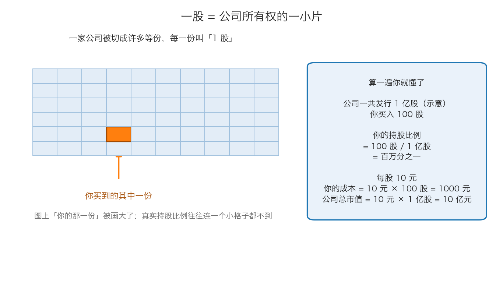
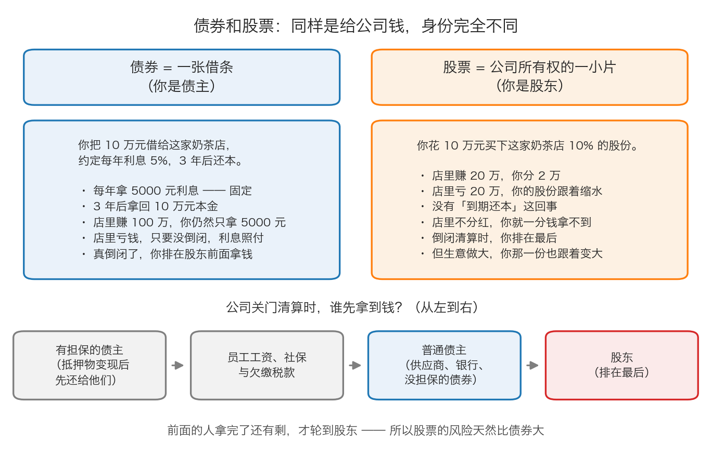

# 第 1 章：股票是什么——一张纸代表一家公司

> 本章你将：
> - 说清"公司"到底是什么，为什么它值得被当成一个独立的"人"来看
> - 理解"股份"就是把一家公司切成很多等份，一份叫一股
> - 知道买了股票之后，你作为股东到底拥有什么、又不拥有什么
> - 知道公司赚钱后，钱是怎么（或者怎么不）到股东手里的
> - 分清债券和股票：一个是债主，一个是主人，公司关门时拿钱的顺序完全不同
> - 走一遍从开户到成交的完整流程，并算清一手要多少钱、买卖一次要交多少费用
> - 最后回答：**这一章的知识，对我的钱包意味着什么**

上一章我们把地图铺开了。从这一章起，我们开始补最基础的那块砖。这块砖要是没砌实，后面 11 周全会歪——所以这一章会讲得比你觉得需要的更细。

---

## 1.1 公司：一个被法律当成"人"的组织

先说"公司"。

你熟悉的是这种场景：几个朋友凑钱开一家奶茶店，赚了钱大家分，亏了钱大家一起扛。**公司就是这种"凑钱做生意"的组织，只不过它多了一个特殊身份——法律把它当成一个独立的"人"来看。**

这个"独立的人"意味着三件事：

1. **它可以自己签合同、自己借钱、自己被告。** 奶茶店欠了供应商的钱，是"奶茶店公司"欠的，不是几个股东私人欠的。
2. **它的钱和股东的钱是分开的。** 公司账上的钱是公司的，不是你的。你不能因为自己投了 10 万，就随手从公司账户里拿 10 万出来买菜。
3. **它可以一直活下去。** 股东可以换、可以去世、可以把股份卖给别人，公司本身不受影响，继续经营。

第三条特别重要。**正是因为公司可以"一直活下去"，股票才有了价值。** 如果一家公司只能活三年，那它的股票就没什么好算的了；正因为理论上它可以经营几十年甚至上百年，我们才会认真讨论"它值多少钱"。

> 💡 **换个说法：** 把公司想成一辆车，股东是车的主人。主人可以换，车还是那辆车，继续在路上跑。

---

## 1.2 股份：把公司切成很多等份

现在问题来了：如果一家公司值 10 亿元，你只有 1 万元，难道就完全没法参与吗？

有办法——**把公司切成很多很多等份，每份很小，小到大多数人都买得起。**

这个"份"就叫**股份**，每一份叫**一股**。公司一共切了多少份，叫**总股本**。

按上面这张图算一遍：

- 公司一共发行 **1 亿股**（这是示意数字，方便你跟着算）；
- 你买入 **100 股**；
- 你的持股比例 = 100 股 除以 1 亿股 = **百万分之一**；
- 每股价格 **10 元**，你的成本 = 10 元乘以 100 股 = **1000 元**；
- 公司总市值 = 10 元乘以 1 亿股 = **10 亿元**。

这里出现了两个必须分清的词：

- **股价**：一股卖多少钱。它是"单价"。
- **市值**：公司所有股票按当前股价算，一共值多少钱。它是"总价"。

$$公司总市值 = 每股价格 \times 总股数$$

> 📌 **划重点：** **股价高低本身说明不了公司大小。** A 公司股价 5 元、总共 100 亿股，市值 500 亿元；B 公司股价 500 元、总共 1000 万股，市值 50 亿元。**股价是 A 的一百倍的 B，其实比 A 小得多。** 菜市场里一斤白菜 3 元、一根冬虫夏草 300 元，光看单价你判断不出哪个"生意大"。

> ⚠️ **易踩坑：** 很多人会说"这只股票太贵了，5 块钱的股票才便宜"。这是把"单价便宜"和"东西划算"搞混了。**决定贵不贵的不是股价这个数字，而是它和公司真实价值的关系。** 这句话是整个 Week 2 的主题。

> 🇨🇳 **落到 A 股/港股：** A 股里"1 亿股"其实算小公司，很多公司总股本在几十亿股甚至上百亿股。所以你买 100 股，持股比例小到几乎等于零——这不影响你享受股价上涨，但意味着**你在股东大会上完全没有话语权**。这是后面几周会反复出现的现实：小股东的意见，公司基本不会听。

---

## 1.3 股东：你买了股票之后，到底拥有什么

买了股票，你就是**股东**——公司的所有者之一。但"所有者"这三个字具体包含什么，需要说清楚，因为很多人把它想多了。

**你拥有的（权利）：**

1. **分红权**：公司决定把利润分一部分给股东时，你有权按持股比例拿一份。
2. **剩余财产分配权**：公司关门清算、把资产卖光、还完所有欠债之后如果还有剩，你有权按比例分。
3. **投票权**：股东大会上对某些事项投票。持股比例太小的话，这一条基本是形式。
4. **知情权**：公司必须定期公开财务报告，你可以去查（第 3 章会教你去哪查）。

**你不拥有的（常见的误解）：**

1. **你不能随便动用公司的钱。** 公司账上的现金是公司的。
2. **你不是公司的员工**，公司没有义务给你发工资。
3. **公司没有义务每年分红。** 这一点最常见也最容易被误解，下一节专门讲。
4. **你不用替公司还债。** 这是"有限责任公司"的关键：最坏情况下你亏掉的是你买股票的那些钱，公司欠的债不会追到你家里来（前提是你没有给公司做担保或者借钱给它）。

> 💡 **换个说法：** 当股东更像是"合伙开店的出资人"，不是"借钱给店里的债主"，也不是"店里的员工"。你享受的是店越做越好带来的好处，承担的是店做砸了的后果。

---

## 1.4 分红：公司赚了钱，钱怎么到你手里

公司赚了钱，你作为股东怎么才能拿到？这是初学者最容易困惑的地方。**答案是：不一定能拿到。**

公司赚到的钱，通常有三个去向：

| 去向 | 说明 | 对股东的意义 |
|---|---|---|
| **分红（派息）** | 把一部分利润现金分给股东 | 你**真的收到钱了** |
| **留存再投资** | 留在公司，用来开新店、买设备、还债 | 你的股票理论上更值钱了，但**你手里没有现金** |
| **回购股票** | 用公司的钱买回自己公司的股票 | 你手上的股票占比变大了，但**你手里没有现金** |

**分红不是必须的。** 公司可以决定十年不分红，只要股东大会上通过。这在 A 股和港股都很常见。

关于分红，有几个 A 股术语你必须知道：

- **每股分红**：每一股分多少钱。例如"每股派 0.82 元"。
- **A 股的写法习惯是"每 10 股派 X 元（含税）"**。所以看到"每 10 股派 8.2 元"，就是每股 0.82 元。
- **股息率**：一年分红除以股价。假设股价 20 元、每股分红 0.82 元，股息率就是 0.82 除以 20 等于 **4.1%**。它的意思是"如果盈利不变，光靠分红，大约多少年能把本金收回来"。
- **除权除息**：分红那天股价会相应地调低。**这不是你亏钱了**，只是把公司账上的钱拿出来分给了你。10 元的股票分掉 0.5 元，第二天开盘参考价就变成 9.5 元。你的总资产（股票市值加现金）在那一刻基本不变。

> ⚠️ **易踩坑：** "分红前后买入能白拿一笔钱"是新手最常见的幻想之一。因为有除权除息，加上分红要交税（持股不满一定期限的，税负更高），**分红本身不会让你凭空变富**。真正重要的是：公司有没有能力持续赚钱、持续分钱。

> 🇨🇳 **落到 A 股/港股：** 港股的分红习惯和 A 股不太一样。港股很多公司习惯**一年分两次**（中期息加末期息），而且港股分红通常以**港币**发放。另外，内地投资者通过港股通买港股分红，还要处理汇率和税收的问题。这些细节 Week 12 讲组合时会再提。

---

## 1.5 债券和股票：同样是给公司钱，身份完全不同

很多人以为"投资"就是用钱换一张纸。这话对了一半——**纸和纸是不一样的。**

最基础的两类证券是**债券**和**股票**。它们的差别，用一句话说就是：

- **债券是借条**：你是**债主**。
- **股票是所有权凭证**：你是**主人之一**。

上图的重点是最后那一排箭头：**公司关门清算时，钱不是平均分的，是有顺序的。**

顺序大致是：先用抵押物变现、还给**有担保的债主**（比如拿厂房抵押借来的贷款）；然后是员工工资、社保和欠缴税款；接着是**所有没有担保的债主**——供应商货款、银行贷款、没担保的债券都在这一层，钱不够就按比例分；**股东排在最后**。

> 📌 **划重点：** 股东排在最后，意味着"前面的人拿完了还有剩，才轮到股东"。在大多数清算案里，轮到股东的时候，往往已经什么都不剩了。**这就是股票的风险天然大于债券的原因**——不是因为股票"更刺激"，而是因为它的求偿顺序最靠后。

正因为股票的风险更靠后、更不确定，它才有可能带来更高的长期回报；也正因为如此，买股票才特别需要"安全边际"——你买的是一家公司的**残值**，你必须买得足够便宜，才能在被排到最后的情况下依然不亏钱。

---

## 1.6 A 股、港股、美股：股票在哪里买卖

刚才说"把公司切成很多份"，那这些份在哪里交易？答案是**交易所**。

- **A 股**：在中国内地上市、用人民币交易的股票。上海证券交易所、深圳证券交易所、北京证券交易所。
- **港股**：在中国香港上市、用港币交易的股票。香港交易所。
- **美股**：在美国上市、用美元交易的股票。纽约证券交易所、纳斯达克。

这三者之间的关系和差别，下一章（第 3 章）专门讲，这里你只要先记住一件事：**同一家公司可以在不止一个地方上市。** 比如福耀玻璃，既有 A 股（600660.SH），也有港股（3606.HK）。理论上它们代表的是同一家公司，但价格常常不一样。这个现象叫"A/H 价差"，Week 9 之后会讲到。

---

## 1.7 从开户到成交：一步一步走一遍

下面是从零开始买第一只股票的全过程，一步都不能少。

**第 1 步：开户。** 找一家**券商**（证券公司）开一个证券账户。现在基本都是手机 App 上刷脸开户，需要身份证和银行卡。你可以把它想成"股市里的银行账户"——**没有它，你根本没法下单。**

**第 2 步：绑银行卡、转账。** 把银行卡里的钱转到证券账户里。这个动作叫"银证转账"，通常只有交易日的固定时间才能转。

**第 3 步：下单。** 在券商 App 里输入股票代码、价格、数量，点"买入"。这一动作叫"委托"——你是把你的买卖意愿**委托给券商**，券商再报到交易所。

**第 4 步：撮合。** 交易所把你和其他所有人的委托放在一起，按规则配对。配上了就叫**成交**。（第 4 章专门讲这是怎么发生的。）

**第 5 步：清算交收。** 成交之后，钱和股票在后台真正换手。

**第 6 步：持有、卖出、再清算。** 卖出后，钱回到你的证券账户，可以继续买，也可以转回银行。

**几个新手必须知道的规矩：**

| 规矩 | 意思 |
|---|---|
| **一手** | 最小的买卖单位，也就是"最少要买多少股"。A 股的**主板、创业板、北交所是 100 股起**，**科创板是 200 股起**。**港股没有统一规定，每只股票的一手股数都不一样**，有 100 股、有 500 股、有 1000 股，买之前必须查清楚 |
| **T+1** | 今天（T 日）买入的股票，**要等下一个交易日才能卖**。A 股是 T+1 制度。港股和美股是 T+0，当天买当天就能卖 |
| **涨跌停** | A 股大部分股票**一天最多涨 10%、最多跌 10%**，到了这个幅度就封住不许再动。创业板和科创板是 20%，北交所是 30%，名字前面带 ST 的风险警示股是 5%。港股和美股**没有涨跌停** |
| **交易时间** | A 股：周一到周五 9:30–11:30、13:00–15:00。港股：9:30–12:00、13:00–16:00。美股：北京时间晚上到凌晨 |
| **手续费** | 买卖都要付给券商，有最低收费标准 |
| **印花税** | **A 股只在卖出时收**。港股买卖两边都收 |

> ⚠️ **易踩坑：** "T+1"只限制**卖出**，不限制资金使用。而且如果你是**卖出**股票，钱当天就能用来买别的股票（只是要下一个交易日才能转回银行卡）。很多人把这两件事搞混。

---

## ✍️ 想一想

1. **假设你买了一家公司的股票，第二天这家公司宣布"今年利润翻倍，但我们决定一分钱不分红，全部拿去建新厂"。你是高兴还是生气？为什么？**
2. **有人说："我只买 5 块钱以下的股票，10 块钱以上的太贵了。"这个说法错在哪里？请用一个具体的例子说明。**
3. **一家公司欠银行 1 亿元，同时发行了股票。如果这家公司今天关门清算，资产只卖了 6000 万元，那么银行拿回多少？股东拿回多少？为什么股票的风险比债券大？**

> 💡 **参考思路：**
> 1. 两种反应都有道理，关键看"钱留在公司能不能赚更多"。如果公司有很好的再投资机会（新建的厂能赚回更高的回报），留存利润会让你的股份将来更值钱，长期看可能比拿现金更好；如果公司只是把钱攥在手里闲置，那你就是白白失去了一次分红。**所以真正该问的问题是：公司留下这笔钱，能不能创造出比自己拿去买别的东西更高的回报？** 这就是后面几周判断管理层好坏的核心标准之一。
> 2. 错在把"单价"当成了"贵贱"。股价只是一个单价，它必须和"一共多少股"以及"公司每年赚多少钱"放在一起看才有意义。举例：A 公司股价 3 元、100 亿股，市值 300 亿元，每年只赚 1 亿元；B 公司股价 80 元、5000 万股，市值 40 亿元，每年赚 4 亿元。B 的股价是 A 的二十多倍，但 B 明显更"便宜"——你花的每一块钱，买到的盈利能力多得多。
> 3. 银行的 1 亿元债权排在股东前面。资产只卖了 6000 万元，所以这 6000 万元**全部**给银行，银行亏 4000 万元；**股东一分钱都拿不到**。这就是求偿顺序的威力：不是你持有的公司资产"按比例"分给你，而是排在后面的人只能捡前面的人剩下的。债券的风险也因此小于股票——只要公司还有资产，债主就有机会拿回大部分；股东的"最低值"就是零。

---

## 🧮 算一算

**情境（**以下费用比率是常见水平，用于教学演示，你的实际费率以开户券商为准；过户费金额很小，本例忽略不计）：

- 你想买 **福耀玻璃（600660.SH）**，假设当前股价 **55 元/股**；
- A 股**主板**是 **100 股**起买，所以你最少要买 100 股（**注意：科创板是 200 股起**）；
- 券商佣金：成交金额的 **万分之二点五**（也就是 0.025%），**最低收 5 元**；
- 印花税：成交金额的 **千分之零点五**（也就是 0.05%），**只在卖出时收**。

**问题：**
（1）买 1 手要花多少钱（不含费用）？
（2）买入这一次，一共要付多少费用？总支出多少？
（3）假设股价涨到 **60 元**你全部卖出，能拿回多少钱？这笔买卖到底赚了多少？
（4）如果只看"股价从 55 涨到 60"，看起来赚了百分之几？实际净赚百分之几？

### 分步解答

**第（1）问：买 1 手的本金**

福耀玻璃在上交所**主板**上市，所以最小买入单位是 100 股，每股 55 元：

$$买入金额 = 55 \times 100 = 5500 元$$

**第（2）问：买入的费用和总支出**

先算佣金：

$$5500 \times 0.00025 = 1.375 元$$

但券商**最低收 5 元**，所以按 5 元收（这是小资金买卖最容易被忽略的地方）。

买入环节没有印花税。所以：

$$买入总支出 = 5500 + 5 = 5505 元$$

**第（3）问：卖出能拿回多少**

卖出金额：

$$60 \times 100 = 6000 元$$

卖出佣金：

$$6000 \times 0.00025 = 1.5 元$$

同样低于 5 元，所以按 **5 元**收。

卖出印花税：

$$6000 \times 0.0005 = 3 元$$

卖出后实际到手：

$$6000 - 5 - 3 = 5992 元$$

这笔买卖的净赚：

$$5992 - 5505 = 487 元$$

**第（4）问：两种"涨幅"**

看起来的涨幅（只看价格）：

$$(60 - 55) \div 55 = 5 \div 55 = 0.0909$$

也就是 **9.09%**。

实际的净赚比例（用你真正掏出去的钱做基数）：

$$487 \div 5505 = 0.0885$$

也就是 **8.85%**。

**结论：** 股价涨了 9.09%，你实际净赚 8.85%。这一次费用吃掉了 **13 元**（买卖两次佣金 10 元加印花税 3 元）。

> 📌 **划重点：** 13 元放在 5505 元里只有 0.24%，看起来不起眼。但请注意那个**"最低 5 元"**：如果你只买 1000 元的股票，买卖两次光佣金最低就要 10 元，**还没开始就已经亏了 1%**。这就是为什么小资金频繁买卖是一件特别不划算的事——**交易成本不会因为你赚不赚钱而消失。**

---

## ✅ 小测验

**1. 关于"股票"，下面哪个说法最准确？**
A. 股票是一种固定收益的理财产品，买了就等着收利息
B. 股票是公司所有权的一小片，买了就成为股东
C. 股票就是一张纸，除了买卖没有别的意义
D. 股票是公司欠股东的借条

**2. 一家公司市值 100 亿元，总股本 20 亿股。它的股价是多少？**
A. 5 元
B. 20 元
C. 50 元
D. 信息不够，算不出来

**3. 关于 A 股的交易规则，下面哪个说法是对的？**
A. 今天买入的股票，今天就可以卖出
B. A 股所有股票都是 10 股起买
C. 今天买入的股票，要到下一个交易日才能卖出；A 股主板是 100 股起买
D. A 股和港股一样，都没有涨跌停限制

> **答案与解析**
>
> **1. B。** 股票的准确定义就是"公司所有权的一小片"，买了就是股东，公司赚的钱理论上有一部分归你。A 错：股票没有固定收益，分红不是必须的，本金也不保。C 错：这张"纸"背后是真实的公司资产和盈利能力，不是纯粹的筹码。D 错：那是**债券**的定义，债券才是借条，股东不是债主——公司清算时股东排在债主后面。
>
> **2. A。** 用"市值除以总股数"：100 亿元除以 20 亿股等于 5 元/股。这道题的用意是让你把"市值 = 股价 乘以 总股数"这个式子反过来用。如果你选了 D，说明你还没把这两个概念分开。
>
> **3. C。** A 股的 T+1 制度就是"今天买、明天才能卖"；A 股主板是 100 股起买。A 错：那是 T+0，港股和美股才是。B 错：A 股主板、创业板、北交所是 100 股起买，**科创板是 200 股起**，都不是 10 股；港股更是每只股票的一手股数都不一样。D 错：A 股有涨跌停（主板 10%，创业板和科创板 20%），港股和美股才没有。

---

## 📖 回到原书

本章是为零基础补的课，原书里没有对应章节（原书默认你已经知道这些）。但原书里有两处正好说到本章的核心，可以对照着读：

- 对应原书 **导言 p8**，`raw/安全边际-中文版/page_008.md`。
  卡拉曼在这里把"股票是什么"说透了：股票不是一张可以买进卖出的纸牌，而是企业所有权的凭证。这一页请**精读**。
- 对应 **附录一 p243–p244**，`raw/安全边际-中文版/page_243.md` 和 `page_244.md`。
  这是那位中文读者的笔记，里面用一句很短的话把股票和债券的区别讲清楚了，可以当参考。
- 可以**略读**：附录一 p244 里那段"沙丁鱼罐头"的故事。它讲的是投机，Week 3 会专门展开，这里先看个热闹。

原书金句（逐字引用）：

> "这种选择就是人所共知的基本面分析方法，这种方法认为股票是它们所代表的企业所有权的凭证。"（导言 p8）

> "问题在于，在这场“股票只是你手中可交易的纸牌”的游戏中，对获得令人兴奋的短期高回报的追逐常常会蒙蔽投资者的眼睛，对自己的愚蠢视而不见。"（导言 p8）

附录一里那位中文读者的概括（**注意：这不是卡拉曼原文，是笔记**）：

> "卡拉曼认为，对于投资者来说，股票代表的是相应企业的部分所有权，债券则是对这些企业的贷款。"（附录一 p243）
