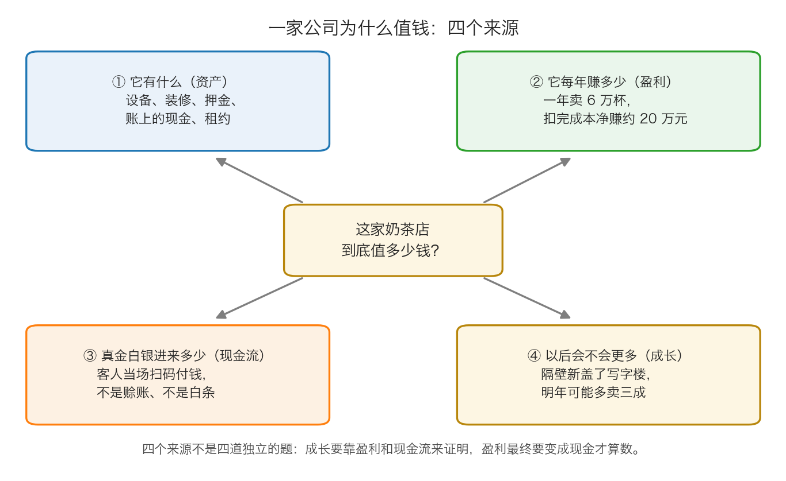
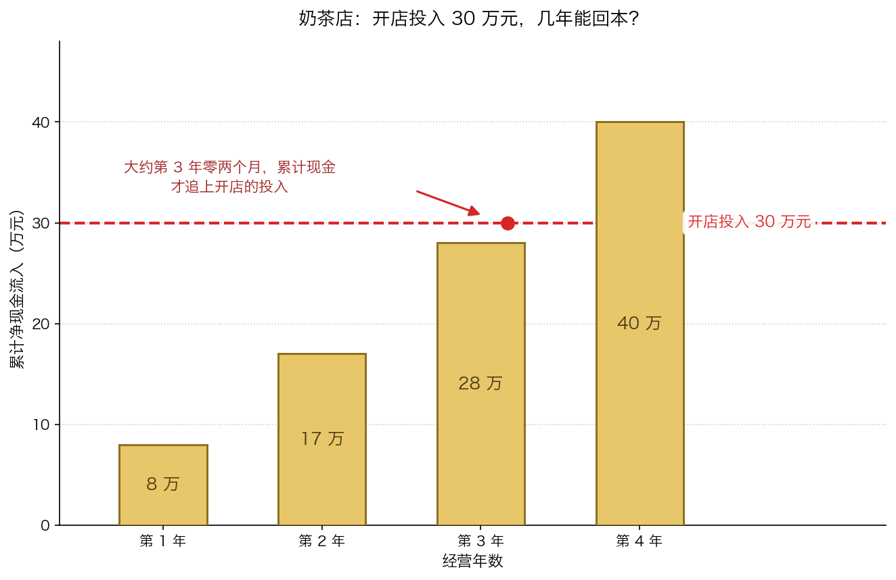

# 第 2 章：公司为什么会值钱

> 本章你将：
> - 说清一家公司的价值来自哪四个地方：资产、盈利、现金流、成长
> - 知道"盈利"和"现金流"为什么不是一回事，以及为什么后者更难造假
> - 看懂"折旧"这种不花钱的成本是怎么影响利润的
> - 用一家奶茶店把这四件事完整算一遍，得出一个"你愿意出的价"
> - 明白为什么"把未来的钱换回今天的钱"必须打折
> - 最后回答：**学会给一家公司估价，对我的钱包意味着什么**

上一章我们弄清了股票是公司所有权的一小片。既然你买的是一家公司的一部分，那么"这家公司值多少钱"就成了你必须回答的问题。这一章我们先不讲怎么算，先讲**它为什么值钱**——搞清楚价值的来源，你才不会被人用一个花哨的公式骗到。

---

## 2.1 从一家奶茶店开始

我们换一个场景。假设你手上有 30 万元，正在考虑盘下一家奶茶店。店主开价 60 万元，说"我这店生意好得很"。

你要不要买？在回答之前，你脑子里会自动冒出几个问题：

- 这家店有什么？（设备、装修、押金、存货、租约还剩几年）
- 它一年能赚多少？（卖了多少钱，扣掉房租、原料、人工还剩多少）
- 赚到的是真金白银，还是账上一堆收不回来的欠条？
- 以后会不会赚得更多？（旁边是不是要盖新写字楼，还是隔壁要开一家更便宜的连锁品牌？）

**这四个问题，就是一家公司价值的四个来源。**

把这四个来源换成专业词，就是：**资产、盈利、现金流、成长**。下面一个一个说，每个都配上 A 股/港股的落地例子。

---

## 2.2 来源一：资产——它有什么

**资产**就是"这家公司名下拥有的东西"。它分两大类。

**有形资产**：看得见摸得着的。

- 现金和银行存款（术语叫"货币资金"）
- 存货（原材料、半成品、还没卖出去的货）
- 厂房、设备、店铺装修（术语叫"固定资产"）
- 公司买下的土地、专利、商标（术语叫"无形资产"，虽然名字里有"无形"，但很多是可以单独卖钱的）

**无形资产**：看不见摸不着，但可能更值钱。

- 品牌：同样一瓶白酒，贴上不同的牌子，价格可以差十倍
- 配方和工艺：可口可乐的配方、茅台的酿造环境
- 客户关系、牌照、渠道、数据

> 🇨🇳 **落到 A 股/港股：**
> - **贵州茅台（600519.SH）** 是"无形资产重于有形资产"的典型。它的厂房设备本身并不神秘，真正值钱的是那块牌子、那个产地、那套工艺——同行砸再多钱也复制不出来。
> - **长江电力（600900.SH）** 是另一个极端：它最值钱的东西是**水电站大坝**，是实打实的重资产。这类公司的报表里"固定资产"这一项特别大，而且每年要计提大量**折旧**（下一节讲）。
> - **腾讯控股（0700.HK）** 是轻资产公司的代表：它的核心资产是用户、社交关系链、游戏和内容，这些都不太出现在资产负债表的"固定资产"里。

**资产的关键问题不是"有多少"，而是"值多少"和"欠多少"。**

同样一家奶茶店，账上写着"设备原价 20 万元"，但这批设备用了三年，二手能卖 3 万还是 8 万？装修花了 15 万，转租的时候房东认不认？这些都要重新看。

而且别忘了负债。**净资产 = 总资产 - 总负债。**

$$账面净资产 = 总资产 - 总负债$$

> ⚠️ **易踩坑：** 一家公司"资产很多"不等于"很值钱"。如果它的资产是靠借一大堆钱买来的，那这些资产里有一大块是别人的。后面会讲到的**破净股**（股价低于每股净资产），很多就是这种情况——账面看起来很便宜，实际上资产质量很差，或者欠债太多。这是 Week 7 之后要重点防的"便宜陷阱"。

---

## 2.3 来源二：盈利——它每年赚多少

**盈利**就是"一年下来，收入扣掉各种成本费用之后，还剩多少"。

它的算法，其实和你算奶茶店一个月赚多少完全一样：

$$利润 = 收入 - 成本 - 费用$$

**收入**：卖了多少钱。奶茶店卖 6 万杯，一杯 12 元，收入就是 72 万元。

**成本**：直接和这杯奶茶有关的钱。奶、茶、杯子、吸管、糖浆。

**费用**：不和单杯挂钩、但每个月都要花的钱。房租、员工工资、水电、外卖平台抽成、广告费。

**利润**：剩下的。

奶茶店的示意账（**下面是简化示意数字，方便你跟着算，不是任何真实店铺的账**）：

| 项目 | 金额（万元/年） |
|---|---|
| 收入 | 72 |
| 减：原料成本 | 22 |
| 减：房租 | 12 |
| 减：人工 | 12 |
| 减：水电和其他 | 6 |
| **利润** | **20** |

**盈利是价值最重要的来源之一，因为它可以年复一年地产生。** 资产是"存量"（现在有多少），盈利是"流量"（每年进来多少）。一家公司如果每年稳定赚 20 万，它的价值显然远高于它账上那点设备。

**但盈利有一个软肋：它是算出来的，不是收上来的。**

利润表上的数字要经过很多判断：设备按几年折旧、存货值多少钱、这笔货款收不收得回来、这笔诉讼要不要提前计提……同一家公司，换一个会计估计，利润能差出一大截。这就是为什么专业的价值投资者，永远要看下一个来源。

> 💡 **换个说法：** 利润像"你这个月业绩考核得了多少分"，现金流像"你这个月实际拿到手多少工资"。分数可以因为规则调整而变，工资是真到账的。

---

## 2.4 来源三：现金流——真金白银进来多少

**现金流**就是"钱实际进出公司的流水账"。

它和利润的区别，用一句话说：**利润是"应该赚到的"，现金流是"实际收到的"。**

三个最常见的差异来源：

**第一，赊账。** 你卖给客户 10 万元的货，开了发票，会计上就算收入、算利润。但如果客户说"三个月后付款"，那这 10 万元此刻一分钱都没到账。**利润有了，现金没有。**

**第二，折旧。** 这是最反直觉的一条。你花 30 万元买的设备，会计上不会一次性算作成本，而是分成 10 年、每年算 3 万元成本。**这 3 万元在利润表上是一笔"费用"，但今年你并没有真的掏这 3 万元现金。** 所以有些公司利润不高，现金流却挺好——长江电力就是典型：水电站大坝每年折旧金额巨大，压低了账面利润，但大坝实际上还能用几十年，不需要每年真的花这笔钱。

**第三，预收。** 反过来，客户先付钱、你后交货（比如健身房年卡、白酒经销商的预付款），现金先到，利润后确认。这时候现金流比利润好看。

**价值投资者最看重的一个指标叫"自由现金流"：**

$$自由现金流 = 经营赚到的现金 - 维持生意必须花掉的钱$$

用大白话说：**公司正常运转一年，真正能自由支配的钱有多少。** 这笔钱可以用来分红、回购股票、还债、收购别的公司——它是股东回报的真正来源。

> 📌 **划重点：** 为什么现金流比利润更"硬"？因为一张发票可以开出来，一笔应收款可以挂很久，但**银行账户里的余额不会说谎**。一家长期利润漂亮、现金流却持续为负的公司，迟早会出问题。

**关于"未来的钱"，还有一个必须知道的常识：今天的 100 元比明年的 100 元值钱。**

原因有三个：今天的钱你可以存银行拿利息、今天的钱可以马上花掉、明年的钱不一定收得回来。

所以，如果要把"未来的钱"换算成"相当于今天的多少钱"，就要反过来除以一个大于 1 的数。假设你要求每年 10% 的回报：

| 时间 | 那笔钱 | 换算成今天的钱 | 怎么算的 |
|---|---|---|---|
| 今天 | 100 元 | 100 元 | 就是它本身 |
| 第 1 年后 | 110 元 | 100 元 | 110 除以 1.1 |
| 第 2 年后 | 121 元 | 100 元 | 121 除以 1.1，再除以 1.1 |
| 第 3 年后 | 133.1 元 | 100 元 | 133.1 除以 1.1，再除以两次 1.1 |

反过来说，今天 100 元，按每年 10% 往后长：100 到 110（第 1 年）到 121（第 2 年）到 133.1（第 3 年）。

> 💡 **换个说法：** "把未来的钱换回今天的钱"这件事叫**折现**。它的核心动作只有两个——**往后长就乘以大于 1 的数，往前换就除以大于 1 的数**。Week 2 会用一整章把这个动作练熟，这里你只要先接受"未来的 110 元等于今天的 100 元"这个感觉。

**用奶茶店把回本这件事算清楚：**

假设开店投入 30 万元，之后每年净现金流入分别是 8 万、9 万、11 万、12 万（**示意数字**）。累加起来：8、17、28、40。第 3 年结束时累计 28 万，还差 2 万；第 4 年一年进 12 万，2 万大约相当于其中的两个月——所以**大约要到第 3 年零两个月，累计收到的现金才追上开店的 30 万元投入。** 这就是"回本"的直观含义。

> 🇨🇳 **落到 A 股/港股：** A 股年报里的"**经营活动产生的现金流量净额**"就是上面说的"经营赚到的现金"。它和利润表上的"净利润"是两个不同的数字，而且经常差很多。养成一个习惯：**看到一家公司利润很好，先去现金流量表里找这个数，看它对不对得上。** 对不上的，先打个问号。

---

## 2.5 来源四：成长——以后会不会更多

前三个来源讲的都是"现在"。第四个来源讲"以后"。

**成长**就是"未来能赚的比现在多多少"。

奶茶店的成长可能来自：隔壁新盖了一栋写字楼、开通了外卖、推出了新的爆款、在隔壁街开了第二家店。

成长为什么值钱？因为如果一家公司每年赚的现金能持续变多，把它所有未来的钱都折回今天，加起来的数会大得多。

**但成长也是最危险的一个来源。** 原因有两个：

**第一，成长很难预测。** 资产可以数、利润可以查，但"明年会不会多卖三成"是猜的。卡拉曼在附录一里被概括过这个观点：找到"可能让企业收益增长的来源"，比预测"最终会增长多少"要简单得多（附录一 p249–p250）。

**第二，人们习惯为成长付太高的价。** 因为成长看起来很美，大家愿意为"以后会很好"支付很高的溢价。一旦成长没兑现，价格就会塌下来。

> ⚠️ **易踩坑：** "讲故事"最容易贵。一家公司如果靠"明年要进军新领域""行业空间万亿"来支撑股价，你要格外小心。**成长必须能被盈利和现金流证明，否则它就只是希望。** 这是后面几周反复出现的主题：警惕"价值骗子"。

---

## 2.6 四个来源合起来，得出一个"你愿意出的价"

现在回到开头那家奶茶店。店主开价 60 万元，你怎么判断？

**第一步：算资产这一块。** 设备二手能卖 8 万，装修不值钱，押金能退 3 万，存货 2 万，账上还有 2 万现金。加起来 **15 万元**。这是"今天关门散伙"能拿回的底线。

**第二步：算未来现金这一块。** 你判断这家店还能开 10 年，之后生意就不好做了；估计每年能稳定净收 **12 万元**。10 年加起来是 120 万元。

**第三步：给未来的钱打折。** 因为未来不确定，而且今天的钱更值钱，你不会按 120 万算。假设你统一打 **6 折**（这个折扣怎么定，是 Week 2 和 Week 9 要专门讲的）：120 乘以 0.6 等于 **72 万元**。

**第四步：加总。**

$$你估的价值 = 15 + 72 = 87 万元$$

**第五步：和报价比较。**

- 店主开价 **60 万元**：你估 87 万，中间有 **27 万元**的空间。这笔买卖可以做。
- 店主开价 **100 万元**：比你估的 87 万还高，**没有空间，不买。** 哪怕他说得天花乱坠。

**这个"87 减 60 等于 27 万"的空间，就是安全边际。**

$$安全边际 = 保守估算的价值 - 买入价$$

> 📌 **划重点：** 请注意上面五步里最关键的两个字——**保守**。
> 资产按能卖掉的价算，不按原价算；未来现金按"还能开 10 年"算，不按"永远开下去"算；未来的钱统一打折，不打成原价。
> **安全边际不是"我算出来 87 万所以 87 万就安全"，而是"我按最保守的方式算出来 87 万，然后只在 60 万的时候买"。**

---

## 2.7 那么它到底值多少钱

到这里，你已经知道了价值的四个来源，也知道了一个大概的算法。但真正的难题一个都还没解决：

- 一家公司的资产，到底该怎么估值？账面写 100 亿，实际值 100 亿吗？
- 未来每年的现金流，怎么预测？预测几年？之后呢？
- "打 6 折"这个折扣，凭什么打 6 折而不是 8 折？打错了会怎样？
- 如果一家公司不赚钱、现金流是负的，它还有价值吗？
- 股价里已经包含了多少"成长"的预期？这些预期兑现不了会怎样？

**这些问题，就是"估值"。下周（Week 2）我们会用一整周，把估值这件事从头学一遍**——包括怎么看懂资产负债表、利润表、现金流量表这三张表，怎么用市盈率、市净率、股息率这些常见指标，以及那个"打折"到底怎么打。

在那之前，你只需要记住这一章最重要的一句话：

> **价格是别人喊出来的，价值是公司自己赚出来的。你不必知道价格会怎么变，但你必须知道它大概值多少。**

---

## ✍️ 想一想

1. **有两家公司，利润完全一样，都是一年赚 1 亿元。A 公司的利润全部收回了现金，B 公司的利润有一半是"客户欠着、明年再说"。如果两家公司股价一样，你更愿意买哪一家？为什么？**
2. **一家公司买设备花了 30 万元，会计上分 10 年折旧、每年算 3 万元成本。请问：这 3 万元是公司今年真的花掉的钱吗？如果不是，它为什么会出现在利润表上？这对我们判断公司价值有什么影响？**
3. **"成长"能让一家公司更值钱，但为什么卡拉曼反复警告不要为成长付太高的价？如果一家公司的股价里已经包含了"未来十年每年增长 30%"的预期，而它实际只增长了 15%，股价会发生什么？**

> 💡 **参考思路：**
> 1. 更愿意买 A。因为 A 的利润是"已经到手的现金"，B 的利润里有一半是"别人欠着的承诺"。欠款有可能收不回来，需要计提坏账，也可能被拖很久。**利润相同的两家公司，现金含量高的那家质量更好。** 这也是为什么现金流量表比利润表更难被"修饰"。
> 2. 不是真的花掉。折旧是把过去已经花掉的钱（买设备的 30 万元），分摊到以后每一年里当作成本。它出现在利润表上，是为了让"买设备"这笔大支出不至于把某一年的利润砸穿，也更符合"设备用一年就消耗一部分价值"的现实。影响是：**账面利润被折旧压低了，但公司实际可支配的现金没有减少。** 所以看到"利润一般但现金流很好"的重资产公司（比如水电站、高速公路），不要立刻下结论说它不赚钱。
> 3. 因为成长是四个来源里最不确定的一个，而市场习惯用最乐观的假设给它定价。一旦实际增速低于预期，跌的不只是"预期差"，还有"估值倍数"——股价里那部分"为成长付的溢价"会一起消失，这叫**双重打击**。所以卡拉曼的态度是：把成长当成"可能的额外好处"，而不是"必须兑现的承诺"；估值时宁可假设它不成长，成长了算是赚到。

---

## 🧮 算一算

**情境（**下面的数字是简化示意数字，用于教学练习）：

- 盘下一家奶茶店，需要一次性投入 **30 万元**（设备、装修、押金、首批原料）。
- 你估计它还能开 **4 年**，之后商圈变了就做不下去。
- 每年的净现金流入（收入减掉所有支出）分别是：**第 1 年 8 万元，第 2 年 9 万元，第 3 年 11 万元，第 4 年 12 万元**。
- 4 年后散伙，设备、押金、存货加起来还能收回 **6 万元**。
- 因为未来不确定，你决定给"未来收到的所有钱"统一打 **7 折**。

**问题：**
（1）4 年累计的净现金流入是多少？
（2）4 年后收回的残值是多少？打折后是多少？
（3）4 年的现金流入总共打折后是多少？
（4）你估算的这家店的价值是多少？
（5）如果店主开价 **35 万元**，安全边际是多少？如果开价 **25 万元**呢？

### 分步解答

**第（1）问：4 年累计净现金**

$$8 + 9 + 11 + 12 = 40 万元$$

**第（2）问：残值**

残值本身是 6 万元，但你不会按原价算，要打 7 折：

$$6 \times 0.7 = 4.2 万元$$

**第（3）问：4 年现金流入打折后**

$$40 \times 0.7 = 28 万元$$

**第（4）问：你估算的价值**

把"未来的现金"和"散伙时能收回的残值"加在一起：

$$28 + 4.2 = 32.2 万元$$

**你估这家店值 32.2 万元。**

顺便算一下净赚：投入 30 万元，未来打折后能收回 32.2 万元，差额是：

$$32.2 - 30 = 2.2 万元$$

**这就是问题所在：按这么保守的算法，这家店只比"白干四年"好一点点。** 这个结论很重要——它告诉你，**这门生意的要价如果超过 32.2 万元，就不值得做。**

**第（5）问：两种报价下的安全边际**

店主开价 **35 万元**：

$$安全边际 = 32.2 - 35 = -2.8 万元$$

**负的。也就是说：比你的估值还贵，不买。** 这时候不要去想"会不会谈到 33 万就划算了"，而应该想"我的估值本身是不是已经太乐观了"。

店主开价 **25 万元**：

$$安全边际 = 32.2 - 25 = 7.2 万元$$

**正的，而且相当于估值的两成多。**

安全边际相对于估值的比例：

$$7.2 \div 32.2 = 0.224$$

也就是大约 **22%**。

> 📌 **划重点：** 这道题里没有出现任何一个超过初中数学的运算，全部是加法、减法、乘法和百分比。**估值这件事的门槛不在数学，而在"你敢不敢把假设设得足够保守"。** 绝大多数人亏钱，不是因为算错了小数位，而是因为把"明年会更好"当成了事实。

---

## ✅ 小测验

**1. 关于"利润"和"现金流"，下面哪个说法是对的？**
A. 利润和现金流永远是同一个数字
B. 利润是"应该赚到的"，现金流是"实际收到的"，两者经常不一样
C. 现金流比利润更容易被会计手法修饰
D. 只要利润高，现金流是多少都不重要

**2. 一家公司花 30 万元买设备，会计上分 10 年折旧、每年计 3 万元成本。下面哪个说法是对的？**
A. 公司每年真的花掉了 3 万元现金
B. 这 3 万元不是当年真实支出的现金，但会压低当年账面利润
C. 折旧是一种逃税手段，不应该被允许
D. 折旧会让公司的现金流减少 3 万元

**3. 你估算一家奶茶店值 40 万元，店主开价 46 万元。按照本章的方法，你应该怎么做？**
A. 买，因为 46 万只比 40 万多一点点
B. 买，因为价格可以再谈
C. 不买，因为报价高于你估的价值，安全边际是负的
D. 不买，但可以再把自己的估值调高到 46 万以上，这样就有安全边际了

> **答案与解析**
>
> **1. B。** 利润是按会计准则"算"出来的，现金流是银行账户里真实进出的钱。两者的差异主要来自赊账、折旧、预收这三种情况。A 错：这两者经常差很多，尤其对重资产公司和赊销为主的公司。C 错：正好相反，**现金流更难修饰**，因为银行存款余额不会说谎。D 错：长期"利润漂亮、现金流为负"的公司，迟早出问题——这正是要警惕的信号。
>
> **2. B。** 折旧是把过去一次性花掉的 30 万元，分摊到以后每一年当作成本，所以它压低账面利润，但当年并没有真的再花一笔现金，也不影响经营现金流。A 错：现金早在买设备那年就花掉了。C 错：折旧是会计上匹配"收入与成本"的正常做法，不是逃税手段。D 错：折旧是非现金项目，不会让现金流减少。
>
> **3. C。** 46 万高于你估的 40 万，安全边际是 40 减 46 等于负 6 万元，应该放弃。A 错：安全边际的作用就是让你在"差一点"的时候果断说不。B 错：能不能谈是另一回事，但如果谈不到 40 万以下，你就不该买。D 最危险——**为了让一笔想做的交易显得合理，回头去改自己的估值假设**，这是亏钱最经典的路径之一，后面几周会专门讲这种自我欺骗。

---

## 📖 回到原书

本章是为零基础补的课，原书没有对应的"入门章节"，但原书里有几处正好说到本章的核心：

- 对应 **附录一 p249–p250**，`raw/安全边际-中文版/page_249.md` 和 `page_250.md`。
  这里概括了卡拉曼评估企业价值的三种方式（净现值法、清算价值法、股市价值法），以及他对"预测成长"的警告。**建议精读**这两页，Week 9 会正式展开。
- 对应 **导言 p9**，`raw/安全边际-中文版/page_009.md`。
  卡拉曼在这一页说清了价值投资者的第一目标，以及安全边际为什么必不可少。**建议精读**。
- 可以**略读**：附录一 p246 里关于复利和亏损的那一段。里面举的例子本身数字有点问题（笔记作者自己也在括号里指出来了），但结论是对的——**一次巨额亏损很难恢复过来**。

原书金句（逐字引用）：

> "相反的，价值投资者第一目标是保证资金安全。很自然地，为了避免未来较大的损失，价值投资者会寻找安全边际，以便为不准确、坏运气、逻辑上的错误留下缓冲地带。由于估值是一项非精确的艺术，未来是不可预测的，投资者也是人，难免会犯错，所以安全边际是万万不可少的。"（导言 p9）

> "由于估值是一项非精确的艺术，未来是不可预测的，投资者也是人，难免会犯错，所以安全边际是万万不可少的。"（导言 p9）

附录一里那位中文读者转引的格雷厄姆的话（**注意：这是转引，不是卡拉曼原文**）：

> "证券分析的目的仅仅是确定价值是否足够支持购买一种债券或者股票，对内在价值粗略和大致的衡量就可能足以达到这样的目的了。"（附录一 p249）
