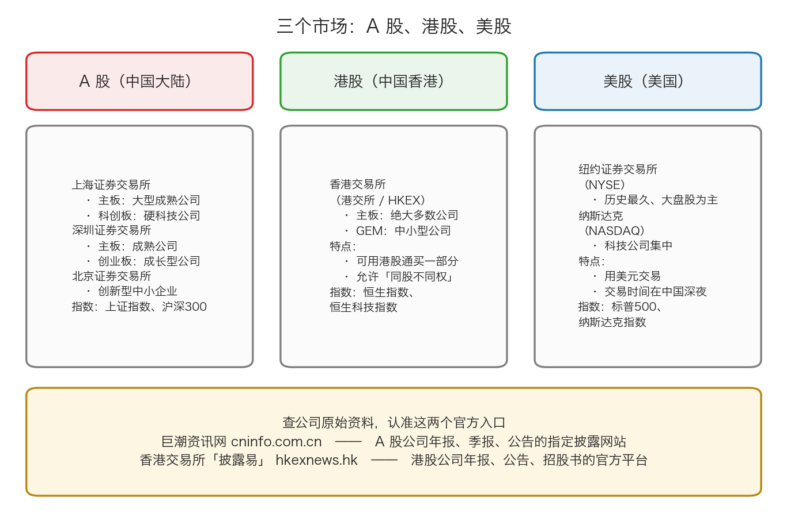

# 第 3 章：股市在哪里——A 股、港股与美股

> 本章你将：
> - 知道中国内地、中国香港、美国三个市场各有哪些交易所
> - 分清主板、创业板、科创板、北交所分别在服务什么样的公司
> - 说清指数是什么，以及上证指数、沪深 300、恒生指数分别在代表谁
> - 记住查公司原始资料的两个官方入口，并知道去里面找哪一份文件
> - 说清 A 股和港股在交易规则上的主要差别（一手、T+0/T+1、涨跌停、印花税、交易时间）
> - 最后回答：**知道一家公司在哪个市场上市、去哪里查它，对我的钱包意味着什么**

上一章我们弄明白了公司为什么值钱。但"值钱"是一回事，"在哪里买卖"是另一回事。这一章我们把这几个市场走一遍——不是为了让你马上开户，而是为了让你以后看到任何一条财经新闻时，知道它在说哪个场子里的故事。

---

## 3.1 三个市场，三种身份

先把最基础的一层说清楚：**同一个国家或地区，通常只有一个（或少数几个）正规的股票交易所。**

我们关心的三个市场是：

| 市场 | 在哪里 | 用什么钱买 | 主要交易所 |
|---|---|---|---|
| **A 股** | 中国内地 | 人民币 | 上交所、深交所、北交所 |
| **港股** | 中国香港 | 港币 | 香港交易所 |
| **美股** | 美国 | 美元 | 纽交所、纳斯达克 |

注意"港股"这个叫法。**香港是中国的一部分，但香港的证券市场是一个独立运作的市场**，有自己的交易规则、自己的监管机构、自己的货币（港币）。所以我们在课程里把它单独列出来讲。

> 💡 **换个说法：** 把 A 股、港股、美股想成三个不同的菜市场。三个市场里都可能卖同一家的菜（比如福耀玻璃同时在 A 股和港股上市），但摊位费、结账方式、开市时间都不一样。

---

## 3.2 中国内地：三个交易所

**上海证券交易所（上交所）**，1990 年成立，和深交所同为中国内地最早的两家证券交易所。它主要是大型成熟公司的主场。它下面有两个板块：

- **主板**：大型、成熟、盈利稳定的公司。中国石油（601857.SH）、招商银行（600036.SH）都在这里。
- **科创板**：2019 年设立，服务"硬科技"公司，允许还没盈利的公司上市，涨跌停幅度是 20%，开户需要额外满足门槛条件。**另外它有一个容易忽略的细节：最小买入单位是 200 股起，而不是 100 股。**

**深圳证券交易所（深交所）**，1990 年成立。它下面也有两个板块：

- **主板**：成熟公司。深市的主板里有很多消费、电子、医药行业的公司。
- **创业板**：2009 年设立，服务成长型创新创业公司，涨跌停幅度也是 20%，同样有开户门槛。

**北京证券交易所（北交所）**，2021 年设立，服务创新型中小企业。规模比上交所、深交所小得多，但它是中国内地第三个证券交易所。

> 📌 **划重点：** 记住一句话就够了——**上交所和深交所是主战场，北交所是小而新的补充。** 板块的差别主要在于：公司处在什么阶段、允许不允许还没盈利就上市、涨跌幅限制是多少、开户有没有门槛。

---

## 3.3 中国香港：香港交易所

**香港交易所（港交所，HKEX）**是中国香港唯一的证券交易所运营机构。它下面主要有两个板块：

- **主板**：绝大多数港股公司在这里，包括腾讯控股（0700.HK）、中国神华（1088.HK）。
- **GEM**：以前叫创业板，服务中小型公司，规模和关注度都小得多。

港股有几个对内地投资者特别重要的特点：

1. **可以用港股通买一部分港股。** 内地投资者不需要去香港开户，通过自己现有的 A 股账户就能买**港股通标的**（一份名单，不是所有港股都能买）。
2. **允许"同股不同权"。** 就是同一家公司的股票可以分成两种：一种投票权大、一种投票权小。很多互联网公司用这种结构，创始人用较少的股份掌握较大的投票权。这在 A 股主板目前是不允许的（科创板和创业板有条件地允许，具体以交易所最新规则为准）。
3. **没有涨跌停。** 一天跌 30% 是可能发生的。
4. **交易货币是港币。** 你买港股要用港币，卖出拿回的也是港币。

> ⚠️ **易踩坑：** 港股通买港股，分红要交 20% 的红利税，而且分红是以港币发放的，中间还涉及汇率换算。很多人算港股股息率时，直接拿 A 股的习惯去套，结果算出来偏乐观。另外，港股通不是开了 A 股账户就能自动买——要在券商那里单独开通"港股通"权限，个人投资者有 50 万元资产的门槛（以券商最新规定为准）。更细的规则以交易所和券商最新公布为准。

---

## 3.4 美国：纽交所与纳斯达克

**纽约证券交易所（NYSE）**：历史最悠久，以大盘股为主。

**纳斯达克（NASDAQ）**：科技公司集中，很多知名的互联网和半导体公司在这里。

美股的几个特点：用美元交易；**交易时间大致对应北京时间晚上到次日凌晨**（所以做美股的人经常熬夜）；没有涨跌停；T+0，当天买当天就能卖。

> 🇨🇳 **落到 A 股/港股：** 本课程的主战场是 A 股和港股，美股只在需要对比规则时提到。原因很实际：**你的生活、你的收入、你最有信息优势的地方，都在中文世界里。** 买一家你能看懂它卖什么、能去店里看到它生意的公司，比买一家你只在新闻里见过的公司要安全得多。

---

## 3.5 指数：一个数代表一整个市场

你打开财经新闻，看到的往往是这样的句子："今天沪指涨了 0.8%""恒生指数跌破某关口"。

**指数就是把一篮子股票的价格按某种规则算成一个数，用来代表"这一篮子股票整体涨了还是跌了"。**

最常见的算法是**按市值加权**——公司越大，对指数的影响越大。用一句话说：**谁体量大，谁说话声音大。**

三个你一定会遇到的指数：

| 指数 | 代表什么 | 发布方 |
|---|---|---|
| **上证指数**（上证综合指数） | 上交所**全部**上市股票（2020 年 7 月修订后剔除 ST/*ST 风险警示股，并纳入科创板股票；以官方最新规则为准）的整体表现 | 上交所（指数由中证指数有限公司受托编制维护） |
| **沪深 300** | 从上海和深圳两个市场里挑出**规模大、流动性好（买卖活跃、想卖的时候容易卖掉）的 300 只**股票 | 中证指数公司 |
| **恒生指数** | 港股里**最具代表性的一批公司** | 恒生指数公司 |

> 💡 **换个说法：** 上证指数像"全校平均分"，包含的人多但水平参差；沪深 300 像"重点班平均分"，只挑最大的 300 家，更能代表中国大公司的整体状况；恒生指数像"香港全校平均分"。

**为什么你需要知道指数？** 因为它是最常用的"参照物"。别人会问你："你今年赚了几个点？跑赢沪深 300 了吗？"

对于参照物这件事，卡拉曼有一个非常鲜明的态度——**他反对用相对表现来评价投资**。原书里说，大多数市场人士"首先关心回报——它们能赚多少，而甚少关心风险——它们会损失多少"，而价值投资者恰恰相反（导言 p9）。这一点 Week 8 会专门讲，这里先埋个种子：**"跑赢指数"和"赚到钱"是两件不同的事。**

> ⚠️ **易踩坑：** 指数涨了，不代表你手里的股票涨了；指数跌了，也不代表你亏了。指数只是"平均水平"，它是一个参照物，不是你的成绩单。

---

## 3.6 去哪里查一家公司的真实资料

这是本章最实用的一节。以后你要研究任何一家公司，都从这几个入口开始。

| 查什么 | 去哪里 | 网址 |
|---|---|---|
| **A 股公司**的年报、季报、公告 | **巨潮资讯网**（中国证监会指定的信息披露网站） | `cninfo.com.cn` |
| A 股公司的公告（备用） | 上交所官网 / 深交所官网 | `sse.com.cn` / `szse.cn` |
| **港股公司**的年报、公告、招股书 | **香港交易所「披露易」** | `hkexnews.hk` |
| 美股公司的年报（10-K 等） | 美国证监会 EDGAR 数据库 | `sec.gov/edgar` |
| 公司自己的说法 | 公司官网的"投资者关系"栏目 | 各公司官网 |

**在年报里，你要找的东西大概在哪：**

1. **「公司简介」或「业务概述」**：这家公司靠什么赚钱。
2. **「管理层讨论与分析」**（A 股年报通常叫"第三节"）：管理层自己解释今年干得怎么样、为什么。
3. **「财务报告」里的三张表**：
   - **合并资产负债表**：某一时点上，公司有什么（资产）、欠什么（负债）。
   - **合并利润表**：一整年，收入多少、成本多少、利润多少。
   - **合并现金流量表**：一整年，钱实际怎么进出的。
4. **「利润分配」或「分红」相关章节**："每 10 股派 X 元"。
5. **「股本」或「股东情况」**：总股本是多少、谁是大股东。

> 📌 **划重点：** **只信原始文件。** 群里的截图、短视频里的"内部消息"、公众号的分析，都是二手的。二手信息的问题是：你无法判断它是不是漏掉了关键的一句，也无法判断它是不是有立场。**而年报是公司在法律上必须真实披露的文件，说假话要担责任。**

> 🇨🇳 **落到 A 股/港股：** 港股的"披露易"比很多人想的更好用。它支持按公司代码搜索，公告按时间倒序列出，年报通常在"财务报表/环境、社会及管治资料"分类里。**港股年报一般比 A 股年报更长、更细**，常常三四百页，但排版也更清晰，读起来反而省力。

---

## 3.7 A 股与港股：交易规则的主要差别

如果你以后两边都想碰，这张表必须记住。

| 项目 | A 股 | 港股 |
|---|---|---|
| 交易货币 | 人民币 | 港币 |
| **一手是多少股** | 主板、创业板、北交所 **100 股起**；**科创板 200 股起** | **每只股票都不一样**，有 100 股、200 股、500 股、1000 股……买之前必须查 |
| **当天买能否当天卖** | **T+1**：不能，要等下一个交易日 | **T+0**：可以，当天买当天卖 |
| **涨跌停** | 主板 **10%**（名字带 ST 的风险警示股 5%），创业板和科创板 **20%**，北交所 **30%** | **没有涨跌停** |
| **印花税** | **只在卖出时收**，目前是 0.05% | **买卖两边都收**，目前是 0.1%（税率会调整，以最新公布为准） |
| 交易时间 | 9:30–11:30、13:00–15:00 | 9:30–12:00、13:00–16:00 |
| 结算交收 | T+1 | T+2 |

> ⚠️ **易踩坑：** 港股**没有涨跌停**，这一条比看上去重要得多。在 A 股待久了，人会形成一种"跌到 10% 就跌不动了"的肌肉记忆。港股没有这个保护——一只股票一天跌掉一半是真实发生过的事。这也是为什么**在港股买股票，安全边际要比在 A 股留得更厚**。

---

## ✍️ 想一想

1. **一家公司同时在 A 股和港股上市（比如福耀玻璃）。同一家公司、同一份资产、同样的盈利，为什么两边的股价会不一样？如果价差长期存在，说明什么问题？**
2. **有人说："我只买沪深 300 里的股票，因为大盘股安全。"这个说法有没有道理？它可能漏掉了什么？**
3. **如果一只股票在 A 股今天涨停了（涨 10%），同一家公司的港股会怎么样？为什么？**

> 💡 **参考思路：**
> 1. 因为 A 股和港股是两个**互相隔离的市场**：能参与的人不同、能用的钱不同、交易规则不同、投资者结构不同（A 股散户占比高，港股机构占比高）。价格由"这个市场里愿意出价的人"决定，不由公司本身决定。价差长期存在，恰好说明了一件事：**价格不等于价值，价格只是某个市场里的成交结果。** 这正是价值投资者能捡到便宜货的原因之一。Week 9 之后会专门讲 A/H 价差。
> 2. 有一定道理：大公司通常业务更稳定、信息披露更充分、被操纵的概率更低。但它漏掉了两件事：一是**"大"不等于"便宜"**，大公司也可能被炒到很贵；二是沪深 300 只是一个"规模加流动性"的筛选标准，**它完全不看估值**。指数成分股里既有便宜的好公司，也有贵得离谱的公司。
> 3. 不一定同步。港股没有涨跌停，而且两个市场的投资者结构不同，所以港股可能只涨 3%，也可能涨 15%，甚至下跌——完全看港股那边的买卖双方怎么想。这个例子说明：**"同一家公司"这个事实，并不能保证两个市场的价格一致。** 价格是各自市场里的情绪和供求的产物。

---

## 🧮 算一算

**情境一：自己动手造一个"迷你指数"。**

假设市场上只有 3 只股票。今天的情况是：

| 股票 | 股价 | 总股本 | 计算市值 |
|---|---|---|---|
| 甲公司 | 10 元 | 1 亿股 | ？ |
| 乙公司 | 20 元 | 2 亿股 | ？ |
| 丙公司 | 5 元 | 1 亿股 | ？ |

我们把今天的指数定为 **1000 点**。明天，三只股票的价格变成了：甲公司 11 元、乙公司 18 元、丙公司 5 元。

**问题：明天的指数是多少？指数是涨还是跌？**

**情境二：算一算 A/H 价差。**

福耀玻璃同时在 A 股和港股上市。假设某天：

- A 股价格：**55 元人民币**
- H 股价格：**40 港元**
- 汇率：**1 港元 = 0.92 元人民币**

**问题：A 股比 H 股贵了百分之几？**

### 分步解答（情境一）

**第一步：算今天的市值。**

- 甲公司：10 乘以 1 亿 = **10 亿元**
- 乙公司：20 乘以 2 亿 = **40 亿元**
- 丙公司：5 乘以 1 亿 = **5 亿元**

今天的总市值：

$$10 + 40 + 5 = 55 亿元$$

我们规定：**总市值 55 亿元 对应 1000 点。**

**第二步：算明天的市值。**

- 甲公司：11 乘以 1 亿 = **11 亿元**
- 乙公司：18 乘以 2 亿 = **36 亿元**
- 丙公司：5 乘以 1 亿 = **5 亿元**

明天的总市值：

$$11 + 36 + 5 = 52 亿元$$

**第三步：按比例换算成指数。**

今天 55 亿元对应 1000 点，明天 52 亿元对应多少点？

$$52 \div 55 = 0.9455$$

$$0.9455 \times 1000 = 945.5 点$$

**结论：指数从 1000 点跌到约 945.5 点，跌了大约 5.45%。**

**第四步：看看是谁把指数拖下来的。**

甲公司从 10 元涨到 11 元，**涨了 10%**；乙公司从 20 元跌到 18 元，**跌了 10%**；丙公司没动。

但指数跌了 5.45%，而不是涨。原因就在"按市值加权"这四个字上：

- 甲公司的市值只占 55 亿里的 10 亿，权重约 18%；
- 乙公司的市值占 55 亿里的 40 亿，权重约 73%。

**乙公司体量大得多，它一跌，就压过了甲公司的上涨。**

> 📌 **划重点：** 这就是"谁体量大，谁说话声音大"。你以后看到"上证指数涨了，但我手里的股票全跌了"，不要觉得奇怪——**很可能涨的是那几只巨型公司，而它们在大盘里的权重极大。**

### 分步解答（情境二）

**第一步：把两种价格换成同一种货币。** 我们把 H 股价格换成人民币：

$$40 \times 0.92 = 36.8 元$$

**第二步：比较两者。**

- A 股：55 元
- H 股折人民币：36.8 元

$$55 - 36.8 = 18.2 元$$

A 股比 H 股贵 **18.2 元**。

**第三步：算贵了百分之几。**

"贵了百分之几"的分母是**被比较的那一个**，也就是 H 股：

$$18.2 \div 36.8 = 0.4946$$

**A 股比 H 股贵了大约 49.5%。**

换个方向算，H 股比 A 股便宜多少：

$$18.2 \div 55 = 0.331$$

**H 股比 A 股便宜约 33.1%。**

> ⚠️ **易踩坑：** "A 比 B 贵 49.5%"和"B 比 A 便宜 33.1%"说的是同一件事，但数字不一样。很多人在这里被绕晕。记住：**百分比的分母永远是"和谁比"里的那一个。** 你把 18.2 除以 36.8 还是除以 55，答案完全不同。

---

## ✅ 小测验

**1. 关于"A 股"和"港股"，下面哪个说法是对的？**
A. 它们是同一个交易所里的两个板块
B. 港股可以在 A 股账户里通过港股通买一部分，但港股通有标的范围限制
C. 港股和 A 股一样有 10% 的涨跌停
D. 港股一手一定是 100 股

**2. 指数按市值加权计算，意味着什么？**
A. 所有成分股对指数的影响完全一样
B. 股价最高的公司对指数影响最大
C. 市值越大的公司对指数影响越大
D. 指数只反映涨得最好的那几只股票

**3. 你要研究一家 A 股上市公司的年报，最应该去哪里找？**
A. 社交媒体上的财经博主解读
B. 巨潮资讯网（cninfo.com.cn）
C. 券商 App 里的"热门讨论"区
D. 公司官网的招聘页面

> **答案与解析**
>
> **1. B。** 内地投资者可以用现有的 A 股账户通过港股通买港股，但只能买名单内的"港股通标的"，不是所有港股都能买。A 错：港交所和上交所、深交所是完全独立的交易所，各自有独立的规则和监管。C 错：港股**没有涨跌停**，这是它和 A 股最重要的差别之一。D 错：**A 股也不是所有股票都 100 股起买**——主板、创业板、北交所是 100 股起，**科创板是 200 股起**；港股更是每只股票的一手股数都不一样，100 股、200 股、500 股、1000 股都有，买之前必须查。
>
> **2. C。** 按市值加权，就是"谁体量大谁影响大"。B 是常见的误解——**股价高不等于市值大**，一家股价 500 元、总股本 100 万股的公司，市值只有 5 亿元，远不如一家股价 5 元、总股本 100 亿股的公司（市值 500 亿元）。A 错：等权重是另一种算法，不是市值加权。D 错：跌的股票同样影响指数，而且往往权重大的跌起来影响更大。
>
> **3. B。** 巨潮资讯网是中国证监会指定的 A 股信息披露网站，年报、季报、公告都必须在这里公开。A、C 都是二手信息，可能有立场、可能断章取义。D 完全无关——招聘页面讲的是招人，不是财务。

---

## 📖 回到原书

本章是为零基础补的课，原书没有对应章节。但本章末尾那个"指数"的话题，正好和原书导言里的一段批评呼应，可以对照着读：

- 对应 **导言 p5**，`raw/安全边际-中文版/page_005.md`。
  卡拉曼在这里对"指数化投资"提出了批评。**建议精读**这一页。注意：他批评的不是"买指数"这个动作本身，而是"完全忽略公司基本面"这种态度。这两者要分清。
- 对应 **导言 p9**，`raw/安全边际-中文版/page_009.md`。
  "大多数市场人士的关注点与价值投资者的关注点不同"这一段，说的是"用相对业绩来评价投资者"的问题。**建议精读**，Week 8 会展开。
- 可以**略读**：附录一 p250 关于汇丰银行"反射性"的那一段。它讲的是"股价反过来会影响公司基本面"，很精彩但偏难，Week 6 之后再回来看更合适。

原书金句（逐字引用）：

> "另外，几千亿的资金采用完全虚拟的、彻底忽略公司基本面的指数化投资策略，以付出注定平庸的代价换取避免大幅落后的尴尬。"（导言 p5）

> "大多数市场人士的关注点与价值投资者的关注点不同。它们首先关心回报——它们能赚多少，而甚少关心风险——它们会损失多少。"（导言 p9）
