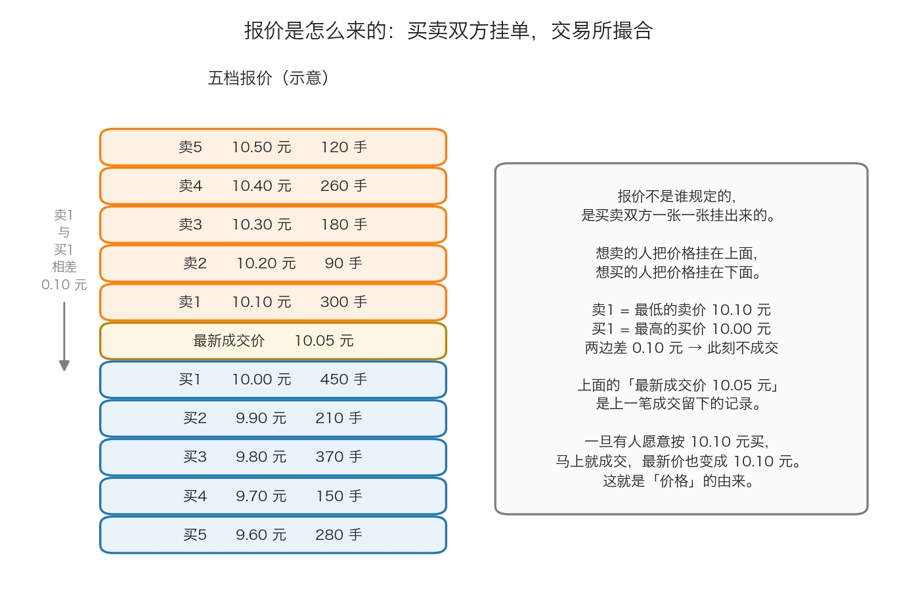
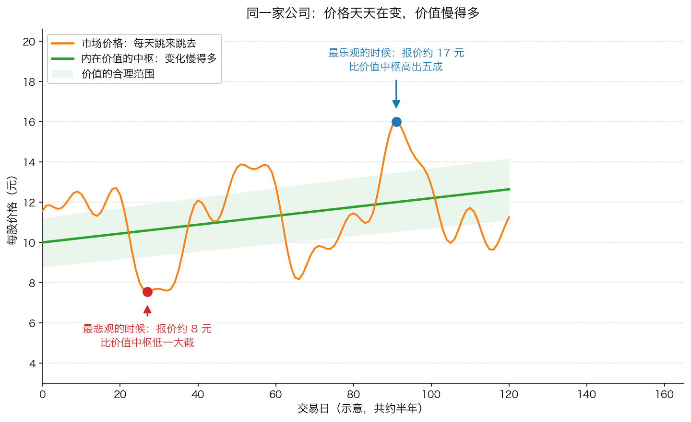

# 第 4 章：价格是谁定的——每天跳动的报价

> 本章你将：
> - 说清股票报价不是"谁规定的"，而是买卖双方一张一张挂出来的
> - 看懂五档报价，知道"卖 1"和"买 1"分别是什么意思，以及什么情况下会成交
> - 明白为什么同一家公司、同一份资产，价格可以天天变
> - 学会算成交量和换手率，知道它们反映的是"多少人在换手"
> - 第一次把"价格"和"价值"分开来看，并知道为什么这个区分是整个课程的地基
> - 最后回答：**每天盯着那个跳动的数字看，对我的钱包到底是有帮助还是有害**

前三章我们讲的是"东西"：公司、股份、市场、资料在哪里查。这一章我们讲"数字"——你打开行情软件第一眼看到的那个不断跳动的价格。它从哪来？为什么变？它和公司本身是什么关系？

---

## 4.1 报价不是谁规定的

先破除一个最常见的误解：**股票价格不是交易所定的，不是公司定的，也不是政府定的。**

它的来源非常朴素：**有人愿意卖，有人愿意买，两个人对上了，就成交。成交的那个价，就是最新价格。**

这和菜市场一模一样。白菜今天 3 元一斤，不是市场管理员规定的，是因为有人愿意 3 元卖、有人愿意 3 元买。如果突然降温，白菜少了，卖家就敢挂 5 元；如果买的人都不来了，卖家只能挂 1.5 元。

**股票和白菜唯一的大区别是：白菜有个"差不多该值多少钱"的常识，股票没有。** 一张股票到底值多少，需要你自己去判断——这就是为什么我们前两章花了那么大力气讲"公司为什么值钱"。

---

## 4.2 一张挂单是怎么变成成交的

现在看具体机制。你打开任何行情软件，都会看到类似这样一列数字：

这一列叫**五档报价**，也叫"盘口"。它分成两半：

- **上面一半是"卖盘"**：想卖的人挂的单。**卖 1 是其中价格最低的那一档**，也就是"现在最便宜的卖家要多少钱"。
- **下面一半是"买盘"**：想买的人挂的单。**买 1 是其中价格最高的那一档**，也就是"现在最舍得出钱的买家出多少钱"。
- **中间是"最新成交价"**：上一笔真的成交了的价格。

图里的例子：

- 卖 1 挂着 **10.10 元**，有 300 手想卖；
- 买 1 挂着 **10.00 元**，有 450 手想买；
- 两边差 **0.10 元**——**差距不为零，所以此刻不会成交**。

**那什么时候会成交？** 只有一种情况：**有人愿意出的买价，达到了有人愿意接受的最低卖价。**

用图里的例子说：只要有一个买家愿意按 **10.10 元**买，他立刻就和"卖 1"配上，成交价变成 10.10 元，最新价也就更新成 10.10 元。

> 📌 **划重点：** **价格不是"算"出来的，是"撞"出来的。** 一个愿意出 10.10 元的人出现，价格就从 10.05 变成 10.10；如果接下来没人愿意再出 10.10，价格又会掉回去。**价格的每一次变化，背后都至少有一个真实的人做了一个真实的决定。**

再看图里"最新成交价 10.05 元"这个数。它落在卖 1（10.10）和买 1（10.00）中间——这不矛盾。因为它是**上一笔**成交留下的记录，当时有人以 10.05 元成交过。**最新价是历史，买 1 和卖 1 才是现在。**

> 💡 **换个说法：** 把"最新成交价"想成"上一笔成交的收据"，把"买 1 卖 1"想成"现在货架上挂的价签"。收据是过去，价签是现在。

**术语补充：**
- **手**：A 股的交易单位。主板、创业板、北交所是 100 股起买（科创板是 200 股起）。图里"300 手"按 100 股一手算，就是 3 万股。
- **挂单（委托）**：你把想买或想卖的价格和数量报给交易所，排队等着。
- **撮合**：交易所把所有挂单按规则配对成交。规则很简单：**买价高的先成交，卖价低的先成交，价格相同的按时间先后排队。**

> ⚠️ **易踩坑：** 你看到的"最新价"永远比真实市场慢半拍。你看到 10.05 元，等你下单时，可能已经变成 10.20 元了。所以**下单时不要只看最新价**，要看卖 1（买入时）和买 1（卖出时）。这个差价叫**买卖价差**，是你每次交易都要付出的一点点隐性成本。

---

## 4.3 为什么同一家公司，价格天天变

现在回答本章的核心问题。

公司还是那家公司——它的门店、设备、员工、订单，昨天和今天几乎一模一样。那为什么价格一天能差 10%？

**因为价格反映的不是公司，而是"此时此刻所有参与者的想法"。**

而这些想法，每天都被各种东西摇晃：

| 摇晃价格的东西 | 例子 |
|---|---|
| **新的消息** | 公司发了财报、行业出了新政策、竞争对手出了事故 |
| **别人的行为** | 看到别人在买，怕错过；看到别人在卖，怕被套 |
| **钱的多寡** | 市场资金充裕时，什么都涨；资金紧张时，什么都跌 |
| **情绪** | 乐观时什么消息都是好消息；悲观时什么消息都是坏消息 |
| **和公司完全无关的事** | 外围市场大跌、汇率波动、一句话的传闻 |

注意最后一行：**每天都有一大堆和这家公司毫无关系的因素在影响它的价格。**

> 🇨🇳 **落到 A 股/港股：** A 股散户成交占比高，情绪对短期价格的影响格外明显。同一天里，一家公司可能因为一条传闻冲上涨停，第二天又因为"辟谣"跌回去，**而这家公司的经营在这两天里没有任何变化**。港股机构占比更高，单日波动通常小一些，**但没有涨跌停**，遇到真正的坏消息时一天跌三成也很常见。

---

## 4.4 成交量与换手率：多少人在换手

价格之外，你还会看到两个数字：**成交量**和**换手率**。

- **成交量**：今天一共成交了多少股（A 股常用"手"来显示）。
- **换手率**：今天成交的股数，占公司**可以自由买卖的那部分股票**的比例。

$$换手率 = 今日成交股数 \div 流通股数$$

"流通股"是指可以在市场上自由买卖的那部分股票。有些公司的股份被大股东长期持有、暂时不卖，那部分就不算在流通股里（叫"限售股"）。

**换手率说明什么？** 说白了就是"**今天有多少人在换手**"。

- 换手率 **1%**：今天只有很少一部分股票换了主人。大家基本都拿着不动。
- 换手率 **10%**：今天有十分之一的股票换了主人。交易非常活跃。
- 换手率 **30%**：极其疯狂。通常是题材炒作或者重大事件。

> 💡 **换个说法：** 把一家公司想成一栋楼。**换手率高，说明今天有很多住户在搬家**；换手率低，说明大家都在自己家里待着。搬家的原因可能是这楼真好（有人抢着搬进来），也可能是这楼要塌了（有人抢着跑）。**光看换手率的大小，你判断不出是哪一种——必须结合价格和公司本身来看。**

> 📌 **划重点：** 卡拉曼对"交易活跃"这件事没有任何好感。他在导言里说，华尔街"对每笔交易进行前端收费的事实明白无误地表明，相比交易的内在经济价值，华尔街更关心交易发生的次数"（导言 p5）。翻译成今天的话：**交易越频繁，收手续费的人赚得越多，而你赚不赚，和他没关系。** 高换手率对券商是好消息，对你的钱包未必是。

---

## 4.5 价格和价值：两个完全不同的东西

现在到了本章最重要的一节，也是整个 12 周课程的地基。

**价值和价格，是两件不同的事。**

- **内在价值**：一家公司**真正**值多少钱——由它的资产、盈利、现金流决定，而不是由股价决定。
- **市场价格**：此时此刻买卖双方愿意成交的价格。它由情绪和供求决定，可以和内在价值差很远。

这张图是本课程最重要的一张图，请多看几眼。

- 中间那条**平缓上升的绿色线**，代表这家公司的**内在价值中枢**。它慢慢地往上走，因为公司在慢慢赚钱、慢慢长大。
- 周围那圈**浅绿色带**，代表**价值的合理范围**。因为估值不是精确科学，公司的价值本身就是一个区间，不是一个点。
- 那条**上蹿下跳的橙色线**，代表**市场价格**。它整天冲出绿色带，又跌回绿色带，再冲出去。

**请特别注意两条线的"性格差异"：**

- 价值的变化是**缓慢的、有方向的**。一家公司今年的赚钱能力，不太可能比去年翻倍，也不可能比去年腰斩。
- 价格的变化是**剧烈的、来回的**。同一个星期里，报价从 8 元跳到 17 元，完全可能——**但这家公司在这一个星期里什么都没变。**

> 📌 **划重点：** **价格天天在变，价值变得慢得多。** 这一句话，是本课程后面 11 周所有内容的地基。如果价格等于价值，那么"便宜买入"这件事就不存在了；正因为价格经常不等于价值，便宜货才会周期性地出现。

**那价格为什么会围着价值转，而不是永远飞走？** 因为长期看，价格最终要由公司赚到的钱来兑现。一家永远不赚钱的公司，股价迟早会跌回原形；一家持续赚钱的公司，股价迟早会反映这件事。但请注意"**迟早**"这两个字——**这个"迟早"可能是三年，也可能是十年。** 中间那段时间，价格可以完全不讲道理。

**关于"市场为什么不讲道理"，有一个著名的比喻。**

格雷厄姆——价值投资这套方法的奠基人——把股票市场比作一位**情绪极不稳定的合伙人**：他每天都来给你报一个价，问你要不要买、要不要卖。他高兴的时候报出天价，沮丧的时候报出地板价。

这个比喻叫"**市场先生**"（Mr. Market）。它的完整含义——以及你应该怎么应对他——**是 Week 3 专门要讲的一章**。这里先埋下这颗种子：

> **你完全可以拒绝他的报价。没有任何规定说，他报价了你就必须交易。**

---

## 4.6 所以，价格能不能预测

既然价格这么情绪化，那能不能预测它明天会怎么走？

卡拉曼在导言里的回答非常直接：

> "那些能够预测未来的投资者应该在市场即将启动时满仓，甚至是借钱买入，而在市场即将下跌时及时撤出。不幸的是，这些声称能够预测市场走向的投资者常常显得口气比力气大。（迄今为止，拥有预测能力的人我一个也没见过）。我们自认为无法预测证券价格的走势。"（导言 p9–p10）

请注意最后一句里的"**我们自认为**"。他不是说"别人都做不到，只有我能"，而是说"**我也做不到**"。

这句话对一个初学者来说，其实是巨大的解脱：**你不需要成为一个能预测价格的人。** 你只需要做另一件事——**搞清楚一家公司大概值多少钱，然后等一个明显便宜的报价出现。**

> ⚠️ **易踩坑：** 只要你开始盯着分时图看，你的大脑就会自动开始"预测"——"这里像是要涨""这里撑不住了"。这是人的本能，不是你的错。但请诚实地承认：**你看到的那根线，是几百万个和你一样在猜的人互相碰撞出来的结果。** 你并没有比他们多知道什么。
>
> 本课程给你的建议很简单：**每天看一次收盘价就够了，不要看分时图。** 后面几周你会明白为什么。

---

## ✍️ 想一想

1. **一家公司今天没有任何新闻，行业没有变化，大盘也没动，但它的股价跌了 4%。这 4% 是谁决定的？是公司变差了 4% 吗？**
2. **有人说："这只股票换手率特别高，说明很活跃，一定是好股票。"这个说法有什么问题？请举出至少两种"换手率很高但完全相反"的情况。**
3. **如果市场先生每天都来给你报价，你可以选择接受、可以选择拒绝。那么在什么情况下你会接受他的报价？在什么情况下你会觉得"这人今天疯了"？**

> 💡 **参考思路：**
> 1. 这 4% 是**今天参与交易的那部分人**决定的，不是公司决定的。可能只是有几个大一点的卖单砸下来，触发了别人的恐慌，然后更多人跟着卖——价格就下来了。公司本身**一点都没有变**。这就是"价格由供求和情绪决定，不由公司决定"的最直白例子。
> 2. 换手率高只说明"今天很多人换了手"，它本身不含"好"或"坏"的判断。反例一：**公司出了重大利好，所有人抢着买**，换手率飙升——这是好事。反例二：**公司爆出丑闻，所有人抢着跑**，换手率同样飙升——这是灾难。反例三：**纯粹的资金炒作**，一群人击鼓传花，换手率极高但公司毫无变化。所以正确的用法是：**换手率是一个"注意这里"的信号，不是"买"或"卖"的信号**，它必须和价格走势、公司基本面放在一起看。
> 3. 接受报价的标准只有一个：**和他的报价相比，你估算的公司价值明显更高（他要卖给你时）或明显更低（他要买你的股票时）**。而"这人今天疯了"，指的就是他的报价和你的估值出现了巨大偏离——比如你估这家公司值 100 亿，他报 50 亿要卖给你，或者报 200 亿要买你的。**你的判断依据永远是价值，不是他的情绪。** 至于怎么"估"出这个价值，那是接下来两周的事。

---

## 🧮 算一算

**情境（**下面的数字是简化示意数字，用于教学练习）：

某公司**总股本 20 亿股**，其中**流通股 15 亿股**（另外 5 亿股在大股东手里，暂时不卖）。昨天收盘价是 **12.00 元**。

**问题：**
（1）如果今天成交了 **6000 万股**，换手率是多少？
（2）如果今天成交了 **1.8 亿股**，换手率是多少？这个数字算高还是低？
（3）这只股票在 A 股主板上市。它今天的**涨停价**和**跌停价**分别是多少？如果它在创业板上市，涨停价和跌停价又是多少？
（4）假设这家公司的内在价值一年增长 **8%**。那么平均到每个交易日，价值一天涨多少？和 A 股主板一天最多能涨 10% 相比，相差多少倍？

### 分步解答

**第（1）问：换手率**

注意换手率的分母是**流通股**，不是总股本：

$$6000 万 \div 15 亿$$

先把单位统一成"万股"：15 亿股 = 150000 万股。

$$6000 \div 150000 = 0.04$$

也就是 **4%**。

**第（2）问：另一个换手率**

$$18000 万 \div 150000 万 = 0.12$$

也就是 **12%**。

**这是很高的水平。** 作为参照：4% 已经算活跃，12% 意味着一天之内有超过十分之一的流通股票换了主人，通常意味着市场对它有非常强烈的分歧或者炒作。

> ⚠️ **易踩坑：** 很多人算换手率时用**总股本**当分母，算出来 6000 万除以 20 亿等于 3%，比正确值 4% 小。用哪个分母取决于你看到的定义，但**A 股行情软件里的"换手率"通常用流通股做分母**。看到数据时，先确认它的口径。

**第（3）问：涨跌停价**

涨跌停是按**昨天的收盘价**算的，不是按今天开盘价算。

A 股**主板**的涨跌停幅度是 10%：

$$涨停价 = 12.00 \times (1 + 0.10) = 12.00 \times 1.10 = 13.20 元$$

$$跌停价 = 12.00 \times (1 - 0.10) = 12.00 \times 0.90 = 10.80 元$$

**创业板和科创板**的幅度是 20%：

$$涨停价 = 12.00 \times 1.20 = 14.40 元$$

$$跌停价 = 12.00 \times 0.80 = 9.60 元$$

注意：涨跌停价会按交易所规则四舍五入到最小价格变动单位（A 股是 0.01 元）。这里算出来刚好是整数，不用调整。

**第（4）问：价值增长 vs 价格波动**

先算一年的价值增长：8% 就是 0.08。

A 股一年大约有 **250 个交易日**。平均到每一天：

$$0.08 \div 250 = 0.00032$$

也就是 **0.032%**。

再看两者的比例：

$$0.10 \div 0.00032 = 312.5$$

**A 股主板一天的价格波动上限（10%），是公司价值平均一天变化（0.032%）的 312.5 倍。**

> 📌 **划重点：** 这个 312.5 倍，就是"价格"和"价值"最直观的差距。**你每天看到的那个数字，绝大部分是在反映情绪、资金和博弈，只有极小极小的一部分在反映公司本身的经营。**
>
> 这就是为什么这一章要花这么大力气把两者分开。如果你把"价格下跌"直接理解成"公司变差了"，你会在每一个下跌的日子里做出错误的决定——要么恐慌卖出，要么为了"摊薄成本"乱买。**而你真正的判断依据，应该始终是那个变化缓慢的绿色中枢。**

---

## ✅ 小测验

**1. 关于"最新成交价"和"买 1、卖 1"，下面哪个说法是对的？**
A. 最新成交价一定等于买 1 和卖 1 的平均值
B. 最新成交价是上一笔成交留下的记录，买 1 和卖 1 是当前挂着的报价
C. 只要买 1 和卖 1 不相等，今天就一定不会有成交
D. 卖 1 是最高的卖价

**2. 一家公司今天没有任何经营上的变化，股价却跌了 5%。最合理的解释是什么？**
A. 公司的资产今天缩水了 5%
B. 公司的盈利能力今天下降了 5%
C. 今天参与交易的买卖双方的情绪和供求发生了变化，价格由他们决定，不由公司决定
D. 会计做错了账

**3. 关于换手率，下面哪个说法是对的？**
A. 换手率越高，说明公司越值得买
B. 换手率越高，说明公司越危险
C. 换手率反映的是"今天有多少股票换了主人"，它本身既不是买入信号也不是卖出信号
D. 换手率低于 1% 的股票不能买

> **答案与解析**
>
> **1. B。** 最新成交价是历史记录（上一笔成交），买 1 和卖 1 是当前挂单。它们可以不等，而且经常不等。A 错：没有任何规则规定最新价必须等于两者的平均。C 错：只要出现一个愿意按卖 1 价格买的买家（或者愿意按买 1 价格卖的卖家），马上就会成交。D 错：**卖 1 是最低的卖价**——想卖的人里面，谁要价最低谁排在最前面，因为买家当然先找便宜的。
>
> **2. C。** 价格由买卖双方的报价和成交决定，而报价背后是人的判断和情绪。公司没有任何变化，价格照样可以变。A、B 都错在把"价格"直接等同于"公司基本面"——公司的资产和盈利能力不会因为一天的股价波动而改变。D 更离谱：会计做账和股价当天波动没有直接关系。
>
> **3. C。** 换手率只告诉你"今天有多少股票换了主人"，它本身不含方向。A 错：高换手可能是抢着买，也可能是抢着跑。B 错：同理，高换手也可能是重大利好。D 错：换手率低只说明今天交易清淡，和公司好不好、值不值得买是两回事——很多好公司长期换手率都不高，因为持有的人不愿意卖。

---

## 📖 回到原书

- 对应原书 **导言 p5–p7**，`raw/安全边际-中文版/page_005.md` ~ `page_007.md`（原书 p5–p7）。
- 建议**精读**：p5 关于"华尔街像一个巨大的赌场"和"相比交易的内在经济价值，华尔街更关心交易发生的次数"那一段。它直接解释了本章最后的那个结论：**交易活跃对谁有好处。**
- 建议**精读**：p7 关于"个人投资群体的行为则表现的像一层层的波浪"那一段。这是卡拉曼对"价格为什么会脱离价值"最形象的描述。
- 建议**精读**：p8 里引用的那段话——用 1987 年 1 月到 10 月美股暴涨暴跌的例子说明，**美国企业的总体价值不可能在 8 个月里上升 44%，也不可能在一天之内下降 23%。**
- 可以**略读**：p6–p7 关于垃圾债券的部分。这是 Week 6 的主题，先知道有这回事。

原书金句（逐字引用）：

> "华尔街，这个将资本洒向全世界的资本市场，从许多方面来看都像一个巨大的赌场。对每笔交易进行前端收费的事实明白无误地表明，相比交易的内在经济价值，华尔街更关心交易发生的次数。"（导言 p5）

> "在华尔街和投资银行家的鼓动下，个人投资者的行为就像机构投资者一样，不理会，甚至是蓄意忽视企业内在价值的存在，完全将股票作为一张纸牌买进卖出。"（导言 p7）

> "我们无须理会1987 年1 月1 日的股票市场的具体价格是否合理，我们能确定的是美国企业的总体价值不会在8个月里上升44%，而更加不可能的是在10 月9 日，一天之内美国企业的价值下降了23%。"（导言 p8，卡拉曼引用威廉姆·瑞恩和理查德·坎尼弗的话）

> 📌 **译注：** 1987 年的"黑色星期一"通常记作 10 月 19 日，原书此处写作 10 月 9 日。教程为了保持引文逐字准确，引用时保留原样。
