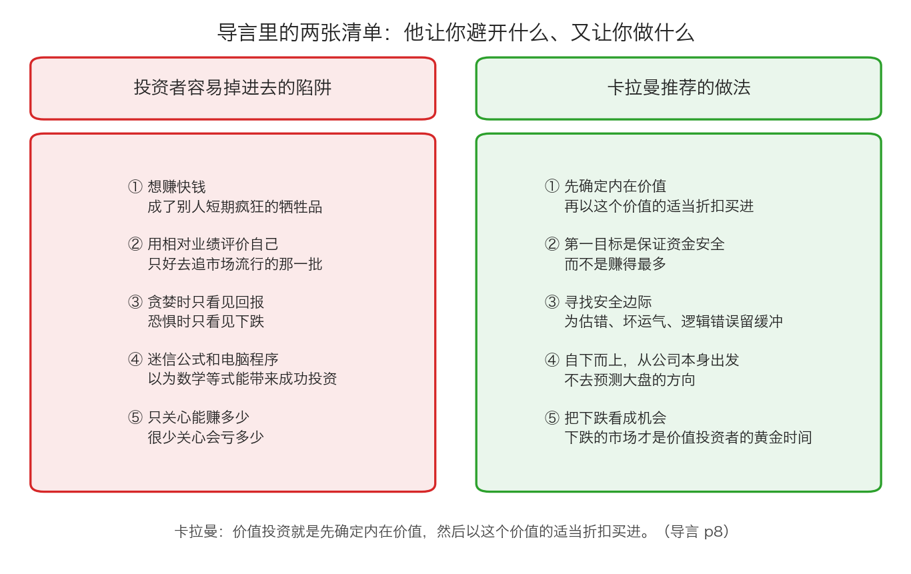

# 第 5 章：卡拉曼的导言——他要你避开什么

> 本章你将：
> - 知道卡拉曼写这本书的两个初衷分别是什么
> - 理解他为什么不怕"多出竞争者"，以及这背后的逻辑
> - 逐条认清他在导言里点出的投资者陷阱
> - 记住价值投资的那一句定义，并能用自己的话复述
> - 算清"亏一半要赚一倍才回本"这笔账，明白为什么"不要亏钱"不是一句空话
> - 最后回答：**这一章之后，我该用什么样的心态面对自己的钱**

前面四章都是补课：股票是什么、公司为什么值钱、市场在哪里、价格从哪来。从这一章起，我们正式翻开原书。第一站是导言——卡拉曼亲笔写的、全书唯一一段直接对你说话的文字。

---

## 5.1 两个初衷

导言的第一段就把话说完了。卡拉曼写道：

> "写本书的初衷有两个。其一阐明了诸多投资者面临的陷阱，通过突出许多投资者的错误，我希望能够学会避免损失。其二我推荐投资者遵循一个特定的价值投资哲学。"（p3）

注意这两个初衷的**顺序**。

第一个是"**讲错误**"，第二个才是"**讲方法**"。

这不是排版顺序，是这本书的方法论：**先让你看清别人是怎么亏的，再告诉你怎么做。** 为什么？因为"正确的方法"有很多种，而且需要天赋、运气、时代配合；但"错误的做法"是有限的、重复的、可以列成清单的。躲开这些错误，你就已经跑赢大多数人了。

他紧接着说了这句话：

> "避免别人犯过的错误是达到成功投资重要的一环。事实上，也是完全可以避免的。"（p3）

**"完全可以避免"**——这是整本书的底气所在。他不是说"你一定能赚到钱"，他说的是"**你完全可以不犯那些别人犯过的错**"。

> 📌 **划重点：** 这两句话定下了整门课的基调。接下来的 11 周，你会花很多时间看别人怎么亏钱。**不要觉得这是在浪费时间。** 对一个刚起步的人来说，"知道什么不能做"比"知道什么能做"值钱得多。

---

## 5.2 他为什么不怕多出竞争者

导言里有一段特别坦诚的话。卡拉曼说，他写这本书可能会招来更多竞争者，从而间接降低自己的投资业绩：

> "你可能有种疑虑，为什么我要写这本书，鼓励更多的人成为价值投资者。我的许多朋友也有此顾虑。这样一来，我不是招徕了更多的竞争者，间接地降低了我的投资绩效吗？也许是的。但我不认为这种事会发生。"（p3）

他给出了两个理由。

**理由一：价值投资不是他第一次公开讲的东西。** 他写道："首先，价值投资并不是首次公开讨论。尽管我在书中列举的案例与我的前辈不尽相同，尽管我自己的严格的投资哲学也与其他的价值投资者的不尽相同，但是其中一些观点早在50 多年前就被本杰明·格雷厄姆和戴维·多德在他们著名的、被认为是价值投资的圣经——《证券分析》中阐述过了。"（p3–p4）

**理由二：真正会被这本书改变的人非常少。** 他说："那些对如此至理名言置若罔闻的投资者不见得会特别青睐于我。"（p4）

然后是这一段，值得完整读一遍：

> "真实的意图还在于我被许多不理性、不自律的投资者所遭受的灾难性损失深深地刺痛了。如果我能劝说其中的一些人放弃危险的投资策略，采用那些早已被设计好的能够保全他们辛苦钱的方法，那么，我将感到非常的满足。如果我能对投资人的行为有所触动，那么我将很乐意在我自己的绩效上适当地减去几分。"（p4）

> 💡 **换个说法：** 一个主动说"我愿意为了帮到别人而少赚一点"的人，和一个说"跟着我保证翻倍"的人，你更该信谁？**判断一个人是不是在为你着想，看他愿不愿意承担代价。**

而"竞争者不会变多"这个判断，其实还有一个更深的理由，藏在同一页的下一段：

> "但是无论如何，单凭本书是不可能将任何人转变为成功的价值投资者。价值投资需要做许多艰苦的工作，非同一般的严格纪律和长期的投资视角。只有极少数人愿意和能够为成为价值投资人付出大量时间和精力，而价值投资人中又只有一小部分拥有较强心理素质的人，才能取得成功。"（p4）

**翻译成大白话：方法就摆在这儿，但绝大多数人做不到。** 所以他不担心。

> ⚠️ **易踩坑：** 这段话不是"劝退"，是"交底"。它在告诉你：**这套方法的门槛不在于聪明，而在于纪律和耐心。** 你接下来 11 周会遇到很多次这样的时刻——明明知道该等，却忍不住想买；明明知道该拿住，却忍不住想卖。**那才是真正的考验，而不是"看不懂"。**

---

## 5.3 投资者面临的陷阱

现在进入本章的核心：卡拉曼说的"投资者面临的陷阱"到底是什么。

上图画了两张清单。左边是陷阱，右边是对策。下面把左边的五条逐条讲清楚。

### 陷阱一：想赚快钱

> "投资者经常经不住想赚快钱的诱惑，结果成了华尔街短暂疯狂的牺牲品。"（p3）

注意"**短暂疯狂**"这四个字。它承认了一件事：**疯狂的时候，参与的人确实能赚到钱**——至少账面上是。这也是为什么它这么难抵抗。看到身边的人都在赚，你不动手反而显得像个傻瓜。

但"短暂"两个字是判决书。疯狂一定会结束，而结束的时候，最后进场的人承受全部损失。

### 陷阱二：用相对业绩评价自己

> "投资者，特别是机构投资者纷纷卷入这场追逐短期相对业绩的竞赛中，短期价格的波动成为决定胜负的因素。以相对业绩为导向的投资者必然关注短期业绩，不可避免地会被市场的流行时尚所吸引，并以这种时尚作为取得卓越相对业绩的助推器。"（p5–p6）

"相对业绩"的意思是：**不比赚了多少钱，只比有没有比别人赚得多。**

这个陷阱的可怕之处在于：如果市场上最热门的那批股票今年涨了 50%，你手里的股票只涨了 10%，即使你赚了钱，你也会觉得自己失败了。于是你会被迫去买那些热门股票——**哪怕你完全看不懂它们。**

卡拉曼对这一点的总结非常狠：

> "赚取快钱的冲动是如此强烈，以至于许多投资者发现要做到与众不同真是太难了。"（p6）

### 陷阱三：贪婪时看不见风险，恐惧时看不见价值

> "有时，投资者就是自己最大的敌人。举例而言，当股价上升时，贪婪驱使投资者参与投机，做出大数额、高风险的赌博，其依据仅仅是乐观的预期，以及忽略了风险的回报。而在情绪的另一个极端，当股价下跌时，对损失的恐惧让投资人只注意到股价继续下跌的可能性，而根本不考虑投资标的的基本面。"（p6）

这一段请读两遍。它把两种最常见的亏钱方式说完了：

- **涨的时候**：只看见"还能涨"，看不见"已经贵了"。
- **跌的时候**：只看见"还会跌"，看不见"已经很便宜了"。

**注意这两句话是同一个病：都是让情绪替你做了判断。** 涨的时候用乐观代替估值，跌的时候用恐慌代替估值。真正的判断依据——"这家公司值多少钱"——在这两种情况下都被丢掉了。

### 陷阱四：迷信公式和电脑程序

> "许多投资人完全不顾市场环境，执着地依靠一个公式来追求成功，但是无情的现实是，数学等式或计算机程序无法带来成功的投资。"（p6）

这条对今天的人特别有迷惑性。现在各种软件都能算出一堆指标，很多人以为"我按指标操作就是理性的"。

但卡拉曼的意思是：**公式的问题不在于算得准不准，而在于它假设世界是稳定的、可重复的，而市场不是。** 一个在 2015 年有效的公式，2018 年可能完全失效，因为参与的人变了、规则变了、环境变了。

他在导言开头用一个比喻说明这件事：

> "一些投资者的行为就像是初中生学习代数一样，只记得一些公式和规则，或者极其肤浅的表面知识，但对他们所做之事并未真正通晓。要想跨越资本市场和实体经济的循环周期取得长期成功，仅仅捧着一些规则是远远不够的。"（p4–p5）

> 💡 **换个说法：** 背下公式和懂得原理，是两回事。就像背下"刹车距离等于速度的平方除以某个数"的人，并不因此就会开车。**这门口课的目标，是让你理解"为什么"，而不是让你背下"是什么"。**

### 陷阱五：只关心回报，不关心风险

> "大多数市场人士的关注点与价值投资者的关注点不同。它们首先关心回报——它们能赚多少，而甚少关心风险——它们会损失多少。"（p9）

这条是全书的核心。大多数人问的第一个问题是"这能赚多少"，而卡拉曼认为你该问的第一个问题是"**这最多能亏多少**"。

---

**导言里还有两条陷阱，这里一并列出：**

- **陷阱六：试图预测市场。** "那些能够预测未来的投资者应该在市场即将启动时满仓，甚至是借钱买入，而在市场即将下跌时及时撤出。不幸的是，这些声称能够预测市场走向的投资者常常显得口气比力气大。（迄今为止，拥有预测能力的人我一个也没见过）"（p9–p10）
- **陷阱七：在需要依据基本面做长期决定时，表现得相当无能。** "个人投资者与机构投资者很相似，他们经常在需要依据公司基本面做出长期投资决定时表现得相当无能。"（p5）

---

## 5.4 价值投资的一句话定义

导言里对价值投资的定义，短得让人意外：

> "价值投资是以可观的折扣买入内在价值低估的证券交易策略，以最小的风险获得较好的长期投资回报。"（p3）

到了第 8 页，他又换了个更直白的说法：

> "价值投资没有什么神秘的。简而言之就是先确定某个证券内在价值，然后以这个价值的适当折扣买进。事情就是那么简单。而最大的挑战来自于始终保持不可缺少的耐心和纪律，只有当价格变得有吸引力时才买进，而情况相反时就卖出，坚决避免卷入那种吞噬市场人士的追逐短期业绩的狂热之中。"（p8）

把这段话拆开，其实只有三步：

1. **估算内在价值**——这家公司大概值多少钱（Week 2 和 Week 9）；
2. **等一个明显打折的价格**——不是"便宜一点"，是"明显便宜"（Week 7）；
3. **保持耐心和纪律**——没有好价格就不买，一直等（Week 7、Week 8）。

$$安全边际 = 保守估算的价值 - 买入价$$

**这三步里，最难的不是第一步，是第三步。** 因为等待是反人性的：别人都在赚钱的时候你空着手，会非常难受。

卡拉曼对这件事的总结，是导言里最著名的一句：

> "这条价值投资的戒律看上去很简单，但是很显然，对多数投资人而言它太难了，以至于无法掌握和坚持。巴菲特曾经说过，价值投资不是一个在一段时间里让人逐渐学习和采纳的理念，要么立即领会和马上付诸实施，要么永远无法真正学会。"（p10）

---

## 5.5 他给你的"护身符"

陷阱讲完了，方法讲完了。那到底什么能保护你？

卡拉曼的答案是**安全边际**，他在导言里的原话是：

> "相反的，价值投资者第一目标是保证资金安全。很自然地，为了避免未来较大的损失，价值投资者会寻找安全边际，以便为不准确、坏运气、逻辑上的错误留下缓冲地带。由于估值是一项非精确的艺术，未来是不可预测的，投资者也是人，难免会犯错，所以安全边际是万万不可少的。固守安全边际的理念是区分价值投资者和其他不关心损失的投资者的试金石。"（p9）

这一段里有三个"因为"，必须看清：

1. **估值不精确**——所以你可能算错；
2. **未来不可预测**——所以可能出意外；
3. **投资者是人**——所以可能犯蠢。

**安全边际就是为这三件事留的余地。** 它不是"我很聪明所以我不需要"，而是"我知道我会错，所以我要留够空间"。

而卡拉曼还告诉你一个反直觉的事实：**价值投资者最好的时光，是别人最难受的时候。**

> "价值投资者的黄金时间是市场下跌的时候。这时候，下跌的风险已经释放，而其他投资人正在担忧，那些过度乐观的产物中哪些能够幸免。价值投资者则以安全边际作为护身符，勇敢地进入下跌的市场中大胆投资。"（p9）

> 🇨🇳 **落到 A 股/港股：** 把这句话放进 A 股和港股的历史里，你会发现它一点都不抽象。**市场恐慌的时候，才是便宜货集中出现的时候。** 附录一里那位中文读者就记录了自己的观察：2008 年 10 月，A 股市场"提供了大量接近于净资产价格的股票，特别是 B 股市场，提供了一些基于净资产 5 折的安全边际股票"（附录一 p248）。换句话说，**安全边际不会在牛市里送上门，它只在别人夺路而逃的时候出现。**

---

## 5.6 为什么"不要亏钱"这么难做到

导言读完了，现在回到最核心的那句话：**投资者最重要的事不是赚多少，而是别亏钱。**

下一章的算一算会用具体的数字把这笔账算清楚，这里先把道理讲明白。

**"不要亏钱"之所以难，不是因为它复杂，而是因为它反人性。**

人的天性是：
- 看到别人赚钱，忍不住想参与（贪婪）；
- 看到自己亏钱，忍不住想跑（恐惧）；
- 亏了以后，忍不住想"赚回来"（报复性交易）；
- 赚了以后，忍不住觉得自己很行（过度自信）。

这四条，每一条都能让你偏离"安全边际"这条轨道。

而卡拉曼给出的态度是：**你不需要战胜市场，你只需要不打败自己。**

> 📌 **划重点：** 本周的六章到这里就结束了。如果只能带走一句话，请带走这句：
>
> **你买的是一家公司的一小片，它的价格每天在变，但它的价值变得慢得多。你唯一需要练习的技能，是估算价值，然后等待一个明显便宜的价格。**
>
> 下一周（Week 2），我们就开始练那个技能。

---

## ✍️ 想一想

1. **卡拉曼说"避免别人犯过的错误……也是完全可以避免的"。既然错误这么容易避免，为什么还有那么多人亏钱？**
2. **"以相对业绩为导向的投资者必然关注短期业绩"——如果你身边所有人都因为买了某只热门股而赚钱，而你手里是一只没人关注的便宜股，你能坚持多久？你觉得最难扛的是哪一种感受？**
3. **导言里说，价值投资者"只有当价格变得有吸引力时才买进"。那么问题来了：如果一年都没有出现有吸引力的价格，你该怎么办？**

> 💡 **参考思路：**
> 1. 因为"知道"和"做到"之间隔着情绪。错误清单是有限的、可背下来的，但真正让人亏钱的不是"不知道"，而是"知道却做不到"——涨的时候忍不住追，跌的时候忍不住跑。卡拉曼自己在导言里也说了，能成为价值投资者的人"只有极少数"，而且其中"又只有一小部分拥有较强心理素质的人，才能取得成功"（p4）。**所以这门课的重点，一半在知识，一半在自我管理。**
> 2. 最难扛的通常不是亏钱，而是"**别人都在赚，只有我在原地**"这种被落下的感觉。这也是卡拉曼说"要做到与众不同真是太难了"（p6）的原因。提醒自己一件事：**你没有义务参加每一场宴会。** 错过一次上涨不会让你破产，但为了不落后而买进自己看不懂的东西，会。
> 3. 答案只有一个字：**等。** 卡拉曼用棒球的比喻讲过这个道理（这个比喻 Week 7 会专门展开）：投资的好处是，**没有人会强迫你挥棒**。没有好价格，你就拿着现金不动。**"不买"也是一个决定，而且往往是最难做的那个决定。** 当然，前提是你手上真的有钱——这也意味着，你需要在别人狂热的时候，忍住不把最后一分钱投进去。

---

## 🧮 算一算

**情境一：亏损之后，要涨多少才回本？**

你有 10 万元本金。

**情境二：安全边际到底保护了什么？**

你研究了一家公司：

- 你**保守估算**这家公司的内在价值是 **50 亿元**；
- 它一共发行 **10 亿股**；
- 所以每股的内在价值 = 50 亿元 除以 10 亿股 = **5 元**。

**问题：**
（1）如果你按 **8 折**买入，买入价是多少？安全边际是多少元、占估值的百分之几？
（2）如果你按 **6 折**买入，买入价是多少？安全边际是多少元、占估值的百分之几？
（3）**关键问题**：如果你其实估错了——这家公司的真实价值只有 **4 元/股**（也就是你估高了 20%）。那么按 5 元、4 元、3 元买入的三种人，各自是赚还是亏，盈亏百分之几？

### 分步解答（情境一）

亏损的算法：本金乘以"剩下的比例"。

- 亏 10%，剩 90%：$$10 \times 0.90 = 9 万元$$
- 亏 30%，剩 70%：$$10 \times 0.70 = 7 万元$$
- 亏 50%，剩 50%：$$10 \times 0.50 = 5 万元$$
- 亏 70%，剩 30%：$$10 \times 0.30 = 3 万元$$
- 亏 90%，剩 10%：$$10 \times 0.10 = 1 万元$$

回本需要的涨幅，算法是"**亏掉的钱 除以 剩下的钱**"：

- 从 9 万回到 10 万，要赚 1 万：$$1 \div 9 = 0.111$$ 也就是 **11.1%**
- 从 7 万回到 10 万，要赚 3 万：$$3 \div 7 = 0.429$$ 也就是 **42.9%**
- 从 5 万回到 10 万，要赚 5 万：$$5 \div 5 = 1.000$$ 也就是 **100%**
- 从 3 万回到 10 万，要赚 7 万：$$7 \div 3 = 2.333$$ 也就是 **233.3%**
- 从 1 万回到 10 万，要赚 9 万：$$9 \div 1 = 9.000$$ 也就是 **900%**

整理成表：

| 亏损幅度 | 剩下 | 需要涨多少才回本 |
|---|---|---|
| 10% | 9 万元 | 11.1% |
| 30% | 7 万元 | 42.9% |
| 50% | 5 万元 | 100% |
| 70% | 3 万元 | 233.3% |
| 90% | 1 万元 | 900% |

> 📌 **划重点：** 注意这张表不是对称的。**亏 10% 只要涨 11% 就回来了，但亏 50% 要涨 100%，亏 90% 要涨 900%。** 亏损越深，回本越难，而且是加速变难。
>
> 这就是"不要亏钱"这四个字的全部算术含义。它不是保守，它是**数学上的最优策略**。

### 分步解答（情境二）

**第（1）问：按 8 折买入**

$$买入价 = 5 \times 0.8 = 4 元$$

$$安全边际 = 5 - 4 = 1 元$$

安全边际占估值的比例：

$$1 \div 5 = 0.20$$

也就是 **20%**。

**第（2）问：按 6 折买入**

$$买入价 = 5 \times 0.6 = 3 元$$

$$安全边际 = 5 - 3 = 2 元$$

$$2 \div 5 = 0.40$$

也就是 **40%**。

**第（3）问：如果你估错了呢？**

假设这家公司真实价值只有 **4 元/股**。现在看三种买入价：

| 买入价 | 真实价值 | 差额 | 盈亏比例 | 怎么算的 |
|---|---|---|---|---|
| 5 元（按原估值买入） | 4 元 | 4 减 5 = 负 1 元 | **亏 20%** | 负 1 除以 5 |
| 4 元（打 8 折买入） | 4 元 | 4 减 4 = 0 | **不赚不亏** | 0 除以 4 |
| 3 元（打 6 折买入） | 4 元 | 4 减 3 = 1 元 | **赚约 33.3%** | 1 除以 3 |

**结论：同样是"估错了 20%"这个错误——**

- 按估值原价买入的人，**亏 20%**；
- 打 8 折买入的人，**刚好保本**；
- 打 6 折买入的人，**还赚 33.3%**。

> 📌 **划重点：** 这就是安全边际真正的作用。**它不是为了让你赚更多，而是为了让你在犯错的时候不致命。**
>
> 请注意这道题里最反直觉的一点：**三个人犯的是同一个错误（都估高了 20%），但结果天差地别。** 区别不在于谁更聪明，只在于**谁买得更便宜**。
>
> 卡拉曼说"安全边际是万万不可少的"（p9），原因就在这里——**你不能保证自己不错，你只能保证自己错了也还活着。**

---

## ✅ 小测验

**1. 卡拉曼说写这本书有两个初衷。它们分别是什么？**
A. 教人预测市场，以及推荐具体的股票
B. 阐明投资者面临的陷阱以帮助避免损失，以及推荐一个特定的价值投资哲学
C. 批评华尔街，以及介绍他自己的基金业绩
D. 讲解会计知识，以及教授估值公式

**2. 关于"投资者就是自己最大的敌人"，导言里的原意是什么？**
A. 投资者应该完全不看市场，把账户密码交给别人
B. 股价上升时贪婪让人忽略风险，股价下跌时恐惧让人忽略基本面
C. 投资者应该永远不要卖出股票
D. 投资者最大的敌人是券商的高额手续费

**3. 你估算一家公司每股值 20 元，按 7 折买入，也就是 14 元。后来发现这家公司实际只值 16 元。你的这笔投资目前是什么状态？**
A. 亏了，因为 16 元低于你估的 20 元
B. 不亏不赚
C. 每股还有 2 元的安全空间，因为你的买入价 14 元仍然低于 16 元
D. 无法判断

> **答案与解析**
>
> **1. B。** 导言原文："写本书的初衷有两个。其一阐明了诸多投资者面临的陷阱，通过突出许多投资者的错误，我希望能够学会避免损失。其二我推荐投资者遵循一个特定的价值投资哲学。"（p3）A 错：卡拉曼明确说自己无法预测市场。C 错：他批评华尔街是手段不是目的，而且在导言里说"我们赚钱的事实其实无关紧要"（p11）。D 错：这本书刻意不给公式，他明确说"世界上不存在这样的公式"（p4）。
>
> **2. B。** 导言原文："当股价上升时，贪婪驱使投资者参与投机，做出大数额、高风险的赌博，其依据仅仅是乐观的预期，以及忽略了风险的回报。而在情绪的另一个极端，当股价下跌时，对损失的恐惧让投资人只注意到股价继续下跌的可能性，而根本不考虑投资标的的基本面。"（p6）A 错：他主张的是独立思考，不是不看市场。C 错：他说过"情况相反时就卖出"（p8）。D 错：手续费是成本问题，不是导言这段话的意思。
>
> **3. C。** 你买在 14 元，实际价值 16 元，中间还有 2 元的空间，所以按 16 元的真实价值算你并没有买贵。这道题的用意是让你体会：**安全边际的作用是"估错也不致命"**。A 错：估值下调不等于亏损，关键看买入价和真实价值的关系。B 错：不是"不赚不亏"，你还占着 2 元的便宜。D 错：用买入价和修正后的价值一比就能判断。

---

## 📖 回到原书

- 对应原书 **导言**，`raw/安全边际-中文版/page_003.md` ~ `page_011.md`（原书 p3–p11）。本周请**通读一遍**，下面标出重点。
- 建议**精读**：**p3–p4**。写书的两个初衷、他为什么不怕多出竞争者、以及他对读者期待的管理（"单凭本书是不可能将任何人转变为成功的价值投资者"）。这四页决定了你该用什么心态读完整本书。
- 建议**精读**：**p5–p6**。投资者的陷阱最集中的两页：想赚快钱、追逐相对业绩、"投资者就是自己最大的敌人"、迷信公式。
- 建议**精读**：**p8**。价值投资的一句话定义，以及那句"事情就是那么简单"。
- 建议**精读**：**p9**。价值投资者的第一目标、安全边际的三个"因为"、"价值投资者的黄金时间是市场下跌的时候"。**这是全书的中心页。**
- 可以**略读**：**p10–p11**。各章内容提要，以及他个人的师承经历。知道有这回事就行。
- 另外可以翻一翻 **附录一 p243–p252**（一位中文读者的读书笔记），看看别人怎么理解这本书。**注意：那是笔记，不是卡拉曼原文，观点可以保留意见。**

原书金句（逐字引用）：

> "价值投资者的黄金时间是市场下跌的时候。"（p9，完整原句见上文 5.5 节）

> "固守安全边际的理念是区分价值投资者和其他不关心损失的投资者的试金石。"（p9）

> "这条价值投资的戒律看上去很简单，但是很显然，对多数投资人而言它太难了，以至于无法掌握和坚持。"（p10）

本周到此结束。你已经知道自己在买什么（Week 1 第 1 章）、它为什么值钱（第 2 章）、去哪里买和去哪里查（第 3 章）、价格从哪来（第 4 章），也听卡拉曼亲口说了他要你避开什么（第 5 章）。**下一周，我们正式学"怎么给一家公司估价"。**
