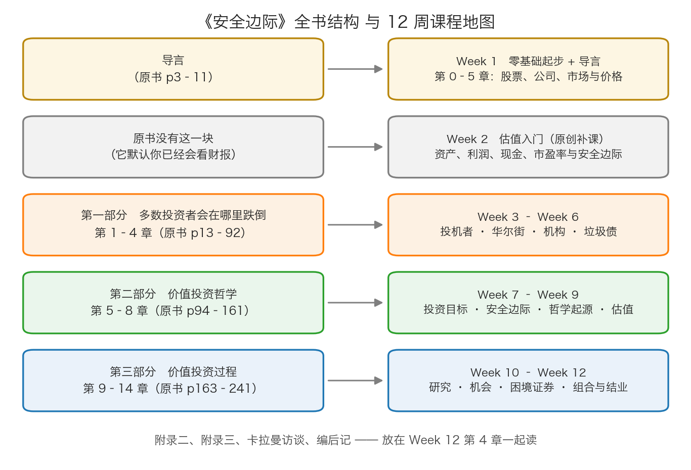

# 本周导读

欢迎来到第 1 周。这一周你**一股股票都不用买**，也**一分钱都不用投**。

这周要做的事情只有一件：把"股票、公司、市场、价格"这四个词彻底弄明白。听起来简单，但绝大多数亏钱的人，恰恰是在这四个词还没弄清的时候就开始下单了。他们会说"这只股票要涨了"，但他们说不出这只股票背后那家公司靠什么赚钱；他们会说"跌了这么多该反弹了"，但他们没想过这家公司到底值多少钱。

《安全边际》这本书，通篇都在教一件事——**别亏钱**。而"别亏钱"的第一步，是知道自己在买什么。所以本周先补最基础的一课，然后读原书的导言（p3–11），听卡拉曼亲口说：他写这本书，是想让你避开什么。

本周 6 小时的分配建议：读正文 3.5 小时，做练习和测验 1 小时，动手作业 1 小时，读原书导言 0.5 小时。

---

## 📂 本周目录

| 章节 | 你将学到 | 对应原书 |
|---|---|---|
| [第 0 章：总览——这本书在讲什么](00-总览-这本书在讲什么.md) | 卡拉曼是谁；《安全边际》为什么被称为"最难买到的投资书"；全书三部分各讲什么；12 周课程地图 | 无（全课程起点） |
| [第 1 章：股票是什么——一张纸代表一家公司](01-股票是什么-一张纸代表一家公司.md) | 公司、股份、股东、股票、分红；股票和债券的区别；A 股/港股/美股；一手是多少股；开户到下单的完整流程；T+1、涨跌停、手续费、印花税 | 无（为零基础补课） |
| [第 2 章：公司为什么会值钱](02-公司为什么会值钱.md) | 一家公司的价值来自四件事：资产、盈利、现金流、成长；用"开一家奶茶店"把这四件事算一遍 | 无（为零基础补课） |
| [第 3 章：股市在哪里——A 股、港股与美股](03-股市在哪里-A股港股与美股.md) | 上交所、深交所、北交所、港交所、纽交所、纳斯达克；主板/创业板/科创板；恒生指数与沪深 300 是什么；怎么去巨潮资讯网和披露易查公司资料；A 股与港股交易规则的差别 | 无（为零基础补课） |
| [第 4 章：价格是谁定的——每天跳动的报价](04-价格是谁定的-每天跳动的报价.md) | 报价从哪来（挂单撮合）；为什么同一家公司价格天天变；成交量与换手率；价格与价值的初步区分 | 导言 p5–p7（华尔街像赌场、价格与价值脱节） |
| [第 5 章：卡拉曼的导言——他要你避开什么](05-卡拉曼的导言-他要你避开什么.md) | 卡拉曼写这本书的两个初衷；他为什么不怕多出竞争者；他说的"投资者面临的陷阱"；价值投资的一句话定义 | 导言 p3–p11（全篇精读） |

---

## 🎯 学完你会得到什么

1. **你能用一句人话说清"股票是什么"**——不是"一种理财产品"，而是"一家公司所有权的一小片"。
2. **你能分清债券和股票**——一个是借条（你是债主），一个是所有权（你是股东）；公司关门时谁先拿钱。
3. **你能说出钱是怎么从你的银行卡走到交易所的**——券商、委托、撮合、成交、清算；T+1 到底 T 的是什么。
4. **你知道去哪个官方网站查一家公司的真实资料**——巨潮资讯网、港交所披露易，而不是靠群里的截图。
5. **你能指着一条价格曲线说出关键的一句话**："这条线每天在动，但它背后那家公司的价值不会一天变一次。"
6. **这对我的钱包意味着什么**：从今天起，你听到"这只票要涨"的时候，脑子里会自动多出一句反问——**"那这家公司值多少钱？"** 这句话会在接下来的 11 周里反复出现，它是"不亏钱"这件事的起点。

---

## 🗺️ 本周阅读地图

先说明一件事：本仓库 `raw/安全边际-中文版/` 目录下每个文件对应原书的一页，**文件名里的数字就是原书页码**——`page_005.md` 就是原书第 5 页。你可以用任何文本编辑器打开它，对照着读正文。

本周要读两段原书内容：

| 原书位置 | 文件 | 内容 | 建议 |
|---|---|---|---|
| 导言 p3–p11 | `page_003.md` ~ `page_011.md` | 卡拉曼亲笔写的导言：写书初衷、投资者的陷阱、价值投资的一句话定义 | **精读**。这是全书唯一由作者直接对你说"我为什么写这本书"的地方。第 5 章会带你逐段读 |
| 附录一 p243–p252 | `page_243.md` ~ `page_252.md` | 一位中文读者（枯荣）的读书笔记，里面已经用 A 股语境做了大量对照 | **略读 + 当参考书**。它不是原书正文，是别人的笔记，观点可以保留意见。但里面"投资与投机的差异""安全边际的重要性""价值投资在下跌的市场中闪闪发光"几节，后面几周会经常回来查 |

本周阅读顺序建议：

1. 先读本导读和**第 0 章**，把整门课的地图装进脑子；
2. 再读**第 1～4 章**（这四章是为零基础专门写的补课，原书里没有）；
3. 最后读**第 5 章**，手里拿着 `page_003.md` 一起对照，边读边在原书里划句子；
4. 附录一（`page_243.md` 起）这一周只要翻一翻，知道里面有 A 股案例就行。

> 📌 **划重点：** 不要跳过第 1～4 章直接去读导言。卡拉曼在导言里说"这种选择就是人所共知的基本面分析方法，这种方法认为股票是它们所代表的企业所有权的凭证"——如果你还不知道"股票是所有权凭证"是什么意思，这句话对你来说就只是噪音。

---

## 🔍 动手作业

**任务：去巨潮资讯网，把一家真公司的"家底"找出来。**

这是本课程唯一必须动手的部分。目的不是让你学会看财报（那是 Week 2 的事），而是让你建立两个习惯：**只信官方原始文件**，以及**知道东西在哪一页**。

### 去哪里查

打开浏览器，访问 **巨潮资讯网**：`cninfo.com.cn`（这是中国证监会指定的 A 股信息披露网站，所有 A 股上市公司的年报、季报、公告都必须在这里公开）。在首页搜索框里输入股票代码 **600900** 或公司名 **长江电力**。

### 查什么

1. 进入长江电力的页面，找到**「定期报告」**或**「年度报告」**栏目；
2. 下载**最近一个完整年度**的年度报告（PDF，通常两三百页，别怕，你只需要看其中几页）；
3. 翻到 **「管理层讨论与分析」** 这一节，以及 **「财务报告」** 里的三张主表：合并资产负债表、合并利润表、合并现金流量表。

> ⚠️ **易踩坑：** 网上到处是二手解读、截图、公众号分析。这次请忍住，只用年报本身。你需要练的是"从原始文件里找到一个数字"这个动作，而不是"看懂别人的结论"。

### 回答这 5 个问题

请用一张纸写下答案，每个答案后面附上"我是在第几页找到的"。

1. **这家公司靠什么赚钱？**（用一句话，不要抄原文，用你自己的话说）
2. **最近一个完整年度，公司的"营业收入"和"归属于母公司股东的净利润"各是多少？**（在利润表最上面几行找）
3. **公司账上的"货币资金"是多少？它在资产负债表里属于"资产"还是"负债"？**
4. **公司一共发行了多少股股票（总股本）？**（通常在"股本"这一项或者"公司简介"里）
5. **这家公司一年分红多少？**（在"利润分配"或"分红"相关章节找，看"每 10 股派发现金红利 X 元"这句话，自己换算成"每股多少元"）

### 参考答案与判断标准

- **第 1 题**：长江电力是水电公司，**主要收入来自卖电**（在长江上建水电站发电，把电卖给电网）。你答出"发电卖电"这个量级就对了。如果你答的是"炒股"或"做投资"，说明你找错公司了。
- **第 2 题**：请以你下载的年报为准。作为**量级参考**（不是精确数字，只用来帮你判断有没有翻错表）：长江电力最近一个完整年度的营业收入大致在 **700 亿到 900 亿元**之间，归属于母公司股东的净利润大致在 **250 亿到 350 亿元**之间（水电站靠天吃饭，来水丰枯不同，数字会在区间里上下浮动）。如果你查到的数字差了一个零，多半是把"元"看成了"万元"，或者翻到了母公司报表而不是合并报表。
- **第 3 题**：货币资金属于**资产**（它是公司自己拥有的钱）。资产那一段和负债那一段别搞混：资产是"我有什么"，负债是"我欠别人什么"。
- **第 4 题**：总股本在 **200 亿股以上**这个量级。这里没有唯一答案，重点是你要真的把它找出来。
- **第 5 题**：年报里分红的写法通常是"**每 10 股派发现金红利 X 元（含税）**"。换算方法：**每股分红 = X 除以 10**。例如"每 10 股派 8.2 元"，就是每股 0.82 元。这个"每 10 股"的写法是 A 股的习惯，记住它，以后看公告天天遇到。

**加分题（想做港股的话）**：打开港交所披露易 `hkexnews.hk`，搜 **0700**（腾讯控股），找到它最近一个完整年度的**年度报告**，看两行字：「收入」和「本公司权益持有人应占盈利」。体会一下同一个意思，在港股年报里叫什么名字。

**做完之后请自问一句**：这 5 个问题里，有哪一个是我本来以为很简单、结果找了十分钟的？那个地方，就是你真正的知识缺口。

---

## 📖 本周术语表

下面这些词会在本周正文里第一次出现。**第一次出现时正文都会先用生活类比解释一遍**，这个表是给你回头查的。口径全课程统一，后面 11 周不会改口。

| 术语 | 一句话解释 |
|---|---|
| 证券 | 一张代表某种权利的凭证：要么是别人欠你钱的凭据（债券），要么是公司所有权的一小片（股票） |
| 股票 | 公司所有权的一小片。买了股票你就是股东，公司赚的钱理论上有一部分归你 |
| 债券 | 借条。你把钱借给公司或政府，对方按约定付利息、到期还本 |
| 股份 / 总股本 | 公司被切成的"份"叫股份；一共切了多少份叫总股本 |
| 股东 | 持有股份的人。股东是公司的主人之一，不是债主 |
| 分红（派息） | 公司把赚到的钱分一部分给股东。**不是必须的**，公司可以决定不分 |
| 上市公司 | 股票可以在交易所里公开买卖的公司 |
| A 股 / 港股 / 美股 | 在中国内地、中国香港、美国市场上市交易的股票 |
| 交易所 | 买卖股票的正规场所。上交所、深交所、北交所、港交所、纽交所、纳斯达克都是 |
| 券商 | 你有资格买卖股票之前必须先开户的那家证券公司，它是你和交易所之间的通道 |
| 一手 | 最小的买卖单位。A 股主板、创业板、北交所是 100 股起，科创板是 200 股起；港股每只股票的一手股数不一样 |
| T+1 | 今天（T 日）买入的股票，要到下一个交易日才能卖出 |
| 涨跌停 | A 股大部分股票一天之内最多涨 10%、最多跌 10%，到了这个幅度就不许再动 |
| 手续费 / 印花税 | 买卖股票要付给券商和国家的钱，是"不管你赚不赚都要交"的成本 |
| 市值 | 公司所有股票按当前价格算一共值多少钱，等于每股价格乘以总股数 |
| 指数 | 用一篮子股票的价格算出来的一个数，用来代表"整个市场大概涨了还是跌了" |
| 内在价值 | 一家公司**真正**值多少钱——由它的资产、盈利、现金流决定，而不是由股价决定 |
| 市场价格 | 此时此刻买卖双方愿意成交的价格。它由情绪和供求决定，可以和内在价值差很远 |
| 安全边际 | 买入价与保守估算的价值之间的差距。它是你**为自己估错留出的容错空间** |
| 投机 | 靠预测价格涨跌来买卖，赌的是别人会出更高的价 |
| 投资 | 基于对企业价值的分析，以低于价值的价格买入，赚的是价值本身 |

> 🇨🇳 **落到 A 股/港股：** 本周你不用记住任何数字，只要记住一句话——**你买的不是代码，是一家公司的一小片。** 代码 600519 的背后是一家真实存在的酿酒公司，代码 0700 的背后是一家真实存在的互联网公司。下一周我们就开始学着算：它们到底值多少钱。
