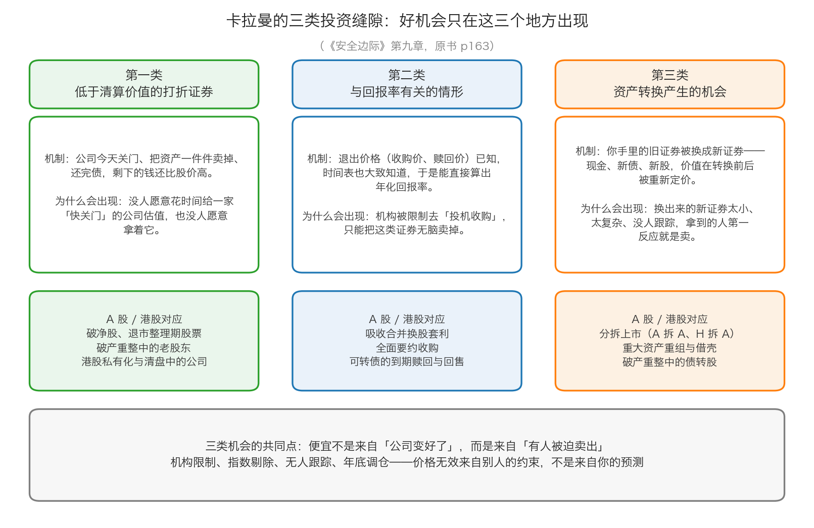

# 第 0 章：投资的缝隙在哪里

> 本章你将：
> - 明白为什么"会估值"不等于"能找到便宜货"，以及一个好机会到底有多难得
> - 拿到卡拉曼那张机会地图：价值投资的三个缝隙——低于清算价值的打折证券、与回报率有关的情形、资产转换产生的机会
> - 学会拿到便宜货之后必须做的第一个动作：先问"它为什么这么便宜"，而不是先高兴
> - 看懂"价格无效"的四种来源：机构限制、指数与规模、没人跟踪、年底调仓
> - 回答"这对我的钱包意味着什么"：把时间花在会反复冒出便宜货的缝隙里，而不是平摊在五千家公司上

Week 9 我们把估值的整套手艺做完了：价值是一个范围、现值分析法、贴现率怎么选、清算价值怎么算、股市价值法怎么用。你已经能对着一家公司说"它大约值多少钱"。

可这门手艺有一个前提：**你得先有一家公司可以算。** 这一周换一个方向，从"怎么算"退回到更靠前的"去哪里找"。

---

## 0.1 先说一个坏消息：便宜货不会敲门

原书第九章一开头就把多数人的真实处境点破了（p163）：投资者做的是一门"信息处理的生意"，每天有成百上千份研究报告、成千上万份财务报告、还有股价走势所体现出来的市场行为，可是——

> "投资者最终只是将所有的时间都花在了那些没有研究价值、价格已经充分反映了潜在价值的证券身上。"（p163）

用生活类比：你想在城里买一套明显低于市价的房子。如果你每天刷的是中介橱窗里最热门的那几个小区，你看到的永远是"市场价"——因为所有人都看得见，任何便宜都会被立刻买掉。真正便宜的房子在**没人愿意去看**的地方：楼层差、朝向差、房东急着用钱、产权有点麻烦。

而原书接着说了这本周最重要的一句话：

> "好的投资机会不仅稀少，而且很有价值，必须刻苦钻研才能找到这种机会。它们不会放在你面前，也不会凭空出现。"（p163）

原书还说了一句很实在的话：有时市场上会大量出现诱人的机会，"那时唯一缺少的就是可以用于投资的资金，但多数时候更加缺乏的是诱人的投资机会"（p163）。

> 📌 **划重点：** 这句话解释了一个很多人想不通的现象——**为什么券商 App 里天天有"金股推荐"，而你照着买却赚不到钱。** 因为真正的好机会稀少到没人愿意公开写出来（写出来就被抢掉了），而能公开推荐的东西，必须是"大家都看得懂、都敢买"的东西——那种东西的价格通常已经不便宜了。

---

## 0.2 卡拉曼的机会地图：三类缝隙

既然不能一家一家地算，那就得先知道**哪几个地方最容易冒出便宜货**。原书 p163 把整章的骨架一句话交代了：

> "价值投资围绕着一系列特定的投资缝隙，并可以将其归为三类：以低于拆卖价值或者清算价值的打折价交易的证券；与回报率有关的情形；以及资产转换时所产生的机会。"

先解释两个词。

**拆卖价值。** 生活类比：一辆开了十二年的旧车，当二手车整台卖，可能没人要；但拆成发动机、变速箱、轮胎、座椅分开卖，反而能卖出更多钱。公司的"拆卖价值"就是这个意思：**把一家公司的各项业务分开卖掉，加起来能得到的钱。** 一家同时经营着赚钱业务和亏钱业务的公司，整体市值可能低于"把两块分别卖掉"的钱——因为买家不想一起买。

**清算价值。** Week 9 讲过，这里统一口径：**公司今天就关门、把资产一件件卖掉、还完债之后，还能剩下多少。** 它是价值里最硬的那一层底。

现在把三类缝隙一个一个讲。

### 第一类：以低于清算价值的打折价交易的证券

**机制。** 一家公司的股价，比它"今天关门卖光资产、还完债之后每股能剩下的钱"还要低。你买它，等于用 60 元买了一个里面装着 100 元现金的钱包——前提是这 100 元真的能拿出来。

**为什么会出现？** 因为没人愿意花这个时间。一家快要关门的公司，没有成长故事、没有分析师跟踪、还带着一堆麻烦（诉讼、或有负债、员工安置）。你算出来的那个"清算价值"只是纸上的推测，而市场给的是"我不想碰"的价格。

原书在这里给了一个很实用的工具提示（p164）：电脑筛选技术确实能帮忙找出"交易价格低于清算价值的股票"，但是——

> "因为数据库的数据可能过时或者不准确，投资者应检验电脑的输出结果是否正确，这一点很重要。"（p164）

这句话今天照样成立。你在任何 App 里看到"破净股名单"，那只是一份**候选名单**，不是结论。名单上的公司为什么破净，要一家一家去看。

> 🇨🇳 **落到 A 股/港股：** 这一类在 A 股最常见的样子是**破净股**（市净率小于 1，也就是股价低于每股账面净资产）。但要小心两件事：① **账面净资产不是清算价值**——Week 9 讲过，清算时要打折，厂房设备未必卖得出账上的价；② A 股没有真正的"清算分配"通道，公司退市清算时债权人排在股东前面，普通股东往往拿不到什么。所以这一类在 A 股要**多看一层**：它的资产是什么？是现金和土地，还是卖不掉的专用设备？

### 第二类：与回报率有关的情形

**机制。** 这一类的特别之处是：**你的退出价格是已知的**。有人（收购方、公司自己、合同条款）承诺了"到某个时候按某个价格把它买走"，于是你可以直接算出一笔投资的回报率。

原书 p164：

> "投资者可以在进行投资时根据已知的退出价格和大概的时间范围计算出回报率。"

**生活类比：** 有人跟你借 100 元，写明白"6 个月后还你 108 元"。你不需要预测明年的经济、不需要研究这个人的行业前景——**你只需要判断一件事：他会不会还。** 这就是"与回报率有关的情形"和"买一家公司"最大的差别：前者赌的是**事件**，后者赌的是**生意**。

**为什么会出现错误定价？** 原书 p166 给了一个非常具体的原因：

> "许多机构投资者成为了牵涉进风险套利交易的证券的主要卖家，因为他们的任务是对那些持续经营的企业进行投资，而不是对可能的收购进行投机。"

翻译一下：机构的岗位说明书上写的是"投资持续经营的企业"，不是"赌一笔收购能不能成"。所以当一家公司被宣布收购时，很多机构**必须**卖出——不是因为不划算，而是因为**规则不允许他们持有**。这种卖出会压低价格，把回报率抬上去。

> ⚠️ **易踩坑：** 这一类机会看起来最"确定"，其实藏着两个字——**"大概"**。原书的原话是"已知的退出价格和**大概的**时间范围"（p164）。价格是写死的，时间是猜的，而交易能不能完成根本不由你决定。第 3 章会教你算清楚"拖一年"要付出多少代价，第 4 章会教你算清楚"错了要几次成功才补得回来"。

### 第三类：资产转换产生的机会

**机制。** 你手里的旧证券，被换成了新证券。

原书 p164：

> "陷入财务困境和破产的证券、企业重组以及证券交换等都属于第三类的资产转换，在这一领域中，投资者当前持有的资产将被转换成一种或者更多种新证券。"

**生活类比：** 你手里有一张某商场的 1000 元购物卡。商场被另一家公司收购了，你的卡被换成"新商场 800 元购物卡 + 200 元现金券"。在换的过程中，很多人根本不知道新卡值多少、嫌麻烦、或者急着变现，于是随手折价卖掉。**价值没有消失，它只是换了一件衣服，而大部分人不认识这件新衣服。**

**为什么会出现错误定价？** 因为转换产生的新证券通常是：太小（机构嫌小）、太复杂（看不懂）、没人跟踪（没有分析师覆盖）、没有及时报价（不在指数里）。原书说这类企业的基本面信息"可以从公布的财务报告中找到"，而破产企业的信息"可以从法院文件中找到"（p164）——也就是说，**信息是公开的，只是没人去读。**

这张图把三类缝隙摆在一起，每一类都标了机制、错误定价的来源，以及它在 A 股/港股 里的对应物。请注意最下面那行字：三类机会的共同点，不是"公司变好了"，而是"**有人被迫卖出**"。

---

## 0.3 拿到便宜货之后的第一件事：先怀疑

现在假设你已经找到了一个"很便宜"的东西。**下一步不是买入，是先搞明白它为什么这么便宜。**

原书 p165 用了一个特别好懂的比喻。1990 年，如果你想在波士顿郊区买一栋有四个房间、殖民时代风格的普通房子，至少要花 30 万美元。如果你看到一栋只要 15 万美元，你的第一反应不会是"好便宜啊"，而是"**这栋房子怎么了？**"

原书的原话是：

> "这种良性的怀疑主义也适用于股市。应当对便宜货审查审查再审查，看看是否存在缺陷。"（p165）

**要审查什么？** 原书列了几种"便宜可能真的有问题"的情况（p165–p166）：

- 也许这家公司背负着或有债务，只不过你不知道；
- 也许它正陷入法律纠纷；
- 也许一家竞争对手正准备推出一款更好的产品。

**"或有债务"** 是个新词，先解释：它指"现在还没发生，但将来可能发生、一旦发生就要赔钱的义务"。生活类比：你买了一辆二手车，车主说"这车没问题"，但你知道他半年前出过一次小事故——如果对方以后找上门来索赔，这笔钱就是"或有"的。落到 A 股/港股：对外担保、未决诉讼、税务争议、环保处罚——这些通常写在年报的"或有事项"和"承诺事项"附注里。

然后是本章最关键的一句（p166）：

> "当能够清晰辨别出造成低估的原因时，它甚至将成为一项更好的投资，因为可以对最终结果做出更准确的预测。"

**为什么"知道原因"反而让投资更好？** 这里有两层：

1. **你能预测结果。** 如果你知道便宜是因为"一家机构有内部规定不能买 5 元以下的股票"，那么你就可以推断：这个卖出压力是有边界的——它卖完了就没了，而且它跟公司的生意毫无关系。
2. **你心里拿得住。** 这一点常被低估。价格继续跌的时候，如果你只知道"它便宜"，你会慌；如果你知道"是某某机构在按规定清仓，跟基本面无关"，你就能撑住。**能拿住，本身就是收益率的一部分。**

原书紧接着举的例子正是这个（p166）：针对一些机构投资者不能购买低价格、分拆企业证券的法律约束，可能就是产生低估的原因。"这样的理由让投资者感到些许宽慰，因为价格的下跌并不是因为出现了尚未被披露的基本面原因。"

> ⚠️ **易踩坑：** 不要把这句话理解反了。它**不是**说"只要是机构不能买的就是好机会"。它是说：**你找到了一个与公司基本面无关、而且可以验证的卖出理由。** 判断标准很简单——问一句："这个理由，会让公司少赚钱吗？" 如果答案是"不会"，它才是好消息；如果答案是"会"（比如大客户流失、核心技术人员出走），那它就是基本面问题。

---

## 0.4 便宜是别人被迫卖出来的：四种"价格无效"

原书 p166–p167 列了几种让价格变得无效的典型情况。这里的核心概念是**市场无效**：**信息没有完全传开，或者买卖双方短期失衡，导致价格偏离价值。**

原书那句总纲是（p166）：

> "许多诱人的投资机会来自于市场的无效，也就是说信息并未完全散播开来，或者供需出现短暂失衡。"

具体有四种。

**第一种：机构被禁止持有"正在被收购的股票"。** 上面第二类缝隙讲过，原因是"他们的任务是对那些持续经营的企业进行投资，而不是对可能的收购进行投机"（p166）。这类卖盘与公司好坏无关，纯粹是规则造成的。

**第二种：机构不愿买"低价股"。** 原书对这一条的吐槽很精彩（p166）：任何一家公司都可以通过拆股或并股来对股价施加一定程度的控制，"从金融角度来看很难理解为何机构投资者会有这样的限制"。

> "如果一只股票在15 美元时是一项很好的投资，那么为何在一股拆成5 股、股价变为3美元之后就不再是一项好的投资了呢？反之亦然。"（p166）

先把**拆股**和**并股**讲清楚（Week 1 讲过拆股，这里复习并补上它的反面）：

| 动作 | 做什么 | 股价 | 总股本 | 总市值 | 你的持仓市值 |
|---|---|---|---|---|---|
| 拆股（1 拆 5） | 1 股切成 5 股 | 变成五分之一 | 变成 5 倍 | 不变 | 不变 |
| 并股（5 合 1） | 5 股合成 1 股 | 变成 5 倍 | 变成五分之一 | 不变 | 不变 |

**拆股和并股不改变任何东西。** 所以如果一家机构的规则是"不买股价低于 5 元的股票"，那么一家公司只要做一次并股（5 合 1），股价就从 3 元变成 15 元，立刻就合格了——**可是公司的价值一分钱都没变。** 这就是原书说"很难理解"的原因。

反过来说，对价值投资者这就是机会：**一家好公司因为做了拆股、股价掉到某条线以下而被机构抛弃时，你可以在更低的价格上买到同样的东西。**

**第三种：没人关心的小股票。** 原书说："华尔街上几乎没有人会关心那些价格几乎不动且很少交易的小股票"（p166），更不用说给它们写研究报告了。这类股票里最多只有少量的做市商，"身价低位且交易量非常小的市场能够让股票以令人沮丧的价格进行交易"（p166–p167）。

**第四种：年底的税损卖出。** 原书 p167：

> "年底时出于税收考虑而进行的卖出操作也能造成市场的无效。"

这里的背景是美国的规则：**资本利得税**（卖出股票赚了钱要交税，亏了钱可以用来抵税）。所以每年年底，很多投资者会专门把亏损的股票卖掉，用亏损去冲抵其他投资的盈利。这种卖出和公司经营完全无关，纯粹是税务动作，但它会把那些"今年已经跌了很多"的股票再往下压一次。原书的总结是："由季节性因素而不是基本面变化所推动的卖盘能够让那些在年内已经大幅下跌的股票进一步下跌。这为价值投资者创造了机会。"（p167）

> 🇨🇳 **落到 A 股/港股：** 这条要做一个本地转换。**A 股个人投资者买卖股票的差价目前免征个人所得税**，所以美国式的"税损卖出"在 A 股并不存在。但**同样形状的卖压**在 A 股年底照样出现，只是原因不同：
> - **机构的年度考核与排名**：年底要锁定收益、要调仓，卖掉的往往不是最差的，而是"最好卖"的；
> - **基金的申赎压力**：被赎回就得卖股票，跟公司好坏无关；
> - **解禁与减持**：限售股解禁、大股东按计划减持，都是"必须卖"；
> - **指数调整**：被调出沪深 300、中证 500 的股票，会被指数基金"不问价格"地卖出。
>
> 你不需要记住这些名词。你需要记住的是那个共同点：**这些卖出都不是因为公司变差了。**

> 💡 **换个说法：** 第 0 章可以压缩成一句话——**便宜不是因为公司变差了，而是因为有人必须卖。** 你的工作，就是分辨这两种便宜。

---

## 0.5 落到 A 股/港股：三类缝隙在本地的样子

把原书里 1991 年的美国场景翻译成今天中国读者能用的东西：

| 缝隙类型 | 原书里的样子 | A 股 / 港股 里今天的样子 | 去哪里查 |
|---|---|---|---|
| 第一类 低于清算价值 | 用数据库筛出来的低估股票 | 破净的央国企、退市整理期股票、破产重整中的老股东、港股私有化与清盘 | 年报的资产负债表、重整计划草案 |
| 第二类 与回报率有关 | 合并、要约收购、风险套利 | 吸收合并换股、全面要约收购、可转债的到期赎回与回售、港股私有化 | 要约收购报告书、换股吸收合并预案、可转债募集说明书 |
| 第三类 资产转换 | 破产、重组、证券交换 | 分拆上市、重大资产重组、破产重整中的债转股 | 分拆上市预案、重大资产出售公告、重整计划 |

> 🇨🇳 **落到 A 股/港股：** 和原书时代的美国相比，本地市场有两个明显不同，你必须知道。
> ① **信息披露是集中的，但"集中"不等于"有人看"。** 所有法定披露都在巨潮资讯网（cninfo.com.cn），港股在港交所披露易（hkexnews.hk）。你不需要像原书那样订阅专业通讯社（p165），一份公告发出来，你和机构是同时看到的。**但绝大多数公告发出来之后根本没人读**——这正是缝隙存在的原因。
> ② **有些缝隙被制度堵住了一部分。** A 股没有真正的"清算分配"通道，公司退市清算时普通股东往往排在最后；随着退市制度改革，"壳价值"也大幅缩水。所以落到本地，你要多问一句：**这里的规则允许这笔价值真的分到我手里吗？**

---

## 0.6 三类缝隙的共同结构

把这一章收个尾。三类缝隙看起来毫不相干，但它们共用一个结构：

**价格无效 = 有人被迫卖出 + 没人接手。**

- **被迫卖出的人**：被规则限制的机构、被指数剔除的基金、年底要调仓的产品、拿到小股票嫌麻烦的持有人、急着用钱的股东、被赎回逼着卖股票的基金经理。
- **没人接手的原因**：太小、太复杂、太难估值、名声太差、没有分析师跟踪、没有及时报价。

> 📌 **划重点：** 三类缝隙不是三种"选股技巧"，而是三种**结构性**的机会来源。它们会反复出现，因为造成它们的东西——机构的规则、人的懒惰、制度的摩擦——不会消失。你要做的不是每次都能抓住，而是**知道该往哪儿看**。

下一章讲一个更难受的问题：当你真的站到人群对面、走进这些缝隙的时候，接下来会发生什么。

---

## ✍️ 想一想

1. 原书说"好机会不仅稀少，而且很有价值"。可既然稀少，为什么还有那么多人认为自己能靠刷研报、看推荐找到好机会？请用"便宜货不会敲门"这句话解释。
2. 你看到一只股票：股价 5 元，每股净资产 12 元，公司连续三年亏损，还有一笔正在打的官司。请分别写出"怀疑派"和"贪便宜派"会说的三句话，然后判断哪一种更接近原书的态度。
3. 原书说"当能够清晰辨别出造成低估的原因时，它甚至将成为一项更好的投资"。请你从"你能预测结果"和"你心里能不能拿得住"两个角度，各举一个例子说明为什么。

> 💡 **参考思路：**
> 1. 因为"刷"和"看"这两个动作，本身就发生在**所有人都看得见的地方**。研报要公开发布，推荐要公开说出来，这两件事都要求推荐的东西"大家敢买"，而大家敢买的东西价格早就不便宜了。原书 p163 说得更直接：投资者每天处理海量信息，最后时间全花在了那些"价格已经充分反映潜在价值"的证券上。**真正的好机会不在信息流里，它在没人愿意翻的公告和没人愿意算的报表里。**
> 2. 怀疑派会说："它为什么连亏三年？""那笔官司如果输了要赔多少？""账上那 12 元净资产里，有多少是能卖掉的现金和土地，有多少是卖不掉的设备和收不回的欠款？"贪便宜派会说："5 元买 12 元的东西，稳赚""跌了这么多了还能跌到哪去""别人都不看，这就是机会"。**原书的态度是怀疑派。** p165 那栋 15 万美元的房子，第一反应就应该是"这栋房子怎么了"。便宜是研究的**起点**，不是买入的**理由**。
> 3. 从"能预测结果"看：如果你查清楚便宜是因为某机构按规定清仓，你就能推断这个卖压有边界、会结束，而且和公司生意无关，于是你可以比较有把握地预测"卖完之后价格会回到正常水平"。从"拿得住"看：如果你只知道"它便宜"，价格再跌 20% 时你会怀疑自己看漏了什么；如果你知道"跌的是同一批被规则逼着卖的人"，你就能坐得住。**而能不能坐得住，直接决定了你的收益率——因为价值回归往往要等很久。**

---

## 🧮 算一算

**情境（以下为简化示意数字，用于教学，不是真实财报）。** 市场上三个机会同时摆在你面前：

- **公司甲**：总股本 1 亿股，股价 15 元。你花时间算过，它的每股内在价值大约 30 元。
- **公司乙**：股价 60 元。你按 Week 9 的清算价值法算过，它今天关门、把资产一件件卖掉、还完债之后，每股大约能剩下 100 元。
- **公司丙**：已经被另一家公司宣布要约收购，要约价 20 元，今天股价 18.5 元，预计 6 个月完成。

**问题 1：** 甲公司的总市值是多少？你算的价值和股价之间差多少？折价率是多少？

**问题 2：** 甲公司宣布 1 股拆成 5 股。拆股后股价是多少？总股本变成多少？总市值变了吗？你算的每股价值变成多少？折价率还是多少？

**问题 3：** 拆股后，某机构因为"内部规定不买 5 元以下的股票"必须卖出，把股价从 3 元压到 2.4 元。这时折价率变成多少？如果你在 2.4 元买入、价格回到你估的每股价值，你的收益率是多少？

**问题 4：** 乙公司：如果你在 60 元买入，三年后清算完成、你拿到每股 100 元。总收益率是多少？年化大约是多少？（用"试乘"的办法算，不要用任何高级工具。）

**问题 5：** 丙公司：如果你在 18.5 元买入，交易在 6 个月后按 20 元完成。总收益率是多少？如果一年里能连着做两次同样的事，年化大约是多少？

**问题 6：** 把乙和丙放在一起：乙的潜在总收益（66.7%）远高于丙（8.1%），为什么很多人反而更喜欢丙？请用"时间"和"确定性"这两个词各说一句话。

### 分步解答

**问题 1：**

第一步，总市值 = 股价 乘 总股本：

$$15 \times 1 = 15 亿元$$

第二步，你算出来的整体价值：

$$30 \times 1 = 30 亿元$$

第三步，差多少钱：

$$30 - 15 = 15 亿元$$

第四步，折价率（注意分母是**价值**，不是价格）：

$$15 \div 30 = 0.5 = 50\%$$

**结论：甲公司的股价只有你估算价值的一半，打了五折。**

**问题 2：**

第一步，拆股后股价：

$$15 \div 5 = 3 元$$

第二步，拆股后总股本：

$$1 \times 5 = 5 亿股$$

第三步，总市值：

$$3 \times 5 = 15 亿元$$

**和拆股前一模一样。**

第四步，你算的每股价值也要跟着除以 5：

$$30 \div 5 = 6 元$$

第五步，折价率：

$$(6 - 3) \div 6 = 3 \div 6 = 50\%$$

**结论：拆股不改变任何东西。** 折价率还是 50%，你的潜在收益率也没变。这就是原书说"很难理解为何机构投资者会有这样的限制"的原因（p166）。

**问题 3：**

第一步，股价被压到 2.4 元之后的折价率（分母仍然是你估的价值 6 元）：

$$(6 - 2.4) \div 6 = 3.6 \div 6 = 0.6 = 60\%$$

第二步，如果你在 2.4 元买入、价格回到 6 元，收益率（注意分母变成你的买入价）：

$$(6 - 2.4) \div 2.4 = 3.6 \div 2.4 = 1.5 = 150\%$$

**结论：同样是这家公司，只因为多了一群"被规则逼着卖"的人，你的折价从 50% 变成 60%，潜在收益率从 100% 变成 150%。**

（顺便验证一下 50% 折价时的收益率：$(6 - 3) \div 3 = 1 = 100\%$。所以"折价从 50% 到 60%"这 10 个百分点，对应的是收益率从 100% 涨到 150%——**折价率每多一点，收益率的涨幅比它看起来更大**，因为分母变小了。）

**问题 4：**

第一步，总收益率：

$$(100 - 60) \div 60 = 40 \div 60 = 0.6667 = 66.7\%$$

第二步，年化收益率。要找一个数，让"1 加上它"连乘三次等于 1.667：

- 试 1.18：1.18 乘 1.18 = 1.3924；1.3924 再乘 1.18 = 1.6430。比 1.667 低一点。
- 试 1.19：1.19 乘 1.19 = 1.4161；1.4161 再乘 1.19 = 1.6852。比 1.667 高一点。
- 所以年化在 18% 和 19% 之间。取 18.6% 验证一下：1.186 乘 1.186 = 1.4066；1.4066 再乘 1.186 = 1.6682，约等于 1.667。

**结论：三年拿到这笔 66.7% 的收益，年化约 18.6%。** 记住这个数字，第 3 章会用到它。

**问题 5：**

第一步，总收益率：

$$(20 - 18.5) \div 18.5 = 1.5 \div 18.5 = 0.0811 = 8.1\%$$

第二步，年化（半年一次，一年连着做两次）：

$$1.081 \times 1.081 = 1.1684 \approx 16.8\%$$

**结论：6 个月赚 8.1%，折成年化约 16.8%**——和乙公司的 18.6% 竟然差不多。**这就是为什么"时间"必须换算成年化才能比较。**

**问题 6：**

两句话：

- **时间**：丙的时间表更清楚（6 个月对三年），而三年里有太多的意外可能发生——公司可能变差、市场可能继续不认、你可能中途需要用钱。
- **确定性**：丙的退出价格是别人**写进合同里**的；乙的 100 元是**你自己算出来**的。自己算的东西，可能算错。

**但请把话说完：丙的"确定"是有代价的。** 它的全部收益都押在"这笔交易能不能完成"这一件事上，一旦失败，价格会跌回消息公布之前。第 4 章会算给你看：在风险套利里，**四次里错一次，整轮就是亏的。**

---

## ✅ 小测验

**1. 卡拉曼把价值投资的机会归为三类。下面哪一项不属于这三类？**
A. 以低于拆卖价值或者清算价值的打折价交易的证券
B. 与回报率有关的情形
C. 资产转换时所产生的机会
D. 预测明年大盘涨跌带来的机会

**2. 你发现一只股票价格远低于你算出的清算价值，而且查清楚了：便宜是因为一家大机构有内部规定"不买 5 元以下的股票"。按原书的逻辑，你应该怎么看这件事？**
A. 这是危险信号，说明公司快出事了
B. 这是一个让人宽慰的理由，因为价格的下跌不是因为出现了尚未被披露的基本面原因
C. 机构比你知道得多，应该跟着卖出
D. 说明这家公司一定会倒闭

**3. 关于"便宜"的来源，下面哪一种说法最符合原书？**
A. 便宜货主要出现在热门行业里
B. 便宜主要来自公司基本面变差
C. 许多诱人的投资机会来自市场的无效：信息并未完全散播开来，或者供需出现短暂失衡
D. 只要用电脑筛选就能稳定地找到便宜货

> **答案与解析**
>
> **1. D。** 原书 p163 给的三类是：低于拆卖价值或者清算价值的打折证券、与回报率有关的情形、资产转换时所产生的机会。**A、B、C 全对。** D 错在两点：一是它属于"自上而下"的预测（Week 8 讲过，这不是价值投资的做法）；二是原书反复强调，价值投资赚的是"价格向价值回归"的钱，不是"猜对大盘"的钱。
> **2. B。** 原书 p166 的原话是："这样的理由让投资者感到些许宽慰，因为价格的下跌并不是因为出现了尚未被披露的基本面原因。" A 和 C 都把机构当成了"知道得更多的一方"，但在这个场景里，机构卖出是因为**规则不允许它继续持有**，不是因为它发现了什么问题——原书 p166 说得很清楚，它的任务是投资持续经营的企业，而不是对可能的收购进行投机。D 更是无中生有：股价低和公司倒闭是两件完全不同的事（当然，如果清算价值本身算错了，D 就有可能成真——这正是"审查审查再审查"的意义）。
> **3. C。** 这是原书 p166 的原话。A 错：原书 p167 说"深受欢迎的股票几乎永远也不会被低估"，热门行业恰恰是最不容易捡到便宜的地方。B 错：价格的下跌**也可能**来自非理性的卖出、机构限制、指数调整、年底调仓——原书 p167 举的年底卖出就是一例。D 错：原书 p164 明确提醒，数据库的数据可能过时或者不准确，"投资者应检验电脑的输出结果是否正确，这一点很重要"。

---

## 📖 回到原书

- 对应原书 **第九章** 的"投资研究：找到诱人投资的挑战""市场与机构限制""价值投资和逆向思维"三节，`raw/安全边际-中文版/page_163.md` ~ `page_167.md`（原书 p163–p167）。
- 建议精读：**p163**（三类缝隙的原文定义，这是全周的骨架，值得抄下来）、**p165–p166**（"这栋房子怎么了"和"知道低估原因反而更好"这两段，是本章最有用的思维工具）。
- 可以略读：**p164**（讲的是美国 1991 年的信息渠道——《华尔街日报》、10K 表格、证券交易委员会公告，知道"信息是公开的、只是没人读"这个结构就够了）；**p166–p167**（机构不愿买低价股、小股票没人关心、年底卖出，看结构即可，A 股的对应物见 0.4 节）。
- 原书金句（逐字引用）：
  > "好的投资机会不仅稀少，而且很有价值，必须刻苦钻研才能找到这种机会。它们不会放在你面前，也不会凭空出现。"（p163）
  >
  > "价值投资围绕着一系列特定的投资缝隙，并可以将其归为三类：以低于拆卖价值或者清算价值的打折价交易的证券；与回报率有关的情形；以及资产转换时所产生的机会。"（p163）
  >
  > "这种良性的怀疑主义也适用于股市。应当对便宜货审查审查再审查，看看是否存在缺陷。"（p165）
  >
  > "当能够清晰辨别出造成低估的原因时，它甚至将成为一项更好的投资，因为可以对最终结果做出更准确的预测。"（p166）
  >
  > "许多诱人的投资机会来自于市场的无效，也就是说信息并未完全散播开来，或者供需出现短暂失衡。"（p166）
  >
  > "如果一只股票在15 美元时是一项很好的投资，那么为何在一股拆成5 股、股价变为3美元之后就不再是一项好的投资了呢？反之亦然。"（p166）

下一章要讲一个更难受的问题：既然好机会都在"没人要"的地方，那你站过去之后，**会先发生什么？**
