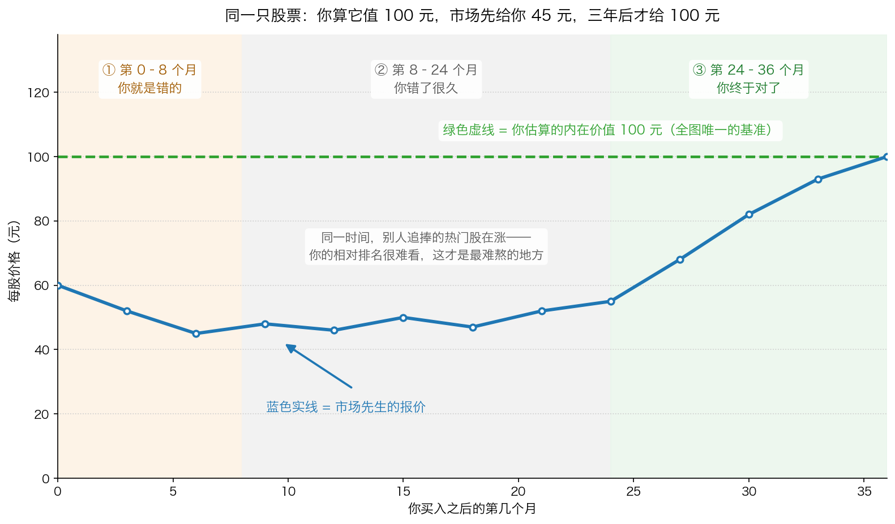
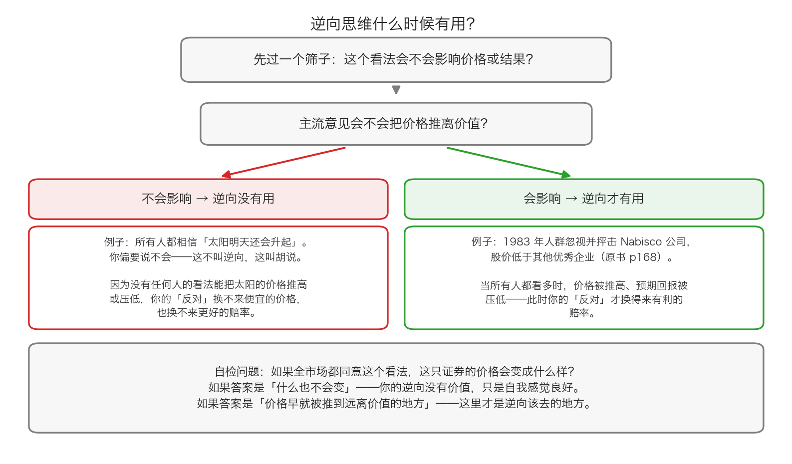

# 第 1 章：逆向思维——为什么你一开始总是错的

> 本章你将：
> - 明白为什么价值投资在本质上是逆向投资，以及"价值"具体会从哪三种场景里冒出来
> - 接受一个反直觉的事实：逆向投资者一开始几乎总是错的，而且可能错得比大众更久
> - 学会一个筛选器，判断什么时候逆向有用、什么时候只是自我感觉良好
> - 知道研究做到什么程度就该停手（80/20 原则），以及为什么"等信息全齐了"就买不到便宜货
> - 回答"这对我的钱包意味着什么"：给未来那段"明明看对了却一直亏钱"的日子，提前打好预防针

第 0 章我们拿到了机会地图：好机会在没人要的地方。可是"没人要的地方"这五个字，说起来轻松，站过去却很难受。

这一章要讲的就是：**当你真的站到人群对面时，接下来会发生什么。** 卡拉曼在这一节里的诚实程度，在投资书里是罕见的——他没有说"逆向很酷、你会有超额收益"，他说的是：**你会先错，而且可能错很久。**

---

## 1.1 价值投资在本质上是逆向投资

原书 p167 开门见山：

> "从本质上看，价值投资就是逆向投资。不受欢迎的证券可能被低估，而深受欢迎的股票几乎永远也不会被低估。"

为什么"深受欢迎"就等于"不便宜"？因为受欢迎这件事本身会推高价格。原书接着说：

> "那些深受欢迎的证券的价格已经因乐观的预期而出现了上涨，这些证券不大可能代表着那些已经被忽视的优秀价值。"（p167）

**生活类比：** 菜市场里被围了三圈的那个摊位，价格早就被抬到了最高；真正便宜的菜，往往在没人排队的角落。不是因为角落里的菜更好，而是因为**没人抢，所以价格没被抬起来**。

那价值到底会从哪里冒出来？原书 p167 给了三个词：

> "当遭到抛售、无人察觉或者被人忽视的时候，价值就会出现。"

拆开来看，这是三种完全不同的场景：

| 场景 | 谁在做什么 | 典型的样子 |
|---|---|---|
| **遭到抛售** | 所有人同时想跑 | 股价连续下跌、跌停、成交量放大 |
| **无人察觉** | 没人知道它存在 | 太小、太无聊、没有分析师跟踪 |
| **被人忽视** | 有人知道，但懒得看 | 刚分拆出来、刚被剔除出指数、刚改过名字 |

原书紧接着补了一句（p167）：人群正在卖出一种证券的时候，"价格可能会下跌至远远超过合理的水平"；而被忽视的、"身份低微或者刚刚才出现的证券可能也是低估的，或者变成被低估"。

> 📌 **划重点：** 请注意"逆向投资"和"反着买"的区别。**逆向不是一个动作，而是一个结果。** 因为你独立算过价值，所以你的结论碰巧和人群相反——这才是逆向。如果你没有算过价值，只是"看到大家买我就卖、看到大家卖我就买"，那不是逆向，那只是一种**方向相反的跟风**，而且比跟风更危险，因为你连自己在赌什么都不知道。

---

## 1.2 逆向的代价：你几乎总是先错

这一节是本章的核心。原书 p167–p168 把这件事讲得非常直白，我把它拆成三层来读。

**第一层：一开始就是错的。**

> "因为要同人群对着干，逆向投资者在一开始的时候几乎都是错的，且有可能在一段时间内蒙受账面上的亏损。"（p167–p168）

注意这里说的是"几乎都是"和"一段时间内"。不是"可能错"，是**几乎一定会先错**。

**第二层：出错率更高，错的时间也可能更长。**

> "逆向投资者不仅仅是在最初的时候是错的，同其他人相比，他们可能有着更高的出错率，且错误维持的时间可能更长，因为市场趋势能够让价格脱离价值持续很长一段时间。"（p168）

这句话里藏着两个独立的坏消息，必须分开看：

- **出错率更高**：因为你买的是"没人要"的东西，而没人要的东西里，确实有相当一部分是**真的有问题**。跟风买热门股的人至少有一个优势——他不太可能买到一只马上退市的股票。
- **错误维持的时间更长**：就算你看对了，价格也可能在很长时间里不认。"市场趋势能够让价格脱离价值持续很长一段时间"——这句话没有任何安慰成分，它没说"一段时间"是多久。

**第三层：跟人群一起的人，在一段时间里几乎总是对的。**

原书 p168 接着说：跟着人群一起操作的那些人，在一段时期内几乎总是正确的。

> 📌 **划重点：** 这三层加起来，就是逆向投资最难受的地方——**在相当长的一段时间里，你会同时承受两件事：你的账面在亏，而且别人在赚。** 而最折磨人的是，**没有任何人能事先告诉你这段"一段时间"是三个月还是三年。**

这张图（简化示意数字）画的是一笔逆向下注的完整心路历程。图里有两条线，请注意它们的单位是同一个（每股多少元），基准也只有一根：

- **绿色虚线**：你估算的内在价值，100 元，全过程不变——这是全图唯一的基准。
- **蓝色实线**：市场先生的报价。你在第 0 个月按 60 元买入，然后它跌到 45 元，接着在 45 到 55 元之间趴了一年半，直到第 24 个月之后才开始往上走，第 36 个月才回到 100 元。

图里被底色分成三个阶段，请对照着看：

1. **第 0–8 个月：你就是错的。** 买入之后继续跌 25%。所有人的反应都是"你买早了"。
2. **第 8–24 个月：你错了很久。** 价格趴着不动，你的钱被锁在里面。同一时间，别人追捧的热门股在涨——**这才是最难熬的地方**：你不但没赚钱，你还在"少赚"。Week 8 讲过，这叫机会成本。
3. **第 24–36 个月：你终于对了。** 但只有撑过前两个阶段的人，才拿得到这一段。

> ⚠️ **易踩坑：** 很多人以为自己会输给"亏损"，其实绝大多数人是输给**第二阶段的"别人在赚"**。亏损是可以忍的，只要你相信自己的判断；但"我明明是对的，为什么别人赚得比我多"这种念头，会让人在第 18 个月、在价格最低的时候，把股票卖掉，然后去买那个"正在涨"的东西。**这就是为什么"能不能拿住"本身就是收益率的一部分。**

那怎么才能拿得住？第 0 章讲过一半答案：**你得知道它为什么便宜**（如果是"有人被迫卖出"，你就能坐得住）。这一章补上另一半：**你得提前接受"你会先错"这个事实**。人对痛苦的承受力，很大程度上取决于他有没有预料到这件事会发生。

---

## 1.3 逆向什么时候有用，什么时候只是自我感觉良好

原书在 p168 给了一个非常好用的筛选器。

> "当广为接受的观点不会对手上的证券带来影响时，无法从逆流而上的行为中获得任何好处。"

原书举的例子是：人们总是一致认为，太阳明天还会升起，但这一观点不会对结果带来任何影响。你偏要说"太阳明天不会升起"，这不叫逆向，这叫胡说——而且这个"逆向"换不来一分钱。

> "然而，当主流意见确实影响到结果或概率时，逆向思维就能派上用场了。"（p168）

为什么主流意见会影响结果？原书接着解释（p168）：当人群蜂拥买入家庭医疗保健股时，这类股票的价格被推高，因此也就降低了回报——**多数人已经改变了风险与回报的比率**，从而让逆向投资者能够以有利的赔率与人群对赌。

原书还举了一个具体的例子：

> "当投资者在1983 年忽视或者抨击Nabisco 公司，从而造成股价低于其他优秀企业的股价的时候，风险/回报比率就变得更加有利了，从而为逆向投资者创造了买入的机会。"（p168）

（Nabisco 是美国一家食品公司，就是做饼干和零食的那类企业。这一段说的机制不难懂：**一家好公司因为被大家讨厌，股价被压到比其他同样优秀的公司更低——这个差价就是你的机会。**）

这张图把 p168 那个筛选器画成了一道流程：

- 先问：**主流意见会不会把价格推离价值？**
- 如果答案是"不会"（比如"太阳明天还会升起"），那么你的反对换不来任何便宜的价格，也换不来更好的赔率——**逆向没有用。**
- 如果答案是"会"（人群的蜂拥买入把价格推高、把预期回报压低），那么你的反对才有价值——**逆向才有用。**

所以判断方法可以浓缩成一个自检问题：

> **如果全市场都同意这个看法，这只证券的价格会变成什么样？**

- 如果答案是"什么也不会变"——你的逆向没有价值，只是自我感觉良好。
- 如果答案是"价格早就被推到远离价值的地方"——这里才是逆向该去的地方。

> 💡 **换个说法：** 逆向投资赚的不是"我和别人不一样"的钱，赚的是**"别人把价格推歪了"的钱**。如果别人的看法不影响价格，那别人的看法就与你无关——你既不需要同意他们，也不需要反对他们。

---

## 1.4 到底要研究到什么程度才够

这是每个认真的人都绕不过去的问题：**我要查多少资料，才敢下手？**

原书 p168–p170 专门讨论了这件事，而且它的答案可能会让你意外。

**先看两种走极端的做法（p168）。** 原书说，一些投资者坚持试图获得所有与自己即将进行的投资有关的信息，并对企业进行研究，直至认为自己知道了所有应该知道的东西。他们会研究行业和竞争情况，与前雇员、行业咨询人员和分析师交流，了解公司的高级管理层，研究过去 10 年的财务报告和长期股价走势。

原书说这种勤奋值得赞赏，但指出它有两个不足（p168–p169）：

1. **无论进行了多少研究，一些信息总是会被漏掉。** "投资者必须学会适应信息的不充分。"（p168）
2. **即使你知道所有信息，也并不一定能够从中赢利。**（p169）

**第二个不足值得单独讲。** 这是很多人想不通的地方：如果我把一家公司研究到极致，怎么可能还赚不到钱？答案是——**赚不赚钱不只取决于你知道多少，还取决于别人知道多少，以及你付了多少钱。** 一只所有人都研究透了的股票，价格里已经包含了全部这些研究成果。

**然后是那个著名的比例（p169）：**

> "基本面分析肯定有用，但信息通常遵循80/20 原则。最初80%的信息可以在最初所花的20%的时间内获得。彻底的基本面分析会降低边际回报。"

先解释 **80/20 原则**：它说的是"结果的一大部分，往往来自投入的一小部分"。生活类比：你要判断一个人靠不靠谱，聊两次天、看他怎么对待服务员，基本就有数了；把对方的银行流水全部调出来，并不会让你的判断准确五倍。

**原书还给了一个让人后背发凉的故事（p169）。** 大卫·德勒曼讲过一个"非常了解"高乐氏公司的分析师的故事：他能说出不同牌子的漂白剂在西南地区每个小镇上所占的市场份额，还能告诉你高乐氏公司第三家工厂中第二条生产线的产出水平。

那么，当这家公司开始出现大问题的时候，他注意到了吗？

原书的原话是——"他没有注意到这些迹象"，股价从 53 美元跌至 11 美元（p169）。

> 📌 **划重点：** 这个故事的教训不是"研究没用"，而是——**知道很多细节，不等于看得见方向。** 一个能背出每条生产线产量的人，可能恰恰因为太熟悉细节，而忽略了"整个行业的需求正在消失"这种大问题。研究的目的是**判断这家公司值多少钱**，不是**成为这家公司的专家**。

**最后，原书解释了为什么你必须在不完全的信息下出手（p170）：**

> "高不确定性经常伴随着低价格。当不确定性消除的时候，价格可能已经涨上来了。"

原书接着说：在没有获得所有信息的情况下所作出的投资决定，"常常能给投资者获利"；承担由不确定性所带来的风险，"也常常能让投资者获得回报"；而其他投资者"可能因花时间研究最后一些尚未得到答案的细节而错过了低价买入的机会"（p170）。

> 💡 **换个说法：** 不确定性不是你要**消除**的东西，它是你要**定价**的东西。别人因为不确定而不敢买，价格才会便宜。如果你非要等到不确定消失，你买到的就是"确定"的价格，而不是便宜的价格。这正是 Week 7 讲的安全边际存在的理由——**它不是让你不承担不确定性，而是让你在承担不确定性时，脚下有一层垫子。**

---

## 1.5 落到 A 股/港股：逆向在这里长什么样

把上面这些道理装进 A 股/港股 的日常场景：

| A 股/港股 现象 | 人群在做什么 | 逆向着要问的问题 |
|---|---|---|
| 一只绩优股连跌 40%，股吧一片"完了" | 恐慌卖出，理由只是"跌了" | 我算的价值变了吗？还是只是价格在变？ |
| 一只股票被调出沪深 300 | 指数基金不问价格地卖出 | 这种卖压跟公司的生意有关系吗？ |
| 一只股票被 ST、股价跌到 2 元 | 机构有内部规定不能买 | 这条规定能改变公司的价值吗？（先查：它是不是真的快退市了） |
| 一家公司刚分拆出来的子公司上市 | 拿到股票的母公司股东无脑卖 | 我算过这个小公司值多少钱吗？ |
| 一只热门股被基金抱团、股价创新高 | 人群在买 | 我算出来的价值支持这个价格吗？ |
| 某公司公告配股，股价下跌 | 不想掏钱的人提前卖出 | 配股价和我算的每股价值，哪个高？ |

> ⚠️ **易踩坑：** 在 A 股做逆向，有两个额外的坑，比美国市场更深。
> **第一，"跌得多"和"便宜"是两件事。** 一只股票从 100 元跌到 10 元，如果你算出来它只值 5 元，它照样是贵的。跌幅永远不是估值。
> **第二，"没人买"有时候真的是因为它烂。** 退市风险、财务造假、大股东占用资金、主业彻底萎缩——这些是真实的基本面恶化，不是"市场先生的情绪"。原书自己都说了，逆向者的**出错率更高**（p168）。
> 所以逆向的前提永远是**你自己算过的价值**，而不是"跌了这么多总该反弹了"。

---

## ✍️ 想一想

1. 原书说"跟着人群一起操作的那些人，在一段时期内几乎总是正确的"。既然如此，为什么长期看他们反而赚不到钱？（提示：想想他们在那段"正确"的时期里会做什么，尤其是当那段时期结束的时候。）
2. 有人说："逆向就是别人恐惧我贪婪。"请用本章 1.3 的筛选器检验这句话——它缺了哪一步？
3. 你在第 0 个月按 60 元买入一只你估值为 100 元的股票。第 8 个月它跌到 45 元，之后两年一直在 45 到 55 元之间。请写下：你会分别在第 8 个月、第 18 个月、第 30 个月对自己说什么？（这一题没有标准答案，但你的答案会暴露你会不会在第 18 个月卖在最低点。）

> 💡 **参考思路：**
> 1. 因为"一段时期"这个词是有陷阱的。在趋势还在的时候，跟风的人确实一直在赚钱——而赚钱会让他们**加大投入**，甚至借钱投入。等到趋势反转，他们不仅仅把之前赚的还回去，还会因为仓位比开始时大得多而亏掉本金。原书说"市场趋势能够让价格脱离价值持续很长一段时间"（p168），这句话的潜台词是：**它脱离得越久，跟风的人下注越重，最后摔得越狠。** 逆向者难受，但逆向者的仓位是在便宜的时候建的；跟风者舒服，但他的仓位是在贵的时候建的。
> 2. 它缺了"价格"这一步。"别人恐惧"只是一个情绪描述，不是买入理由。完整的链条应该是：别人恐惧 → 所以价格被压到远低于价值 → 我算过价值，确认这里确实便宜 → 才买。缺少中间那一步，"别人恐惧我贪婪"就变成了一句口号——而口号不能帮你判断 45 元的股票到底值 50 元还是只值 20 元。**原书 p168 的筛选器问的是"主流意见会不会把价格推离价值"，不是"主流意见是不是很悲观"。**
> 3. 参考答案的形态是这样的：第 8 个月，你会说"我是不是算错了？要不要再查一遍？"——这时该做的是回去复核估值，而不是看盘。第 18 个月是最危险的时候，你多半会说"都一年半了还这样，别人都在赚钱，我是不是傻了"——**这一句话就是砍在最低点的前奏。** 第 30 个月，你会说"幸好当时没卖"。请注意：这三句话里，**只有第 8 个月那句话是有用的**（它促使你复核估值），另外两句都只是情绪。如果你在第 18 个月能对自己说"我知道这是最难熬的一段，原书早就写过了"，你就已经赢了大多数人。

---

## 🧮 算一算

**情境（简化示意数字，用于教学）。** 你在第 0 个月花 60 元买入一只你估算内在价值为 100 元的股票。这一次，价格回归花了整整 **5 年**——第 5 年末才回到 100 元。

同一时间，你的朋友买了一只热门股，连续 5 年每年涨 15%。

**问题 1：** 你这 5 年的总收益率是多少？

**问题 2：** 这 5 年的**年化**收益率大约是多少？（用试乘的办法，找那个连乘 5 次等于 1.667 的数。）

**问题 3：** 你朋友那 60 元，5 年后变成多少？

**问题 4：** 你和他差多少钱？这个差距是从哪里来的？

**问题 5：** 如果第 5 年不但没有回归，价格反而停在 50 元，你这 5 年的年化收益率是多少？

**问题 6：** 把这几个数字放在一起，你能得出关于"错得久"的什么结论？

### 分步解答

**问题 1：**

第一步，赚到的钱：

$$100 - 60 = 40 元$$

第二步，收益率（分母是你付出的 60 元）：

$$40 \div 60 = 0.6667 = 66.7\%$$

**结论：总收益率 66.7%。** 注意，这个数和"3 年回归"时的总收益率**一模一样**——因为起点和终点都没变。

**问题 2：**

要找年化收益率，就是要找一个数，"1 加上它"连乘 5 次之后等于 1.667。用试的办法：

- 试 1.10：1.10 乘 1.10 = 1.21；1.21 乘 1.21 = 1.4641；再乘 1.10 = 1.6105。**比 1.667 低一点。**
- 试 1.11：1.11 乘 1.11 = 1.2321；1.2321 乘 1.2321 = 1.5181；再乘 1.11 = 1.6851。**比 1.667 高一点。**

所以答案在 10% 和 11% 之间。取 10.8% 验证：

$$1.108 \times 1.108 = 1.2277$$

$$1.2277 \times 1.2277 = 1.5072$$

$$1.5072 \times 1.108 = 1.6700$$

（这里用了"先平方、再平方、最后补一次"的算法：5 次方 = 2 次方 + 2 次方 + 1 次方。）

**结论：年化约 10.8%。**

**问题 3：**

先算 1.15 的 5 次方：

$$1.15 \times 1.15 = 1.3225$$

$$1.3225 \times 1.3225 = 1.7490$$

$$1.7490 \times 1.15 = 2.0114$$

所以 5 年后你的朋友有：

$$60 \times 2.0114 = 120.68 元$$

**结论：约 120.7 元。**

**问题 4：**

$$120.68 - 100 = 20.68 元$$

差距约 20.7 元。这个差距**不是**来自"你选错了公司"——你选的公司确实从 60 元涨到了 100 元，一分没少。差距来自**年化收益率的差别**：你 10.8%，他 15%。

> 📌 这两个数字的对比说明了一件事：**在投资里，"对"和"对得多快"是两个独立的变量。** 你可以完全看对，同时跑输一个只看运气的人。这就是为什么原书要用整整一节来讲逆向者"错误维持的时间可能更长"（p168）。

**问题 5：**

第一步，价格停在 50 元，所以总共是亏的：

$$50 \div 60 = 0.8333$$

也就是 5 年总共亏了 16.7%。

第二步，找年化收益率，就是找一个数，连乘 5 次等于 0.8333：

- 试 0.96：0.96 乘 0.96 = 0.9216；0.9216 乘 0.9216 = 0.8493；再乘 0.96 = 0.8153。**低了一点。**
- 试 0.965：0.965 乘 0.965 = 0.9312；0.9312 乘 0.9312 = 0.8671；再乘 0.965 = 0.8368。**接近了。**

所以年化约 **-3.6%**。

**问题 6：**

把四个数字摆在一起：

| 情形 | 5 年后的钱 | 总收益 | 年化收益 |
|---|---|---|---|
| 3 年就回归（对比用） | 100 元 | 66.7% | 18.6% |
| 5 年才回归 | 100 元 | 66.7% | 10.8% |
| 5 年还没回归，停在 50 元 | 50 元 | -16.7% | 约 -3.6% |
| 朋友的热门股（年化 15%） | 120.7 元 | 100.7% | 15% |

三条结论：

1. **等待不是中性的，它是有价格的。** 同一笔 66.7% 的收益，3 年拿到是年化 18.6%，5 年拿到就只剩 10.8%——**几乎腰斩**。
2. **光"看对"不够，你还得看对"要多久"。** 你完全看对了公司（60 元到 100 元），却输给了一个年化 15% 的人。这在价值投资里是常态，不是意外。
3. **如果价值不但不兑现，还在被腐蚀，你等来的不是回本，是亏损。** 第 5 年停在 50 元，年化 -3.6%——这就是第 3 章要讲的"没有催化剂的价值投资有多难受"。

---

## ✅ 小测验

**1. 关于逆向投资者，下面哪一种说法最符合原书？**
A. 逆向投资者只要方向对，很快就能赚钱
B. 逆向投资者在一开始几乎都是错的，而且同其他人相比，出错率可能更高、错误维持的时间可能更长
C. 逆向投资者不会亏钱，因为他们买得便宜
D. 逆向投资者应该永远和大众反着做

**2. 下面哪一种情况下，逆向思维派不上用场？**
A. 人群蜂拥买入某类股票，把价格推得很高
B. 一家好公司被大家抨击，股价低于同类公司
C. 所有人都相信"太阳明天还会升起"，而你偏要反对这一看法
D. 一家公司被调出指数，指数基金不问价格地卖出

**3. 关于"要研究到什么程度才够"，下面哪一种说法最符合原书？**
A. 必须把所有信息都收集齐，才能开始投资
B. 信息遵循 80/20 原则：最初 80% 的信息可以在最初 20% 的时间里获得，彻底的基本面分析会降低边际回报
C. 研究没有用，投资靠的是运气
D. 只要研究得足够深，就一定能赚到钱

> **答案与解析**
>
> **1. B。** 这是原书 p168 的原话："逆向投资者不仅仅是在最初的时候是错的，同其他人相比，他们可能有着更高的出错率，且错误维持的时间可能更长。" A 错——p167–p168 明确说逆向者"在一开始的时候几乎都是错的"，而且可能"在一段时间内蒙受账面上的亏损"。C 错——买得便宜不等于不会亏，如果你算的价值本身错了，便宜也是假的。D 错——这正是 1.3 节筛选器要否掉的做法：当主流意见不影响价格和结果时，反着做没有任何好处。
> **2. C。** 原书 p168 的原话是："当广为接受的观点不会对手上的证券带来影响时，无法从逆流而上的行为中获得任何好处。" 太阳会不会升起这个观点，不会因为大家怎么想而改变，也不会影响任何证券的价格。A、B、D 都是"主流意见正在影响价格"的情形：A 是买入推高价格、压低预期回报；B 是抨击压低价格、抬高预期回报；D 是机制性的卖出压力把价格压离价值。
> **3. B。** 这是 p169 的原话。A 错——p168 说"无论进行了多少研究，一些信息总是会被漏掉，投资者必须学会适应信息的不充分"；而且 p170 指出"高不确定性经常伴随着低价格。当不确定性消除的时候，价格可能已经涨上来了"。C 错——原书明确说"基本面分析肯定有用"（p169）。D 错——p169 说得很清楚："即使一名投资者能够知道与某项投资有关的所有信息，也并不一定能够从中赢利。"

---

## 📖 回到原书

- 对应原书 **第九章** 的"价值投资和逆向思维""多少研究和分析才足够？"两节，`raw/安全边际-中文版/page_167.md` ~ `page_170.md`（原书 p167–p170）。
- 建议精读：**p167–p168**（逆向者"先错、错得久、最后才对"的完整表述，这是本书里最诚实的一段话之一，值得读三遍）、**p170**（"高不确定性经常伴随着低价格"，这一段是理解安全边际为什么存在的关键）。
- 可以略读：**p168–p169** 关于"多少研究才够"的论述（知道 80/20 原则和高乐氏分析师的故事就够了）、**p169–p170** 关于信息保密和内部消息的部分（第 2 章会专门讲法律界限）。
- 原书金句（逐字引用）：
  > "从本质上看，价值投资就是逆向投资。不受欢迎的证券可能被低估，而深受欢迎的股票几乎永远也不会被低估。"（p167）
  >
  > "当遭到抛售、无人察觉或者被人忽视的时候，价值就会出现。"（p167）
  >
  > "因为要同人群对着干，逆向投资者在一开始的时候几乎都是错的，且有可能在一段时间内蒙受账面上的亏损。"（p167–p168）
  >
  > "逆向投资者不仅仅是在最初的时候是错的，同其他人相比，他们可能有着更高的出错率，且错误维持的时间可能更长，因为市场趋势能够让价格脱离价值持续很长一段时间。"（p168）
  >
  > "然而，当主流意见确实影响到结果或概率时，逆向思维就能派上用场了。"（p168）
  >
  > "基本面分析肯定有用，但信息通常遵循80/20 原则。最初80%的信息可以在最初所花的20%的时间内获得。彻底的基本面分析会降低边际回报。"（p169）
  >
  > "高不确定性经常伴随着低价格。当不确定性消除的时候，价格可能已经涨上来了。"（p170）

下一章换一个方向：如果前两章讲的都是"你要主动去找"，那么有没有一些线索是**别人主动送到你面前、而你只要愿意看就能看到**的？
