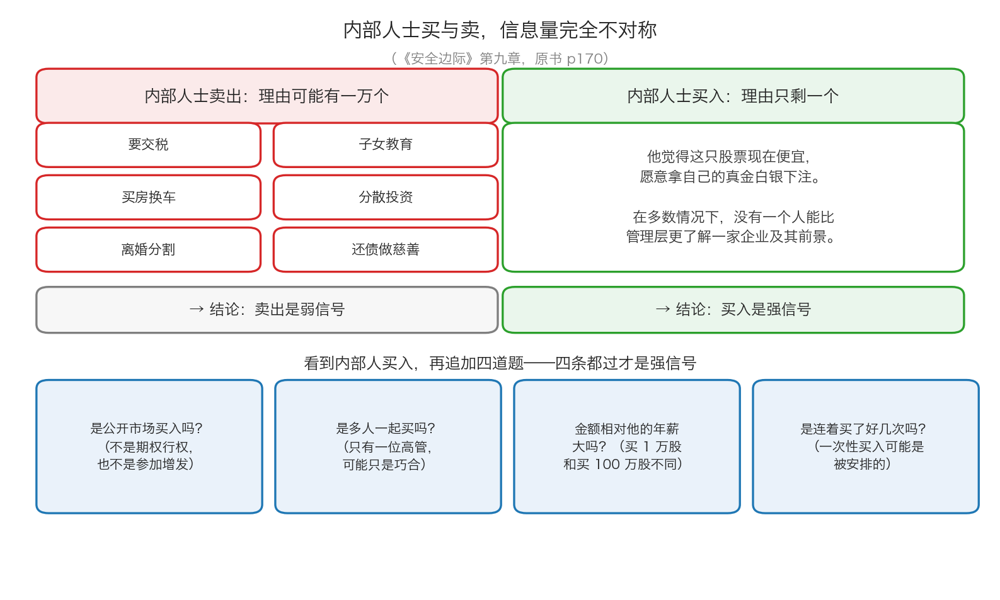
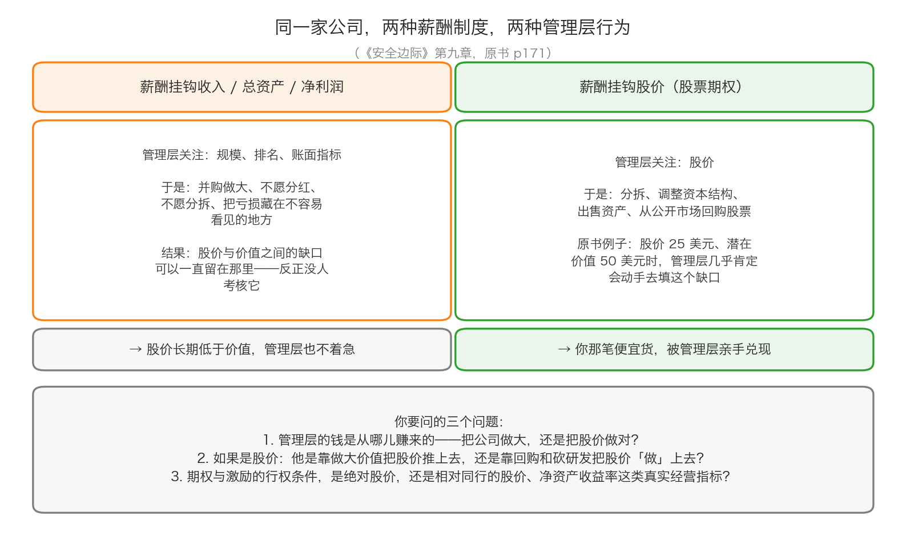

# 第 2 章：内部人士买入与管理层期权

> 本章你将：
> - 知道为什么"内部人士买入"是公开信息里信息量最大的线索之一，而"内部人士卖出"几乎说明不了什么
> - 看懂管理层的薪酬设计如何决定他们会做什么：把公司做大，还是把股价做对
> - 分清"管理层把价值做大"和"管理层把价格做上去"这两件完全不同的事
> - 弄清内部信息和公开信息的法律界限，并拿到三条可以照着做的操作规则
> - 回答"这对我的钱包意味着什么"：把一个免费的、别人懒得看的信号，加进你的买入检查清单

上一章讲的是姿态：逆向，而且要做好"先错很久"的准备。这一章讲一条具体的线索——**它是公开的、免费的，但绝大多数人从来不看。**

---

## 2.1 一条几乎免费的线索

原书 p170 是这么开头的：

> "在寻找所有与企业有关的信息的时候，投资者经常忽视一个非常重要的线索。"

这个线索就是**内部人士的买入**。

**先解释"内部人士"这个词。** 生活类比：你和朋友合伙开了一家餐馆，你的朋友既是股东、又是每天站在灶台前的厨师长。他比任何人都清楚这个月店里到底赚不赚钱、食材涨了多少、隔壁是不是要新开一家火锅店。公司里的"内部人士"就是这种人：**董事、监事、高级管理人员，以及持股达到一定比例的大股东**（A 股通常指持股 5% 以上的股东）。

原书接着说了为什么这条线索有价值（p170）：

> "在多数情况下，没有一个人能较管理层更了解一家企业及其前景。"

然后就是那句被引用得最多的话：

> "一名内部人士卖出股票的理由可能有很多（需要现金来支付税收和费用等），但买入的理由只有一个。"（p170）

**为什么这句话成立？** 把两件事并排摆着看就明白了：

- **卖出**：他可能要交税、要买房换车、离婚要分割财产、要给孩子交学费、单纯想分散一下自己的资产。这些理由**和"公司值不值这个价"毫无关系**。
- **买入**：他为什么要拿自己的现金，去买自己公司的股票？只有一种解释——**他认为现在这个价格是划算的。**

这张图把上面这个不对称画了出来：左边是卖出的六个常见理由，右边是买入的一个理由。图的下面还有四道"加试题"，我们在 2.5 节会逐条讲。

> 📌 **划重点：** 内部人买入**不是内幕消息**，它是**一个把自己的钱押上去的公开表态**。它不能保证你一定赚钱（他也可能看错，而且他比你更了解公司不等于他更了解价格），但它把"管理层和股东站在同一边"这件事，从一句口号变成了一个**可以查证的事实**。

原书还提到，投资者可以在几个专业出版物上跟踪内部人士的买入卖出操作（p170 举的是美国一家叫 Vickers 的数据商）。这是 1991 年的做法，今天你不需要花钱。

> 🇨🇳 **落到 A 股/港股：** 中国内地和香港的信息披露规则，把这件事变成了**免费的公开信息**。
> - **A 股**：去**巨潮资讯网**（cninfo.com.cn），在公司公告里找"董事、监事、高级管理人员持股变动"，或者"股东增持/减持"公告。持股 5% 以上的股东和董监高的每一次买卖都要披露。
> - **港股**：去**港交所披露易**（hkexnews.hk），找"权益披露"（Disclosure of Interests）栏目。港股要求董事和持股 5% 以上的股东披露权益变动。
>
> ⚠️ 但要分清"增持"的三种来源：① **二级市场买入**（用自己的钱在交易所买）；② **参与增发或配股**（可能是被安排的）；③ **协议受让**（大股东之间转让）。**只有第一种，也就是"在公开市场上、用自有资金、真金白银地买"，信号才最强。**

---

## 2.2 管理层的钱包挂在哪里，他的眼睛就盯着哪里

讲完线索，原书把镜头转向了一个更根本的问题：**管理层到底想干什么？**

> "企业管理层的动机是决定一项投资最终结果的一个非常重要的因素。"（p171）

**先解释"股票期权"。** 生活类比：你的老板跟你说——"公司现在每股 25 元。我给你一张票，未来五年里，你随时可以按 25 元的价格从公司买 100 万股。"如果五年后股价涨到 50 元，你用 25 元买进来，一股赚 25 元；如果五年后股价还是 20 元，这张票一文不值，你什么也不会做。

**这张票就是股票期权。** 它的特征是：**股价涨，它值钱；股价不涨，它一分不值。** 落到 A 股/港股：这套东西的统称是**股权激励**，常见形式包括股票期权、限制性股票、员工持股计划；港股叫"股份期权计划"。

原书接下来把两种薪酬制度的结果摆在一起对比（p171）：

- 如果管理层的薪酬标准是**收入、总资产甚至净收益**，"那么管理层就会忽视股价而关注于那些反映企业表现的指标"。
- 如果提供给管理层的激励措施**与股价最大程度的上涨有关**，"那么管理层的关注焦点就会有所不同"。

然后是最能说明问题的一段（p171）：

> "例如，一家公司的股价为25 美元，但潜在价值为50 美元，那么几乎可以肯定这家公司的管理层就会通过分拆、调整资本结构或者出售资产来推高股价，以缩小价格与潜在价值之间的缺口。"
>
> "从公开市场上以25 美元的价格回购股票不仅能提高股价，也能让潜在价值超过50 美元。"（p171）

这段话对价值投资者意味着什么？它把"催化剂"从一个**运气问题**，变成了一个**动机问题**。

第 3 章会专门讲催化剂——这里先埋一个伏笔：**如果一家公司的管理层，其个人财富和股价挂钩，而股价又明显低于你算出来的价值，那么他有极强的个人动机去当那个催化剂。** 他不需要你提醒，他自己会比你还着急。

这就是原书 p171 那句话的另一层意思：**你不需要了解管理层"人好不好"，你只需要知道"他的钱从哪儿来"。** 一个把全部身家押在公司股票上的董事长，和一个主要靠规模和排名的职业经理人，面对同一份资产时的行为会完全不同。

> 💡 **换个说法：** 看一家公司的时候，先问一句："**这家公司的管理层，靠什么发财？**" 如果答案是"把公司做大"，那他就会去并购、扩产、把收入做上去；如果答案是"把股价做对"，那他就会去想分拆、回购、卖资产这些能缩小价差的事。**两种人没有绝对的好坏，但你要知道自己买的是哪一种。**

---

## 2.3 硬币的另一面：期权也可能让管理层做坏事

期权把管理层的利益和股价绑在一起。可是 Week 2 讲过一件很重要的事：**价格和价值是两件事。** 价格可以因为情绪、供求、消息而变动，价值只能靠把生意做好来积累。

所以这里有一条必须分清的岔路：

| 管理层想让股价涨，有两条路 | 具体做法 | 对留下的股东 | 对公司长期价值 |
|---|---|---|---|
| **把价值做大** | 提高毛利率、砍掉长期亏钱的业务、把好资产分拆出来单独定价、用多余的现金回购**便宜的**股票 | 好 | 好 |
| **把价格"做"上去** | 借钱回购托价、砍掉短期看不见回报的研发投入、放宽赊销把收入提前确认、把亏损藏在不容易看见的地方 | 短期好，长期坏 | 坏 |

> ⚠️ **易踩坑：** 看到"公司回购股票"不要自动当成利好。回购至少有两种完全不同的动机：
> ① 用**多余的现金**买回**便宜的**股票——留下来的股东，每人的持股比例变大了，这是好事；
> ② 借钱回购、把股价托住，好让管理层的期权行权——这是把股东的钱转移给管理层。
> **分辨的办法是看两件事：回购的钱从哪儿来（自有现金还是借的），以及回购的价格相对于你算的价值是高还是低。** 一家公司在你算出价值 50 元、股价 25 元的时候回购，是好事；在股价 80 元的时候回购，是在毁灭价值。

还有一个更隐蔽的问题：**期权本身不是免费的，它的成本由老股东分摊。** 这一点很多人没算过，本章的算一算会带你亲手算一遍。

---

## 2.4 内部信息 vs 公开信息：法律的那条线

原书 p171–p173 用整整两页讨论了这件事，而且它的结论会让你有点意外：**这条线本身并不清楚。**

先把词说清楚。**内幕信息**（也叫内部信息、特权信息）= **还没公开、但一旦公开就很可能影响股价的重大信息**。比如还没公布的业绩、还没宣布的收购、还没批复的重整方案。

生活类比：你和朋友打牌，你偷看了底牌——**用这张底牌去下注，就是作弊**。在证券市场里，这张"底牌"就是内幕信息，用它来买卖证券是**违法**的。

原书提了一连串没有确定答案的问题（p172），我把它们简化成几个：

- 一位公司的执行官告诉你的信息，算不算公开信息？（假设这里面没有金钱交易。）
- 股票经纪人告诉你的信息呢？投资银行家告诉你的信息呢？
- 基本面分析可以做到什么程度？可以雇私人调查员去翻一家公司的垃圾桶吗？
- 如果你把债券卖回给发行公司，这笔交易的信息算不算内幕信息？
- 内幕信息什么时候会因为太旧而不再受保护？

原书的态度很诚实（p172）：

> "这些问题没有确定的答案。当然，投资者必须尽最大努力来遵守法律"

而且它指出，因为法律的规定并不明确，**遵纪守法的投资者反而可能因为"无知"而犯错**，与那些不道德的人相比，他们可能会在获得消息更少的情况下进行投资（p172）。所以原书给了一条很实际的建议（p173）：

> "当投资者不确定自己是否已经越界的时候，在进行交易之前，应该问问消息来源，也可以问问自己的律师。"（p173）

> 🇨🇳 **落到 A 股/港股：** 中国内地的《证券法》明确禁止内幕交易，并要求上市公司建立**内幕信息知情人登记制度**——谁在什么时候知道了什么，公司要登记备查。港股方面，《证券及期货条例》也把内幕交易列为市场失当行为，上市公司在信息泄露时有尽快向市场披露的义务。
>
> 对普通投资者来说，这些法条可以浓缩成三条**可以执行**的操作规则：
> 1. **只用公开信息。** 公告、年报、招股说明书、交易所互动平台上的公开问答——这些都是公开的。你从公开渠道研究得再深，都不越界。
> 2. **不打听、不转发、不根据"朋友的朋友说的"下单。** 你不需要判断那条消息是真是假；**"根据未经公开的重大信息交易"这个动作本身就够了。**
> 3. **当你犹豫"这算不算越界"的时候，答案通常就是"不要做"。** 原书自己都承认这条线不清楚（p172），那么对你来说，最安全的做法就是离它远一点——**而且你根本不缺这条线索**（见下一段）。

> 📌 **划重点：** 内部人买入之所以是一条好线索，恰恰是因为它**不需要你越界**——它是内部人士自愿、公开、用自己的钱做出的表态。你不需要知道他们知道什么，你只需要知道：**他们买了多少、用什么价格买的、买了多少次。**

---

## 2.5 把信号装进你的检查清单

现在回到 2.1 的那张图。看到一条"内部人买入"的公告之后，不要立刻下单，先过四道加试题：

**第一道：是公开市场买入吗？**
如果它是"参加公司增发""接受大股东协议转让""期权行权"，那它的含义完全不同。期权行权只是把早就谈好的报酬兑现，跟"他觉得现在便宜"没什么关系。

**第二道：是多人一起买吗？**
只有一位高管买入，可能只是巧合（他刚卖了一套房）。如果是董事长、总经理、财务总监、几位董事在一个月内都买了，那就很难用巧合解释了。

**第三道：金额相对他的年薪大吗？**
一位年薪 200 万元的高管买了 10 万元的股票，是表态；买了 2000 万元的股票，是下注。**看绝对金额没有意义，要看它占他个人财富的比例。**

**第四道：是连着买了好几次吗？**
一次性买入可能是被安排的（比如为了满足某个承诺），连续几个月买入更像是在建仓。

**最后再加一道，这一道最重要：买入价和你的估值比，谁更低？**
如果内部人在 30 元买入，而你按 Week 9 的方法算出这家公司只值 20 元，那这笔买入对你毫无意义——他可能只是比你乐观，或者他有你不知道的看好理由，但**你不需要为一个你自己算不过来的价格买单**。

> 📌 **划重点：** 内部人士买入的正确用法，不是"看到他买我就买"，而是——**"他买"这个动作，让我愿意多花两个小时去研究这家公司。** 它是研究的起点，不是结论。

---

## ✍️ 想一想

1. 为什么"内部人士卖出"几乎说明不了什么，而"内部人士买入"信息量很大？请用"理由的数量"来解释，并举出一个你自己的生活中类似的例子。
2. 一家公司的 CEO 在公开市场花了相当于他三年年薪的钱买入自家股票，而且在一个月内分五次买。请列出至少三条你会因此更愿意研究这家公司的理由，以及至少一条它仍然可能是个陷阱的理由。
3. 你的一个亲戚在某上市公司上班，他告诉你："我们下个月要签一个大合同，股价肯定涨。"请写出你应该做的三个动作，并说明为什么第三个动作是"什么都不做"。

> 💡 **参考思路：**
> 1. 关键在于**同一件事有多少种可能的解释**。卖出的解释有很多种（交税、买房、离婚、学费、分散投资），所以你无法从"他卖了"推出"公司不行"；而买入的解释只有一种（他认为现在这个价格划算）。生活里的例子：一个朋友突然取消了周末的聚会——理由可能是他病了、有事、不想见你、临时出差，你没法据此判断什么；但如果一个从来不出门的朋友突然主动约你吃饭，那这件事本身就是信息。**解释越少，信息量越大。**
> 2. 更愿意研究的理由（参考答案）：① 他是最了解这家公司的人之一，他用真金白银表达了判断；② 金额相对他的年薪很大，说明这不是"表态"而是"下注"，他承担了真实的下行风险；③ 分五次买，说明他在一段时间的价格区间里持续加仓，而不是一次性配合某个安排。仍然可能是陷阱的理由（参考答案）：**他可能只是比你乐观，或者他在为一个你不知道的坏消息"表忠心"。** 更常见的陷阱是：他对公司的经营很有信心，但**对价格没有概念**——一个优秀的管理者完全可能在明显高估的价位上买入自家股票。所以这一题的真正答案是：**这条线索让你去研究，不让你去买入。你的买入决定，还是要回到自己算出来的价值上。**
> 3. 三个动作：① **谢谢他，然后停止这个话题**——不要追问细节，不要让他继续说；② **把这条消息彻底隔离在决策之外**，不告诉别人、不转发、不因此下单；③ **什么都不做**，如果这家公司确实值得研究，那就去巨潮资讯网读它的公告和年报，用公开信息走一遍 Week 9 的估值流程。为什么第三个动作是"什么都不做"？因为**你无法验证这条消息是否属于内幕信息，而"根据未公开的重大信息交易"这个动作本身就是违法的**（2.4 节）。原书 p172 说得很清楚，这条界线连专业人士都说不清；那么对你来说，唯一安全的选择就是不用它。而且请记住：**你并不需要它**——内部人买入这种线索是完全公开的，公告里就有。

---

## 🧮 算一算

**情境（简化示意数字，用于教学，不是真实财报）。**
一家上市公司，总股本 1 亿股，现在股价 25 元。你按 Week 9 的方法估算，这家公司整体大约值 50 亿元，也就是每股 50 元。

公司给 CEO 一份股权激励：他可以在 5 年内，按 **25 元/股**的价格买入 **100 万股**公司新发行的股票（占现在总股本的 1%）。

**问题 1：** 如果 5 年后股价从 25 元涨到 50 元，CEO 行权能赚多少钱？

**问题 2：** 如果 5 年后股价只涨到 30 元呢？如果股价一直不涨过 25 元呢？

**问题 3：** CEO 行权时，公司会收到 25 元 乘 100 万股 = 2500 万元现金，同时新发行 100 万股。为了看清楚"摊薄"这件事，我们做一个简化假设：**这 2500 万元只是躺在账上，不产生任何额外价值。** 那么行权后，公司的整体价值变成多少？总股本变成多少？老股东手里每股值多少？

**问题 4：** 老股东每股从 50 元变成问题 3 算出来的数，1 亿股合计少了多少钱？把这个数字和问题 1 里 CEO 赚的钱比一比，你发现了什么？

**问题 5：** 从"价值投资者"的角度看，这份期权设计对你是好事还是坏事？

### 分步解答

**问题 1：**

第一步，行权时 CEO 用多少钱买：

$$25 \times 100 万股 = 2500 万元$$

第二步，买到的股票按市价值多少：

$$50 \times 100 万股 = 5000 万元$$

第三步，他赚的差价：

$$5000 - 2500 = 2500 万元$$

**或者直接用每股差价算：**

$$(50 - 25) \times 100 万股 = 25 \times 100 = 2500 万元$$

**结论：CEO 赚 2500 万元。**

**问题 2：**

股价 30 元时：

$$(30 - 25) \times 100 万股 = 5 \times 100 = 500 万元$$

股价不涨过 25 元时：他不会行权，收益是 **0**。

**结论：这份期权的收益完全取决于股价涨多少。** 股价涨 100%（25 到 50），他赚 2500 万元；股价涨 20%（25 到 30），他只赚 500 万元；股价不动，他一分不赚。

**问题 3：**

第一步，行权后公司的整体价值（原价值 50 亿，加上躺在账上的 2500 万元）：

$$50 亿 + 0.25 亿 = 50.25 亿元$$

第二步，行权后的总股本（原来的 1 亿股，加上新发的 100 万股）：

$$1 亿 + 0.01 亿 = 1.01 亿股$$

第三步，每股价值：

$$50.25 \div 1.01 = 49.75 元$$

**结论：老股东手里的每股，从 50 元变成了 49.75 元。**

**问题 4：**

第一步，每股少了多少：

$$50 - 49.75 = 0.25 元$$

第二步，1 亿股合计少了多少：

$$0.25 \times 1 亿股 = 2500 万元$$

把这个数字和问题 1 里 CEO 赚的 2500 万元摆在一起——

**结论：几乎完全相等。** 这不是巧合。它说明了一件很重要的事：**期权的收益，本质上是从老股东手里转移过来的。** 公司并没有凭空多出 2500 万元，是原本属于全体股东的 2500 万元，换了一个口袋。

> 📌 请注意这里用的是**简化假设**（那 2500 万元现金躺着不产生价值）。现实中期权的摊薄计算更复杂，但结论的方向不变：**只要行权价低于公司的每股价值，行权就会把价值从老股东转移给管理层。**

**问题 5：**

这一题的答案**两面都有**，而且必须两面都说清楚：

**好的一面：** 管理层现在有极强的动机去填平 25 元和 50 元之间的缺口。原书 p171 说的正是这件事——分拆、调整资本结构、出售资产、回购。**你手里那笔便宜货，多了一个不需要你操心的催化剂。** 他比你还想让股价涨上去。

**坏的一面：** 填平缺口的方式不一定是"把价值做大"。他也可以靠借钱回购、砍掉研发、把报表做得好看——这些做法一样能把股价推上去，同时把公司的长期价值挖空。而这份收益里，有 2500 万元是从你手里转移过去的（问题 4）。

**所以真正要看的，不是"有没有期权"，而是"行权条件是什么"：**

| 行权条件 | 管理层会去做什么 | 对你的影响 |
|---|---|---|
| 只看**绝对股价**，行权价定得很低 | 有可能靠回购、砍投入、做报表来推股价 | 短期股价可能涨，长期价值可能被挖空 |
| 挂钩**真实经营指标**（净资产收益率、营收增长、相对同行的股价表现） | 必须真的把生意做好 | 和你的利益更一致 |

---

## ✅ 小测验

**1. 关于内部人士的买卖，下面哪种说法最符合原书？**
A. 内部人士卖出是很强的看空信号，应该跟着卖
B. 内部人士买入的理由只有一个，所以它的信息量比卖出大得多
C. 内部人士买入就是内幕消息，普通投资者不能用
D. 只要内部人士买入，股价就一定会上涨

**2. 一家公司的管理层薪酬与股价挂钩。按原书 p171 的逻辑，当股价明显低于潜在价值时，最可能发生什么？**
A. 管理层会忽视股价，专注把收入规模做大
B. 管理层会通过分拆、调整资本结构、出售资产或者回购来缩小价格与价值之间的缺口
C. 管理层会立刻辞职
D. 什么都不会发生，因为管理层控制不了股价

**3. 关于内部信息和公开信息的界限，下面哪种做法最稳妥？**
A. 只要不付钱，从公司高管那里听来的消息就可以用
B. 只要消息是真的，就可以用来交易
C. 只用公开披露的信息；不确定是否越界时，就不要交易
D. 只要自己不是公司内部人，用任何消息都不违法

> **答案与解析**
>
> **1. B。** 原书 p170 的原话是："一名内部人士卖出股票的理由可能有很多（需要现金来支付税收和费用等），但买入的理由只有一个。" A 错——正因为卖出的理由太多，它几乎没有信号价值；C 错——内部人买入是**公开披露**的信息，谁都可以看，它不是内幕信息；D 错——原书只说"投资者应当受到鼓舞"（p170），是鼓舞，不是保证。内部人也可能看错，更可能对价格没有概念。
> **2. B。** 这是原书 p171 的原话："一家公司的股价为25 美元，但潜在价值为50 美元，那么几乎可以肯定这家公司的管理层就会通过分拆、调整资本结构或者出售资产来推高股价，以缩小价格与潜在价值之间的缺口。" A 错——那是"薪酬挂钩收入、总资产或净收益"时的行为；C、D 都是无中生有：原书说管理层"无法控制公司的股价"，但"可以对股价与潜在价值之间的差距带来巨大影响"（p171）。
> **3. C。** 原书 p172 承认这条界线"没有确定的答案"，并提醒投资者"必须尽最大努力来遵守法律"；p173 的建议是"当投资者不确定自己是否已经越界的时候，在进行交易之前，应该问问消息来源，也可以问问自己的律师"。A 错——"没付钱"不代表消息变成了公开信息；B 错——"消息是真的"和"消息是公开的"是两件事，内幕信息通常都是真的；D 错——法律约束的是"使用未公开重大信息进行交易"这个行为，不只看你的身份。

---

## 📖 回到原书

- 对应原书 **第九章** 的"内部人士买入和管理层股票期权能对机会给出暗示""投资研究和内部信息""结论"三节，`raw/安全边际-中文版/page_170.md` ~ `page_173.md`（原书 p170–p173）。
- 建议精读：**p170–p171**（内部人买入的逻辑，以及那个"股价 25 美元、潜在价值 50 美元"的例子，两页都要读，这是本章最有用的部分）。
- 可以略读：**p172–p173**（原书用两页列了一连串关于"什么算内幕信息"的疑问，读的时候只需要知道一件事：连卡拉曼都承认这条线不清楚，所以你要离它远一点）。
- 顺带值得一读：**p173** 的结论一节，卡拉曼把投资研究比作"从谷壳中分离出小麦"的过程——"谷壳很多，但小麦却非常少"（p173）。
- 原书金句（逐字引用）：
  > "在多数情况下，没有一个人能较管理层更了解一家企业及其前景。"（p170）
  >
  > "一名内部人士卖出股票的理由可能有很多（需要现金来支付税收和费用等），但买入的理由只有一个。"（p170）
  >
  > "企业管理层的动机是决定一项投资最终结果的一个非常重要的因素。"（p171）
  >
  > "例如，一家公司的股价为25 美元，但潜在价值为50 美元，那么几乎可以肯定这家公司的管理层就会通过分拆、调整资本结构或者出售资产来推高股价，以缩小价格与潜在价值之间的缺口。"（p171）
  >
  > "投资研究是将大量的信息削减至易于管理的信息，从谷壳中分离出投资界中的小麦的过程。"（p173）

下一章要讲本周最重要的一个概念。前面三章都在说"去哪里找、用什么姿态、看什么线索"，可它们都还没有回答那个最关键的问题：**就算你找到了一个便宜一半的东西，你怎么知道这笔便宜最后真的会变成你口袋里的钱？**
