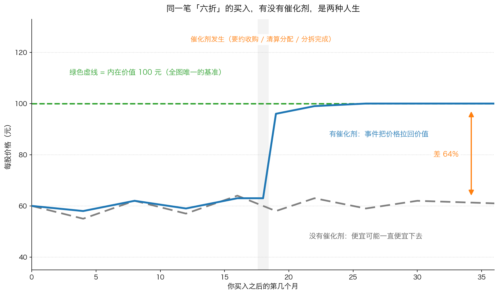
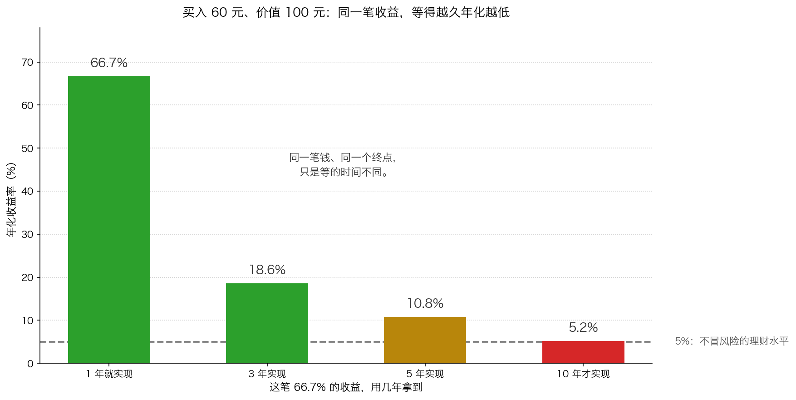

# 第 3 章：催化剂——让价值实现的点火器

> 本章你将：
> - 拿到"催化剂"的准确定义，并明白它为什么能**降低风险**，而不只是"多赚一点"
> - 分清催化剂的两种来源（公司内部的决定 vs 外部的控制权压力）和它们的三个力量等级
> - 看清没有催化剂的价值投资到底有多难受：便宜十年是可能的，而等待是有真实成本的
> - 算出一笔同样的折扣，3 年拿到、5 年拿到、10 年拿到，年化收益差多少
> - 回答"这对我的钱包意味着什么"：以后看到便宜货，除了问"便宜多少"，还要问"靠什么兑现、大概什么时候"

前面三章讲的都是"去哪里找"：第 0 章给了三类缝隙，第 1 章讲了逆向的姿态，第 2 章给了一条免费的线索。但它们都还没有回答那个最关键的问题——

**就算你找到了一个便宜一半的东西，你怎么知道这笔便宜最后真的会变成你口袋里的钱？**

这一章回答它。这是本周最重要的一章。

---

## 3.1 先从一套房子说起

你花 60 万元买了一套房子。你做过功课：同一个小区、同样的户型，上一套成交价就是 100 万元。所以你心里很清楚，这套房子至少值 100 万元。

然后呢？

**版本一。** 你买完之后，小区的房价没动。你挂出去两年，看房的人来了几拨，最高出到 68 万元。你账面上"赚"了 40 万元——但这 40 万元只是**你算出来的**，不是**你能拿到的**。

**版本二。** 你买完之后三个月，政府宣布地铁 12 号线在这个小区门口设站。半年后，同户型的成交价变成了 98 万元。

**修地铁这件事，就是催化剂。**

请注意它做了什么、没做什么：

- 它**没有**让你的房子变得更值钱——地铁站不是你的房子，你的房子还是那套房子；
- 它**做的是另一件事**：让市场承认这套房子本来就有的价值。

这就是催化剂的全部秘密：**它不创造价值，它兑现价值。**

---

## 3.2 卡拉曼的定义

原书 p174 是这样写的：

> "一只股票以低于潜在价值的打折价被买下之后，如果股价上涨至更能反映潜在价值的水平，或者某一事件的发生让股东实现了这只股票的价值，那么这只股票的持有人就能马上获利。这种事件让投资者的回报不再依赖于市场力量。"
>
> "此外，因能马上实现潜在价值，这类事件能够大幅度提高投资者的安全边际。我把这类事件称之为催化剂。"（p174）

这段话里有两层意思，都值得慢慢读。

**第一层：它让回报不再依赖市场力量。**

没有催化剂的时候，你能不能赚到钱，取决于**市场先生哪天心情好**（Week 3 讲过市场先生）。有催化剂的时候，取决于**一件有日程表的事**。这两者的区别，不是"赚多赚少"，而是"你赌的是什么"。

**第二层：它提高安全边际。**

这句话乍看有点绕——折扣不是在买入的时候就已经定了吗？为什么催化剂还能提高安全边际？

因为**安全边际不只是"折扣多少"，还包括"这个折扣有多大的概率兑现"**。给你两个选择：

- 甲：价值 100 元的东西，现在卖 60 元，但没有任何事件推动，只能等市场先生回心转意；
- 乙：价值 100 元的东西，现在卖 60 元，而且半年后有人要约按 95 元收购。

这两笔投资的"折扣"完全一样，都是 40%。但它们的安全边际**不一样大**，因为甲那笔的 40 元差价，可能三年都拿不到，甚至可能永远拿不到（公司变差了，价值被腐蚀）。**等待时间越长，中间出意外的机会就越多。**

（统一口径）**催化剂**：某个能让"价格向价值靠拢"的事件，比如分拆、清算、被收购、大额回购。

---

## 3.3 催化剂的两种来源

原书 p174 把催化剂分成了两类。

**来源一：公司内部——来自管理层和董事会的判断力。**

> "例如，卖出或清算决策都是由公司内部制定的。"（p174）

生活类比：你持有的那套房子的业主委员会，决定把小区里那块闲置空地卖掉，卖来的钱按户分给业主。这件事的开关，握在"内部人"手里——你可以去开业主大会争取，但最终按不按，由他们决定。

**A 股/港股 落地**：大额特别分红、出售主要资产、分拆子公司上市、回购注销、主动退市。

**来源二：公司外部——经常与表决控股权有关。**

原书接着说（p174）：

> "控制了一家公司多数股份的人可以决定董事会中的多数董事。由股票收集所取得投票控股权，或者仅仅因为管理层害怕会发生这样的事情都会让企业采取行动，使股价更加全面地体现潜在价值。"

生活类比：一个外人开始挨家挨户地收购你们小区的房子。等他收够了，他就能在业主大会上换掉现任业委会——于是现任业委会突然变得非常勤快：该修的修了，该分的分了。

**A 股/港股 落地**：举牌（持股达到 5% 必须公告，继续增持会威胁控制权）、敌意收购的威胁、控股股东变更、要约收购、私有化。

> 📌 **划重点：** 第二类催化剂里最值得琢磨的是"**害怕**"这两个字。原书说得很明白：管理层不需要真的被收购，**只要他害怕被收购，就足以让他去做那些对股东有利的事**。所以举牌公告、大股东增持、董事会改选这一类新闻，价值不只是新闻本身——它可能正在悄悄改变管理层的算盘。这一点和第 2 章讲的"管理层的钱包挂在哪里"是同一件事的两面。

---

## 3.4 催化剂的力量有等级

不是所有催化剂都能把价值全部兑现。原书 p174–p175 给了一个大致的排序：

| 力量 | 催化剂 | 能实现多少价值 |
|---|---|---|
| **最强** | 一家企业的有序出售或者清算 | 能够**完全**实现价值 |
| **中等** | 企业分拆、股票回购、调整资本结构、大型资产出售 | 通常只能实现**部分**净值 |
| **特殊** | 企业摆脱破产状态 | 对**债权人**是一剂强催化剂 |

关于破产那一条，原书 p175 讲得比较细：

> "为了满足高级债券持有人的权利，这些人往往能从重组后的企业中获得现金、债券工具以及（或者）股票。"（p175）

原书接着解释：这些分配给债权人的证券的市值总额，可能高于原来那笔破产债务的市值。原因是——重组后的企业证券往往有更好的流动性，而且"摆脱了多数恶名和破产的不确定性"，所以市场愿意给更高的估值；另外，债权人委员会可能已经参与了对重组企业资本结构的决定，"希望能创造出一种有着最大市场价值的结构"（p175）。

**这一段是 Week 11 的主题，这里你只需要记住一句话：破产不是终点，而是一个过程；"摆脱破产"这件事本身就是催化剂。**

---

## 3.5 为什么催化剂能把"便宜"变成"真的赚到"

这一节是本章的核心。我们分三步走。

### 第一步：没有催化剂的时候，你的回报取决于谁？

原书 p175：

> "然而，在不存在催化剂的情况下，潜在价值可能会遭腐蚀，而价格与潜在价值之间的缺口会因市场反复无常的行为而扩大。"

这句话里藏着**两个不同的坏消息**，一定要分开看：

**坏消息一：价值可能被腐蚀。**

公司在你等的这几年里可能变差——行业下行、管理层乱投资、技术被替代、大客户流失。你算的 100 元，三年后可能只剩 70 元。**这时候折扣率看起来没变（价格还是 60 元），但折扣的"基数"变小了。**

举个例子（简化示意数字）：股价 60 元、价值 100 元，折价 40%。三年后价值掉到 70 元、股价还是 60 元，折价率从 40% 变成了 14%。**你在"便宜"的位置上，慢慢变成了一笔平庸的投资，而价格一动都没动。**

**坏消息二：缺口可能扩大。**

价格可能更低。市场先生完全可以让一只股票在 0.6 倍价值的位置待很久，然后再跌到 0.4 倍。Week 3 讲过：短期内，供求关系独自决定市场价格。

### 第二步：有催化剂的时候，你的回报取决于什么？

取决于一件**有人负责、有日程表、有合同约束**的事。原书 p175 讲得非常直接：

> "价值投资者总是留意着催化剂。尽管以低于潜在价值的打折价购买资产是价值投资的定义特征，但通过催化剂来部分或者全部地实现价值是投资者获得回报的重要手段。此外，催化剂的存在能够降低风险。如果价格与潜在价值之间的差距很快会消除，那么因为市场波动或者因企业走下坡路而蒙受损失的概率就会下降。"（p175）

请注意最后半句的逻辑：**催化剂降低风险的方式，不是"让你赚更多"，而是"让两个坏消息来不及发生"。**

- 缺口很快消除 → 市场波动来不及伤害你；
- 价值很快兑现 → 企业走下坡路来不及腐蚀价值。

### 第三步：即使只能实现一部分价值，也有两个重要作用

原书 p175–p176 说，能部分实现价值的催化剂有两个重要的目标：

**作用一：它确实把价值送到了股东手里。** 有时候是通过调整资本结构或者分拆，把价值直接输送到股东手中；其他时候是通过回购这样的手段，来缩小价格与价值之间的缺口。

**作用二：它建立了记录。** 原书 p176："那些为股东利益而采取行动以部分实现潜在价值可能会在未来寻求进一步实现价值的策略。"

原书举的例子是 Teledyne 公司——"多年来，Teledyne 公司的投资者不断从公司适时的回购和分拆行动中受益"（p176）。

**这一条对判断管理层特别有用。** 一家公司如果曾经分拆过一块业务、曾经大额回购过，那么它下一次再做类似动作的概率，比一家从来没做过的公司高得多。**"愿意为股东做事的记录"，本身就是一种可以估值的资产。**

这张图（简化示意数字）把两条路径摆在同一根纵轴上，基准只有一个：**内在价值 100 元（绿色虚线，全程不变）**。

- **蓝色实线（有催化剂）**：你在 60 元买入，价格一直不温不火，直到第 18 个月催化剂发生——一笔要约收购、一次清算分配、或者一次分拆完成——价格一步跳到 96 元附近，随后慢慢靠拢 100 元。
- **灰色虚线（没有催化剂）**：同样的起点 60 元，同样便宜，但价格在 55 到 64 元之间来回晃，第 36 个月还在 61 元附近。

图的最右边有一支双向箭头，标注"差 64%"。这个数字是这么来的：**两条路走到第 36 个月，一条是 100 元，一条是 61 元。** 同一笔买入、同一个折扣、同一家公司，36 个月后差了 64%。

> 💡 **换个说法：** 把一笔投资想成一场考试。没有催化剂，你答完了卷子，但**没有人来收卷**——你的分数要等市场先生哪天心情好才公布。有催化剂，就等于**有人告诉你交卷时间**。题目（价值）没变，你的答案（买入价）没变，但"能不能拿到分"这件事变了。

---

## 3.6 没有催化剂的价值投资有多难受

这一节必须讲透，因为它是很多人做价值投资亏钱的真实原因。我把它拆成三件事。

### 第一件：便宜可以便宜很久

原书 p168 那句话你已经在第 1 章见过——"市场趋势能够让价格脱离价值持续很长一段时间"。第 1 章讲的是它对**心理**的折磨；这里讲的是它对**收益率**的伤害。

三年是"一段时间"，十年也是"一段时间"。**没有人能事先告诉你答案**，而且更麻烦的是：**你等得越久，越容易说服自己"再等等"。** 十年之后，你可能已经忘了当初为什么买它。

### 第二件：等待是有真实成本的，而且它是复利的

很多人都听过"时间就是金钱"，但很少有人真算过这笔账。假设你买入 60 元、价值 100 元：

| 兑现时间 | 总收益 | 年化收益 |
|---|---|---|
| 1 年就实现 | 66.7% | 66.7% |
| 3 年实现 | 66.7% | 约 18.6% |
| 5 年实现 | 66.7% | 约 10.8% |
| 10 年才实现 | 66.7% | 约 5.2% |

**总收益一模一样，年化收益率却相差十几倍。** 而且请注意最后一行：如果不冒风险的理财能给你 5%，那么"等十年"这件事几乎等于白干——**你承担了股票的全部风险，拿到了理财的回报。**

这一章算一算会带你把这些数字一个个手算出来。

这张图的四根柱子是同一笔钱的四种命运：总收益都是 66.7%，但摊到每一年，1 年拿到是 66.7%，10 年拿到只剩 5.2%——而那条灰色虚线（5%）是"不冒风险的理财水平"。最后一根红柱几乎贴着它，这不是巧合，这就是"等太久"的代价。

### 第三件：等待还会让你错过别的机会

这十年里，你可能错过了另外三个"一年就兑现"的机会。这就是 Week 8 讲过的**机会成本**——因为把钱占在别处，而错过未来更好的机会所损失的东西。

所以，在一个没有催化剂的便宜货上放太多钱，**本身就是一种风险**。这也解释了为什么原书反复强调"拥有那些有着可以实现价值的催化剂的证券是投资者一种降低投资组合风险的重要方法"（p175）。

### 但是——这一节不是让你去追催化剂

最后必须把这句话说清楚，否则前面全白讲了。

> ⚠️ **易踩坑：** "有催化剂"**绝不能**成为你放松价格要求的理由。**催化剂不能把一笔买贵了的投资变成好投资。** 你在价值 100 元时用 95 元买入一家马上要被收购的公司，照样是一笔平庸的投资——你只是把 5% 的空间赌在了一件事上。正确的顺序永远是：
>
> **先要求足够的折扣，再看有没有催化剂。**
>
> 反过来的顺序（先看到催化剂，再勉强接受一个不便宜的价钱）是散户最常见的亏钱方式之一。催化剂是**加分项**，不是**替代品**。

---

## 3.7 落到 A 股/港股：催化剂长什么样

把"催化剂"这个词翻译成你每天能在公告里看到的东西：

| 催化剂的类型 | A 股/港股 里的具体形式 | 去哪里查 |
|---|---|---|
| 清算与出售资产 | 大额资产出售、特别分红、主动退市 | 巨潮资讯网的"重大资产出售""利润分配"公告 |
| 分拆 | A 拆 A、H 拆 A、介绍上市 | "分拆上市预案""分拆上市公告" |
| 回购 | 回购注销、大股东增持 | "回购股份报告书""回购进展公告" |
| 收购与控制权 | 全面要约收购、吸收合并、私有化、控股股东变更 | "要约收购报告书""换股吸收合并预案""联合公告" |
| 摆脱困境 | 破产重整计划获批、债务重组完成 | "重整计划""出资人权益调整方案" |

> 🇨🇳 **落到 A 股/港股：** A 股的催化剂有两个本地特色，你必须知道。
>
> ① **它经常是"公告驱动"的。** 一件事从董事会预案、股东大会通过、监管问询、到最终实施，要发好几轮公告。每一轮公告都是一次信息更新，也都是一次价格波动。你要读的是**事件进展**，不是股吧的解读。
>
> ② **它可以被终止。** A 股的重组、要约收购、分拆，都可能因为各种原因终止。**公告里通常有一节叫"风险提示"或"本次交易可能被终止的风险"——那一节是全文最值得读的部分，也是大多数人直接跳过的那一节。** 读完它，你才知道自己赌的到底是什么。

---

## ✍️ 想一想

1. 原书说催化剂"让投资者的回报不再依赖于市场力量"（p174）。请用"谁来收卷子"这个比喻，向一个完全不懂投资的人解释这句话。
2. 你找到两家公司，都是股价 60 元、你都算出价值 100 元。甲公司的管理层刚刚宣布要分拆一块业务上市；乙公司什么也没宣布，股价已经这样趴了四年。请问：这两笔投资的"安全边际"一样大吗？为什么？
3. "公司宣布回购"经常被当成利好。请用本章和第 2 章的内容，说出至少两种"回购其实对你不利"的情况。

> 💡 **参考思路：**
> 1. 可以这样说："投资就像交卷子。你答得对不对，取决于你算的价值对不对；但你能不能拿到分，取决于有没有人来收卷子。没有催化剂，就没人来收——你的分数要等一个情绪极不稳定的市场先生哪天心情好才公布，可能等三个月，也可能等十年。有了催化剂，就等于有人给了你交卷时间：到点就收，卷子立刻就判。" **关键要讲出"我算得对"和"我拿得到"是两件事。**
> 2. **不一样大。** 折扣一样（都是 40%），但安全边际不一样。理由是本章讲的"两个坏消息"：甲那笔的时间表有边界（分拆有明确日期），所以"价值被腐蚀"和"缺口扩大"这两件事来不及发生；乙那笔没有时间表，你只能赌市场先生哪天回心转意，而这四年已经证明了它可能很久都不回心转意。原书 p175 的原话是催化剂"能够降低风险"，降低的正是这两种风险。**要注意的是：这不代表甲一定比乙赚得多——甲也可能分拆失败。它只是说，甲这笔投资里"靠运气"的成分更少。**
> 3. 参考答案：① 公司**借钱**回购，只是为了把股价托住让管理层期权行权——这是把股东的钱转移给管理层（第 2 章 2.3 节的算法算过这笔账）；② 公司在**股价远高于价值**的时候回购——比如你算出每股值 30 元，股价 80 元，公司还在买，这是用 80 元买 30 元的东西，直接毁灭价值。还有第三种：③ 公司一边宣布回购，一边**没有真金白银执行**（回购计划公布了但迟迟不买），这种"口头回购"只是为了稳定股价。**判断标准是第 2 章给出的那两条：钱从哪儿来，价格相对于价值是高还是低。**

---

## 🧮 算一算

**情境（简化示意数字，用于教学）。** 你在 60 元买入一只你估算内在价值为 100 元的股票。这一次，我们把"等待"的代价一步一步算清楚。

**问题 1：** 如果 1 年后价格回到 100 元，你的总收益率是多少？

**问题 2：** 如果这件事拖到 3 年、5 年、10 年才发生，你的**总收益率**变了吗？

**问题 3：** 请用"试乘"的办法，算出 3 年实现的**年化**收益率。

**问题 4：** 用同样的办法，算出 5 年和 10 年实现的年化收益率。

**问题 5：** 如果这 60 元放进一个年化 5% 的理财产品，10 年后会变成多少？和"等十年拿到 100 元"相比，多了还是少了？多了多少？

**问题 6：** 如果到了第 5 年，你被告知"催化剂取消了，价格大概会一直停在 50 元"，你这 5 年的年化收益率是多少？这说明什么？

### 分步解答

**问题 1：**

第一步，赚到的钱：

$$100 - 60 = 40 元$$

第二步，总收益率（分母是你付出的 60 元）：

$$40 \div 60 = 0.6667 = 66.7\%$$

第三步，只有 1 年，所以总收益率就是年化收益率：

**年化 66.7%。**

**问题 2：**

**总收益率完全不变，还是 66.7%。** 因为起点（60 元）和终点（100 元）都没变。变的只有一件事：**你用了几年才走到那里。**

**问题 3：**

要找年化收益率，就是要找一个数，"1 加上它"连乘 3 次等于 1.667。

- 试 1.18：1.18 乘 1.18 = 1.3924；1.3924 再乘 1.18 = **1.6430**。比 1.667 低一点。
- 试 1.19：1.19 乘 1.19 = 1.4161；1.4161 再乘 1.19 = **1.6852**。比 1.667 高一点。

所以答案在 18% 和 19% 之间。取 18.6% 验证：

$$1.186 \times 1.186 = 1.4066$$

$$1.4066 \times 1.186 = 1.6682 \approx 1.667$$

**结论：3 年实现的年化收益率约 18.6%。**

**问题 4：**

**先算 5 年。** 要找的数连乘 5 次等于 1.667。这里可以用"先平方、再平方、最后补一次"的办法（因为 5 = 2 + 2 + 1）：

- 试 1.10：1.10 乘 1.10 = 1.21；1.21 乘 1.21 = 1.4641；再乘 1.10 = **1.6105**。偏低。
- 试 1.11：1.11 乘 1.11 = 1.2321；1.2321 乘 1.2321 = 1.5181；再乘 1.11 = **1.6851**。偏高。

所以答案在 10% 和 11% 之间。取 10.8% 验证：

$$1.108 \times 1.108 = 1.2277$$

$$1.2277 \times 1.2277 = 1.5072$$

$$1.5072 \times 1.108 = 1.6700 \approx 1.667$$

**5 年实现的年化收益率约 10.8%。**

**再算 10 年。** 10 年可以先用"先平方、再平方"算出 4 次方，再乘以一次得到 5 次方，最后把 5 次方自乘一次得到 10 次方。

- 试 5% 的年化：1.05 乘 1.05 = 1.1025；1.1025 乘 1.1025 = 1.2155（这是 4 次方）；再乘 1.05 = **1.2763**（这是 5 次方）。10 次方就是 1.2763 乘 1.2763 = **1.6289**。比 1.667 低，所以年化应该比 5% 高一点。
- 试 5.2% 的年化：1.052 乘 1.052 = 1.1067；1.1067 乘 1.1067 = 1.2248（4 次方）；再乘 1.052 = **1.2885**（5 次方）；1.2885 乘 1.2885 = **1.6602**。接近 1.667 了。

**10 年实现的年化收益率约 5.2%。**

**问题 5：**

第一步，算 1.05 的 10 次方（用问题 4 里的中间结果）：

$$1.05^5 \approx 1.2763$$

$$1.2763 \times 1.2763 = 1.6289$$

第二步，60 元十年后变成：

$$60 \times 1.6289 = 97.73 元$$

**结论：把 60 元放进年化 5% 的理财，10 年后是约 97.7 元。**

而"等十年、股票涨回 100 元"的结果是 **100 元**。

$$100 - 97.73 = 2.27 元$$

**换句话说：你承担了股票的全部风险、熬了十年，最后只比一个不冒风险的理财多赚 2.27 元。**

> 📌 这一问请务必自己算一遍。它比任何一句话都能说明"等待是有价格的"。

**问题 6：**

第一步，价格停在 50 元，总共是亏的：

$$50 \div 60 = 0.8333$$

也就是 5 年总共亏了 **16.7%**。

第二步，找年化收益率，就是找一个数连乘 5 次等于 0.8333：

- 试 0.96：0.96 乘 0.96 = 0.9216；0.9216 乘 0.9216 = 0.8493；再乘 0.96 = **0.8153**。偏低。
- 试 0.965：0.965 乘 0.965 = 0.9312；0.9312 乘 0.9312 = 0.8671；再乘 0.965 = **0.8368**。接近了。

所以年化约 **-3.6%**。

**这说明：等待本身不是中性的。** 如果价值不兑现、而且价值还在被腐蚀，你等来的不是回本，而是亏损。这也正是原书说催化剂"能够降低风险"的真正含义——**它降低的不是波动，是"等到最后什么都没有"的概率。**

**把六问的答案汇总成一张表：**

| 情形 | 5 年或 10 年后的钱 | 总收益 | 年化收益 |
|---|---|---|---|
| 1 年就实现 | 100 元 | 66.7% | 66.7% |
| 3 年实现 | 100 元 | 66.7% | 约 18.6% |
| 5 年实现 | 100 元 | 66.7% | 约 10.8% |
| 10 年才实现 | 100 元 | 66.7% | 约 5.2% |
| 同样 60 元放 5% 理财 10 年 | 97.7 元 | 62.9% | 5% |
| 第 5 年还停在 50 元 | 50 元 | -16.7% | 约 -3.6% |

**这张表就是本章的全部内容：总收益是同一笔，年化收益却可以从 66.7% 掉到 -3.6%。中间那把刀，就是"要等多久"。**

---

## ✅ 小测验

**1. 关于催化剂，下面哪种说法最符合原书？**
A. 催化剂就是让公司基本面变好的事情
B. 催化剂是让投资者的回报不再依赖于市场力量、并能提高安全边际的事件
C. 只要有催化剂，买贵一点也没关系
D. 催化剂一定是由公司内部决定的

**2. 你买入一只股票，折扣有 40%，但找不到任何催化剂。按原书的说法，最大的风险是什么？**
A. 公司会立刻退市
B. 潜在价值可能被腐蚀，价格与潜在价值之间的缺口可能因市场反复无常的行为而扩大
C. 你一定会亏钱
D. 你会被强制卖出

**3. 原书说一家企业摆脱破产状态对债权人是一剂催化剂，主要理由是什么？**
A. 因为破产企业的股票一定会涨
B. 因为债权人拿到的现金、债券、股票的市值总额可能高于原来那笔破产债务的市值，而且重组后的证券流动性更好、不确定性更少
C. 因为法院会强制公司分红
D. 因为破产企业的债务会被全部免除

> **答案与解析**
>
> **1. B。** 原书 p174 的原话是："这种事件让投资者的回报不再依赖于市场力量"；p174 又说"因能马上实现潜在价值，这类事件能够大幅度提高投资者的安全边际"。A 错——催化剂**不改变公司的价值**，它让价格向价值靠拢（3.1 节的房子就是最好的例子：修地铁不会让你的房子变大）。C 错——正确的顺序永远是"先要求足够的折扣，再看有没有催化剂"，催化剂是加分项不是替代品。D 错——原书 p174 明确把催化剂分成两类，第二类来自外部，"经常与一家公司股票的表决控股权有关"。
> **2. B。** 这是原书 p175 的原话。A 错——没有催化剂不等于公司要退市，它可能只是一直不涨。C 错——"一定亏钱"太绝对了，你可能等到回归，只是不知道要等多久。D 错——没有催化剂不构成强制卖出，但要注意：如果你在这段漫长等待里因为别的原因（急用钱、被套太久受不了）而卖出，那就是你自己把自己变成了"被迫卖出的人"——这一点 Week 12 讲流动性的时候会专门说。
> **3. B。** 原书 p175 的原话是：这些分配的证券的市值总额"可能高于破产债务的市值"；重组企业的证券"往往有着更好的流动性，并摆脱了多数恶名和破产的不确定性，因此这些证券的价格使用了更高的估值"。A 错——原书没有任何"一定涨"的说法；C、D 都是无中生有：破产程序不会强制分红，债务也不会被全部免除，它只是被**重新安排**。

---

## 📖 回到原书

- 对应原书 **第十章** 的开头三节："机会所在：催化剂、市场无效和机构限制""投资企业清算"的前半部分，`raw/安全边际-中文版/page_174.md` ~ `page_176.md`（原书 p174–p176）；以及"投资市场之周期：风险套利周期"一节中关于周期性影响回报的段落，`page_188.md` ~ `page_190.md`（原书 p188–p190）。
- 建议精读：**p174–p175**（催化剂的定义、两种来源、力量等级，以及"催化剂为什么能降低风险"这一段，值得读三遍）。
- 可以略读：**p175** 后半段关于破产重整对债权人的意义（那是 Week 11 的主题，这里知道"摆脱破产本身就是催化剂"就够了）；**p176** 关于 Teledyne 公司的那一句（记住"愿意为股东做事的记录本身就是资产"这个意思即可）。
- 原书金句（逐字引用）：
  > "这种事件让投资者的回报不再依赖于市场力量。"（p174）
  >
  > "此外，因能马上实现潜在价值，这类事件能够大幅度提高投资者的安全边际。我把这类事件称之为催化剂。"（p174）
  >
  > "控制了一家公司多数股份的人可以决定董事会中的多数董事。"（p174）
  >
  > "价值投资者总是留意着催化剂。"（p175）
  >
  > "然而，在不存在催化剂的情况下，潜在价值可能会遭腐蚀，而价格与潜在价值之间的缺口会因市场反复无常的行为而扩大。"（p175）
  >
  > "如果价格与潜在价值之间的差距很快会消除，那么因为市场波动或者因企业走下坡路而蒙受损失的概率就会下降。"（p175）
  >
  > "为了满足高级债券持有人的权利，这些人往往能从重组后的企业中获得现金、债券工具以及（或者）股票。"（p175）

下一章是本周的最后一章，也是信息量最大的一章：**带着"催化剂"这把尺子，去把六种机会一种一种看过去。**
