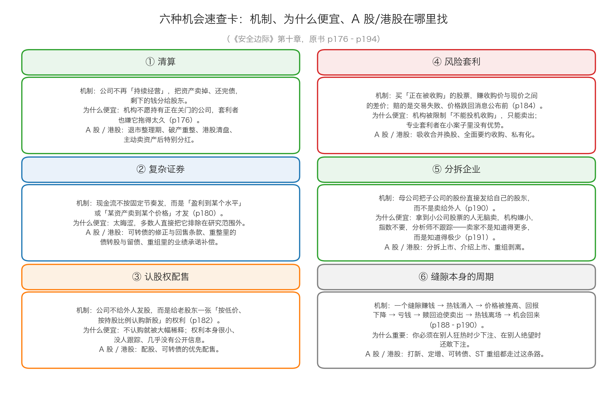
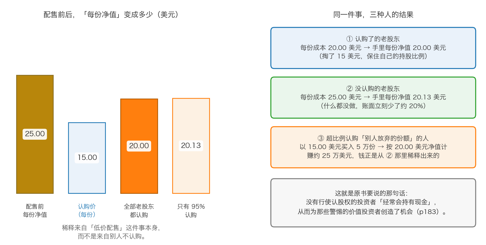

# 第 4 章：六种机会——清算、复杂证券、配股权、风险套利、分拆与缝隙的周期

> 本章你将：
> - 拿到一张"六种机会"的速查地图，每一类都配上机制、为什么便宜，以及 A 股/港股 的对应物
> - 看懂清算投资：为什么有人把"快关门的公司"当成宝贝，以及它真正的风险在哪里
> - 第一次弄懂"复杂证券"和"认股权配售"这两件中国读者完全陌生的东西（配股就是它的中国版）
> - 学会风险套利的价差结构：赚的是"收购价减现价"，赔的是"交易失败"
> - 明白分拆为什么会稳定地创造错误定价，以及这个规律在 A 股/港股 里的两种不同形态
> - 回答"这对我的钱包意味着什么"：六种机会你未必每种都做，但每一种都值得你建一个观察清单

第 3 章讲的是催化剂——它回答"便宜怎么变成赚到"。这一章回答一个更具体的问题：**这些带催化剂的便宜货，具体长什么样？该去哪一类公告里找？**

---

## 4.1 先说清楚"六"是怎么来的

原书第十章从 p176 一直到 p194，一节一节地过了六种机会。前五种是具体的"缝隙"：

| 顺序 | 机会 | 原书页码 |
|---|---|---|
| 第一种 | 投资企业清算 | p176–p180 |
| 第二种 | 投资复杂证券 | p180–p182 |
| 第三种 | 投资认股权配售 | p182–p184 |
| 第四种 | 投资风险套利 | p184–p188 |
| 第五种 | 投资分拆企业 | p190–p194 |

第六种**不是一个地方，而是一条规律**——**缝隙本身的周期**（p188–p190）：任何一类机会都会先变香、再变臭、然后再变香。卡拉曼把它单独列了一节，本章也照这个结构讲，所以这一章叫"六种机会"。

这张速查卡可以先扫一眼，再往下读。读完之后建议你回头再看一次——那时候你会发现每一格都能看懂了。

最后，请记住原书自己划的边界（p194）：

> "本章并没有罗列出所有的这些领域，也不打算这么做。"
>
> "事实上本章内容旨在展示各个市场中的证券如何会出现价格无效，从而为那些愿意寻找潜在便宜货的人创造机会。"（p194）

> 📌 **划重点：** 这六种机会的价值不在于"照着买"，而在于**它们教你一种看公告的方式**：每一份公告背后，都可能有一群"必须卖"的人。找到他们，你就在别人还在看 K 线的时候，站到了价格形成的上游。

---

## 4.2 第一种：清算——把公司拆开卖

### 机制

一家公司不再"持续经营"，而是把资产一件件卖掉、还清债务，把剩下的钱按持股比例分给股东。

清算有两种。一种是**没得选**的，原书 p176 说："一些陷入困境的企业在没有选择的情况下会主动进行清算，以防止股东的投资全部亏掉。"另一种是**主动**的——原书说，更多的企业会出于对税收、股价持续低估或者希望逃脱掠夺者的恶意并购等因素而进行清算（p176）。

**生活类比：** 一家三口开的小饭馆不做了。老板不会把"饭馆"整个卖掉——他会把桌椅、厨具、冰柜、还有那份还没到期的租约分别处理掉，最后把剩下的钱分掉。**分开卖往往比整体卖更值钱**，这就是第 0 章讲过的"拆卖价值"。

### 为什么会出现错误定价

原书 p176–p177 列了四个原因：

1. **多数投资者不喜欢这种股票。** "多数投资者更喜欢（或者实际上被要求）持有持续经营企业的股票。进行清算的企业并不是他们所希望的投资类型。"（p176）
2. **连专业套利者都躲着它。** "甚至一些风险套利者（这些人以什么都买而闻名）也避免对企业清算进行投资，并相信清算过程存在太大的不确定性或者耗时太久。"（p176）
3. **它有一个很难听的外号。** 投资清算"有时会被轻蔑地称之为'雪茄烟蒂投资'，指投资者捡起别人丢掉的只能吸几口的烟头并吸了起来"（p176）——意思是"只能赚一点点，还很难看"。
4. **清算中的公司往往没有分析师跟踪、没有及时报价。**

而原书的结论正好反过来（p176）：

> "因为其他投资者的藐视和回避，企业清算可能会给价值投资者带来尤其具有吸引力的机会。"（p176）

### 原书案例：城市投资清算信托

这个案例在原书里占了四页（p176–p180），因为它把"清算投资"的每一个环节都演了一遍。

1984 年，城市投资公司投票决定清算。这家联合大企业有各种各样的资产，最值钱的子公司是家庭保险公司。出售这家公司的努力最终失败了，取而代之的是把它分拆出去（p177）。剩下的资产组成了**城市投资清算信托**。

原书表 3（p178）列出了这个信托当时的资产：现金、股票、债券、巴西的应收款项、各种票据和抵押贷款，以及一笔联邦所得税退税额预期；总资产 199.5（百万美元），减去已知负债 4.0，净资产 **195.5**，"或者每单位5.02"（p178，单位为美元；而且这个数字**不含各种或有负债**）。

**那么市场给它什么价格呢？** 原书 p177：

> "股票最高价仅为3 美元左右，这大幅低于它的潜在价值。"（p177）

**为什么这么低？** 原书列了一串原因（p177–p178）：参与清算的投资者对之前资产出售的价格感到失望，于是马上抛售；很多投资者本来只是为了"分拆出来的家庭保险公司"才买城市投资公司的股票，拿到之后就卖掉了清算信托；清算信托每一单位的市场价格**低于许多机构投资者的准入门槛**；它还退出了纽约证券交易所，只能在粉纸市场柜台交易，"股票上面没有代码"，报纸上找不到报价。**请注意这些理由里，没有一条和"信托手里那些资产值多少钱"有关。**

**结局是什么？** 原书 p180：

> "1991 年，一开始就购买了城市投资清算信托的投资者已经收到了几项清算分配，总价值约为每份9 美元，是1985 年9 月市场价格的3 倍"（p180）

而且原书强调，这些价值"在清算过程的前几年中就已经获得了多数"。

### 落到 A 股/港股

| 原书里的"清算" | A 股/港股 里最接近的东西 | 区别在哪里 |
|---|---|---|
| 公司投票决定清算，把资产卖掉、剩下的分给股东 | **主动出售资产 + 特别分红** | 这是最接近的一种：卖掉一块大资产，把大部分钱以特别分红分掉 |
| 破产重整 | **破产重整** | 重整的目标是让公司**活下去**，不是让它死掉 |
| 退市 | **退市整理期** | 股票还能交易，但摘牌后基本失去流动性 |
| 清盘 | **港股清盘 / 私有化** | 港股有真正的清盘程序，也有大股东发起的私有化 |

> ⚠️ **易踩坑：** 请务必注意三件事，否则这一节可能让你亏掉本金。
> ① **"清算价值"是算出来的，不是账上写着的。** 原书那个案例里，5.02 美元是卡拉曼自己估的。Week 9 讲过：账面价值不等于清算价值，要打折。
> ② **清算是一件要花好几年的事，而且债权人排在股东前面。** 表 3 里那句"不包括各种或有负债"（p178）就是提醒：随时可能冒出一笔你没想到的债。律师费、税费、员工安置费，都会先被扣掉。
> ③ **A 股的个人投资者最容易犯的错，是把"公司要重整了"当成"我要发财了"。** 重整和清算是两件完全不同的事：**清算是分钱散伙，重整是削债续命。** 在重整里，老股东的权益经常会被大幅稀释甚至清零。

---

## 4.3 第二种：复杂证券——满足条件才付钱

### 机制

原书 p180 的定义：

> "我把复杂的证券定义为那些有着不同寻常的契约式现金流特征的证券。"（p180）

接着解释："同那些给投资者持续提供现金流的债券不同，复杂证券往往根据一些偶发事件的发生而分配现金，如盈利、某一特定商品的价格或者特定资产的价值"达到某个特定的水平（p180）。原书还说，这类证券通常随着企业进行并购或者重组而出现；而且"尽管有些复杂债券是股票或者债券，但多数都不是这两类证券"（p180）。

**生活类比：** 你和朋友合伙开餐馆，你不占股份，你们签了这么一份协议——**"如果这家店今年净利润超过 20 万元，超过的部分里你分 10%；如果没超过，你一分钱也没有。"** 这份协议不是股票，也不是普通借条，它是一张"**条件触发才付钱**"的凭证。这就是复杂证券。

### 为什么会出现错误定价

一句话：**看不懂的东西没人买。**

一份现金流取决于"未来盈利是否达到某个水平"的凭证，需要你把整份合同读完、把触发条件算清楚，还要对"会不会触发"有判断——这活儿很累，而且通常买不了多少量。于是原书说，"与生俱来的复杂性让它们被多数投资者排除在投资范围以外"（p180）。

而它的机会正在这里（p180）：

> "因为复杂证券的晦涩难懂及其独特性，它们可能会在风险处在一个特定水平的情况下给价值投资者提供非常诱人的回报。"（p180）

### 原书举的三个例子（看结构就行）

**例一：铁路公司的收益债券。** 20 世纪 30 年代，铁路公司破产经常会产生一些"收益债券"——只有在发行人取得了一定水平的盈利之后，才会支付利息（p180）。这等于把"付不付利息"这件事和公司的盈利挂上了钩。

**例二：参与凭证。** 1958 年，密苏里-堪萨斯-德克萨斯铁路公司重组时发行了"参与凭证"，它"唯一与金钱有关的好处就是有权组成一支偿债基金来赎回这些凭证"，而

> "只有当累积盈利达到了契约上规定的水平之后，才需要对赎回进行支付。"（p181）

这些凭证因为"投资者忽视了这种凭证"（p181），在缺乏流动性的粉纸市场以非常低的价格交易；1985 年这家铁路并入密苏里太平洋铁路公司时，它们成为股权收购的目标，"价格也较当年早些时候翻了好几倍"（p181）。

**例三：或有价值权证。** 1989 年，陶氏化学旗下的默力陶氏医药公司与马里昂实验室合并时，发给了马里昂实验室股东一份"或有价值权证"（p181–p182）：持有人有权在约定日期，获得一段时期马里昂实验室股票均价和 45.77 美元之间的差价，但每个权证最多不超过 15.77 美元（p182）。原书对它的评价是——

> "事实上这些都是对马里昂实验室股票的卖出期权，这限制了它们的价值。"（p182）

（**卖出期权**：一份"在约定时间按约定价格卖出某样东西"的权利。生活类比：你和房主约定，一年后不管房价跌到多少，你都可以按 100 万元把房子卖给他。它帮你挡住了下跌，但也因此限制了它的价值：房价涨到 200 万元，你也只能按 100 万元卖。）

**但原书同时提醒（p182）：**

> "并不是所有的复杂证券都有投资价值。"

### 落到 A 股/港股

复杂证券在 A 股/港股 里其实不少，只是平时没人这么叫它们：

- **可转债的复杂条款。** 一张可转债同时包含四样东西："债券"（每年付息、到期还本）、"转股权"（按转股价换成股票）、"回售权"（股价长期低于某个水平，你可以把债券卖回给公司）、"强赎权"（股价长期高于某个水平，公司可以强制赎回）。这就是典型的"条件触发才付钱"。**A 股的可转债往往还带"转股价向下修正"条款——这是别的市场很少见的设计。**
- **破产重整方案里的"债转股 + 留债 + 信托受益权"。** 债权人拿到的不是现金，而是一堆条件各不相同的新凭证：一部分转成股票、一部分延期偿还、一部分装进一个信托里慢慢处置。这就是原书说的"企业重组"产生的复杂证券。
- **重组里的业绩承诺与补偿（俗称对赌）。** 如果被收购的资产三年内没达到承诺的利润，原来的股东要补偿股份或现金。这份补偿承诺本身，也是一种"条件触发"的权利。
- **港股的可换股票据。** 条款经常是量身定做的，流动性很差，绝大多数人不会去看。

> 💡 **换个说法：** 复杂证券的机会不来自"你比别人聪明"，而来自"**你比别人愿意读合同**"。它是一类**体力和耐心**的生意，不是智商的生意。

---

## 4.4 第三种：认股权配售——中国读者完全没见过的制度

这一节要花点力气，因为这个制度在中国的市场上**没有直接对应的、可以单独买卖的版本**，很多读者第一次看到会一头雾水。

### 先说它是什么

一家公司想要更多的钱（融资），通常有三种做法：

1. **向所有人公开发行新股**（增发）——所有人的持股比例都会被摊薄；
2. **向银行或债券投资者借钱**（发债）——增加负债；
3. **认股权配售**：不卖给外人，而是给**现有的每一位股东**一张"凭证"。凭这张凭证，你可以按一个**低于市价的价格**、按你**现在持股的比例**，认购相应数量的新股。

**生活类比：** 你住在一个 100 户的小区。物业说要装电梯，每户需要出 2 万元。它不会去街上找 100 个陌生人来凑钱——它给每一户发一张"缴费通知单"，你有权按户出 2 万元。**你出了，你在小区里的权益份额不变；你没出，你的份额就被别人出的钱摊薄了。**

> 📌 **划重点：** 认股权配售的本质是——**公司逼着你做一个选择：要么再掏一笔钱，要么接受被稀释。** 原书 p183 的原话是：

> "认股权配售能有效迫使现有股东拿出更多的钱，以避免自己的投资被大幅稀释。"（p183）

### 原书那个把机制讲透的例子

原书用一只叫 XYZ 的**封闭式基金**做了完整的推演（p183–p184）。先解释这个词：**封闭式基金**是份额固定、在交易所像股票一样买卖的基金；它的交易价格可以高于、也可以低于它持有的资产净值（净值就是"这只基金持有的那一篮子资产，平均到每一份上值多少钱"）。

**初始状态：** 基金份额 100 万份，交易价格与每份 25 美元的净值一致，也就是总资产 2500 万美元。

**配售方案：** 基金要再筹集 1500 万美元，于是给每个持有人发行一份"**每份能以 15 美元的价格购买另外一份基金**"的认购权。

**情形一：所有人都认购。** 份额扩大到 200 万份，管理的资产达到 4000 万美元（原来的 2500 万，加上新收的 100 万 乘 15 = 1500 万），每份净值 = 4000 万 除以 200 万 = **20 美元**。

**情形二：有 5 万份的持有人没有行使认购权。** 那么只有 95 万份参与认购：

- 新收的钱 = 95 万 乘 15 = 1425 万美元；
- 总资产 = 2500 万 + 1425 万 = 3925 万美元；
- 总份额 = 100 万 + 95 万 = 195 万份；
- 每份净值 = 3925 万 除以 195 万 = **20.13 美元**。

原书的结论是（p183）：

> "那些认购了基金的投资者每份基金的平均成本为20 美元，而那些没有认购基金的投资者的成本为25 美元。因此没有认购基金的人会马上蒙受相当于净值20%的损失，所有的持有人都有强烈的动机来认购增发的基金。"（p183）

**情形三：超比例认购。** 有些认股权配售允许股东"超过自己的持股比例"，去认购别人放弃的份额。那 5 万份被放弃的份额，如果有人以 15 美元买下、按 20 美元的净值计，每份赚约 5 美元，5 万份就是约 25 万美元。原书的原话是（p183–p184）：

> "那些选择超比例认购在最初的认股权配售中没有卖掉的5 万份基金的投资者，可以通过以15 美元每份的价格买入，然后以20 美元的净值卖出而马上赚到25 万美元。"（p183–p184）

这张图左边是"每份净值"的变化：配售前 25.00 美元、认购价 15.00 美元、全部认购后 20.00 美元、只有 95% 认购时 20.13 美元。请注意一件容易被忽略的事——**20.00 和 20.13 几乎一样高。** 这说明：**稀释几乎全部来自"低价配售"这件事本身，而不是来自"别人不认购"。** 那 0.13 美元的差别，才是"别人放弃"造成的。右边那张图列出同一件事里三种人的结果。

### 为什么会出现错误定价

原书 p183 那句话是关键：

> "那些没有行使认股权的投资者经常会持有现金，从而为那些警惕的价值投资者创造了机会。"（p183）

拆开来看有三层：

1. **不是每个股东都愿意（或者有能力）再掏钱。** 有人就是不想追加投资，有人是小股东嫌麻烦，有人是账户里没现金。
2. **认购权本身通常很小、很不起眼。** 它可能只在市场上交易几天，也可能根本不能转让。
3. **关于它的公开信息极少。** 原书 p184 讲的第二个例子把这一点推到了极致。

**统一石油和天然气公司的例子（p184）。** 1984 年，这家公司要把子公司普林斯维尔开发公司上市——后者在夏威夷拥有一些不错的地产。为了让股东能把夏威夷的地产和其他资产分开，公司的股东有权购买一股普林斯维尔开发公司的股份。关键在于当时的信息环境："当这些认股权开始交易的时候，由统一石油和天然气公司所公布的有关普林斯维尔开发公司的信息非常有限。公众还无法得到招股说明书。"（p184）

结果是（p184）：

> "因找不到公开的信息，一些认股权的价格仅为0.03125 美元/份和0.015625 美元/份。"（p184）

而那些"愿意根据经验进行猜测的谨慎投资者"赚到了什么？

> "在股票发行结束之后，普林斯维尔开发公司的股价很快就突破了5 美元。以最低1.5 美分交易的认股权在几周后就上涨到了近2 美元。"（p184）

从 1.5 美分到近 2 美元——这是 100 倍以上。**它不是常态，也不可复制**，但它说明了一件事：**"没人看得懂 + 没人愿意看"，能把价格压到什么程度。**

### 落到 A 股/港股：配股就是它的中国版

> 🇨🇳 **落到 A 股/港股：** A 股没有"可以单独流通的认股权证"，但有机制几乎一模一样的**配股**：
>
> - 公司按你的持股比例，给你一个"以某个价格认购新股"的权利；
> - 配股价通常**低于**市价（否则没人参与）；
> - **你不参与，你的持股比例就被参与的人摊薄**；
> - 区别只有一条：A 股的配股权利**不能单独买卖**。你要么在规定时间内缴款，要么在配股实施之前把股票卖掉。
>
> 所以原书里"权利被贱卖"这个具体机会，在 A 股变成了另一种形式：**不愿意缴款的人必须提前卖出股票，形成与基本面无关的卖压。**
>
> 另一个更接近原书的 A 股对应物是**可转债的优先配售**：上市公司发行可转债时，原股东可以按持股比例优先申购（而且往往是足额的）。可转债上市第一天通常有溢价，所以"按比例优先申购"这个权利本身是有价值的——这也是为什么很多人会专门为了配售权去持有正股。

> ⚠️ **易踩坑：** 看到"公司要配股"的消息，第一反应不该是"利好"或"利空"，而应该做一道算术题：**配股价是多少？配股比例是多少？配股后的每股价值是多少？** 如果配股价明显低于每股价值，那不参与就是净亏；如果配股价高于每股价值，那参与才是亏的。**这道题的算法，和上面 XYZ 基金那道题完全一样。**

---

## 4.5 第四种：风险套利——赚"收购价减现价"

### 先把"套利"讲清楚

**套利**：同一件东西在两个地方价格不同，你在便宜的地方买、在贵的地方卖，赚中间的差价。

**生活类比：** 同一款手机，A 商场卖 5000 元，B 商场卖 5200 元。你从 A 买一台、转手卖给 B，赚 200 元。

理论上套利是"无风险"的——但现实不是（B 商场可能突然不收你的手机了）。所以卡拉曼区分了两个词：

- **套利**：从不同市场之间无效的定价中获取利润的**无风险**交易（p184）；
- **风险套利**：对那些**充满风险的**收购交易进行投资（p184）。

后者的定义原话是：

> "风险套利是指那些对那些充满风险的收购交易进行投资。"（p184）

原书还提到，拆分、清算和企业重组"都属于这一类，有时这些投资属于长期套利"（p184–p185）。这里我们只讲最典型的一种：**买"正在被收购"的股票。**

### 它的收益结构长什么样

原书 p185 讲得非常清楚：

> "风险套利与购买传统证券之间的区别在于，风险套利中的盈利或者亏损更多地依赖于企业交易的顺利完成，而购买传统证券的盈利或者亏损则依赖于对应的企业。"（p185）
>
> "决定投资者回报的主要因素是支付的价格与交易成功之后所获回报之间的差额。"（p185）
>
> "如果交易未能顺利完成，那么下跌风险就是这种证券的价格将回到之前的交易水平，通常这一价格将大幅低于收购价。"（p185）

翻译成一张表：

| | 交易成功 | 交易失败 |
|---|---|---|
| 你赚/亏多少 | 收购价 减去 你的买入价 | 你的买入价 减去 消息公布前的价格（通常是亏） |
| 由什么决定 | 交易能不能走完流程 | 交易为什么失败 |
| 你要研究什么 | 买方有没有钱、需要哪些审批、大股东会不会投赞成票、有没有行业或反垄断障碍 | 同上 |

> 📌 **划重点：** 在风险套利里，你**不再分析公司**，你分析的是**这笔交易**。这是一个完全不同的问题。很多人做这类投资亏钱，就是因为还在用"这家公司好不好"的思路，而真正决定盈亏的是"这笔交易能不能成"。

### 原书案例：Becor Western 与 B-E Holdings

这个案例在原书里占了四页（p185–p188），因为它同时展示了"风险套利"和"跌破净现金"两种便宜。

**背景（p186）：** 1987 年 6 月，Becor 公司以 1.093 亿美元现金卖出了自己的航空业务，这让公司持有了 1.85 亿美元现金（超过 11 美元/股），负债仅为 3000 万美元。它剩下的生意，是一家"不赚钱但有着大量资产"的采矿机械公司。

**报价（p186）：** 在有资格收购 Becor Western 的几个买家中，B-E Holdings 公司最后一个给出报价。股东有两个选项——要么拿 **17 美元/股的现金**，要么接受一套证券组合（票据 + 债券 + 优先股 + 认股权证）。

**机会在哪里（p187）：** 1987 年股市崩溃之后，Becor 公司的股价跌破 10 美元。

> "如此，投资者便能以低于账面现金的价格买到这只股票了"（p187）

**原书怎么给那套证券组合估值（p187）：** 逐项保守估算——短期票据按接近票面算，长期债券按面值的 50% 算，优先股按清算优先权的 25% 算，认股权证干脆按零算。即便这样：

> "即使假设这些认股权证的交易价格可以忽略不计，合并对价的总价值看起来也至少有14美元/股。"（p187）

**下跌风险有多大（p187）：**

> "Becor 公司的账面价值为12 美元/股，几乎全部都是现金。"（p187）

而且公司有几位大股东，这增加了实现价值的可能性；即使股东否决了并购要约，"通过清算似乎也能产生类似的价值"（p187）。

**结果（p188）：**

> "通过市价计算，合并对价的价值约为14.25 美元。Becor 公司的股价因大盘崩溃而跌至低于潜在价值的水平，从而为价值投资者创造了机会。"（p188）

> 💡 **换个思路看这个案例：** 它是一个**"双保险"**结构——交易成功，你拿 14 美元左右；交易失败，公司账上还有 12 美元/股的现金，而且大股东有动机清算。**两边都不难看，这才是风险套利该有的样子。** 反过来，如果一笔套利"成功赚 5%、失败亏 40%"，而失败之后没有任何东西兜底，那它就不是机会，是赌博。

### 小投资者在这里的位置

原书 p185 的坦白值得单独读一遍。

**劣势：** "根据投资组合的规模，最大的套利交易者有能力聘请最好的律师、会计师和其他顾问来获取信息，其他投资者无法在获得信息的广度、深度以及实效性方面与他们相匹敌。"（p185）

**优势：** "在诸如长期清算、拆分和大规模的善意股权收购这样的案例中，最大的风险套利者所拥有的信息优势并不非常突出。"（p185）原因是——"在规模最大的善意企业收购中，专业的风险套利群体会以相对较快的速度消耗自己的购买力，从而将非常诱人的差价留给其他的投资者。一名谨慎和进行选择投资的小投资者也许能够从这样的机会中获利。"（p185）

> 💡 **换个说法：** 翻译成大白话——**大机构吃不下小案子，小投资者吃不透大案子，而"大案子"恰恰是大机构自己也没信息优势的地方。** 所以个人投资者在风险套利里不是没有位置，而是位置很窄：**只在大规模、善意（双方你情我愿）、流程清楚的案子里，才有你的一席之地。**

### 落到 A 股/港股

- **吸收合并换股：** A 公司吸收合并 B 公司，B 的股东按一个固定的换股比例换成 A 的股票。B 的股价和"A 的股价 乘 换股比例"之间会出现差价。
- **全面要约收购：** 收购方按一个固定价格向全体股东买股票。如果市价低于要约价，差价就是潜在收益。
- **港股私有化：** 大股东按一个固定价格把上市公司买回去、退市。私有化价格与现价之间的差价，就是套利空间。
- **可转债的到期赎回与回售：** 约定的赎回价、回售价，也属于"已知的退出价格"。

> ⚠️ **易踩坑：** A 股的风险套利有三个本地特色，每一个都可能吃掉你的利润。
> ① **停牌。** 重大重组往往伴随停牌，停牌期间你既不能买也不能卖，资金被锁死。如果停牌期间大盘大跌，复牌后你可能一起亏。
> ② **方案可以改。** 换股比例、要约价格在股东大会或监管审核阶段都有可能调整，甚至终止。
> ③ **换股之后不是马上能卖。** 换股取得的股票通常要等上市日；而且换股完成后，你的风险敞口从"这笔交易能不能完成"，变成了"合并后那家公司值多少钱"。

---

## 4.6 第五种：分拆企业——最稳定的一类错误定价

### 机制

原书 p190 的定义：

> "分拆是指将公司子公司的股份分配给母公司的股东，部分分拆是指分配子公司的部分股份"（p190）

请特别注意那句话里的关键词：**分配给母公司的股东**，不是卖给外部投资者。这一点是全部分析的起点。

**生活类比：** 你家有一套房和一个车位。你想把车位单独卖掉，但整个卖不好卖。于是你去办了一张**独立的车位产权证**，直接发给你家的每个成员——现在每个人手里都有"一小片车位"，可以自己决定留着还是卖掉。

**母公司为什么要这么干？** 原书 p190 说，分拆让母公司得以剥离那些"不再适合公司战略计划、表现非常糟糕或者让投资者对母公司产生负面印象进行打压股价的业务"。目标是"创造出较当前整个公司更具市场综合价值的分公司"（p190）。

### 为什么分拆会稳定地创造错误定价

这是本章最值得抄下来的一段。原书 p190–p192 一口气列了七条原因：

**第一，拿到子公司股票的母公司股东会无脑卖出。** "他们可能对这项业务知之甚少，甚至一无所知，并发现卖出股票比了解这项业务更容易。"（p190）

**第二，机构嫌小。** "大型机构投资者可能认为新成立的公司规模太小，因而无需为它而费心。"（p190）

**第三，指数不要。** "如果分拆出来的企业不是指数基金所指定的指数中的指标股，指数基金就会不考虑价格而卖出这些股票。"（p190）

**第四，分析师不跟踪。** 分拆出来的公司往往是小市值公司，"有限的交易量无法产生充足的佣金，因而无法引起分析师的关注"（p191）；跟踪母公司的分析师不必再跟踪它；而且"多数分析师通常都有处理不完的事情"（p191）。

**第五，公司自己也不想宣传。** 原因很有意思——"管理层经常会根据最初的交易价格来获得股票期权，事实上在获得股票期权之前，他们有动机保持低股价。"（p191）

**第六，电脑数据库滞后两三个月。** "一家分拆出来的公司的股票在最初交易的几天内可能是世上最便宜的股票，但依赖电脑的投资者不会知道这只股票。"（p191–p192）

**第七，机构的规模不匹配。** 原书用一道很具体的算术说明了这件事（p192）：一个管理 10 亿美元的机构可能持有 25 只股票，每只约 4000 万美元。如果他以 40 美元的价格持有 100 万股 Tandy 公司的股票，分拆后会得到 20 万股 InterTan 公司的股票，市值为 220 万美元。

> "一项市值220 万美元的头寸对这样的投资者毫无意义"（p192）

如果他想把仓位加到 4000 万美元的平均水平，按当时市价计算就会占到这家公司 45% 的股份——这可能违反机构"不能持有某家公司 45% 股权"的限制性规定。所以原书说得很直白：**"卖出这些股票的阻力最小。"**（p192）

**而最精彩的是这一句（p191）：**

> "同其他多数证券不同，当分拆出来的公司的股票在市场上遭抛售的时候，并不是因为卖家比买家知道更多的信息。事实上很明显，卖家知道的信息非常少。"（p191）

> 📌 **划重点：** 这一句是分拆投资全部的底气。**在其他场合，"有人在大量卖出"是一个警告；在分拆这个场合，"有人在大量卖出"只是一道程序。** 因为他们的卖出理由，是"我拿到了、我不认识、我嫌小"，而不是"我知道一些你不知道的事"。

### 原书案例一：Tandy 分拆 InterTan

1986 年年末，Tandy 公司分拆了 InterTan 公司（p192）。

**它便宜在哪里（p192）：** InterTan 的账面价值约为 15 美元/股，剔除所有负债之后的净营运资金约为 11 美元/股，而且它在加拿大和澳大利亚的零售业务盈利状况很好。可是欧洲业务的巨额营业亏损掩盖了公司盈利，让整体财务状况出现了小幅亏损。原书的评价是：

> "很明显，任何透过总体亏损而看到了各项业务实际盈利的人都知道，公司的加拿大和澳大利亚业务的价值大幅高于InterTan 公司11 美元的估价。"（p192）

**结局（p193）：** 1989 年，公司让原来亏钱的业务扭亏为盈，"原本忽视了这只股票的华尔街分析师突然之间对它爱不释手"——而这只股票在当年最高涨到了 62.75 美元。**这个案例要教你的不是"分拆必涨"，而是一个看报表的方法：把一家公司分业务看，而不是只看合并后的那个总数。一个亏钱的部门，可以把两个很赚钱的部门藏起来。**

### 原书案例二：机会有时在母公司身上

分拆的机会不一定在子公司身上。1988 年年底，拥有大型铁路和自然资源的 Burlington Northern 公司，把对 Burlington Resources 公司的投资分拆给了股东；后者大约占整个公司价值的三分之二（p193）。

于是出现了这样一个现象：很多投资者本来就是"为了 Burlington Resources 才持有 Burlington Northern"的，他们在分拆完成之前就**卖出母公司、买入即将上市的子公司**。结果：**母公司股价下跌，子公司股价上涨。**

这给另一些人创造了机会：在分拆之前买入母公司股票，分拆完成之后卖掉子公司股票，从而**把新铁路公司的成本锁定在 19 美元/股左右**（p193）。为什么划算？因为分析师预测这家新铁路公司的收益将是 3.5 美元/股、每年股息 1.20 美元，"无论是与价值的绝对标准还是其他可比企业的股价进行比较，以19 美元的价格买入这家铁路公司看起来都是一项诱人的投资机会"（p194）。

**结局（p194）：**

> "到1990 年，这家公司的股价是1988 年的近2 倍。"（p194）

**请注意这里的思路：** 你不是在赌"分拆"这件好事，你是在**利用分拆造成的定价错位**——母公司被那些"只想要子公司"的人卖便宜了。**同一个事件，在两张不同的股票上，制造了两个方向的错误定价。**
### 落到 A 股/港股：两种完全不同的"分拆"

这一点非常重要，因为**A 股的常见做法和原书讲的不是同一件事**：

| | 原书讲的"分拆" | A 股常见的"分拆上市" | 港股常见的"分拆 / 介绍上市" |
|---|---|---|---|
| 子公司股份怎么来 | 母公司把子公司的股份**直接分配给**自己的股东 | 子公司**单独向社会公开发行**新股（IPO） | 母公司股东**按比例获得**子公司股份，子公司挂牌 |
| 母公司股东拿到什么 | 直接拿到子公司的股票 | 手里还是母公司的股票，但母公司持有的子公司股权升值了 | 直接拿到子公司的股票 |
| 会不会出现"拿到就无脑卖" | **会**，这是错误定价的主要来源 | 一般不会（你根本没拿到新股票） | **会** |
| 原书的逻辑适用吗 | 完全适用 | 部分适用（更接近原书说的"部分分拆"） | 完全适用 |

> 🇨🇳 **落到 A 股/港股：** 原书 p190 对"部分分拆"的定义其实包含了"IPO 子公司部分股份"这一种，所以 A 股的分拆上市仍然属于同一类机会，只是**对你钱包的影响不同**：你得到的是"母公司持有的子公司股权升值"，而不是"直接拿到子公司的股票、看着别人无脑卖掉"。
>
> 另外还有第三种形态：**重大资产重组中"剥离"出来的资产**。一家公司把一块业务卖给另一家公司，换回的是对方的股票。你原来持有的是 A，现在手里多了一点 B 的股票——"我不认识它，卖了吧"这种行为同样会出现。

> ⚠️ **易踩坑：** **分拆本身不是买入理由，便宜才是。** 原书这一节讲的全是"为什么会出现错误定价"，不是"分拆出来的公司一定好"。分拆出来的公司可能真的很差——母公司把它剥离出去，有时正因为它是拖累。所以拿到分拆消息之后，你还是要做 Week 9 的那套功课：**它值多少钱？**

---

## 4.7 第六种：缝隙本身的周期

原书 p188–p190 单独用了一节讲这件事，标题叫"投资市场之周期：风险套利周期"。它讲的不是某一种证券，而是**所有缝隙共同的命运**。

### 四步循环

**第一步：赚钱。** 一个领域（比如风险套利、破产证券）出现了一批做得很好的人。

**第二步：热钱涌入。** 原书 p188：

> "当风险套利或者破产投资这样的投资领域开始流行时，越来越多的资金会流入这一领域内专业人士的手中。"（p188）

增加的买盘推高价格、提升短期回报，从某种程度上讲"也形成了一个自证预言"。

**第三步：回报下降，然后亏钱。**

> "尽管资金的流入帮助最早进入这一领域的投资者获得了非常丰厚的投资回报，但上涨的价格将降低未来的回报。"（p188）

接着是醒悟和赎回（p188–p189）：

> "因糟糕的投资表现持续出现，那些涌入这一领域的人幡然醒悟。"（p188）

人一走，赎回压力就逼着投资经理卖股票还钱，卖出压力又把价格压得更低，回报更差——**这是一个反向的螺旋。**

**第四步：热钱离开，机会回来。**

> "让留在这一领域中的多数投资者能挖掘现成的机会以及那些由被迫抛售所刚刚创造出来的便宜货，此时将经历另外一轮上升周期。"（p189）

### 原书给的时间线

原书用风险套利这个行业做了一次完整的复盘（p189）：20 世纪 80 年代初，市场上只有几十名套利交易者，每人管理着相对较小的资金，他们的成功被大肆宣传，许多新组织相继成立；竞争加剧并没有立刻摧毁回报，因为同期企业收购活动也在加速；到了 80 年代末，许多经验有限的个人和企业成了重要交易商，"他们往往会推高价格，这会缩小股价与交易价值之间的差价，最终会降低回报并承受更高的风险"（p189）；1990 年，几项大收购案以失败告终、合并活动大幅放缓，"许多风险套利交易者蒙受了巨大损失，大量资金撤出了这一领域。华尔街几家大型公司关闭了旗下的套利交易部门"（p189）。

**然后就是转折点：** "当然，这一改变将增加那些仍在这一领域内进行着交易的投资者在未来获得更高回报的概率。"（p189）

### 为什么这个缝隙不会彻底消失

原书 p189–p190 给了两个理由：

1. **分析的复杂性，限制了有能力的参与者数量。** 换句话说，这个活儿不好干，能干的人天然不多。
2. **它和追求短期相对表现的人目标不一致。** 原书说，这类投资的回报"通常与整个市场的表现无关"（p190）。这正好接上 Week 8 讲的"绝对表现"——**一个只看季度排名的机构，天然做不了这类投资**：别人涨它不涨，排名掉下去，客户就跑光了。

> 📌 **划重点：** 这一条对你有两个用处。
> ① **当某个策略被吹成"稳赚"的时候，你要减仓，而不是加仓。** 因为"稳赚"这两个字本身就在吸引热钱，而热钱会推高价格、压低回报。
> ② **当你所在的缝隙冷下来、连你自己都想放弃的时候，那往往是最好的时候。** 原书那句"这一改变将增加那些仍在这一领域内进行着交易的投资者在未来获得更高回报的概率"（p189），说的就是这个。

### 落到 A 股/港股：这条规律你见过很多次

**打新、定增（再融资）、可转债、ST 重组**——每一轮都走过"赚钱、涌入、亏钱、离场"的同一条路。

热门的时候，所有人都说"这是稳赚的"；冷下来的时候，同样的东西没人要。**注意："同样的东西"这五个字很重要——变的不是标的，是人。**

---

## 4.8 六种机会放在一起看

| 机会 | 价值靠什么兜底 | 时间表 | A 股/港股 在哪找 | 最大的风险 |
|---|---|---|---|---|
| **清算** | 资产本身 | 很难说，可能拖几年 | 破产重整、退市整理期、卖资产后特别分红、港股清盘 | 债权人优先于股东；或有负债；重整不等于清算 |
| **复杂证券** | 合同条款 | 取决于触发条件 | 可转债的各项条款、重整里的债转股与留债、业绩承诺补偿 | 条款没读懂，等于没算过 |
| **认股权配售** | 新股价格与老股价值的差 | 有明确的认购期 | 配股、可转债的优先配售 | 不参与就被稀释；配股价高于价值时参与也是亏 |
| **风险套利** | 收购方的承诺 | 有明确的完成日 | 吸收合并换股、全面要约收购、港股私有化 | 交易失败；停牌；方案变更 |
| **分拆** | 子公司本身的价值 | 分拆日明确，价值回归不明确 | A 拆 A、港股介绍上市与分拆、重组剥离 | 分拆出来的公司可能真的很差 |
| **缝隙的周期** | 不是标的，是纪律 | 永远 | 打新、定增、可转债、ST 重组 | 在所有人狂热的时候下重注 |

---

## ✍️ 想一想

1. 分拆投资里，原书说"卖家知道的信息非常少"（p191）。为什么这一点这么重要？请对比"大股东在二级市场减持"和"分拆后小股东无脑卖出"这两件事，说明它们传递的信号有什么不同。
2. 认股权配售逼着老股东做选择：掏钱，或者被稀释。请你站在一家公司的角度想一想：**为什么公司要用这种方式融资，而不是直接向外部投资者增发？** 这样做对老股东是好事还是坏事？
3. 第 0 章我们说"便宜来自有人被迫卖出"。请你从本章的六种机会里，各找出一句"谁是被迫卖出的人"。

> 💡 **参考思路：**
> 1. 因为**同样一个"卖"的动作，含义完全取决于卖的人知道多少**。大股东减持，尤其是高管在业绩公布前减持，通常被解读为"他知道一些市场还不知道的事"，所以它是一条负面信息——你的第一反应应该是去查"是不是有坏消息"。而分拆后的小股东卖出，理由是完全公开的："我不认识这家公司""它太小了""指数不要它"（p190）。**你甚至可以预测他们会在什么时候卖——就在股票到账之后的那几天。** 一边是"信息不对称"，一边是"信息为零"，这就是分拆这个机会的全部来源。
> 2. **公司为什么要这么做：** 向外部增发会让老股东的持股比例被摊薄，外部投资者还会要求折扣、要走审批；而认股权配售把"再掏一笔钱"的选择权先给了老股东，同时也降低了"发行失败"的风险——因为老股东不参与，自己就先亏了（XYZ 基金那个例子里是约 20%）。**对老股东是好是坏，取决于两件事：** ① 公司拿这笔钱去干什么——投的是好项目还是拿去补窟窿；② 配股价相对于每股价值是多少——明显低于价值时参与划算，高于价值时"参与"本身就是亏本买卖。**所以看到配股公告，不要问"利好还是利空"，要问"这笔钱投到哪里、什么价格"。**
> 3. 参考答案（一人一句）：**清算**——那些"被要求持有持续经营企业"的机构，和嫌清算太慢的风险套利者（p176）；**复杂证券**——那些把"看不懂的东西"直接排除在研究范围之外的投资者（p180）；**认股权配售**——那些"没有行使认股权""经常会持有现金"的老股东（p183）；**风险套利**——那些"任务是对持续经营的企业进行投资，而不是对可能的收购进行投机"的机构（p166）；**分拆**——那些拿到子公司股票就无脑卖出的母公司股东、嫌小的机构、按指数规则卖出股票的指数基金（p190）；**缝隙的周期**——那些在业绩变差之后"快速撤出了资金"、逼着投资经理卖股票的客户（p188–p189）。
>    **看完这张清单你会发现：被迫卖出的人，几乎全都是被"规则"或"惰性"驱动的，而不是被"信息"驱动的。** 这正是价值投资这门生意能长期存在的原因。

---

## 🧮 算一算

**情境（简化示意数字，用于教学，不是真实交易）。** 一家 A 股上市公司被另一家公司宣布**全面要约收购**，要约价格 **20 元/股**。消息公布之前，它的股价是 **12 元**；消息公布之后，股价涨到 **18.2 元**。你在 18.2 元买入 1 万股。要约的期限是 **4 个月**。

（现实中的要约收购通常只收购一部分股份，为了教学，这里假设你手里的股份都能按 20 元卖给收购方。）

**问题 1：** 如果交易顺利完成，你以 20 元卖出，你的总收益率是多少？

**问题 2：** 如果交易失败，股价跌回消息公布前的 12 元，你亏多少？

**问题 3：** 假设你认识的四个做过类似交易的人里，有三个赚了、一个遇到了交易失败。请把"三次成功 + 一次失败"放在一起算总账（每次都投入同样的钱）。结果是赚还是亏？

**问题 4：** 把问题 1 那 4 个月的收益率换算成年化收益率（假设一年里能连着做三次同样的事）。

**问题 5：** 如果这次的收购不是付现金，而是"按 0.5 股收购方股票换你 1 股"，你的风险发生了什么变化？

### 分步解答

**问题 1：**

第一步，每股赚多少：

$$20 - 18.2 = 1.8 元$$

第二步，收益率（**注意分母是你的买入价 18.2，不是要约价 20**）：

$$1.8 \div 18.2 = 0.0989 = 9.89\%$$

**结论：总收益率约 9.9%。**

> ⚠️ 这一步是本篇最容易错的地方。如果你用 1.8 除以 20，会得到 9%，看起来只差一点点，但换成不同的数字，误差会大很多。**收益率的分母永远是你实际付出的钱。**

**问题 2：**

第一步，每股亏多少：

$$18.2 - 12 = 6.2 元$$

第二步，亏损率（分母同样是你付出的 18.2）：

$$6.2 \div 18.2 = 0.3407 = 34.1\%$$

**结论：亏损约 34.1%。**

**注意这两个数字的对比：赚的时候赚 9.9%，亏的时候亏 34.1%。** 这就是风险套利的真面目——**它是一笔"赢小输大"的交易。**

**问题 3：**

第一步，每次投入多少钱：

$$18.2 \times 1 万股 = 18.2 万元$$

第二步，三次成功，每次赚多少：

$$1.8 \times 1 万股 = 1.8 万元$$

三次合计：

$$1.8 \times 3 = 5.4 万元$$

第三步，一次失败亏多少：

$$6.2 \times 1 万股 = 6.2 万元$$

第四步，总账：

$$5.4 - 6.2 = -0.8 万元$$

**结论：四次里错一次，整轮下来是亏 0.8 万元。**

> 📌 **这就是风险套利最重要的一条纪律：不是"胜率很高"就够了，你要算的是"错一次要吃掉多少次盈利"。** 在这个例子里，一次失败要吃掉 3.4 次成功（$6.2 \div 1.8 = 3.44$）——而你只有三次成功。

**问题 4：**

第一步，9.89% 是 4 个月赚到的。一年里有三个 4 个月，也就是连着乘三次：

$$1.0989 \times 1.0989 = 1.2076$$

$$1.2076 \times 1.0989 = 1.3270$$

**结论：年化约 32.7%。**

**但是请立刻回到问题 3。** 这个 32.7% 是"每一次都成功"的算法。真实世界里不可能每次都成功，所以**真实年化要低得多**——四次错一次就变成了负的。

> 💡 **换个说法：** 风险套利最危险的地方，就是它的"账面年化"永远很好看，因为报价上的差价是明摆着的；而它的亏损是**低频但巨大**的，平时看不见，一出现就把前面几次的利润全部吃掉。**你要看的从来不是"差价是多少"，而是"错一次要亏多少"。**

**问题 5：**

你的风险从**一件事**变成了**两件事**：

1. **交易能不能完成**（还是老风险）；
2. **交易完成之后，你手里那 0.5 股收购方的股票值多少钱**（新风险）。

而且换股完成后，你多半还要等一段时间新股票才能卖出，这段时间里市场可能下跌。

**所以：换股方案的价差通常比现金方案大，那个"更大"不是白送的，它对应的是你多承担的那部分风险。**

把四种情况放在一起：

| | 现金要约，成功 | 现金要约，失败 | 换股方案，成功 | 换股方案，失败 |
|---|---|---|---|---|
| 你能拿到什么 | 20 元现金，落袋为安 | 一只跌回 12 元的股票 | 0.5 股收购方股票，还要看它的股价 | 一只跌回 12 元的股票 |
| 不确定性 | 低 | —— | 中 | —— |
| 你要多研究什么 | 交易能不能成 | —— | 交易能不能成，加上收购方值多少钱 | —— |

---

## ✅ 小测验

**1. 关于分拆投资，下面哪个理由最接近原书对"为什么会出现错误定价"的解释？**
A. 分拆出来的公司一定比母公司好
B. 拿到子公司股票的人常常无脑卖出，而他们卖出的原因不是知道得更多，而是知道得极少
C. 分拆会让公司的利润立刻增加
D. 分拆是管理层在操纵股价

**2. 认股权配售（以及 A 股的配股）中，一位老股东选择不参与。最可能发生什么？**
A. 什么都不会发生
B. 他会自动获得现金补偿
C. 他的持股比例被摊薄，账面立刻出现损失
D. 他的股票会被公司强制卖回

**3. 关于风险套利，下面哪种说法最准确？**
A. 风险套利的收益主要取决于被收购公司本身的经营好坏
B. 风险套利的收益取决于买入价与交易成功后所获回报之间的差额，亏损则来自交易失败后价格回到从前
C. 风险套利是无风险的
D. 小投资者在风险套利里没有任何机会

> **答案与解析**
>
> **1. B。** 原书 p191 的原话是："同其他多数证券不同，当分拆出来的公司的股票在市场上遭抛售的时候，并不是因为卖家比买家知道更多的信息。事实上很明显，卖家知道的信息非常少。" A 错——原书从没说过分拆出来的公司一定好，只说了它容易被错误定价；恰恰相反，母公司剥离的往往是"表现非常糟糕"的业务（p190），所以更要认真估值。C 错——分拆不改变任何一家公司的利润，它只是把两块业务分开定价。D 错——原书提到管理层在拿到期权之前"有动机保持低股价"（p191），那是**压低**股价的动机，不是"操纵股价"这种笼统的指控。
> **2. C。** 原书 p183 用 XYZ 基金算得很清楚：认购的人每份成本 20 美元，没认购的人成本 25 美元，"因此没有认购基金的人会马上蒙受相当于净值20%的损失"。A 错——不参与不会"什么都没发生"，稀释是自动发生的。B 错——配售不会给你现金补偿（A 股的配股权利也不能单独卖掉换钱）。D 错——公司不会强制卖回你的股票，它只是给你一个选择。
> **3. B。** 原书 p185 的原话是："决定投资者回报的主要因素是支付的价格与交易成功之后所获回报之间的差额。如果交易未能顺利完成，那么下跌风险就是这种证券的价格将回到之前的交易水平。" A 错——原书明确区分过："风险套利中的盈利或者亏损更多地依赖于企业交易的顺利完成，而购买传统证券的盈利或者亏损则依赖于对应的企业。" C 错——原书 p184 特意把"无风险的套利"和"有风险的**风险**套利"分开讲。D 错——原书 p185 说得很明白：在长期清算、拆分和大规模的善意股权收购里，大机构的信息优势"并不非常突出"，而且它们的购买力会被快速消耗，"从而将非常诱人的差价留给其他的投资者"。

---

## 📖 回到原书

- 对应原书 **第十章** 全章，`raw/安全边际-中文版/page_174.md` ~ `page_194.md`（原书 p174–p194）。
- 建议精读：
  - **p176**（清算为什么被投资者和套利者回避，以及"雪茄烟蒂投资"这个外号的来历）；
  - **p183–p184**（XYZ 基金认股权配售的完整算术，这一段值得拿着纸笔跟着算一遍）；
  - **p190–p192**（分拆为什么会创造错误定价——那七条原因值得抄下来，尤其是 p191 那句"卖家知道的信息非常少"）。
- 可以略读：
  - **p178** 的表 3（城市投资清算信托的资产清单，看结构就行：现金、股票、债券、应收款、退税额各占一块）；
  - **p181–p182**（美国银行收购 Seafirst、陶氏化学与马里昂实验室合并那些案例的细节，知道"复杂证券的现金流是条件触发的"就够了）；
  - **p185–p188**（Becor 那套证券组合的逐项估值，看思路就行：每一项都保守估，认股权证直接按零算）。
- 原书金句（逐字引用）：
  > "因为其他投资者的藐视和回避，企业清算可能会给价值投资者带来尤其具有吸引力的机会。"（p176）
  >
  > "1991 年，一开始就购买了城市投资清算信托的投资者已经收到了几项清算分配，总价值约为每份9 美元，是1985 年9 月市场价格的3 倍"（p180）
  >
  > "我把复杂的证券定义为那些有着不同寻常的契约式现金流特征的证券。"（p180）
  >
  > "那些没有行使认股权的投资者经常会持有现金，从而为那些警惕的价值投资者创造了机会。"（p183）
  >
  > "如果交易未能顺利完成，那么下跌风险就是这种证券的价格将回到之前的交易水平，通常这一价格将大幅低于收购价。"（p185）
  >
  > "同其他多数证券不同，当分拆出来的公司的股票在市场上遭抛售的时候，并不是因为卖家比买家知道更多的信息。事实上很明显，卖家知道的信息非常少。"（p191）
  >
  > "到1990 年，这家公司的股价是1988 年的近2 倍。"（p194）

---

**这一周到这里就结束了。** 回头看一遍你走过的路：第 0 章给了你三类缝隙的地图，第 1 章让你做好了"先错很久"的心理准备，第 2 章给了你一条别人懒得看的线索和一个判断管理层的角度，第 3 章给了你一把最关键的尺子——催化剂，第 4 章把这把尺子对准了六种具体的机会。

但你也会发现，这一周讲的六种机会，有两类只开了个头：**破产与困境证券**（第 4.2 节的清算，和重整是什么关系？重整里的债权人到底怎么赚钱？）和**制度性的机会**（原书 p165 提到、p194 预告的那种"整个领域都在反复出现便宜货"的情况）。这两件事，就是 Week 11 的主题。
