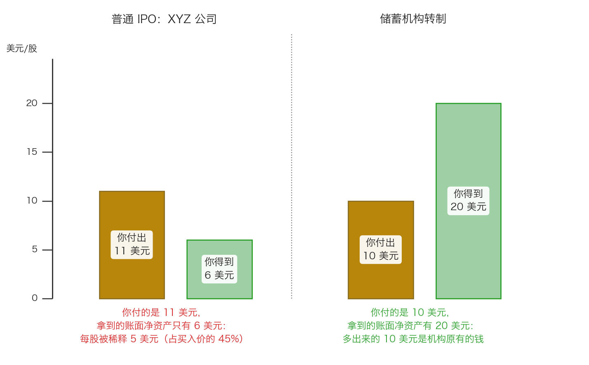

# 第 0 章：储蓄机构转制——一次制度性机会

> 本章你将：
> - 用一家"员工合伙小超市改成股份有限公司"的例子，一次搞懂**互助制**和**转制**这两个陌生概念
> - 看清普通 IPO 和储蓄机构转制在算术上的**根本区别**：一个切老股东的饼，一个给所有人垫厚家底
> - 亲手算一遍原书的两个算例，知道"白得的那 10 美元"是从哪里来的
> - 知道为什么 1980 年代这么好的事没人抢：分析师不覆盖、负面新闻、羊群心态
> - 学会一条能用在任何公司上的筛选规则："如果你无法快速了解它在做什么，管理层也许也不知道"
> - 回答"这对我的钱包意味着什么"：制度性变化会创造一次性的错误定价，但**前提**是这家公司原本就有真正的价值

上一周我们认识了六类机会：清算、复杂证券、认股权配售、风险套利、分拆，还有低于清算价值的打折证券。它们的共同点是——**便宜来自"别人不愿意看"**。这一章讲的这一类机会，便宜来自一个更根本的地方：**规则本身变了**。

---

## 0.1 先交代背景：美国的储蓄机构，和 1980 年代那场灾难

你完全没听过"储蓄机构"这个词，所以先用五句话说清楚。

**储蓄机构**（英文叫 savings and loan，缩写 S&L，也可以理解成"存贷社"）是美国的一类小银行，最早在 19 世纪中期出现，到 1980 年代已经有数千家（p195）。它的生意非常简单：**把居民的存款收进来，放成二三十年的住房抵押贷款。** 你可以把它想成中国早年的城市信用社、农村信用社——扎根一个社区，做街坊生意。

在 1970 年代末放松管制之前，这个行业舒服到什么程度？原书引了一则老掉牙的笑话，说管理这个行业用的是"**3-6-3 原则**"：存款利率 3%，贷款利率 6%，下午 3 点出现在高尔夫球场（p195）。存 3 放 6，中间那 3 个点稳稳落袋。原书对这个状态的评价是："一名储蓄机构执行官的生活简单，但收入颇丰，且拥有很高的社会地位。"（p195）

然后，两件事把这一切打碎了。

**第一件：利率放开了。** 管制放松之后，储蓄机构付给存款人的利率突然被允许跟着市场利率一起浮动，可是它资产端的大头——住房抵押贷款——是**固定利率**的，二三十年前定下来的利率，改不了。于是"资金成本"很快超过了"资产回报"，出现了**负利率差**（p195）。用大白话说：**它借钱的利息比放钱的利息还高，每做一笔生意亏一点。**

**第二件：1982 年的《加恩-圣杰曼法》允许它们去做高风险的贷款和投资新业务**（p195）。一个本来只会做住房贷款、而且正在亏钱的行业，突然被允许去赌。结果是"数千亿美元的亏损，大量储蓄机构因而破产"（p195）。

到 1980 年代末，这个行业分成了两类：

- **亏钱的**：筹不到新资金，只能继续维持原来的所有制——**互助制**；
- **既赚钱又有充足资金的**：可以通过**转制**变成股份制公司、向公众发行股票（p196）。

**1983 年以来，成百上千家互助储蓄机构完成了转制**（p195）。原书第十一章讲的就是：为什么这件事对买家有利，以及为什么这么好的事没人抢。

> 📌 **划重点：** 记住这个因果链——**管制放松让老生意垮掉，垮掉的行业带来负面新闻，负面新闻把整个行业的股票不分好坏地一起打压。** 而"转制"这个制度性动作，恰好在这个时间点上，把一批**好机构**的股票送到了市场上。这就是"制度性机会"的完整配方。

---

## 0.2 互助制：一家"没有股东"的银行

要理解"转制"，先要理解它转之前是什么样。这个概念中国读者完全没有对应物，所以先讲一个生活例子。

**想象一家开了二十年的员工合伙小超市。**

这家店有个奇怪的规定：**它没有老板，也没有股东。** 谁在这家店里存了钱（比如办了会员卡、预存了购物金），谁就是这家店的"所有者"之一。赚了钱不分红，全部留在店里——多进点货、把仓库修一修、再开一家分店。店越开越厚实，但**没有一个叫"股票"的东西可以买卖**。

这就是**互助制**（mutual）。放到银行身上：

| | 互助制储蓄机构 | 股份制银行 |
|---|---|---|
| 谁拥有它 | **存款人**（理论上） | 股东 |
| 有没有股票 | **没有**。所以也没法在交易所买卖 | 有，可以随时买卖 |
| 赚了钱怎么办 | 留在机构里，变成"未分配利润"，不分给谁 | 可以分红，也可以留存 |
| 管理层怎么被激励 | 没有股票、没有期权，靠薪水和地位 | 常有股权激励，股价关系切身利益 |
| 谁来决定大事 | 存款人（实际上很难组织起来） | 股东大会、董事会 |

原书说，这种"共有属性让储户感到放心，认为自己能够得到公平的待遇，因为从理论上讲，拥有这些机构的就是这些储户"（p195）。

但**"理论上"这三个字很重要**。几千个存款人散落在各个社区，谁也不认识谁，谁也不会为了机构的一件小事跑去开会。于是实际控制权落在**管理层**手里。而管理层平时日子过得很舒服——原书说，"很少有储蓄机构的执行官愿意面对互助转制为股份制中的不确定性，而管制的放松迫使他们采取了行动"（p195）。

> 💡 **换个说法：** 互助制就像一群人说好"这家店是我们大家的"，但从来没人真的去开过会。**产权在纸面上很清楚，在现实里很模糊。** 而"转制"要做的第一件事，就是**把这份模糊的产权，切成一张张能标价、能买卖的股票**。

---

## 0.3 转制：把"没有股东"变成"有股票"

**转制**（英文叫 conversion）就是：互助制改成股份制。具体机制，原书讲得很清楚（p196–p197）：

1. **正在转制的储蓄机构里的储户，对股票有优先购买权**；
2. **管理层也有权购买股票**；
3. **剩下的股票向公众发行**，有时会优先发行给这家机构所在地附近的客户。

看起来就像一次普通的上市（IPO）。但原书指出，**它和普通 IPO 有一个根本区别**：

> "同其他的 IPO 不同，在一家储蓄机构进行转制时不存在原有股东，在转制时发行和卖出股票之后，这家储蓄机构中的所有股票都是流通股。"（p197）

"**不存在原有股东**"——这五个字就是全部的钥匙。我们把它和普通 IPO 放在一起对比。

### 普通 IPO 是什么样子

原书给了一个算例（p196）。XYZ 公司要做一次典型的股票承销：

- 内部人士早先已经以 **1 美元/股**的价格买了 **100 万股**；
- 现在以 **11 美元/股**的价格向公众发行 **100 万股**；
- 发行后总股本 **200 万股**；
- 公司账面上的净资产合计 **1200 万美元**（也就是每股 **6 美元**）。

发生了什么事？

- 公众掏了 11 美元，拿到的是每股 6 美元的账面净资产——**被稀释了 5 美元，相当于买入价的 45%**；
- 内部人士掏了 1 美元，同样拿到 6 美元的账面净资产——**每股白赚 5 美元**。

原书把这个结果叫做"内部人士则获得了一笔 5 美元/股的横财"（p196）。

> 💡 **换个说法：** 普通 IPO 就像**一块已经做好的饼，切一块卖给新人**。饼本身没变大，新人付的钱高于他分到的那一块，多出来的部分补贴给了老人。这就是"稀释"。

### 储蓄机构转制是什么样子

原书紧接着给了另一个算例（p196）：

- 一家**资产净值为 1000 万美元**的储蓄机构，转制时以 **10 美元/股**的价格发行 **100 万股**；
- 忽略发行成本，这家机构**账面上多了 1000 万美元**；
- 转制后净资产变成 **2000 万美元**；
- 因为**转制前没有股票**，所以只有这次发行的 100 万股是流通股；
- 于是**每股账面净资产是 20 美元**。

原书对这个结果的描述是（p196）：

> "在这家储蓄机构原来的资产净值加上投资者自己的资金之后，每股的资产净值马上超过了投资者自己所作出的贡献。"

用最直白的话说（p197）：

> "实际上就是，对一家储蓄机构转制进行投资的投资者是在购买自己的资金，并免费获得了这家储蓄机构中原有的资金。"

看出区别了吗？**普通 IPO 卖的是"已有的饼"，转制卖的是"饼，外加你自己新投进来的面粉，而且没有老股东来分这块被垫厚的饼"。**

原书还点出了转制的第二个独特之处（p197）：许多 IPO 里，低价买入的内部人士会在发行时卖掉一部分股票套现；**但在储蓄机构转制的 IPO 里，内部人士实际上总是同公众一起、以相同的价格购买股票**。而且"只有储蓄机构转制投资才会预先完全披露内部人士的购买规模和价格，且让公众有机会享受同内部人士相同的待遇"（p197）。

> 📌 **划重点：** 转制的算术之所以对买家有利，全靠一个前提——**"只要这家储蓄机构在转制之前有真正的商业价值"**（p197）。如果它转制之前就是一堆坏账，那么新投进来的钱只会被拿去填坑。原书把这句反话说得很清楚（p197）："储蓄机构在转制中筹集的资金将被用于解决原有的问题，而不是增加原有的价值。"

---

## 0.4 为什么这么好的事，没人来抢

你可能会想：这种"白得一笔钱"的事，华尔街那么多人精，怎么会轮到我？

原书给了三个原因，每一个都值得你记住，因为**它们今天还在起作用**。

**原因一：没人研究。** 原书说（p197–p198）："华尔街的卖方之前雇佣了很少的储蓄机构行业分析师，而买方雇佣的此类分析师则更少。为数不多的卖方分析师往往只跟踪 10-20 家的大型上市储蓄机构，主要是那些位于加利福尼亚州和纽约州的储蓄机构。" 结果就是："没有一家大型的华尔街机构能够掌握所有的几百家已经进行了转制的储蓄机构的情况，甚至没有多少机构投资者朝这方面做出过努力。"（p198）

**原因二：打折发行，因为没人认识你。** 正因如此，"刚刚进行转制的储蓄机构的股票往往以大幅低于其他上市储蓄机构的估值水平的打折价进行发行，以吸引投资者的关注"（p198）。

**原因三：整个行业被贴了同一张标签。** 这是最狠的一条。原书在结论里写道（p202）：

> "更重要的是，他们展示了羊群心态如何使一个不受欢迎行业中的所有企业都被标上了相同的记号。"

当整个行业都在出事——1980 年代末美国房地产市场下滑、监管者接管了一批陷入麻烦的金融机构、市场预期"对储蓄银行行业的总援助成本将达到 5000 亿美元"（p200）——投资者没有耐心去区分**这一家**和**那一家**。他们统一卖。原书在开篇就总结过（p195）：

> "负面的宣传加上储蓄机构转制经济学过度打压了许多储蓄机构的股价。"

> 🇨🇳 **落到 A 股/港股：** 这就是典型的"**行业性错杀**"。一个行业出了大事（教培、地产、光伏、医药集采……），市场往往先把板块里所有公司一起砍一遍。**砍完之后，你要做的第一件事不是"买行业"，而是回到 Week 9 学的功夫：一家一家看，把"行业完蛋"和"这家公司完蛋"分开。** 真正的机会从来不是"整个行业都便宜"，而是"这个行业里那几家本来就不该跌的公司，被顺手一起砍了"。

---

## 0.5 但不是每一家都能买：三条筛选规则

原书在讲完机会之后，立刻讲风险，而且讲得很具体。这一节请当成一张**过滤网**来用。

**规则一：看不懂就不碰。** 原书给了一条"简单的应用规则"（p198）：

> "如果你无法快速了解一家公司正在做什么，那么管理层也许也不知道自己在做什么。"

具体要躲开的是这些（p198）：把业务扩展到不同寻常的贷款业务上、进行过度投机的储蓄机构；以及"对新创造出来的投资工具进行投机的储蓄机构，如垃圾债或者复杂的抵押贷款证券"。

**规则二：高杠杆的机构，要更保守。** 原书说（p198）："尽管应当对所有的企业都进行保守的评估，但在评估使用了高杠杆的金融机构时，保守主义甚至显得更为重要，因为资本结构会放大这些机构的营运风险。" 银行、保险、券商都属于这一类——它们的资产大部分是借来的，一点点坏账就能吃掉全部自有资金。

**规则三：账面价值要自己调。** 银行的"账面价值"不能直接拿来用，要**上调**也要**下调**（p199）：

| 应该**上调**的（账上记少了） | 应该**下调**的（账上记多了） |
|---|---|
| 已经升值的投资证券 | 无形资产（比如商誉） |
| 低于市场价值的租赁 | 坏账 |
| 以低于当前价值记账的房地产 | 回报低于成本的投资 |
| 稳定、低成本存款的价值 | —— |

除了账面价值，利润也要重新看（p199）：把证券盈亏、房地产盈亏、会计变更这些**一次性的东西**剔出去，因为"从存贷款之间的利息差中所产生的持续盈利较之那些一次性获得的收益或者波动剧烈的贷款发放费更有价值"。而"管理成本低的储蓄机构要好于管理成本高的储蓄机构"，不只是因为它现在更赚钱，也因为它"在利率差缩小时能有更大的灵活性"。

原书最后仍然补了一句提醒（p199）：**"尽管储蓄机构转制非常诱人，但世事无绝对。"** 资产质量、利率波动、管理层的判断力、竞争对手的行为，一样会出问题。你要"根据实际情况来分析每一家储蓄机构进行转制时的潜在机会，而不是将它看作是一个经常具有吸引力市场中的一个组成部分来进行分析"（p199）。

> ⚠️ **易踩坑：** 看到"转制"两个字就买，等于看到"分拆"两个字就买、看到"重组"两个字就买。**制度性动作只是把机会摆到桌面上，它本身不是安全边际。** 安全边际永远来自"价格大幅低于你自己保守估算的价值"，这一点在 Week 7 就定死了。

---

## 0.6 牙买加储蓄银行：一个完整的例子

原书用了一整节讲这家银行（p199–p201）。我们按时间顺序看一遍。

**它是谁。** 1866 年成立于纽约。到 1989 年 12 月 31 日，总资产 15 亿美元，未分配利润 1.971 亿美元。**转制之前，它的有形资产占总资产的 13.5%**，这个比率"处在全国储蓄银行中的前列"（p200）。换句话说，它的自有本钱非常厚。

**它做什么。** 2/3 的资产是美国短期国库券、联邦机构证券或者现金等价物；只有 30% 是贷款，而且"实际上所有的贷款都是住房抵押贷款"（p200）。原书对它的评价是（p200）："牙买加储蓄银行非常出色：拥有流动资金，资金充足，且没有实质的商业风险。"

**它转制时的环境。** 这是最关键的背景。当时"整个美国的房地产市场都已经出现了下滑……几乎所有地区都提高了对房地产借款人的放贷标准。多数储蓄机构和银行的股票都出现了大跌，许多陷入麻烦的金融机构已经被联邦监管者所接管"（p200）。原书说它是在"进行不可能完成的尝试"。

**它卖多少钱。** 储户获得以 **10 美元/股**的价格购买 **1600 万股**的机会。而计算下来，"即使转制对牙买加储蓄银行明显有好处，但投资者能以仅为**账面价值 47%**、**10 倍市盈率**的价格买到这些股票"（p200）。原书认为，这个低价正是被"房地产市场暗淡的前景以及储蓄银行类股的下跌"砸出来的（p200）。

**为什么这个价格很安全。** 原书给了一个很聪明的算法（p201）：转制所得收入的一半，也就是 **8000 万美元**，会留在控股公司里。这 8000 万美元现金就是**可以在 IPO 之后回购股票的弹药**。

原书接着算：如果公司用这些钱、以"账面价值的 2/3"（相当于 **14 美元/股**，比 10 美元的 IPO 价溢价 40%）的价格回购股票，**大约能买回已发行股票的三分之一**。股票数量少了三分之一，每股对应的价值自然上升——"在对回购假设进行调整之后，牙买加储蓄银行的每股价值会从 **21.12 美元**增至 **25 美元**，增幅为 **18%**"（p201）。

**后来发生了什么。** 原书对结局的描述是（p201）：

> "最终，管理层以较IPO 价格溢价30%的价格进行了第一次股票回购，即使是多年晚些时候股市大跌时，股价依然维持在IPO 价格上方。"

注意这个细节：**管理层后来的第一次回购，价格比 IPO 价高了 30%**——也就是说，当初以 10 美元买到股票的人，光是等着公司自己来买，就已经浮盈了。而且"管理层在IPO时就购买了大量的股票"（p201），管理层和公众是站在同一边的。

**投资者能靠什么赚钱？** 原书列了三条（p201）：随着银行开始配置那些剩余的资本，利润会上升；保留收益会增加账面价值；管理层致力于通过积极的股票回购计划来增加股东价值，这会同时提高每股收益和每股账面价值。

> 💡 **换个说法：** 牙买加储蓄银行这笔投资的美妙之处在于——**它不需要这家银行变得更好，它只需要这家银行继续做它已经在做的事**。钱躺在国库券上收利息、利润留存把账面价值垫高、现金用来回购自家便宜股票。三件事都不依赖任何乐观假设。这就是安全边际最理想的样子。

---

## 0.7 落到今天：制度性变化在中国长什么样

"美国储蓄机构转制"这件事本身，今天已经不存在了。但它背后的机制，在中国的资本市场上反复出现。下面四组，你都可以自己去查。

**第一组：信用社改制。** 中国的农村信用社、城市信用社，历史上也经历过类似的所有制变化——清产核资、增资扩股、引入法人股东，改成农村商业银行或城市商业银行。**社员变股东、储户有优先认购权、老底子被摊到新股上**，这套逻辑和美国的互助制转制几乎一模一样。

**第二组：国有银行改制上市。** 2000 年代，几家大型国有银行走过一条"剥离不良资产 → 注资 → 引入战略投资者 → 上市"的路。这里要注意一个**反向**的细节：这些银行在上市前，先把一大块坏账剥离出去，让新股东买到的是一个"洗干净"的资产包。这和原书说的反面情形是一致的——**如果转制筹来的钱是去填旧的坑，新股东就占不到便宜**（p197）。

**第三组：各种"转板"和"放开门槛"。** 北交所的设立与转板机制、H 股全流通、公募 REITs 试点、A 股分拆子公司上市……每一次规则变化，都会把一批原本"没被定价"的资产，突然放进公开市场。**覆盖的研究者少、可比的历史数据少、投资者习惯用老眼光看新事物**——三个条件一凑齐，错误定价就有了土壤。

**第四组：指数纳入与规则调整。** 一家公司被纳入某个重要指数、某个行业被重新分类、某个交易规则发生变化，都会带来一次被动的、不看价格的买卖。

> 🇨🇳 **落到 A 股/港股：** 你不需要记住上面任何一个案例的细节。你只需要记住一个**提问方式**：**"最近有没有什么规则变了，导致一批本来没人看的资产，突然被摆到了台面上？"** 想清楚这个问题，你就有了一张自己的机会地图。但要再提醒一次：**制度变化只负责"把东西摆上桌"，值不值得买，还是要回到估值和安全边际。**

原书对这一类机会的冷清程度有一段很传神的描述（p202）：

> "然而，除了投资储蓄银行转制偶尔会在个人投资者之间流行外，这一领域一直被忽视。"

---

## ✍️ 想一想

1. 假设你所在的城市有一家开了三十年的"员工合伙"老饭馆，突然宣布要改成股份有限公司、向街坊发行股票。请你按本章学到的顺序，问出**三个**必须先回答的问题，再决定要不要买。
2. 原书说普通 IPO 里"内部人士获得了一笔 5 美元/股的横财"。请你解释：这 5 美元**具体是从谁的口袋里出来的**？是公司吗？是公众投资者吗？还是别的什么？
3. 一个行业出了大新闻，板块里所有股票一起跌了 40%。请分别说出两种可能：一种是"这次真的是整个行业完蛋"，另一种是"这是羊群心态贴标签"。**你用什么办法区分这两种情况？**

> 💡 **参考思路：**
> 1. 问题一：**这家店转制之前，本身值不值钱？**（原书 p197 的前提条件：转制前必须有真正的商业价值。）问题二：**新投进来的钱，是拿去扩张，还是拿去还旧账？**（p197："用于解决原有的问题，而不是增加原有的价值"。）问题三：**我付的价格，相对于它转制后的每股账面净资产，是打了几折？** 这三个问题都答得出来，才谈得上"有没有安全边际"。
> 2. 这 5 美元**不是公司出的**，也不是凭空变出来的。它是**公众投资者自己多付的那部分钱，被转移给了内部人士**。公众付 11 美元、拿到 6 美元的账面净资产，多付的 5 美元进了公司的资产池，而这个资产池按持股比例属于全体股东——内部人士用 1 美元的成本，分到了同一块 6 美元。所以准确的说法是：**稀释是股东之间的财富转移，不是公司赚了钱。**
> 3. 区分的办法是**往下问一层**：整个行业完蛋，通常有共同的原因（需求消失、被政策禁掉、被新技术替代），并且这个原因对每家公司的**收入**都产生了实质影响；羊群贴标签，则是"新闻很吓人，但这家公司的订单、现金流、负债没有跟着变"。具体做三件事：① 看这家公司最近一期财报的收入和经营现金流有没有真的掉；② 看它的负债结构和现金跑道（第 1 章会算）；③ 问自己"如果这个行业只剩下三家公司，会不会有它"。**如果它在，那它被一起砍就是机会；如果它不在，那 40% 的下跌只是开始。**

---

## 🧮 算一算

这一章的算术全部来自原书的两个算例（p196）和牙买加储蓄银行那一节（p200–p201）。请拿出纸笔。

### 第一题：普通 IPO 的稀释（XYZ 公司）

**情境（原书 p196 的数字）。** 内部人士以 1 美元/股买了 100 万股；随后公司以 11 美元/股向公众发行 100 万股。发行后总股本 200 万股，公司账面净资产合计 1200 万美元。

**问题：** ① 公众一共投入多少钱？② 发行后每股账面净资产是多少？③ 公众每股被稀释了多少钱、占买入价的百分之几？④ 内部人士每股赚了多少？

**分步解答。**

第一步，公众投入的钱：

$$100 万股 \times 11 美元 = 1100 万美元$$

第二步，验算总净资产（内部人士的 100 万加上公众的 1100 万）：

$$100 万 + 1100 万 = 1200 万美元$$

第三步，发行后每股账面净资产：

$$1200 万 \div 200 万股 = 6 美元/股$$

第四步，公众的稀释：

$$11 - 6 = 5 美元$$

$$5 \div 11 = 45.5\% \approx 45\%$$

第五步，内部人士赚到的：

$$6 - 1 = 5 美元/股$$

**四行答案：① 1100 万美元；② 6 美元/股；③ 稀释 5 美元，占买入价的约 45%；④ 每股 5 美元。** 请注意：**内部人士赚的 5 美元和公众亏的 5 美元，是同一个 5 美元。**

### 第二题：储蓄机构转制的算术

**情境（原书 p196 的数字）。** 一家储蓄机构转制前的资产净值是 1000 万美元。它以 10 美元/股发行 100 万股。忽略发行成本。

**问题：** ① 一共募到多少钱？② 转制后账面净资产是多少？③ 转制后的总股本是多少股？④ 每股账面净资产是多少？⑤ 你花 10 美元拿到 20 美元，多出来的 10 美元是从哪来的？

**分步解答。**

第一步，募到的钱：

$$100 万股 \times 10 美元 = 1000 万美元$$

第二步，转制后的账面净资产：

$$1000 万 + 1000 万 = 2000 万美元$$

第三步，转制后的总股本：**因为转制之前这家机构没有股票，所以只有这次发行的 100 万股是流通股。**

$$总股本 = 100 万股$$

第四步，每股账面净资产：

$$2000 万 \div 100 万股 = 20 美元/股$$

第五步，那多出来的 10 美元来自**这家机构转制前就有的那 1000 万美元净资产**。它被摊到了 100 万股上，每股 10 美元。原书对这件事的说法是（p197）："投资者是在购买自己的资金，并免费获得了这家储蓄机构中原有的资金。"

**两题放在一起看：**

| | 普通 IPO（XYZ） | 储蓄机构转制 |
|---|---|---|
| 你付出的价格 | 11 美元 | 10 美元 |
| 买入后每股账面净资产 | 6 美元 | 20 美元 |
| 差额 | **少了 5 美元** | **多了 10 美元** |
| 原因 | 有老股东，饼被切走一块 | **没有老股东**，新钱把饼垫厚了 |

### 第三题：牙买加储蓄银行的回购账

**情境（原书 p200–p201 的数字）。** 以 10 美元/股发行 1600 万股。其中一半的募资，即 8000 万美元，留在控股公司里，可以用于回购股票。管理层打算按"账面价值的 2/3"回购。

**问题：** ① 10 美元的发行价只等于账面价值的 47%，那么每股账面价值大约是多少？② 账面价值的 2/3 是多少钱？比 10 美元的发行价溢价多少？③ 8000 万美元按这个价格能买回多少股？④ 占 1600 万股的百分之几？

**分步解答。**

第一步，反推每股账面价值：

$$10 \div 0.47 = 21.28 美元$$

原书 p201 用的口径是 **21.12 美元**，和这个结果基本一致。下面统一用 21.12 美元。

第二步，账面价值的 2/3：

$$21.12 \times 2 \div 3 = 14.08 \approx 14 美元$$

比 10 美元的发行价高：

$$14 - 10 = 4 美元$$

$$4 \div 10 = 40\%$$

**这正好对上了原书 p201 说的"较 IPO 价格溢价 40%"。**

第三步，能买回多少股：

$$8000 万 \div 14 = 571 万股（约）$$

第四步，占已发行股份的比例：

$$571 \div 1600 = 35.7\% \approx 三分之一$$

**这正好对上了原书 p201 说的"能回购 1/3 已经发行的股票"。**

**追问：股票少了三分之一，每股会怎样？** 原书给的结果是每股价值从 21.12 美元升到 25 美元：

$$25 - 21.12 = 3.88 美元$$

$$3.88 \div 21.12 = 18.4\% \approx 18\%$$

**对上原书 p201 的"增幅为 18%"。** 三道小题全部和原书对上了，说明这套算术是自洽的。

> 📌 **划重点：** 这道题的真正价值不在数字，而在**结构**：这笔投资的收益来自三件**不依赖乐观假设**的事——现金收利息、利润留存垫高账面价值、用便宜的价格回购自家股票。Week 7 说过，安全边际来自"即使事情没有变好，你也不亏"。**牙买加储蓄银行就是这句话的一个具体样本。**

---

## ✅ 小测验

**1. 储蓄机构转制之所以对新股东有利，最根本的原因是下面哪一条？**
A. 储蓄机构的资产质量一定比普通公司好
B. 转制时不存在原有股东，所以转制后所有股票都是流通股，新投进来的钱直接垫厚了每股净资产
C. 储蓄机构转制时，内部人士必须按低于公众的价格认购
D. 转制后的公司一定会被大银行收购

**2. 原书那条"简单的应用规则"是怎么说的？**
A. 只买市盈率低于 10 倍的公司
B. 只买账面价值高于股价的公司
C. 如果你无法快速了解一家公司正在做什么，那么管理层也许也不知道自己在做什么
D. 只买管理层持股比例超过 20% 的公司

**3. 关于牙买加储蓄银行，下面哪种说法最准确？**
A. 它的收益完全依赖房地产市场快速反弹
B. 它的收益来自"继续做已经在做的事"：闲钱收利息、利润留存垫高账面价值、用现金低价回购自家股票
C. 它的股票在 IPO 后很快就跌破了发行价
D. 它的转制之所以成功，是因为转制前它的资产大部分是高收益的房地产开发贷款

> **答案与解析**
>
> **1. B。** 这是原书 p197 那一句"同其他的 IPO 不同，在一家储蓄机构进行转制时不存在原有股东"的直接含义。A 错在"一定"，原书明确说"尽管储蓄机构转制非常诱人，但世事无绝对"（p199），资产质量要一家一家看；C 错在原书说的恰好相反——转制时"内部人士实际上总是同公众一起以相同的价格购买股票"（p197）；D 是凭空加上的条件，原书没这么说。
> **2. C。** 原书 p198 的原话是"如果你无法快速了解一家公司正在做什么，那么管理层也许也不知道自己在做什么"，它是一条**能力圈**规则，不是选股公式。A、B、D 都是典型的"选股公式"，而原书恰恰在别处批评过依赖公式的做法——真正决定要不要买的，永远是这个价格相对你自己保守估算的价值有没有折扣。
> **3. B。** 原书 p201 列出的三条获利途径分别是：随着银行开始配置剩余资本、利润会增加；保留收益会增加账面价值；积极的股票回购计划会提高每股收益和每股账面价值。A 错在它压根不需要房价反弹——它的资产 2/3 是国库券、联邦机构证券或现金等价物；C 错在原书明确说"即使是多年晚些时候股市大跌时，股价依然维持在IPO 价格上方"（p201）；D 错在只有 30% 的资产是贷款，且"实际上所有的贷款都是住房抵押贷款"（p200）。

---

## 📖 回到原书

- 对应原书 **第十一章 投资储蓄机构转制**，`raw/安全边际-中文版/page_195.md` ~ `page_202.md`（原书 p195–p202）。
- 建议精读：**p196–p197**（普通 IPO 与转制的两个算例，以及"不存在原有股东"那一段），**p200–p201**（牙买加储蓄银行的全部数字和回购推算）。
- 可以略读：**p195 前半段**和 **p198 前半段**关于 1980 年代储贷危机的行业细节（记住"3-6-3 原则""负利率差""1982 年《加恩-圣杰曼法》"这三个词就够，后面的连锁反应对我们今天的用处不大）。
- 原书金句（**逐字引用**）：
  > "负面的宣传加上储蓄机构转制经济学过度打压了许多储蓄机构的股价。"（p195）
  >
  > "在这家储蓄机构原来的资产净值加上投资者自己的资金之后，每股的资产净值马上超过了投资者自己所作出的贡献。"（p196）
  >
  > "同其他的IPO 不同，在一家储蓄机构进行转制时不存在原有股东，在转制时发行和卖出股票之后，这家储蓄机构中的所有股票都是流通股。"（p197）
  >
  > "实际上就是，对一家储蓄机构转制进行投资的投资者是在购买自己的资金，并免费获得了这家储蓄机构中原有的资金。"（p197）
  >
  > "如果你无法快速了解一家公司正在做什么，那么管理层也许也不知道自己在做什么。"（p198）
  >
  > "更重要的是，他们展示了羊群心态如何使一个不受欢迎行业中的所有企业都被标上了相同的记号。"（p202）
下一章开始，我们换一个方向：不再看"制度怎么变出新机会"，而是看**一家好好的公司，是怎么一步步走到付不出钱的**。而且你会发现，这条下坡路上，管理层的每一个选择都值得你盯紧。
