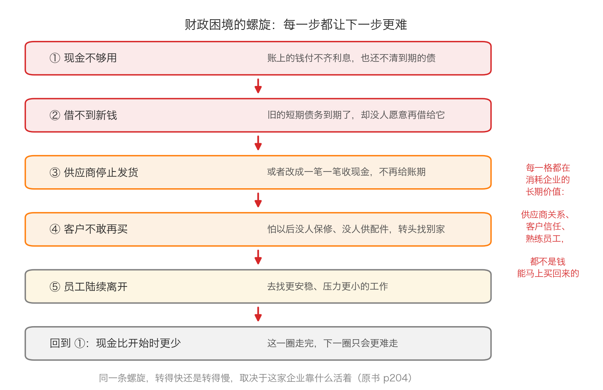
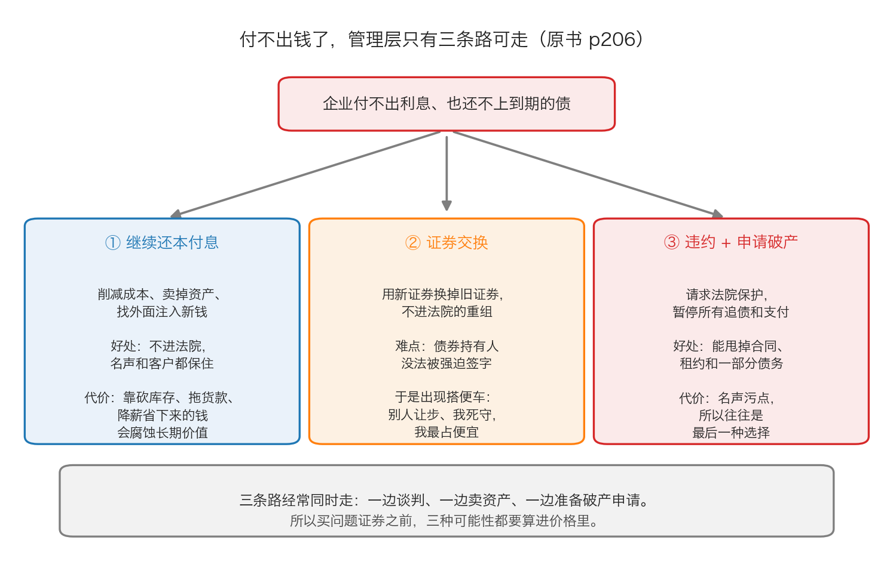

# 第 1 章：企业为什么会陷入困境

> 本章你将：
> - 分清企业陷入财政困境的**三个原因**，以及为什么它们几乎总是连锁出现
> - 看懂一条会自己加速的下坡路：现金不够 → 借不到新钱 → 供应商停供 → 客户流失 → 员工离开
> - 知道**哪类企业扛得住**财政困境、哪类扛不住，以及"债务挂在哪个层级"为什么这么关键
> - 认识管理层手里的三条路：继续还钱、证券交换、申请破产，以及每条路的真实代价
> - 弄懂"证券交换"为什么是一场囚徒困境，以及"预先包装的破产"是怎么破解它的
> - 回答"这对我的钱包意味着什么"：学会用一句"现金跑道还有几个季度"提前半年看出问题

上一章讲的是"制度变化怎么把好公司的股票变便宜"。这一章换到反面：**一家本来正常的公司，是怎么一步步走到付不出钱的。** 这个过程你以前可能在新闻里见过，但多半只看到最后那一声巨响——"某某公司申请破产重整"。这一章要把前面那段安静的下坡路讲清楚。

---

## 1.1 三个原因，一个放大器

原书开篇就把原因归纳得很干净（p203–p204）：

> "企业之所以会陷入财政困境至少是因为以下三个原因中的一个：公司经营出现了问题，陷入了法律纠纷，以及（或者）财政出现了问题。"（p203–p204）

我们一个一个说。

**原因一：经营出了问题。** "一家情况严重恶化的企业可能造成经营持续亏损，最终陷入财政困境。"（p204）翻译成日常语言：**它的生意不赚钱，而且不是一年不赚，是一直不赚。** 可能是产品卖不动了，可能是成本涨得比售价快，可能是押注的新业务一直烧钱。重点是——**这是经营层面的问题，跟它借了多少钱没关系。**

**原因二：法律纠纷。** 原书举了 Johns Manville、Texaco、A.H.Robins 这几家美国公司的例子，说"异常严重的法律问题会让企业的财政面临巨大的不确定性，导致它们最终寻求破产法庭的保护"（p204）。法律纠纷的特点是：**金额不确定、时间不确定、而且它跟经营好坏完全无关。** 一家生意红火的公司，也可能因为一桩巨额赔偿或者一份被判无效的合同而瞬间陷入困境。

**原因三：财政问题，也就是债务太重。** 这是原书着墨最多的一条。原书的原话是（p204）："财政困境有时几乎都来自于过多的债务负担，20 世纪 80 年代许多的垃圾债发行人就有这样的经历。"

现在讲最关键的一层：**这三者几乎总是连锁的，而"债务太重"是那个放大器。**

想象两家公司，同样的生意，同样遇到行业不景气，一年少赚 1 亿元。

- **甲公司没有负债**：账上还有往年攒下的钱，今年少赚 1 亿，明年可以慢慢调整。
- **乙公司借了 30 亿元，每年利息 2 亿元**：今年不但少赚 1 亿，还得照样掏 2 亿利息。合计现金少了 3 亿。

**同样一个坏消息，落在乙公司身上，威力是甲公司的三倍。** 这就是"杠杆放大经营风险"的意思——债务本身不制造问题，它只是把经营上的每一个波动，按借款倍数放大一遍。Week 6 讲垃圾债时我们见过这套结构，Week 9 讲招商银行时也提过一句"银行为什么要另眼看待"，说的都是同一件事。

> 📌 **划重点：** 看到一个坏消息，不要只问"这件事有多糟"，要接着问一句：**"这家公司身上有多少债，它的债什么时候到期？"** 同一个坏消息，落在不同的资产负债表上，结局可以完全不同。

---

## 1.2 财政困境长什么样：一条会自己加速的下坡路

原书对"财政困境"给了一个非常具体、也非常好记的定义（p204）：

> "财政困境典型的特征就是现金几乎无法满足企业运作和债务支付的需求。"（p204）

注意这句话里有两个需求，**必须同时满足**：一是"企业运作"（进货、发工资、交房租），二是"债务支付"（还利息、还本金）。当现金不够同时满足这两个需求时，麻烦就开始了。原书把接下来的链条写得很清楚（p204）：

1. **现金耗尽**；
2. 公司的短期债务（比如商业票据、银行借款）**"可能无法在到期时进行再融资"**——也就是借新还旧这条路断了；
3. **供应商**因为担心收不到钱，"减少或者停止发货，或者要求现金交易，从而让债务人的处境雪上加霜"；
4. **客户**因为"希望与持续经营的企业建立起关系"，开始"停止购买这家企业的产品"——谁会买一台以后没人保修的机器呢；
5. **雇员**开始"弃他而去，转而寻找更加安全或者压力更小的工作"；
6. 回到第 1 步——但这一次，处境比上一轮更差。

这张图里最要紧的是**每一步消耗的都是"钱买不回来"的东西**。供应商关系可以重建，但要时间；客户信任可以挽回，但要打折；熟练员工走了，新人要培训。原书对这件事有一句总结性的判断（p206）：

> "然而，短期内的缓和措施可能会腐蚀长期内的企业价值。"（p206）

这句话是针对管理层自救手段说的（削减库存、延长付款期限、下调薪资），但放在整条螺旋上看更准确：**为了撑过这个季度而做的每一件事，都在悄悄地把公司的长期价值削薄一层。**

> 💡 **换个说法：** 财政困境不是"某一天突然没钱了"，而是**一个越转越快的漩涡**。它一开始只要求你少花点钱，后来要求你卖掉一块业务，再后来要求你把最好的资产抵押出去。等你意识到的时候，你已经没有可以卖的东西了。

---

## 1.3 哪类企业扛得住，哪类扛不住

同样掉进漩涡，为什么有的公司能爬出来，有的直接沉底？原书给了三个判断维度。

**维度一：你靠什么活着。**

原书说（p204）："从长期来看，资本密集型企业的运营对财政困境有着相对较强的抵抗力，而那些依赖于公众信任的企业，如金融机构，或者依赖于企业形象的企业，如零售商，财政困境也许会给它们带来影响。"

为什么？因为**资本密集型企业卖的是"东西"，信任型企业卖的是"承诺"**。

- 一家钢铁厂就算传出财务困难，客户看到的是实实在在的钢材，还是会来买——只要价格合适。
- 一家银行传出财务困难，第二天储户就来排队取钱。因为**银行卖的就是"我随时能把钱还给你"这个承诺**，一旦这个承诺被怀疑，它的生意当场就没了。
- 一家零售商的困难新闻一出来，顾客立刻会想："我办的充值卡还能用吗？"——然后转身去隔壁。

**维度二：债务挂在哪个层级。**

这是原书里很精妙的一段，普通投资者很容易忽略（p204–p205）：

- 如果债务主要挂在**控股公司**上，而控股公司和主要资产（也就是真正赚钱的经营性子公司）没有关系，那么"财务困境所造成的影响将是最小的"。
- 原书举的例子是 Texco 公司：**"Texco 公司申请破产，而这家公司多数的子公司却没有申请破产保护。"**（p205）
- 反过来，"那些让经营性子公司承担债务的公司可能会面临更严重的混乱局面"（p205）——因为债权人会直接掐住赚钱的那只手。

> 🇨🇳 **落到 A 股/港股：** 这个区别在今天的中国企业里非常常见，尤其是地产和多元化集团。你要看的公告是"**是哪一家主体违约了**"：是集团层面的一笔债，还是某个具体项目公司的贷款？是母公司被申请重整，还是核心子公司？**很多看起来吓人的新闻，实际伤不到赚钱的那块业务；反过来，很多看似"集团很有钱"的公司，恰恰是赚钱的子公司背着全部债务。** 你可以在巨潮资讯网或港交所披露易上，顺着"债务逾期""被申请重整"的公告，看清楚违约主体在股权结构里的位置。

**维度三：破产到底是不是"关门"。**

这是原书最反直觉的一段。大多数人对破产的印象是这样的（p205）：

> "一家破产企业在媒体上的一贯形象就是封锁的大门远处一座满是锈迹的庞大工厂。"（p205）

但原书紧接着说：

> "尽管有时确实如此，但更多时候破产企业仍在继续经营。"（p205）

而且，原书认为"一家申请破产的企业通常都已经度过了最困难的时期，许多这样的企业很快便开始恢复元气"（p205）。为什么？原书列了一串具体的原因：

- **能拿到新钱。** 一旦新债权人的高级地位得到保证，"拥有资产所有权的债务人就可以进行融资了，所获现金将用于支付薪水、重新装满已经耗尽的库存以及给客户和供应商提供信心"（p205）。
- **供应商愿意重新发货。** 因为在破产申请提交之后产生的债权，其受偿顺序高于破产申请之前产生的无担保债权——**供应商发现"现在给它供货反而更安全"**（p205）。
- **业务会回暖。** "因库存重建和信心增加刺激了业务的开展，也因为延迟进行维护且资本支出被推迟，业绩可能开始改善"（p205）。
- **管理层换血。** 新的管理层会被"这家稳定且正在改善的企业的前景，以及重组后低价的股票或者期权所吸引"（p205）。

原书的结论是（p205）：

> "尽管第十一章没有给出所有的答案，但破产确实能为一些陷入麻烦的企业提供受到保护的机会，让它们的财务状况恢复至健康水平。"（p205）

> ⚠️ **易踩坑：** 上面这段话**不是在说"破产是好事"**。它是在说：**破产是一个把"清算顺序"重新洗牌的程序，它会让一部分人拿回更多，同时让另一部分人归零。** 你作为投资者要关心的不是"公司会不会破产"，而是"**在破产这个程序里，我手里这张证券排在第几位**"——这才是第 3 章的全部内容。

---

## 1.4 管理层的三条路

现在公司已经现金告急了。原书说，这时候发行人只有三种选择（p206）：

> "遇到财政困境的债券发行人主要有三种选择：到期时继续支付本金和利息；提议用新证券交换持有人目前持有的未到期债券；或者违约并申请破产。在动用资金之前，一名可能会投资问题证券的投资者必须考虑到所有这三种可能性。"（p206）

**路一：不申请破产，想办法活下去。** 原书列的手段是"削减成本、出售资产或者外部资金注入"（p206）。这条路的代价，就是前面引过的那句"短期内的缓和措施可能会腐蚀长期内的企业价值"（p206）——"通过削减库存、延长应付款项支付期限或者调低薪资等来保存现金的努力能够帮助企业度过眼前的危机，但长期来看，部分措施可能会伤害到企业与客户、供应商和雇员之间的关系，并造成企业价值下降"。

**路二：证券交换。** 原书给了两句话的定义（p206）："证券交换是一家财政陷入困境的发行人为避免破产而作出的尝试，希望通过发行承担更少义务的新证券以交换那些尚未到期的部分或者所有的证券。"以及那句极精炼的概括：

> "证券交换可以被看作是不经过法院的重组计划。"（p206）

**路三：违约并申请破产。** "如果维持措施未能奏效，第三个选择就是根据《联邦破产法》第十一章内容申请法院保护，然后试图对债务人进行重组，让其拥有更加可行的资本结果。然而，这往往是最后一种选择，因为申请破产会给企业名声带来严重的污点。"（p209）

**这张图里最该记住的是最后那一行：三条路经常同时走。** 一家公司今天公告"我们和债权人达成了展期协议"，明天公告"我们正在和一个战略投资者谈"，下个月公告"我们已向法院提交重整申请"——这不是自相矛盾，这是常规操作。原书正是因此才要求投资者"必须考虑到所有这三种可能性"（p206）。

---

## 1.5 证券交换：为什么它是一场"囚徒困境"

中间那条路（证券交换）看起来最美：不用进法院，不用丢面子，双方谈一谈就解决了。但原书花了整整两页讲它为什么极难做成。核心原因只有一句话（p207）：

> "完成一项证券交换最困难的地方就在于，同股票持有人不同，无法强迫债券持有人做任何事情。"（p207）

这里有一个制度上的不对称，你要先理解：

| | 股票持有人 | 债券持有人 |
|---|---|---|
| 能不能被"多数决"强迫 | **能**。原书说"根据法律，只要有 50% 或者 67% 的股东投了赞成票，公司就可以进行合并，少数股东只能被迫接受这一决定"（p207） | **不能**。多数债券持有人不能迫使少数债券持有人接受交换 |
| 结果 | 方案通过，全体照办 | 少数人死守，方案可能黄掉 |

于是就出现了**搭便车**问题：**"死守"立场的人拿到的价值，往往高于同意重组的人。**

原书用一个具体例子把这件事说透了（p207）。假设 X 公司需要把债务从 1 亿美元减少到 7500 万美元，它提出的方案是：**用一份"同样等级、但价值 75 美分"的新债券，去换你手里"交易价格 1 美元"的旧债券。** 从个人利益出发，每个人都愿意接受——因为不接受就要进入漫长、不确定的破产程序。但每个人心里都在打鼓：

- 如果**我同意、别人不同意**，别人坚持要全额，而我已经牺牲了 25%；
- 如果**我做了牺牲、别人没有**，公司可能还是没能得救，最后还是破产；
- 一旦真的破产，**交换过的人反而拿得更少**——因为他们的债券票面价格更低，在破产里的权利也更少。

原书把这个局面直接类比成**囚徒困境**（p207–p208）。这个模型说的是：两名囚犯被分开审讯——

- 两人都不认罪 → 都被释放；
- 两人都认罪 → 都受严惩，但没人送命；
- 一人认罪、另一人不认罪 → 认罪的人没事，**不认罪的那位被处死**。

如果两个人能商量，都会坚持不认罪，然后一起走出去。**可一旦被分开关押，每个人都开始担心对方会认罪。** 原书把这句话原样搬到债券持有人身上（p208）："如果知道其他人也会赞同交换证券的提议，每个人都会支持这一提议，然而，因为没有一名债券持有人可以肯定别人是否会合作，每一名债券持有人在经济利益的驱动下会坚持不同意这一提议。"

而且债券持有人比囚犯还惨——囚犯至少只有两个人。原书说，债券持有人是"一群相互没有联系的人，甚至有时连债务人也不知道对方的身份，且很难将他们聚在一起来进行谈判"（p208）。

**那怎么办？** 原书给的答案是**预先包装的破产**（p208）：

> "克服这种'搭便车'问题的一个方法就是使用一种被称之为'预先包装的破产'的技术性手段，即在申请破产前需要债权人同意重组计划。"（p208）

它为什么管用？因为**破产程序里有一把"强迫"的锤子**：重组计划只要在每个级别的债务中，拿到持有该级别债券 **2/3** 的债权人赞成，**剩下那 1/3 就被迫跟着走**（p208）。原书说这"有效消除了'搭便车'问题"，而且因为方案早就谈好了，"预先包装的破产一般会在几个月内完成，而不需要几年时间"（p208）。

> 📌 **划重点：** 证券交换和破产重整的区别，本质上是**"自愿"和"强制"的区别**。自愿的方案对每个债权人来说都更体面，但正因为自愿，它特别容易卡在"我不确定别人会不会也让步"上。**这也是为什么在现实里，很多公司绕了一圈，最后还是走进了法院。**

---

## 1.6 破产申请本身，在说什么

现在讲这一章最实用的一节：**当一家公司公告"已向法院申请破产重整"的时候，这份公告到底传递了什么信息？**

**信息一：追债的闸门被关上了。** 原书说（p209）：

> "申请破产会暂时中止债权人（出借人）从债务人（借款人）手中获得支付的努力。除了那些担保充分的债务的利息和本金，其他所有的利息和本金支付都将暂停。对进货客户甚至雇员的支付也将停止。"（p209）

一句话：**从这一刻起，除了一部分有担保的债务，所有人都不许再单独来要钱。** 所有人的命运被绑在一起，由一份统一的重组计划来分配。

**信息二：接下来是一场谈判，不是一道判决。** 原书写得很直白（p209）：重组计划要处理"不同等级的债权人——有担保的债权人、高级和次级债权人、进货客户、雇员以及其他人——之间的关系"，而且要通过，需要"在每个级别的债务中，投赞成票的债权人持有的债券总额达到该级别债券的 2/3"。

**信息三：债务人和债权人的利益是直接冲突的。** 原书这一段特别值得读（p209–p210）：

- 债务人"希望尽可能保存更多实力摆脱破产"，所以它会想"最大化现金，并最小化债务"，甚至"试图在破产保护期间维持高水平的资本支出，以确保重组之后企业能继续生存下去"；
- 债权人"通常更希望能获得最多的现金分配"，如果觉得债务人在乱花钱，就会出面反对。

**信息四：破产是一台"甩包袱"的机器。** 原书列了一长串（p210）：公司可以利用破产申请，让**租赁合同和待执行合同**变成无效合同，比如长期的供应安排；过去甚至可以终止劳资合作协议（原书举了 1983 年大陆航空公司的例子，并注明"如今已经不允许做这样的事情了"）。

后果是什么？原书给了一句很精辟的判断：

> "由于债务人可以拒绝执行几乎所有类型的合约，一家破产的公司经常能借重组成为行业中的低成本竞争对手。"（p210）

原书还点出了具体动作：高成本、没有盈利的部门被关闭或出售；高于市场水平的租赁成本被降到正常水平；"公司高估的资产往往会通过减记而降低至公允市场价值，从而降低未来的折旧费"（p210）。原书最后给了一个很有意思的说法：

> "破产程序有时能成为一种有益的精神发泄疗法，可以让陷入麻烦的企业获得改善业务操作的机会。"（p210）

**信息五：破产期间的现金会越攒越多。** 这一条很反直觉——一家破产的公司，账上现金怎么会增加？原书列了六个原因（p210–p211）：拒绝履行合同降低成本、利息和股息暂停支付、净营业亏损结转可以抵税、资本支出大幅减少、不相关的业务被剥离，以及**"因为在重组计划获得通过并完成之前，现金不会用于分配，现有现金所产生的复利以及利息支付所产生的利息将增加现金的持有量"**。

这六条汇成了原书引用的那个说法（p211）：

> "所有这些让一名处于领导地位的破产顾问提出了破产的货币市场理论：如果累积了足够的现金，设计出让所有各方都接受的重组方案的过程就会简化，因为没有人对现金的价值持有异议，也因为将有更多的债权人会得到足额支付。"（p211）

> 💡 **换个说法：** "破产的货币市场理论"翻译成大白话就是——**谈判桌上钱越多，吵架越少。** 一家破产公司省吃俭用攒下的现金，最后都变成了让各方点头的润滑剂。这也是为什么第 2 章要讲"破产债券对股市和债市的波动非常不敏感"：**它的价格主要由"攒了多少钱、谈到哪一步"决定，而不是由大盘决定。**

---

## 1.7 落到今天：一家 A 股公司走到困境，会留下哪些脚印

美国的破产法叫"第十一章"，中国的对应物是《企业破产法》里的**重整**程序。两者的细节不同，但**你在公开信息里能看到的脚印顺序**，几乎一模一样。下面这条时间线值得你抄下来：

| 阶段 | 你能查到的公开信息 | 这一阶段的本质 |
|---|---|---|
| ① 经营变差 | 年报/季报里营业收入下滑、经营现金流由正转负 | 生意本身开始不赚钱 |
| ② 债务到期 | "关于债务逾期公告""关于部分债务未能如期偿还的公告" | 现金不够用了 |
| ③ 外部反应 | 评级机构下调评级、银行抽贷、**银行账户被冻结**、资产被查封、诉讼公告 | 螺旋开始转起来 |
| ④ 自救 | 出售资产、引入战略投资者、债务展期、**债券置换/回售** | 管理层在走"路一"和"路二" |
| ⑤ 被申请 | "关于被债权人申请重整的公告" | 有人不等了，直接去法院 |
| ⑥ 法院受理 | "关于法院裁定受理公司重整的公告" + **停牌/复牌安排** | 闸门关上，进入统一分配程序 |
| ⑦ 重整计划 | 债权分类表决、出资人权益调整方案 | 决定谁拿多少、股东还剩多少 |
| ⑧ 执行完毕 | "重整计划执行完毕"公告 | 公司重新开始，但股东常常已经被"洗"过一遍 |

关于第 ⑦ 步，你要特别注意一个词：**出资人权益调整**。在 A 股的重整实务里，常见的做法是让原有股东**让渡一部分股份**给债权人，或者用资本公积金转增股本、把新增股份分给债权人。**这意味着：即使公司活下来了，你手里的股票也可能已经被摊薄得很厉害。** 港股那边还有两个高频词：**清盘呈请**（债权人向法院申请把公司清盘）和**境外债重组**（通常以"交换要约"的形式，让债权人用旧债换新债加股票）。

关于**债券**，A 股这边的可转债是普通投资者最容易碰到的品种。你要在它的募集说明书里找三样东西：**回售条款**（什么条件下你可以要求公司把债券买回去）、**转股价格向下修正条款**（公司能不能下调转股价）、以及**违约与偿债安排**（真违约了按什么顺序还）。港股和境外债那边，重点是**交换要约的条款**：新债的期限、利率、抵押安排，以及有没有" haircut "（本金打折）。

> ⚠️ **易踩坑：** 看到"重整"两个字就以为"公司得救了、股价要涨"，是这一周最容易犯的错。**重整救的是公司，不一定救股东。** 原书在第 3 章会给出一个残酷的经验：破产企业的普通股，"交易价格常常大幅高于经常接近于零的重组价值"（p218）。这句话我们下一章会展开讲，现在先记住结论——**在破产这个程序里，普通股永远排在最后一个。**

---

## ✍️ 想一想

1. 原书说企业陷入困境的三个原因是"经营问题、法律纠纷、财政问题"。请你为每一个原因各编一个不同的日常例子（不要用公司，用你身边的人或小店），并说明"债务"分别在其中扮演了什么角色。
2. 原书说"短期内的缓和措施可能会腐蚀长期内的企业价值"。请举出**三种**公司为了省钱而可能伤害长期价值的做法，并分别说出它伤害的是谁（客户？供应商？员工？）。
3. 假设你持有的一家公司公告"已向法院申请重整"。请列出**至少三件**你在这一天之后应该去查清楚的事，并说明每一件为什么重要。

> 💡 **参考思路：**
> 1. **经营问题**：楼下的小饭馆，周围开了三家新店，它每天的客人从 100 桌掉到 40 桌——如果它没有负债，只是赚得少一点，慢慢调整菜单就行；如果它当初借钱装修，每月还要还贷，那就是"经营下滑 + 债务放大器"双重打击。**法律纠纷**：你替朋友担保了一笔借款，朋友跑路了，法院判你还钱，而这个金额和你自己的生意好坏毫无关系——企业遇到巨额诉讼、专利纠纷、环保追责时也是这个结构。**财政问题**：一个人月薪 2 万、房贷月供 1.8 万，平时勉强过得去；一旦公司降薪 20%，立刻断供。**三者的共同点是：债务不制造问题，它只是把问题的后果放大。**
> 2. 三种做法：① **削减库存**——客户要的货突然没货了，他会转去别家，伤的是客户关系；② **延长应付账款、拖欠供应商**——供应商下次要么涨价、要么要求现款现货、要么断供，伤的是供应商关系；③ **下调薪资、裁员**——熟练员工走了就回不来，新人上手慢、出错多，伤的是员工与产品品质。还可以答第四种：**推迟设备维护和更换**——短期省了资本开支，长期是设备故障率上升、产品质量下降、安全事故风险上升，伤的是所有人。**这道题的要点是：省下来的钱是当期的、看得见的；被削掉的价值是未来的、看不见的。**
> 3. 至少查三件事：① **违约/重整的主体是谁**——是上市公司本身，还是它的子公司、控股股东？（对应本章 1.3 讲的"债务挂在哪个层级"，决定了赚钱的那块业务有没有被掐住。）② **它还有多少现金、每个季度烧多少**——这决定了重整是"有充足弹药慢慢谈"还是"马上就要卖核心资产"。（用下面的算一算的方法。）③ **我持有的那张证券排在清偿顺序的第几位**——有担保？无担保？次级？还是普通股？（这决定了最坏情况下我能拿回什么，是下一章的核心。）如果可以，再加一件：④ **重整计划里有没有"出资人权益调整"**——如果有，普通股东会被让渡股份或者被大幅摊薄。**这四件事都查不到答案的时候，最正确的动作是承认"我看不懂"，而不是赌一把。**

---

## 🧮 算一算

这一章只算一件最重要的事：**这家公司还能撑多久。** 这个数字在金融行业里有个形象的叫法——**现金跑道**（cash runway）。跑道的意思是：**如果从现在起一分钱新钱都借不到，账上的现金还能支撑几个月。**

下面**全部是简化示意数字，用于教学**，不是任何一家真实公司的财报。

### 第一题：算出一条现金跑道

**情境。** 某公司账上**货币资金 20 亿元**。它每个季度的**经营活动净现金流是 -3 亿元**（也就是做生意本身，每季度净花掉 3 亿元）。一年内到期的银行借款和债券合计 **8 亿元**。

**问题：** ① 如果不考虑还债，账上的钱能撑几个季度？② 如果那 8 亿元到期债务必须用现金还掉，还剩多少现金？能撑几个季度？③ 如果公司砍掉资本开支、和供应商谈延长付款，把每季度的净流出压到 1.5 亿元，跑道变成几个季度？

**分步解答。**

第一步，不考虑还债的跑道：

$$20 亿 \div 3 亿 = 6.67 个季度$$

也就是说，能撑过第 6 个季度，在第 7 个季度过半时耗尽。

第二步，先把要还的债扣掉：

$$20 亿 - 8 亿 = 12 亿元$$

第三步，用这 12 亿元算跑道：

$$12 亿 \div 3 亿 = 4 个季度$$

**——注意这里发生了什么：一笔 8 亿元的到期债务，把跑道从 6.67 个季度砍到了 4 个季度。**

第四步，压缩开支之后的跑道：

$$12 亿 \div 1.5 亿 = 8 个季度$$

**三行答案：① 6.67 个季度；② 剩 12 亿元，能撑 4 个季度；③ 8 个季度。**

> 📌 **划重点：** 对比一下第 ② 问和第 ③ 问：同样是那家公司，一个说"4 个季度就完了"，另一个说"能撑两年"。**差别只在于我假设它每个季度花 3 亿还是 1.5 亿。** 这说明：**现金跑道不是一个精确的预测，它是一个"假设检验器"。你换一组假设，就能看出这家公司对"省钱的执行力"有多敏感。**

### 第二题：展期买到了多少时间

**情境（承接上题）。** 第 4 个季度末，公司成功说服银行和债券持有人，把那 8 亿元本金**展期到 3 年以后**再还。代价是：因为风险变高，每年要多付 0.6 亿元利息，也就是每季度多付 0.15 亿元。

**问题：** ① 现在每季度的净流出是多少？② 跑道变成几个季度？③ 展期把跑道拉长了多少？④ 展期解决了什么问题、没解决什么问题？

**分步解答。**

第一步，新的季度净流出：

$$3 亿 + 0.15 亿 = 3.15 亿元$$

第二步，新的跑道（因为本金推迟到 3 年后，所以这次不用先扣 8 亿）：

$$20 亿 \div 3.15 亿 = 6.35 个季度$$

第三步，和"必须还本金"的 4 个季度相比：

$$6.35 - 4 = 2.35 个季度$$

**四行答案：① 3.15 亿元；② 6.35 个季度；③ 拉长了 2.35 个季度；④ 展期解决的是"时间不够"，没有解决"生意本身在流血"。**

这正是原书那句"短期内的缓和措施可能会腐蚀长期内的企业价值"（p206）的算术版本——**展期不是免费的，它用更高的利息买来了几个季度。如果这几个季度里经营没有转正，你只是把悬崖往后挪了一点。**

### 第三题：破产期间的现金是怎么攒起来的

**情境（简化示意数字，用于教学）。** 一家公司进入重整程序。重整之前，它每年有这些支出：

| 支出项 | 重整前每年 | 重整期间每年 |
|---|---|---|
| 未担保债券利息 | 3 亿元 | **暂停支付** |
| 普通股和优先股股息 | 1 亿元 | **暂停支付** |
| 资本开支 | 4 亿元 | 压到 1 亿元 |
| 一份长期采购合同 | 按合同执行 | **拒绝执行，省下 2 亿元** |

**问题：** ① 重整期间，这家公司每年比之前多留下多少现金？② 如果重整程序持续 2 年，一共累积多少现金？③ 这笔现金对谈判有什么用？

**分步解答。**

第一步，暂停支付的利息：

$$3 亿元$$

第二步，暂停支付的股息：

$$1 亿元$$

第三步，资本开支省下的：

$$4 - 1 = 3 亿元$$

第四步，拒绝执行合同省下的：

$$2 亿元$$

第五步，加总：

$$3 + 1 + 3 + 2 = 9 亿元/年$$

第六步，两年累积：

$$9 \times 2 = 18 亿元$$

**三行答案：① 每年多留下 9 亿元；② 两年累积 18 亿元；③ 这笔钱让"重组方案"更容易谈成——因为分现金的时候，没有人对现金的价值有异议。**

原书把第三条总结成了"破产的货币市场理论"（p211）："如果累积了足够的现金，设计出让所有各方都接受的重组方案的过程就会简化，因为没有人对现金的价值持有异议，也因为将有更多的债权人会得到足额支付。"（p211）

> ⚠️ **易踩坑：** 看到公司"进入重整后现金反而变多了"，就以为公司经营变好了——这是最常见的误读。**那笔钱主要来自"停止付款"，不是来自"多赚钱"。** 你要分清哪部分是**真实的经营改善**（收入、毛利率回升），哪部分只是**暂时不付钱**。前者能持续，后者在重整结束的那一天就会全部回来。

---

## ✅ 小测验

**1. 原书说企业陷入财政困境的三个原因是什么？**
A. 通货膨胀、汇率波动、行业竞争
B. 经营出现问题、陷入法律纠纷、财政出现问题
C. 管理层无能、员工流失、客户流失
D. 上市失败、融资失败、股价下跌

**2. "证券交换"为什么很难做成？**
A. 因为法律禁止公司在不进入破产程序的情况下修改债务条款
B. 因为债券持有人无法被"多数决"强迫，每个人都担心"我让步、别人不让步"，于是形成搭便车问题
C. 因为债券持有人比股东更贪婪
D. 因为证券交换一定会触发破产程序

**3. 一家公司公告"已向法院申请重整"，下面哪种理解最准确？**
A. 公司马上要关门清算了，所有证券都会归零
B. 所有针对公司的追债在程序上被暂停，接下来是一场由重组计划分配利益的谈判
C. 公司的经营已经恢复正常，股价会立刻上涨
D. 债权人从此再也拿不到任何钱

> **答案与解析**
>
> **1. B。** 原书 p203–p204 的原话是"公司经营出现了问题，陷入了法律纠纷，以及（或者）财政出现了问题"。A、C、D 都是"结果"或"表象"，不是原书归纳的成因——尤其是 D，"股价下跌"是市场对困境的反应，不是困境的原因。
> **2. B。** 原书 p207 的原话是"完成一项证券交换最困难的地方就在于，同股票持有人不同，无法强迫债券持有人做任何事情"，随后用"囚徒困境"和"搭便车"解释了这个机制，并指出债券持有人"是一群相互没有联系的人……很难将他们聚在一起来进行谈判"（p208）。A 错在证券交换恰恰是**合法的、不经过法院的**重组方式（p206 说它"可以被看作是不经过法院的重组计划"）；C 是道德评价，不是机制；D 错在正相反——证券交换的目的就是**避免**进入破产程序。
> **3. B。** 原书 p209 说："申请破产会暂时中止债权人（出借人）从债务人（借款人）手中获得支付的努力。"而 p209–p210 说明接下来的核心是"重组计划的谈判"。A 错在"更多时候破产企业仍在继续经营"（p205），而且清算与重整是两种不同程序；C 错在重整不等于经营立刻好转，它只是**把还债这件事按下了暂停键**；D 错在"担保充分的债务"的利息和本金并不在暂停范围内，而且重组计划本身就是要给债权人分配利益。

---

## 📖 回到原书

- 对应原书 **第十二章** 的前半部分，`raw/安全边际-中文版/page_203.md` ~ `page_211.md`（原书 p203–p211）。
- 建议精读：**p204–p205**（财政困境的定义、"哪些企业扛得住"、破产企业其实还在经营），**p206–p208**（三种选择、证券交换、囚徒困境与预先包装的破产），**p210–p211**（破产为什么能甩包袱、破产的货币市场理论）。
- 可以略读：**p210 里关于 1978 年 Food Fair Stores、1985 年 Wheeling Pittsburgh Steel、1983 年大陆航空的具体法律细节**（知道"破产企业可以拒绝执行合同，从而变成低成本竞争者"这个机制就够了）。
- 原书金句（**逐字引用**）：
  > "财政困境典型的特征就是现金几乎无法满足企业运作和债务支付的需求。"（p204）
  >
  > "尽管有时确实如此，但更多时候破产企业仍在继续经营。"（p205）
  >
  > "破产确实能为一些陷入麻烦的企业提供受到保护的机会，让它们的财务状况恢复至健康水平。"（p205）
  >
  > "遇到财政困境的债券发行人主要有三种选择：到期时继续支付本金和利息；提议用新证券交换持有人目前持有的未到期债券；或者违约并申请破产。"（p206）
  >
  > "证券交换可以被看作是不经过法院的重组计划。"（p206）
  >
  > "完成一项证券交换最困难的地方就在于，同股票持有人不同，无法强迫债券持有人做任何事情。"（p207）
  >
  > "申请破产会暂时中止债权人（出借人）从债务人（借款人）手中获得支付的努力。"（p209）
  >
  > "由于债务人可以拒绝执行几乎所有类型的合约，一家破产的公司经常能借重组成为行业中的低成本竞争对手。"（p210）

下一章我们要把镜头拉近：**破产之后的两年到三年里，到底发生了什么？** 你会发现，这段时间不是一片混沌，而是清清楚楚的三个阶段——而每个阶段的价格，长得完全不一样。
