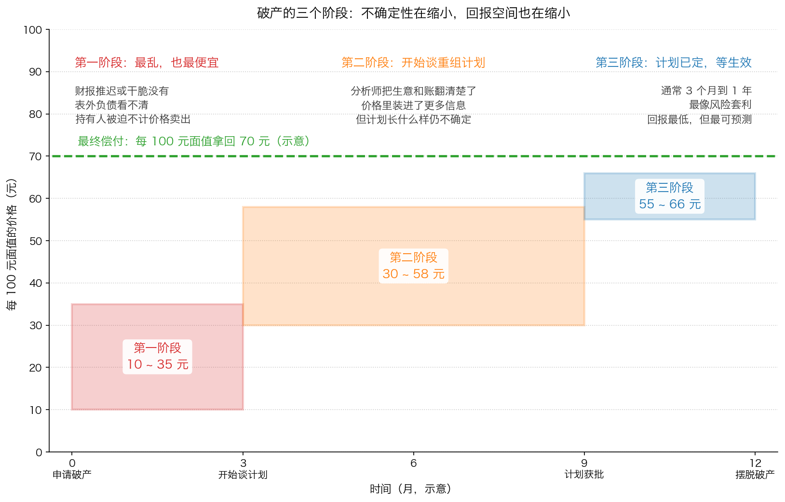

# 第 2 章：破产的三个阶段

> 本章你将：
> - 知道破产投资为什么在专业圈子里被称为"自带催化剂"的生意（接 Week 10 的催化剂那一节）
> - 看懂破产不是一个"事件"，而是一个**有两三年长的过程**
> - 分清这个过程的三个阶段，以及每个阶段**你能知道多少**、**价格长什么样**
> - 学会用"对了赚几倍、错了亏几成"这两个数字，判断一个阶段值不值得进场
> - 亲手算一遍：同样的债券、同样的结局，在三个阶段买入，结果差多少
> - 回答"这对我的钱包意味着什么"：**决定回报的是价格，不是"我是在第几阶段买的"**

上一章我们讲了公司怎么一步步走到付不出钱，以及破产申请那一刻到底关上了哪扇门。这一章要往后看：**从申请破产到摆脱破产，中间那两三年里到底发生了什么。** 这一节是原书第十二章里最实用的一段，因为它给了你一张**时间地图**。

---

## 2.1 破产投资为什么诱人：四个结构性优点

原书在讲三个阶段之前，先列了破产投资的四个好处（p211–p212）。这四个好处和"公司质地好不好"无关，它们是**制度本身带来的**。

**优点一：权利归属出奇地清楚。**

这是原书认为最明显的区别（p211）：

> "一个明显的区别就是，在破产企业中，一名投资者可以相对肯定地知道哪些东西归谁所有。在破产中，应该由法院来决定该如何处理有效的权利主张：资产分配将由债务的所有者来决定，这些人将与股东一起直接获得资产，或者获得重组后债务人所发行的新证券，后者更加普遍。"（p211）

这句话值得停一下。在正常公司里，"这家公司到底值多少钱、这笔钱该怎么分"永远是模糊的——管理层说了算、大股东说了算、会计师说了算。**而在破产程序里，法院会强制把这件事排出一个顺序。** 模糊的地方从"谁说了算"变成了"资产值多少"，这反而是一个更可分析的问题。

**优点二：自带催化剂。**

这一条直接接上了 Week 10 的那一节。我们在 Week 10 讲过，一笔便宜的投资如果没有任何"让价格向价值靠拢"的事件，你可能要等很多年。而破产天然带一个终点（p211）：

> "在第十章中曾提到，破产投资的诱人特征之一就是重组过程能成为实现潜在价值的催化剂。一只低估的股票可能永远维持便宜的价格，对一只诱人的债券的投资可能只有持有至遥远的到期日之后才能获得支付，但一家破产企业往往会在受到破产保护法的两三年内进行重组。"（p211）

摆脱破产之后，债权人"往往会将自己原来的权利交换成重组后债务人的现金、新债券和股票等的组合"（p211）。

> 💡 **换个说法：** 普通股票的催化剂是**可遇不可求**的——你不知道大股东什么时候才会分拆、什么时候才会卖公司。但破产的催化剂是**写在法律程序里的**：它有法定的时间表，会开庭，会表决，会有结果。**它不是"可能发生"，而是"什么时候发生"。**

**优点三：流动性会变好。**

原书说（p212）："摆脱破产也能增加权利主张人所持债务的流动性。持有小规模、没有流动性的商业索赔或者大规模银行债务的所有者会看到自己所持有的这些债务的流动性大幅增加。"原因很直白：**重组之后，你手里的东西从"一份没人认识的债权"变成了"现金、流通债券和股票"。**

**优点四：和大盘脱钩。**

这大概是四个优点里最被低估的一条（p212）：

> "破产投资的另外一个诱人之处就是，破产债券对股市或者债市的波动非常不敏感，尤其是那些高等级债券。对破产证券的投资有点像风险套利投资，这些证券的价格波动与重组进程有关，与整个市场走势无关。"（p212）

> 📌 **划重点：** 把这句话翻成大白话——**它的价格由"谈得怎么样"决定，不由"大盘涨跌"决定。** 这也是 Week 8 讲"绝对表现"和 Week 10 讲"风险套利"的延续：一笔投资的涨跌，如果能由一件**你自己能跟踪的具体事情**决定，它就比"跟着大盘漂"要可控得多。

---

## 2.2 三个阶段：一张时间地图

这三个阶段是共同系列基金（Mutual Series）的迈克尔·普莱斯提出来的，原书把它记了下来（p212–p213）。我们一段一段看。

### 第一阶段：申请破产之后——最乱，也最便宜

原书对这一阶段的描述是（p212）：

> "第一个阶段，即根据《美国破产法》第十一章规定申请破产之后，这一阶段的不确定性最高，但也许也是投资者机会最多的一个阶段。"（p212）

为什么机会最多？因为**信息最少，而被迫卖出的人最多**。原书列了两组原因：

**信息方面**（p212）："债务人的财政状况一片混乱，财务报告推迟公布或者根本未能公布，无法马上看到表外负债，同时主营业务也可能出现了波动。"

**交易方面**（p212）："债务人的证券在市场上的表现也是混乱一片，许多持有人被迫不计价格地卖出所持有的这些证券。"

把这两句连起来看，你就明白了为什么这里最便宜：**一边是没人知道自己到底买了什么（信息为零），另一边是有人在不管价格地往外扔（供给暴增）。**

> 💡 **换个说法：** 第一阶段的卖家不是"觉得不值这个价所以卖"，而是"**必须卖**"——基金被赎回、银行要核销坏账、受托人按规则清仓。他们的卖出和价格无关。凡是遇到"卖方不看价格"的场合，你都应该停下来看一眼。

### 第二阶段：谈重组计划——信息变多，价格跟上

原书说（p212–p213）：

> "破产的第二个阶段是就重组计划进行谈判的阶段，可能会在递交破产申请的几个月或者几年后开始。到那时，分析师可能已经对债务人的业务和财政状况进行了详细的研究。对债务人的情况了解越多，证券价格就能体现更多可以获得的信息。然而，最终将公布怎样的重组计划依然存在巨大的不确定性。依然需要解决不同级别债权人的利益问题。"（p212–p213）

注意这里的两个转折。

**第一个转折是好的**：信息变多了。财务报表补齐了、资产被评估了、分析师写了报告。**价格开始反映"这家公司实际值多少钱"。**

**第二个转折是坏的**：**"怎么分"这件事还没有定。** 而"怎么分"恰恰是你最关心的——因为同样一块 10 亿元的馅饼，你排在第三位拿到的，可能只有排在第一位的人的三分之一。这就是下一章（第 3 章）要解决的核心问题。

### 第三阶段：计划已定，等待生效——最像风险套利

原书说（p213）：

> "破产的第三个阶段，也就是最后一个阶段，是指重组计划的结束和债务人摆脱破产期间的这一段时期。除非重组计划引起了争论，遭到一个或者多个级别的债权人的反对，或者因未能满足关键的条件而失败，否则这一阶段通常耗时3个月至1年。尽管时间框架和法律程序存在不确定性，但最后一个阶段最接近于风险套利投资。"（p213）

**为什么它"最像风险套利"？** 因为到这一步，方案已经公布，剩下的只是"能不能按期执行"。你赚的钱不再是"公司值多少钱"，而是"从今天的价格到方案里写明的支付，中间差多少"。这就和 Week 10 讲的风险套利一模一样：**收益主要来自价差，风险主要来自方案崩掉。**

原书对三个阶段的总结只有三句话，但每一句都很有分量（p213）：

> "破产的每一个阶段都为投资者提供了不同的机会。最好的便宜货出现在了充满不确定性和高风险的第一阶段。重组计划公开后的第三个阶段可以提供最低但最可预测的回报。"（p213）

这张图里的数字**是简化示意图，用于教学**，不是任何一只真实债券的报价。但它的**形状**是真实的，而且你要盯住三件事：

1. **带子越往右越窄**——价格区间在收窄，因为不确定性在减少；
2. **带子的上沿越来越贴近最终偿付的 70 元**——能赚的空间在缩小；
3. **带子的下沿也在往上抬**——但注意，这个"往上抬"并不是安全，后面马上讲。

---

## 2.3 一个反直觉的地方：越晚买，反而越"脆"

大多数人看到上面那张图，会得出一个结论：**"第一阶段风险大，第三阶段风险小，所以我等第三阶段再买。"**

这个结论**一半对，一半错**。对的那一半是：第三阶段确实更确定。错的那一半是：**"更确定"不等于"更安全"。** 我们把它算出来。

**情境（简化示意数字，用于教学）**：某公司破产，一张面值 100 元的债券。最终的重组方案是每 100 元面值拿到 **70 元**。三个人在不同阶段买入：

| 买家 | 买入阶段 | 买入价格 |
|---|---|---|
| 甲 | 第一阶段 | 20 元 |
| 乙 | 第二阶段 | 45 元 |
| 丙 | 第三阶段 | 62 元 |

**如果方案兑现（每 100 元面值拿回 70 元）：**

| 买家 | 买入价 | 拿回 | 赚了 | 回报率 | 相当于 |
|---|---|---|---|---|---|
| 甲 | 20 元 | 70 元 | 50 元 | 250% | 3.5 倍 |
| 乙 | 45 元 | 70 元 | 25 元 | 55.6% | 1.56 倍 |
| 丙 | 62 元 | 70 元 | 8 元 | 12.9% | 1.13 倍 |

**如果方案失败，走到清算（每 100 元面值只拿回 5 元）：**

| 买家 | 买入价 | 拿回 | 亏了 | 亏损比例 |
|---|---|---|---|---|
| 甲 | 20 元 | 5 元 | 15 元 | **75%** |
| 乙 | 45 元 | 5 元 | 40 元 | **88.9%** |
| 丙 | 62 元 | 5 元 | 57 元 | **91.9%** |

看出问题了吗？**丙看起来最"稳"，但一旦判断错了，他亏得最惨。**

**为什么会这样？** 因为丙付的价格最接近最终偿付值，**他为自己留的容错空间最小**——债权的上限就是 70 元，他付了 62 元，等于"赌对了最多赚 8 元，赌错了亏 57 元"。这就是 Week 7 讲安全边际时那句"安全边际总是依赖于所支付的价格"在困境证券上的样子。

> ⚠️ **易踩坑：** 很多人把"确定性高"和"风险低"当成同义词。在困境证券里，这两件事完全分开了：
> - **确定性**说的是"结果的可预测程度"；
> - **风险**说的是"如果我预测错了，会亏多少"。
>
> 第三阶段的确定性最高，但**性价比**可能最差。第二阶段往往才是老手真正下手的地方——**因为那时候信息已经比较清楚，而价格还没完全跟上。**

---

## 2.4 三个阶段在中国的样子

中国的破产程序写在《企业破产法》里，具体流程和美国"第十一章"不同，但**阶段感是一样的**。下面这张表把你会在公告里看到的词，对应到三个阶段上：

| 阶段 | A 股会看到的公告/事件 | 港股会看到的公告/事件 | 这一阶段的价格特征 |
|---|---|---|---|
| **第一阶段** | 债权人向法院**申请重整**；法院**裁定受理**；股票停牌、复牌后被实施退市风险警示（`*ST`）；债权申报开始 | 债权人向法院提交**清盘呈请**；公司公告"呈请"；可能申请**临时清盘人** | 消息冲击最大，抛压最重，价格区间最宽 |
| **第二阶段** | **重整计划草案**公布；**债权分组表决**；**出资人权益调整方案**（转增股本、股东让渡股份）；招募重整投资人 | **债务重组方案**（交换要约）与债权人委员会谈判；**协议安排**（scheme of arrangement）提交法院 | 信息快速补充，价格开始反映"资产值多少"，但"怎么分"未定 |
| **第三阶段** | 法院**裁定批准重整计划**；**终止重整程序**；执行完毕公告；股票复牌 | 法院**批准协议安排**；重组生效；新证券发行 | 价差收窄，最像风险套利，回报低但可预测 |

> 🇨🇳 **落到 A 股/港股：** 这里必须说一件泼冷水的事。**原书讲的"买破产债券"，普通中国投资者几乎做不到。** 银行间市场的债券、交易所的机构固收品种，都有合格投资者门槛；你真正能买到的，多半是**股票**。而在破产程序里，**普通股永远排在最后一个**。原书对这件事的态度非常强硬（p218）：

> "投资者应当将以任何价格回避这类股票看成是一项规则，这类股票的风险巨大，且回报很不确定。"（p218）

为什么？因为正如我们算过的：**债券有面值和偿付上限可以估算，股票没有上限——但也几乎没有下限。** 债券持有人在最坏情况下还能从资产里分到一点，普通股股东要等**所有** creditors 都拿满了才轮到自己，而在重整案里，这几乎从不发生。

所以，这一章对你真正的用处不是"去抄底重整股"，而是三件事：

1. **看懂重整公告的阶段**——你就知道市场现在到底在为什么定价（是恐慌？是信息？还是方案执行？）；
2. **明白"重整概念股"的炒作结构**——被炒的往往是第三阶段之前的**预期**，而预期的另一面是"出资人权益调整"里股东被让渡股份；
3. **学会用"对了赚几倍、错了亏几成"这两个数字去过滤任何一笔投资**——这个方法不只用在困境证券上，用在成长股、周期股、可转债上一样成立。

---

## ✍️ 想一想

1. 原书说破产投资的一个优点是"破产债券对股市或者债市的波动非常不敏感"。请你解释：**为什么会这样？** 这对一个怕看盘的投资者来说，是优点还是缺点？
2. 用本章的三个阶段对照你熟悉的某一个行业（不必是破产，也可以是"某家公司出了大事"）。请说出：哪一段时间相当于第一阶段？哪一段时间是第二阶段？你从什么公开信息上能看出它进入了下一阶段？
3. 假设你的朋友在第三阶段以 62 元买入一张面值 100 元、方案写明偿付 70 元的债券，并说"这笔很稳，最多赚少一点"。请你用**两个数字**反驳或支持他。

> 💡 **参考思路：**
> 1. **为什么脱钩**：因为它的价格主要由**重组进程**决定——谈得怎么样、方案里给你多少、什么时候生效——这些事和大盘指数没有关系。大盘涨 20%，一份"每 100 元面值偿付 70 元"的方案也不会变成 90 元。**对怕看盘的投资者来说，这显然是优点**：你不需要每天关心市场情绪，只需要跟踪法院公告和方案进展。但要注意一个**反面的代价**：正因为和大盘脱钩，**它也没法靠"大盘回暖"来救你**。如果方案崩了，市场再好也帮不上忙。
> 2. 关键是把"信息转折点"找出来。以一家出了大事的公司为例：**第一阶段**是坏消息刚爆出来、财报延期、评级下调、股价连续跌停、公告"正在核实"的那几周——这段的特征是"**没人知道发生了什么**"；**第二阶段**是第一份完整的说明公告、审计报告、或者重组框架出来之后——特征是"**知道问题多大了，但不知道谁来承担**"；**第三阶段**是方案公布、债权人会议召开、法院批准——特征是"**只剩执行**"。你能看到的信号是：**公告的内容从"发生了什么"变成"我们打算怎么办"，最后变成"我们什么时候做完"。**
> 3. 两个数字：**对了赚 12.9%**（8 除以 62），**错了亏 91.9%**（57 除以 62）。也就是说，你为了一个不到 13% 的收益，去承担了一个接近"全部亏光"的风险。这笔账在任何标准下都不划算。**除非**你能证明"清算时每 100 元面值能拿回 55 元以上"（那样亏损就有限），否则这笔投资的形状本身就是错的。**评价一笔投资不能只看"我觉得它会不会成"，还要看"万一不成，我损失多少"——这就是对称性。**

---

## 🧮 算一算

这一题是本周第二重要的练习。它的数字**全部是简化示意数字，用于教学**。

**情境。** 一家公司已经进入破产重整。它有一张**面值 100 元**的债券。所有人估计，最终的重组方案会给每 100 元面值偿付 **70 元**（可能是现金加新证券的组合）。

三个投资者在不同阶段买入：

| 买家 | 买入阶段 | 买入价格 |
|---|---|---|
| 甲 | 第一阶段（刚申请破产） | 20 元 |
| 乙 | 第二阶段（正在谈方案） | 45 元 |
| 丙 | 第三阶段（方案已公布） | 62 元 |

### 第一问：如果方案兑现，三人各赚多少？

**分步解答。**

甲，先算赚到的钱：

$$70 - 20 = 50 元$$

再算相对于买入价的比例：

$$50 \div 20 = 2.5 = 250\%$$

乙：

$$70 - 45 = 25 元$$

$$25 \div 45 = 0.556 = 55.6\%$$

丙：

$$70 - 62 = 8 元$$

$$8 \div 62 = 0.129 = 12.9\%$$

**答案：甲赚 250%（本金变成 3.5 倍），乙赚 55.6%（1.56 倍），丙赚 12.9%（1.13 倍）。**

> 💡 顺便换个角度看"本金变成几倍"：甲是 $70 \div 20 = 3.5$ 倍，乙是 $70 \div 45 = 1.56$ 倍，丙是 $70 \div 62 = 1.13$ 倍。**如果这两年银行定期存款大约能让本金变成 1.05 倍，那么丙承担的"可能全损"的风险，只换来了比存款多一点点的回报。**

### 第二问：如果方案失败，走到清算，每 100 元面值只拿回 5 元呢？

**分步解答。**

甲亏的钱：

$$20 - 5 = 15 元$$

$$15 \div 20 = 0.75 = 75\%$$

乙亏的钱：

$$45 - 5 = 40 元$$

$$40 \div 45 = 0.889 = 88.9\%$$

丙亏的钱：

$$62 - 5 = 57 元$$

$$57 \div 62 = 0.919 = 91.9\%$$

**答案：甲亏 75%，乙亏 88.9%，丙亏 91.9%。**

### 第三问：把两个结局放在一起看，谁的投资"形状"最好？

把两个结局并排：

| 买家 | 买入价 | 方案兑现 | 走到清算 |
|---|---|---|---|
| 甲 | 20 元 | **赚 250%** | 亏 75% |
| 乙 | 45 元 | 赚 55.6% | 亏 88.9% |
| 丙 | 62 元 | 赚 12.9% | **亏 91.9%** |

**结论：丙这笔投资是不划算的。** 他赚的时候只赚 12.9%，亏的时候亏 91.9%——**赢面小、输面大，形状本身就是错的。**

乙稍微好一点，但赚 55.6% 对亏 88.9%，也不够吸引人。

只有甲的形状说得过去：赚 250% 对亏 75%。**但甲付出的代价是：他是在"什么都不知道"的时候买的**（第一阶段，财报没有、表外负债看不清、主营业务还在波动）。

> 📌 **划重点：** 所以正确的结论**不是**"越早买越赚"（那只是这一组数字碰巧如此）。正确的结论是：**你要为每一个百分点的不确定性，收到足够的报酬。** 第一阶段的不确定性最大，所以只有在**价格足够低**的时候才值得买。如果第一阶段那张债券已经从 20 元涨到 55 元，那它就不再是"第一阶段的便宜货"，它只是一张贵的债券。

### 第四问：验算上面那句话

**情境。** 消息传开之后，很多人在抢这张债券。价格从 20 元涨到了 **55 元**。你在这个时候买入。

**问题：** ① 如果方案兑现（拿回 70 元），你赚多少？② 如果走到清算（拿回 5 元），你亏多少？③ 和丙比，你承担的风险更大还是更小？

**分步解答。**

第一步，兑现时的收益：

$$70 - 55 = 15 元$$

$$15 \div 55 = 0.273 = 27.3\%$$

第二步，清算时的亏损：

$$55 - 5 = 50 元$$

$$50 \div 55 = 0.909 = 90.9\%$$

第三步，对比。

$$你的 27.3\% 对 90.9\%；丙的 12.9\% 对 91.9\%$$

**答案：① 赚 27.3%；② 亏 90.9%；③ 你的风险比丙略小一点点（90.9% 对 91.9%），但你依然是在承担"几乎全损"的风险，去换不到三成的收益。**

**这一问的意义是：** 你是在第一阶段买的，但你拿到的**形状**和第三阶段的丙几乎一样差。**这说明真正决定一笔投资好坏的，从来不是"我在第几阶段"，而是"我付了多少钱"。** 阶段只是帮你判断"我现在知道多少"，价格才决定"我值不值得下注"。

---

## ✅ 小测验

**1. 原书说破产投资的哪个优点，让它和"永远便宜但永远不涨"的低估股票区别开来？**
A. 破产债券的利息更高
B. 重组过程本身就是一个实现价值的催化剂，而且通常在两三年内完成
C. 破产企业的资产一定比正常企业值钱
D. 破产债券不会亏钱

**2. 关于破产投资的三个阶段，下面哪种说法最符合原书？**
A. 第一阶段最安全，第三阶段风险最大
B. 第一阶段的确定性最高，但机会最少
C. 第一阶段的不确定性最高、机会也许最多；第三阶段的回报最低，但最可预测
D. 三个阶段的风险和回报完全一样，区别只在时间长短

**3. 原书对"破产企业的普通股"是什么态度？**
A. 只要价格足够低就可以买
B. 应当把"以任何价格回避这类股票"看成一项规则，因为风险巨大、回报很不确定
C. 破产企业的普通股总是最安全的，因为下跌空间已经有限
D. 普通股和债券在破产中的受偿顺序是一样的

> **答案与解析**
>
> **1. B。** 原书 p211 说得很清楚："一只低估的股票可能永远维持便宜的价格……但一家破产企业往往会在受到破产保护法的两三年内进行重组。"（p211）这正是 Week 10 讲的"催化剂"概念在破产场景里的体现。A 错在破产债券往往**停止付息**，根本谈不上"利息更高"；C 错在原书明确说许多破产企业"仍在继续经营"（p205），但资产是否值钱要一家一家评估；D 错在破产债券可能被"彻底摧毁"（p213）。
> **2. C。** 这三句话几乎逐字对应原书 p212–p213。A 把顺序完全说反了——第三阶段恰恰是"最接近于风险套利投资""最可预测"的；B 错在"确定性最高"用错了地方，第一阶段是"不确定性最高"，也正因为如此才"也许也是投资者机会最多的一个阶段"；D 错在原书明确说"破产的每一个阶段都为投资者提供了不同的机会"（p213），机会的性质是不同的，不是只有时间长短的差别。
> **3. B。** 原书 p218 的原话是"投资者应当将以任何价格回避这类股票看成是一项规则，这类股票的风险巨大，且回报很不确定"（p218），并且说它们"交易价格常常大幅高于经常接近于零的重组价值"（p218）。A 错在"以任何价格回避"这句话已经排除了"价格足够低就买"；C 错在它恰恰**没有**下跌空间有限这一说，真正的风险是价值接近于零而价格还很高；D 错在受偿顺序完全不同——普通股排在所有债权人之后，是最后一个。

---

## 📖 回到原书

- 对应原书 **第十二章** 的"破产投资的诱人之处"和"破产投资的三个阶段"两节，`raw/安全边际-中文版/page_211.md` ~ `page_213.md`（原书 p211–p213）。
- 建议精读：**p212**（"被迫不计价格地卖出"那一段，和第一阶段的完整描述），**p213**（三个阶段的总结那三句话）。
- 可以略读：**p211 关于 Michael Price 和共同系列基金的背景介绍**（记住"三个阶段是他总结出来的"就够了，人名和机构名不需要背）。
- 原书金句（**逐字引用**）：
  > "一个明显的区别就是，在破产企业中，一名投资者可以相对肯定地知道哪些东西归谁所有。"（p211）
  >
  > "一只低估的股票可能永远维持便宜的价格，对一只诱人的债券的投资可能只有持有至遥远的到期日之后才能获得支付，但一家破产企业往往会在受到破产保护法的两三年内进行重组。"（p211）
  >
  > "破产投资的另外一个诱人之处就是，破产债券对股市或者债市的波动非常不敏感，尤其是那些高等级债券。"（p212）
  >
  > "对破产证券的投资有点像风险套利投资，这些证券的价格波动与重组进程有关，与整个市场走势无关。"（p212）
  >
  > "债务人的证券在市场上的表现也是混乱一片，许多持有人被迫不计价格地卖出所持有的这些证券。"（p212）
  >
  > "破产的每一个阶段都为投资者提供了不同的机会。"（p213）
  >
  > "最好的便宜货出现在了充满不确定性和高风险的第一阶段。"（p213）
  >
  > "重组计划公开后的第三个阶段可以提供最低但最可预测的回报。"（p213）

到这里，我们已经知道"什么时候买"。但还缺最关键的一环：**到底该出多少钱？** 下一章是本周的核心——我们要把"这家公司可能落到哪几种下场、每种下场我能拿回多少"变成一张能拿纸笔算出来的表。
