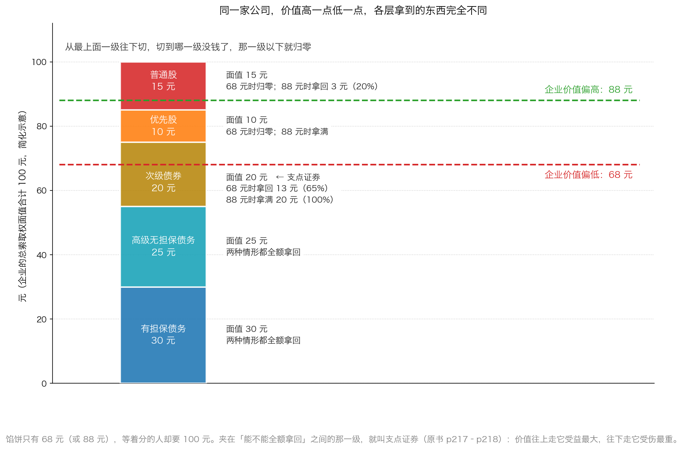
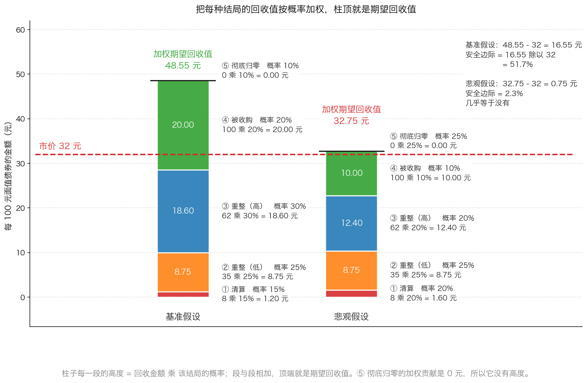

# 第 3 章：困境证券的风险与定价

> 本章你将：
> - 明白为什么 Week 9 学的"算未来现金流折现"在这里**完全用不上**，以及该换成什么问法
> - 学会一个初中数学就能做完的定价方法：**列出几种结局 → 各自能拿回多少 → 各有多大可能 → 加权**
> - 认识"**回收值**"和"**加权期望回收值**"这两个词，并能自己算出来
> - 看懂资本结构的"分钱瀑布"，并能在里面找出**支点证券**在哪一级
> - 亲手把一张五种结局、五种概率的表**从头算到尾**，再用它反推出"我最多能出多少钱"
> - 回答"这对我的钱包意味着什么"：**困境证券的定价不是算命，是把"我会怎么错"写成数字**

前两章讲了"什么时候买"和"买什么阶段"。这一章是本周的核心，只解决一个问题：**到底该出多少钱。**

---

## 3.1 为什么 Week 9 学的估值方法，在这里全部失灵

Week 9 我们学了三种给公司估值的方法：**现值分析**（预测未来现金流，再折回今天）、**清算价值**（今天关门卖资产还剩多少）、**股市价值法**（拿可比公司来比）。

拿到一家困境公司面前，前两种都会立刻卡住。

**为什么"现值分析"卡住。** 现值分析需要两个输入：**未来的现金流**和**贴现率**。而困境公司这两样都给不了你。未来的现金流？原书说得很直接："因债务人的业务不稳定，有时甚至一片混乱，投资者在分析这种飘忽不定的目标时遇到了困难。"（p216）更狠的是这一句：

> "当一家企业的现金甚至在支付利息之前就因业务经营而减少时，这样的企业经常会加速消耗现金，尤其是如果这家公司使用了高杠杆。如果转机并没有马上出现，那么这家企业可能永远也不会迎来转机。"（p215）

**"可能永远也不会迎来转机"**——这就是为什么你不能用"假设它明年会好转"来做估值。这不是保守不保守的问题，是这个假设本身没有依据。

贴现率也给不了。为什么？因为**时间长度不确定**。原书有一条极重要的提醒：

> "回报率对时间点的选择有着很强的依赖性。"（p213–p214）

同样是"每 100 元面值最终拿回 70 元"，等 1 年和等 5 年，年化回报天差地别。而破产程序要走多久，在第一天是没人知道的。

**为什么"清算价值"也不够。** 清算价值只在"真的清算"这一种结局下才有意义。但困境公司最常见的结局不是清算，而是**重整**——公司继续经营，你拿到的是现金加新债券加新股票的组合。这时候决定你拿多少的，不是"资产能卖多少钱"，而是"**谈成什么样**"。原书对此的判断是：

> "应当记住，结构调整和破产重组都是进行谈判的过程。"（p218）

所以，你需要一个**能同时容纳"清算、重整、被收购、归零"这几种完全不同结局**的估值工具。

> 📌 **划重点：** 别把这件事理解成"困境证券更难估值"。恰恰相反——**它把估值问题换成了一个更容易算的问题。** 正常公司你要预测十年现金流；困境公司你只要列几种结局、估几个百分比。**难点不在数学，在于你得诚实地把"最坏情况"写下来。**

---

## 3.2 换一个问法：从"它能赚多少"改成"各种下场我能剩多少"

先给一个生活类比，把思路掰过来。

**你家那辆车撞了，你要把它卖掉。你怎么定价？**

你不会去查"这款车新车指导价多少"，也不会认真算"它未来还能陪我跑多少公里"。你会做三件事：

1. **估资产**：这车现在还有什么值钱的？（发动机没坏、轮胎是新的、变速箱报废了）
2. **列结局**：它可能落到哪几种下场？（有人买去修好了自用、有人买去拆零件、没人要只能当废铁）
3. **估概率**：每种下场各有多大可能？（以现在这个车况，大概五成人愿意修、三成人只肯拆件、两成人看都不看）

然后你心里会浮出一个数字：**"这车我大概能卖 3 万。"** 这个 3 万不是任何单一结局的价格，它是**几种结局按可能性摊平之后的结果**。

困境证券的定价，用的就是这套思路。专业上管"某一种结局下你能拿回来的钱"叫**回收值**（英文 recovery value），通常按"**每 100 元面值能拿回几元**"来说。而把各种结局的回收值**乘上概率再加起来**，得到的就是**加权期望回收值**。

> 💡 **换个说法：** 普通估值问的是"**这家公司未来能赚多少钱**"。困境证券定价问的是"**这家公司落到每种下场时，我这张纸还能换回多少**"。前一个问题需要你预测未来，后一个问题只需要你**把可能性列全**。

---

## 3.3 四步定价法

原书没有把方法写成"四步"，但它的叙述顺序非常清楚。我们把 p215–p219 的内容整理成四步。

### 第一步：算出这块馅饼有多大

原书的原话是（p215）：

> "只有知道了一块馅饼的大小，才有可能考虑这块馅饼可能会被如何分割。"（p215）

而且要"将精力集中在企业的资产负债表上"（p215）。原书给了一条很形象的理由：

> "就像在棒球比赛中知道对方的队形一样，对一家公司负债的总额以及各项负债的优先等级的了解能告诉投资者许多事情，不仅可以从中知道各种证券的持有者会受到怎样的待遇，也能知道可能会用何种方法解决财政困境。"（p215）

具体怎么估？原书要求把资产分成两堆（p215–p216）：

| 哪一堆 | 里面是什么 | 用来干什么 |
|---|---|---|
| **维持业务所需的资产** | 厂房、设备、品牌、必须的营运资金 | 支撑"公司继续经营"这个假设 |
| **可用于在重组中分配给债权人的资产** | 剩余现金、待售资产、证券投资 | 这才是真正能被"分掉"的部分 |

原书举了两个例子（p216）：拥有 Am International 公司高等级债权的投资者，在重组中获得了该公司**大量的剩余现金**；而投资 1983 年 Braniff Airlines 公司第一次破产的投资者，获得的是**清算信托凭证**——这些凭证"直接受飞机资产所支持"。

而且，光看资产负债表还不够。原书提醒有两类东西藏在表外（p216–p217）：

- **表外资产**："以低于当前价值记账的房地产资产、一项资金过剩的养老金计划、企业所拥有的专利权以及类似的资产"；
- **表外负债**："资金不足的养老金计划，对美国国税局、环境保护局和养老金担保公司（PBGC）等的负债，以及因拒绝执行待执行合约和租赁合约而产生的负债等"。

> 🇨🇳 **落到 A 股/港股：** "表外"这两个字在中国的困境公司身上尤其重要。你在年报附注里要专门找四样东西：**对外担保**（替别人借的钱，别人还不上就轮到你）、**未决诉讼**（败诉要赔多少）、**应收账款和存货的构成**（账上记 10 亿，实际能收回多少）、以及**受限资金**（货币资金里有很大一块可能被冻结或质押，动不了）。这四样决定了"馅饼"的真实尺寸。

### 第二步：把索取权按等级排好队

馅饼算出来了，接下来看谁先吃。原书说得很清楚（p217）：**"最好根据债权等级从高至低的顺序来评估一家破产企业的负债。"**

顺序大体是这样（越靠前越安全）：

| 顺序 | 名称 | 一句话解释 |
|---|---|---|
| 1 | **有担保债务** | 借条背后押了具体资产。还不上就卖押品还你 |
| 2 | **高级无担保债务** | 只凭公司信用借的钱，但在无担保里排前面 |
| 3 | **次级债务** | 无担保里排在后面的那一档 |
| 4 | **优先股** | 介于债和普通股之间，分红优先，但没有强制力 |
| 5 | **普通股** | 所有债务都付清了才轮到它 |

原书对有担保债务给了一个技术性但很重要的说明（p217）：如果担保权益的价值相当于或高于债务的价值，这份债务就叫"**全额担保**"或者"**超额担保**"；而一份**超额担保**的债务，"让持有人的待付利息（指破产过程中产生的利息）达到同超额担保权益一样的价值"。反过来，"如果担保债务没有得到全额担保，那么持有人往往会获得一份相当于担保权益价值的债务，以及一份相当于担保权益不足部分的高等级但无担保债务"。

**而这里面最值得你花时间找的，是"支点证券"**（p217–p218）：

> "支点证券（fulcrum securities）"——指资产价值只覆盖了**部分**价值的证券。

原书接着解释了它的两面性（p218）：

> "支点证券将从价值增加中获得最大的利益，同样，价值的下降会带来最严重的伤害。"（p218）

这张图要看懂三件事：

1. **从下往上切**：企业价值从最底下开始填，填满一层再填上一层；**切到哪一层没钱了，那一层以上全部归零**；
2. **支点证券就是"骑在切线上"的那一层**：企业价值 68 元时，有担保（30）和高级无担保（25）都拿满，次级债券只分到剩下的 13 元（面值 20 元，拿回 65%），优先股和普通股一分钱没有；
3. **企业价值只要往上走到 88 元**，同样的次级债券就从 65% 变成 100%，而普通股从 0 变成 20%。**同一家公司，价值变动 20 元，各层的命运完全不同。**

> 📌 **划重点：** 原书对新手的建议是"风险厌恶型投资者往往更喜欢持有高等级证券，高等级证券的潜在回报常常低于次级证券，但风险也更低"（p217）；而**次级证券"不大可能获得大量的价值，除非这些证券得到了全额支付或者近似全额的支付"**（p217）。翻成大白话：**你买的那一档，必须离"切线"足够远，或者价格足够低。**

### 第三步：列出结局、回收比例和概率，加权算期望值

这是本章的核心动作。你需要列一张表，四列：

| 结局 | 概率 | 这个结局下每 100 元面值能拿回多少 | 加权贡献 |
|---|---|---|---|
| ① …… | ……% | …… 元 | 概率 乘 回收 |
| ② …… | ……% | …… 元 | 概率 乘 回收 |
| …… | …… | …… | …… |
| **合计** | **100%** | —— | **加权期望回收值** |

然后：

$$加权期望回收值 = 每种结局的回收金额 \times 该结局的概率，再全部相加$$

这张图是本章最重要的一张。它把"加权"这件事**画成了高度**：柱子的每一段 = 回收金额 乘 概率；段与段加起来；**柱子的顶端就落在加权期望回收值上**。

于是判断变得非常简单：

- **柱顶明显高于市价那条红线** → 这笔投资有安全边际；
- **柱顶几乎贴在红线上** → 安全边际几乎没有，你只是在赌自己的假设全对；
- **柱顶低于红线** → 你在为一个"平均来看不划算"的东西付钱。

### 第四步：和市价比较，留出安全边际

得到了期望回收值，剩下的就是 Week 7 学过的老规矩：**买价要明显低于你保守估算的价值。**

原文没有给出"打几折"的标准，但逻辑是现成的：**你估的回收值和概率都可能错，所以你需要垫子。** 下一节的「算一算」里，我们会用"**要求 30% 的安全边际**"这条纪律，反过来推算出"我最多能出多少钱"。

---

## 3.4 风险清单：五个会让你亏大钱的地方

方法讲完了，现在讲坑。原书在 p213–p219 里列了一串风险，我们整理成五条。

**风险一：时间会吃掉你的回报。**

这是最容易被忽略、也最致命的一条。原书说："回报率对时间点的选择有着很强的依赖性。"（p213–p214）原书还指出一个特别有意思的现象：在企业申请破产之后，那些"无担保但'全额保障'的权利主张"**实际上变成了零息债券**——你最终会按票面拿回钱，但中间一分利息都没有，你的回报率"**视破产的持续时间而定**"（p214）。

> 💡 **换个说法：** 一张"最终肯定能按 100 元偿付、但现在卖 60 元"的债券，如果 1 年后兑付，你赚 67%；如果 5 年后才兑付，你的钱被锁了 5 年只赚 40 元，年均回报还不到 7%——**比一份稳妥的理财好不到哪里去，却承担了 5 年的不确定性。** 所以原书说："为了获得相同的回报率，预期这将是一个漫长破产过程的一名投资者自然而然会较一名乐观的投资者支付更低的价格。"（p214）

**风险二：这是一个没有流动性的市场。**

原书这段话你必须读两遍：

> "问题证券和破产证券的市场缺乏流动性，交易员可以玩弄那些没有经验的投资者。报价可能与实际的交易水平没有多大的关系，一名不了解情况的买家可能会支付非常高的价格。"（p213）

为什么？因为原书说得很真实——"在多数买家都是经验丰富的投资者的市场中，普通投资者必须牢记'谨慎'二字"（p213）。**你的对手是专门做这个的机构，他们每天都在这个市场里，而你可能一年才来一次。** 更妙的是原书那句总结（p215）：

> "在缺乏流动性的问题债券和破产债券市场中，有时成为一名聪明的投资者可能会比成为一名聪明的分析师更加重要。"（p215）

——意思是：**在这个市场里，"知道该问谁报价、知道该不该相信这个报价"，比"算得准"更值钱。**

**风险三：业务可能在你持有期间继续恶化。**

原书专门警告了一件事——**不要被"有资产担保"这四个字骗了**：

> "投资者应当对购买或者持有业务快速恶化的企业的固定收益类证券保持警惕。很容易只看到一种债券中显而易见的资产担保，而忽视这家企业的盈利或者现金流中的问题。"（p214）

原书把最坏的情形写得很直白："如果转机并没有马上出现，那么这家企业可能永远不会迎来转机。"（p215）

**风险四：破产企业的普通股，常常贵得离谱。**

这一条反直觉，但极其重要。原书说：

> "破产企业普通股的交易价格常常大幅高于经常接近于零的重组价值。"（p218）

为什么会这样？因为总有人在赌"重整成功、股价翻倍"，而**他们赌的东西根本不存在**——普通股排在最后一位，重整案里绝大多数情况下值零。原书给出的规则毫不含糊：

> "投资者应当将以任何价格回避这类股票看成是一项规则，这类股票的风险巨大，且回报很不确定。"（p218）

**风险五：结果是谈出来的，不是算出来的。**

原书提醒："应当记住，结构调整和破产重组都是进行谈判的过程。不同级别债权人之间相对强势和弱势的谈判地位、谈判人的技巧以及资金规模等都会影响到这些谈判。"（p218）

原书还讲了一个专业玩家才会用的技巧——**"阻扰地位"**（p218–p219）。在一笔规模小、被集中持有的债务里，只要拿到 1/3，你就有了**否决权**，可以拖延整个重组进程。原书对这个地位的描述是：

> "阻扰地位的所有者能够阻扰（推迟）破产进程，同时能拦截（抢劫）其他级别的债权人，从那些近乎没有价值的权利中获得超付价值。"（p219）

> ⚠️ **易踩坑：** 你作为个人投资者，**既没有阻扰地位，也没有谈判桌**。这意味着：**同一张债券，在别人手里和你手里，实际的回收值可能是不一样的。** 别人能靠"我能拖住你"多拿一点，你只能接受方案。这一点在算期望回收值的时候，应该反映成"把乐观情形的概率调低一点"。

---

## 3.5 落到今天：A 股/港股 里你能碰到的四种形态

原书讲的是美国市场。中国这边的困境证券，主要长成下面四种样子。

**形态一：违约或展期的债券与可转债。** 这几年 A 股已经出现过正股退市、转债到期无法正常兑付的案例，也有大量地产债以"展期""交换要约"的方式重谈条款。普通投资者最容易碰到的是**可转债**——你需要在募集说明书里看清三件事：**回售条款**（满足什么条件你可以要求公司买回）、**转股价格向下修正条款**（公司能不能下调转股价）、**违约与偿债安排**（真出事时按什么顺序还）。

**形态二：ST 股与退市整理期。** 被实施退市风险警示（简称前加 `*ST`）的股票，会面临更严格的交易限制和更少的买家。**这一条请你记住原书那句话：破产企业的普通股常常大幅高于它接近于零的重组价值。** A 股的重整案例里，"出资人权益调整"是常见安排——原有股东让渡一部分股份给债权人。也就是说，**公司活下来了，你的股票可能已经被摊薄了一大截。**

**形态三：破产重整中的各类证券。** 在 A 股的重整流程里，债权人被分成小组表决，重整计划要拿到每个组的多数同意（具体比例以现行法律和计划文本为准）。**你如果持有的是股票，你在"出资人组"，通常是最后一个被照顾的。**

**形态四：港股的清盘呈请与境外债重组。** 港股公告里常见"清盘呈请""临时清盘人""协议安排"这些词。境外债重组通常以"交换要约"形式出现：债权人用旧债换新债、可转债或者股票，往往还要接受本金打折。**这类方案的条款非常复杂，需要专业判断。**

> 🇨🇳 **落到 A 股/港股：** 对绝大多数读者来说，这一章最实际的用法**不是**去买困境证券，而是两件事：
> **第一，用"结局—回收—概率"这张表去审视你手里的一切。** 你买的一只普通股票，也可以用同一张表问自己：乐观情形是什么？中性情形是什么？最坏情形下我剩多少？各多大可能？
> **第二，学会先看资产负债表的最下面一半。** 大多数人看财报从收入看起，这一周之后，请反过来——**先看它欠了谁、欠了多少、什么时候到期、我排在谁后面。**

---

## ✍️ 想一想

1. 用"二手车撞了要卖"的类比，说明为什么困境证券的定价**不需要预测未来现金流**。请把你的类比完整写出来（资产是什么、结局有哪几种、概率怎么估）。
2. 一家公司进入重整。它一共有 100 元的索取权：有担保债务 30 元、高级无担保 25 元、次级债券 20 元、优先股 10 元、普通股 15 元。如果企业的价值只有 40 元，请说出每一层分别能拿回多少。**哪一层是支点证券？** 如果价值涨到 60 元，哪一层的处境改善最大？
3. 原书说"有时成为一名聪明的投资者可能会比成为一名聪明的分析师更加重要"。请你为这句话举一个具体的场景，说明**在这个市场里，"会做人"比"会算账"重要在哪里**。

> 💡 **参考思路：**
> 1. 类比可以这样写：**资产**是一辆撞过的车，发动机好、变速箱报废、轮胎八成新。**结局**有三种：① 有人买去修好自用（能卖 6 万）；② 有人买去拆零件（能卖 2 万）；③ 没人要，当废铁（能卖 5000）。**概率**按车况和行情估：修好自用两成、拆零件五成、废铁三成。于是心里的价就是 $6 \times 0.2 + 2 \times 0.5 + 0.5 \times 0.3 = 1.2 + 1.0 + 0.15 = 2.35$ 万元。**注意：整个过程里，你一次都没有预测"这车明年能跑多少公里"。** 困境证券也是一样——你估的是"它在几种下场里分别值多少"，不是"它未来能赚多少"。
> 2. 企业价值只有 40 元时的分配：**有担保债务**先拿满 30 元（剩 10 元）；**高级无担保债务**面值 25 元，但只剩 10 元，所以拿回 10 元（回收率 40%）；**次级债券、优先股、普通股全部归零**。所以**支点证券是高级无担保债务**——它是唯一"骑在切线上"的那一层。如果价值涨到 60 元：有担保拿满 30，高级无担保拿满 25，**次级债券分到剩下的 5 元（回收率 25%）**，优先股和普通股仍然归零。**改善最大的是次级债券**：从 0 变成 25%。这正好印证原书那句"支点证券将从价值增加中获得最大的利益，同样，价值的下降会带来最严重的伤害"（p218）。**顺便注意一件事：支点证券是会随着价值变化而"换人"的。**
> 3. 场景可以这样想：你算出一张债券的期望回收值是 48 元，市价 32 元，看起来很划算。但你不知道的是——**这个市场里根本没有连续的报价**，你能看到的那个"32 元"可能只是某个交易员随口报的，真正的成交价可能是 45 元；而你要卖的时候，可能根本找不到买家。另一个场景是：**真正能拿到好价钱的机会，往往是通过"认识谁"而不是"算得多准"来的**——原书说的"阻扰地位"就是典型：一群投资者集中买下某个级别的债务，就获得了拖延重组的权力，从而谈到更好的条件（p218–p219）。你没有这个地位，所以**在同样一张债券上，你的实际回收值天然比他们低**。这句话的教训是：**在一个流动性差、玩家都是内行的市场里，"我能拿到什么价"和"它值多少"是两件事。**

---

## 🧮 算一算

**这是本周最重要的练习。** 它只用乘法和加法，但你必须亲手在纸上走一遍。

**情境（简化示意数字，用于教学，不是任何一只真实债券的报价）。**

一家公司已经违约。它有一张**面值 100 元**的债券，现在市场上报价 **32 元**。你研究之后，认为它可能落到五种下场，并给出了各自的回收金额和概率：

| 结局 | 概率 | 每 100 元面值能拿回多少 |
|---|---|---|
| ① 清算，资产贱卖 | 15% | 8 元 |
| ② 破产重整，按低方案 | 25% | 35 元 |
| ③ 破产重整，按高方案 | 30% | 62 元 |
| ④ 被同行收购，全额偿付 | 20% | 100 元 |
| ⑤ 彻底归零 | 10% | 0 元 |

### 第一问：算出加权期望回收值

**第一步：先检查概率加起来是不是 100%。**

$$15\% + 25\% + 30\% + 20\% + 10\% = 100\%$$

**这一步绝对不能跳过。** 概率加起来不是 100%，说明你的假设自相矛盾，后面的计算全部作废。

**第二步：一行一行地乘。**

结局①（清算）：

$$8 \times 15\% = 8 \times 0.15 = 1.20 元$$

结局②（重整低方案）：

$$35 \times 25\% = 35 \times 0.25 = 8.75 元$$

结局③（重整高方案）：

$$62 \times 30\% = 62 \times 0.30 = 18.60 元$$

结局④（被收购，全额偿付）：

$$100 \times 20\% = 100 \times 0.20 = 20.00 元$$

结局⑤（彻底归零）：

$$0 \times 10\% = 0 元$$

**第三步：把五个数加起来。**

$$1.20 + 8.75 + 18.60 + 20.00 + 0 = 48.55 元$$

**完整的表格长这样：**

| 结局 | 概率 | 回收金额 | 加权贡献（回收 乘 概率） |
|---|---|---|---|
| ① 清算 | 15% | 8 元 | 1.20 元 |
| ② 重整（低方案） | 25% | 35 元 | 8.75 元 |
| ③ 重整（高方案） | 30% | 62 元 | 18.60 元 |
| ④ 被同行收购 | 20% | 100 元 | 20.00 元 |
| ⑤ 彻底归零 | 10% | 0 元 | 0.00 元 |
| **合计** | **100%** | —— | **48.55 元** |

**答案：加权期望回收值是每 100 元面值 48.55 元。**

**第四步：和市价比。**

$$48.55 - 32 = 16.55 元$$

$$16.55 \div 32 = 0.517 = 51.7\%$$

**结论：按你自己的假设，这笔投资的安全边际是 51.7%。** 也就是说，即使你的期望回收值估算**错了三分之一**（48.55 变成约 32），你也只是不赚不亏。

### 第二问：换成悲观假设，再算一遍

现在做一件更重要的事：**把你的假设往坏里推一推，看看结论还站不站得住。**

悲观的版本可以这样设：清算的概率从 15% 提到 20%；重整只谈成低方案；被收购的希望从 20% 降到 10%；彻底归零的概率从 10% 提到 25%。

| 结局 | 概率 | 回收金额 | 加权贡献 |
|---|---|---|---|
| ① 清算 | 20% | 8 元 | ？ |
| ② 重整（低方案） | 25% | 35 元 | ？ |
| ③ 重整（高方案） | 20% | 62 元 | ？ |
| ④ 被同行收购 | 10% | 100 元 | ？ |
| ⑤ 彻底归零 | 25% | 0 元 | ？ |
| **合计** | **？** | —— | **？** |

**分步解答。**

第一步，检查概率：

$$20\% + 25\% + 20\% + 10\% + 25\% = 100\%$$

第二步，逐行相乘：

$$8 \times 20\% = 8 \times 0.20 = 1.60 元$$

$$35 \times 25\% = 35 \times 0.25 = 8.75 元$$

$$62 \times 20\% = 62 \times 0.20 = 12.40 元$$

$$100 \times 10\% = 100 \times 0.10 = 10.00 元$$

$$0 \times 25\% = 0 元$$

第三步，相加：

$$1.60 + 8.75 + 12.40 + 10.00 + 0 = 32.75 元$$

第四步，和市价比：

$$32.75 - 32 = 0.75 元$$

$$0.75 \div 32 = 0.023 = 2.3\%$$

**答案：悲观假设下，加权期望回收值是 32.75 元，安全边际只剩 2.3%。**

> 📌 **划重点：** 这一问才是这一章真正的价值所在。**换一组完全说得通的悲观假设，51.7% 的安全边际就塌成了 2.3%。** 这说明两件事：① 你算出来的那个数**不是真理，是一个假设的产物**；② 真正该问的问题不是"期望值是多少"，而是"**我的假设要错到什么程度，这笔投资才不划算？**"

### 第三问：那我最多能出多少钱？

现在把顺序倒过来用。Week 7 讲过，安全边际是**买价和价值之间的差距**。现在价值（期望回收值）有了，我们可以给自己定一条纪律，然后**反推出买入价的上限**。

**纪律：要求至少 30% 的安全边际。** 换句话说，买入价最多只能等于期望回收值的 70%。

**第一步：用基准假设的期望回收值 48.55 元来算。**

$$48.55 \times 70\% = 48.55 \times 0.70 = 33.99 元$$

**算出来大约是 34 元。**

**第二步：和市价比较。**

$$34 元（我能出的上限） > 32 元（市价）$$

**结论：在基准假设下，这笔投资勉强够格——市价 32 元低于我的上限 34 元。**

**第三步：但用悲观假设算一遍呢？**

$$32.75 \times 70\% = 32.75 \times 0.70 = 22.93 元$$

**上限只有约 23 元，而市价是 32 元——贵了 9 元。**

> ⚠️ **易踩坑：** 同一张债券，同一个市价，用两组假设算出来的"买入价上限"差了 11 元（34 元对 23 元）。**这说明：你算出来的那个上限，精确度完全取决于你的假设。** 所以专业投资者的做法不是"算一个数"，而是"**先确定我在最坏假设下也愿意买的价格**"——这个价格，才是真正有意义的价格。

### 第四问：如果市价已经涨到 45 元呢？

**情境。** 消息传开了，很多人抢着买，这张债券的市价从 32 元涨到了 **45 元**。

**第一步：用基准假设算安全边际。**

$$48.55 - 45 = 3.55 元$$

$$3.55 \div 45 = 0.079 = 7.9\%$$

**结论：安全边际从 51.7% 掉到 7.9%。**

**第二步：用悲观假设算。**

$$32.75 - 45 = -12.25 元$$

**结论：在悲观假设下，你亏 12.25 元，亏损比例是：**

$$12.25 \div 45 = 0.272 = 27.2\%$$

**第三步：把四个结果排在一张表里看。**

| 买入价 | 基准假设下（期望 48.55） | 悲观假设下（期望 32.75） |
|---|---|---|
| 32 元 | 赚 51.7% | 赚 2.3% |
| 45 元 | 赚 7.9% | **亏 27.2%** |

**答案：45 元买入，在悲观假设下你会亏 27.2%。**

> 📌 **划重点：** **同一张债券、同一套分析、同一个未来，仅仅因为买入价从 32 元变成 45 元，这笔投资就从"有厚垫子"变成了"可能在悲观情形下亏近三成"。** 这就是 Week 7 那句"安全边际总是依赖于所支付的价格"在最极端的场景里的样子。**在困境证券上，价格不是你决策的一部分，价格就是决策的全部。**

---

## ✅ 小测验

**1. 为什么 Week 9 学的"现值分析"（预测未来现金流再折现）不适合给困境证券定价？**
A. 因为困境证券的期限太短，折现算不出差别
B. 因为困境公司的业务常常一片混乱、财务报告推迟或没有，未来的现金流根本无法可靠预测
C. 因为困境证券不能用百分比计算
D. 因为折现率不能用于债券

**2. "支点证券"指的是什么？**
A. 公司发行量最大的那一档债券
B. 有资产担保的那一档债券
C. 资产价值只覆盖了它**一部分**的那一档证券——价值上升它受益最大，价值下降它受伤最重
D. 到期日最近的那一档债券

**3. 关于困境证券的风险，下面哪种说法最符合原书？**
A. 只要算准了期望回收值，风险就消失了
B. 回报率强烈依赖于破产持续多久；市场缺乏流动性；而且业务可能在持有期间继续恶化
C. 只要债券有资产担保，就一定有保障
D. 破产企业的普通股因为价格已经很低，所以风险最小

> **答案与解析**
>
> **1. B。** 原书 p216 的原话是"因债务人的业务不稳定，有时甚至一片混乱，投资者在分析这种飘忽不定的目标时遇到了困难"，再加上 p212 说的"财务报告推迟公布或者根本未能公布"，未来现金流这个输入根本给不出来。A 错在恰恰相反——破产动辄两三年，**时间长度反而是最大的不确定来源**；C 错在算期望回收值用的就是百分比；D 错在折现率只是一把尺子，问题在于被量的东西量不出来。
> **2. C。** 这是原书 p217–p218 的定义："支点证券（fulcrum securities）"——指资产价值只覆盖了部分价值的证券；紧接着 p218 说"支点证券将从价值增加中获得最大的利益，同样，价值的下降会带来最严重的伤害"。A、B、D 都跟"是否被资产价值覆盖了一部分"这个定义无关——**一支发行量最大、或者有担保、或者快到期但没有被价值覆盖的债券，照样可能是支点证券，也可能不是。**
> **3. B。** A 错在原书 p213 明确警告"如果没有按此操作，对问题证券和破产证券的投资可能带来灾难性的后果"（p213），而且下一句就是"次级债券可能会被彻底摧毁"（p213）；C 错在原书 p214 专门提醒"很容易只看到一种债券中显而易见的资产担保，而忽视这家企业的盈利或者现金流中的问题"（p214）；D 错在正相反——原书 p218 说破产企业普通股"交易价格常常大幅高于经常接近于零的重组价值"（p218），并主张"以任何价格回避这类股票"（p218）。

---

## 📖 回到原书

- 对应原书 **第十二章** 的"财政陷入困境和破产的证券的投资风险"与"对财政陷入困境和破产的证券的投资进程"两节，`raw/安全边际-中文版/page_213.md` ~ `page_219.md`（原书 p213–p219）。
- 建议精读：**p215–p216**（"一块馅饼"的比喻、资产的两分法、表外资产与表外负债），**p217–p218**（债权等级、支点证券、破产企业普通股）。
- 可以略读：**p213–p214 开头的总量描述**，以及 **p218–p219 关于 Wheeling Pittsburgh Steel 和伦·莱伯那段"阻扰地位"的案例细节**（记住"1/3 的持有量就能拖延进程"这个机制就够了）。
- 原书金句（**逐字引用**）：
  > "只有知道了一块馅饼的大小，才有可能考虑这块馅饼可能会被如何分割。"（p215）
  >
  > "投资财政陷入困境和破产的证券的投资者必须将精力集中在企业的资产负债表上。"（p215）
  >
  > "在缺乏流动性的问题债券和破产债券市场中，有时成为一名聪明的投资者可能会比成为一名聪明的分析师更加重要。"（p215）
  >
  > "回报率对时间点的选择有着很强的依赖性。"（p213–p214）
  >
  > "支点证券将从价值增加中获得最大的利益，同样，价值的下降会带来最严重的伤害。"（p218）
  >
  > "投资次级证券能带来丰厚的回报，但也可能会出现灾难性的后果。"（p218）
  >
  > "破产企业普通股的交易价格常常大幅高于经常接近于零的重组价值。"（p218）
  >
  > "应当记住，结构调整和破产重组都是进行谈判的过程。"（p218）
  >
  > "对破产证券和财政陷入困境证券的投资是一项复杂、高度专业化的活动。"（p222）

方法讲完了。最后一章，我们看两个真实案例：一家从"垃圾债投资者的宠儿"变成"人人都在卖"的出版公司，和一家股票和债券讲了两个相反故事的银行。看完你会发现，**这一章学的那张表，别人早在三十多年前就用过了。**
