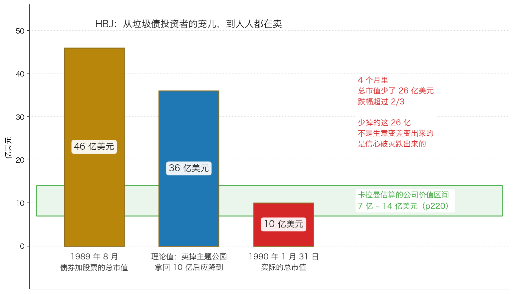
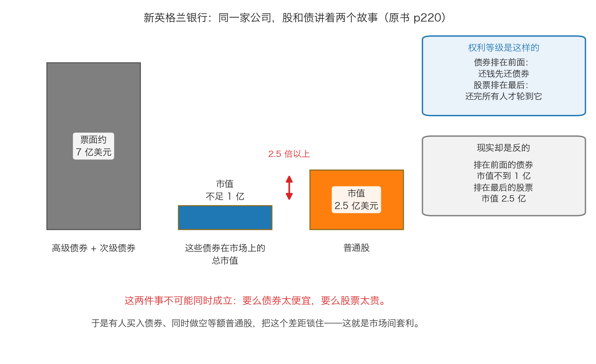

# 第 4 章：真实案例——HBJ 公司的陨落

> 本章你将：
> - 看清一家"垃圾债投资者的宠儿"是怎么在 4 个月里损失超过三分之二市值的
> - 学会原书那句最重要的判断标准：**价格下跌本身，不等于便宜**
> - 看懂卡拉曼在 HBJ 身上算的那笔账，以及为什么破产反而对次级债券有利
> - 认识"**市场间套利**"：同一家公司的股票和债券，为什么能讲出两个完全相反的故事
> - 亲手算一遍新英格兰银行那笔套利的三种结局，知道它的盈亏平衡点在哪里
> - 回答"这对我的钱包意味着什么"：**这套操作你用不了，但"股债矛盾"这个免费信号你可以用**

上一章我们学会了"算不同结局下的回收值"。这一章不讲新方法，只做一件事：**看别人怎么用这套方法赚到钱，也看别人怎么在同一个地方亏掉钱。** 两个案例都来自原书 p219–p222。

---

## 4.1 HBJ：从"宠儿"到"弃儿"，只用四个月

先交代这家公司是谁。

**HBJ** 的全名是 Harcourt Brace Jovanovich，一家美国出版公司。在原书写作的年代，它是**垃圾债投资者的最爱**——注意"最爱"这两个字，它意味着这只债券在市场上被当成"优质垃圾债"来追捧，价格甚至高于票面。

1989 年 8 月，这家公司的状况是这样的（p219）：

- 债券和股票的总市值：**46 亿美元**；
- 它的垃圾债**交易价格高于票面价格**；
- 它手里有三块业务：一项著名的**出版业务**、一家**保险公司**、几家**主题公园**；
- 公司准备把主题公园卖掉。

**然后，第一件事发生了。** 1989 年 9 月，HBJ 宣布以 **11 亿美元**的价格卖出主题公园，"这一售价令华尔街分析师感到失望，他们预期售价应该为 **15 亿美元**"（p219）。扣掉税之后，公司实际拿到 **10 亿美元**，用来偿还银行债务。

**从算术上讲，这时候公司的市值应该怎么变？** 它卖掉了一块值 10 亿美元（税后）的资产，又用这 10 亿美元还了债。**公司少了一块资产，但也少了一笔债**——如果市场对它的估值方式是"资产减负债"，那么总市值应该从 46 亿**降到 36 亿**（p219）。

**但实际的结局是**（p219）：到 1990 年 1 月 31 日，这家公司的总市值只剩 **10 亿美元**——比四个月前下降了**超过三分之二**。

**那多跌掉的 26 亿美元，是从哪来的？**

原书的解释非常值得记住（p219）：

> "出现如此大的跌幅只能用投资者对公司'优秀垃圾债'印象的破灭来加以解释。一旦当人们清楚地看到了这家公司使用了大量的杠杆之后，大规模的抛售就开始涌现，证券价格一路下跌。"（p219）

注意这句话里的因果：**不是"公司变差了"导致抛售，而是"大家终于看清了它欠了多少钱"导致抛售。** 那 26 亿美元，跌掉的是**信心**，不是**资产**。

> 💡 **换个说法：** 一个东西原来被当成"优等生"，享受着优等生的估值；当大家发现它其实只是"借了很多钱在硬撑"时，它会被重新归类到"高杠杆的普通公司"那一档。**重新归类的那一瞬间，价格会跳一大截。** 这一跳跟它这个月的生意做得好不好，没有关系。

---

## 4.2 这一章最重要的一句话

如果你这一章只记住一句话，请记住原书的这一句（p219）：

> "单靠价格下跌无法让一种证券成为便宜货，要想成为便宜货，还需要满足价格大幅低于潜在价值的条件。"（p219）

这句话看起来平淡，其实是整本书的骨架。我们把它拆成两步来解释。

**第一步：价格下跌，只是"分子变小了"。** HBJ 的市值从 46 亿跌到 10 亿，跌了 78%。这个数字本身**不包含任何关于"便宜"的信息**——因为一个东西从 46 元跌到 10 元，可能意味着它原来被高估了 36 元，现在才回到正常。

**第二步："便宜"是一个比较，需要第二个数字。** 只有当你能说出"**它大概值多少钱**"的时候，"10 亿是贵还是便宜"这个问题才有答案。

> ⚠️ **易踩坑：** 这是新手最容易掉进去的坑，而且在 A 股/港股 里天天发生：
> - "它从 100 元跌到 20 元，还能跌到哪去？"——**能跌到 0。**
> - "它已经跌了 80%，肯定到底了。"——**跌 80% 之后还可以再跌 80%，那之后只剩原来的 4%。**
> - "市净率只有 0.5 倍了，比谁都便宜。"——**前提是那个"净资产"是真的**（Week 9 讲过，应收账款、存货、商誉都可能不值账上那个数）。
>
> **记住这个顺序：先算价值，再看价格。反过来做，你就是在用价格的跌幅给自己壮胆。**

---

## 4.3 卡拉曼在 HBJ 身上算的那笔账

现在把第 3 章的方法用上。原书 p220 记下了当时的判断：

- 在 1990 年 1 月，"几乎可以肯定的是，这家公司的价值为 **14 亿 - 7 亿美元**之间，甚至有可能更多"；
- 高级债务是 **6 亿到 9 亿美元**；
- 与次级债券相关的一个数字是 **9.5 亿美元**；
- 一年之后，General Cinema Corporation 给出的 **15 亿美元**收购报价证实了这一估值——原书说，结果是"每 1 美元的这些次级债券将获得近 **50 美分**的回报"。

**为什么是"次级债券"成了便宜货，而不是股票？**

因为按第 3 章的"分钱瀑布"来算：公司的价值在 7 亿到 14 亿美元之间；**高级债务 6 亿到 9 亿美元先拿走**；剩下的才轮到次级债券。也就是说，次级债券是那个**骑在切线上的"支点证券"**——它既不是全额保障，也不是完全没戏。**价值往上一点，它受益最大；往下一点，它受伤最重。** 这正是原书 p218 那句话的现实版本。

**而这一章最精妙的一段，是关于"破产反而对它有利"**。原书写道（p220）：

> "实际上当企业申请破产后，这些次级债券的价值最终将增加，因为支付给高等级未担保债务持有人的利息将推迟，现金储蓄对次级债券最为有利。"（p220）

**这句话要慢慢读，因为它非常反直觉。** 一家公司破产了，排在**更前面**的高级债权人反而拿到的**更少**，为什么？

因为**高级债权人的"利息"被暂停支付了**（第 1 章讲过的自动冻结）。原本每年要流出去的那笔利息，现在留在了公司账上，变成了现金。**而现金是会往下流的**——高级债权人只拿自己那部分，多出来的现金最后都归到"支点"那一层，也就是次级债券。

这就是"破产的货币市场理论"（第 1 章 p211）在真实案例里的样子：**破产期间攒下的每一块钱现金，最后都在往次级债券的口袋里流。**

> 📌 **划重点：** HBJ 这个案例教了两件事。
> **第一，坏的行业新闻会无差别地打压一整类证券**，包括那些持有它的人其实并不了解的东西。
> **第二，一旦你算清了"瀑布"的位置，你就能知道"钱会往哪一层流"。** 在 HBJ 这个例子里，钱是往下流的——流到了次级债券。

---

## 4.4 新英格兰银行：同一家公司，两个市场，两个故事

第二个案例更精彩，而且它教的是一个**可以随身携带的思考工具**。

原书开篇先给了一句概括（p220）：

> "许多时候股市上的证券价格与债市上的证券价格不一致，就像是某个市场中的投资者不与另外一个市场中的投资者交流一样。"（p220）

然后原书说，财政困境恰好为这种"沟通"创造了机会（p220）："财政困境为新英格兰银行（BNET）的债券和股票创造了沟通的机会。"

**发生了什么。** 1990 年 1 月，新英格兰银行公布了巨额亏损报告。市场的反应是这样的（p220）：

| 证券 | 之前 | 之后 |
|---|---|---|
| 次级债券 | 70 多美元 | 暴跌至 **10 - 13 美元** |
| 普通股 | —— | **3.5 美元**左右 |

**然后是最关键的两个数字**（p220）：

> "新英格兰银行总共拥有票面金额约为7 亿美元的高级债券和次级债券，而这些债券的总市值不足1 亿美元。"（p220）
>
> "该银行普通股的总市值为2.5 亿美元，当然，普通股的权利等级低于债券。"（p220）

请停下来看这两个数字。

**排在前面的债券，总市值不到 1 亿美元。**
**排在最后的股票，总市值 2.5 亿美元。**

而且原书还特意补了那半句提醒——"**当然，普通股的权利等级低于债券**"。

**这两件事不可能同时成立。** 要么债券太便宜了（它怎么也该值一亿多），要么股票太贵了（它在破产里应该值零）。**至少有一个市场搞错了。**

> 💡 **换个说法：** 想象一家饭店在转让。老板说："欠银行的 100 万，我现在只按 15 万卖给你这张欠条。"而同一时间，隔壁有人愿意花 40 万买这家饭店的**股权**。**债主的权利比股东大，价格却比股东低——这中间一定有人在犯傻。** 新英格兰银行就是这个局面。

---

## 4.5 那笔套利怎么做，三种结局怎么算

**操作是这样设计的**（p220–p221）：**买入债券，同时做空等额的普通股。**

先把"做空"这个词解释清楚（它在本周术语表里出现过）：

> **做空** = 你先向别人借来股票、当场卖掉、拿到现金；等以后股价跌了，你再从市场上买回来还给人家。**你赚的是差价，你怕的是股价涨。** 股价涨多少，你就亏多少——理论上亏损没有上限。

原书给了具体数字（p221）：

- 以 **10.5 美元**的价格，买入**票面 100 万美元**的次级债券，实际支出 **10.5 万美元**；
- 以 **3.5 美元**的价格，**做空 3 万股**普通股。

原书对这组交易的评价是（p221）：

> "不管出现何种情况，同时进行这些交易看起来都是一种低风险策略。"（p221）

而它对第一种结局的描述是（p221）：

> "例如，如果新英格兰银行最终破产（该银行确实在1991 年年初破产），债券持有人最多损失自己所有的投资，并可能收回一些本金，而普通股肯定毫无价值。"（p221）

原书还补了一句这套操作的两笔"额外收入"（p221）：做空拿到的现金可以吃利息；而且如果银行还付息，债权人还能收到利息——"实际上这家银行支付了两次每半年支付一次的息票"。

### 三种结局分别会发生什么

原书列了三种可能（p221）：

**结局 A：银行破产。**（后来真的破产了。）债券可能全损、也可能收回一点本金；**普通股肯定归零**。做空赚到的钱至少能抵掉债券的亏损，再加上做空现金的利息和两次息票，**净结果是赚的**。

**结局 B：银行活下来了。** 原书举的例子是普通股"翻了三番达到 10.5 美元"。这时做空亏钱，但债券会大涨——原书说"债券的价格可能会大幅超过 **30-40 美元**的盈亏平衡点"。

**结局 C：财务重组，银行给债券持有人提供"债转股"的机会。** 原书说这一方案"对那些既做多债券又做空股票的人非常有利"（p221），因为：银行为了说服债券持有人换股，"可能会给出高于市场的价格"，**债券因此受益**；而"向债券持有人发行的大量普通股会带来摊薄效应和卖盘压力"，**股票因此下跌**。**两边都赚。**

> 📌 **划重点：** 为什么这笔交易被称为"低风险"？因为它的**两个仓位是对冲的**：最坏的情况（破产）下，一边全损、另一边全赚，互相抵消；而其他两种情况（存活、重组）下，**两边的方向都是对你有利的**——债券涨得比股票多，或者债券涨、股票跌。这就是原书说的"对破产证券的投资有点像风险套利投资"（p212）的本意。

### 但是——这套操作，你做不到

必须在这里泼一盆冷水，否则这一节会变成危险的建议。

**第一，你需要能方便地做空个股。** A 股的做空渠道对普通投资者极其有限（融券券源少、成本高、常常借不到）；港股相对可行，但门槛和成本依然不是散户级别。**第二，你需要能买到困境债券。** 银行间市场、机构固收品种都有合格投资者门槛，普通人基本没有通道。**第三，你需要能同时管理两个仓位。** 做空有强制平仓的风险，一旦股价暴涨，你可能在债券赚钱之前就已被迫平掉空头。

所以，这套操作是**专业机构的工具，不是你的工具**。但它留给你一个**免费的信号**：

> 🇨🇳 **落到 A 股/港股：** 以后遇到任何一家出了事的公司，去查**两件事**：它的**债券价格**（或者转债价格、或者评级、或者票面利率在二级市场的表现）和它的**股票价格**。如果这两者讲的是**两个完全相反的故事**——债市认为它要完蛋、股市认为它没事，或者反过来——那么**至少有一个市场是错的**。你不需要去套利，你只需要知道：**在这种情况下，"跟着热闹的那一边走"是很危险的。**

---

## 4.6 落到 A 股/港股：四种形态，一个动作

把这一章的内容翻译成你真正能碰到的东西：

| 形态 | 你会看到什么 | 你要问的第一个问题 |
|---|---|---|
| **ST 股 / 退市整理期** | 股票简称前加 `*ST`；交易限制更严、买家更少 | 我手里的这一档，在清偿顺序里排第几？ |
| **破产重整** | "被申请重整""法院受理重整""重整计划""出资人权益调整" | 重整方案里，原有股东要不要让渡股份？ |
| **可转债违约** | 正股退市、转债到期无法正常兑付；或者公告"下修转股价""回售" | 募集说明书里的**回售条款**和**违约偿债安排**怎么写的？ |
| **地产债 / 境外债重组** | "展期""交换要约""清盘呈请""协议安排" | 新债的期限、利率、抵押安排是什么？本金打了几折？ |

而这一章真正能带走的，是一个**动作**。它只有两步：

**第一步：先算价值，再看价格。** 无论跌幅多大、无论别人怎么说"跌不动了"，先回答"它大概值多少钱"。（原书 p219："单靠价格下跌无法让一种证券成为便宜货。"）

**第二步：找到"钱会往哪一层流"。** 列出清偿顺序，画出瀑布，看看谁是支点证券。然后问自己：**如果我买的是那一层，上升时我受益多少，下降时我损失多少？**

> ⚠️ **易踩坑：** 原书在结论里给了两句非常有分量的提醒（p222）：
> "对破产证券和财政陷入困境证券的投资是一项复杂、高度专业化的活动。"（p222）
> "实际上，这一领域中的投资机会主要来自于其他投资者的不理性行为。"（p222）
> **第二句尤其要注意**：机会来自别人的不理性，但**别人不理性，不代表你一定理性**。这一周学完，你最应该建立的能力不是"敢买"，而是"**能算出来，也能说清楚我为什么可能算错**"。

---

## ✍️ 想一想

1. HBJ 卖掉主题公园、拿回 10 亿美元还债之后，理论上总市值应该只下降 10 亿（从 46 亿到 36 亿），但实际上跌到了 10 亿。请你说出至少**两个**理由，解释"为什么市场会多跌 26 亿"。
2. 原书说 HBJ 破产之后，次级债券的价值"最终将增加"。请用"分钱瀑布"的语言解释：**为什么排在更前面的高级债权人被暂停付息，反而对次级债券有利？**
3. 假设你在一家公司的公告里看到这样两件事：① 它的一只债券在二级市场上以面值的 25% 成交；② 它的股票在一个月里涨了 40%。请你写出**三种可能的解释**，并说明你会先去查什么来分辨它们。

> 💡 **参考思路：**
> 1. 至少可以答出这几条：① **信心破灭**——原来市场把它当成"优质垃圾债"，享受着优等生的估值；一旦大家看清它的杠杆，就把它重新归到"高杠杆公司"那一档，估值倍数直接下移（对应原书 p219 的"印象的破灭"）。② **杠杆的放大效应**——这家公司欠了很多钱，权益（股票）本来就是资产减负债之后剩下的那一薄层；资产端缩水 10 亿，权益端可能缩水更多（这就是第 1 章讲的"债务是放大器"）。③ **被迫卖出**——垃圾债的共同基金、杠杆买家在价格下跌时会触发风控和赎回，只能不计价格地卖（对应原书 p212 讲的"许多持有人被迫不计价格地卖出"）。④ **分析师失望**——主题公园只卖了 11 亿而不是预期的 15 亿，这说明公司**被迫在坏时点卖资产**，市场会推断它剩下的资产也可能被贱卖。**任何两条答对就算过关。**
> 2. 用瀑布的语言说：偿还顺序是**从下往上**填的。高级债权人拿的是"本金加利息"，而破产一开始，**它的利息就被暂停支付了**——原本每年要流出去的那笔现金留在了池子里。这笔多出来的现金会继续往上填，而**下一层就是次级债券**。所以对次级债券来说，破产带来两个好处：一是**高级债权人当期少拿了**，二是**公司攒的现金变多了**（对应第 1 章 p211 的"破产的货币市场理论"）。反过来说，如果公司不破产、硬撑着按时付息，那笔现金就流出去了，次级债券什么也拿不到。**这就是原书 p220 那句"现金储蓄对次级债券最为有利"的完整含义。**
> 3. 三种解释：① **债市是对的**——公司实际上已经资不抵债，股票在炒作"重整概念"或者"壳价值"，那 40% 的涨幅是纯粹的投机；② **股市是对的**——债市那只债券可能是**一只条款极差的次级债**（比如到期日很远、利率很低、几乎没有抵押），或者那笔成交是**缺乏流动性的个别交易**，价格没有代表性；③ **两个市场都在反映不同的东西**——债券反映的是"公司现有的资产能不能覆盖债务"，股票反映的是"如果重整成功、债权人豁免一部分债务，股东还能剩下什么"，后者是一种**期权式**的价值，可能很值钱也可能一文不值。**先去查什么**：① 那笔债券成交的**时间和成交量**（一笔小额成交说明不了问题）；② 债券的**具体条款**（期限、利率、担保、清偿顺序）；③ 公司最新的**资产负债表和债务到期表**；④ 股票上涨有没有**公告支撑**（还是只是资金炒作）。**如果这四样查完你还是算不出"回收值"，那正确答案就是"不参与"。**

---

## 🧮 算一算

这一题用的是原书 p221 的真实数字。我们把新英格兰银行那笔套利的账，一步一步算完。

**情境。** 你有 **10.5 万美元**，做了两件事：

- **买入**：以 10.5 美元的价格，买入票面 **100 万美元**的次级债券；
- **做空**：以 3.5 美元的价格，做空 **3 万股**普通股。

### 第一问：做空那 3 万股，一共卖出了多少钱？

**分步解答。**

$$3 万股 \times 3.5 美元 = 10.5 万美元$$

**答案：10.5 万美元。** 这正好和买债券花的钱**一样多**——原书说这是"为了获得相等的净收益"（p220–p221）。

> 💡 **这一步很重要**：正因为两边的金额相等，这笔交易才叫"**等额对冲**"——一边涨多少，另一边就跌多少，两边的波动互相抵消。**这是它被称为"低风险"的算术基础。**

### 第二问：结局 A——银行破产，债券和股票都归零

**假设最坏的情况：债券一分钱都没拿回来，股票也归零。**

第一步，债券这边亏多少：

$$-10.5 万美元$$

第二步，做空这边赚多少。你以 3.5 美元卖出，现在股价是 0，你花 0 美元买回来还给人家：

$$(3.5 - 0) \times 3 万 = 3.5 \times 3 万 = 10.5 万美元$$

第三步，两边相加：

$$-10.5 万 + 10.5 万 = 0$$

**答案：两边的盈亏正好抵消，净结果是 0。** 再算上做空拿到的那 10.5 万美元现金的利息，以及银行实际支付的那两次息票，**这笔交易在小赚的状态下结束。**

> 📌 **划重点：** 这就是"对冲"的含义——**最坏的情况被锁死了。** 请注意这一问里的关键：**债券全损**（最坏）的时候，做空恰好赚了**同样多**。这不是巧合，是因为第一问里那"两个 10.5 万相等"。

### 第三问：结局 B——银行活下来了，普通股涨到 10.5 美元

**情境。** 后来银行没死，普通股"翻了三番达到 10.5 美元"（p221）。

**问题：债券价格要涨到多少，这笔交易才不亏不赚？**

**分步解答。**

第一步，做空这边亏多少：

$$(10.5 - 3.5) \times 3 万 = 7 \times 3 万 = 21 万美元$$

第二步，债券这边要赚回多少，才能把这 21 万补上、同时收回自己的 10.5 万成本：

$$21 万 + 10.5 万 = 31.5 万美元$$

第三步，把 31.5 万美元换回"每 1 美元面值多少钱"。债券的票面是 100 万美元：

$$31.5 万 \div 100 万 = 0.315$$

$$0.315 \times 100 = 31.5$$

**答案：债券价格要涨到每 1 美元面值 31.5 美分，也就是 31.5 美元，这笔交易才刚好不亏。**

**还记得原书怎么说的吗？** 原书说"债券的价格可能会大幅超过 **30-40 美元**的盈亏平衡点"（p221）。**我们算出来的 31.5 美元，正好落在这个区间里。**

### 第四问：为什么"债转股"的重组对这套组合最有利？

**分步解答。**

想象银行对债券持有人提出：**用股票换你手里的债券，而且换的价格高于市价。**

第一边，**债券**：你手里原本市场价 10.5 美元的债券，被按一个更高的价格换成了股票——**债券这边赚了。**

第二边，**股票**：大量新股票被发给原来的债券持有人。而这些人**本来就不想要股票**（他们买的是债），所以拿到手大概率就卖。同时股票总数变多了，每一股对应的公司权益变少：

$$每股对应的权益 = 公司权益 \div 股票数量$$

股票数量变多，分母变大，**每股对应的权益变小（这叫摊薄）**。再加上一堆人在卖，**股票这边跌了。**

**答案：两条边都赚。** 原书对这个结局的评价是——这一替代方案"对那些既做多债券又做空股票的人非常有利"（p221）。

### 第五问：这套操作，你能做吗？

**答案：大概率不能。** 三个原因：① 你很难方便地做空个股；② 你买不到困境债券；③ 做空有被强制平仓的风险——如果股价先暴涨，你可能在债券赚钱之前就被迫平掉空头，两边都亏。

**但你可以免费使用它背后的那个信号：**

> **同一家公司的股票和债券，如果讲的是两个完全相反的故事，那么至少有一个市场是错的。**

### 三问汇总

| 结局 | 债券这边 | 做空这边 | 合计 |
|---|---|---|---|
| A 破产（股债都归零） | 亏 10.5 万 | 赚 10.5 万 | **约 0（加上利息小赚）** |
| B 存活（股价涨到 10.5） | 要涨到 31.5 美元才打平 | 亏 21 万 | 盈亏平衡点 **31.5 美元** |
| C 债转股 | 赚（换股价高于市价） | 赚（摊薄加卖压） | **两边都赚** |

> 📌 **划重点：** 把这张表和第 3 章那张"不同结局加权回收值"的表放在一起看，你会发现它们是**同一个方法**：列出结局 → 每种结局下各边拿回多少 → 看最坏的情况能不能接受 → 再决定下注。**唯一的新东西是"对冲"**——用一个方向的盈利去抵消另一个方向的亏损，把最坏情况锁死。这是 Week 12 会进一步讲的"风险管理"的雏形。

---

## ✅ 小测验

**1. HBJ 的市值从 46 亿美元跌到 10 亿美元，原书用什么来解释这个跌幅？**
A. 出版业务的收入大幅下滑
B. 投资者对这家公司"优秀垃圾债"印象的破灭，以及看清它使用了大量杠杆之后的抛售
C. 主题公园卖得太便宜，公司实际亏损了 26 亿美元
D. 整个股市在那四个月里下跌了三分之二

**2. 原书说"单靠价格下跌无法让一种证券成为便宜货"，这句话的意思是？**
A. 价格下跌的证券一定不便宜
B. 要判断便宜与否，必须同时知道"价格"和"潜在价值"两个数字，只比较价格的历史高低没有意义
C. 只有价格跌到零才叫便宜
D. 便宜与否取决于它跌了多久

**3. 在新英格兰银行的例子里，为什么"买入债券、做空等额普通股"被认为是一种低风险策略？**
A. 因为债券有政府担保，不会亏钱
B. 因为两边金额相等：最坏情况（破产）下一边全损、另一边全赚互相抵消；其他情况下两边都有利
C. 因为普通股的价格永远会下跌
D. 因为做空不需要成本

> **答案与解析**
>
> **1. B。** 原书 p219 的原话是"出现如此大的跌幅只能用投资者对公司'优秀垃圾债'印象的破灭来加以解释。一旦当人们清楚地看到了这家公司使用了大量的杠杆之后，大规模的抛售就开始涌现，证券价格一路下跌"。A 错在原书的解释里根本没有提到经营收入下滑，它强调的是**估值定位的改变**；C 错在那 10 亿美元是卖资产**收回**的钱、用来还债的，公司没有因此亏 26 亿；D 错在这是**个股**的重新定价，原书把它归因于这家公司自身的杠杆被看清。
> **2. B。** 原书 p219 完整的句子是"单靠价格下跌无法让一种证券成为便宜货，要想成为便宜货，还需要满足价格大幅低于潜在价值的条件"——"还需要"三个字说明：**价格下跌是必要条件的一部分，不是充分条件。** A 错在"一定不便宜"太绝对，跌下来的东西确实**可能**便宜，只是"跌"本身不构成理由；C、D 都是对"便宜"的误解，便宜永远是一个**比较**的结果。
> **3. B。** 原书 p221 说"不管出现何种情况，同时进行这些交易看起来都是一种低风险策略"，随后逐一说明了三种情况：破产时债券最多全损、普通股肯定归零，亏损被做空的收益抵消；存活时债券涨幅可能超过盈亏平衡点；重组时两边都有利。A 错在原书说的恰恰相反——银行确实在 1991 年年初破产，债券持有人"最多损失自己所有的投资"；C 错在普通股在原书的例子里是"翻了三番达到 10.5 美元"，是**上涨**的；D 错在做空要付借券费用、要占用保证金，成本并不为零——这正是普通投资者做不了这套操作的原因之一。

---

## 📖 回到原书

- 对应原书 **第十二章** 的最后三节："HBJ 公司的陨落：财政陷入困境证券中的一个机会""问题债券对比乐观股票：对新英格兰银行证券进行市场间套利""结论"，`raw/安全边际-中文版/page_219.md` ~ `page_222.md`（原书 p219–p222）。
- 建议精读：**p219**（"单靠价格下跌无法让一种证券成为便宜货"那一句，以及 46 亿到 10 亿的全过程），**p220–p221**（新英格兰银行的两个市值数字，和三种结局的完整推演）。
- 可以略读：**p220 中间关于 HBJ 具体债务档位数字的括号段落**（记住"次级债券成了便宜货""General Cinema 的收购报价证实了估值"这两件事就够了），以及 **p221 结尾关于"该方案最终证实不具操作性"的细节**。
- 原书金句（**逐字引用**）：
  > "单靠价格下跌无法让一种证券成为便宜货，要想成为便宜货，还需要满足价格大幅低于潜在价值的条件。"（p219）
  >
  > "一旦当人们清楚地看到了这家公司使用了大量的杠杆之后，大规模的抛售就开始涌现，证券价格一路下跌。"（p219）
  >
  > "许多时候股市上的证券价格与债市上的证券价格不一致，就像是某个市场中的投资者不与另外一个市场中的投资者交流一样。"（p220）
  >
  > "财政困境为新英格兰银行（BNET）的债券和股票创造了沟通的机会。"（p220）
  >
  > "新英格兰银行总共拥有票面金额约为7 亿美元的高级债券和次级债券，而这些债券的总市值不足1 亿美元。"（p220）
  >
  > "不管出现何种情况，同时进行这些交易看起来都是一种低风险策略。"（p221）
  >
  > "实际上，这一领域中的投资机会主要来自于其他投资者的不理性行为。"（p222）
  >
  > "我的主要观点是，通过见解独到的分析方法和大范围搜索，投资者可以在所有有趣的地方找到诱人的投资机会。"（p222）

---

> 📌 **本周收束。** 十一天前我们还在讲"机会在哪里"，这一周我们走进了全书最冷、也最难的两个角落：**制度变化造出来的机会**（第 0 章），和**困境与破产证券**（第 1–4 章）。
>
> 如果这一周只能带走三句话，请带走这三句：
>
> 1. **制度变化会创造一次性的错误定价**——因为没人研究、没人比较、没人愿意看。但制度变化只负责"把东西摆上桌"，值不值得买，还是要回到价值本身。
> 2. **困境证券的定价不是算命，是把"我会怎么错"写成数字**——列出结局、给出回收、估个概率、乘一乘再加起来，然后拿它和市价比较。
> 3. **价格下跌不等于便宜，重整不等于股东得救。** 在破产这个程序里，普通股永远排在最后一个。
>
> Week 12 我们讲组合管理与卖出：**流动性为什么比收益更重要、多样化到什么程度才合理、以及最难的卖出决定。** 到那时你会发现，这一周学的"先想最坏情况"，正是那一切的起点。
