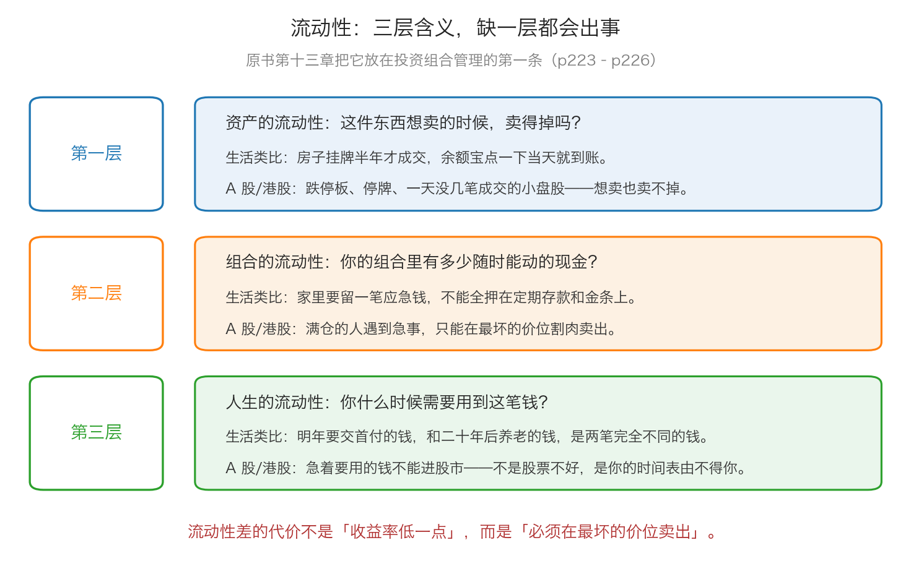

# 第 0 章：流动性——为什么它比收益更重要

> 本章你将：
> - 拿到"流动性"的准确定义，并学会用三层含义检查自己的钱
> - 明白为什么原书说"流动性可能是幻觉"，以及它在 A 股/港股 里具体长什么样
> - 搞清楚一笔投资该锁多久、该要多少补偿，不再把"随时能卖"当成理所当然
> - 学会给现金一个正确的定位：它既不产生高回报，也不是闲置
> - 用一张手算表算出"被迫卖出"到底有多贵
> - 最后回答：为什么在你算收益率之前，必须先算清楚"这笔钱什么时候要用"

Week 11 我们讲的最后一件事，是困境证券：那些公司出了事、持有者被迫卖出，
于是价格跌到荒谬的位置，给懂行的人让出了机会。

那一章你是站在**买方**的位置看的。这一章换一边：**如果有一天，被迫卖出的那个人是你呢？**

再好的安全边际，也救不了一个必须在错误时点卖出的人。所以原书把"流动性"
放在第十三章投资组合管理的第一条，而不是放到最后。我们这一章就把它讲透。

---

## 0.1 先分清两件事：交易，和投资组合管理

原书第十三章的第一句话，就在区分两个经常被混为一谈的词（p223）：

> "交易——即买卖证券的过程——能给一个人的投资结果造成巨大的影响。"（p223）

**交易**（也就是下单买卖这个动作）只是投资组合管理的一部分。卡拉曼把
**投资组合管理**该管的事列成了四项（p223）：

1. 交易活动本身；
2. 对所持头寸进行**定期检查**；
3. 保持合适的**多样化投资**，并作出**对冲**决定；
4. 管理投资组合中的**现金流和流动性**。

注意第 4 项。你不会在任何"如何选股"的文章里看到它，但它是这四项里
唯一一项**能让你在别的三项都做对的情况下依然活不下来**的。

> 💡 **换个说法：** 选股是在挑"买什么"，投资组合管理是在回答"这些东西怎么摆、
> 用谁的钱买、什么时候必须变成现金"。**前者决定你能赚多少，后者决定你能不能撑到那一天。**

卡拉曼接下来讲了一件很多人没想过的事：**投资这件事，没有"做完"的那一天**（p223）：

> "所有投资者必须对投资过程的持续性作出妥协。尽管一些投资有着起点和终点，投资组合管理将永远存在。"（p223）

他用番茄酱打了个比方。一家做番茄酱的公司，可以相当有把握地预测明年的销量——
因为**它明天的利润，来自前天就已经建好的品牌、渠道和工厂**。可你买的股票不是这样：

> "这些投资者的回报由支付的价格决定，而不仅仅由公司的业绩决定。"（p223）

同一家公司、同样优秀的经营，你在 10 倍市盈率买入和在 40 倍市盈率买入，
拿到的回报可以差好几倍。这句话我们在 Week 2 和 Week 7 反复讲过，
放在这里是提醒你：**既然回报取决于你付出的价格，那你就永远有下一件事要做——
检查、比较、等待、以及把钱准备好。**

---

## 0.2 流动性是什么：先给它一个生活类比

**生活里的例子（三个）：**

1. **余额宝里的 1 万元。** 你点一下"转出"，几分钟就到银行卡。
2. **你家的房子。** 挂牌、带看、谈价、过户，顺利的话三到六个月，不顺利的话一年以上；
   要是急着用钱，你可能得比市场价低 10% 才卖得掉。
3. **一张亲戚写的借条。** 上面写着"三年后还你 10 万"。你想提前要回来？
   可以试试，但对方未必有钱，而且你多半得少要点。

这三样东西的差别，就是**流动性**：

> **流动性，指的是你把一样资产换成现金的容易程度——能不能换、要多久、要打多少折。**

余额宝流动性最好（随时、几乎不打折）；房子流动性差（慢、可能打折）；
借条流动性最差（可能根本换不回来）。

**为什么它对投资者特别重要？** 因为投资和买房不一样的地方在于：
**买错了，你随时可以改主意。** 但前提是它能卖掉。原书用 IBM 举例（p223–p224）：

> "当一名投资者购买了一家非上市公司股票或者一家有限合伙公司中不可转让的权益时，他就无法改变主意了，实际上他被困住了。"（p224）

**"不可转让的权益"** 这个词要先解释：有些投资的份额是**不能随便卖给别人**的。
比如几个朋友合开一家店，你占 20%，你想退出，得其他合伙人同意、
还得有人愿意接手——这就是"不可转让"。它不是"价格低"，是**根本卖不掉**。

被"困住"的代价，卡拉曼说得很直接（p224）：

> "当投资者没有因自己的投资缺乏流动性而希望获得补偿时，他们通常会因此而感到后悔。"（p224）

**"补偿"是什么意思？** 意思是：既然我把钱锁死在这里、承担了卖不掉的风险，
那我就应该因此**要到更高的预期回报**——比如更低的价格、更高的利息、
更大的折扣。锁得越久、越难卖，你要的补偿就该越多。

> ⚠️ **易踩坑：** 很多人把"账户里显示持仓市值 10 万元"当成"我有 10 万元"。
> 这两个完全不是一回事。市值是**上一个买家愿意出的价**，
> 而它能不能变成你口袋里的 10 万元，取决于**有没有下一个买家**。

> 🇨🇳 **落到 A 股/港股：** 这几个机制你开户后马上会遇到——
> - **T+1**：A 股今天买入的股票，最快**明天**才能卖；港股是 T+0，当天可以买卖。
> - **涨跌停板**：主板股票每天最多涨跌 10%，创业板和科创板 20%，ST 股 5%。跌停时，
>   价格砸在下限上，想卖的人排队也卖不掉——**市场先生那天可以不接你的货**（Week 3 讲过）。
> - **停牌**：公司有重大事项时会申请停牌，停牌期间**完全不能交易**，
>   可能是几小时，也可能是几个月。
> - **港股的小盘股**：很多港股一天只成交几万港元，你手里有一两百万的货，
>   一卖就把价格砸下去好几个百分点。
> - **非上市资产**：非上市公司的股权、未到期的私募基金份额、房产，
>   都属于"想卖也未必卖得掉"的那一类。

---

## 0.3 流动性不是越强越好：时间周期才是那把秤

这里有一个非常容易被读反的地方。卡拉曼**并不是**说流动性越高越好（p224）：

> "多数投资组合应保持一种平衡状态，当市场为缺乏流动性提供了很好的补偿时，可以选择让投资组合具有更少的流动性。"（p224）

他的意思是：**流动性是一种商品，它是有价格的。** 你为了拿到流动性，
付出的代价通常是**少赚一点**；反过来，你为了多赚一点，可以让出一部分流动性——
**但前提是补偿足够。**

那"足够"是多少？卡拉曼给了一把秤（p224）：

> "尽管你必须总是因牺牲了流动性而获得很好的回报，但所需的补偿依赖于你在多久之后才需要流动性。"（p224）

紧接着，他给了一个很妙的观察（p224）：

> "实际上，一项持续时间较短的投资本身就创造出了流动性。"（p224）

**这句话怎么理解？** 用生活例子讲：你借给朋友 10 万元，约定"三年后还"，
这笔钱本来是一潭死水。但如果约定"每月还我 3000 元，三年还清"，
你每个月都有一笔钱回到手上，它就变活了。

投资里也一样。一笔**会持续产生现金**的投资（分红、利息、分期还款），
比一笔同样期限但"到期才一次性还本"的投资，流动性要好得多。
所以卡拉曼说，风险资本那种投资必须给非常高的补偿：
钱要锁很多年、中间一分钱拿不回来、而且亏损概率很大，经常血本无归（p224）。

**把这条规则变成你的操作：**

| 这笔钱多久之后要用 | 它应该放在哪里 | 你要的"流动性补偿" |
|---|---|---|
| 3 个月内（随时可能要用） | 活期、货币基金 | 不需要补偿，因为你根本没资格要求它 |
| 1 到 3 年 | 定期存款、短债基金、国债 | 少量补偿即可 |
| 5 年以上 | 可以考虑股票、指数基金 | 需要明显的预期回报优势 |
| 10 年以上，且中间完全不用 | 才可以考虑流动性很差的品种 | 补偿必须非常大，且你必须真的用不到这笔钱 |

> 📌 **划重点：** 卡拉曼判断"该不该牺牲流动性"用的**不是收益率，是时间**（p224）。
> 所以你在看任何一个投资机会之前，先回答一个问题：
> **"这笔钱我多久之后要用？"** 这个问题答不上来，后面所有计算都是在算别人的钱。

---

## 0.4 流动性可能是幻觉

这一节是本章最重要的一节，也是全周最容易被忽略的一节。

原书在这一页只有一句话（p225）：

> "流动性可能是幻觉。"（p225）

然后他引了路易斯·鲁文斯坦（一位长期研究华尔街的作家）的话（p225）：

> "在股票市场上，流动性是针对个人而言的，而不是针对整个市场。一家企业的可分配利润才是对这个市场唯一的回报"（p225）

**这句话在说什么？** 我们把它慢慢拆开：

- 你**一个**人想把 10 万元股票卖掉，没问题，市场里总有买家——你拿到了流动性；
- 但**所有人**同时想卖，谁来买？市场里没有"场外的接盘人"。
  卡拉曼说得很清楚（p225）：

> "尽管任何一名投资者可以通过将证券卖给另外一名投资者而获得流动性，所有投资者的集合体只能通过意想不到的外部事件才能获得流动性，如收购和股票回购。除了这种来自于外部的交易外，每一种证券的一名买家必须找到对应的一名卖家。"（p225）

**"所有投资者的集合体"** 是一个非常关键的概念——它不是"某一个投资者"，
而是**把市场上所有持有者加起来看作一个人**。这个人手里的股票，只能卖给别的投资者，
或者卖给公司自己（回购）、卖给收购方。除此之外，**没有任何人能替他接盘**。

> 💡 **换个说法：** 想想电影院里散场。你一个人提前站起来走出去，很轻松；
> 但如果是**全场同时**站起来往外走，门口就那么大——**每个人的"出口"都在，
> 但所有人的出口只有一个。** 流动性看起来是每个人的，实际上是**先到先得**的。

所以卡拉曼的结论是（p225）：

> "在市场陷入恐慌时，那些在上涨的市场中看起来非常充裕的流动性就可能所剩无几了。"（p225）

> 🇨🇳 **落到 A 股/港股：** "流动性是幻觉"在 A 股/港股 里有三个非常具体的版本——
> 1. **牛市里的成交量。** 行情好的时候，小盘股一天成交几亿元，你觉得自己随时能走。
>    行情一转，成交量可能缩到原来的十分之一，你的持仓从"三天能卖完"变成"三个月卖不完"。
> 2. **极端行情里的连续跌停。** 当所有人同时想跑，跌停板上会排起巨量的卖单，
>    你挂上去，排在几十万手后面——**报价是那个价格，但你成交不了。**
> 3. **停牌复牌。** 停牌期间你什么都做不了；复牌后往往一次性补跌，
>    你想"跌之前卖掉"这个选项**从来就不存在**——因为信息公布的那一刻，它已经停牌了。
>
> **实战含义：** 你在做仓位规划时，要按"最坏情况下能卖掉多少"来算，
> 而不是按"今天屏幕上显示的成交量"来算。

---

## 0.5 现金的两面：它不产生回报，但它给你两样别的东西

既然流动性是幻觉，那是不是留现金就对了？也不是。原书把现金的两面写在一起（p225）：

> "当你的投资组合都是现金时，不存在亏损的风险。然而，也不存在赚取高额回报的可能性。"（p225）

这句话拆开就是两句话：

- **全是现金**：你不会亏，但你也不会赚。长期看，现金会被通胀慢慢吃掉购买力。
- **全是股票**：你可能赚很多，但你在最需要钱的时候，可能刚好是市场最差的时候。

**所以真正的答案是"比例"，不是"全有或全无"。** 卡拉曼本人一直是这么做的：
他在访谈里提到，2008 年初他管理的基金现金比例是 35%，后来是 20%（p271），
原因是"按照我们的安全边际确实找不到投资品种"。

再看他怎么描述整个投资的过程（p225）：

> "从某些方面来看，投资就是一个永无休止的管理流动性的过程。"（p225）

**"永无休止的管理流动性的过程"** —— 这句话是本章的骨架。原书把它拆成了四步：
现金 → 换成流动性更小的投资 → 投资开花结果、流动性重新建立 → 再开始新的循环（p225）。

### 这个循环有两个目的

卡拉曼说，投资组合里的流动性循环有两个重要的目的（p226）：

**目的①：降低机会成本。** 有现金在手上，遇到好机会你**能出手**。
如果没有现金，你只能卖出手里的东西去换——而那一刻往往不是卖出的好时机。

**目的②：排堵效应。** 这个词是本章最有价值的一个概念（p226）：

> "每隔一段时间了结投资组合中的部分头寸会产生一种排堵效应。"（p226）

**"排堵"** 是个生活词：下水道堵了要通一通。卡拉曼说的是人的心理（p226）——
投资者很容易对当前持有的头寸感到自满，跟着它们的价格一起沉浮：

> "没有价值的证券会越来越多并被忽视，同时损失也在增加。"（p226）

**这句话说的是什么场景？** 你买了 8 只股票，其中 3 只涨得不错，你天天看它们；
另外 2 只跌了 40%，你不看了，也不卖，就当它不存在。结果**账户里"死掉"的部分越来越多**，
而你的注意力全在活着的那几只上。

**"排堵"的做法就是：定期把一部分持仓变成现金，然后逼自己重新做一次决定——**
这笔钱现在要投到哪里去？这是不是我最想要的那个机会？
卡拉曼的原话是，这样"投资者就会一直面临着将这些现金投入运作、
寻找最有价值的投资的挑战"（p226）。

> 📌 **划重点：** 现金在这套体系里有三个身份——
> **保险**（急用钱时不用割肉）、**弹药**（好机会来了能出手）、**清洁剂**（逼你重新审视持仓）。
> 这三个身份都不产生收益，但它们都**保护你**。这就是本章标题的意思：
> 流动性为什么比收益更重要——因为它决定你有没有机会去赚那个收益。

---

## 0.6 落到 A 股/港股：一张可以贴在桌上的规矩表

把这一章变成动作，就是下面五条。它们都不需要你预测市场，只需要你提前决定。

| 规矩 | 具体做法 | 它防的是什么 |
|---|---|---|
| **规矩一：分开三个账户** | 生活账户（6–12 个月生活费）、应急账户（货币基金/活期）、投资账户（股票基金）。三个账户的钱**不许互相挪用** | 急事发生时被迫卖股票 |
| **规矩二：有期限的钱不进股市** | 三年内要用的钱（首付、学费、婚嫁、看病），只放存款、国债、货币基金 | 用短期目标去承受短期波动 |
| **规矩三：投资账户里留现金** | 留一部分现金或货币基金，比例自己定（常见做法是不低于 10%）。它的作用是等机会，不是等收益 | 满仓遇到暴跌时只能干看着 |
| **规矩四：检查持仓的"真实流动性"** | 把你持仓的股票按"一天成交额"排一下；小盘股、ST 股、成交稀少的港股，仓位要明显更小 | 账面有钱、卖不出来 |
| **规矩五：每半年"排一次堵"** | 半年挑一个固定的日子，把每一只持仓都问一遍："如果今天从零开始，我还会买它吗？"答不上来的，处理掉 | 亏损的持仓被忽视、越积越多 |

> 🇨🇳 **落到 A 股/港股：** 关于规矩三，有一个很实用的心理技巧：
> **把现金当成一种"持仓"，并且给它起个名字。** 比如叫它"第 9 只股票"。
> 这样当你在行情火热、手里 100% 是股票的时候，你会觉得"我的第 9 只股票被卖掉了"，
> 而不是"我有闲钱没投出去"。前者让你不舒服，后者让你手痒——**不舒服是好事。**

---

## ✍️ 想一想

1. 有人跟你说："股票比房子好，因为股票随时能卖掉，房子挂半年都没人要。"
   请用本章的分析，说出这句话在**哪三种情况**下是错的。
2. 卡拉曼说"流动性可能是幻觉"，那他为什么还要在组合里留现金、还强调流动性管理？
   这两件事矛盾吗？
3. 你的朋友满仓持有 6 只股票，其中 2 只已经跌了 40%，他半年没看过那两只的财报。
   请用"排堵效应"这个词，指出他的问题出在哪，并给他一个具体的动作。

> 💡 **参考思路：**
>
> 1. ① **极端行情下，"随时能卖"会失效**：连续跌停时卖盘排队，你挂单也成交不了；
>    ② **停牌时完全卖不掉**：而且往往是在坏消息刚出来的时候停牌，你连反应的机会都没有；
>    ③ **持仓量相对成交量太大的时候**：一只一天只成交几百万元的港股，
>    你手里 300 万元的货，"随时能卖"的价格和你看到的报价完全是两回事。
>    另外还应该补一句：房子流动性差是**已知的**，所以买房时你会更谨慎；
>    股票的流动性是**看起来很好、关键时刻消失**，这反而更危险。
> 2. 不矛盾。卡拉曼说"流动性是幻觉"，讲的是**整个市场层面**：
>    所有人都想卖的时候，没人接得住。但他强调管理流动性，讲的是**个人层面**：
>    正因为市场层面靠不住，你才更要在自己这一层留出现金，
>    这样你就不用去挤那个唯一的出口。**正因为流动性是幻觉，所以你必须自己造流动性。**
> 3. 他的问题不是"那两只股票跌了"，而是**他已经停止审视它们了**——
>    "没有价值的证券会越来越多并被忽视，同时损失也在增加"（p226）。
>    具体动作：挑一个固定日期，把 6 只持仓全部拉出来，每只回答同一个问题——
>    "如果今天从零开始，我还会买它吗？"会，就写下理由和估值；
>    不会，就卖掉，把钱换到你最有把握的那一只或者留在现金里。
>    **重点不是必须卖掉，而是必须重新做一次决定。**

---

## 🧮 算一算

这一节算一道很现实的题：**满仓的人遇到急事，代价是多少？**

**情境（简化示意数字）：**

你有 30 万元投资账户，**满仓**持有股票。某个月家里出了急事，需要 **8 万元**现金。
不巧的是，市场此时已经从你的买入成本下跌了 **35%**（我们假设你的成本就是 30 万元）。

**第 1 步：算跌完之后账户还剩多少钱。**

`30 万 乘以 (1 - 35%) = 30 万 乘以 0.65 = 19.5 万元`

**第 2 步：算你需要卖掉账户的百分之几，才能拿到 8 万元。**

`8 万 除以 19.5 万 = 0.4103`，也就是约 **41%**。

**第 3 步：算你卖掉的这些股票，在下跌之前值多少钱。**

因为你是在跌了 35% 之后卖的，所以要反着除回去：

`8 万 除以 0.65 约等于 12.31 万元`

**这一步在说明什么？** 你为了拿到 8 万元现金，**卖掉了原本值 12.31 万元的股票**。
中间的 4.31 万元，就是这次"被迫卖出"多付出的代价。

**第 4 步：换个做法看看。假设你当初留了 20% 的现金。**

- 账户 30 万元 = 现金 6 万元 + 股票 24 万元；
- 市场跌 35% 之后：现金还是 6 万元，股票变成 `24 万 乘以 0.65 = 15.6 万元`，
  账户合计 `6 + 15.6 = 21.6 万元`；
- 需要 8 万元：先用 6 万元现金，还差 2 万元；
- 卖掉 2 万元股票：`2 万 除以 15.6 万 = 0.1282`，也就是约 **12.8%**；
- 这 2 万元股票在下跌之前值 `2 万 除以 0.65 约等于 3.08 万元`。

**第 5 步：把两种做法放在一起看。**

| | 满仓（0% 现金） | 留 20% 现金 |
|---|---|---|
| 跌 35% 后账户总值 | 19.5 万元 | 21.6 万元 |
| 要卖掉的股票（跌后市值） | 8 万元 | 2 万元 |
| 占股票部分的比重 | 41% | 12.8% |
| 卖掉部分在跌前值多少钱 | 12.31 万元 | 3.08 万元 |
| 你"多付"的代价 | 4.31 万元 | 1.08 万元 |

**第 6 步：这道题真正的重点。**

请注意：**这两条路里，你持有的股票、你做的研究、你的估值，一模一样。**
唯一的区别只是"有没有留现金"。结果一个要割掉四成仓位，一个只需要动一小块。

而且还有一层账没算进去：**被迫卖出之后，你就没有筹码参与反弹了。**
市场跌 35% 之后涨回原点是 `1 除以 0.65 = 1.538`，也就是要涨 **53.8%**。
满仓卖掉 41% 的你，只能看着剩下的 59% 慢慢回本；
而留了现金的你，甚至可能在更低的位置继续买。

> 📌 **划重点：** 这道题里没有出现任何"预测"。
> 你不知道市场会跌、也不知道它会跌多少——**你只是提前留了一笔钱。**
> 这就是流动性管理：它不让你赚得更多，它让你**不必在最坏的时点做决定**。

---

## ✅ 小测验

**1. 关于"流动性"，下面哪一种说法最符合原书的意思？**
A. 流动性越高的投资越好，所以应该只买随时能卖的品种
B. 流动性可能是幻觉：上涨时看起来充裕，恐慌时可能所剩无几
C. 只要一家公司足够优秀，它的股票在任何时候都能顺利卖出
D. 流动性只对短线交易者重要，长期投资者完全不用考虑

**2. 原书说"当你的投资组合都是现金时"，会发生什么？**
A. 既没有亏损的风险，也没有赚取高额回报的可能性
B. 这是最安全的组合，应该长期保持
C. 现金会产生稳定的高回报
D. 现金会立刻贬值，所以必须马上买股票

**3. 关于"牺牲流动性要多少补偿"，原书的判断依据是什么？**
A. 依据你的风险偏好，越能承受风险就要越少补偿
B. 依据这家公司好不好，好公司不需要补偿
C. 依据你多久之后才需要流动性，锁得越久要的补偿越多
D. 依据市场行情，牛市里不需要补偿

> **答案与解析**
>
> **1. B。** 原书 p225 的原话就是"流动性可能是幻觉"，
> 并接着说明"在市场陷入恐慌时，那些在上涨的市场中看起来非常充裕的流动性就可能所剩无几了"。
> A 是误读——卡拉曼明确说"多数投资组合应保持一种平衡状态"（p224），
> 而且在补偿足够时"可以选择让投资组合具有更少的流动性"；
> C 恰好是幻觉本身，跌停和停牌时再好的公司也卖不掉；
> D 与本章主旨相反：流动性管理是**长期**投资组合管理的一部分（p226）。
>
> **2. A。** 原书 p225 的原话是"当你的投资组合都是现金时，不存在亏损的风险。
> 然而，也不存在赚取高额回报的可能性"。B、C 都只看到了前半句，
> D 又只看到了后半句——两头都对了一半，合起来才是原意。
>
> **3. C。** 原书 p224："所需的补偿依赖于你在多久之后才需要流动性"，
> 而且"一项持续时间较短的投资本身就创造出了流动性"。
> 补偿跟你的风险偏好（A）、公司好坏（B）、市场行情（D）都没有直接关系，
> 它跟**时间**直接相关——这是这一章最容易被忽略、也最实用的一条。

---

## 📖 回到原书

- 对应原书 **第十三章** 开头到"降低投资组合风险"之前，
  `raw/安全边际-中文版/page_223.md` ~ `page_226.md`（原书 p223–p226）。
- **建议精读：**
  - p223：交易与投资组合管理的区别、投资者必须接受的"持续性"、番茄酱公司的对比；
  - p224：IBM 的例子、"被困住"的含义、时间周期与流动性补偿、风险资本的例子；
  - **p225（本章最重要的一页）**：流动性可能是幻觉、鲁文斯坦那句话、
    "所有投资者的集合体"、现金的两面、投资就是管理流动性的过程；
  - p226：流动性周期的两个目的、排堵效应。
- **可以略读：** p224 里关于"有限合伙公司不可转让权益"的细节（那是美国当时的产品形式），
  知道"有些权益根本卖不掉"就够了。
- **原书金句（逐字引用）：**
  > "交易——即买卖证券的过程——能给一个人的投资结果造成巨大的影响。"（p223）
  > "所有投资者必须对投资过程的持续性作出妥协。尽管一些投资有着起点和终点，投资组合管理将永远存在。"（p223）
  > "当投资者没有因自己的投资缺乏流动性而希望获得补偿时，他们通常会因此而感到后悔。"（p224）
  > "流动性可能是幻觉。"（p225）
  > "在市场陷入恐慌时，那些在上涨的市场中看起来非常充裕的流动性就可能所剩无几了。"（p225）
  > "当你的投资组合都是现金时，不存在亏损的风险。然而，也不存在赚取高额回报的可能性。"（p225）
  > "每隔一段时间了结投资组合中的部分头寸会产生一种排堵效应。"（p226）

下一章接着回答"钱怎么摆"的另一半：**如果你不打算只买一只股票，那该买几只？**
以及一个更少被提起的问题：**买得再多，也有一层风险是消不掉的——那怎么办？**
