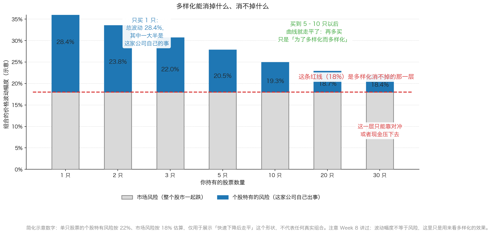

# 第 1 章：多样化与对冲——把鸡蛋放哪

> 本章你将：
> - 知道多样化到底要买几只才够，以及为什么"越多越好"是错的
> - 看懂"多样化能消掉什么、消不掉什么"，并记住那条消不掉的红线
> - 明白"买了 10 只银行股"为什么根本不叫多样化
> - 搞清楚"对冲"到底是什么，普通人该不该做，最便宜的对冲是什么
> - 分清"交易"和"频繁买卖"，知道什么时候该跟市场保持联系、什么时候该离它远一点
> - 最后回答：你的钱应该分成几份、每份之间是什么关系

上一章说，钱要分层：急用的钱、投资的钱、等机会的现金。
这一章接着回答下一层问题：**投资的那部分钱，应该买几只、怎么摆？**

原书把这件事放在第十三章的"降低投资组合风险"下面（p226）。
它先给了一句很重要的定性——组合管理不是选股的附属品，而是一套独立的功夫。

---

## 1.1 选股选得好，不等于组合摆得对

卡拉曼的原话是这样的（p226）：

> "成功管理一只投资组合的挑战不仅仅是作出一系列出色的投资决定。对投资组合的管理就是要求将注意力放在整个投资组合上，考虑多样化投资、潜在对冲策略以及管理投资组合中的现金流。实际上尽管在作出单个投资决定时应考虑风险因素，但投资组合管理是一种进一步降低投资者所面临的风险的手段。"（p226）

这段话里最重要的词，是**"进一步"**。

它的意思是：**你在做每一笔买入时，已经在控制风险了**（算安全边际、看资产负债表、
判断生意好不好——这是 Week 2 到 Week 11 的全部内容）。
但把若干笔单独看都不错的买入放在一起，**它们之间的组合方式本身还会带来新的风险**。

**生活里的例子：** 你请了六位很靠谱的师傅来装修——水电、木工、油漆、瓦工、防水、门窗，
每一位单看都是行业里最好的。但如果他们**同时在同一个房间里干活**，
结果一定是互相踩脚、谁都干不好。师傅没问题，**是安排出了问题**。

组合管理就是那个"安排"。它管三件事：

1. **多样化**：这些钱分散在几种不同的风险上；
2. **对冲**：有没有哪一类风险是我特别怕、需要专门抵消的；
3. **现金流**：钱什么时候进来、什么时候要出去（上一章讲的就是这一条）。

> 📌 **划重点：** 这一章要建立的一个核心观念是：**风险不只藏在每一只股票里，
> 还藏在它们之间的关系里。** 两只单独看都很安全的股票，
> 如果它们会因为同一个原因一起出事，那它们放在一起就不安全。

---

## 1.2 多样化：5 到 10 只就够了

先把词解释清楚。**多样化投资**（也叫分散投资），意思是：
**把钱分散到几只不同的证券上，而不是全部押在一样东西上。**

生活类比就是我们从小就听的那句话——**不要把鸡蛋放在同一个篮子里。**
但这句话只说了一半，下一节会补上另一半。

那么要几个篮子？卡拉曼给的答案很具体（p226）：

> "将投资组合中的风险降至可接受水平所需的证券数量不会很多，通常只要5-10只证券就能做到这一点。"（p226）

**为什么是 5 到 10，而不是 50 或 100？** 因为风险可以分成两层，
而**这两层需要的东西不一样**：

- **个股特有风险**：只有某一家公司会遇到的风险。它的工厂出事、它的新药失败、
  它的老板跑路。这一类风险，你**多买几家就能大幅降低**——
  因为 A 公司出事的时候，B 公司大概率没事。
- **市场风险**：整个股市一起跌的风险。经济下滑、利率上升、市场情绪转冷，
  这时候**所有股票一起跌**，你买多少只都没用。

这张图的形状非常关键：**先陡后平。** 从 1 只加到 5 只，效果巨大；
从 10 只加到 30 只，几乎没有变化。

> ⚠️ **易踩坑：** 注意图里那条**红线**。它告诉我们一件容易被忽略的事：
> **多样化有一个极限。** 你买到第 20 只的时候，组合的波动几乎完全由"整个市场"决定，
> 你再怎么分散也降不下去了。这一层要靠别的手段处理——就是后面的"对冲"和"现金"。

> 💡 **换个说法：** 多样化的作用，是让你**不要因为某一家公司自己出事就伤筋动骨**；
> 它不能让你**躲过整个市场的下跌**。把这两件事分开，你才不会对多样化有不切实际的期待。

> 🇨🇳 **落到 A 股/港股：** 对个人投资者，5–10 只完全可以做到，而且不需要很多钱。
> A 股最低买入单位是 **1 手**（主板、创业板、北交所是 100 股，**科创板是 200 股起**），
> 所以一只 20 元的股票，最低 2000 元就能买。
> 买 8 只，两万元左右就能搭出一个像样的组合。
> 相比之下，"只买一只"最大的问题不是收益低，而是**你判断错一次就没有第二次机会**。

---

## 1.3 为什么"为了多样化而多样化"不明智

现在补上"不要把鸡蛋放在同一个篮子里"的后半句：
**篮子要不一样，而且你要真的知道每个篮子里装的是什么。**

原书对这一点的态度非常干脆（p226–p227）：

> "为了多样化而多样化投资则并不明智。"（p226）

他点了极端多样化投资的鼓吹者的名，说他们"生活在对公司特定风险的恐惧之中"（p227），
并且认为这是一种过分的多样化投资。为什么过分？因为：

> "与对许多所投资的企业一知半解相比，熟悉少数几个企业的许多事情会更有价值。"（p227）

**这句话值得抄下来。** 它的意思是：你的注意力是有限的。
把它摊在 40 家公司上，你对每一家都只有"看过财报"的水平；
把它集中在 6 家上，你可能真的懂它们的生意、知道它们的风险在哪里、
知道它们的价值大概是多少。**而"懂"才是安全边际的前提。**

卡拉曼接着给了一个更锐利的说法（p227）：

> "一些非常好的投资在特定风险水平下产生的回报能高于成百乃至上千个好投资所产生的回报。"（p227）

**这句话怎么理解？** 不是说"找到一只十倍股就够了"。
它的意思是：**如果你的组合里有一半是你根本看不懂的公司，
那么"多买"带来的不是分散，而是把你自己不懂的风险也一起买进来了。**
真正的好投资是稀缺的，找到几个就够；被迫凑数买进来的，
往往是质量下降的那一批。

> 🇨🇳 **落到 A 股/港股：** 一个很常见的场景——某人看到"要分散投资"，
> 于是从各种推荐里凑了 20 只股票。结果他既不知道这 20 家公司分别靠什么赚钱，
> 也不知道哪一只出问题会牵动另外几只。这不是多样化，
> 这是**把一份"看不懂"复制了 20 遍**。

---

## 1.4 多样化的特洛伊木马

**"特洛伊木马"** 这个词要先解释：传说中古希腊人久攻一座城不下，
就造了一只巨大的木马留在城外，城里人以为是战利品，把它拉进城里。
夜里木马里的士兵钻出来，从内部打开了城门。

所以"特洛伊木马"现在指的是：**一个看起来像礼物的东西，其实里面装着能害你的东西。**

卡拉曼用它来形容多样化（p227）：

> "多样化投资有可能成为"特洛伊木马"。"（p227）

他的例子是垃圾债。当时垃圾债市场上的专家大声疾呼：**做了多样化投资的垃圾债组合几乎没有风险。**
听起来很有道理——你不是买一只垃圾债，而是买 200 只，总有几只违约，
但大部分会还本付息，所以很安全。

结果呢（p227）：

> "相信了他们的人最终用多样化投资代替了分析，更糟糕的是，多样化投资蒙蔽了他们的判断力。"（p227）

**这句话是整章的刀锋。** 它说的不是"多样化不好"，而是：

> **当多样化变成一种心理安慰，你就不再做分析了。**

想想这个心理过程：如果你只买一只垃圾债，你会睡不着，会去研究这家公司还得起钱吗；
如果你买了 200 只，你会觉得"风险已经分散了"，于是**把最关键的功课跳过去了**。
而真正的风险恰恰在那里：如果整个高收益债市场的违约率一起上升（Week 6 讲过的
1990 年前后正是如此），那 200 只债券会**一起出问题**——它们本来就是同一种风险。

所以卡拉曼给多样化下了一个和教科书不一样的定义（p227）：

> "毕竟多样化投资不是你拥有了多少种不同的证券，而是你拥有了多少种有着不同风险的证券。"（p227）

**"多少种不同的证券"和"多少种不同的风险"，是两件完全不同的事。**

**生活类比：** 你去超市买饮料，货架上摆着橙汁、苹果汁、葡萄汁、桃汁……
你觉得"我买了 8 种不同的饮料，很丰富"。可如果它们全是同一家厂生产的、
用的都是同一批浓缩果汁，那**你买的其实是同一种东西的 8 个口味**。

> ⚠️ **易踩坑：** 下面这几种"假多样化"，在 A 股/港股 里非常常见——
> - **同一个行业的 10 只股票。** 10 只地产股、10 只银行股、
>   10 只白酒股，看起来是 10 家公司，其实它们会因为同一个原因一起涨跌。
> - **同一个产业链的上下游。** 买了地产公司，又买建材公司，再买家居公司，
>   还买装修公司——它们是一个风险。
> - **同一个大股东旗下的几家公司。** 关联度极高。
> - **"分散"到多只名称不同、但持仓高度重合的基金。** 你以为买了 5 只基金，
>   其实买的是同一批股票。
> - **同一个主题的不同标的。** 5 只新能源、3 只半导体、2 只人工智能，
>   凑起来仍然是一个"市场情绪"风险。
>
> **检查方法很简单：** 写下每一只持仓"最怕什么"。如果三只股票的最怕写的都是同一件事，
> 那它们在你眼里是三个持仓，在风险上是一个。

---

## 1.5 对冲：那层消不掉的风险怎么办

讲完多样化能做什么，卡拉曼马上说了它做不到什么（p227）：

> "无法通过多样化投资来消除市场风险——指整个股市可能会下跌的风险——但可以通过对冲来限制这种风险。"（p227）

**"对冲"是什么？** 生活类比：

- 你开一家冰淇淋店，夏天赚钱、冬天亏钱。你旁边那家卖热饮的店，正好相反。
  于是你们约定：**冬天赚的那部分，分给对方一点；夏天他赚的，分给你一点。**
  这样两家的日子都平稳了——这就叫对冲。
- 更常见的版本是**保险**：你每年花几千元买一份保险，绝大多数年份这笔钱是"白花"的，
  但出事的那一年，它替你兜住了大事。

**准确定义：对冲，就是同时持有一笔能"反向变动"的头寸，
用它来抵消另一笔头寸在某个价格因素上的波动。**

原书举了几种具体的对冲方式（p227–p228）：

| 你持有的组合 | 可以用什么对冲 | 抵消的是什么风险 |
|---|---|---|
| 一篮子大盘股 | 卖出等量的股票指数期货 | 整个股市下跌的风险 |
| 对利率敏感的股票 | 卖出利率期货，或买/卖利率期权 | 利率变动的风险 |
| 矿产类股票 | 卖出黄金期货 | 金价波动的风险 |
| 依赖进出口的股票 | 在外汇市场上做交易 | 汇率变动的风险 |

**先把几个词解释清楚（都是第一次出现）：**

- **指数期货**：一种约定"在未来的某一天，按今天说好的价格买卖某个股票指数"的合约。
  你**卖出**它，意思是"我赌指数会跌"；指数真跌了，这份合约就赚钱，
  刚好补上你股票亏的那部分。
- **期权**：一种"**权利**"，不是义务。比如你花 2 万元买一份"我有权在明年以 100 元
  把某样东西卖给你"的权利。如果那时市价跌到 70 元，你就行使权利，按 100 元卖给他，
  少亏 30 元；如果市价涨到 130 元，你就**放弃**这个权利，损失的只是那 2 万元。
- **期货和期权的区别**：期货是"双方都必须履约"；期权是"买方有权利、卖方有义务"。
  所以**买期权**最多亏掉你付的那笔钱，**卖期权**的风险可能很大。

### 原书的日本案例：一次"顺便赚了钱"的对冲

卡拉曼用了一个很精彩的例子（p228–p229）。背景先交代清楚：

1988 年年中到 1990 年年初，日本股市持续创新高，估值已经超过了美国的估值标准。
但当时日本有一个普遍的看法：**政府间接控制着股市，股市不一定受企业基本面限制**；
而且日本金融机构每年都有大量资金流入，它们非常自信地认为股市会继续涨。
于是它们**愿意以非常低的价格，出售日本股市的"卖出期权"**。

**"出售卖出期权"是什么意思？** 用生活类比：你邻居认为房价绝不会跌，
于是跟你签了一个合同——**他收你 1 万元，承诺"一年内你有权按 100 万元把房子卖给他"**。
在他看来，这 1 万元是白拿的（房价怎么会跌呢）。可如果房价真跌到 70 万元，
你就行使权利，把 70 万元的房子按 100 万元卖给他——**他亏 30 万元，你赚 30 万元。**

华尔街的经纪公司做了中间商，把这些期权从日本卖给了美国投资者。
对美国的股票组合来说，这本来是一个**理论上很诱人的对冲工具**：
便宜，而且如果真的跌了，赔率极高。

**结果如何？** 1990 年年中，日本股市较几个月前的高点**重挫 40%**，
持有这些期权的投资者"根据合约中的具体条款赚到了好几倍的利润"（p229）。

而卡拉曼特意点出了一个讽刺的地方（p229）：**这些期权其实并不"必须"是对冲工具**，
因为日本股市暴跌的时候，美国股市并没有大幅下跌。
所以它们的性质其实是——"这些卖出期权就是一项好投资，并可能出现其他情况时起到对冲风险的作用"（p229）。

**这个案例教我们两件事：**

1. **对冲工具本身可以是好投资。** 当它的价格被人为压低（因为卖方过于自信），
   买它既是对冲，也是一笔有安全边际的买入。
2. **对冲不是"必须做"的动作，而是"划算才做"的动作。**

### 卡拉曼对普通人的提醒：对冲不总是明智

这是本章最实用的一段。原书说得很直接（p228）：

> "对冲并不总是明智的选择。例如，当可以获得足够的回报时，投资者应当愿意承担风险，且坚持不进行对冲。"（p228）

为什么？因为对冲**要花钱、要花时间**（p228），而且：

> "进行对冲可能既耗费资金，又耗费时间，若在对冲时支付了过高的价格，那么无异于对一项投资支付了过高的价格。"（p228）

**这句话非常有分量。** 它把"买对冲"和"买股票"放在了同一个标准下：
**你都要问"这个价格值不值"。** 很多人为了"心里踏实"去买各种结构性产品做对冲，
结果花的钱比它能挡住的损失还多——那不叫保守，那叫**多付了一笔费用**。

> 🇨🇳 **落到 A 股/港股：** 个人投资者能接触到的对冲工具，大致是这些——
> - **股指期货**（如沪深 300 股指期货）：门槛高、一手合约对应的金额大、带杠杆，
>   对新手**不合适**；
> - **ETF 期权**（如上证 50ETF 期权、沪深 300ETF 期权）：需要单独开通权限、
>   有资金门槛和考试，而且期权定价复杂；
> - **黄金 ETF**：可以部分对冲极端风险，但它本身也是一种会涨会跌的资产；
> - **港股通 / 海外资产**：分散单一市场的风险，但会引入汇率风险；
> - **最朴素、最便宜、也最适合普通人的对冲：现金和债券的仓位。**
>
> 卡拉曼自己在演讲里说过，他的公司"从不使用杠杆融资，且有时会持有大量现金"（p264）。
> **"降低仓位"本身就是一种对冲**——你不需要任何衍生品，
> 只需要在觉得整体太贵的时候，少拿一点股票。

> 📌 **划重点：** 对绝大多数个人投资者来说，正确的做法是：
> **先靠多样化消掉个股风险，再靠现金仓位和耐心对付市场风险。**
> 复杂的对冲工具，等你真的有了一个规模很大的组合、并且能算清对冲成本之后再考虑。
> 在那之前，**"不买"就是你最好的对冲。**

---

## 1.6 交易的重要性：交易不是频繁买卖

标题里有个陷阱。"交易的重要性"听起来像是在鼓励你多交易，
但卡拉曼的意思**正好相反**。

他先讲了交易这件事本身为什么重要（p229）：

> "没有一种证券或者一家企业天生就具备了成为诱人投资的因素。投资机会与价格有关，而价格是在市场中形成的。"（p229）

**这句话是整本书的又一次回响：** 好东西不等于好投资，**好价格才是好投资**。
而价格只在市场里出现，所以**你必须和市场打交道**——这就是"交易"的重要性。

但这和"频繁买卖"完全是两回事。他接着描述了价值投资者的日常（p229–p230）：

> "一名价值投资者不会在早上起床的时候知道了自己当天应该设置怎样的买入或者卖出订单，这些决定将视当时的价格以及对潜在价值的持续分析而定。"（p229–p230）

然后是最锋利的一句（p230）：

> "投资者必须认识到，尽管从长远角度来看投资通常是一种正和游戏，但一天之内发生的多数交易都是零和游戏。"（p230）

**"正和游戏"和"零和游戏"** 这两个词要解释清楚：

- **零和游戏**：四个人打麻将，赢的钱总数等于输的钱总数。**有人赚，就一定有人亏同样多**，
  加起来是零。
- **正和游戏**：一家公司今年赚了钱、分了红，**所有股东都能拿到**。
  加起来是正的。

所以卡拉曼的意思是：**长期看，股市是一个正和游戏**——因为公司真的在赚钱，
所有股东理论上都能分享。**但一天之内的交易是零和的**——
你买到的便宜货，一定是有人以便宜的价格卖给你的；你付出的高价，一定有人收走了。

> 💡 **换个说法：** 短线交易是一个"我从别人口袋里掏钱"的游戏；
> 长期投资是一个"公司赚钱、大家一起分"的游戏。
> 前者需要你比别人更快、更聪明、信息更多；后者只需要你**有耐心、算得清、买得便宜**。
> **作为一个业余投资者，你唯一有胜算的是后者。**

那"交易"在这里到底是什么？卡拉曼给了定义（p230）：

> "交易就是利用这种价格错误的过程。"（p230）

**注意这句话的主语不是"频繁"，而是"价格错误"。** 没有价格错误，就不该有交易。
原书写得很生动（p230）：

> "当其他人感到恐慌并以大幅低于潜在价值的价格卖出的时候，他们为价值投资者创造了买入的机会。"（p230）

所以"交易"的正确用法是：**平时不动，等别人犯错。**

---

## 1.7 与市场保持联系——但别被它带走

这一节回答一个很现实的问题：**买完之后，我该不该天天看盘？**

原书的回答有一点反直觉。他先否定了"买完就藏起来"（p230–p231）：
那种"把自己投资的证券隐藏好几年"的策略，在今天看来"已经被误导了"。原因是（p231）：

> "脱离市场的投资者将发现难以接触到市场不时创造出来的买入和卖出机会。"（p231）

**为什么？** 因为市场是"多产的投资机会创造者"。
一家公司被调出指数、一个行业突然被政策打击、一家公司宣布分拆——
这些事件会周期性地制造出错误定价（Week 10 讲的六种机会就是这么来的）。
**你如果完全不看，这些机会跟你没关系。**

但卡拉曼紧接着就转了弯（p231）：

> "然而，与市场保持联系确实会带来危险。"（p231）

危险有两个：

**危险一：你会被市场带走。** 他描述得很形象——投资者会沉溺于市场的每一次上涨和下跌，
"最终会进行短线交易"，而且：

> "人们会随着市场的波动而出现波动，并愿意跟人群一起行动。"（p231）

**注意这里的反差：** 原书用的词是"跟人群一起行动"。
而价值投资者要做的事，恰恰是**不跟人群一起行动**——这句话我们在 Week 10
讲逆向思维的时候见过（"逆向投资者一开始几乎总是错的"）。

**危险二：经纪人会给你"可乘之机"。** 这一段值得每个人记住（p231）：

> "永远不要将整个投资组合依赖于一名经纪人的建议，该说"不"的时候就说"不"。"（p231）

**为什么特别提这一条？** 因为经纪人的收入来自交易佣金（Week 4 讲过这件事的结构）。
一个每天给你打电话推荐股票的经纪人，未必是坏人，
但他和你的利益**天生不完全一致**：他希望你多动手，而你最好少动手。

> 📌 **划重点：** "与市场保持联系"的正确姿势是：
> **定期接触，而不是持续接触。**
> - 定期：每周或每月固定看一次持仓公告、财报和价格，做一次记录；
> - 持续：一有空就刷行情、看股吧、听消息——这是把自己交给市场先生的情绪（Week 3）。
>
> 卡拉曼说，如果一个人无法抵挡"跟人群一起行动"的冲动，
> 那他"可能不应与市场保持密切的联系"（p231）。
> **这句话是对你诚实的要求：先看清自己是哪种人，再决定看盘的频率。**

---

## ✍️ 想一想

1. 有人说："我买了 12 只股票，所以我很分散。"请设计三个问题，
   帮他在五分钟内判断这 12 只是不是真的分散。
2. 卡拉曼说"多样化投资不是你拥有了多少种不同的证券，而是你拥有了多少种有着不同风险的证券"。
   请用这句话解释：**为什么买 5 只不同基金公司的沪深 300 指数基金，等于只买了 1 只？**
3. 有一款"对冲型"理财产品，每年收你本金的 2% 作为费用，承诺"市场跌的时候能减少损失"。
   用本章的标准，你该怎么判断它值不值得买？

> 💡 **参考思路：**
>
> 1. ① **它们最怕什么？** 让每只股票写一句"它最怕的那件事"。
>    如果超过一半的答案指向同一件事（比如房价下跌、利率上升、油价下跌），
>    那它们就是一个风险。
>    ② **它们靠什么赚钱？** 如果赚钱的方式是同一套逻辑（都是靠地产开工量、
>    都是靠出口订单），那它们会一起好、一起坏。
>    ③ **它们会不会同时出事？** 想象一个坏消息，看它一次性打中几只。
>    打中 1–2 只，是真分散；打中 8 只，那就是一只。
> 2. 因为**风险不是来自"哪家公司发行"，而是来自"它持有什么"**。
>    所有跟踪沪深 300 的指数基金，买的基本是同一批股票、按同样的权重。
>    换一家基金公司、换一个基金代码，并没有换来一种新的风险——
>    你只是把同一份风险分成了五份来持有。这同时还会增加你的管理成本。
>    真正的分散是跨**风险来源**：不同行业、不同市场（A 股和港股）、
>    不同资产（股票和债券），而不是同一批股票的不同包装。
> 3. 按 p228 的标准问三个问题：
>    ① **它到底对冲了什么风险？** 如果它只是"减少波动"，那你先要问自己：
>    波动是我真正的风险吗（Week 8 讲过：波动不等于风险）？
>    ② **它的成本是多少？** 每年 2% 是**确定的支出**，而对冲掉的那部分损失是**不确定的**。
>    你要比较的是"确定付出的 2%"和"它替你挡住的期望损失"。
>    ③ **我自己有没有更便宜的替代？** 比如把股票仓位从 90% 降到 70%，
>    这件事的成本可能是零，而且简单透明。
>    结论：在**年费率 2%** 这个量级上，绝大多数个人投资者都应该选择更朴素的方案。

---

## 🧮 算一算

这一节算一道题：**多样化到底能替你挡住多少钱？**
这道题会用到 Week 3 学过的"亏损之后要涨多少才回本"。

**情境（简化示意数字，用于教学）：**

你有 **30 万元**。这一年发生了两件事：

- 整个股市下跌了 **18%**（这就是"市场风险"那一层）；
- 其中有一家公司（我们叫它 A 公司）**自己出了事**——财务造假被查，
  在"大盘跌 18%"的基础上又额外暴跌，一年下来总共跌了 **70%**。

你面前有两种买法：

- **买法甲**：30 万元全部买入 A 公司这一只股票；
- **买法乙**：30 万元平均买入 6 只股票（每只 5 万元），
  其中一只正好是 A 公司，另外 5 只跟随大盘各跌 18%。

### 第 1 步：算买法甲的损失。

`30 万 乘以 (1 - 70%) = 30 万 乘以 0.30 = 9 万元`

账户从 30 万元变成 **9 万元**，亏了 `30 - 9 = 21 万元`。

### 第 2 步：算买法乙里，A 公司那一份的损失。

`5 万 乘以 0.30 = 1.5 万元`

### 第 3 步：算买法乙里，另外 5 只的损失。

它们的总市值是 `5 万 乘以 5 = 25 万元`：

`25 万 乘以 (1 - 18%) = 25 万 乘以 0.82 = 20.5 万元`

### 第 4 步：算买法乙的账户总值和损失。

`1.5 万 + 20.5 万 = 22 万元`

损失是 `30 - 22 = 8 万元`。

### 第 5 步：把两种买法放在一起。

| | 买法甲（全押一只） | 买法乙（平均买 6 只） |
|---|---|---|
| A 公司出事后那一份 | 30 万 → 9 万 | 5 万 → 1.5 万 |
| 其余部分 | 无 | 25 万 → 20.5 万 |
| 账户总值 | 9 万元 | 22 万元 |
| 亏了多少钱 | 21 万元 | 8 万元 |

### 第 6 步：算"回本需要涨多少"。

这两笔投资，回到 30 万元各需要涨多少？

- 买法甲：`30 万 除以 9 万 = 3.333`，也就是需要涨 **233.3%**；
- 买法乙：`30 万 除以 22 万 = 1.364`，也就是需要涨 **36.4%**。

**233.3% 和 36.4% 的差距，就是多样化的价格。**

### 第 7 步：一个必须做的补充实验。

现在假设这 6 只股票**全是同一个行业的**（比如 6 只地产股）。
那么"大盘跌 18%、只有一只出事"这个前提就不成立了——
行业一出问题，6 只一起跌 70%。这时：

`30 万 乘以 0.30 = 9 万元`

**和全押一只的结果完全一样。**

> 📌 **划重点：** 这道题真正的结论不是"要买 6 只"，而是：
> **多样化的效果，完全取决于这 6 只之间"是不是同一种风险"。**
> 6 只不同风险的股票，能把你从"亏 21 万、要涨 233% 才回本"救到"亏 8 万、要涨 36% 才回本"；
> 6 只同一种风险的股票，一分钱都救不了。
> **所以在按买入键之前，先用原书那句话问自己一次：
> 你拥有了多少种有着不同风险的证券？**（p227）

---

## ✅ 小测验

**1. 关于多样化，下面哪种说法最符合原书的意思？**
A. 持有的证券数量越多越好，最好超过 50 只
B. 通常只要 5–10 只就能把风险降到可接受水平，为了多样化而多样化并不明智
C. 只要买得足够多，就能完全消除市场下跌的风险
D. 多样化会降低收益，所以价值投资者不应该做多样化

**2. 卡拉曼说"多样化投资有可能成为特洛伊木马"，他想表达的是？**
A. 多样化一定会让投资者亏钱
B. 多样化会让人用"我已经分散了"代替真正的分析，从而蒙蔽判断力
C. 多样化只适合机构，不适合个人
D. 多样化必须配合杠杆使用

**3. 根据本章，个人投资者最朴素、最便宜的对冲方式是什么？**
A. 买复杂的结构性理财产品和期权组合
B. 用股指期货给自己的组合加空头
C. 调整仓位——在市场整体偏贵、找不到好机会时多留现金和债券
D. 每天都做一次买卖来"锁定收益"

> **答案与解析**
>
> **1. B。** 原书 p226 说"通常只要5-10只证券就能做到这一点"，
> 并且明确说"为了多样化而多样化投资则并不明智"。
> A 是原书批评的那种极端多样化投资的鼓吹者，原书说他们"生活在对公司特定风险的恐惧之中"（p227）；
> C 错了：多样化消除不了市场风险，"无法通过多样化投资来消除市场风险"（p227），
> 那要靠对冲或现金；D 与本周内容相反——卡拉曼把多样化列为
> "稳健的买入和卖出策略、合理的多样化投资以及谨慎的对冲"之一（p235）。
>
> **2. B。** 原书 p227 的原话是"相信了他们的人最终用多样化投资代替了分析，
> 更糟糕的是，多样化投资蒙蔽了他们的判断力"。
> 关键在于"代替了分析"这四个字——多样化本身没错，
> 错的是**把它当成免做功课的借口**。A 太绝对；C、D 都不是原书的意思。
>
> **3. C。** 原书 p228 说"当可以获得足够的回报时，投资者应当愿意承担风险，
> 且坚持不进行对冲"，而对冲"可能既耗费资金，又耗费时间"，
> 支付过高价格买对冲"无异于对一项投资支付了过高的价格"。
> 对个人投资者来说，最便宜的"对冲"就是**少拿一点股票**。
> A、B 的成本和复杂度都远超普通人能算清的范围；
> D 恰好是原书反对的频繁交易。

---

## 📖 回到原书

- 对应原书 **第十三章** 的"降低投资组合风险""合理的多样化投资""对冲"
  "交易的重要性""与市场保持联系"几节，
  `raw/安全边际-中文版/page_226.md` ~ `page_231.md`（原书 p226–p231）。
- **建议精读：**
  - p226：组合管理是"进一步"降低风险的手段、5–10 只就够、"为了多样化而多样化"不明智；
  - **p227（本章最重要的一页）**：熟悉少数几个企业更有价值、特洛伊木马、
    "多少种不同风险的证券"、多样化消不掉市场风险；
  - p228–p229：对冲的四种具体做法、日本卖出期权的完整案例、
    "对冲并不总是明智的选择"；
  - p229–p230：交易的重要性、"一天之内发生的多数交易都是零和游戏"；
  - p231：与市场保持联系的两个危险。
- **可以略读：** p228–p229 里日本金融机构出售期权的动机细节，
  知道"他们太自信，所以把期权卖得很便宜"就够了——那是 1990 年日本的特殊背景。
- **原书金句（逐字引用）：**
  > "将投资组合中的风险降至可接受水平所需的证券数量不会很多，通常只要5-10只证券就能做到这一点。"（p226）
  > "与对许多所投资的企业一知半解相比，熟悉少数几个企业的许多事情会更有价值。"（p227）
  > "相信了他们的人最终用多样化投资代替了分析，更糟糕的是，多样化投资蒙蔽了他们的判断力。"（p227）
  > "毕竟多样化投资不是你拥有了多少种不同的证券，而是你拥有了多少种有着不同风险的证券。"（p227）
  > "无法通过多样化投资来消除市场风险——指整个股市可能会下跌的风险——但可以通过对冲来限制这种风险。"（p227）
  > "投资者必须认识到，尽管从长远角度来看投资通常是一种正和游戏，但一天之内发生的多数交易都是零和游戏。"（p230）
  > "永远不要将整个投资组合依赖于一名经纪人的建议，该说"不"的时候就说"不"。"（p231）

上一章说钱要分层，这一章说钱要分几种风险。
下一章是全课程最重要的一章——**当你决定动手时，具体该怎么买、什么时候该卖。**
卡拉曼说得很坦白：买入有一半是纪律问题，而卖出，是投资里最艰难的决定。
