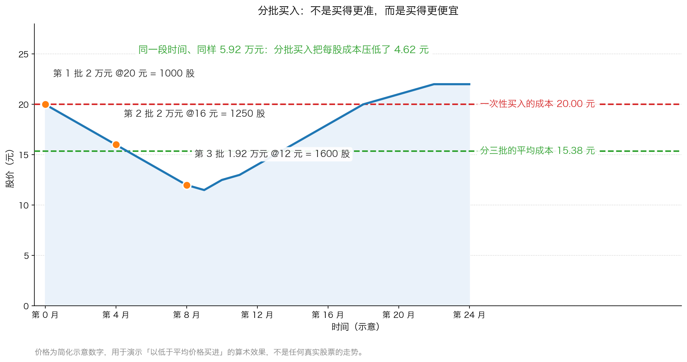
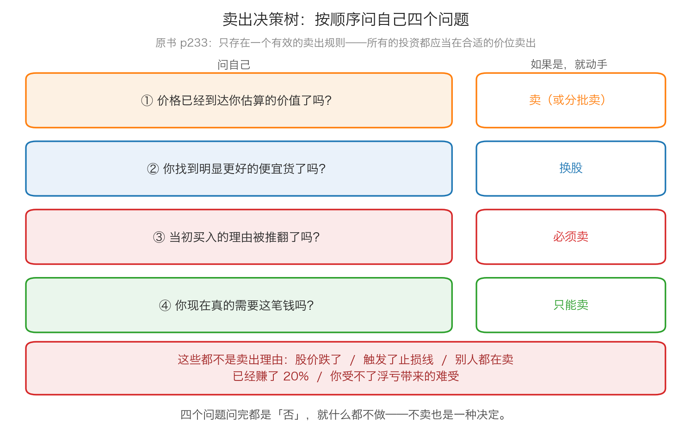

# 第 2 章：买入与卖出——最艰难的决定

> 本章你将：
> - 学会"分批买入"的具体做法，并能手算出分批之后的每股平均成本
> - 明白"以低于平均价格买进"和"越跌越买来摊平错误"是两件完全不同的事
> - 看懂卖出为什么比买入难——不是因为你不够聪明，而是结构上就难
> - 拿到卡拉曼给的四个卖出问题，以及一份"什么不是卖出理由"的清单
> - 知道为什么"止损订单"被原书称为疯狂的做法
> - 最后回答：怎么把"按买入价做决定"换成"按企业价值做决定"

上一章讲的是"钱怎么摆"。这一章是全课程最后一次讲"动作"——
**当你真的坐下来，打开交易软件，准备按下那个按钮的时候，你要做什么。**

原书对这个话题的开场非常克制（p231）：

> "交易时唯一最重要的一个关键因素就是应对价格的波动作出合适的反应。投资者必须学会抵制恐惧、贪婪，以及当价格上涨时变得过于热情的这种倾向。"（p231）

然后他给了一句总结（p231）：

> "交易的一半是学会如何购买。"（p231）

买入这一半，原书只用了一页多（p231–p232）就讲完了，原则简单到几乎让人失望。
而卖出那一半，他写了三页（p232–p234），还反复说"困难"。
**这个篇幅的对比本身就是信息。**

---

## 2.1 买入的第一条纪律：不要一开始就满仓

先解释一个词。**"满仓"** 在这里的意思不是"把全部身家都买成股票"，
而是（p231–p232）：

> "投资者通常应避免马上"满仓"（指他们打算最大限度投资多少资金）持有一种证券。"（p231–p232）

括号里那句才是关键：**"他们打算最大限度投资多少资金"**。
也就是说，假设你决定在某只股票上最多投 6 万元，
那么**不要第一天就把这 6 万元全部买进去**。

**为什么？** 卡拉曼的理由极其现实（p232）：

> "没有听从这一建议的投资者到时可能只有无助地看着下跌的价格了，而手头上已经没有了可以进行投资的储备金。"（p232）

**生活类比：** 你去一个陌生的城市旅游，第一顿饭走进一家没吃过的餐厅，
你会先点一个招牌菜试试，还是直接把菜单上十道菜全点了？
当然是先试一个。**不是因为你不相信自己的判断，而是因为你知道自己的判断可能会错。**

投资里，"先点一个菜"就是先建一部分仓位。原书接着说出了这么做的意义（p232）：

> "建立一部分仓位能够保留储备金，如果价格出现下跌，投资者可以使用这些资金"以低于平均价格买进"，从而降低每股的平均成本。"（p232）

**"以低于平均价格买进"** 这个词很重要，它现在有一个更通俗的说法：**摊薄成本**——
在更低的价格继续买入同一只证券，把你手里每一股的平均成本拉下来。

> 📌 **划重点：** 分批买入的核心不是"买得更准"，而是**买得更便宜，并且给自己留下第二次机会**。
> 你放弃的是"如果它不跌，我就少赚一点"；你换来的是"如果它跌了，我还有子弹"。
> 回顾 Week 7 的桥：这座桥的设计承重是 3 万磅，你只走 1 万磅。
> **分批买入就是投资里的"只走 1 万磅"。**

### ★ 一个必须分清的界线：摊薄成本不等于摊平错误

这是本章最容易出事的地方，请务必读两遍。

卡拉曼给了一个判断标准（p232）：

> "在购买之前，如果你意识到自己不愿以低于平均价格买进，那么你可能不应在一开始就买入。"（p232）

**这句话反过来读，就是分批买入的前提：**
你之所以愿意在更低的价格继续买，**是因为在这个更低的价格上，这笔投资变得更划算了**——
你对这家公司的判断没有变坏，只是价格变便宜了。

而"摊平错误"是完全另一回事：**公司的基本面已经变坏了**（业绩暴雷、财务造假、
行业逻辑被推翻），你不肯承认自己看错了，于是用"再买一点把成本摊低"来安慰自己。
这时候你买的不是便宜，是**在往下掉的刀子上加仓**。

原书在 p232 末尾列了几类应该被直接否决的企业——
"管理不善、使用高杠杆、业务缺乏吸引力或者难以理解的企业"（p232）——
它们的"潜在投资机会"可以被辨认出来，然后**被否决**。
这句话在讲什么？**有些企业你根本不该开始买，那样就不存在"要不要摊平"的问题。**

| | 摊薄成本（对） | 摊平错误（错） |
|---|---|---|
| 买入理由 | 没变，甚至更清楚了 | 其实已经被推翻，只是你不愿意承认 |
| 价格下跌的原因 | 市场情绪、大盘拖累、暂时的坏消息 | 生意本身变坏了（订单没了、造假被查） |
| 你的感觉 | 平静，甚至有点高兴 | 焦虑，急着"把成本做低好回本" |
| 加仓的钱 | 计划内留好的储备金 | 临时挪来的、甚至是借来的 |
| 结果 | 平均成本下降，安全边际变厚 | 亏损放大，最后连本金都保不住 |

> ⚠️ **易踩坑：** 有一个非常简单的自检问题，能帮你分清这两件事：
> **"如果我现在一股都没有，我会在这个价格买入吗？"**
> 会——那你在摊薄成本；不会，只是想摊平那个已经亏损的数字——那你在做一件危险的事。
> 这个问题和上一章讲的"排堵效应"、和本章后面要讲的卖出问题，是同一个问题。

---

## 2.2 分批买入长什么样：一张图和三个方案

常见的分批方案有三种，你可以按自己的情况选：

**方案一：按价格分批（最符合原书的意思）。**
先定一个"我愿意开始买"的价格，在那里买第一批；
然后**提前**写下第二批、第三批的触发价格。比如：

| 批次 | 触发条件 | 买入金额 | 对应安全边际 |
|---|---|---|---|
| 第一批 | 价格到达你算出的买入上限 | 三分之一 | 刚过你定的纪律线（比如 20%） |
| 第二批 | 再跌 15%–20% | 三分之一 | 更厚 |
| 第三批 | 再跌 15%–20% | 三分之一 | 最厚 |

**方案二：按时间分批（定投）。**
不管价格，每个月（或每季度）固定投入一笔钱。它的好处是**完全不需要预测**，
坏处是**它不看价格**——贵的时候也在买。所以定投更适合指数基金，
不太适合"我算出了它值 25 元，现在只要 12 元"这种有明确估值判断的个股。

**方案三：按比例分批（先建半仓）。**
先建一半仓位，剩下的一半留给"跌下来"或者"想得更清楚了"这两个条件。

> 💡 **换个说法：** 三种方案没有优劣，它们都在做同一件事：
> **把"一次决定"拆成"几次决定"，让每一次决定都更小、更可承受。**
> 人在一次要押上全部资金的时候最容易犯错；分成三次，你的情绪就没那么大能量了。

> 🇨🇳 **落到 A 股/港股：** 两个实操细节——
> - **A 股按"手"交易，1 手 = 100 股。** 所以每批的金额要能凑够整数手。
>   这也是本章"算一算"里第三批为什么是 1.92 万元（12 元 乘以 1600 股）而不是 2 万元。
> - **港股按"手"交易，但每只股票的一手股数不一样**：有的 100 股一手，
>   有的 500 股、1000 股甚至 2000 股一手。下单前一定要先看清"每手股数"，
>   否则你的分批计划会被最小交易单位打乱。

---

## 2.3 卖出：最艰难的决定

现在进入本章的核心。原书的这一节标题就叫"卖出：最艰难的决定"（p232），第一句话是：

> "许多投资者都能找到便宜货，但知道何时卖出却比较困难。"（p232）

**为什么难？** 卡拉曼给的第一层理由是技术层面的（p232）：

> "理由之一是难以精确地知道一项投资的价值。一名投资者在购买的时候会有一个价值范围，并以能够提供相当大安全边际的价格买入。然而，当价格上涨的时候，安全边际就开始下降，潜在回报开始减少，而下跌风险开始增加。因不知道这项投资的确切价值，投资者自然无法像作出买入决定时那样自信地作出卖出决定。"（p232）

这段话信息量非常大，我们逐句拆开。

**第一句：难以精确地知道一项投资的价值。**
这句在 Week 9 整整讲了一周——**价值是一个范围，不是一个点**。
同一家公司，用不同的方法估，可能估出 18 元到 30 元这么大一片。

**第二句：买入的时候，安全边际为你当了裁判。**
买入那一刻，你的判断标准是清晰的：保守价值 25 元，价格 15 元，安全边际 40%，
够厚，买。**这是一个"过线/不过线"的判断，它给你确定性。**

**第三句：价格一涨，安全边际就变薄了。**
价格从 15 元涨到 20 元再到 24 元，你估的价值还是 25 元没变，
但安全边际从 40% 掉到 20%，再掉到 4%。**你的"过线"标准不再给你信号了。**

**第四句：于是你没法像买入时那样自信。**
因为**"继续持有"这件事没有裁判**。价格 22 元时，它既没有高到"必须卖"，
也没有低到"必须买"，它**落在你自己估的那个价值区间里面**。
你要在这个模糊地带做一个不可以撤销的决定（卖掉之后它可能继续涨），
当然会痛苦。

**生活类比：** 买入像考试的及格线，60 分就过，你有明确的标准；
卖出像在 60 分到 100 分之间的某一处喊停，**没有任何一条线告诉你该在哪里停**。

### 除了"看不清价值"，还有五个心理陷阱

卡拉曼只写了技术层面的理由，但现代行为金融学（以及 Week 3 讲过的"昂贵的情绪"）
告诉我们，卖出难还有五个人性层面的原因。这部分**不是原书的原文**，
是我们把 Week 3 学过的内容接到这里来用：

**陷阱一：锚定在买入价上。**
你的大脑会偷偷把"我的成本是 18 元"当成一个参照点，然后所有判断都绕着它转。
于是"赚了 10%"和"亏了 10%"变成了两种完全不同的心情——
可这家公司根本不知道你是在什么价格买的。
**提醒：市场不知道你的成本，你的成本对这家公司的价值没有任何影响。**

**陷阱二：处置效应——卖掉赚钱的，留着亏钱的。**
因为卖掉赚钱的能带来"我做对了"的快感，卖掉亏钱的需要承认"我做错了"的痛苦。
结果你的账户里**留下的全是输家，卖掉的都是赢家**。这正好和"让赢家跑、把输家砍掉"
的直觉相反，但它是大多数人真实的行为。

**陷阱三：后悔厌恶。**
你卖掉之后它涨了，那种难受**远远超过**"我没买但它涨了"。
因为前者意味着"这个决定是我做的"。为了避免这种后悔，很多人干脆不卖——
**但"不卖"也是一个决定**，而且它同样可能是错的。

**陷阱四：沉没成本。**
"我已经亏了 30%，现在卖就是把亏损坐实了。"——
这句话里没有一处和公司未来的价值有关。已经亏掉的钱**不会因为你继续拿着而回来**。

**陷阱五：卖出缺少触发器。**
买入往往被一个具体事件触发（跌到你的价位、财报出来你看懂了）。
而"继续持有"是**默认选项**，它不需要你做任何事。
人天生倾向于维持现状——**所以"不卖"经常不是判断的结果，只是懒惰的结果。**

> 📌 **划重点：** 把上面这些合起来看，你会发现卖出的难，**不是能力问题，是结构问题**：
> 买入有安全边际当裁判、有具体事件当触发器、有明确的动作；
> 卖出什么都没有，还要对抗五种心理本能。
> **所以你不能靠"到时候再说"。你必须提前把规则写下来。**

### 原书否定的四种卖出规则

卡拉曼在 p232–p233 列了几种常见的做法，然后逐条否掉。这一段很值得完整读：

**否定①：用估值倍数定规则。** 有些投资者根据价格与账面价值比（P/B）
或者市盈率（P/E）制定卖出规则，一旦比率达到某个水平就卖。原书的评价是（p233）：

> "这些规则毫无道理。"（p233）

**为什么毫无道理？** 因为**倍数本身不是价值**。
一家公司的市盈率从 10 倍涨到 20 倍，可能是它变贵了，
也可能是它的盈利能力真的提升了一倍（Week 2 讲过：市盈率的分母是会变的）。
用一个固定的倍数当卖出线，等于**放弃对企业的判断**。

**否定②：买入时就设定好卖出价格。** 原书说这种做法"就像在整个投资期间不会发生
任何会影响卖出决定的事情一样"（p233）——可现实中，公司会变、行业会变、
你自己的理解也会变。

**否定③：用"止损订单"。** 这是原书用词最重的一条（p233）：
这种预先设定"跌到某个价格就自动卖出"的做法，虽然看起来是一种限制下跌风险的手段，
但"实际上这是一种疯狂的做法"。理由是这样做的投资者（p233）：

> "并没有利用价格下跌来增加自己的头寸，他们的行为就像是市场比他更了解这一特定投资的价值。"（p233）

**这句话是整章的刀锋。** 你设一个比成本低 10% 的止损线，价格跌到那里自动卖出——
这个动作在说什么？它在说：**"市场知道得比我多，市场说它不值这个价，我就认了。"**
可你研究这家公司研究了几十个小时，市场只是把报价往下调了 10%。
**你把判断权交给了那个情绪化的报价员**——这正是 Week 3 讲的"把市场先生当指导"。

**否定④：把卖出当成一个独立的技巧。** 原书说，唯一有效的规则只有一条（p233）：

> "实际上，只存在一个有效的卖出规则：所有的投资都应当在合适的价位卖出。"（p233）

这句话听起来像废话，但它其实是在说：**卖出的标准必须和你买入的标准是同一套。**
你当初为什么买？因为价格大幅低于价值。那么你什么时候卖？
**因为价格不再大幅低于价值了**（或者有别的更好的便宜货）。就这么简单。

### 卡拉曼给的卖出依据

把 p233–p234 的内容整理一下，原书其实给了三类合法的卖出理由。
（**请注意：这个"三类"的分类是我们整理的，不是原书的原话**；
每一条后面引用的句子都是原书原文。）

**依据一：价格已经不再便宜了。**
这是最直接的一条。你的股票涨到接近你估的价值，安全边际消失，
潜在回报减少而下跌风险增加（p232），这时候就应该考虑卖出。

**依据二：你找到了明显更好的机会。**
原书在这一段讲得特别清楚（p233）：

> "同买入决定一样，卖出决定必须以企业价值为基础。究竟何时卖出——或者买入——依赖于是否可以获得其他投资机会。"（p233）

他接着举了个例子（p233）：

> "例如，你应当为实现部分或者全部的价值而继续持有吗？当市场提供了许多便宜货的时候，为了能在一只价格略低于潜在价值的股票中获得有限的额外回报而坚持持有的做法是愚蠢的。相反，如果你的股票依然大幅被低估，或者如果找不到更好的便宜货，那么你就不会希望对这只股票继续获利了结。"（p233）

**这段话的意思是：卖出从来不是一个孤立的问题，它是一个"比较"问题。**
不是"这只股票好不好"，而是"**在这只股票和所有其他我能买的东西之间，哪一个更划算**"。
如果没有更好的选择，那么即使它已经涨了一些，继续拿着也可能是对的。

**依据三：你真的需要这笔钱（流动性）。**
原书说得很实在（p233）：

> "在卖出决定中，对流动性的考虑也很重要。对许多证券而言，市场深度以及报价都是一个重要的考虑因素。毕竟在没有买家的情况下，你是无法卖出的，因此，存在买家的可能性必然成为卖出决定中的一个考虑因素。"（p233）

**"市场深度"** 这个词要解释：它指的是**在不大幅影响价格的前提下，市场能吃掉多少成交量**。
深度好的股票，你卖 100 万元对价格没什么影响；深度差的股票，
你卖 10 万元就把价格砸下去 3%。

卡拉曼在这里引了一句很有意思的行业老话（p234）：

> "当小鸟饥饿的时候，你必须喂它们吃的。"（p234）

它的意思是：**当市场愿意出好价钱的时候，你要舍得卖。**
行情好的时候你不卖，等到你想卖的时候，可能已经没有买家了——
这就是上一章讲的"流动性是幻觉"。

**（补充）依据四：当初的买入理由被推翻了。**
这一条**原书没有单独列出**，但 p234 的一组反问指向了它：

> "如果遵从了价值投资哲学的投资者依然认为何时卖出有些困难，那么我就会问下面这样一些问题：如果你不是根据那些价格高于潜在价值作出购买决定，你如何决定何时卖出？如果你正对那些价格高于潜在价值的证券进行投机，你会在什么时候进行获利了结，或者进行止损？除了"它们正如何波动"外，而事实上这根本不是一个能够提供指引的标准，你还有其他的指导依据吗？"（p234）

**这段话有点绕，我们翻译一下：** 卡拉曼是在反问——
如果你的买入依据是"价格低于价值"，那你的卖出依据自然就是"价格不再低于价值"。
**除此之外你还能依据什么？依据它涨了还是跌了？那根本不是一个标准。**

所以，如果当初让你买入的那个理由**消失了或者反过来了**
（比如：你以为它有一块被低估的土地，结果那块地被判了污染、不能开发），
那你持有的理由就不存在了，**这时候卖出不是因为价格，而是因为你的判断被证伪了。**

### 什么情况下**不**该卖：一张反面清单

把上面这些反过来说，就是本章最实用的那张表：

| 看起来像卖出理由 | 为什么它不是 |
|---|---|
| 股价跌了 20% | 价格下跌本身不改变企业价值。如果你算的价值没变，跌下来只是安全边际变厚了 |
| 触发了你设的止损线 | 原书说"实际上这是一种疯狂的做法"（p233）——那等于承认市场比自己更懂这家公司 |
| 你已经赚了 20% | "赚了 20%"和"它现在值多少钱"没有任何关系。你应该问的是安全边际还剩多少 |
| 别人都在卖 / 大盘在跌 | 这是市场先生的情绪，不是关于这家公司的信息（Week 3） |
| 你受不了浮亏带来的难受 | 这是你的情绪问题，该解决的是仓位大小，不是把股票卖掉 |
| 你急需用钱 | **这一条是例外**——它是真实的理由，但它说明的是你**当初的仓位管理出了问题**（第 0 章） |

> ⚠️ **易踩坑：** 上面那张表里，最危险的是第二行和第三行，
> 因为它们**看起来像纪律**。"止损"和"止盈"这两个词在中文投资语境里非常流行，
> 听起来很专业、很有原则。但请记住卡拉曼的标准：
> **凡是把"价格相对于你的成本"当依据的规则，都不是价值投资的规则。**
> 依据只能是"价格相对于价值"。

### 卖出也可以分批

如果你的股票已经接近你估的价值，但你还不确定它是不是真的到头了，
**不需要一次性全部卖掉**。可以分批：先卖三分之一或者一半，
剩下的继续观察。这样做的理由是：

- 你对价值的估计本来就是一个范围（Week 9），在价值区间上沿附近，
  "卖一部分"比"全部卖"或"全部不卖"都更符合这个不确定性；
- 它降低了"卖早了后悔"的痛苦，让你更容易执行；
- 它把一次大决定变成几次小决定——和分批买入是同一个心理学原理。

> 🇨🇳 **落到 A 股/港股：** 卖出时的三个实操细节——
> - **A 股 T+1**：今天买的明天才能卖；港股 T+0，当天可以买卖。
> - **卖出的价格可能比你看到的差。** 成交不活跃的股票（很多港股小盘股、
>   A 股的冷门股），你挂出去的价格和实际成交价可能差 1%–3%，
>   数量大时更明显。**这就是"市场深度"**，它会影响你到底能拿回多少钱。
> - **费用**：A 股卖出要交印花税和券商佣金，港股还要交交易费、交易征费等。
>   频繁买卖会让这些成本累积得很快——这也是原书说"一天之内发生的多数交易
>   都是零和游戏"（p230）的现实含义。
> - **关于"止盈止损"**：A 股交易软件里普遍提供"条件单"功能（达到某个价格自动委托）。
>   工具本身是中性的，但你要清楚：**用它来执行"价格 vs 价值"的规则，
>   和用它来执行"价格 vs 我的成本"的规则，是两件完全不同的事。**

---

## 2.4 怎么跟券商打交道

这一节原书放在卖出后面，标题是"利用把你看作重要客户的经纪人"（p234）。
它说的是美国 1991 年的股票经纪人，但结构今天完全一样。

**先解释"经纪人"是什么。** 在你的语境里，对应的就是**券商和你的客户经理**。
你通过券商下单买卖，券商收佣金；很多客户经理还会给你推荐股票、
发研究报告、拉你进各种群。

**原书的核心观点：找那些把你看作重要客户的经纪人。**
原因是他和你之间能不能形成**长期互利关系**（p234）：
如果客户感到自己的利益被尊重、经纪人把佣金放在第二位，
双方就可能建立长期关系；反过来（p234）：

> "那些收取了高昂的佣金，或者一再推荐只产生更多佣金而不带来更多投资回报的交易的经纪人最终将失去客户。"（p234）

**这句话的机制，Week 4 已经讲透了：** 券商的收入来自"你动手"，
而不是"你赚钱"。每多一次交易，就多一份佣金。所以一个不断给你推荐交易的经纪人，
**未必是坏人，但他的激励结构和你不一致。**

原书还提醒了一件事（p235）：

> "你不希望看到毫无经验的经纪人通过牺牲你的利益来获取经验"（p235）

然后他给了一个非常务实的建议——**找一个还在上升期的经纪人**（p235）：

> "一种方法就是与一名相对年轻但有能力、未来将在公司内取得更多权利和地位的经纪人建立起关系，对这位经纪人而言，你是他眼前非常重要的客户。"（p235）

**为什么这个建议好？** 因为大客户拿到的服务，小客户拿不到；
但如果你在一个经纪人还年轻、客户还不多的时候就跟他建立关系，
**你在他那里的分量会比你实际资金量更大。** 这在 A 股/港股 里同样适用：
同一个券商，不同客户经理愿意花在你身上的时间差别很大。

> 🇨🇳 **落到 A 股/港股：** 把你的券商当成**通道**，而不是**大脑**。
> - **通道**：开户、下单、行情、持仓查询、打新、转账——这些它做得很好，
>   而且现在佣金普遍很低，你应该货比三家。
> - **大脑**：买什么、什么时候买、什么时候卖——**这部分它替不了你**。
>   它给你的研报、荐股、投顾建议，可以看，但要记住它们背后的商业模式（Week 4）。
> - 一句可以直接用的话：**"我自己的决定我自己负责，
>   你帮我确认一下这笔委托有没有填错就行。"**
>
> 原书还专门留了一句（p231）：
> "永远不要将整个投资组合依赖于一名经纪人的建议，该说"不"的时候就说"不"。"（p231）

### 结论：好交易救不了坏哲学

第十三章的结尾，卡拉曼把整章收在一句话上（p235）：

> "当然，当采用了一种不合理的投资哲学时，良好的投资组合管理和出色的交易毫无帮助，只有与一种价值投资法融合在一起，它们才会具有最大的价值。"（p235）

**这句话值得抄在本章的最后。** 它说的是：这一章讲的流动性管理、多样化、对冲、
分批买入、卖出纪律——**它们全都是"配件"**。如果底层的方法不对
（比如你在追涨杀跌、在赌消息），这些配件一个都救不了你。
**先有安全边际，再谈组合与交易。**

---

## ✍️ 想一想

1. 有人说："我买股票从来不设止损，因为好公司跌了我就加仓。"
   请用本章的界线，说说这句话里哪一半是对的、哪一半可能致命。
2. "继续持有"和"卖出"是两个不同的决定吗？请用原书"所有的投资都应当在合适的价位卖出"
   这句话，说说为什么很多人会在"不卖"这件事上犯错。
3. 你手里的股票从 15 元涨到 23 元，你保守估算的价值是 25 元。
   请分别写出"按买入价做决定的人"和"按企业价值做决定的人"会怎么想、怎么做。

> 💡 **参考思路：**
>
> 1. 对的一半：**不设止损**是对的，原书说止损"实际上这是一种疯狂的做法"（p233），
>    因为它等于承认"市场比他更了解这一特定投资的价值"。
>    可能致命的一半：**"跌了就加仓"必须有前提**——那就是"买入理由没有变，
>    只是价格变便宜了"。如果公司自己出了问题（业绩暴雷、造假、行业逻辑被推翻），
>    加仓就是在本章说的"摊平错误"。分界线是那个自检问题：
>    **"如果我现在一股都没有，我会在这个价格买入吗？"**
> 2. 在数学上它们是两个决定；在心理上，很多人只把"卖出"当成决定，
>    把"不卖"当成"什么都没做"。但原书的标准是一样的——
>    **所有的投资都应当在合适的价位卖出**（p233），这句话的另一面就是：
>    **不合适的价位继续持有，也是一种错误。** 这就是"排堵效应"（p226）想解决的问题：
>    你必须**定期重新做一次决定**，而不是让持仓默认地留在那里。
> 3. 按买入价做决定的人会想："我在 15 元买的，已经赚了 53%，
>    要不要先落袋为安？万一跌回去怎么办？"——他的参照点是 15 元。
>    按企业价值做决定的人会算：保守价值 25 元，现价 23 元，
>    安全边际只剩 `25 - 23 = 2 元`，也就是 8%，已经很薄了。
>    所以他会想的是："还有没有更好的机会？如果没有，剩下这 8% 值不值得我继续承担风险？"
>    ——他的参照点是 25 元。
>    **同一个价格，两种人的结论可能一样（都倾向卖出），但理由完全不同。
>    区别在于：当价格是 19 元时，前者还在纠结赚没赚，后者已经在算安全边际还有 24%。**

---

## 🧮 算一算

这道题把分批买入完整算一遍。所有数字都是**简化示意数字**，用于教学。

**情境：**

你研究了一家公司，保守估算它每股价值 **25 元**（这就是你的"下沿"，只跟这个数比）。
你准备为它投入 **5.92 万元**，打算**分三批**买入。

股价后来的走势是：先跌，后涨。你的三次买入发生在：

| 批次 | 时间 | 股价 | 投入金额 |
|---|---|---|---|
| 第一批 | 第 0 月 | 20 元 | 2 万元 |
| 第二批 | 第 4 月 | 16 元 | 2 万元 |
| 第三批 | 第 8 月 | 12 元 | 1.92 万元 |

另外还有一位 A 先生，他在第 0 月就**一次性**把 5.92 万元全部买在 20 元。

---

### 第 1 步：算三批各买到多少股。

股票只能按整数股买（A 股还要按 100 股整数倍），所以每一批都是：

`投入金额 除以 股价 = 股数`

- 第一批：`20000 除以 20 = 1000 股`
- 第二批：`20000 除以 16 = 1250 股`
- 第三批：`19200 除以 12 = 1600 股`

**注意第三批为什么是 1.92 万元而不是 2 万元：** 因为 `20000 除以 12 = 1666.67 股`，
不是整数，A 股最小单位是 100 股，所以取 **1600 股**，
实际花掉 `12 乘以 1600 = 19200 元`。**下单时按股数算，不要按金额算。**

### 第 2 步：算你一共花了多少钱、拿到多少股。

总投入：`20000 + 20000 + 19200 = 59200 元`
总股数：`1000 + 1250 + 1600 = 3850 股`

### 第 3 步：算你的每股平均成本。

`59200 除以 3850 = 15.3766...`

**约等于 15.38 元。**

（手算技巧：`3850 乘以 15 = 57750`，还差 `59200 - 57750 = 1450 元`；
`1450 除以 3850 约等于 0.38`，所以是 15.38 元。）

### 第 4 步：算你比一次性买入便宜了多少。

A 先生的成本是 20.00 元，你的是 15.38 元：

`20.00 - 15.38 = 4.62 元`

相当于便宜了 `4.62 除以 20.00 = 0.231`，也就是 **23.1%**。

**换个说法：** 同一段时间、同一只股票、同样一笔钱，
**你每一股都比 A 先生少付了 4.62 元。**

### 第 5 步：算每一批买入时的安全边际。

保守价值是 25 元，安全边际率的分母用 25：

| 批次 | 买价 | 安全边际（元） | 计算 | 安全边际率 |
|---|---|---|---|---|
| 第一批 | 20 元 | `25 - 20 = 5` | `5 除以 25` | 20.0% |
| 第二批 | 16 元 | `25 - 16 = 9` | `9 除以 25` | 36.0% |
| 第三批 | 12 元 | `25 - 12 = 13` | `13 除以 25` | 52.0% |
| **平均** | **15.38 元** | `25 - 15.38 = 9.62` | `9.62 除以 25` | **约 38.5%** |

**这张表说明了一件重要的事：** 第一批在 20 元买入时，安全边际刚好是 20%——
**这是你给自己定的纪律线，刚刚够格**。如果股价不跌，你就只有这 20% 的保护；
而因为你分批买，最终你拿到的平均安全边际是 38.5%。
**多出来的那 18.5 个百分点，就是"留储备金"这件事付给你的报酬。**

### 第 6 步：算股价回到不同位置时，你和 A 先生分别赚多少。

先算 A 先生手里有多少股。他一次性投入 5.92 万元、买在 20 元：

`59200 除以 20 = 2960 股`

（2960 是 100 的整数倍，可以直接下单。）他只有一次买入，所以他的每股成本就是 **20.00 元**。

**情形一：股价回到 20 元（你第一批的买价）。**

- A 先生：`2960 股 乘以 20 元 = 59200 元`，与成本相同，**收益 0 元**（不赚不亏）。
- 你：`3850 股 乘以 20 元 = 77000 元`，
  收益 `77000 - 59200 = 17800 元`，收益率 `17800 除以 59200 = 30.1%`。

**情形二：股价回到你估的价值 25 元。**

- A 先生：`2960 股 乘以 25 元 = 74000 元`，
  收益 `74000 - 59200 = 14800 元`，收益率 **25.0%**。
- 你：`3850 股 乘以 25 元 = 96250 元`，
  收益 `96250 - 59200 = 37050 元`，收益率 `37050 除以 59200 = 62.6%`。

### 第 7 步：这道题真正的重点。

请注意：**你和 A 先生研究的是同一家公司、算出的价值都是 25 元、
投入的钱也一样多、最后的卖出价也一样。**
唯一的区别是**买入的节奏**。结果一个赚 25%，一个赚 62.6%。

但更要紧的是下面这件事：**情形三里会发生什么？**

**情形三：股价跌到 10 元，然后公司基本面恶化，你发现自己当初估错了。**

- A 先生手里 2960 股，成本 20 元，`10 除以 20 = 0.50`，浮亏 **50%**。
- 你手里 3850 股，成本 15.38 元，`10 除以 15.38 = 0.65`，浮亏 **35%**。
- 而且——**你手里已经没有储备金了**（三批都买完了）。

**所以这道题有两层结论：**

1. **分批买入确实能让你买得更便宜**，长期看你会在同样的判断上赚得更多；
2. **但分批买入不能救一个错误的判断。** 第 7 步的情形三里，
   两个人都亏钱了，只是你亏得少一点。
   **分批买入的作用是"优化正确的判断"和"减轻错误的伤害"，不是"把错误的判断变成正确的"。**

> 📌 **划重点：** 分批买入是**执行层面**的纪律，安全边际是**判断层面**的纪律。
> 顺序不能颠倒：**先有判断（它值 25 元），再谈执行（分三批买）。**
> 如果判断是错的，再漂亮的分批也只是把亏损摊开。

---

## ✅ 小测验

**1. 关于原书说的"投资者通常应避免马上满仓持有一种证券"，下面哪种理解是对的？**
A. 永远不要把超过 10% 的钱投入股市
B. 不要把"你打算投给这只证券的全部资金"一次用完，要留出储备金以便在更低价格买进
C. 满仓是违规的，券商不允许
D. 只有在熊市里才需要分批买入

**2. 原书说用"止损订单"卖出"实际上这是一种疯狂的做法"，主要理由是什么？**
A. 因为止损订单的手续费更高
B. 因为这样做的投资者没有利用价格下跌增加头寸，等于认为市场比他更了解这笔投资的价值
C. 因为止损订单在 A 股不被允许
D. 因为止损会让投资者缴更多的税

**3. 关于"何时卖出"，下面哪一种做法最符合原书的逻辑？**
A. 买入时就设定一个固定的卖出价格，之后无论发生什么都不改
B. 设一条比成本低 10% 的止损线，触发就自动卖出
C. 卖出决定必须以企业价值为基础，并且要考虑是否还有其他更好的投资机会
D. 只要赚了 20% 就立刻卖出，落袋为安

> **答案与解析**
>
> **1. B。** 原书 p231–p232 的原文是"投资者通常应避免马上"满仓"
> （指他们打算最大限度投资多少资金）持有一种证券"，
> 括号那一句就是答案，紧接着说"建立一部分仓位能够保留储备金"（p232）。
> A 把"单只证券的建仓节奏"错读成了"总仓位上限"；
> C 与事实无关；D 错在这是**任何时候都适用**的纪律，不是熊市专用。
>
> **2. B。** 原书 p233 的原话是"他们的行为就像是市场比他更了解这一特定投资的价值"。
> 这句话和 Week 3 讲的"把市场先生当指导"是同一个错误——
> 你把判断权交给了报价员。A、D 讲的是成本，不是原书的理由；
> C 与事实不符：A 股的交易软件普遍支持条件单。
>
> **3. C。** 原书 p233 说得很清楚："同买入决定一样，卖出决定必须以企业价值为基础。
> 究竟何时卖出——或者买入——依赖于是否可以获得其他投资机会。"
> 而且"只存在一个有效的卖出规则：所有的投资都应当在合适的价位卖出"。
> A、B 是把卖出规则固定成一条与价值无关的线，原书明确否掉了；
> D 的依据是"你的成本"，而成本与企业价值毫无关系。

---

## 📖 回到原书

- 对应原书 **第十三章** 的后半部分，
  `raw/安全边际-中文版/page_231.md` ~ `page_235.md`（原书 p231–p235）。
- **建议精读（本章是全课程最后一次讲操作，这几页值得读两遍）：**
  - p231–p232：交易的一半是学会如何购买、"不要马上满仓"、分批买入的完整理由；
  - **p232（本章最重要的一页）**："卖出：最艰难的决定"整节，
    从"难以精确地知道一项投资的价值"到"无法像作出买入决定时那样自信"；
  - p233：为什么 P/B、P/E 卖出规则毫无道理、唯一有效的卖出规则、
    止损为什么是疯狂的做法、卖出与"其他投资机会"的关系；
  - p234：那句话"当小鸟饥饿的时候，你必须喂它们吃的"、卡拉曼的四个反问；
  - p234–p235：怎么跟经纪人打交道、好交易救不了坏哲学。
- **可以略读：** p235 里提到的两位美国投资人的名字和他们的特殊情况
  （那是 1991 年美国券商服务体系的背景），知道"大客户拿到的服务和小客户不一样"就够了。
- **原书金句（逐字引用）：**
  > "交易的一半是学会如何购买。"（p231）
  > "永远不要将整个投资组合依赖于一名经纪人的建议，该说"不"的时候就说"不"。"（p231）
  > "许多投资者都能找到便宜货，但知道何时卖出却比较困难。"（p232）
  > "建立一部分仓位能够保留储备金，如果价格出现下跌，投资者可以使用这些资金"以低于平均价格买进"，从而降低每股的平均成本。"（p232）
  > "在购买之前，如果你意识到自己不愿以低于平均价格买进，那么你可能不应在一开始就买入。"（p232）
  > "实际上，只存在一个有效的卖出规则：所有的投资都应当在合适的价位卖出。"（p233）
  > "他们的行为就像是市场比他更了解这一特定投资的价值。"（p233）
  > "当小鸟饥饿的时候，你必须喂它们吃的。"（p234）

到这里，"钱怎么摆、怎么买、怎么卖"就讲完了。
但还有一个很现实的问题没回答：**如果我既没有时间，也没有兴趣自己选股呢？**
下一章，卡拉曼会给出他心里的几个替代方案——以及怎么判断一个替你管钱的人，到底值不值得托付。
