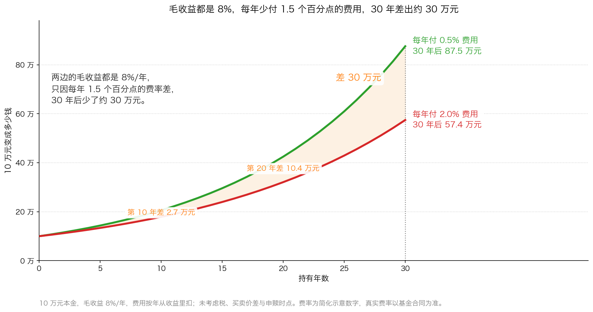
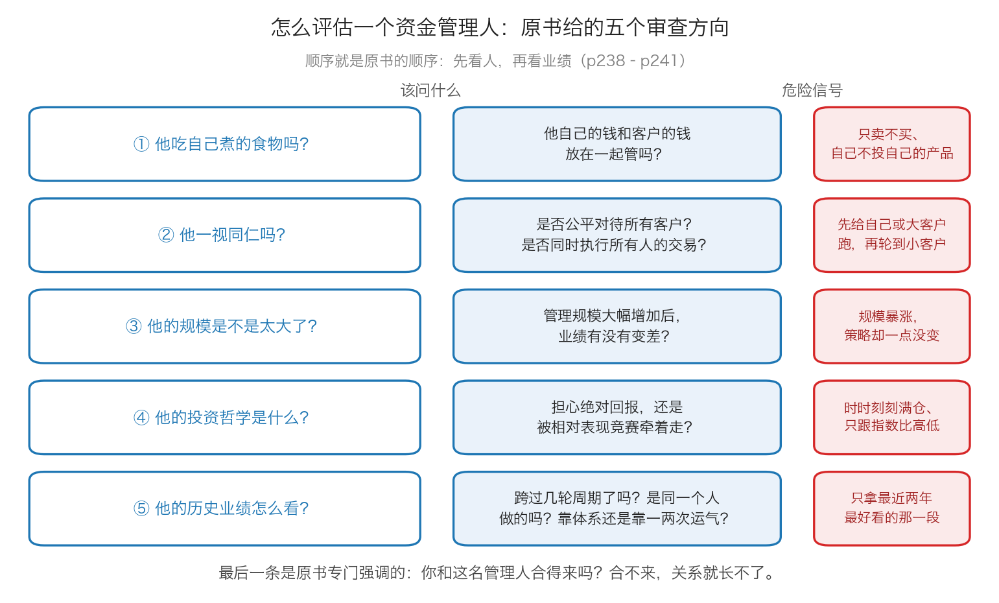

# 第 3 章：个人投资者的替代品——基金与资金管理人

> 本章你将：
> - 看清一个不太快乐的现实：投资是一份"专职工作"，时间去哪儿了决定你该走哪条路
> - 知道共同基金理论上好在哪、实践上又常常差在哪
> - 学会在基金合同里读出你真正付了多少钱，并能算出费率对 30 年收益的侵蚀
> - 分清公募基金、ETF、私募、基金投顾这四种替代品各是什么、门槛和费率结构长什么样
> - 拿到评估一个资金管理人的五个问题，以及一份"危险信号"清单
> - 最后回答：如果你不打算自己选股，你最少必须做对哪三件事

前面十二章，我们一直在训练一件事：**你自己去判断一家公司值多少钱。**
这一章要正面回答一个很多人不好意思问的问题：

**"如果我既没有时间，也没有兴趣做这件事呢？"**

卡拉曼的回答非常诚实，一点也不讨好读者（p236）：

> "如果这是一本童话故事书，那么就会有一个更加让人感到快乐的结尾。不幸的是，留给个人投资者的投资替代品非常有限。"（p236）

---

## 3.1 先说清楚：投资是一份专职工作

原书接下来说了一句很重的话（p236）：

> "现在应该明确认识到，投资是一份专职工作。"（p236）

**为什么这么说？** 卡拉曼给的理由是（p236）：
"鉴于所需浏览和分析的信息数量庞大，且投资任务很复杂，
一名个人投资者通过偶尔作出的零星努力取得长期投资成功的可能性很小。"

**"零星努力"** 这四个字是关键。它指的不是"你不聪明"，
而是"你每周只花半小时看看行情、听两条消息"这种做法，
和"把一家公司的年报读完、把它的竞争对手比一遍"之间，
差的不是智商，是**工作量**。

但请注意，卡拉曼紧接着就松了口（p236）：

> "没有必要，甚至不值得成为一名专业投资者，但时间是个先决条件。"（p236）

**"时间是个先决条件"** —— 这是本章的题眼。他把话说得很清楚：
- 你不必成为专业投资者（不必辞职、不必全职）；
- 但**你必须投入真实的时间**（这也是为什么前面每一周都给你留了一份动手作业）；
- 如果你确实投入不了这个时间，那就承认它，然后选下面的三条路之一（p236）：

> "那些无法在自己的投资上花大量时间的投资者有三个选择：共同基金、全权股票经纪人或者资金管理人。"（p236）

**这三个词第一次出现，先解释清楚：**

| 词 | 生活类比 | 准确定义 |
|---|---|---|
| **共同基金** | 一群人凑钱请一位大厨做饭，你买的是"一份饭票" | 很多人把钱凑在一起，交给一家基金公司统一投资；你按份额分享收益、承担亏损 |
| **全权股票经纪人** | 你把车钥匙交给代驾，他去哪儿你事先不一定知道 | 你**授权**经纪人替你决定买什么、卖什么，不需要每笔都问你 |
| **资金管理人** | 你请一位私人教练，按他的方案练 | 替别人管理资金的专业人士，可能通过基金、专户或私募的形式为你管钱 |

> 📌 **划重点：** 这三条路的共同点是：**你把"判断"这件事交出去了。**
> 所以这一章真正要教你的，不是"哪只基金好"，而是
> **"怎么判断一个替你判断的人"**——这仍然是一项你自己的功课。

---

## 3.2 共同基金：理论上很美，实践上平平

卡拉曼对共同基金的评价，一句话就把两面都说完了（p236）：

> "从理论上讲，对个人投资者而言，共同基金是一个诱人的替代选择，它能提供专业的管理、低廉的交易成本、马上可以兑现的流动性以及合理的多样化投资。从实践角度来说，多数共同基金在管理资金方面表现平平。然而，也有一些共同基金是例外。"（p236）

我们把这句话拆成两半。

### 理论上，四个优点都是真的

| 优点 | 它的意思 | 对散户意味着什么 |
|---|---|---|
| **专业的管理** | 有全职的人在做研究 | 你不需要自己读年报 |
| **低廉的交易成本** | 基金买卖股票的佣金被所有持有人分摊 | 你自己一万块钱买 10 只股票，手续费占比会很高 |
| **马上可以兑现的流动性** | 开放式基金可以按净值赎回 | 想用钱的时候能拿出来（第 0 章讲的那件事） |
| **合理的多样化投资** | 一只基金通常持有几十只证券 | 天然满足第 1 章讲的"5–10 只以上" |

**"净值"** 这个词第一次出现，要解释清楚：
**基金净值 = 基金持有的全部资产按市价算出来，减去负债，再除以总份额。**
也就是"每一份值多少钱"。它和股票价格不一样——股票价格由买卖双方的报价决定，
而开放式基金的净值是**按持仓的市价算出来的**，你申购和赎回都按这个数。

### 实践上，问题出在"谁付钱给基金经理"

现在讲另一面。基金公司靠什么赚钱？原书说得很清楚（p237）：

> "同其他机构投资者一样，共同基金的利润来自于根据资产管理规模所收取的一定比例的管理费，这些费用与投资业绩没有直接的联系。如此，对因糟糕的相对表现而导致资金流出的恐惧给经理人带来了巨大的压力，迫使他们跟随潮流。"（p237）

这段话有三层意思，每一层都值得想一遍：

**第一层：管理费按"规模"收，不按"业绩"收。**
你投 10 万元，基金每年按 1.2% 收管理费，也就是 1200 元。
**基金赚了钱，它收 1200 元；基金亏了钱，它还是收 1200 元。**
（Week 4 讲过这个结构：华尔街赚的是"你动手"和"你投钱"的钱，不是你赚钱的钱。）

**第二层：规模会因为"短期表现不好"而流失。**
基金业绩差 → 投资者赎回 → 规模变小 → 管理费收入下降。
所以基金经理最大的恐惧不是"亏钱"，而是"**比别人差**"。

**第三层：于是他们被迫跟随潮流。**
这就是 Week 5 讲过的"短期相对表现竞赛"——机构的镣铐。
一个基金经理如果坚持买没人要的便宜货，两年跑输同行，
资金就会跑光；而如果他去追最热的赛道，至少"和大家一起错"。

### 开放式基金还有一个结构性的麻烦："热钱"

原书提到了这一点（p237）：开放式基金这些年吸引了大量来自投机客的"热钱"，
这些人"希望能赚快钱，但又不希望承担风险"。
基金公司的应对方式是**迎合**——成立各种高度专业化的基金
（原书举的例子是生化科技、环境、第三世界），
并且"每隔一个小时提供基金价格，还允许投资者通过电话来在公司所有的基金之中进行转换"。

**这套东西在今天的 A 股/港股 里有一个更熟悉的名字：**
**行业主题基金 + 短期业绩排行榜 + 一键转换。**
它的效果是让资金能在最热的时候涌进来、在最冷的时候跑出去，
**而基金必须被动地在高位买入、在低位卖出**——这正好和 Week 10 讲的逆向思维相反。

> ⚠️ **易踩坑：** 一只基金"最近一年涨了 80%"这条信息，
> 对你的价值**接近于零**，甚至可能是负的。它告诉你的是"它重仓的东西去年很热"，
> 而不是"它现在便宜"。用排行榜选基金，等于用后视镜开车。

### 但也真的有例外

卡拉曼并没有一棍子打死（p237）：

> "有些开放式基金确实有着长期投资的理念。这些基金拥有深厚的忠实于长线投资的投资者基础，这会降低出现巨额赎回的风险，从而可以避免在市场低迷被迫了结低估证券。"（p237）

**这句话给了你一个可以用的筛选标准。** 注意它的逻辑链：
**投资者结构稳定 → 赎回压力小 → 不必被迫卖出 → 可以拿得住低估的证券。**
所以你在挑基金时，除了看收益，还应该看：

- 这只基金的**持有人结构**稳定吗？（机构占比高、频繁申赎的"热钱"多不多？）
- 它的**换手率**高不高？（换手率极高说明它在频繁交易）
- 它有没有**限购**？（原书提到他最喜欢的基金之一"这些年来不再接纳新的投资者"，
  p237——一家愿意主动控制规模、拒绝热钱的基金，动机通常是干净的。）

> 🇨🇳 **落到 A 股/港股：** 这一段在 A 股有一个非常直接的对应物——
> **"基金赚钱，基民不赚钱"** 这个现象。它说的不是基金净值没涨，
> 而是持有人总是在高点申购、在低点赎回，**自己的实际收益远低于基金净值的涨幅**。
> 这不是基金的问题，是**申赎时点**的问题，而申赎时点恰恰是持有人自己决定的。
> 所以本章最重要的一句话是：**你交给基金的是"选股"，不是"择时"和"纪律"。**

---

## 3.3 你为基金付了哪些钱：一份费用清单

在进入"算一算"之前，先把费用结构讲清楚。这是很多人从来没弄明白过的一件事。

**生活类比：** 你把钱交给一家餐厅，让它替你买菜、做饭、端上桌。
你的支出分成三类：**一次性进门费**（申购费）、**每年交的会员费**（管理费、托管费、
销售服务费）、**一次性出门费**（赎回费）。这三类费用的收法完全不同，
**而"按年收"的那一类对长期收益的伤害最大。**

| 费用 | 怎么收 | 谁拿走 | 大致水平（**示意，具体以基金合同为准**） |
|---|---|---|---|
| **管理费** | 按年，从基金资产里直接扣 | 基金公司 | 主动权益类常见 1.2% 上下；宽基指数基金常见 0.15%–0.5% |
| **托管费** | 按年，从基金资产里直接扣 | 托管银行 | 常见 0.05%–0.25% |
| **申购费** | 买入时一次性 | 销售渠道 | A 类份额常见 1.5% 以下，各渠道常有折扣 |
| **赎回费** | 卖出时一次性，持有越久通常越低 | 计入基金资产或渠道 | 常见 0.5% 上下，持有满一定期限可免 |
| **销售服务费** | 按年，从基金资产里直接扣 | 销售渠道 | C 类份额常见 0.2%–0.8% |

**几个必须知道的细节：**

1. **管理费和托管费是"按年、按日计提"的**，你不会收到一张账单，
   它每天从基金资产里悄悄扣掉。**你看到的基金净值，已经是扣完这两笔之后的数字。**
2. **A 类份额 vs C 类份额**：同一只基金常常分两类。
   A 类收一次性申购费、不收销售服务费；C 类不收申购费、但每年收销售服务费。
   **粗略的判断：持有时间短（一两年内）选 C 类，长期持有选 A 类。**
3. **ETF 是另一条路**：它在交易所里像股票一样买卖，
   费率通常比主动基金低得多，而且没有申购赎回费（只有券商佣金）。
   代价是你要自己在场内下单，而且它的价格会随供需小幅偏离净值。
4. **私募类产品还有"业绩报酬"**：赚了钱管理人再分走一部分（常见是收益的 20%）。
   这个结构的激励相对好一些，但它也有副作用——
   管理人可能为了拿业绩报酬去冒更大的风险。

> 📌 **划重点：** 费率的可怕之处不在于"贵"，而在于**它是按年复利地贵**。
> 每年多付 1.5 个百分点听起来不多，但它扣的是"会继续生钱的那部分钱"。
> 下一节的算一算会把这件事一年一年算给你看。

---

## 3.4 评估全权股票经纪人和资金管理人

如果你不想买基金，而是想找一个人替你管钱，那么这一节是全章最重要的部分。

先说清楚风险在哪。原书一开口就点了出来（p238）：

> "有些股票经纪人实际上就是资金管理人，他们被授权全权管理客户的部分或者全部资金。这会带来巨大的利益冲突，因为佣金是根据交易而不是投资业绩来收取的。"（p238）

**"全权"** 的意思是：你签一份授权，他就可以不问你直接下单。
**"利益冲突"** 的意思是：他的收入和你的收益**不是同一件事**——
你希望他少动手、动对的手；而他每动一次手都有收入（Week 4 讲的结构）。

那怎么办？卡拉曼说，**像选资金管理人一样去选他**，并且把这件事的难点讲得很清楚（p238）：

> "在选择一名股票经纪人或者资金管理人时，最大的挑战就是准确地理解他们是做什么的，评估他们投资方法的效用（这些方法是否有道理？）以及他们是否正直（他们是否言行一致，是否将你的利益放在了第一位？）。"（p238）

他把评估分成**五个方向**，而且顺序很讲究：**先看人，再看业绩。**

### 问题一：他吃自己煮的食物吗？

原书把这一条放在第一位，理由是（p238）：
"没有比个人的道德品质更适合作为这一评估的开始了。"

然后他给了一个极妙的说法（p238）：

> "他们吃"自己煮的食物"——将自己的资金和客户的资金放在一起进行管理吗？"（p238）

**"吃自己煮的食物"** 这个说法非常直白：**他自己有没有把钱投在自己推荐的同一个东西上？**
接着他补了一句堪称全书最刻薄的话（p238）：

> "有趣的是，很少有垃圾债经纪人会将自己的钱投资于垃圾债。换句话说，他们都吃别人煮的东西。"（p238）

**这句话可以直接拿来当筛子用。** 一个向你推荐某只产品的人，
如果他自己一分钱都没投，你要问的不是"这个产品好不好"，
而是"**他为什么自己不买**"。

> 🇨🇳 **落到 A 股/港股：** 这一条在今天的中国有一个非常具体的对应——
> **"自购"**。基金公司或基金经理自己申购自己管理的基金，是一个可以查到的公开信息
> （通常在基金公告或定期报告里会披露"基金管理人运用固有资金投资本基金"的情况）。
> 一个愿意把自己相当比例的钱放进自己产品、
> 并且持有几年不动的管理人，至少在**利益一致性**上通过了第一关。
> 反过来，一个嘴上说"长期看好"、手上却在高位频繁减仓的管理人，
> 无论业绩多好，你都要多留一份心。

### 问题二：他一视同仁吗？

原书说"另外一个需要审查的地方就是他们是否一视同仁地对待所有的客户"（p238），
接着问了三个很具体的问题（p238–p239）：
是否所有的客户都受到了公平的待遇？如果不是，理由是什么？
以及"是否同时执行所有客户的交易？如果不是，他们使用何种方法来确保公平？"（p238–p239）

**为什么"同时执行"这么重要？** 因为如果有先后，那么先执行的那一批
（通常是自营账户、大客户、关系户）就能拿到更好的价格，
后执行的那一批拿到的就是被前面的人推高的价格。**这是可以被量化的损失。**

> 🇨🇳 **落到 A 股/港股：** 这一条对应的是**"公平交易"制度**。
> 公募基金公司被要求建立公平交易制度，防止不同组合之间
> "抢跑""抬轿子"（用新基金的钱去拉高老基金已经持有的股票）。
> 你在看一家基金公司时，可以留意它的定期报告里有没有披露公平交易执行情况；
> 更重要的是在直觉层面问一句：**"我这一笔钱，在这家机构里排第几？"**

### 问题三：他的规模是不是太大了？

这是最容易被忽略、但对收益影响极大的一条。原书说（p239）：
判断方法之一就是检查这名管理人此前管理的资产规模达到当前水平后的历史记录。

> "根据我的经验，资产管理规模的大幅增加会给投资回报产生负面效应。"（p239）

**为什么规模会伤害收益？** 生活类比：一个小摊子卖手工水饺，一天做 200 份，
每一份都能精心挑肉；生意火了，一天要做 2000 份，
他只能去批发市场买现成的肉馅——**同样的招牌，不同的东西。**

投资上也一样：一个 5 亿元的组合可以买那些"一天只成交几百万元"的小公司；
一个 500 亿元的组合**根本买不进去**（一买就把价格推高 20%），
只能去买大市值的公司，可选择的便宜货大大减少。
卡拉曼也承认，"具体多大的资产规模才能获得成功依赖于具体的投资策略，
以及经理人的水平"（p239）——策略容量越小，规模的天花板越低。

### 问题四：他的投资哲学是什么？

原书把这一条排在第四（p239）：他有"能够带来长期投资成功的明智策略吗"？
然后连着问了三个非常尖锐的问题：
"他对绝对回报、可能出错的情况感到担忧吗，或者被相对表现竞赛所吸引吗？
没有套利限制或者像每时每刻都保持满仓投资这样的愚蠢规则吗？"

**这三个问题，Week 5 和 Week 8 都讲过：**
- **绝对回报 vs 相对表现**：他关心的是"我的钱有没有变多"，
  还是"我有没有跑赢指数"？（Week 8 第 1 章）
- **可能出错**：他会不会先想"我可能错在哪里"，
  而不是先给你看一张"预计年化收益 15%"的曲线？（Week 7 第 0 章）
- **满仓和限制**：他有没有给自己套上"必须永远满仓""不能持有现金"这种镣铐？（Week 5 第 2 章）

### 问题五：他的历史业绩怎么看？

卡拉曼把这一条放在最后，**但写的最长**（p239–p241），因为它最容易被误读。
他把该问的问题一条条列了出来：

- 历史记录有多久？**跨过一轮或几轮市场周期了吗？**
- 这些成绩**都是由那名将要管理你资金的管理人**取得的吗？
- 这代表他**整个生涯**的业绩，还是只在有利的市场环境里取得的成绩？
- 业绩是**稳定**还是波动很大？
- 它是靠**一到两次非常可观的成功投资**，还是靠一系列中等水平的投资？
  原书追问（p240）："如果剔除那一到两次非常可观的投资回报之后的业绩变得平淡无奇，
  有理由认为这名管理人还会在未来取得更多类似的突出表现吗？"
- 他**是否还在使用**之前让他取得成功的同一种策略？（p240）

然后是本章最该抄下来的一句（p240）：

> "必须总是将回报和风险放在一起加以检查。"（p240）

**这句话怎么落地？** 卡拉曼给了两个可以查的动作（p240）：
问他是否"每时每刻都满仓投资，或者通过借款来超额投资"；
反过来——

> "反之，如果这名管理人在即使持有大量现金及现金等价物的情况下依然取得了优秀的成绩，这可能意味着他使用了一种低风险的方法。"（p240）

**注意这里的逻辑：** 一个人满仓加杠杆赚了 20%，和一个人拿着两成现金赚了 20%，
**完全不是同一件事**。前者是承担了更大的风险换来的，后者是技巧。
这也是 Week 8 讲的"风险的本质"在选人上的应用。

最后，卡拉曼提醒了一件所有人都该记住的事（p240–p241）：

> "当然，短期内的投资回报受到运气因素的影响。概率论告诉我们，几乎任何一个人都能在某个时期取得显著的成就。评估资金管理人的任务就是确定他们过去取得的成就中有多少来自于运气，有多少来自于投资技能。"（p240–p241）

**"有多少来自运气，有多少来自技能"** —— 这句话本身就说明了为什么
"看排行榜选基金"是错的：**排行榜只告诉你结果，不告诉你结果是怎么来的。**

原书还用了一个很传神的比喻（p241）：

> "许多投资者错误地以挑选赛马的方法来选择自己的资金管理人。"（p241）

**赛马怎么挑？看它最近赢了几场，然后下注。** 问题是人会说话、会换策略、会变，
而且更重要的是（p241）：
"不同的投资方法会受到追捧和抛弃，使用了相应方法的投资者的业绩会出现相应的波动。"
所以一个长期优秀、但近期表现不佳的管理人，可能恰恰是
"正专注于近期被市场遗弃的领域"（p241）——这反而是好事。

### 最后一条：你们合得来吗？

原书把这一条放在最后，却说它是"最重要的一件事"（p241）：

> "最后，投资者需要考虑最重要的一件事就是自己与一名管理人之间的融洽程度。如果自己与一名金融专业人士格格不入，那么双方的关系将无法持久。"（p241）

他举了两个例子（p241）：一个保守的投资者可能对一名职业做空的人感到满意，
不管投资结果如何；而一个激进的投资者可能无法容忍一名"买入之后一路持有"的管理人。

**这一条为什么重要？** 因为它决定了**你能不能在对方最难的时候不动摇**。
如果他的方法你根本不信，那么当他的方法暂时失效（每个方法都会有失效期）时，
你一定会在最坏的时点赎回——**然后两边都输**。

原书最后提醒（p241）：

> "一旦雇佣了一名资金管理人，客户必须持续关注他的行为和业绩。在雇佣了管理人之后，那些在雇佣管理人时所考虑的问题依然有用。"（p241）

**"依然有用"** 这四个字是重点：**雇他不是终点，是起点。**

---

## 3.5 落到 A 股/港股：四种替代品的全景

把原书的三条路，翻译成今天中国市场能实际操作的东西。

| 类型 | 一句话是什么 | 门槛 | 费率结构（示意） | 你最需要注意什么 |
|---|---|---|---|---|
| **公募基金（主动）** | 基金公司请基金经理选股，你买份额 | 通常 10 元起 | 管理费 + 托管费（按年）+ 申赎费（一次性） | 短期排名压力、基金经理更换、规模膨胀（p239） |
| **指数基金 / ETF** | 不选股，照着一个指数买一篮子股票 | ETF 场内 100 份起 | 管理费 + 托管费，通常远低于主动基金 | 它不解决"什么时候买"和"贵不贵"的问题（Week 5 第 3 章） |
| **私募基金** | 面向合格投资者的非公开产品 | 通常 100 万元起，且需满足合格投资者条件 | 管理费 + 业绩报酬 | 信息不透明、流动性差、退出安排（第 0 章讲过的流动性） |
| **基金投顾** | 你付费买"配置建议 + 自动调仓" | 通常几百元起 | 按资产规模收取投顾费（按年） | 你仍然要判断它的策略和你的目标是否匹配 |
| **券商资管 / 银行理财** | 机构发行的集合投资产品 | 各有门槛 | 管理费，部分含业绩报酬 | 看清底层资产是什么、有没有"刚兑"的错觉 |

**四种替代品，怎么选？给你一个朴素的决定顺序：**

1. **如果你完全没有时间、也没有兴趣**：先从宽基指数基金开始，把费率压低，
   把它当成"买下整个市场的一小块"，并且用**定投**代替择时。
2. **如果你愿意花一点时间、但不想选个股**：在指数基金之外，
   可以考虑一只你真的理解的主动基金，但要按本章的五个问题去审一遍。
3. **如果你的资金量达到了私募门槛**：先确认流动性安排
   （多久能赎回、赎回费多少、有没有锁定期），再谈收益。
4. **如果你请了投顾**：把"投顾费"和"基金本身的费率"加起来，
   用下一节的表格估一下 30 年之后差多少。**你要为一个建议付多少钱，这件事必须算清楚。**

> ⚠️ **易踩坑：** 有一种说法是"专业的事交给专业的人，我什么都不用管了"。
> 这句话只对了一半。**你可以把选股交出去，但有三件事永远交不出去：**
> 1. **决定你能承受多大波动**（这个只有你知道）；
> 2. **决定你什么时候需要这笔钱**（第 0 章的流动性）；
> 3. **决定你付了多少费用**（这一章的费用清单）。
> 这三件事决定了你的最终结果，而它们**都不是管理人能替你做的**。

---

## ✍️ 想一想

1. 一位客户经理跟你说："这只基金去年排名第一，赶紧买，额度不多了。"
   请用本章的标准，列出至少三个你必须先弄清楚的问题。
2. 卡拉曼说"很少有垃圾债经纪人会将自己的钱投资于垃圾债"。
   请把这句话翻译成一个你可以直接用的判断动作。
3. 有两个管理人：甲满仓加杠杆，五年年化 20%；乙长期持有两成现金，五年年化 18%。
   只看这两个数字，为什么你不能直接说甲更厉害？

> 💡 **参考思路：**
>
> 1. ① **去年的收益是怎么来的？** 是靠一两次非常可观的成功投资，
>    还是靠一系列中等水平的投资（p240）？
>    ② **这个"第一名"是在什么策略、什么赛道里排第一？** 不同的投资方法会受追捧和抛弃，
>    业绩会随之波动（p241）——去年第一可能只是去年那个赛道最热。
>    ③ **费率和换手率是多少？** 高换手意味着高交易成本，
>    而这些成本已经从他的净值里扣掉了（也可能还没扣完）。
>    ④ 附加：**他自己买了多少？**（p238 的"吃自己煮的食物"）
>    ⑤ 附加：**"额度不多了"这句话的目的是什么？** 它在制造紧迫感，
>    而紧迫感和投资决策是天然对立的两件事。
> 2. 动作很简单：**去查这个人或这家机构自己有没有投它推荐的东西。**
>    具体来说，找"自购"的公开披露（基金公告、定期报告里的固有资金投资情况），
>    看他承诺持有的期限、金额占他个人资产的比例。
>    如果查不到、或者金额小得可以忽略，那么他说的每一句"我看好"，
>    你都要在心里打个折。**利益一致性不是靠表态证明的，是靠钱证明的。**
> 3. 因为**回报必须和风险放在一起看**（p240）。甲的高回报里，
>    有一部分是"承担了更大的风险"换来的——杠杆意味着一次极端行情就可能让他出局，
>    而"出局"这件事一旦发生，前五年赚的都不算数（Week 7 第 0 章：
>    亏 50% 要涨 100% 才回本）。
>    乙拿着两成现金还能做到 18%，说明他的选股本身很强，
>    而且他的组合在暴跌中更抗打。
>    原书的判断标准是："如果这名管理人在即使持有大量现金及现金等价物的情况下
>    依然取得了优秀的成绩，这可能意味着他使用了一种低风险的方法"（p240）。
>    **所以正确的说法是：甲和乙承担的风险不同，不能只比收益。**

---

## 🧮 算一算

这一节是全周最省钱的一道题：**每年多付 1.5 个百分点，30 年后少拿多少钱？**

### 情境

你有 **10 万元**，打算投资 **30 年**。两种选择的**毛收益（扣费之前）都是 8%/年**：

- **低费率方案**：每年从收益里扣 **0.5%** 的费用（示意：一只低费率的宽基指数基金）；
- **高费率方案**：每年从收益里扣 **2.0%** 的费用
  （示意：管理费 + 托管费 + 申购赎回费摊销 + 销售服务费加起来）。

两者的差正好是 **1.5 个百分点**。费用按年从当年的收益里扣。

> ⚠️ 说明：这里的费率是**简化示意数字**，方便你跟着算，
> 不是任何一只真实基金的费率。真实费率请以**基金合同**为准。

### 第 1 步：先算两种方案的"净收益率"。

- 低费率：`8% - 0.5% = 7.5%`
- 高费率：`8% - 2.0% = 6.0%`

**这一步在算什么：** 把"毛收益"变成"真正留在你账户里的收益率"。
记住：**你算复利的时候，要用净收益率，不能用毛收益。**

### 第 2 步：手上没有计算器怎么算复利？——一年一年往后乘。

**复利的算法只有一个动作：把上一年的数乘以"1 加上净收益率"。**

低费率方案：乘数是 `1 + 7.5% = 1.075`
高费率方案：乘数是 `1 + 6.0% = 1.06`

示范前三年（低费率）：

- 第 1 年：`100000 乘以 1.075 = 107500 元`
- 第 2 年：`107500 乘以 1.075 = 115562.5`，约 **115563 元**
- 第 3 年：`115563 乘以 1.075 约等于 124230 元`

示范前三年（高费率）：

- 第 1 年：`100000 乘以 1.06 = 106000 元`
- 第 2 年：`106000 乘以 1.06 = 112360 元`
- 第 3 年：`112360 乘以 1.06 约等于 119102 元`

**注意第 1 年只差 1500 元，一点都不吓人。** 这就是为什么大多数人不在意费率——
它的伤害是往后累积的。

### 第 3 步：把 30 年一年一年列出来。

| 年数 | 每年付 0.5%（净 7.5%） | 每年付 2.0%（净 6.0%） | 差额 |
|---|---|---|---|
| 第 0 年 | 100,000 元 | 100,000 元 | 0 元 |
| 第 1 年 | 107,500 元 | 106,000 元 | 1,500 元 |
| 第 2 年 | 115,563 元 | 112,360 元 | 3,202 元 |
| 第 3 年 | 124,230 元 | 119,102 元 | 5,128 元 |
| 第 4 年 | 133,547 元 | 126,248 元 | 7,299 元 |
| 第 5 年 | 143,563 元 | 133,823 元 | 9,740 元 |
| 第 6 年 | 154,330 元 | 141,852 元 | 12,478 元 |
| 第 7 年 | 165,905 元 | 150,363 元 | 15,542 元 |
| 第 8 年 | 178,348 元 | 159,385 元 | 18,963 元 |
| 第 9 年 | 191,724 元 | 168,948 元 | 22,776 元 |
| 第 10 年 | 206,103 元 | 179,085 元 | **27,018 元** |
| 第 11 年 | 221,561 元 | 189,830 元 | 31,731 元 |
| 第 12 年 | 238,178 元 | 201,220 元 | 36,958 元 |
| 第 13 年 | 256,041 元 | 213,293 元 | 42,748 元 |
| 第 14 年 | 275,244 元 | 226,090 元 | 49,154 元 |
| 第 15 年 | 295,888 元 | 239,656 元 | 56,232 元 |
| 第 16 年 | 318,079 元 | 254,035 元 | 64,044 元 |
| 第 17 年 | 341,935 元 | 269,277 元 | 72,658 元 |
| 第 18 年 | 367,580 元 | 285,434 元 | 82,146 元 |
| 第 19 年 | 395,149 元 | 302,560 元 | 92,589 元 |
| 第 20 年 | 424,785 元 | 320,714 元 | **104,072 元** |
| 第 21 年 | 456,644 元 | 339,956 元 | 116,688 元 |
| 第 22 年 | 490,892 元 | 360,354 元 | 130,539 元 |
| 第 23 年 | 527,709 元 | 381,975 元 | 145,734 元 |
| 第 24 年 | 567,287 元 | 404,893 元 | 162,394 元 |
| 第 25 年 | 609,834 元 | 429,187 元 | 180,647 元 |
| 第 26 年 | 655,572 元 | 454,938 元 | 200,633 元 |
| 第 27 年 | 704,739 元 | 482,235 元 | 222,505 元 |
| 第 28 年 | 757,595 元 | 511,169 元 | 246,426 元 |
| 第 29 年 | 814,414 元 | 541,839 元 | 272,576 元 |
| 第 30 年 | **875,496 元** | **574,349 元** | **301,146 元** |

### 第 4 步：算差额。

`875496 - 574349 = 301147`，约 **30.1 万元**。

**这个数字有多大？** 换个说法：

- 它相当于你**本金的 3.01 倍**（`301146 除以 100000 = 3.01`）；
- 它是你 30 年投入的**年均 1 万元**（`301146 除以 30 约等于 10038 元`）；
- 高费率方案最终只有低费率方案的 **65.6%**
  （`574349 除以 875496 = 0.656`）——也就是说，**你少拿的不是 1.5%，
  而是最终结果的 34.4%**。

**请特别留意这个"错觉"：** 费率差是 1.5 个百分点，
但它造成的最终差额是 **34.4%**。这就是复利最反直觉的地方：
**百分比是加法的，复利是乘法的。**

### 第 5 步：如果费率差没那么大呢？

假设两只基金只差 **0.5 个百分点**（净收益 7.5% 对 7.0%）：

- 净 7.5%：30 年后 **875,496 元**；
- 净 7.0%：30 年后 `100000 乘以 1.07 的 30 次方 约等于 761226 元`；
- 差额 `875496 - 761226 = 114270 元`，约 **11.4 万元**。

**只差 0.5 个百分点，30 年也是 11.4 万元。**
这就是为什么"费率是投资者唯一能确定的东西"——收益不确定，
但费率是写在合同里、每年都在扣的。

### 第 6 步：这道题真正的重点。

请注意这道题里**没有出现任何预测**：我没有预测市场会涨还是会跌，
毛收益两边都是 8%。**唯一变化的是费率。**

所以它能得出一个非常硬的结论：

> **在你所有能控制的变量里，费率是最确定、最容易改、影响又最大的一个。**
> 你无法控制市场明年涨不涨，但你可以决定自己付 0.5% 还是 2.0%。

> 📌 **划重点：** 这道题不是让你"只买最便宜的基金"。
> 一只收费高但真的能创造超额收益的基金，可能是划算的；
> 但你必须**先算清楚这笔费用值多少**，再去判断它的超额收益能不能覆盖。
> **大多数人的错误不是"买了贵基金"，而是"从来没算过这笔账"。**

---

## ✅ 小测验

**1. 关于共同基金，下面哪种说法最符合原书的意思？**
A. 共同基金是个人投资者最好的选择，长期看一定跑赢自己投资
B. 理论上它能提供专业管理、低交易成本、流动性和多样化，但实践上多数基金表现平平
C. 共同基金的管理费与投资业绩直接挂钩，所以管理人会很努力
D. 开放式基金因为能随时赎回，所以没有任何缺点

**2. 原书把"他们吃自己煮的食物"作为评估管理人的第一步，这句话的意思是？**
A. 要看管理人平时吃什么，判断他的生活是否节俭
B. 要看管理人是否把自己的钱和客户的钱放在一起管理，也就是他是否也投自己推荐的东西
C. 要看管理人有没有厨师证
D. 要看管理人是不是自己公司的股东

**3. 两位管理人五年年化收益分别是 20%（满仓加杠杆）和 18%（长期持两成现金），
按原书的标准，下面哪个判断是对的？**
A. 20% 的那位更厉害，因为收益高
B. 18% 的那位更厉害，因为收益低更保守
C. 不能只比收益，必须把回报和风险放在一起看；持现金还能取得好成绩可能意味着低风险的方法
D. 两个人的水平无法比较，所以随便选一个

> **答案与解析**
>
> **1. B。** 原书 p236 的原话是"从理论上讲……它能提供专业的管理、
> 低廉的交易成本、马上可以兑现的流动性以及合理的多样化投资。
> 从实践角度来说，多数共同基金在管理资金方面表现平平"。
> A 太绝对（原书说"也有一些共同基金是例外"）；
> C 恰好说反了：p237 明确说管理费"与投资业绩没有直接的联系"；
> D 错在原书确实提到开放式基金通常比封闭式基金更具吸引力（p236），
> 但也紧接着指出了它的一系列问题（p236–p237）。
>
> **2. B。** 原书 p238 的原文是"他们吃'自己煮的食物'——将自己的资金和客户的资金
> 放在一起进行管理吗？"，并接着说"很少有垃圾债经纪人会将自己的钱投资于垃圾债。
> 换句话说，他们都吃别人煮的东西"。A、C、D 都是字面误读。
>
> **3. C。** 原书 p240 说"必须总是将回报和风险放在一起加以检查"，
> 而且"如果这名管理人在即使持有大量现金及现金等价物的情况下依然取得了优秀的成绩，
> 这可能意味着他使用了一种低风险的方法"。
> A、B 都只看了单一维度；D 是放弃判断，而这一章整整一节的功夫就是教你怎么判断。

---

## 📖 回到原书

- 对应原书 **第十四章** 全章，`raw/安全边际-中文版/page_236.md` ~ `page_241.md`
  （原书 p236–p241），以及最后收尾的 `page_242.md`（原书 p242）。
- **建议精读：**
  - p236：投资是一份专职工作、三个选择、共同基金的理论优点与封闭式/开放式的区别；
  - p237：管理费与业绩无关、相对表现压力、"热钱"、什么是有长期理念的基金；
  - **p238（本章最重要的一页）**：全权管理的利益冲突、
    "吃自己煮的食物"、"很少有垃圾债经纪人会将自己的钱投资于垃圾债"；
  - p239：规模对回报的负面效应、投资哲学该问的三个问题、评估投资绩效的清单；
  - p240–p241：必须把回报和风险放在一起、短期回报受运气影响、
    "以挑选赛马的方法来选择自己的资金管理人"、"融洽程度"；
  - **p242**：结论——"如果这是一本童话故事书"这个开头的收尾。
- **可以略读：** p237 里提到的美国具体基金名称和它们的申购政策，
  知道"有些基金主动控制规模、拒绝热钱"这个类型就够了。
- **原书金句（逐字引用）：**
  > "现在应该明确认识到，投资是一份专职工作。"（p236）
  > "没有必要，甚至不值得成为一名专业投资者，但时间是个先决条件。"（p236）
  > "从理论上讲，对个人投资者而言，共同基金是一个诱人的替代选择，它能提供专业的管理、低廉的交易成本、马上可以兑现的流动性以及合理的多样化投资。从实践角度来说，多数共同基金在管理资金方面表现平平。然而，也有一些共同基金是例外。"（p236）
  > "他们吃"自己煮的食物"——将自己的资金和客户的资金放在一起进行管理吗？"（p238）
  > "有趣的是，很少有垃圾债经纪人会将自己的钱投资于垃圾债。换句话说，他们都吃别人煮的东西。"（p238）
  > "根据我的经验，资产管理规模的大幅增加会给投资回报产生负面效应。"（p239）
  > "必须总是将回报和风险放在一起加以检查。"（p240）
  > "许多投资者错误地以挑选赛马的方法来选择自己的资金管理人。"（p241）
  > "不管你进行怎样的投资，风险总是如影随形。你没有选择的余地。"（p241–p242）
  > "因此，我建议你们采用价值投资哲学，或者找到有着成功价值投资记录的专业投资者，或者花大量时间和精力来自己进行投资。"（p242）

这本书写到最后一页，卡拉曼只留了三条路给读者：
自己花时间、找到一个真正在做价值投资的人、或者放弃这件事。
下一章是这门课的最后一章——**把十二周的全部内容，收进一张你可以打印出来、
买前逐项打勾的清单。**
