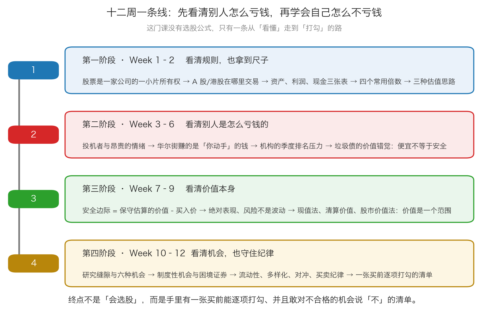
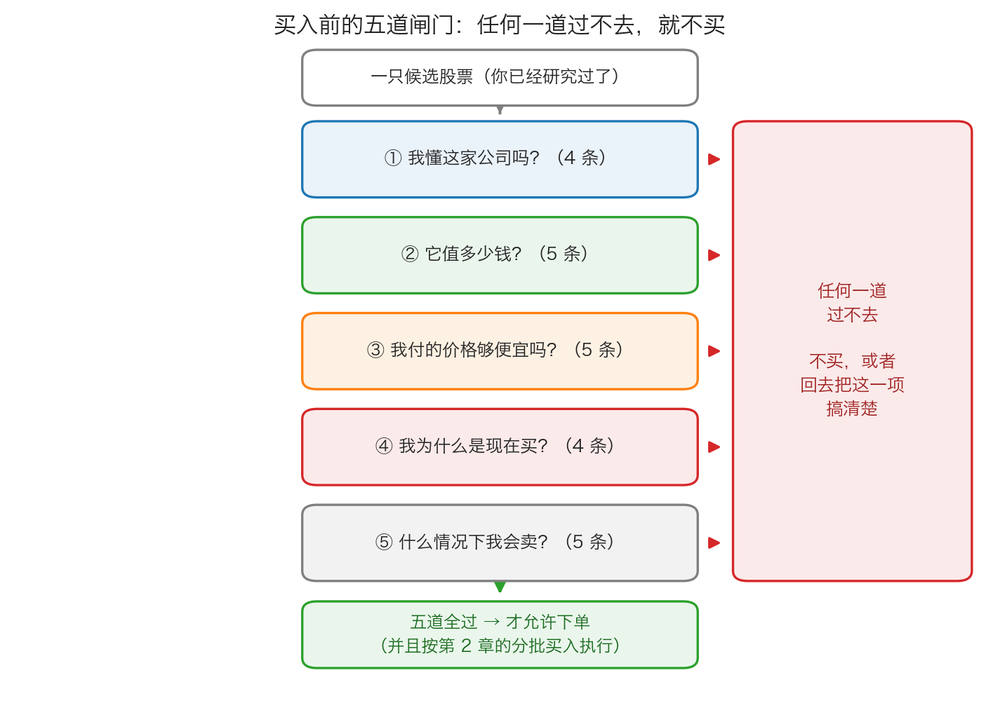

# 第 4 章：大结业——把十二周装进一张检查清单

> 本章你将：
> - 拿到一张可以打印出来、买前逐项打勾的完整检查清单（五组、23 条，每条都能回答"是/否"）
> - 看懂十二周是怎么串成一条线的——以及你为什么不需要记住所有细节
> - 记住卡拉曼在访谈里最重要的几句话，以及它们翻译成动作是什么
> - 读一读编后记的提醒：为什么"投资真的不简单"，以及这句话在保护你什么
> - 知道学完之后的第一天、第一个月、第一年分别该做什么
> - 最后回答：这门课到底给了你什么，以及它没给你什么

十二周前，我们从一个最朴素的问题开始：**一张纸为什么代表一家公司？**
十二周后，我们要把它收进一张可以打印出来、放在桌上、买前逐项打勾的清单。

这一章不再讲新知识。它只做三件事：**回顾、浓缩、交付。**
而它要交付给你的那份东西，是整门课唯一一件"可以带走"的实物。

---

## 4.1 先听一句不客气的话：投资真的不简单

一门课的最后一周，最容易写成"你已经学会了，去赚钱吧"。
但这本书的编后记，恰恰是反着写的。

编后记的作者在读完这本书之后，写下了这样一句观察（p277）：

> "让读者感到投资是件不容易的事情的书和人,凤毛麟角。"（p277）

**注意他说的是"凤毛麟角"** ——也就是"极少见"。
换句话说，市面上绝大多数讲投资的东西，都在告诉你"这件事很简单"。
他还总结了一个规律（p278）：

> "要形成群众性的热潮,首先要简单易懂,其次是可以自我循环论证,消除怀疑。"（p278）

**"自我循环论证"** 这五个字非常精准。它的意思是一个说法可以自己证明自己：
- "它能赚钱，因为它是价值投资。"
- "它跌了？那是因为考验你信念的时候到了。"
- "你卖了吗？那你就是伪价值投资者。"

**一个永远不会错的理论，也就永远不会给你任何信息。**
编后记里举的例子是把价值投资简化成一句口号（p278）：

> "价值投资被人概括成"买入(好公司)持有",多么简单啊。"（p278）

然后他立刻追问（p278）：

> "问题是,买入后股价暴跌怎么办?尤其是买入的股票价格被过分高估,一路下跌个50%乃至70%怎么办?"（p278）

**这两个问题，就是这门课存在的理由。**

- "买入好公司持有"这六个字里，**没有一处提到价格**。
  而 Week 7 我们花了一整周说明：安全边际完全取决于你付了多少钱。
- 它也没有说**什么叫"好公司"**。Week 2 到 Week 9 教的都是怎么回答这个问题。
- 它更没有说**跌了怎么办**。Week 3、Week 8、Week 11 教的都是这件事。

所以编后记最后落在一句话上（p281）：

> "《安全边际》还是告诉大家,投资真的不简单。"（p281）

> 📌 **划重点：** 学完这十二周，你**最应该**得到的感觉不是"我懂了、我可以赚钱了"，
> 而是"**我知道这件事难在哪几个地方，并且我有一套应对它们的流程**"。
> 这两种状态看着差不多，实际上一个会让你亏钱，一个会让你活得久。

**这个"流程"，就是本章第 4 节那张清单。**

---

## 4.2 卡拉曼访谈：最该记住的几句话

附录三是卡拉曼在 2010 年接受的一次长篇访谈。它和正文的价值不太一样——
正文是 1991 年写的，访谈则是一个已经做了二十多年的投资人，
在回答"你到底是怎么做的"。

我们挑出最重要的几句，并逐句翻译成动作。

### 第一句：证券不是一张纸

有人问他，为什么在 2008 到 2009 年最恐慌的时候他敢大举买入（p271）：

> "投资者首先要明白，证券不是一张纸的买卖，更不是财经媒体每天上上下下红红绿绿的数字；而是某个公司的部分权益"（p271）

**翻译成动作：** 每次你想下单之前，先在心里把这句话里的"红红绿绿的数字"
换成一个具体的东西——**一家工厂、一片水电站、一批门店、一个品牌。**
"我要买下这门生意的一小片，价格是 ___。"
如果这句话你说不顺，说明你还没想清楚（Week 1 第 1 章讲过"股票是公司所有权的一小片"）。

### 第二句：价格才是决定因素

访谈里被问到"持有期多久"时，他的回答是（p275）：

> "在合适的价格（someprice），任何标的都可以买，卖或者持有。"（p275）

**翻译成动作：** 把你脑子里的"这只股票好 / 不好"，全部换成
"**在这个价格上**，这只股票好 / 不好"（Week 7 第 3 章：
"安全边际总是依赖于所支付的价格"）。
这一句话能治掉"好公司陷阱"这个最常见的病。

### 第三句：按纪律买入，达到合理估值后卖出

他描述自己的操作时是这么说的（p272）：

> "我们会完全按照discipline 买入，也会在达到合理估值后卖出，只有避免坐电梯（round trips）和短期灾难，才可以继续做下去。"（p272）

**"坐电梯"** 这个词很形象：**赚了很多，又全部还回去。**
**翻译成动作：** 买入要有纪律（分批、有安全边际），卖出也要有纪律（到合理估值就减）。
上一章我们花了整整一节讲"卖出是最艰难的决定"，卡拉曼在这里给的答案就是这句：
**买入和卖出用同一套标准——价值。**

### 第四句：先看风险，不看回报目标

附录二里有一句话，是整本书对"投资目标"这件事最清楚的表态（p254）：

> "最优秀的投资者不会为回报设定具体的目标，他们首先关注的是风险，只有那时他们才会判断自己所承担的每一种特殊的风险会否带来回报。"（p254）

**为什么"设定回报目标"是危险的？** 因为目标本身不会创造收益，
它只会改变你的行为——当你发现手头的东西达不到 15% 的时候，
你不是降低目标，就是**去买风险更大的东西**。
Week 7 第 0 章讲的就是这件事：**该给风险设目标，不是给回报设目标。**

### 第五句：提前准备，而不是事发应对

附录二里有一段话，值得每个投资者抄在桌上（p259）：

> "重要的是在问题出现之前就应当制定好策略，因为没人能准确预测股市或者经济未来的走向。"（p259）

紧接着的一句是这一整门课最好的总结（p259）：

> "价值投资策略，即以低于价值的打折价购买股票的策略，在行情好与不好时都能提供正确的路线图。"（p259）

**"路线图"** 这个词用得极好。它不是说你的地图上标着"什么时候涨"，
而是说：**你知道该往哪走、下一步做什么、什么情况下该停。**
这正是本章那张清单要给你的东西。

### 第六句：杠杆会拿走你的控制权

附录二里对杠杆的描述非常冷酷（p255）：

> "一旦借款进行投资，你的命运就不再受你自己的控制，放贷人控制了你的命运——或者说市场主宰了你的命运。"（p255）

**翻译成动作：** 不借钱炒股，不用融资，不加杠杆。
因为杠杆最致命的地方不是"放大亏损"，而是**它让你在错误的时间被迫卖出**——
这正好是第 0 章讲的流动性的反面。

### 第七句：晚上睡得香比什么都重要

这是附录二的标题，也是它的结论（p265）：

> "投资者应当时刻牢记一条——最重要的衡量标准不是所取得的回报，而是相对于承担的风险所取得的回报。对投资者而言，晚上睡个安稳觉比什么都重要。"（p265）

**翻译成动作：** 把"睡不睡得着"当成一个真实的检验指标。
如果你因为持仓而失眠，那不是你心理素质差——**是你的仓位太大了**（第 0 章）。

### 第八句：永远不要停止阅读

访谈最后被问到推荐什么读物时，他说了这么一句（p276）：

> "永远不要停止阅读，虽然历史不会重复，但是it does rhyme（历史总有节奏可以把握）。"（p276）

**翻译成动作：** 把这门课学到的框架，用在**每年读几份年报**上。
不要读"预测明年行情"的东西，去读**公司在讲什么、对手在讲什么、
五年十年前发生了什么**。你不缺信息，你缺的是"这件事我以前见过"的那种感觉。

> ⚠️ **易踩坑：** 访谈里最容易被误读的一句是关于"接货"的（p270）：
> "但这也告诉我们要知道是从谁的手里接的货，如果是比我们高明的投资者卖出，我们就要三思了。"
> 这句话不是让你去打听谁在卖（那是内幕消息的边界，Week 10 讲过）。
> 它是在提醒你：**当一笔便宜货好得不像真的，先问"为什么是我买到了"。**
> 别人恐慌抛售（Week 10 讲的被迫卖出）是好机会；
> 而"别人知道得比你多、正在有序撤退"是另一回事。

---

## 4.3 十二周是一条什么样的线

现在回头看。这十二周看起来讲了太多东西，其实只有一条线：

**第一阶段（Week 1–2）：看清规则，也拿到尺子。**
你先学会了股票是什么、市场在哪里、价格是怎么形成的；
然后拿到了四个倍数（市盈率、市净率、净资产收益率、股息率）和三种估值思路。
**这一段解决的是"我有没有资格上场"的问题。**

**第二阶段（Week 3–6）：看清别人是怎么亏钱的。**
投机者昂贵的情绪、华尔街的收入结构、机构的排名压力、垃圾债的价值错觉。
**这一段解决的是"我会不会掉进同样的坑"的问题。**
它占了整整四周，因为这本书相信：**先知道怎么输，才知道怎么不输。**

**第三阶段（Week 7–9）：看清价值本身。**
不要亏钱、三种获利方式、等待合适的投球、**安全边际**；
然后是自下而上、绝对表现、风险的本质；
最后是企业评估的三种方法和你自己算出来的那个价值区间。
**这一段解决的是"我怎么知道它值多少钱"的问题。**

**第四阶段（Week 10–12）：看清机会，也守住纪律。**
投资研究、逆向思维、催化剂、六种机会、制度性机会、困境证券；
最后是流动性、多样化、对冲、买卖纪律和一张清单。
**这一段解决的是"知道了以后，我具体怎么做"的问题。**

**把它们压成一句话：**

> **用保守估出来的价值，去比你付出的价格；差值够大就分批买，
> 不够大就什么都不做；买完之后，靠仓位和耐心撑过市场情绪的波动。**

**再压成三个词：**

> **估值 → 打折 → 纪律。**

> 💡 **换个说法：** 如果你只能记住这门课的一件事，记住这个动作：
> **先写下一个保守的价值，再减掉你打算付出的价格。**
> 这个减法的结果，决定了你后面所有的动作。它比任何指标、任何消息、
> 任何"专家观点"都重要——因为它是**你自己算出来的**。

---

## 4.4 ★买入前检查清单（可打印）★

这一节是整门课的交付物。**请把它打印出来，或者抄一遍**，
放在你下单时一定会看到的地方。

**使用规则（先读这三条，再开始打勾）：**

1. **每一条只能回答"是"或"否"。** "大概是""应该是""差不多"一律算"否"。
2. **任何一条是"否"，就不买。** 不需要全部推翻——你不买，就没有损失。
   这一条是这张清单唯一的价值所在，请严格执行。
3. **打完勾不代表必须买。** 通过五道闸门只是"允许买"，
   不是"必须买"。真正的机会很少，等待是常态（Week 7 第 2 章）。

---

### 第一组：我懂这家公司吗？（4 条）

- [ ] **1. 我能用一句不含糊的话说清它靠什么赚钱吗？**
  （这句话里不许出现"等""之类""相关""生态"这类含糊的词。）
- [ ] **2. 我知道它最怕的三件事是什么吗？**（比如：最大的客户跑了、
  原材料涨价、政策变了、技术被替代）
- [ ] **3. 我知道它过去三年的经营现金流，是高于还是低于净利润吗？**
- [ ] **4. 如果它的股价明天跌 30%，我能说出"这跟公司有没有关系"吗？**

> **这一组过不去的含义：** 这不是"了解不够"，这是**没有能力圈**。
> 请把它放下，换一家。市场里永远有你看得懂的东西（Week 9、Week 10）。

### 第二组：它值多少钱？（5 条）

- [ ] **5. 我用至少两种方法估过它的价值吗？**
  （资产法、盈利法、现金流法、股市价值法——任选两种，看它们差多少。）
- [ ] **6. 我给出的价值是一个区间，而不是一个精确的数字吗？**
- [ ] **7. 我拿来比较的基准，是区间里最保守的那个下沿吗？**
  （不是最乐观的上沿，也不是"最可能的中间值"。）
- [ ] **8. 我知道这个价值里，有多少靠有形资产（厂房、设备、矿产、现金），
  有多少靠无形资产（品牌、配方、客户关系、商誉）吗？**
- [ ] **9. 如果我的估值整体高了 30%，这家公司还值多少钱？**

> **这一组过不去的含义：** 你手里的不是"价值"，是"希望"。
> 记住 Week 7 那句话：无形资产的安全边际更薄，所以对它的折扣要更大（p106）。

### 第三组：我付的价格够便宜吗？（5 条）

- [ ] **10. 我能算出一个具体的数字吗？**
  `安全边际 = 保守估算的价值 - 买入价`，并且算出它占保守价值的百分之几。
- [ ] **11. 这个百分比达到我事先定好的纪律线了吗？**（比如不低于 20%。）
- [ ] **12. 我知道它为什么便宜吗？**
  （是市场情绪？是真出了问题但能解决？还是这门生意在结构性衰退？）
- [ ] **13. 这个便宜，是因为有人被迫卖出（指数调整、评级下调、基金赎回、
  大股东爆仓），还是因为它真的变差了？**
- [ ] **14. 我算过"如果我错了，最多亏多少"吗？这个数字我能承受吗？**
  （"能承受"的标准：不会影响生活，不会让我失眠。）

> **这一组过不去的含义：** 你在按"公司好不好"买，而不是按"价格划不划算"买。
> 这正是原书说的"危险边际"。**宁可错过，不要买贵。**

### 第四组：我为什么是现在买？（4 条）

- [ ] **15. 我能说出一件让价格向价值靠拢的事（催化剂）吗？
  或者，我做好等很久的准备了吗？**（两个至少要有一个。）
- [ ] **16. 这笔钱是我三到五年内确定不用的钱吗？**（第 0 章的三个账户。）
- [ ] **17. 我打算分几批买？每一批的价格和金额，我提前写下来了吗？**
- [ ] **18. 如果买完就跌 30%，我会怎么做？——这件事我现在就想清楚了吗？**
  （想清楚的答案只能是"如果理由没变，我按计划加第二批"，
  或者"我不再加了，就拿着"。**不能是"到时候看情况"。**）

> **这一组过不去的含义：** 你还没有一个"计划"，只有一个"想法"。
> 想法会在下跌时变成恐慌，计划不会。

### 第五组：什么情况下我会卖？（5 条）

- [ ] **19. 我写下"价格涨到多少我就开始卖"了吗？**
  （依据是价值，不是我的成本。）
- [ ] **20. 我写下"哪些事情发生，说明我当初看错了"了吗？**
  （这是最有用的一条，因为它让你在信息出现时**立刻知道该怎么办**。）
- [ ] **21. 我确认过我的卖出理由里，没有下面这几条吗？**
  "跌了"、"到了止损线"、"已经赚了 20%"、"别人都在卖"。
- [ ] **22. 如果出现明显更好的机会，我会换股吗？换股的成本（手续费、
  可能的税、卖出的价差）我算过吗？**
- [ ] **23. 我打算多久复查一次？每次复查都重新回答一遍这张清单吗？**
  （建议：每半年一次，固定日期。这就是原书说的"排堵效应"，p226。）

> **这一组过不去的含义：** 你只有半个计划。
> 很多人把全部注意力放在"买什么"上，然后**在最难的那件事（卖）上完全没有准备**。
> 上一章整整一节都在讲这件事，请回去再看一遍。

---

### 打完勾之后

| 你的结果 | 该做什么 |
|---|---|
| 五组全过（23 个"是"） | 允许下单。按第 17 条的计划**分批买**，不要一次买满 |
| 有"否"，但你知道怎么补 | **不买。** 先去把那一项弄清楚，下个月再看。这家公司不会跑掉 |
| 有"否"，而且是第一组或第二组 | **放弃这家公司。** 你看不懂它，或者算不出它的价值——这不是你的错，这是你的边界 |
| 全部过不了，但你特别想买 | **这时候最危险。** 请回到 4.1 节，重读一遍"投资真的不简单"，然后把清单收起来，去做点别的事 |

> 📌 **划重点：** 这张清单**不是用来帮你找到牛股的，是用来帮你避免错误的。**
> 它最大的价值体现在那些"你本来会买、但打完勾决定不买"的时刻。
> 那些时刻不会给你带来任何快感，但它们决定了你二十年后还在不在这个市场里。

---

## 4.5 学完之后，我该做什么

这是本章最后一个问题，我们要给一个**具体到可以今天就做**的答案。

### 明天（15 分钟）：把三个账户分开

- 算一下你**6 个月的生活费**是多少，把这笔钱放进活期或货币基金，
  **并且决定它永远不进股市**；
- 把三年内要用的钱（首付、学费、婚嫁、可能的医疗）单独放，
  只配存款、国债、货币基金；
- 剩下的、确定五年以上不用的钱，才是你的**投资账户**。
- **在这件事做完之前，不要买任何股票。**

这一步来自第 0 章，也是整个十二周里**唯一必须先做、不能跳过**的一步。

### 这个月（6 小时）：建一份"观察清单"，先不买

从案例池里挑 **5 家公司**（贵州茅台、长江电力、福耀玻璃、中国石油、
招商银行、中国神华、腾讯控股——任选），做一件很枯燥但极有价值的事：

1. 每家写一句"它靠什么赚钱"；
2. 每家写一个你估的**保守价值区间**（不用精确，写清楚理由就行）；
3. 对比今天的股价，算出每家的**安全边际率**；
4. **把它们放进一个表格，然后什么都不做，每个月更新一次价格和你的估算。**

**为什么不买？** 因为你需要一段时间来观察**自己的判断**是不是稳定。
三个月后回头看，如果同一家公司你估的价值从 30 元变成 20 元又变成 35 元，
那说明你还没准备好下单——**不是这家公司的问题，是你的估值方法还不稳定。**

### 这一年（每月 2 小时）：把三件事变成习惯

| 习惯 | 频率 | 具体动作 |
|---|---|---|
| **记录** | 每笔买卖前后 | 写一份"买入前检查清单"、写下卖出理由。**哪怕结论是不买，也写下来。** |
| **复查** | 每半年一次 | 把每只持仓重新回答一遍那张清单（第 23 条）。答不上来的处理掉 |
| **阅读** | 每月一次 | 读一份年报，重点读"经营情况讨论与分析"和"财务报表附注"。不要读预测行情的东西 |

### 三件不要做的事

1. **不要因为"学完了"就急着买。** 学完一门课不是买入理由，
   价格便宜才是（第 4.4 节第三组）。
2. **不要借钱、不要加杠杆、不要融资。** 见 4.2 节第六句：
   杠杆会拿走你的控制权（p255）。
3. **不要因为别人的收益而改变自己的纪律。** 这是最难的一条。
   你所有的纪律，都会在某一年、某个邻居赚了很多钱的时候受到考验。
   **那一年你守住了，这门课才算真的学完。**

> 🇨🇳 **落到 A 股/港股：** 如果你决定走第 3 章那条路（买基金而不是自己选股），
> 那么上面这些动作只需要改一个字：把"公司的估值"换成"**这只基金的费用和策略**"。
> 你依然要：算清费率、确认这笔钱多久不用、决定分几次投进去、
> 并且**写下来"什么情况下我会赎回"**。
> 换了一条路，功课并没有变少——只是换了一种。

---

## 4.6 最后一页

让我们回到这本书的第一页。卡拉曼写这本书的目的，不是让你学会赚钱，
而是让你学会**不亏钱**。全书最后一章的最后一句，是这个意思（p242）：

> "因此，我建议你们采用价值投资哲学，或者找到有着成功价值投资记录的专业投资者，或者花大量时间和精力来自己进行投资。"（p242）

**三条路，你必须选一条。** 没有第四条"随便买买也能行"的路。
这本 1991 年写成的书，把话说到这里为止。

而附录二的结论，给这本书加了一个更人性的结尾（p265）：

> "对投资者而言，晚上睡个安稳觉比什么都重要。"（p265）

**这两句话放在一起，就是这十二周的全部：**

- **方法上**：用保守估出来的价值，比你付出的价格，留足安全边际；
- **心态上**：让自己睡得着。

它们其实是一件事。**你之所以能睡得着，是因为你买得足够便宜，
便宜到即使自己错了也不会伤筋动骨。**
安全边际不是一个选股技巧，它是一种**让你能长期留在场上的生活方式**。

**最后一句话，留给正在读这段文字的你：**

> 这十二周教会你的，不是"哪只股票会涨"。
> 它教会你的是：**在别人贪婪时你会算数，在别人恐慌时你有现金，
> 在自己看错时你亏得起，在自己看不懂时你敢说"不"。**
>
> 这四件事，一件都不需要天赋。它们只需要你**提前写好，然后照着做**。

---

## ✍️ 想一想

1. 有人说："这门课我学完了，明天就去开个户，把学的东西用起来。"
   请用 4.5 节的内容，指出他这个计划里最少漏掉了哪几步。
2. 编后记里说，把价值投资概括成"买入好公司持有"是"多么简单啊"。
   请用你学过的内容，说出这句话最少漏掉了哪三个关键问题。
3. 假设你打完那张清单，23 条全部是"是"，然后你买了。
   半年后股价跌了 40%，你重新检查，发现第 1 到第 9 条依然是"是"。
   请说出你此时**应该**做什么，以及**不应该**做什么。

> 💡 **参考思路：**
>
> 1. 最少漏了三步：① **没有先把三个账户分开**（4.5 节的"明天"那一栏）——
>    如果他把急用的钱也拿去买股票，那么无论他学得多好，一次意外就能让他被迫卖出；
>    ② **没有先建观察清单、先练习估值**——直接下单等于拿真钱做第一次练习；
>    ③ **没有写下卖出条件**——他学会了怎么买，但第 5 组那 5 条他还没做。
>    这三步都是"必须先做、不能跳过"的，而且都不需要花很多时间。
> 2. ① **价格呢？** "好公司"和"好投资"之间差一个买入价，
>    安全边际完全取决于你付了多少钱（Week 7）；
>    ② **什么叫"好公司"？** 这需要估值——资产、盈利、现金流、
>    它最怕什么、它的价值里有多少是无形资产（Week 2、Week 9）；
>    ③ **跌了怎么办？** "持有"这两个字在下跌 70% 的时候是不成立的，
>    你必须提前想清楚"什么情况下说明我看错了"（Week 3、Week 12 第 2 章）。
>    还可以补一句：**④ 它没告诉你怎么分散、留多少现金**（Week 12 第 0、1 章）。
> 3. **应该做的**：先把清单重新打一遍勾（尤其是第 2、3、6、7、14 条），
>    确认你的估值没有被下跌"带走"——如果你把保守价值从 30 元改成 18 元
>    只是为了让自己好受一点，那你已经犯了最严重的错误。
>    如果估值确实没变，那么现在的价格安全边际更厚了，
>    按第 17、18 条事先写好的计划，**可以加第二批**。
>    **不应该做的**：① 因为难受而卖出（这正是原书说的"疯狂的做法"，p233）；
>    ② 把估值下调到当前价格，让自己"不算亏"（那是自欺欺人，Week 3 讲过）；
>    ③ 一次把剩下的钱全买进去——**计划里写的是分批，就分批**。

---

## 🧮 算一算

最后一道题，我们把整个十二周的流程完整走一遍：**从估值，到买入价上限，到分批计划。**

**情境（全部为简化示意数字，用于教学）：**

你研究了一家公司，给出了三个价值估计：

| 情形 | 每股价值 |
|---|---|
| 乐观 | 32 元 |
| 中性 | 26 元 |
| **保守（下沿）** | **20 元** |

你给自己定的纪律是：**安全边际率不低于 25%，低于这条线就不出手**。
你准备为它投入 **9 万元**，计划分三批买入。

### 第 1 步：算你的买入价上限。

要求 25% 的安全边际，意思是**你只愿意付保守价值的 75%**：

`20 元 乘以 (1 - 25%) = 20 元 乘以 0.75 = 15 元`

**结论：你的买入上限是 15 元。** 高于 15 元，无论公司多好，你都不买。

**手算检验：** 在 15 元买入，安全边际是 `20 - 15 = 5 元`，
安全边际率是 `5 除以 20 = 25%`，刚好过线。✓

### 第 2 步：写下三批的计划。

| 批次 | 触发价 | 相对上一批 | 投入金额 | 买到的股数（按 100 股取整） |
|---|---|---|---|---|
| 第一批 | 15 元 | — | 3 万元 | `30000 除以 15 = 2000 股` |
| 第二批 | 12 元 | 再跌 20% | 3 万元 | `30000 除以 12 = 2500 股` |
| 第三批 | 9.6 元 | 再跌 20% | 3 万元 | `30000 除以 9.6 = 3125`，取 **3100 股** |

第三批实际花掉：`9.6 乘以 3100 = 29760 元`（按股数算，不按金额算）。

**总投入：** `30000 + 30000 + 29760 = 89760 元`
**总股数：** `2000 + 2500 + 3100 = 7600 股`

### 第 3 步：算你的平均成本。

`89760 除以 7600 = 11.8105...`，约 **11.81 元**。

**手算技巧：** `7600 乘以 11 = 83600`，还差 `89760 - 83600 = 6160`；
`6160 除以 7600 约等于 0.81`，所以是 11.81 元。

### 第 4 步：算平均成本对应的安全边际。

`20 - 11.81 = 8.19 元`

`8.19 除以 20 = 0.4095`，约 **41.0%**。

**对比一下：** 如果你只在第一批买入（成本 15 元），安全边际是 25%；
分批买完，平均安全边际是 41%。**多出来的 16 个百分点，
就是"留储备金"这件事付给你的报酬**（Week 12 第 2 章）。

### 第 5 步：算价格回到价值时，你赚多少。

**情形一：只买了第一批（2000 股，成本 15 元）。**
价格回到 20 元：`2000 股 乘以 20 元 = 40000 元`；
收益 `40000 - 30000 = 10000 元`，收益率 `10000 除以 30000 = 33.3%`。

**情形二：三批都买到了（7600 股，平均成本 11.81 元）。**
价格回到 20 元：`7600 股 乘以 20 元 = 152000 元`；
收益 `152000 - 89760 = 62240 元`；
收益率 `62240 除以 89760 = 0.693`，也就是 **69.3%**。

**同一家公司、同一个"价格回到价值"的事件，33.3% 和 69.3%。**
差别全部来自**买入的节奏**。

### 第 6 步：算最坏的情况——如果我判断错了呢？

现在做最重要的一次压力测试。假设你算错了，**它的真实价值其实只有 10 元**，
而价格最后跌到了 **8 元**。

- 你的持仓市值：`7600 股 乘以 8 元 = 60800 元`；
- 你的亏损：`89760 - 60800 = 28960 元`，也就是 `28960 除以 89760 = -32.3%`。

**再看一眼你的"安全边际"：** 如果真实价值是 10 元，
那么你 11.81 元的平均成本对应的安全边际是：

`10 - 11.81 = -1.81 元`，也就是 **-18.1%**——这是"危险边际"。

### 第 7 步：这道题真正的重点。

请看第 6 步。**分批买入让你把成本从 15 元压到了 11.81 元，
但它没有把 -18.1% 变成正数。**

所以整门课的结论，一句话就能说完：

> **执行层面的纪律（分批、留现金、不追高）能优化一个正确的判断，
> 也能减轻一个错误判断的伤害；但只有判断层面的纪律（保守估值、安全边际）
> 才能决定这笔投资最终是赚还是亏。**

**顺序永远是：先判断，再执行。** 反过来做，就是把亏损摊开而已。

> 📌 **划重点：** 这道题里的每一个数字你都能自己算出来——
> 一个减法（安全边际）、两个除法（安全边际率、平均成本）、
> 一个乘法（股数乘价格）。**整门课用到的数学，就这么多。**
> 难的从来不是算术，是**在别人都在赚钱的时候坚持算这道题**。

---

## ✅ 小测验

**1. 关于本章那张买入前检查清单，下面哪种用法是正确的？**
A. 打完勾就必须买，否则说明清单没用
B. 每一条只能回答"是"或"否"，任何一条是"否"就不买；全过也只是"允许买"
C. 只要第一组和第三组过了就可以买，其他组是参考
D. 清单是用来找牛股的，勾打得越多赚得越多

**2. 编后记说"价值投资被人概括成'买入(好公司)持有',多么简单啊"，作者引用这句话是想说明什么？**
A. 这句话是最正确的价值投资定义
B. 这句话把投资说得太简单，它漏掉了价格、什么是好公司、以及跌了怎么办这三个关键问题
C. 作者认为价值投资只适合机构
D. 作者认为应该短线交易

**3. 按本章和原书的意思，"学完这十二周之后最应该做的事"是什么？**
A. 立刻开户，把学到的知识尽快用真金白银实践
B. 先去找到一只明年会涨的股票
C. 先把生活账户、应急账户和投资账户分开，再建一份观察清单练习估值，并写下卖出条件，然后才考虑下单
D. 把所有的钱都买成指数基金，再也不看

> **答案与解析**
>
> **1. B。** 这是 4.4 节开头"使用规则"里的第一、二、三条。
> A 错在"通过闸门只是允许买，不是必须买"——真正的机会很少，等待是常态；
> C 错在五组是一个整体，缺任何一组都不完整（比如漏掉第五组，
> 你就只有一个"买"的计划，没有"卖"的计划）；
> D 与清单的设计目的相反：**它是用来避免错误的，不是用来找牛股的。**
>
> **2. B。** 编后记接着说"问题是,买入后股价暴跌怎么办?
> 尤其是买入的股票价格被过分高估,一路下跌个50%乃至70%怎么办?"（p278），
> 这两个反问就是答案。A 恰好说反了——编后记引用它是为了**批评**这种简化；
> C、D 都不是原文的意思，编后记批评的是"把投资说简单"，不是"推荐短线"。
>
> **3. C。** 对应 4.5 节的三步："明天"先把三个账户分开（第 0 章），
> "这个月"建观察清单、练习估值（先不买），
> 以及写下卖出条件（4.4 节第五组）。
> A 跳过了最重要的准备步骤，而且"尽快用真金白银"本身就违反了
> "因为学完了就急着买"这条禁令；B 是预测，Week 8 和 Week 10 都讲过；
> D 走到了另一个极端：原书说的是"采用价值投资哲学，或者找到有着成功价值投资记录的专业投资者，
> 或者花大量时间和精力来自己进行投资"（p242）——**买指数基金也是一个选择，
> 但同样要先做第 0 章那三件事，也要算清费率**（第 3 章）。

---

## 📖 回到原书

- 对应原书 **第十四章结论**（p241–p242）、**附录二**（p253–p265）、
  **附录三**（p266–p276）、**编后记**（p277–p281）。
- **建议精读：**
  - **p277–p278**：编后记对"投资很简单"这种说法的批评、
    "让读者感到投资是件不容易的事情的书和人,凤毛麟角"、
    "自我循环论证"、以及那两个反问；
  - p280–p281：编后记对卡拉曼方法的总结、以及最后那句"投资真的不简单"；
  - **p253–p259**（附录二前半）：为什么不设回报目标、杠杆如何拿走你的控制权、
    "在问题出现之前就应当制定好策略"、"价值投资……提供正确的路线图"；
  - p262–p265（附录二后半）：价值投资为什么是心理学加经济学、
    "用 50 美分购买 1 美元"、"晚上睡个安稳觉比什么都重要"；
  - p270–p275（附录三）：证券不是一张纸、从谁手里接货、
    "在合适的价格……任何标的都可以买，卖或者持有"、"这取决于哪种资产是最受市场唾弃的"；
  - **p276**：访谈结尾的读书建议，以及"永远不要停止阅读"。
- **可以略读：** p256–p258（次贷危机和证券化的技术细节）、
  p260–p261（关于有效市场理论和莱特兄弟的那段辩论）、
  p273–p274（关于美元和通胀的宏观议论）、
  p279–p280（编后记里对当时某些畅销读物的批评）。
  **这些是时代背景和作者的个人观点，知道大意即可**，
  它们不影响本书的方法论，也不影响你按那张清单行动。
- **原书金句（逐字引用）：**
  > "让读者感到投资是件不容易的事情的书和人,凤毛麟角。"（p277）
  > "要形成群众性的热潮,首先要简单易懂,其次是可以自我循环论证,消除怀疑。"（p278）
  > "问题是,买入后股价暴跌怎么办?尤其是买入的股票价格被过分高估,一路下跌个50%乃至70%怎么办?"（p278）
  > "《安全边际》还是告诉大家,投资真的不简单。"（p281）
  > "最优秀的投资者不会为回报设定具体的目标，他们首先关注的是风险，只有那时他们才会判断自己所承担的每一种特殊的风险会否带来回报。"（p254）
  > "一旦借款进行投资，你的命运就不再受你自己的控制，放贷人控制了你的命运——或者说市场主宰了你的命运。"（p255）
  > "重要的是在问题出现之前就应当制定好策略，因为没人能准确预测股市或者经济未来的走向。"（p259）
  > "价值投资策略，即以低于价值的打折价购买股票的策略，在行情好与不好时都能提供正确的路线图。"（p259）
  > "投资者应当时刻牢记一条——最重要的衡量标准不是所取得的回报，而是相对于承担的风险所取得的回报。对投资者而言，晚上睡个安稳觉比什么都重要。"（p265）
  > "投资者首先要明白，证券不是一张纸的买卖，更不是财经媒体每天上上下下红红绿绿的数字；而是某个公司的部分权益"（p271）
  > "在合适的价格（someprice），任何标的都可以买，卖或者持有。"（p275）
  > "永远不要停止阅读，虽然历史不会重复，但是it does rhyme（历史总有节奏可以把握）。"（p276）

---

**课程结束。**

现在你手上有的，不是一份买入名单，而是一张清单、一套算法、和一条底线。
接下来的事，书里已经说完了——**剩下的只能靠你自己，一年一年地做下去。**

如果很多年以后，你只记得这门课的一件事，
希望它是这句话：

> **安全边际，是你为自己可能犯的错留出的空间。**

祝你永远不需要用到它，但永远留着它。
