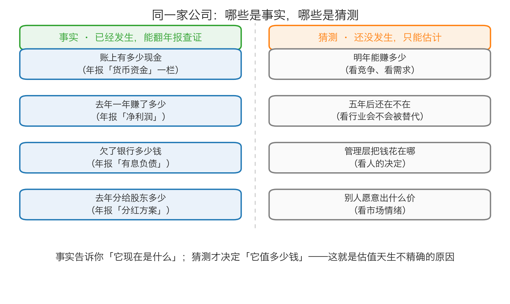
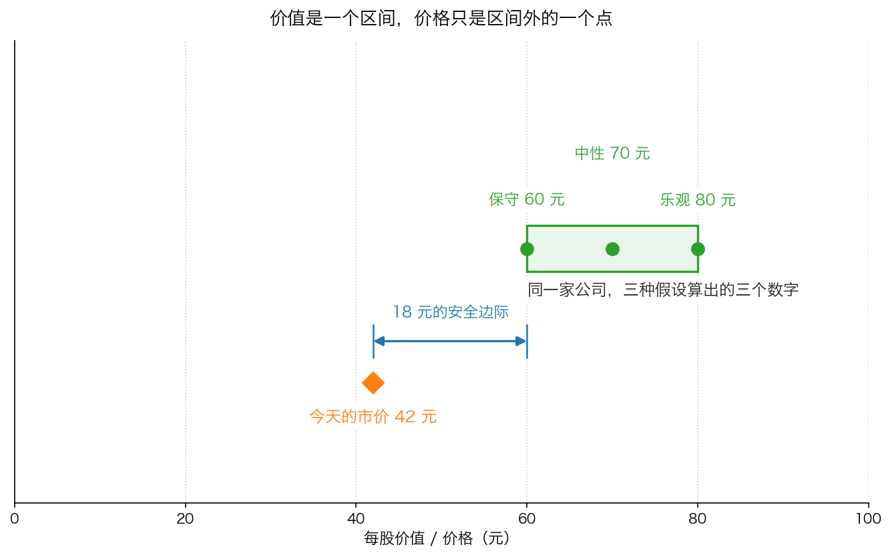

# 第 0 章：估值不是算命——先分清事实与猜测

> 本章你将：
> - 学会把一家公司的信息分成两堆：**能翻年报查证的事实**，和**只能估计的猜测**
> - 知道为什么"这家公司值多少钱"永远算不出一个精确的数字，只能算出一个区间
> - 说出估值不精确的三个原因：未来不可知、信息不全、人会犯错
> - 看到一个反常识的结论：**算得越精确，往往错得越离谱**
> - 建立这门课从第一天就要立下的基调：一切估计都往保守的方向做
> - 这对你的钱包意味着什么：以后有人给你一个精确到小数点的"目标价"，你会知道该警惕什么

Week 1 里我们弄明白了两件事：股票是公司所有权的一小片，价格是每天由买卖双方喊出来的。
这一章要往里走一步——既然股票代表公司，那**公司本身**值多少钱？这个问题有一个让人不舒服的答案：
它能被估算，但不能被精确计算。这一章就是要把这份"不舒服"变成你的武器。

---

## 0.1 先从一家奶茶店问起

假设你的朋友开了一家奶茶店，开了三年，现在他要出国，想把店转给你。

他开口说："我这店值 200 万。"

你当然不会直接掏钱。你会开始问问题。而你会问的问题，其实分成了两类。

**第一类问题是能查到答案的：**

- 店里账上还有多少现金？
- 冰柜、封口机、装修这些，当初花了多少钱，现在还剩多少？
- 欠供应商多少货款？欠银行多少贷款？
- 去年一整年，扣掉房租、原料、人工、税之后，净赚了多少？
- 去年分给股东（也就是他自己）多少钱？

这些问题都有**记录**，翻账本、看银行流水就能查证。哪怕他记的账有点乱，事实本身是存在的，也是可以核对的。

**第二类问题，谁也查不到答案：**

- 明年这条街上会不会再开三家奶茶店？
- 明年他能不能还赚这么多？后年呢？五年后呢？
- 如果他继续经营，会不会把赚来的钱拿去开分店，结果亏掉？
- 如果有人愿意出更高的价接盘，那家店值多少？

这些问题没有记录可查，因为它们**还没有发生**。

> 💡 **换个说法：** 第一类问题问的是"它现在是什么"，第二类问题问的是"它将来会怎样"。
> 而糟糕的是——**给一家公司定价，靠的恰恰是第二类问题。**

## 0.2 事实：能查证的过去

在投资里，上面那"第一类问题"有一个正式的名字，叫**财务报表**。

> 📌 **划重点：** 财务报表就是公司定期公布的记账结果，你可以把它理解成公司的**体检报告**：
> 每隔一段时间，公司把自己的家当、欠债、收入和支出，按统一的格式报出来，交给所有人看。
> 在中国 A 股，公司必须定期把这份报告公开，谁都能下载。

一家公司的报表里，属于"事实"的典型数字有这些（后面第 1 章会带你逐个认识它们）：

| 事实类信息 | 在年报里的名字 | 为什么算事实 |
|---|---|---|
| 它账上有多少现金 | 货币资金 | 银行对账单能核对 |
| 它去年赚了多少 | 净利润 | 已经发生的收入和支出 |
| 它欠了多少钱 | 负债（有息负债、应付账款） | 借款合同、欠条 |
| 它去年分了多少红 | 利润分配方案 | 已经派出去的钱 |
| 它有多少台设备、多少存货 | 固定资产、存货 | 盘点记录 |

*图 0-1：左边是可以查证的过去，右边是只能估计的未来。估值的全部难度，都在右边那一栏。*

> ⚠️ **易踩坑：** 事实不等于真相。报表上的数字是**按规则记出来的**——比如一台机器按 5 年折旧还是按 10 年折旧，
> 出来的"净利润"就不一样；一笔货是今年确认收入还是明年确认，今年和明年的利润也跟着变。
> 卡拉曼在书里说得很直接：
>
> > "财务报表中公布的账面价值、收益和现金流等仅仅是使用了一系列相对严格的标准和规则的会计师们给出的最好的猜测。"（p131）
>
> 所以更准确的说法是：**事实 = 有据可查的过去，但它也只是"按照某套规则记下来的过去"。**

## 0.3 猜测：还没发生的未来

现在看右边那一栏。公司的价值取决于它未来能给你带来多少回报，而这些回报还没发生。

卡拉曼在书里用可口可乐举过一个例子，讲得特别清楚（p136）。他先问：可口可乐明年还会卖汽水吗？
当然会。今年销量会增加吗？几乎毫无疑问，因为它的销量从 1980 年以来每年都在增长。
但接下来问题就难了：**会增加多少？** 更麻烦的是：**多卖的那些汽水，能多赚多少钱？**
这取决于价格、消费者对涨价的反应、竞争对手的动作、税率会不会变。
如果要预测五年、十年以后的销量和利润，"大量的因素会让预测出现偏差"。

> 💡 **换个说法：** "明年夏天会热"是预测，你可以有把握；
> "明年夏天这家店的冰淇淋会卖出去 12 万支，每支赚 1.8 元"——这就不是预测，这是许愿。
> **估值需要的是后面那一种，而它恰恰是做不到的。**

四个最典型的猜测：

1. **明年能赚多少** —— 取决于竞争、需求、成本、政策。
2. **五年后还在不在** —— 取决于行业会不会被替代（想想胶卷、纸媒、功能机）。
3. **管理层会把钱花在哪** —— 这取决于人的决定，而人是会变的。
4. **别人愿意出什么价** —— 取决于市场情绪，跟公司经营可以完全无关。

## 0.4 估值不可能精确的三个原因

把上面两栏放在一起，就能得出这一章的核心结论了。给一家公司估值之所以做不到精确，原因有三个。

**原因一：未来不可知。**

这不是"我们还不够聪明"，而是**结构性的**。卡拉曼说：

> "出现了一个不可解决的矛盾：为了进行现值分析，你必须对未来进行预测，然后对未来的预测并不可靠。"（p137）

他甚至说，预测一家企业未来的现金流，"通常只是一种猜谜游戏"（p136）。注意，说这话的人管理着几百亿资金，
一辈子都在做这件事。他不是在谦虚。

**原因二：信息不全。**

你可能觉得，只要我把年报全部读完、把每一行都搞懂，就能算准了。卡拉曼直接否定了这种想法：

> "如果认为表述一项特定投资的所有事实都是已知或者是可以被获知的，那么你就犯了一个严重的错误。
> 这不仅是因为一些问题可能依然没有得到解答，甚至有可能还没有人问过所有那些该问的问题。"（p103）

翻译一下：**有些关键信息，不是你没找到，而是根本没人知道，甚至没人想到要去问。**

**原因三：人会犯错。**

就算信息齐全、未来可预测，你和你对面的那个人也会得出不同的结论。书里有一个特别有说服力的例子（p133）：
1989 年，华尔街为一幅幅待售资产（布鲁明戴尔百货、Sea World 海洋公园）给出的估值范围，
**最高的预期是最低的预期的两倍**。给出这些数字的不是新手，是拿着高薪、掌握大量信息的专业分析师。

> 📌 **划重点：** 如果掌握内部信息的专业机构，对同一项资产的价格能差出一倍，
> 那么你我在公开信息基础上算出来的数字，凭什么精确到小数点后两位？

还有第四个原因，是卡拉曼专门提醒的：**精确的假象**。

> "任何想精确评估企业价值的尝试都将带来不准确的评估。问题是人们很容易将作出精确预测的能力与作出正确预测的能力混为一谈。"（p131）

他还吐槽了电子表格（今天相当于 Excel）：

> "计算机化电子数据表的出现让这一问题进一步恶化，并让人产生了能够进行全面且细致分析的错觉。"（p132）

同一页上有一句更狠的话：**"垃圾进，垃圾出。"** 你输入表格的假设是垃圾，输出的小数点后四位也是垃圾。

## 0.5 所以：价值是一个区间

到这里，结论就自然出来了。既然事实只告诉你过去，猜测又天生不准，那么——

**一家公司的价值，不是一个数，而是一个区间。**

同一家公司，用悲观一点的假设算，可能值 60 元；用中性假设算，值 70 元；用乐观假设算，值 80 元。
这三个数都不是"错的"，它们只是三组假设的结果。

而**价格**不一样。价格永远是**一个点**：此时此刻买卖双方成交的那一个数字。

*图 0-2：价值是一段区间（60~80 元），价格是一个点（42 元）。当这个点落在区间下方，你才占了便宜。*

这个观点不是卡拉曼发明的，他引用了格雷厄姆在《证券分析》里的话：

> "关键的一点是，证券分析并不是未来精确决定某种证券的内在价值。证券分析的目的仅仅是确定价值是否足够——
> 如是否足以支持一种债券或者支持购买一种股票——或者价值是否大幅高于或者低于市场上的价格。
> 对内在价值粗略和大致的衡量可能就已经足以达到这样的目的了。"（p132–133）

这段话值得读三遍。**你不需要知道它精确值多少，你只需要知道它"明显比价格值钱"。**
格雷厄姆自己就是这么干的：他常常只粗略算一下公司的清算价值，也就是"今天关门卖东西还能剩多少"，
因为他承认自己没法算得更精确（p133）。

> 💡 **换个说法：** 你不需要知道一个人的精确体重，就能判断他能不能挤进这部电梯。
> 投资中的大多数判断，都属于这种"够用就行"的判断。

顺带说一句，卡拉曼还指出：**正是因为大家算出来的价值不一样，市场才存在。**
如果所有人都能精确算出同一家公司的价值，那就没人愿意用不同的价格买卖了，市场也就不需要存在了（p133）。
所以"估值有分歧"不是市场的缺陷，它就是市场本身。

## 0.6 保守：从这一章开始定下的基调

既然怎么算都不精确，那正确的态度是什么？卡拉曼给的答案非常干脆：

> "价值投资者如何通过预测不可预测的事情来进行分析呢？唯一的答案就是保持保守立场。
> 因为所有的预测都会出现错误，乐观的预测往往会让投资者处在不确定的情形下。"（p138）

同一页上还有一句操作层面的总结：

> "投资者都知道只可做保守的预测，然后只能以大幅低于根据保守预测作出的价值评估的价格购买证券。"（p138）

这句话里有**两个动作**，缺一不可：

1. **估计的时候保守**：能赚 10% 就不要假设 20%，宁愿假设 8%；
2. **买的时候还要再打折**：算出来值 60 元，就别在 58 元买，要等到明显低于 60 元再出手。

第二个动作就是这门课的主角——**安全边际**：买入价与保守估算的价值之间的差距，
它是你为自己估错留出的容错空间。第 5 章会让它正式登场，Week 7 会把它讲透。现在你只要先记住它存在。

> 🇨🇳 **落到 A 股/港股：** 你在行情软件里能看到很多"机构目标价"，常常精确到"12 个月目标价 68.50 元"。
> 学完这一章你就知道该怎么看它：那是一组假设下的计算结果，不是预言。它可能对，也可能错得离谱——
> 而你自己的任务，是搞清楚它背后的假设保不保守，而不是抄下那个数字。

---

## ✍️ 想一想

1. **你朋友说"我这店值 200 万，因为按去年净赚 20 万的 10 倍算"。** 这句话里，哪些部分是事实，哪些部分是猜测？如果去年那 20 万里有一半是因为旁边工地施工、工人天天来买奶茶，你的判断会怎么变？
2. **为什么"两个人都算错了"这句话本身可能是错的？** 提示：想清楚"对"和"精确"的区别，再想想为什么价值是一个区间。
3. **有人说："我用的模型有 30 个输入变量，算出来的价值是 43.75 元。"** 学完这一章，你会对这句话保持什么警惕？变量多，代表更准还是更不准？

> 💡 **参考思路：**
> 1. **"去年净赚 20 万"是事实**（可以在账上核对，前提是账是真的）；**"值 200 万"是猜测**，而且它把两个猜测叠在了一起：一是假设未来每年都能赚 20 万，二是假设有人愿意按 10 倍出价。如果那 20 万里有一半来自工地工人的临时需求，那"未来还能赚 20 万"这个假设就非常脆弱——工地一完工，收入可能直接掉一半。这正是"事实很硬，猜测很软"的典型例子。
> 2. **因为"对"和"精确"是两件事。** 一个人说"值 60 到 80 元"，另一个人说"值 65 到 85 元"，两个人的区间大量重叠，这说明他们对这家公司的判断其实差不多，只是假设不同。相反，一个精确地说"值 43.75 元"的人，如果他的假设是错的，那他的精确毫无价值——就像用一把不准的尺子量出一毫米的精度。卡拉曼的原话是：人们很容易把"作出精确预测的能力"和"作出正确预测的能力"混为一谈。
> 3. **要警惕的是"精确的假象"。** 变量越多，看起来越专业，但每一个变量都是一个可能出错的假设，而且它们会互相影响。30 个假设里只要有两三个错了，最后那个数字就完全不可信——可是它长得特别可信（精确到分）。正确的反应是：不要问"这个数是多少"，要问"如果我把它最乐观的假设换成最悲观的，结果会变成多少"。

---

## 🧮 算一算

**情境**：有一家做文具批发的小公司，你手上有下面这些信息（**以下为简化示意数字，用于教学**，不是任何真实公司的财报）：

| 项目 | 数字 |
|---|---|
| 总资产 | 200 万元 |
| 总负债 | 80 万元（其中欠银行 40 万元） |
| 总股本 | 10 万股 |
| 去年净利润 | 30 万元 |
| 去年折旧 | 10 万元 |
| 去年买设备花掉的钱 | 12 万元 |

**第 1 步：算净资产（它真正属于股东的部分）**

净资产 = 总资产 - 总负债 = 200 万 - 80 万 = **120 万元**

*这一步在算什么：把公司所有家当加起来，再减掉欠别人的，剩下的才是股东的。*

**第 2 步：算每股净资产（摊到每一股上是多少钱）**

每股净资产 = 净资产 除以 总股本 = 120 万 除以 10 万股 = **12 元/股**

*这一步在算什么：把"整个公司值多少"换算成"每一股对应多少家底"，这样才能和股价直接比。*

**第 3 步：算每股盈利**

每股盈利 = 净利润 除以 总股本 = 30 万 除以 10 万股 = **3 元/股**

*这一步在算什么：公司一年赚的钱，摊到每一股上是多少。*

**第 4 步：算自由现金流（它一年真正能自由支配的钱）**

自由现金流 = 净利润 + 折旧 - 资本开支 = 30 万 + 10 万 - 12 万 = **28 万元**

*这一步在算什么：折旧是设备磨损记在账上的成本，但这一年并没有真的掏出这笔现金，所以要加回来；
买设备花掉的 12 万是真金白银出去了，所以要减掉。剩下的 28 万，才是公司能拿去分红、还债、扩张的钱。*

**第 5 步：用"盈利法"估一个区间**

假设这家公司未来几年大致还能赚这么多。参考同行的出价习惯：
- 保守一点，市场只肯给 3 倍：3 元 乘 3 = **9 元/股**
- 乐观点，市场肯给 5 倍：3 元 乘 5 = **15 元/股**

所以这家公司的价值区间大约是 **9 元 到 15 元**。

**第 6 步：做判断**

如果今天有人报价 **20 元/股** 卖给你，贵还是便宜？

答：**贵。** 20 元已经高于乐观估计 15 元，说明这个价格里包含了"未来会比现在更好"的假设。
你要为这些还没发生的假设付钱——而按这一章的结论，那些假设恰恰是最不可靠的部分。

> 📌 **划重点：** 注意第 5 步里，我们没有假装知道"准确的倍数应该是 4.7 倍"。
> 我们只是说：保守 3 倍，乐观 5 倍，于是得到一段区间。**这就是"够用"的估值。**

---

## ✅ 小测验

**1. 下面哪一项属于"事实"而不是"猜测"？**
A. 这家公司明年能赚 5 亿元
B. 这家公司去年底账上有 12 亿元货币资金
C. 这家公司的股票明年会涨到 80 元
D. 这家公司五年后还会是行业第一名

**2. 卡拉曼说"任何想精确评估企业价值的尝试都将带来不准确的评估"，主要原因是：**
A. 会计人员水平不够
B. 分析师不够勤奋
C. 企业的未来现金流无法被可靠预测，且信息永远不完整
D. 计算器的精度有限

**3. 关于"价值是一个区间"，下面哪种理解是对的？**
A. 因为我们水平不够，等水平够了就能算出一个精确的数字
B. 区间意味着我们可以随便报一个范围，反正都对
C. 企业的价值受多种假设影响，不同假设给出不同结果；我们只需要判断价格是否明显低于保守的估算
D. 只有当区间上下限相差不超过 5% 时，这个估值才有效

> **答案与解析**
>
> **1. B。** "去年底账上有多少钱"是已经发生、可以核对的记录，属于事实（虽然口径可能有讲究，但它有据可查）。A、C、D 全部指向还没发生的事：明年赚多少、股价涨到多少、五年后是不是第一，都是猜测。注意 C 尤其典型——股价是市场情绪的结果，跟公司经营可以完全脱钩。
>
> **2. C。** 卡拉曼给出的理由不是"能力问题"，而是结构性的：企业没有合同式确定的现金流，未来天生不可预测；同时信息永远不可能完整，有些问题甚至没人问过。所以这不是"再努力一点就能解决"的问题。A、B 把它误解成了水平问题；D 是玩笑——问题从来不在计算环节，而在输入环节（垃圾进，垃圾出）。
>
> **3. C。** 区间的存在，是因为假设不同，不是因为标准松。A 错在以为精确是可以追求的；B 错在把"区间"当成了"随便"——区间必须建立在具体的、可复核的假设上（比如"保守按 3 倍盈利"），而不是拍脑袋；D 错在用一个数字标准去判断估值是否有效——现实中优秀公司的估值区间往往非常宽（原书里 Esco 公司的例子，最保守 4.70 美元、乐观 14.76 美元，相差三倍），区间宽不代表估值没用，它反而是重要信息：说明这家公司很难算准，需要更大的折扣。

---

## 📖 回到原书

- 对应原书 **第八章 企业评估艺术**，`raw/安全边际-中文版/page_131.md` ~ `page_138.md`（原书 p131–p138），以及 **第六章** `page_103.md` ~ `page_104.md`（原书 p103–p104）。
- **建议精读：p131–p133**（"价值范围"一节：为什么无法精确评估、格雷厄姆的原话、专业分析师估值差一倍的故事）。
- **建议精读：p138 最后一段**（"唯一的答案就是保持保守立场"，这是整本书的基调）。
- **建议精读：p103–p104**（企业评估的复杂性和易变性，"你如何能够肯定自己所支付的价格是打折价呢"）。
- **可以略读：p136–p137**（可口可乐、啤酒行业的成长预测例子）。时代背景和行业细节可以跳过，只要记住那个结构：**找到增长来源容易，预测增长多少极难。**
- 原书金句（逐字引用）：
  > "任何想精确评估企业价值的尝试都将带来不准确的评估。问题是人们很容易将作出精确预测的能力与作出正确预测的能力混为一谈。"（p131）
  > "对内在价值粗略和大致的衡量可能就已经足以达到这样的目的了。"（p132–133）
  > "价值投资者如何通过预测不可预测的事情来进行分析呢？唯一的答案就是保持保守立场。"（p138）

> 📌 **说明：** 原书在这里默认你已经熟悉财务报表和估值术语，所以直接就开始讨论"现值分析法""清算价值法"。
> 我们这一周就是来替你补上这一段的：下一章先学会看懂三个数字。
