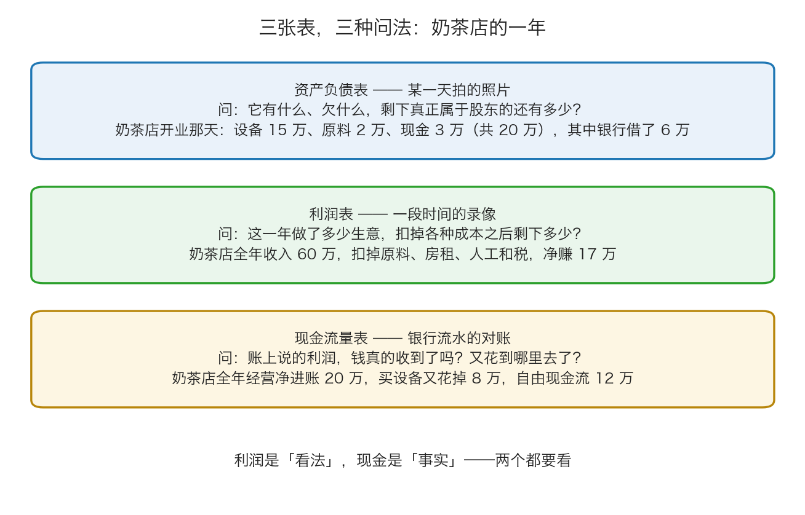
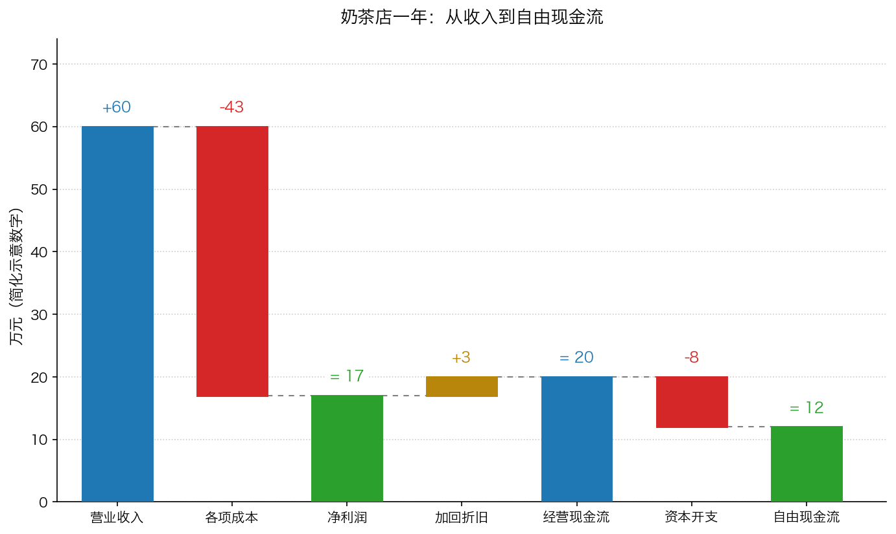

# 第 1 章：看懂三个数字——资产、利润与现金

> 本章你将：
> - 知道财务报表是公司的"体检报告"，由三张表组成，每张表回答一个不同的问题
> - 会用一家奶茶店从零建出一张极简资产负债表，并说清"净资产"到底是什么
> - 会用收入减去成本算出"净利润"，并知道"每股盈利"是怎么摊出来的
> - 会解释为什么"账面赚了钱"不等于"手上多了钱"，并亲手算出"经营现金流"和"自由现金流"
> - 拿到一份真实年报时，知道去哪三张表里各找一个数字
> - 这对你的钱包意味着什么：以后听到"这家公司一年赚 5 个亿"，你会先追问一句"现金收到了吗"

上一章我们立下了基调：估值只能给区间，所以一切都要往保守里做。
但保守的前提是**看得懂**。这一章就干一件事：把看懂一家公司所需要的最小知识集装进你脑子里。
你不需要成为会计，只需要认识三个数字。

---

## 1.1 三张表，三种问法

先说清楚"财务报表"这个词。

> 💡 **换个说法：** 你去医院体检，最后拿到一叠报告：一张是你躺上机器那一刻的身体**快照**（拍了片子、量了血压），
> 一张是**过去一年**你生活习惯的总结（吃了多少油、睡了多少觉），还有一张是**流水账**（这一年你进出医院花了多少钱）。
> 公司的财务报表也是三张纸，问的正好是这三种问题。

| 表的名字 | 它像什么 | 它回答的问题 |
|---|---|---|
| 资产负债表 | 某一天拍的照片 | 它有什么、欠什么，扣掉欠的之后还剩多少？ |
| 利润表 | 一段时间的录像 | 这一年做了多少生意，扣掉成本后剩下多少？ |
| 现金流量表 | 银行流水的对账 | 账上说的利润，钱真的收到了吗？又花到哪去了？ |

*图 1-1：同一家奶茶店，三张表三种问法。它们讲的其实是同一件事的三个侧面。*

> ⚠️ **易踩坑：** 这是一堂**够用版**的课，不是会计课。真实年报里的资产负债表有几十行，
> 利润表会拆成"营业成本、销售费用、管理费用、财务费用"等等，现金流量表会拆成经营、投资、筹资三个部分。
> 这些细节我们留到 Week 9 正式讲第八章时再展开。这一章你只要记住三个数字。

## 1.2 第一张表：它有什么（资产、负债、净资产）

我们从头开一家奶茶店。

**开业那天（12 月 1 日）**，你做了三件事：

1. 自己拿出 **14 万元**（这是你的本钱）；
2. 向银行借了 **6 万元**；
3. 手上一下子有了 **20 万元**。

然后你把这 20 万花出去：买冰柜、封口机、装修花了 **15 万元**；进原料花了 **2 万元**；剩下 **3 万元**现金放在账上。

现在，站在 12 月 1 日晚上，我们把这家店的"家底"记下来：

| 它有什么（资产） | 金额 | 它欠谁（负债与股东权益） | 金额 |
|---|---|---|---|
| 设备与装修 | 15 万元 | 欠银行的钱 | 6 万元 |
| 原料（存货） | 2 万元 | **股东投入的钱（净资产）** | 14 万元 |
| 现金 | 3 万元 | | |
| **合计** | **20 万元** | **合计** | **20 万元** |

这张表就是**资产负债表**。请注意最右边那两行：左边一共 20 万，右边也一共 20 万。
这不是巧合，这是永远的等式：

$$资产 = 负债 + 净资产$$

> 💡 **换个说法：** 你花 100 万买了一套房，其中 30 万是自己出的，70 万是贷款。
> 那么"资产"是 100 万，"负债"是 70 万，"净资产"就是 30 万——**真正属于你的那部分。**
> 房价从 100 万涨到 120 万，你的净资产就从 30 万变成 50 万，涨了 67%，虽然房子只涨了 20%。

把三个词的定义说清楚：

- **资产**：公司拥有的、能给未来带来好处的东西（现金、存货、设备、厂房、专利）。生活里的对应物是"家当"。
- **负债**：公司欠别人的钱和东西（银行贷款、欠供应商的货款）。对应物是"外债"。
- **净资产**：资产减掉负债之后，真正属于股东的那部分。它还有一个名字叫**股东权益**，
  会计账本上记的这个数字就叫**账面价值**。

> 🇨🇳 **落到 A 股/港股：** 在 A 股年报里，这张表叫「**合并资产负债表**」。
> 找净资产时，用「**归属于母公司股东的权益**」这一行（也叫"归母净资产"）。
> 为什么不直接看"所有者权益合计"？因为上市公司的子公司里可能还有别的股东（少数股东），
> 那部分钱不归上市公司股东。这个细节你只要先知道"要找带'归母'两个字的"就够了。

一年过去了，这张表会变。假设这一年你赚了钱、又还了一部分贷款、又进了一批原料，表就会变成另一个样子。
但那个等式永远成立。

> ⚠️ **易踩坑：** 净资产 14 万，**不等于**"这家店现在能卖 14 万"。
> 那台冰柜账上写着 15 万，但你今天挂二手平台，可能 5 万都没人要。
> 账面价值是账本上的记录，它可能高估，也可能低估（一块早年买的地皮，账上可能只记着很便宜的价格）。
> 这一点是第 4 章"资产法"的关键。

## 1.3 第二张表：它一年赚多少（净利润）

**过去这一年**，奶茶店做了多少生意？

| 项目 | 金额 |
|---|---|
| 营业收入（卖奶茶收到的钱） | 60 万元 |
| 减：原料成本 | 18 万元 |
| 减：房租 | 8 万元 |
| 减：人工工资 | 12 万元 |
| 减：水电、杂费、设备折旧 | 3 万元 |
| 减：所得税 | 2 万元 |
| **等于：净利润** | **17 万元** |

这就是**利润表**。它的主线只有一条：

$$净利润 = 收入 - 成本费用 - 税$$

三个词：

- **营业收入**：这一年做生意收进来的钱（注意：是"应该收"的，不一定已经收到，下一节细说）。
- **成本费用**：为了做这笔生意花掉的钱（原料、房租、人工、水电、折旧）。
- **净利润**：全都扣完之后剩下的。这是公司一年"赚"的钱。分成到每一股上，就叫**每股盈利**：

$$每股盈利 = 净利润 \div 总股本$$

**手算示例**：奶茶店这一年净利润 17 万元。假设这家店被分成了 10 万股，
那么每股盈利 = 17 万 除以 10 万 = **1.7 元/股**。

> 🇨🇳 **落到 A 股/港股：** 年报里这张表叫「**合并利润表**」。你要找的那一行叫
> 「**归属于母公司股东的净利润**」（简称"归母净利润"），它就是财经新闻里说的"净利润"。
> 另外你会经常看到一个词叫「**扣非净利润**」——"扣非"是"扣除非经常性损益"的缩写，
> 意思是把卖楼、卖股权、政府一次性补贴这类**不会年年都有**的收益扣掉之后的利润。
> 一家公司如果靠卖一栋楼把利润做得很漂亮，扣非净利润会立刻露馅。这是个非常有用的数字。

> ⚠️ **易踩坑：** 净利润是一种"看法"，不是"事实"。它取决于一堆会计选择：
> 折旧按几年摊、这笔收入算今年还是明年、这笔支出算成本还是算投资。
> 所以卡拉曼说得很直接：
>
> > "一直以来每股收益是投资者使用最多的评估准绳。不幸的是，正如我们所看到的，
> > 每股收益并不是一种精确的衡量标准，它会受到人为操纵和会计行为的影响。"（p158）

## 1.4 第三张表：钱，真的收到了吗（现金流）

现在到了这一章最重要的一节。

奶茶店账上写着"净赚 17 万"。可是你打开手机银行一看，余额只多了几万块。
钱呢？

有三种常见情况，每一种都值得你记住：

**情况一：赊账。** 隔壁公司订了 200 杯奶茶搞团建，说"月底一起结"。
奶茶已经送出去了，按会计规则这笔收入**今年就要算**（因为货已经交付），
但钱还在别人手里。这笔"别人欠你的钱"，叫**应收账款**。

**情况二：钱变成了货。** 你花 10 万进了一批杯子、吸管、茶叶，钱出去了，但东西还在仓库里。
它记在**存货**里，是资产，不是费用——但现金确实少了。

**情况三：折旧。** 那台 15 万的设备，会计说"按 5 年折旧"，于是每年记 3 万的成本。
可是这 3 万**今年并没有真的掏出去**——钱在买设备那天就付完了。
所以算现金的时候，要把折旧**加回来**。

把这三件事考虑进去，就有了**经营现金流**（全称"经营活动产生的现金流量净额"）：

$$经营现金流 = 净利润 + 折旧 - 应收账款增加 - 存货增加 + 应付账款增加$$

> 💡 **换个说法：** 经营现金流就是"这一年，主业真正进来了多少现金、出去了多少现金，净剩多少"。
> 它看的是**银行流水**，不是账本上的说法。

**手算示例（奶茶店，简化示意数字）**：净利润 17 万，今年折旧 3 万，
另外进货多压了 2 万在仓库里（存货增加），供应商那边欠款多了 2 万（应付账款增加）。

经营现金流 = 17 + 3 - 2 + 2 = **20 万元**

但这 20 万还不是你能随便花的钱。因为你还买了新设备——比如添了一台制冰机、换了招牌，花了 8 万。
这种"为了维持生意必须花掉的买设备、建厂、装修的钱"，叫**资本开支**。扣掉它，剩下的才是**自由现金流**：

$$自由现金流 = 经营现金流 - 资本开支$$

自由现金流 = 20 万 - 8 万 = **12 万元**

*图 1-2：同一家奶茶店，从营业收入一路走到自由现金流。注意最后两个数字：账面净赚 17 万，手上真正能自由支配的是 12 万。*

> 📌 **划重点：** 一家公司的价值，最终取决于它能给你多少**现金**，而不是它账面上写着赚了多少。
> 这就是为什么第 4 章的第三种估值方法（现金流法）是最重要的那一种。
> 卡拉曼提醒过：
>
> > "最重要的是，不管投资者在价值评估分析时使用收益还是现金流，重要的是要记住，数据本身并不代表一切，
> > 这些数字是了解企业正在发生的事情的途径。"（p159）
>
> 换句话说：**数字是线索，不是结论。**

> 🇨🇳 **落到 A 股/港股：** 年报里这张表叫「**合并现金流量表**」，分成三段：
> 「经营活动产生的现金流量净额」「投资活动产生的现金流量净额」「筹资活动产生的现金流量净额」。
> 你只需要看第一段（经营活动），它就是"主业自己挣到的现金"。
> 一个小技巧：把"经营活动现金流净额"和"净利润"并排看，
> 如果一家公司连续多年经营现金流都明显低于净利润，就要多问几个为什么。

## 1.5 够用版到此为止：请记住这三个数字

这一章讲完了。你现在手里有了一张"最小清单"：

| 要记的数字 | 在哪张表里找 | 它回答什么问题 | 它什么时候会骗人 |
|---|---|---|---|
| **净资产**（每股净资产） | 资产负债表 → 归母权益 | 它有多少家底？欠了多少？ | 设备厂房可能早就值不了账上那个数 |
| **净利润**（每股盈利） | 利润表 → 归母净利润 | 它一年赚多少？ | 可能混着卖楼、卖股权这类一次性收益 |
| **自由现金流** | 现金流量表 → 经营现金流，再减去资本开支 | 它真正能自由支配多少现金？ | 偶尔一年可能被大额收款或付款扭曲，要看多年 |

> 📌 **划重点：** 这三个数字，就是你这一周唯一必须带走的东西。
> 后面三章的所有估值方法，用的都是它们三个：
> 净资产用来算"资产法"，净利润用来算"盈利法"，自由现金流用来算"现金流法"。

> ⚠️ **再次提醒：** 真实财报比这里复杂得多的地方，至少有这几处：
> 商誉（收购别人多付的那部分钱）、少数股东权益、递延所得税、各种准备金……
> **这些我们这一周全部不讲。** Week 9 讲第八章时会正式处理它们。现在你只需要能拿到那三个数。

---

## ✍️ 想一想

1. **一家公司今年净利润 1 亿元，经营现金流是负的 5000 万元。** 请给出至少两种可能的原因，并说明哪一种更让你担心。
2. **为什么"折旧"要从净利润里加回来算现金流？** 如果一台设备的折旧年限从 5 年改成 10 年，净利润会怎么变？经营现金流会怎么变？哪个变、哪个不变，说明了什么？
3. **奶茶店的例子：账面净赚 17 万，自由现金流只有 12 万。** 如果老板对你说"我这店一年赚 17 万，按 10 倍估值卖你 170 万"，你会怎么回应？

> 💡 **参考思路：**
> 1. 常见原因有两类。**第一类是"钱被占用了"**：应收账款大幅增加（货卖了、钱没收到，可能是放宽了信用政策，甚至可能是压货给经销商），或者存货大幅增加（产品卖不动，堆在仓库里）。**第二类是"钱花出去了"**：大量资本开支（在建工程、买设备）——但这一部分通常记在投资活动里，不会让经营现金流变负。所以如果**经营现金流是负的**，更值得担心的是第一类，尤其是"应收账款增速远超收入增速"，那往往意味着它在用赊账换收入。
> 2. **折旧是"账上记的成本"，不是"今年掏出去的现金"**，所以算现金流时要加回来。折旧年限从 5 年改成 10 年，每年摊的成本变小，**净利润会变高**；但**经营现金流不变**（因为加回来的折旧也同步变小了，一增一减正好抵消）。这个对比说明：净利润是"看法"，现金流是"事实"——换个会计估计，利润就变了，现金不会变。
> 3. 可以这样回应：**"你赚的是账面利润，我能自由支配的是现金。"** 按自由现金流 12 万算，如果要求 10% 的年回报，那么"每年能拿到 12 万"这件事对应的价值大约是 120 万；而且还要问清楚：这 17 万里有没有一次性收入？应收账款收得回来吗？明年街上会不会多开三家店？——注意，这就是在把"事实"和"猜测"分开。

---

## 🧮 算一算

**情境**：下面是一家小公司**某一年**的简化示意数据（**以下为简化示意数字，用于教学**）。

**资产负债表（年末）**

| 项目 | 金额 | 项目 | 金额 |
|---|---|---|---|
| 现金 | 30 万元 | 应付账款 | 30 万元 |
| 应收账款 | 40 万元 | 银行借款 | 50 万元 |
| 存货 | 50 万元 | | |
| 设备等固定资产 | 80 万元 | | |

**利润表（这一年）**

| 项目 | 金额 |
|---|---|
| 营业收入 | 300 万元 |
| 各项成本费用（其中含折旧 10 万元） | 250 万元 |
| 所得税 | 10 万元 |

**其他信息**：这一年应收账款比去年多了 20 万元，存货比去年多了 10 万元，
应付账款比去年多了 5 万元；这一年买设备花了 15 万元（资本开支）。

**第 1 步：算总资产、总负债、净资产**

- 总资产 = 30 + 40 + 50 + 80 = **200 万元**
- 总负债 = 30 + 50 = **80 万元**
- 净资产 = 200 - 80 = **120 万元**

*这一步在算什么：把左边的家当加起来，把欠别人的加起来，两头一减，就是股东的。*

**第 2 步：算净利润**

- 税前利润 = 营业收入 300 - 各项成本费用 250 = **50 万元**
- 净利润 = 税前利润 50 - 所得税 10 = **40 万元**

*这一步在算什么：一年的生意做完，扣掉所有成本和税之后剩下多少。注意"各项成本费用 250 万"里已经包含了折旧 10 万。*

**第 3 步：算经营现金流**

按顺序一步步来：

1. 从净利润出发：**40 万元**
2. 加回折旧（没掏现金的成本）：40 + 10 = **50 万元**
3. 减掉应收账款增加（货卖了，钱没收到）：50 - 20 = **30 万元**
4. 减掉存货增加（钱变成了仓库里的货）：30 - 10 = **20 万元**
5. 加上应付账款增加（欠供应商的钱多了，相当于晚付了）：20 + 5 = **25 万元**

所以 **经营现金流 = 25 万元**。

*这一步在算什么：把"账上赚的钱"一步步调整成"银行里真正多出来的钱"。*

**第 4 步：算自由现金流**

自由现金流 = 经营现金流 25 - 资本开支 15 = **10 万元**

*这一步在算什么：主业挣来的 25 万里，有 15 万必须投回去买设备才能维持生意，剩下 10 万才是真正能自由支配的。*

**第 5 步：回答那个关键问题**

老板说："我这一年赚了 40 万。" 但自由现金流只有 10 万。**那 30 万去哪了？**

把从 40 万走到 10 万的每一步都摊开：

| 步骤 | 金额 | 手上的钱变成了什么 |
|---|---|---|
| 净利润 | 40 万元 | 出发点（账上赚的钱） |
| 加：折旧 | +10 万元 | 折旧记在成本里，但这一年没掏现金，加回来 |
| 小计 | 50 万元 | 按现金口径调整过的利润 |
| 减：应收账款增加 | -20 万元 | 变成了客户欠你的钱 |
| 减：存货增加 | -10 万元 | 变成了堆在仓库里的货 |
| 加：应付账款增加 | +5 万元 | 欠供应商的钱晚付了，相当于暂时留住 5 万 |
| **等于：经营现金流** | **25 万元** | 主业真正挣到的现金 |
| 减：资本开支 | -15 万元 | 变成了新买的设备 |
| **等于：自由现金流** | **10 万元** | 真正能自由支配的钱 |

所以，从"账上赚 40 万"到"手上多 10 万"，中间那 **30 万**的去向是：

- 被客户欠走（应收账款增加）：**20 万元**
- 压在仓库里（存货增加）：**10 万元**
- 变成了设备（资本开支）：**15 万元**
- 减：晚付供应商省下来的：**5 万元**
- 减：折旧（本来就没花现金，不该算成"去向"）：**10 万元**

20 + 10 + 15 - 5 - 10 = **30 万元**，对上了。

**第 6 步：一句话总结**

> 这家公司"赚"了 40 万，但真正能自由支配的现金只有 10 万——**这就是为什么估值要看现金流。**

---

## ✅ 小测验

**1. 资产负债表里的恒等式是：**
A. 资产 = 负债 - 净资产
B. 资产 = 负债 + 净资产
C. 净资产 = 资产 + 负债
D. 净利润 = 收入 + 成本

**2. 一家公司今年净利润 5 亿元，经营活动现金流净额 1 亿元。下面哪种解释最合理？**
A. 公司一定在做假账
B. 公司的折旧特别少
C. 可能应收账款或存货大幅增加，赚到的钱被占用了
D. 说明这家公司生意非常好，利润很快就会变成现金

**3. 关于"自由现金流"，下面说法正确的是：**
A. 它就是净利润
B. 它是经营现金流减去资本开支之后剩下的钱
C. 它是营业收入减去成本
D. 它等于账上的现金余额

> **答案与解析**
>
> **1. B。** 左边是"它有什么"，右边是"这些钱从哪来"：一部分是借的（负债），一部分是股东投的加上自己赚的（净资产）。C 把方向搞反了；D 混进了利润表的公式，而且方向也错了（净利润 = 收入 - 成本）。
>
> **2. C。** 利润和现金的差距，最常见的原因就是"钱被占用了"：应收账款增加（赊账换收入）、存货增加（货压在仓库）。A 太绝对——这是常见现象，不必然是造假，但确实值得警惕、需要去看报表附注；B 说反了，折旧少会缩小利润与现金的差距；D 讲的是好消息，但题干里 4 亿的差距更需要被质疑而不是被祝福。真正的做法是：翻开现金流量表，看"应收账款增加"和"存货增加"这两行。
>
> **3. B。** 自由现金流 = 经营现金流 - 资本开支，意思是"主业挣来的现金，减掉维持生意必须投回去的钱，剩下能自由支配的部分"。A 错在把"看法"当成"现金"；C 描述的是毛利润的概念，还没扣人工、房租、税；D 是"现金余额"，是资产负债表上的一个时点数，跟一年挣了多少现金完全是两回事。

---

## 📖 回到原书

- 对应原书 **第八章 企业评估艺术** 的最后一节「传统的评估准绳——收益、账面价值及股息收益率」，`raw/安全边际-中文版/page_158.md` ~ `page_161.md`（原书 p158–p161）。
- **建议精读：p158–p159**（每股收益为什么不可靠、管理层会"逐步释放收益"、商誉摊销与非经常性收益）。
- **建议精读：p159**（账面价值一节：为什么"过去的成本不一定能很好地衡量当前的价值"）。
- **可以略读：p160–p161**（股息收益率的历史背景）。这一段留到 Week 7 讲安全边际时再回来看会更透。
- 原书金句（逐字引用）：
  > "过去的成本并不一定能很好地衡量当前的价值。"（p159）
  > "最重要的是，不管投资者在价值评估分析时使用收益还是现金流，重要的是要记住，数据本身并不代表一切，这些数字是了解企业正在发生的事情的途径。"（p159）
  > "有太多陷入困境的企业都会炫耀自己的高股息收益率，而股息收益率之所以很高并不是因为股息支付有所增加，而是因为股价出现了下跌。"（p160）

> 📌 **说明：** 原书这几页默认你已经知道什么是资产负债表、利润表和现金流量表，所以直接就在讨论
> "商誉摊销""非经常性收益""账面价值被操纵"这些进阶问题。我们这一章把地基补上了，
> 你在 Week 9 读第八章时，就能直接跟上卡拉曼的节奏。
