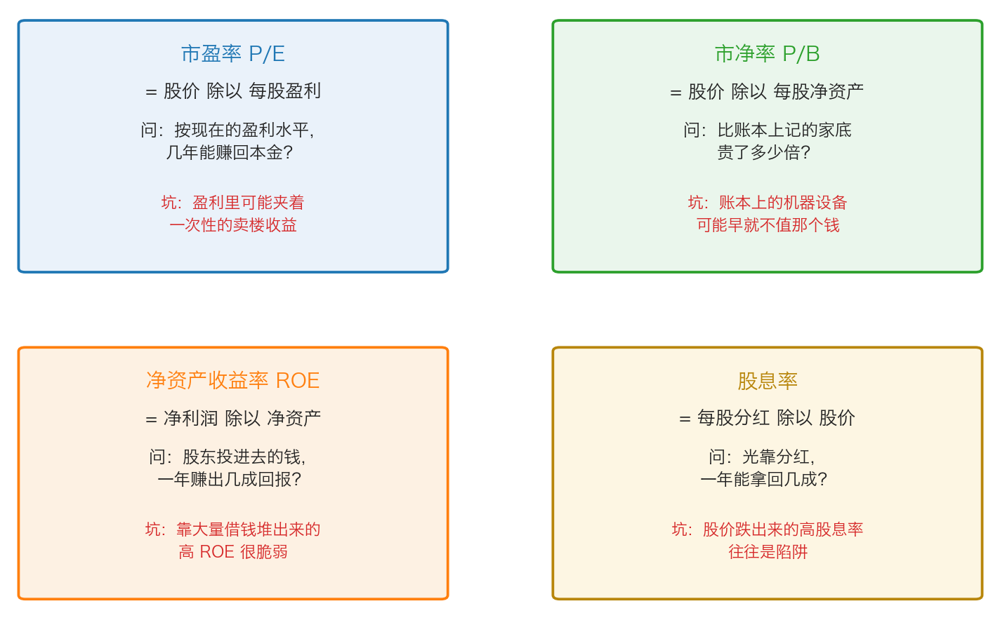
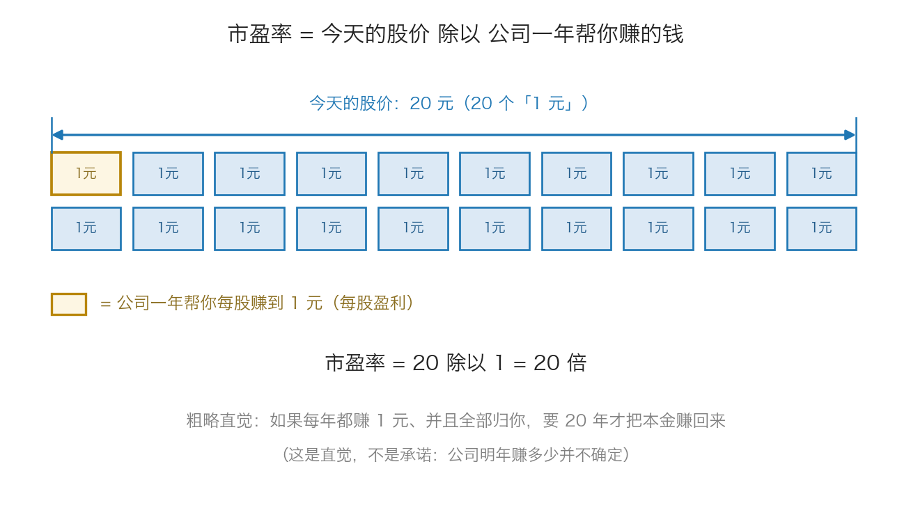

# 第 2 章：四个常用倍数——市盈率、市净率、净资产收益率、股息率

> 本章你将：
> - 能手算市盈率（PE），并说清"20 倍"到底是什么意思
> - 能手算市净率（PB），并知道什么叫"破净"，以及为什么轻资产公司 PB 天生偏高
> - 能手算净资产收益率（ROE），并识破"靠借钱堆出来的高 ROE"
> - 能手算股息率，并理解为什么"股价跌出来的高股息率"是陷阱
> - 知道这四个倍数各自回答什么问题、分别在哪一类公司身上最有用
> - 这对你的钱包意味着什么：你会用四个数字在 5 分钟内给一家公司做一次"初筛"，而不是听别人说"这票便宜"

上一章我们认识了三个数字：净资产、净利润、自由现金流。
但光有数字没法比较——A 公司一年赚 1 亿，B 公司一年赚 10 亿，谁更值得买？
不知道，因为你不知道它们的**价格**分别是多少。

这一章就把"价格"和"数字"放到一起，做出四个最常用的比值：**倍数**。

---

## 2.1 为什么大家爱用"倍数"

> 💡 **换个说法：** 你去菜市场，不会问"这把青菜多少钱"，你会问"**一斤**多少钱"。
> 把"总价"换成"每斤的价格"，不同的摊位才能比较。
> 买房子也一样：两套房总价差很多，但你会算"**租金回报率**"——一年租金除以房价，来比较哪套更划算。

投资里的"倍数"就是干这个的：把"股价"和"公司的某个数字"做成一个比值。
比值本身没有意义，**它的意义来自比较**——和同行业的公司比、和它自己的历史比、和银行的存款利率比。

这一章讲四个倍数。它们的分工是这样的：

*图 2-1：四个倍数的公式、它们回答的问题，以及各自最容易骗人的地方。*

> 📌 **划重点：** 倍数只是**提问的起点**，不是答案。
> 一个"低倍数"可能意味着便宜，也可能意味着这家公司快要不行了。
> 这一章的重点不是教你背公式，而是教你**知道每个倍数什么时候会骗人**。

## 2.2 市盈率 P/E：几年赚回本金

**市盈率**（英文 Price to Earnings，缩写 P/E）是四个倍数里最常被引用的一个。

> 💡 **换个说法：** 你想盘下一个奶茶铺。老板开价 60 万，而这个铺子一年净赚 6 万。
> 你心里马上会算：**10 年回本**。"10"这个数字，就是市盈率。

$$市盈率 = 股价 \div 每股盈利$$

因为"每股盈利 = 净利润 除以 总股本"，所以它还有另一种算法（结果完全一样）：

$$市盈率 = 总市值 \div 净利润$$

**手算示例一（用每股算）**：某公司股价 20 元，去年每股盈利 1 元。
市盈率 = 20 除以 1 = **20 倍**。

**手算示例二（用总量算）**：某公司总市值 200 亿元，去年净利润 10 亿元。
市盈率 = 200 除以 10 = **20 倍**。

**手算示例三（反过来用）**：某公司股价 30 元，市盈率 15 倍。那么它每股盈利大约是多少？
每股盈利 = 30 除以 15 = **2 元**。
（再乘上总股本，就是它的净利润。）

*图 2-2：把股价想成 20 个"1 元"的方块，公司一年帮你赚回其中 1 个——这就是 20 倍市盈率。*

**直觉含义**：市盈率 20 倍，可以粗略理解成"按现在的盈利水平，20 年赚回本金"。
但请立刻记住两个限定：

1. 公司赚的钱**不会全部分给你**（要留一部分再投资、还债）；
2. 公司明年的盈利**可能变多，也可能变少**。

所以那个"20 年回本"是**直觉，不是承诺**。

> ⚠️ **易踩坑：市盈率会骗人的四种情况**
> 1. **利润里有一次性收益。** 卖掉一栋楼赚了 3 亿，净利润一下子变得很漂亮，市盈率显得很低——但楼只能卖一次。这时候要去看"扣非净利润"。
> 2. **周期股在盈利最高点。** 煤炭、钢铁、航运这类强周期行业，景气顶点时利润极高，市盈率低到 5 倍，看起来便宜得不可思议——但接下来利润可能腰斩再腰斩（这就是 Week 6 会讲的"价值错觉"的一种）。
> 3. **亏损公司没有市盈率。** 分母是负的，算出来的数是负数，没有任何意义。有些软件会显示"—"。
> 4. **不同行业的市盈率不能直接比。** 稳定生意（水电、白酒）市场愿意给高一些的倍数；强周期行业市场只肯给低倍数。拿钢铁股的市盈率去说白酒股"太贵了"，是典型的用错尺子。

> 🇨🇳 **落到 A 股/港股：** 行情软件里你会看到三个市盈率：
> 「**静态市盈率**」用上一个完整年度的利润算，「**动态市盈率**」用今年的预测利润算，
> 「**市盈率(TTM)**」用最近四个季度的滚动利润算。TTM 最接近"当下"，
> 也是你最常该看的那个。看到"市盈率 8 倍"时，先问一句：这是哪个口径？

## 2.3 市净率 P/B：比账本上的家底贵几倍

**市净率**（英文 Price to Book，缩写 P/B）比的是价格和"家底"。

> 💡 **换个说法：** 一个人账本上记着 100 万的家当（房、车、存款），现在有人愿意花 80 万买下他全部的家当。
> 这时候市净率是 0.8 倍——**花 8 毛钱买 1 元的账面家当。**

$$市净率 = 股价 \div 每股净资产$$

**手算示例一**：某公司股价 12 元，每股净资产 10 元。
市净率 = 12 除以 10 = **1.2 倍**（市场愿意为账本上 1 元的家底付 1.2 元）。

**手算示例二（破净）**：同一家公司股价跌到 8 元，每股净资产还是 10 元。
市净率 = 8 除以 10 = **0.8 倍**。

当市净率小于 1，也就是股价低于每股净资产时，就叫"**破净**"。
在 A 股，"破净股"是一个专门的板块分类，你可以在行情软件里直接搜到。

**什么时候看市净率最有用**：银行的账上大部分是贷款和债券，
钢铁、化工、电力这些重资产行业的大部分家当是厂房设备——它们的价值主要就体现在"账本上的家底"上，
所以市净率对这些行业特别有意义。原书里卡拉曼讲的"清算价值"，也是从这个角度切入的。

> ⚠️ **易踩坑：市净率会骗人的四种情况**
> 1. **轻资产公司 PB 天生很高。** 一家公司的核心资产是品牌、配方、软件、用户，
>    这些东西在账本上几乎不记钱（会计只记"买来的"东西，"自己长出来的"不记）。
>    所以白酒、互联网公司的 PB 常常是几倍甚至十几倍——这不代表它贵，只代表它的家底不在账本上。
> 2. **账本上的家底可能是假的。** 一台十年前买的专用设备，账上还记着原价，
>    但今天可能只能当废铁卖。反过来，一块早年买的地皮，账上很便宜，市价却很高。
> 3. **商誉会虚增净资产。** 收购别人时多付的那部分钱，会记成"商誉"挂在资产里。
>    如果那家被收购的公司后来不行了，商誉就要"减值"，净资产会一夜缩水。这是 A 股很常见的一种暴雷方式。
> 4. **低市净率可能有低的原因。** 一家银行市净率只有 0.5 倍，可能不是因为便宜，
>    而是因为市场担心它账上的贷款收不回来——**账面上的净资产，未必是真能变现的净资产。**
>    这就是为什么原书说"过去的成本并不一定能很好地衡量当前的价值"（p159）。

> 🇨🇳 **落到 A 股/港股：** 银行股整体长期在 1 倍市净率附近甚至以下，中国石油这类强周期公司也长期破净。
> 破净既可能是"没人要"，也可能是"真的便宜"——**这正是 Week 9 讲清算价值时要解决的核心问题**，
> 现在你只要先学会认出它、并且知道不能只看这一个数字。

## 2.4 净资产收益率 ROE：股东的钱一年赚出几成

**净资产收益率**（英文 Return on Equity，缩写 ROE）跟前面两个不一样：
它不比较价格，它衡量的是**这家公司本身的赚钱效率**。

> 💡 **换个说法：** 你和朋友各开一家奶茶店，都投了 100 万本钱。
> 你的店一年赚 8 万，他的店一年赚 20 万。本钱一样多，他的店"用钱效率"是你的两倍多。
> 这个"用本钱赚回几成"的比例，就是 ROE。

$$净资产收益率 = 净利润 \div 净资产$$

**手算示例**：某公司去年净利润 12 亿元，净资产（归母权益）100 亿元。
ROE = 12 除以 100 = **12%**。

意思是：股东投进去的每 100 元本钱，这一年赚回了 12 元。

ROE 为什么重要？因为长期来看，**一家公司的股价回报很难长期超过它的 ROE 水平**。
一家常年 ROE 15% 的公司，和一家常年 ROE 4% 的公司，即使你买贵了或买便宜了，
十年之后，前者的股东大概率赚得多得多。所以巴菲特说，如果只能看一个指标，他看 ROE（这是流传很广的一个转述，不是他的原话；他 1977 年写过类似的意思）。

> ⚠️ **易踩坑：ROE 会骗人的三种情况**
> 1. **靠借钱堆出来的高 ROE。** 这是最常见的陷阱。假设一家公司自己有 100 元本钱，
>    又借了 400 元，一共 500 元去做生意，一年赚 50 元。
>    这时候 ROE = 50 除以 100 = **50%**，漂亮得惊人——但它真正的赚钱能力（50 除以 500 = 10%）
>    只是一般水平，而且一旦生意变差，那 400 元的利息会先把股东的钱吃掉。
>    **看到超高 ROE，第一件事是去看它的负债高不高。**
> 2. **一次性收益推高的 ROE。** 卖楼、卖子公司股权带来的利润，会让某一年的 ROE 突然跳高，
>    但这不可持续。
> 3. **净资产很小的时候，ROE 会失真。** 如果一家公司连年亏损，净资产被亏到接近于零，
>    那么只要它某一年赚一点点钱，ROE 就会显示成一个巨大的百分比（甚至是负数除以负数）。
>    这种 ROE 没有任何意义。

> 💡 **换个说法：** ROE 高的公司，就像是"用同样多的本钱，能撬动更大生意"的店主。
> 但如果那个"更大"是靠借来的钱撑的，那就不是本事，是风险。

## 2.5 股息率：光靠分红一年拿回几成

**股息率**（英文 dividend yield）衡量的是"公司分给你的现金，相对你付出的价格是多少"。

> 💡 **换个说法：** 你花 200 万买了一套房，一年收租金 8 万。
> 租金回报率 = 8 除以 200 = 4%。股息率就是股票的"租金回报率"。

$$股息率 = 每股分红 \div 股价$$

**手算示例**：某公司今年每股分红 0.6 元，现在股价 15 元。
股息率 = 0.6 除以 15 = **4%**。

**直觉含义**：股息率 4%，意味着如果公司每年都这么分，你光靠分红大约 25 年能收回本金
（4% 的倒数是 25）。同时你可以拿它和银行利率比：如果一年期存款利率是 2%，
那 4% 的股息率看起来就有吸引力——但前提是**这个分红能持续**。

> ⚠️ **易踩坑：股息率会骗人的四种情况**
> 1. **股价跌出来的高股息率。** 这是原书明确警告过的：
>    > "有太多陷入困境的企业都会炫耀自己的高股息收益率，而股息收益率之所以很高并不是因为股息支付有所增加，
>    > 而是因为股价出现了下跌。"（p160）
>    记住：股息率 = 分红 除以 股价。分子不变、分母暴跌，股息率自然飙升——但那是因为市场在担心它的未来。
> 2. **一次性大额分红。** 卖掉一栋楼、卖了一块地，然后把钱分掉，当年的股息率会很漂亮，明年就没了。
> 3. **借钱分红。** 有些公司经营现金流不够，却硬要维持分红来撑股价。这种分红是在透支未来。
>    **检查方法：拿分红金额和自由现金流比一比。** 分红长期大于自由现金流，就是个警报。
> 4. **税。** 分红是要交税的，而且持股时间越短、税越重（A 股目前对持股超过一年的股息红利免征个人所得税，
>    短线持有则要按比例缴税，具体以现行规定为准）。港股通买港股，分红通常也会先扣掉一部分税，
>    实际到手会少于公司宣布的金额。

> 🇨🇳 **落到 A 股/港股：** 高股息公司集中在银行、煤炭、高速公路、水电、石化这些"生意稳定、不需要大量再投资"的行业。
> 中国神华就是常被提起的分红大户（具体股息率每年都在变，需要你自己去查）。
> 另一个要提醒的点：**A 股的分红要除权**——分红那天股价会相应下调，
> 所以"分红"不等于"白捡钱"，它只是把你左口袋的钱放进右口袋（外加一个税的问题）。
> 长期投资看的是"公司能不能持续赚到现金并分出来"，不是"哪一天发红包"。

## 2.6 四个倍数怎么配合使用

把四个倍数放在一起看，它们其实在问四件不同的事：

| 倍数 | 公式 | 回答什么问题 | 最适用的场景 | 最容易骗人的时候 |
|---|---|---|---|---|
| 市盈率 P/E | 股价 除以 每股盈利 | 按现在的盈利，几年回本？ | 盈利稳定的公司 | 一次性收益、周期顶点 |
| 市净率 P/B | 股价 除以 每股净资产 | 比账本上的家底贵几倍？ | 银行、重资产、可能清算的公司 | 轻资产公司、商誉虚高 |
| ROE | 净利润 除以 净资产 | 股东的钱一年赚出几成？ | 判断公司本身的赚钱效率 | 高负债、净资产接近零 |
| 股息率 | 每股分红 除以 股价 | 光靠分红，一年拿回几成？ | 成熟、现金流稳定的公司 | 股价暴跌、一次性分红 |

> 📌 **划重点：** 一个真正值得看的"便宜"，通常要满足不止一条：
> 市盈率不高（而且是扣非后的）、市净率不高（而且资产是真的）、ROE 长期还不错（而且不是靠借钱）、
> 分红能持续（而且分红小于自由现金流）。
> **四个里只满足一个的，多半是陷阱；四个都满足还便宜，那才值得往下研究。**

> ⚠️ 最后提醒一次：倍数不能**单独**用来做决定。它是"发现线索"的工具，不是"得出结论"的工具。
> 卡拉曼在书里花了整整一节讲一种叫"私有市场价值法"的倍数法（用同行的收购价来估自己手里的公司），
> 并指出它最大的危险：**你参照的那个价格，可能是别人用借来的钱乱出的价**（p141–p143）。
> 这一节我们留到 Week 9 再细读。

---

## ✍️ 想一想

1. **A 公司市盈率 6 倍，B 公司市盈率 30 倍。** 是不是 A 一定比 B 便宜？请给出至少两种让 A 的"低市盈率"变得不可信的情形。
2. **一家公司 ROE 常年 25%，负债很少；另一家 ROE 也是 25%，但负债是净资产的 4 倍。** 两家公司的 25% 是一回事吗？你更担心哪一家？
3. **某只股票的股息率高达 9%，比银行存款高好几倍。** 在你动手买之前，至少要问哪三个问题？

> 💡 **参考思路：**
> 1. 不一定。**情形一：A 处在周期顶点。** 煤炭、航运这类公司景气最好的一年利润极高，市盈率被压到很低，但明年利润可能腰斩，市盈率会"自己涨上去"。**情形二：A 的利润里有一次性收益。** 卖掉一栋楼赚的钱把分母做大了，要去看扣非净利润。还有第三种情形：A 所在行业被市场认为会长期衰退（比如某些传统业务），低市盈率反映的是"未来的利润会更低"。所以低市盈率从来不是买入理由，它只是一个需要解释的现象。
> 2. 不是一回事。**第一家是"用本钱赚出来的 25%"，第二家是"用本钱加借来的钱赚出来的 25%"。** 后者的风险在于：它的利润要先付利息，一旦生意下滑，剩下的才是股东的；如果下滑得厉害，杠杆会放大亏损。你更应该担心第二家。判断方法很简单：去看它资产负债表上的"有息负债"，或者看"资产负债率"。
> 3. 至少问三个：**① 这个分红是主业赚出来的吗？**（拿分红金额和自由现金流比，分红长期大于自由现金流就是警报）**② 是一次性的吗？**（卖了资产才分的红，明年就没了）**③ 股价为什么跌到这么低？**（股息率 = 分红 除以 股价，分母暴跌也会让股息率变得很高——市场可能在担心它的生意）。这三个问题里任何一个的答案不对劲，9% 就不是机会，而是诱饵。

---

## 🧮 算一算

**情境**：某示意公司（**以下为简化示意数字，用于教学**）：

| 项目 | 数字 |
|---|---|
| 股价 | 15 元 |
| 总股本 | 10 亿股 |
| 去年净利润 | 12 亿元 |
| 净资产（归母权益） | 100 亿元 |
| 今年每股分红 | 0.6 元 |

**第 1 步：算总市值**

总市值 = 股价 乘 总股本 = 15 元 乘 10 亿股 = **150 亿元**

*这一步在算什么：按今天的价格，把整个公司买下来要花多少钱。*

**第 2 步：算每股盈利**

每股盈利 = 净利润 除以 总股本 = 12 亿 除以 10 亿股 = **1.2 元/股**

**第 3 步：算市盈率**

市盈率 = 股价 除以 每股盈利 = 15 除以 1.2 = **12.5 倍**
（用总量算也可以：市盈率 = 总市值 除以 净利润 = 150 亿 除以 12 亿 = 12.5 倍，结果一样。）

**第 4 步：算每股净资产和市净率**

- 每股净资产 = 100 亿 除以 10 亿股 = **10 元/股**
- 市净率 = 15 除以 10 = **1.5 倍**

**第 5 步：算 ROE**

ROE = 净利润 除以 净资产 = 12 亿 除以 100 亿 = **12%**

*这一步在算什么：股东投进去的钱，一年赚回 12%。注意这里用的是"净资产总额"，不用管股本。*

**第 6 步：算股息率**

股息率 = 每股分红 除以 股价 = 0.6 除以 15 = **4%**

*这一步在算什么：光靠分红，一年拿回 4%——相当于 25 年回本（100 除以 4 = 25）。*

**第 7 步：如果股价从 15 元跌到 12 元，四个数字会怎么变？**

| 倍数 | 股价 15 元时 | 股价 12 元时 | 变化 |
|---|---|---|---|
| 市盈率 | 12.5 倍 | 12 除以 1.2 = **10 倍** | 变低（显得更便宜） |
| 市净率 | 1.5 倍 | 12 除以 10 = **1.2 倍** | 变低 |
| ROE | 12% | **12%（不变）** | 不变 |
| 股息率 | 4% | 0.6 除以 12 = **5%** | 变高 |

**第 8 步：这说明什么？**

股价跌了 20%，但公司的净利润、净资产、分红**一个都没变**——变的是市场愿意付的价格。
所以：

- **价格的变化，会让倍数跟着变**（市盈率、市净率、股息率都是"价格当分子或分母"的）；
- **经营的变化，才会让 ROE 变**（ROE 里没有价格）。

> 📌 **划重点：** 这一小步，其实已经包含了整门课的核心：
> **价格和公司是两件事。** 价格跌了，不必然意味着公司变差了；
> 而你赚不赚钱，取决于你付出的价格和这家公司真实的经营之间差了多少。

---

## ✅ 小测验

**1. 某公司股价 24 元，每股盈利 2 元。它的市盈率是：**
A. 2 倍
B. 12 倍
C. 24 倍
D. 48 倍

**2. 一家公司市净率只有 0.6 倍（破净）。下面哪种说法最准确？**
A. 一定是捡钱的机会，买进去稳赚 40%
B. 一定不能买，破净说明公司要倒闭了
C. 说明市场对它的净资产打了折，需要进一步核实这些资产是不是真的值账面上那个数
D. 说明它的 ROE 一定很高

**3. 某公司今年每股分红 1 元，股价 10 元。关于 10% 的股息率，下面哪个判断最需要警惕？**
A. 分红比银行利息高，说明公司很有实力
B. 要检查分红是不是超过自由现金流，以及股价是不是因为基本面恶化才跌下来的
C. 股息率越高，回本越快，应当优先买股息率最高的股票
D. 分红要除权，所以股息率没有任何意义

> **答案与解析**
>
> **1. B。** 市盈率 = 股价 除以 每股盈利 = 24 除以 2 = 12 倍。A 是把分子分母搞反了；C 错在直接把股价当答案；D 是把 24 当成盈利乘以 2 的结果，属于乱算。
>
> **2. C。** 破净意味着"市场给账本上 1 元的净资产只肯付 0.6 元"。这可能是机会（资产确实值钱、公司还在赚钱），也可能是陷阱（那些资产根本不值账面价，比如收不回来的贷款、过时的设备、虚高的商誉）。所以正确动作是去核实资产质量，而不是直接下结论。A、B 都是把"可能"当成"一定"；D 与市净率无关——ROE 高不高要看净利润和净资产之比，破净公司完全可能 ROE 很低。
>
> **3. B。** 高股息率最常见的两种情况就是"分红不可持续"（分红超过自由现金流、借债分红、一次性卖资产分红）和"股价跌出来的"（分母缩水）。所以要看自由现金流和基本面。A 是错觉——分红高低跟公司实力不划等号；C 是典型的"高股息率陷阱"思维，股息率最高的股票往往集中在衰退行业；D 走了另一个极端，除权确实存在，但分红本身是真金白银的现金回报，不是"没有意义"。

---

## 📖 回到原书

- 对应原书 **第八章** 的两节：`raw/安全边际-中文版/page_141.md` ~ `page_143.md`（私有市场价值法，原书 p141–p143），
  以及 `page_158.md` ~ `page_161.md`（收益、账面价值、股息收益率，原书 p158–p161）。
- **建议精读：p158–p159**（为什么每股收益不可靠、为什么账面价值只是"更加全面和透彻分析中的一部分"）。
- **建议精读：p160–p161**（股息收益率为什么"已经成了历史"，以及高股息率的公司为什么常常是困境公司）。
- **可以略读：p142–p143**（1980 年代电视台收购价的涨跌故事）。时代背景略过，只要记住那个结论：
  > "投资者必须忽略以上涨的证券价格为基础的私有市场价值。"（p143）
- 原书金句（逐字引用）：
  > "同其他的预测一样，预测收益几乎是不可能。"（p158）
  > "这说明账面价值并不是一种非常有用的评估准绳。"（p160）
  > "有太多陷入困境的企业都会炫耀自己的高股息收益率，而股息收益率之所以很高并不是因为股息支付有所增加，而是因为股价出现了下跌。"（p160）

> 📌 **说明：** 原书在这里是假设你已经天天在看市盈率、市净率的人，所以卡拉曼直接就开始批判它们。
> 我们这一章先把这四个倍数的算法、直觉和陷阱补齐。等你 Week 9 读第八章时，
> 会发现卡拉曼批判的正是本章最后那句话：**倍数只能用来发现线索，不能用来得出结论。**
