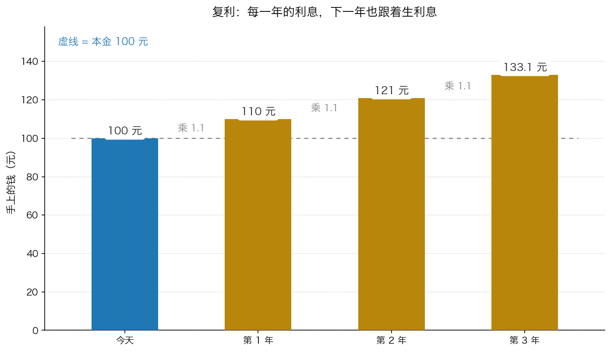
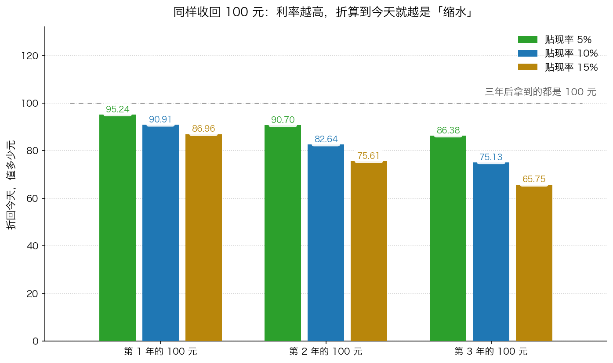

# 第 3 章：数学小灶——今天的 100 元不等于明年的 100 元

> 本章你将：
> - 用一个生活问题说清"钱有时间价值"：为什么今天的 100 元比明年的 100 元更值钱
> - 会手算复利：100 → 110 → 121 → 133.1，并说清"利息也会生利息"
> - 会手算贴现：把明年的 110 元、后年的 121 元换算回今天的钱
> - 知道利率越高、时间越远，未来的钱就越不值钱
> - 理解贴现率就是你要求的年回报率，并知道该往高里放还是往低里放
> - 这对你的钱包意味着什么：你会看穿"分期付款""返现""高息理财"里最常见的一种话术陷阱

前面两章讲的都是"是什么"：这家公司有什么、赚多少、市盈率几倍。
这一章要补的是**唯一一块数学**。好消息是：它只用到除法。
坏消息是：它是后面所有估值方法的地基，跳过去的话，第 4 章会看不懂。

---

## 3.1 先回答一个生活问题

问你一个问题：

> **今天的 100 元，和明年的 100 元，你要哪个？**

几乎所有成年人都会选"今天的 100 元"。但你能说清楚为什么吗？至少有三个理由：

1. **今天的钱能拿去赚利息。** 存进银行、买国债，一年后就不止 100 元了。
2. **今天的钱能买东西，而东西可能会涨价。** 这就是通货膨胀。十年前的 100 元能买的东西，比今天多。
3. **未来的钱有可能收不到。** 借钱的人可能跑路，公司可能倒闭。等一年是有风险的。

> 💡 **换个说法：** 这三条理由合起来就是一句话——**钱是有时间价值的**。
> 同样是 100 元，越早到手越值钱；越晚到手越不值钱。
> 这句话听起来像常识，但它是整个投资世界里最重要的数学基础。

那么问题来了：**明年的 100 元，相当于今天的多少钱？**
要回答这个问题，得先学会往"前"算——也就是复利。

## 3.2 往未来算：复利，100 元怎么长大

假设你把这 100 元借给一个非常靠谱的朋友，约定**每年利息 10%**，利息每年结算一次，
而且他不用把利息还给你，而是**把利息也一起继续借下去**（这就是"利滚利"，也就是**复利**）。

一年一年往后算：

| 时间 | 年初的本金 | 这一年赚到的利息 | 年末手上的钱 |
|---|---|---|---|
| 今天 | — | — | **100 元** |
| 第 1 年结束 | 100 元 | 100 乘 10% = 10 元 | **110 元** |
| 第 2 年结束 | 110 元 | 110 乘 10% = 11 元 | **121 元** |
| 第 3 年结束 | 121 元 | 121 乘 10% = 12.1 元 | **133.1 元** |

用手算走一遍：

- 第 1 年：100 乘 1.1 = 110
- 第 2 年：110 乘 1.1 = 121
- 第 3 年：121 乘 1.1 = 133.1

**注意第 2 年的利息是 11 元，不是 10 元。** 多出来的那 1 元是什么？
是第 1 年那 10 元利息，在第 2 年又生出来的利息。

三年下来一共赚了 133.1 - 100 = **33.1 元**。
如果利息不生利息（单利），三年只能赚 30 元。多出来的 3.1 元，就是复利的功劳。

*图 3-1：100 元按每年 10% 复利长大。柱子一年比一年高，而且**越往后长得越快**——因为利息也在生利息。*

> 📌 **划重点：** 复利在投资里是一个**放大器**：
> 好的方向放大（钱越来越多），坏的方向也放大（债务越来越多）。
> 信用卡、消费贷的"日息万分之五"，换算成年化大约是 18%，滚起来比你想的快得多。
> **复利对你是帮手还是敌人，取决于你站在借的一方还是欠的一方。**

## 3.3 往今天算：贴现，把未来的钱折回来

现在把方向反过来。

你知道第 3 年能拿到 133.1 元。请问：**它相当于今天的多少钱？**
答案当然还是 100 元——因为刚才我们就是从 100 元出发的。

那么怎么算回来？**用除法。**

- 第 1 年的 110 元，折回今天：110 除以 1.1 = **100 元**
- 第 2 年的 121 元，折回今天：121 除以 1.21 = **100 元**
  （或者一年一年除：121 除以 1.1 = 110，再除以 1.1 = 100，结果一样。）
- 第 3 年的 133.1 元，折回今天：133.1 除以 1.331 = **100 元**

**乘法是"往未来算"，除法就是"往今天算"。** 就这么简单。

这个"往今天算"的动作，在投资里有两个名字：**贴现**（也叫**折现**），
算出来的结果叫**现值**（也就是"相当于今天的多少钱"）。

现在换个更有用的问法：**如果第 1 年、第 2 年、第 3 年，每年都能收到 100 元，
它们分别相当于今天的多少钱？**（贴现率还是 10%）

| 收到的时间 | 怎么算 | 相当于今天的钱 |
|---|---|---|
| 1 年后收到 100 元 | 100 除以 1.1 | **90.91 元** |
| 2 年后收到 100 元 | 100 除以 1.21 | **82.64 元** |
| 3 年后收到 100 元 | 100 除以 1.331 | **75.13 元** |

看明白了吗？**同样是 100 元，越晚拿到，折算到今天就越少。**

顺便给你一张"1.1 连乘"的小抄，以后算 10% 的贴现会一直用到（每一个数都是前一个数乘 1.1）：

| 年数 | 1.1 连乘这么多次的结果 |
|---|---|
| 1 | 1.1 |
| 2 | 1.21 |
| 3 | 1.331 |
| 4 | 1.4641 |
| 5 | 1.61051 |
| 10 | 2.59374 |

有了它，10 年后收到的 100 元值今天多少？100 除以 2.59374 = **38.55 元**。
只值三分之一多一点。**时间越远，缩水越狠。**

## 3.4 利率越高，未来的钱越不值钱

上面算的是 10%。如果换成 5% 或 15% 呢？

| 收到的钱 | 贴现率 5% | 贴现率 10% | 贴现率 15% |
|---|---|---|---|
| 1 年后的 100 元 | 95.24 元 | 90.91 元 | 86.96 元 |
| 2 年后的 100 元 | 90.70 元 | 82.64 元 | 75.61 元 |
| 3 年后的 100 元 | 86.38 元 | 75.13 元 | 65.75 元 |

*图 3-2：同一个"未来的 100 元"，用不同利率折回今天，结果完全不同。利率越高，未来的钱越不值钱。*

**手算示例（第 3 年那一列）**：

- 5%：100 除以 1.157625 = 86.38 元（1.05 乘 1.05 乘 1.05 = 1.157625）
- 15%：100 除以 1.520875 = 65.75 元（1.15 乘 1.15 乘 1.15 = 1.520875）

同样是 3 年后的 100 元，用 5% 折是 86.38 元，用 15% 折只剩 65.75 元，**差了 20 多元**。

> 📌 **划重点：** 这句话要背下来——**贴现率越高，未来的钱越不值钱，算出来的价值越低。**
> 后面你会看到，这个规律就是"保守估值"的数学实现方式：
> 你对一家公司越没把握，就用越高的贴现率，算出来的价值自然越低。

## 3.5 贴现率到底是什么，该选多少

**贴现率就是你要求的年回报率。**

> 💡 **换个说法：** 有人找你借 1 万元，一年后还你 1 万元。你肯定不干——因为存银行都还有利息。
> 你会说："至少要还我 1.05 万。"这个 5%，就是你心里的最低回报要求。
> 如果对方是个不熟的人，你可能会要求 10%、甚至 15%。

把未来的钱折回今天时，用来除的那个"1 加 利率"，里面的利率就是**贴现率**。
你要求得越高（除法里的数字越大），你愿意为同一笔未来收入付的钱就越少。

那到底该用多少？卡拉曼在书里说得很坦白：

> "不存在适用于所有未来现金流的正确的单一贴现率，在选择贴现率时也不存在精确的方法。"（p139）

他还专门批评了一种偷懒做法：

> "许多投资者会很自然地使用10%作为适用于一切投资的贴现率，而无视正在考虑中的投资的本质。
> 10%是一个奇妙的整数，方便记忆，也易于使用，但它并不总是最好的选择。"（p139）

**够用版的规则**（Week 9 讲第八章时会详细展开）：

- 越是**确定**的现金流（比如长期合同、稳定的水电收入），可以用低一点的贴现率，比如 8%~10%；
- 越是**没把握**的现金流（强周期、竞争激烈、看不清五年后），就要用高一点的贴现率，比如 12%~15%；
- 实在拿不准的时候，**用高一点的那个**。

注意最后一条：这跟第 0 章的"保守"是一个意思。
用更高的贴现率，算出来的价值更低，你买的时候就更安全。

> 🇨🇳 **落到 A 股/港股：** 贴现率不是凭空拍的，它有一个天然的锚：**你能拿到的无风险回报**。
> 比如中国的 10 年期国债收益率、银行的存款利率（具体数字每年都在变，你可以去查），
> 它们代表"什么都不做也能拿到的回报"。你要求股票给你 8%、10% 还是 12%，
> 取决于你觉得这门生意比国债"多担了多少风险"。所以当有人跟你说"这家公司按 8% 贴现算出值 50 元"，
> 你可以马上追问一句："那如果按 12% 算呢？"——两个答案之间的差距，就是你的安全空间。

> ⚠️ **易踩坑：** 贴现率**不是**"通货膨胀率"，也**不是**"GDP 增速"。
> 它只回答一个问题：**这笔钱放在这里，我要求一年赚回百分之几。**
> 你跟别人讨论估值时如果发现双方用的贴现率不一样（一个 8%、一个 15%），
> 那你们算出来的价值差一倍都是正常的——**先对齐假设，再讨论结论。**

## 3.6 为什么说这是所有估值的底座

现在你已经有能力看懂第 4 章的第三种方法了。

**一家公司如果未来三年每年能给你 100 元，那么它今天值多少钱？**

把它拆成三笔未来的钱，分别折回今天，再加起来：

| 年份 | 未来的钱 | 折回今天 | 现值 |
|---|---|---|---|
| 第 1 年 | 100 元 | 100 除以 1.1 | 90.91 元 |
| 第 2 年 | 100 元 | 100 除以 1.21 | 82.64 元 |
| 第 3 年 | 100 元 | 100 除以 1.331 | 75.13 元 |
| **合计** | **300 元** | — | **248.68 元** |

**结论：未来三年的 300 元，按 10% 折算到今天是 248.68 元。**

这就是**现金流法**（正式名字叫"现值分析法"）的全部思路：
把未来每一年的钱，一年一年折回今天，再加起来。

- 未来的钱越多 → 今天越值钱
- 贴现率越高 → 今天越不值钱
- 时间越远 → 那笔钱对今天的贡献越小

> 📌 **划重点：** 你在新闻里看到的"现金流折现""DCF""内在价值测算"，
> 核心就是这个动作：**预测未来 + 折回今天 + 加起来。**
> 难的不是这套除法，难的是"未来到底有多少"和"该用多少贴现率"。
> 这两件难事，Week 9 会专门处理。

---

## ✍️ 想一想

1. **为什么"把明年的 110 元折回今天"要用除法（除以 1.1），而不是把 110 元减掉 10%（等于 99 元）？** 提示：想一想 99 元乘 1.1 等于多少，再想一想 100 元乘 1.1 等于多少。
2. **如果贴现率从 10% 提高到 15%，一家"未来很多年每年都给你 100 元"的公司，估值会变大还是变小？** 为什么这件事让"保守估值"变成一种可以操作的纪律，而不是一句口号？
3. **一家公司的价值，大部分来自"未来 5 年内的现金流"还是"第 10 年以后的现金流"？** 用 3.3 节里"未来的 100 元折回今天"那张表说说你的判断，并解释这对你评估一家"还在烧钱、十年后才可能赚钱"的公司意味着什么。

> 💡 **参考思路：**
> 1. 因为**贴现是复利的逆运算**，必须是"乘 1.1 能还原回 110"的那个数：100 乘 1.1 = 110 ✓。而 99 乘 1.1 = 108.9，还原不回去。所以"打九折"（减 10%）和"除以 1.1"根本不是一回事：110 减 10% = 99，110 除以 1.1 = 100，差了 1 元。金额小的时候差别不起眼，金额大、年数多的时候差别会非常大——这正是很多人算估值时最容易犯的低级错误。
> 2. 会变小。因为贴现率越高，每一笔未来的钱折回今天就越少，加起来自然更少。这件事的意义在于：**"保守"不再是一种态度，而是一个可以拧的旋钮。** 你不需要假装自己能预测未来，只要把贴现率往高里拧一点，算出来的价值就自动变得保守；如果一家公司在"保守假设"下依然明显便宜，那你的判断就有了缓冲。
> 3. 用 10% 贴现率看：1 年后的 100 元值 90.91 元，10 年后的 100 元只值 38.55 元。**时间越远，那笔钱对今天的贡献越小。** 所以对于一家"十年后才可能赚钱"的公司，它几乎全部的价值都悬在很远的未来——这些钱折回今天被压得很扁，还叠加了"能不能活到那一天"的不确定性。反过来说，这也是为什么价值投资者偏爱"现在就产生现金"的生意：**能早收到手的钱，确定性更高，折回今天也更值钱。**

---

## 🧮 算一算

**第 1 步：1000 元按每年 10% 复利，3 年后是多少？**

一年一年往后乘：

- 第 1 年：1000 乘 1.1 = **1100 元**
- 第 2 年：1100 乘 1.1 = **1210 元**
- 第 3 年：1210 乘 1.1 = **1331 元**

*这一步在算什么：把"利息也生利息"这件事一年一年地滚出来。三年一共赚了 331 元，而如果只算单利只能赚 300 元。*

**第 2 步：反过来。如果 3 年后要拿到 1331 元，贴现率 10%，今天要准备多少钱？**

今天要准备的钱 = 1331 除以 1.331 = **1000 元**

*这一步在算什么：把未来的一笔钱折回今天。注意除法的结果正好还原成出发时的 1000 元——这就是"贴现是复利的逆运算"。*

**第 3 步：一家公司承诺明年给你 200 元、后年再给你 200 元，贴现率 10%。这两年收到的钱，相当于今天的多少钱？**

先算第 1 年的 200 元：

- 200 除以 1.1 = **181.82 元**

（验算：181.82 乘 1.1 = 200.00，对上了。）

再算第 2 年的 200 元。注意这里要除以 **1.21**（也就是 1.1 乘 1.1），而不是只除以 1.1：

- 200 除以 1.21 = **165.29 元**

（一年一年除也一样：200 除以 1.1 = 181.82，再除以 1.1 = 165.29。）

两年合计：

- 181.82 + 165.29 = **347.11 元**

*这一步在算什么：把"未来两年各 200 元"这两笔钱，各自折回今天，再加起来。这就是现金流法的雏形。*

**第 4 步：为什么不是"200 元减掉 10% = 180 元"？**

我们来验证一下哪个对：

- 如果是 180 元，那么 180 乘 1.1 = **198 元**，不等于 200 元 ❌
- 如果是 181.82 元，那么 181.82 乘 1.1 = **200.00 元** ✓

**所以正确答案是 181.82 元，不是 180 元。**

> 📌 **划重点：** 折回今天要用**除法**，不是"减去利息"。
> 一年差 1.82 元看着不多，但如果金额是 200 万、时间是 10 年，这个错误会让你的估值差出一大截。

**第 5 步：如果把贴现率从 10% 提高到 15%，结果怎么变？**

- 明年的 200 元：200 除以 1.15 = **173.91 元**
- 后年的 200 元：200 除以 1.3225 = **151.23 元**（1.15 乘 1.15 = 1.3225）
- 合计：173.91 + 151.23 = **325.14 元**

对比一下：

| 贴现率 | 这两年现金的现值 |
|---|---|
| 10% | 347.11 元 |
| 15% | 325.14 元 |

**结论：贴现率从 10% 提到 15%，同一笔未来收入，今天的价值少了 21.97 元（约 6%）。
时间越长，这个差距会被拉得越大。**

*这一步在算什么：把"保守"这两个字变成一个具体的动作——把贴现率拧高一点，估值自动变低。*

---

## ✅ 小测验

**1. 1000 元按每年 10% 复利，2 年后是多少？**
A. 1200 元
B. 1210 元
C. 1100 元
D. 1331 元

**2. 2 年后会收到 1210 元，贴现率 10%。它相当于今天的多少钱？**
A. 1089 元
B. 1100 元
C. 1000 元
D. 1210 元

**3. 关于贴现率，下面说法正确的是：**
A. 贴现率越高，未来的钱折回今天越多
B. 贴现率必须统一用 10%，这是行业标准
C. 贴现率就是你要求的年回报率，越没把握的现金流应该用越高的贴现率
D. 贴现率就是通货膨胀率

> **答案与解析**
>
> **1. B。** 第 1 年：1000 乘 1.1 = 1100；第 2 年：1100 乘 1.1 = 1210。A 是"两个 10% 都按最初的 1000 算"（单利）的错误结果；C 只算了 1 年；D 是 3 年后的数字（1331），年数搞错了。
>
> **2. C。** 1210 除以 1.21 = 1000 元（1.1 乘 1.1 = 1.21）。A 是"把 1210 减掉 10%"的错误算法（1210 乘 0.9 = 1089）；B 只除了 1.1（相当于只折了 1 年）；D 是完全没有贴现。记住：**折回今天要用除法，不是打折。**
>
> **3. C。** 贴现率越高，除法里的分母越大，未来的钱折回今天**越少**（所以 A 说反了）；也不存在什么"必须用 10%"的行业标准——卡拉曼明确说过"不存在适用于所有未来现金流的正确的单一贴现率"，10% 只是方便记忆（所以 B、D 都错，D 混淆了贴现率和通胀率）。C 正好说中了两件事：它是你要求的回报率，而且它可以（也应该）随风险调整。

---

## 📖 回到原书

- 对应原书 **第八章** 的两节：`raw/安全边际-中文版/page_135.md` ~ `page_137.md`（现值分析法和预测未来现金流中的困难，原书 p135–p137）
  与 `page_138.md` ~ `page_140.md`（贴现率的选择，原书 p138–p140）。
- **建议精读：p135**（"当未来现金流很好预测，且能够选择合适的贴现率时……"这一段，注意卡拉曼的转折）。
- **建议精读：p138 最后一段到 p140**（贴现率的本质、为什么 10% 不总是最好的选择）。
- **可以略读：p136–p137**（可口可乐和啤酒行业的成长预测）。时代和行业细节可略过。
- 原书金句（逐字引用）：
  > "年金是完美的现值分析法的简化版例子。……很不幸，即使是最好的实体企业都不是年金。"（p135）
  > "不存在适用于所有未来现金流的正确的单一贴现率，在选择贴现率时也不存在精确的方法。"（p139）
  > "重要的是投资者应当像预测未来现金流时一样，谨慎选择贴现率。"（p139）

> 📌 **说明：** 原书这一节默认你已经会用计算器算净现值，所以直接就在讨论"贴现率该怎么选"这种高阶问题。
> 我们这一章把最底层的乘法和除法补上了。等你 Week 9 读第八章时，
> 卡拉曼说的"现值分析法"，对你来说就是本章第 3.6 节那个 248.68 元的算法，只是年数更多、假设更复杂。
