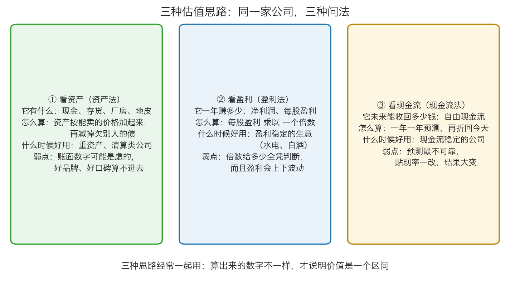
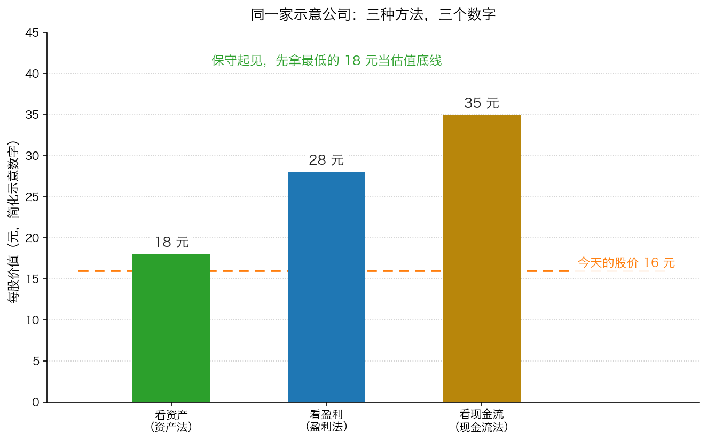

# 第 4 章：三种估值思路——资产法、盈利法、现金流法

> 本章你将：
> - 知道卡拉曼说的"只有三种方法有用"是哪三种，以及它们分别对应本书里的哪个名字
> - 会用资产法算出一家公司"今天关门拆掉"还值多少钱，并知道它为什么是最硬的底线
> - 会用盈利法（倍数法）估值，并说清那个"倍数"到底是怎么定出来的
> - 会用现金流法，把未来几年的钱折回今天再加起来
> - 能用同一家公司把三种方法各算一遍，得到三个不同的数字，并知道该信哪一个
> - 这对你的钱包意味着什么：你会拥有一个可以重复使用的估值流程，而不是每次凭感觉猜贵贱

前三章我们把材料备齐了：三个数字（净资产、净利润、自由现金流）、四个倍数、
一套贴现的算术。这一章把它们组装起来——**真正动手算一家公司值多少钱。**

---

## 4.1 卡拉曼说，只有三种方法有用

估值的方法在教科书里有几十种。卡拉曼把话说得很绝：

> "虽然存在许多用于企业价值评估的方法，但我发现只有三种方法是有用的。"（p134）

他列的三种是：连续经营价值（净现值法）、清算价值、股市价值法。
这三个名字对初学者不太友好，我们把它翻译成人话，再加上一个说明：

| 原书里的名字 | 我们这一章叫它 | 一句话解释 |
|---|---|---|
| 净现值法 | **现金流法**（第三种思路） | 它未来能收回多少钱，折算成今天 |
| 私有市场价值法（原书说它是与净现值法相关的一种评估法，以乘数估值法为基础） | **盈利法**（第二种思路） | 用同行的收购价（也就是某种倍数）来估自己手里的公司 |
| 清算价值法 | **资产法**（第一种思路） | 它现在有什么，拆开卖值多少 |
| 股市价值法 | （本周不讲） | 参考同类公司在股市上卖什么价，Week 9 再讲 |

"盈利法"为什么要单独拎出来当一个思路？因为它最常用、也最容易上手：
你不需要预测未来十年，只要知道同行大概按几倍出价就行。

卡拉曼强调过估值在整件事里的位置：

> "要想成为一名价值投资者，你必须以低于潜在价值的贴现价格购买证券。
> 因此，对每一项价值投资机会的分析始于对企业价值的评估。"（p134）

*图 4-1：三种思路、三种问法、三种弱点。注意它们的弱点各不相同——这正是要三种一起用的原因。*

## 4.2 第一种思路：看资产（资产法）

> 💡 **换个说法：** 奶茶店开不下去了，你决定关门。冰柜、封口机、装修、剩下的原料、别人欠你的钱，
> 一样一样处理掉；欠供应商和银行的钱一分不少地还掉。**最后剩在手里的钱，就是资产法算出来的价值。**

**算法**：

1. 把资产按"**今天能卖掉的价钱**"重新估一遍（不是账本上的价钱）；
2. 全部加起来；
3. 减掉**所有**负债。

**每一步的折算规则（够用版）**：

| 资产 | 怎么折算 | 为什么 |
|---|---|---|
| 现金 | 不打折 | 它本来就是钱 |
| 别人欠你的钱（应收账款） | 打 8 折左右 | 总有一部分收不回来 |
| 存货 | 打 6 折左右 | 清仓甩卖卖不出原价，还可能过时 |
| 设备、厂房 | 打 4 折甚至更低 | 专用设备离开这家公司可能没人要 |

**手算示例**：一家公司总资产 200 万元，总负债 80 万元，明细如下。

| 资产 | 账面 | 折算 | 折后价值 |
|---|---|---|---|
| 现金 | 30 万 | 不打折 | 30 万 |
| 应收账款 | 40 万 | 打 8 折 | 32 万 |
| 存货 | 50 万 | 打 6 折 | 30 万 |
| 设备等固定资产 | 80 万 | 打 4 折 | 32 万 |
| **合计** | 200 万 | — | **124 万** |

清算价值 = 124 万 - 80 万（负债）= **44 万元**

如果总股本是 10 万股，那么每股清算价值 = 44 万 除以 10 万 = **4.4 元/股**。

注意：这家公司账面净资产是 200 - 80 = 120 万元，但按清算价值只有 44 万元——
**只有账面净资产的三分之一多一点。** 这就是"账面价值不等于能变现的价值"。

**什么时候最该用它**：重资产行业、暂时亏损但家底还在的公司、
以及那些股价已经跌破净资产的"破净股"。卡拉曼说：

> "清算价值法仅对有形资产的价值作出保守的评估……因此，当一只股票的售价低于清算价值这一几乎是最低的估值时，
> 通常这是一项吸引人的投资。"（p144）

他甚至给出了一个更硬的捷径——"纯营运资金净额"：把流动资产（现金、应收、存货）加起来，
减掉**全部**负债（包括长期负债）。如果一家公司的市值比这个数还低，
那你买到的价格里，等于"白送"了它的厂房设备（p146）。格雷厄姆常用这一招。

**它的弱点**：

1. **账面资产可能是虚的。** 收不回来的应收、卖不掉的存货、过时的设备，账上都还在。
2. **无形资产完全算不进去。** 品牌、配方、客户关系、技术、牌照——这些在清算时几乎一文不值，
   但它们恰恰是很多好公司最值钱的东西。
3. **正常经营的公司，价值远高于清算价值。** 卡拉曼说得很清楚：
   > "只要持续经营企业价值高于清算价值，持续经营企业价值就被保留下来。"（p145）

   **一家还在赚钱的公司，你不会把它拆了卖。** 所以资产法给出的往往是一个"地板价"，而不是它的真实价值。

## 4.3 第二种思路：看盈利（盈利法）

> 💡 **换个说法：** 你想盘下一个铺子。老板说一年净赚 6 万，你心里想"最多给他 5 年的利润，30 万"。
> 这个"5 年"就是倍数，这个方法就是盈利法。

**算法**：

1. 拿到**每股盈利**（净利润 除以 总股本）；
2. 乘上一个**合理的倍数**；
3. 得到每股价值。

$$每股价值 = 每股盈利 \times 倍数$$

**手算示例**：某公司每股盈利 3 元。

- 保守一点，给 5 倍：3 乘 5 = **15 元/股**
- 乐观点，给 8 倍：3 乘 8 = **24 元/股**

**那个"倍数"是哪里来的？** 这是这个方法最关键、也最容易被含糊过去的地方。它通常来自三个参照：

1. **同行**：同行业、规模差不多的公司，市场给的是几倍？
2. **它自己的历史**：这家公司过去五年、十年，市场通常给几倍？
3. **确定性和成长性**：生意越稳定、越能持续，市场愿意给的倍数越高；越没把握，给的越低。

**什么时候最该用它**：盈利稳定的生意（消费、公用事业、白酒、水电）。
这些公司的利润波动小，用一个倍数去估，误差不会太离谱。

**它的弱点**：

1. **倍数全靠判断。** 给 5 倍还是 8 倍，价值就差了 60%。这不是精确科学，是区间思维。
2. **盈利会波动。** 周期股在景气顶点时"每股盈利 3 元"，明年可能变成 0.5 元，
   那你按 3 元乘 5 倍算出来的 15 元就完全错了。
3. **亏损的公司没法用。** 分母是负的，倍数没有意义。
4. **最危险的一种：参照别人的出价。** 卡拉曼专门用了一节讲这件事（p141–p143）。
   1980 年代，很多人用"最近别的买家出多少钱"来给自己手里的公司估值，
   却不知道那些买家是用借来的钱（垃圾债）在乱出价。结果融资一断，
   那些"参照价"全部崩塌，跟着买的人亏得很惨。他的结论是：
   > "投资者必须忽略以上涨的证券价格为基础的私有市场价值。"（p143）

   **翻译一下：别人愿意出的价，不等于这家公司值这个价。**

## 4.4 第三种思路：看现金流（现金流法）

> 💡 **换个说法：** 你要买一只会下蛋的鸡。你会算：它一年下多少蛋、能下多少年、
> 这些蛋值多少钱，折算成今天，值不值这个价。**你买的不是鸡，是它未来下的蛋。**

**算法**（三步）：

1. **预测**未来每一年能产生多少**自由现金流**；
2. 把每一年的钱，用第 3 章学的办法**折回今天**（除以 1.1、除以 1.21、除以 1.331……）；
3. 把所有年份的现值**加起来**。

**手算示例**：一家公司预计未来三年每年产生 100 元自由现金流，贴现率取 10%。

| 年份 | 自由现金流 | 折回今天 | 现值 |
|---|---|---|---|
| 第 1 年 | 100 元 | 100 除以 1.1 | 90.91 元 |
| 第 2 年 | 100 元 | 100 除以 1.21 | 82.64 元 |
| 第 3 年 | 100 元 | 100 除以 1.331 | 75.13 元 |
| **合计** | 300 元 | — | **248.68 元** |

所以这家公司大约值 **248.68 元**。

**什么时候最该用它**：现金流稳定、可预测的公司——水电、高速公路、公用事业、成熟的消费公司。
卡拉曼也说，对这类公司"净现值法将是最合适的评估方法"（p149）。

**它的弱点**：

1. **预测最不可靠。** 这恰恰是这个方法最大的软肋——它要求你预测未来，
   而未来"通常情况下是不确定的，而且经常是高度不确定的"（p135）。
2. **贴现率一改，结果大变。** 刚才的例子如果把贴现率从 10% 提到 15%，
   三年合计会从 248.68 元掉到 228.32 元（90.91 变 86.96、82.64 变 75.61、75.13 变 65.75，加起来 228.32）。
   而贴现率该用多少，本身就没有标准答案（p139）。
3. **它看起来最"科学"，最容易骗人。** 因为你能算出一串小数，
   会误以为自己算出了真相。卡拉曼的警告值得再抄一遍：
   > "任何想精确评估企业价值的尝试都将带来不准确的评估。"（p131）

## 4.5 同一家公司，三种算法，三个数字

现在把三种方法用在同一家**示意公司**上（**以下为简化示意数字，用于教学**）：

*图 4-2：同一家公司，三种方法算出 18 元、28 元、35 元，而今天的股价是 16 元。*

| 方法 | 算出来的每股价值 | 它问的问题 |
|---|---|---|
| 资产法（清算价值） | **18 元** | 今天关门拆掉，还剩下多少？ |
| 盈利法（按 7 倍盈利） | **28 元** | 按现在的赚钱能力，市场愿意给几倍？ |
| 现金流法（按 10% 贴现） | **35 元** | 未来能收回多少钱，折成今天是多少？ |
| 今天的股价 | **16 元** | 市场此刻的报价 |

三个数字差了一倍。**哪一个是对的？**

答案是：**三个都对，三个也都不完整。**

- 资产法给出的是**地板**：公司还在正常经营，所以它的价值不会只有拆开卖的那点钱。
- 现金流法给出的是**天花板**：它的前提是"预测的未来都能实现"，而预测是最容易出错的环节。
- 盈利法夹在中间：它既考虑了赚钱能力，又不需要预测太远，但它依赖你给的那个倍数。

那该怎么办？卡拉曼给了明确的答案：

> "投资者经常希望对一个单一的企业使用多种方法来进行评估，以获得这家企业的价值范围。
> 这时为了稳妥起见，投资者应当采取保守的立场，采用最低的评估，除非投资者有确凿的理由来选择更高的评估。"（p149）

同一页上还有一句老实得让人心安的话：

> "确实，保守的立场可能会让投资者错过一些成功的投资，
> 但这种立场也会防止投资者因采用了太过乐观的评估而蒙受了巨额的亏损。"（p149）

所以这家公司，我们的**保守估值就是 18 元**（三个数里最低的那个）。
而今天的股价是 16 元——已经低于保守估值了。

> 📌 **划重点：** 三种方法的价值，不在于"算出准确数字"，
> 而在于：① 它们从三个不同角度互相印证，如果三个数差得离谱，说明这家公司很难估，你要更小心；
> ② 它们能告诉你"最坏能坏到哪"——资产法那个数字，就是最坏情况的参照。

## 4.6 该用哪一种？一张够用的对照表

卡拉曼在书里给过一些场景化的建议（p149）：

| 公司类型 | 优先用哪种方法 | 原书里的理由 |
|---|---|---|
| 高回报、现金流稳定的消费类公司 | 现金流法 | "净现值法将是最合适的评估方法" |
| 资产回报受管制的公用事业 | 现金流法 | 同上 |
| 股价大幅低于账面、没有盈利的公司 | 资产法 | 这时清算价值是最可靠的参照 |
| 复杂企业（几块不同业务） | 分开估，各用各的方法 | "部分资产可能最好使用一种评估法" |

> ⚠️ **易踩坑：** 不要因为"现金流法看起来最专业"就什么都用它。
> 对一家亏损、看不清未来的公司，硬套现金流法只会让你把猜测当成计算。
> **方法要跟着公司走，不是公司跟着方法走。**

> 🇨🇳 **落到 A 股/港股：** 试着用这个方法看几家熟悉的公司：
> 长江电力（水电，现金流稳定）适合现金流法；
> 中国石油这类长期破净的强周期公司，资产法（净资产、清算价值）能给你一个地板；
> 招商银行这种资产负债表特殊的公司，用市净率和 ROE 比用市盈率更靠谱——
> 但银行要另眼看待，Week 9 会讲原因。港股里的腾讯控股这类轻资产公司，
> 资产法几乎没用（它的价值不在账本上），只能靠盈利法和现金流法。

---

## ✍️ 想一想

1. **为什么资产法算出来的数字，往往是一家公司"最低"的估值？** 请从"持续经营"这个角度解释。
2. **如果一家公司的三种估值分别是 10 元、30 元、32 元，另一家是 18 元、20 元、22 元。** 哪一家更"好估"？面对第一家公司，你会怎么做？
3. **盈利法里那个"倍数"，和现金流法里的"贴现率"，本质上是不是同一类东西？** 说说你的理由。

> 💡 **参考思路：**
> 1. 因为它假设公司**不再经营**了。一家还在赚钱的公司，它的价值来自"未来持续赚钱"，而清算价值只算"现在把家当卖掉"。所以清算价值相当于把公司的"未来"直接砍掉，只留下"现在"。卡拉曼也说："只要持续经营企业价值高于清算价值，持续经营企业价值就被保留下来。"（p145）反过来，这也说明资产法特别适合那些**未来已经没什么希望**的公司——那时候"现在"反而成了最值钱的部分。
> 2. **第二家更好估。** 三种方法给出的数字挤在一起（18~22），说明从哪个角度看这家公司都差不多，估值的不确定性小。第一家三种方法差了 3 倍（10~32），说明"用什么方法"这个选择本身就能把结论翻三倍——这种公司要么极难估（比如资产很硬但业务很差，或者业务很飘忽），要么正处在某个转折点上。面对它，正确的做法是：**要么用最低的那个（10 元）当底线、要求更大的折扣，要么直接放弃。** 卡拉曼说过："虽然有无法进行评估的企业，但许多企业都是可以进行评估的。"（p161）——**评估不了就不做，这也是一种能力。**
> 3. 本质上**是同一类东西：都是"你要求的回报率"**。盈利法里的倍数，可以粗略换算成"要求的年回报率"——给 10 倍，相当于要求每年 10% 的回报（100 除以 10 = 10）；给 5 倍，相当于要求 20%。而现金流法里的贴现率，直接就是你要求的年回报率。所以两种方法在最底层是相通的：**你要求得越高，愿意付的价格就越低。** 区别在于，盈利法只看一年的盈利，现金流法看很多年。

---

## 🧮 算一算

**情境**：一家做文具批发的示意公司（**以下为简化示意数字，用于教学**）。总股本 5 万股。

**资产负债表**：现金 20 万元、应收账款 30 万元、存货 40 万元、设备 60 万元（合计 150 万元）；负债 50 万元。
**利润表**：去年净利润 12 万元。
**现金流预测**：预计未来三年每年产生自由现金流 15 万元；第三年末如果转手，估计还能卖出 45 万元。

**第一步：用资产法估值**

按折算规则逐项处理：

| 资产 | 账面 | 折算 | 折后 |
|---|---|---|---|
| 现金 | 20 万 | 不打折 | 20 万 |
| 应收账款 | 30 万 | 打 8 折 | 24 万 |
| 存货 | 40 万 | 打 6 折 | 24 万 |
| 设备 | 60 万 | 打 5 折 | 30 万 |
| **合计** | 150 万 | — | **98 万** |

清算价值 = 98 万 - 50 万（负债）= **48 万元**
每股 = 48 万 除以 5 万股 = **9.6 元/股**

*这一问在算什么：今天关门拆掉，每股能剩下多少钱。*

**第二步：用盈利法估值**

- 每股盈利 = 12 万 除以 5 万股 = **2.4 元/股**
- 保守给 5 倍：2.4 乘 5 = **12 元/股**
- 乐观给 8 倍：2.4 乘 8 = **19.2 元/股**

**第三步：用现金流法估值**

先算三年经营现金流折回今天（贴现率 10%）：

- 第 1 年：15 除以 1.1 = **13.64 万元**
- 第 2 年：15 除以 1.21 = **12.40 万元**
- 第 3 年：15 除以 1.331 = **11.27 万元**
- 小计：13.64 + 12.40 + 11.27 = **37.31 万元**（按上面四舍五入后的数字相加）

再算第三年末转手的 45 万元折回今天：

- 45 除以 1.331 = **33.81 万元**（约）

合计：

- 37.31 + 33.81 = **71.12 万元**
- 每股 = 71.12 万 除以 5 万股 = **14.22 元/股**

*这一问在算什么：把未来的现金和最后的转手价，一年一年折回今天再加起来。*

**第四步：三个数字放在一起**

| 方法 | 每股价值 |
|---|---|
| 资产法（地板价） | 9.6 元 |
| 盈利法 | 12 元 ~ 19.2 元 |
| 现金流法 | 14.22 元 |

**价值区间：9.6 元 ~ 19.2 元。保守起见，取最低的 9.6 元作为估值底线。**

**第五步：做判断**

如果今天的股价是 **8 元**，低于保守估值 9.6 元——**这是一个值得继续研究的线索。**
如果今天的股价是 **20 元**，高于乐观估值 19.2 元——**这个价格已经把好消息都算进去了，先放在一边。**

> 📌 **划重点：** 注意我们从头到尾没有说"这家公司值 14.22 元"。
> 我们说的是：**它大概值 9.6 到 19.2 元之间，保守取 9.6 元。**
> 这就是第 0 章讲的"价值是一个区间"，落到了具体的一次计算上。

---

## ✅ 小测验

**1. 资产法算出来的价值，通常被看作：**
A. 一家公司的真实价值
B. 一家公司价值的下限（地板价），因为它假设公司不再经营
C. 一家公司价值的上限
D. 和账面净资产完全相同的数字

**2. 盈利法里那个"倍数"（比如给 7 倍），主要靠什么确定？**
A. 精确的数学公式
B. 参考同行、公司自身历史，以及生意的确定性和成长性
C. 交易所统一规定
D. 去年的股价除以今年的股价

**3. 一家公司三种方法分别算出 20 元、34 元、40 元，当前股价 30 元。按卡拉曼的建议，你应该：**
A. 取平均值 31.33 元，认为股价是合理的
B. 取最高的 40 元，认为股价便宜了 25%
C. 保守取最低的 20 元，认为当前股价并不便宜，需要考虑清楚才有理由买
D. 三个数差太多，说明这家公司不能投资

> **答案与解析**
>
> **1. B。** 清算价值假设公司今天关门、把资产卖掉还债，所以它把"未来持续经营能赚的钱"全部砍掉了。对一家还在赚钱的公司来说，真实价值通常高于清算价值（p145）。C 说反了；D 错在忽略了"打折扣变现"——账面净资产 120 万，清算价值可能只有 44 万。
>
> **2. B。** 倍数的确定没有公式，它来自三个参照：同行给几倍、这家公司历史上被给过几倍、以及这门生意的确定性和成长性。A、C 都是幻觉；D 是循环推理——用股价推倍数、再用倍数推价值，等于什么都没算（这正是卡拉曼批评的"以上涨的证券价格为基础的私有市场价值"，p143）。
>
> **3. C。** 卡拉曼的原话是"为了稳妥起见，投资者应当采取保守的立场，采用最低的评估，除非投资者有确凿的理由来选择更高的评估"（p149）。按最低的 20 元算，30 元的股价不但没有便宜，反而贵了 50%，所以需要非常强的理由才值得买。A 是常见的"取平均"谬误——平均一个乐观数和一个悲观数，不会让结论变得更可靠；B 是最危险的做法，用最乐观的假设给自己找买入理由；D 太绝对——差得多只说明难估，难估的正确反应是"要求更大的折扣或放弃"，而不是"不能投资"。

---

## 📖 回到原书

- 对应原书 **第八章**：`raw/安全边际-中文版/page_134.md` ~ `page_135.md`（三种方法的总览，原书 p134–p135）、
  `page_141.md` ~ `page_150.md`（私有市场价值法、清算价值、股市价值法、如何选择，原书 p141–p150）。
- **建议精读：p134–p135**（卡拉曼列出的三种方法，以及他对私有市场价值法的评价）。
- **建议精读：p144–p146**（清算价值：怎么给应收、存货、固定资产打折，"纯营运资金净额"这条捷径）。
- **建议精读：p149**（如何选择评估方法、为什么要取最低的评估）。
- **可以略读：p147–p148**（清算与封闭式基金的例子）。这两个例子是给美国读者看的，略过不影响理解。
- **留到 Week 9 再读：p150–p157**（Esco 电子公司的完整评估实例）。它是本章三种方法的一次完整实战，
  但需要你先熟悉"商誉摊销""非经常性费用"这些细节，放到 Week 9 读效果更好。
- 原书金句（逐字引用）：
  > "虽然存在许多用于企业价值评估的方法，但我发现只有三种方法是有用的。"（p134）
  > "清算价值法仅对有形资产的价值作出保守的评估，这种方法并不评估诸如持续经营价值等这样的无形资产的价值。"（p144）
  > "这时为了稳妥起见，投资者应当采取保守的立场，采用最低的评估，除非投资者有确凿的理由来选择更高的评估。"（p149）

> 📌 **说明：** 原书这一章是全书技术含量最高的一章，卡拉曼默认你会算现值、看得懂报表附注。
> 我们这一章把它翻译成了三个可以手算的思路。Week 9 会带你回到原文，
> 用 Esco 电子公司的真实案例（p151–p157）把这三种方法跑一遍完整流程。
