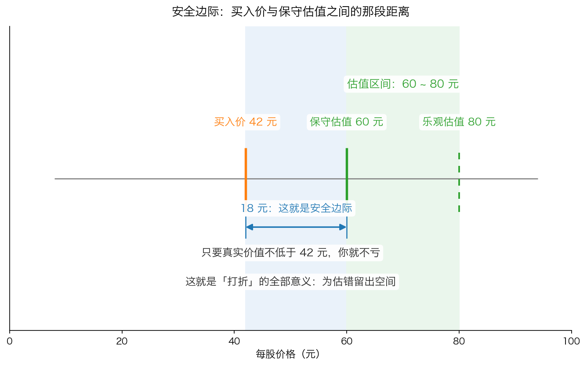

# 第 5 章：为什么要打折——安全边际初登场

> 本章你将：
> - 把这一周算过的东西串成一条完整的流程：三个数字 → 三个估值 → 取最低 → 再要求打折
> - 看清一件反直觉的事：**按估值价买入，等于没有保护**
> - 掌握安全边际的定义：买入价与保守估算的价值之间的差距，是你为自己估错留出的容错空间
> - 会在纸上算出"我最多能错多少还不亏"，并知道折扣越深、能承受的错误越大
> - 知道安全边际能做什么、不能做什么（它不能保证你不亏）
> - 这对你的钱包意味着什么：你会得到一个可以反复使用的买入纪律，而不是凭感觉下单

前面四章，你已经会算一家公司大概值多少钱了。但"知道它值多少"和"该不该买"之间，
还差最后一步。这一步就是这本书书名的四个字。

---

## 5.1 先把这一周串起来

回顾一下你手上的工具：

1. **第 0 章**：分清事实与猜测，接受"价值是一个区间"。
2. **第 1 章**：看懂三个数字——净资产、净利润、自由现金流。
3. **第 2 章**：会用四个倍数——市盈率、市净率、ROE、股息率，也知道它们什么时候会骗人。
4. **第 3 章**：会贴现——把未来的钱一年一年除回今天。
5. **第 4 章**：会用三种方法算出三个数字，并且**保守起见取最低的那个**。

第 4 章的最后，我们得到一家示意公司的保守估值：**9.6 元/股**。

现在问题来了：**如果股价正好是 9.6 元，你买不买？**

大多数人的第一反应是"值 9.6 元，卖 9.6 元，公平，可以买"。
这一章要告诉你：**这个想法很危险。**

## 5.2 按估值价买入，等于没有保护

我们用两个场景来对比。假设你对一家公司的保守估值是 **60 元**。

**场景一：你在 60 元买入。**

结果你估错了——这家公司的真实价值其实只有 **45 元**（比如它的一个大客户跑了，
或者行业竞争比你想的激烈）。那么你**一买就亏**：

- 亏损 = 60 - 45 = 15 元
- 亏损比例 = 15 除以 60 = **25%**

注意：你并没有做错什么特别愚蠢的事。你只是**估错了一次**——而第 0 章已经证明，估错是常态。

**场景二：你在 42 元买入。**

同样一家公司，同样估错了（真实价值只有 45 元）：

- 45 元 减 42 元 = 你还赚 **3 元**（赚 3 除以 42 = 约 7%）

**同一个错误，在 60 元买入是亏 25%，在 42 元买入还能赚 7%。** 差别在哪？只在买入价。

卡拉曼把这个困境说得毫不留情：

> "如果你无法确定企业价值，你如何能够肯定自己所支付的价格是打折价呢？事实是你无法肯定。"（p103）

**你无法肯定自己是不是买便宜了——所以你只能用更大的折扣，来对冲自己的不确定。**
这就是"打折"的全部逻辑。

*图 5-1：蓝色的那一段（42 元到 60 元），就是安全边际。它不是什么玄学，它就是两个数字之间的距离。*

## 5.3 安全边际到底是什么

**定义（这门课从头到尾都用这一个口径）：**

> 📌 **划重点：安全边际 = 买入价与保守估算的价值之间的差距。
> 它是你为自己估错留出的容错空间。**

用图 5-1 的数字说：保守估值 60 元，你在 42 元买入，
安全边际 = 60 - 42 = **18 元**，相当于保守估值的 30%。

这个概念的源头是格雷厄姆。卡拉曼在书里这样介绍他：

> "本杰明•格雷厄姆认为，今天价值1 美元的资产或者业务可能在不久的将来值75 美分或者1.25 美元。
> 他也知道自己甚至可能对今天的价值作出了错误的判断。因此，格雷厄姆对1 美元的价格购买1 美元的资产毫无兴趣。
> 这么做没有任何优势，并可能会招致损失。格雷厄姆只对以大幅低于潜在价值的打折价购买资产感兴趣。
> 他知道使用打折价进行的投资不大可能让他蒙受损失。**打折价提供了安全边际。**"（p105）

格雷厄姆本人对安全边际的表述更精炼，卡拉曼在同一页引用了他：

> "安全边际总是依赖于所支付的价格。不管哪种证券，安全边际在某个价格时较大，
> 在一些更高的价格时则较小，在一些更高的价格时甚至不存在。"（p105）

**注意最后一句："在一些更高的价格时甚至不存在。"**
安全边际不是一个公司自带的属性，它是**你和价格之间的关系**。
同一家公司，42 元买入有安全边际，60 元买入就没有。**安全边际是买出来的，不是选出来的。**

巴菲特有一个更形象的比喻，卡拉曼也引用了：

> "当你修建一座大桥时，你坚信它的承重量为3 万磅，但你只会让重1 万磅的卡车通过这座桥。这一原则也适用于投资。"（p105–106）

> 💡 **换个说法：** 桥能承重 3 万磅，但你只让 1 万磅的车过。
> 那多出来的 2 万磅，就是安全边际。它不产生收益，它只在"你算错了"的时候救你的命。
> 桥梁工程师不会因为"我的计算很准"就把限重提到 2.9 万磅——**因为代价太大，而收益太小。**

## 5.4 你可以在多大范围内估错还不亏

现在做一个对你最有用的计算。

假设你对某公司的保守估值是 **9.6 元/股**（就是第 4 章那家示意公司）。
下面这张表算的是：**在不同的买入价，当真实价值跌到多少时你才开始亏钱。**

| 你的买入价 | 相当于保守估值的 | 真实价值跌到这里你还不亏 | 你能承受的估值误差 |
|---|---|---|---|
| 9.6 元 | 100%（按估值价买） | 9.6 元 | **0%** |
| 8.0 元 | 约 83% | 8.0 元 | **16.7%** |
| 7.2 元 | 75% | 7.2 元 | **25%** |
| 6.7 元 | 约 70% | 6.7 元 | **30%** |
| 4.8 元 | 50%（打五折） | 4.8 元 | **50%** |

**怎么算的**（以 8 元买入为例）：

- 估值误差容忍度 = (9.6 - 8.0) 除以 9.6 = 1.6 除以 9.6 = 0.167 = **16.7%**
- 意思就是：只要这家公司的真实价值不低于 8 元（比你估的 9.6 元低了 16.7%），你就不亏。

**这张表说明了两件事：**

1. **按估值价买入，容错空间是零。** 你等于要求自己"一次都不能估错"。而第 0 章已经证明这不可能。
2. **折扣越深，你越"错得起"。** 打五折买入，意味着即使这家公司的真实价值只有你估计的一半，
   你也只是不赚不亏。

> 🇨🇳 **落到 A 股/港股：** 这就是为什么价值投资者常常显得"太挑剔"——
> 他们会说"这票不错，但太贵了，再等等"。他们等的不是"价格涨"，而是"价格跌到有折扣的位置"。
> 而这个"折扣位置"是他们事先算出来的，不是看到跌了才临时决定的。**顺序反了，纪律就没了。**

## 5.5 安全边际能做什么，不能做什么

**它能做的：**

- 把"必须判断正确"降级成"判断大致正确就行"。你不需要预测对每一个细节。
- 大幅降低**永久性亏损**的概率。注意是"永久性"，不是"暂时浮亏"。
- 让你在持有过程中更能扛住波动——因为你买得便宜，跌一些也还在成本附近。

**它不能做的（这一段比上一段重要）：**

- **它不能保证你不亏。** 如果你估的价值本身就太高（比如你对一个正在衰退的行业过于乐观），
  那么折扣再大也可能不够。卡拉曼有一句很重的话：
  > "企业价值持续下降的可能性是插在价值投资心脏上的匕首（对其他投资方法而言，它也不是什么好笑的事情）。"（p104）

  意思是：**如果价值本身在下跌，那么"打折"也救不了你。** 这也是为什么第 0 章要求你保守估计：
  保守估计的一部分作用，就是防止"价值本身下跌"这种情况。
- **它不能让你短期不亏。** 你买完之后股价完全可能继续跌 30%。安全边际管的是"长期会不会亏"，
  不管"下个月涨不涨"。
- **它不是"越跌越买"的许可证。** 只有当**价值没变、只是价格跌了**的时候，"跌了更便宜"才成立。
  如果价格跌是因为公司变差了，那"更便宜"是假象——这正是 Week 7 要讲的"价值骗子"和陷阱。

至于"安全边际要多大才够"，卡拉曼说得很实在：

> "投资者必须具备什么样的安全边际？每个投资者的答案都不一样。你愿意以及能够承受多坏的运气？
> 你可以忍受企业价值出现多大的波动？你对错误的忍受极限是多少？所有这些问题都视你对亏损的承受能力而定。"（p106）

**没有标准答案，但有一个方向：越没把握的公司，要求的折扣越大。**

## 5.6 便宜的价格通常从哪里来

最后简单交代一句：为什么会有打折的机会？市场为什么不总是有效的？

卡拉曼在书里列了一堆原因（p114）：指数基金不管贵贱必须买入成分股、
技术分析师只看成交量、成长股被追捧、业绩差的公司被抛售、
基金被迫卖出被降级的债券、年末的税务性卖盘、季度末的粉饰报表……
这些行为的共同点是：**它们的买卖理由和"这家公司值多少钱"没有关系。**
于是价格就会偏离价值，折扣就出现了。

> ⚠️ **易踩坑：** 价格低**一定**有原因。你的工作不是"看到便宜就买"，
> 而是搞清楚**那个原因是不是暂时的**。原因如果是"这个行业要消失了"，那低价是应该的；
> 原因如果是"一家基金被迫清仓，跟公司经营没关系"，那才是机会。
> 这个判断怎么做的完整方法，Week 10 会专门讲（催化剂、机会类型）。

## 5.7 初登场到此为止：Week 7 会正式讲透

这一章只是让安全边际**露个面**。你现在掌握的，是它最朴素的一层：
**买入价要明显低于保守估值，差距越大越安全。**

至于下面这些问题，我们**故意留到 Week 7**：

- 安全边际带来的收益，到底有哪几种来源？
- 什么时候该出手、什么时候该一直等（"等待合适的投球"）？
- 市场下跌的时候，安全边际为什么反而变大？
- 怎么识别嘴上讲安全边际、实际在冒险的"价值骗子"？

> 📌 **划重点：** 现在不要去啃第六章原文。你这一周的任务是把**估值**这件事学会，
> 下周（Week 7）才是"安全边际"的正式主场。**地基没打完就上二楼，只会摔下来。**

## 5.8 这一周，你应该带走的三句话

1. **一家公司值多少钱，只能算出一个区间，不能算出一个数。** 所以永远保守取最低。
2. **估值是买的前提，不是买的理由。** 算出价值只完成了一半。
3. **买的动作本身必须是打折。** 买入价与保守估值之间的那段距离，才是你真正的保护。

**这对你的钱包意味着什么：**

从现在起，你看任何一只股票，都可以走一遍这四步——
① 翻年报，找到净资产、净利润、自由现金流；
② 用资产法、盈利法、现金流法各算一遍，得到一个区间；
③ 取区间里最低的那个数，作为你的"估值底线"；
④ 只有当价格明显低于这条底线时，才把它放进"值得研究"的名单。

这四步不会让你立刻赚到钱。但它会让你**避开绝大多数"买贵了"的错误**——
而这本书从头到尾想说的就是一句话：**投资最重要的事，不是赚多少，而是别亏钱。**

---

## ✍️ 想一想

1. **为什么"按估值价买入"等于没有保护？** 用第 0 章的"价值是一个区间"来解释，而不是用"运气不好"来解释。
2. **巴菲特说，桥能承重 3 万磅，但只让 1 万磅的卡车通过。** 如果你的估算能力提高了，这个"多出来的 2 万磅"应该变大还是变小？为什么？
3. **一家公司的股价从 30 元跌到 12 元。** 在什么情况下这是"安全边际变大了"？在什么情况下这是"价值本身在下跌"？你会去看哪些数字来区分这两种情况？

> 💡 **参考思路：**
> 1. 因为你的"估值价"本身就是估计出来的一个数，它落在区间里的某个位置，而真实价值可能在区间内的任何地方，甚至落在区间之外。按估值价买入，等于假设"我正好估到了真实价值"——你的容错空间是 0。只要真实价值低于你的估计哪怕 10%，你买的那一刻就已经亏了。而第 0 章已经确认：估错是常态，不是意外。所以正确做法是让买入价落在**区间下方**，用折扣换取"估错了也不亏"的空间。
> 2. 应该**变小**——但不会变成零。如果你的估值能力真的提高了（比如你对这个行业非常熟悉、能看懂它的报表和竞争格局），你对价值区间上下限的判断会更准，需要的折扣可以小一些。但桥梁工程师的例子告诉我们：即使在计算很可靠的情况下，也一定要留余量，因为**错误的代价远大于少赚的代价**。卡拉曼在 p106 说得很清楚：安全边际要多大，"视你对亏损的承受能力而定"。承受能力越弱（比如这笔钱明年要用），要求的折扣就该越大。
> 3. 关键区别在**"是价格变了，还是公司变了"**。如果这半年里公司的净利润、自由现金流、净资产都没什么变化，行业格局也没变，只是市场情绪差、或者被指数基金抛售——那 12 元就是"安全边际变大了"，因为价值没动、价格更低了。反过来，如果这半年里净利润腰斩、经营现金流转负、大客户流失、行业被替代——那是价值本身在下跌，12 元可能依然贵。要看的数字就是第 1 章那三个：**净利润、经营现金流（以及自由现金流）、净资产**，再加上"它们是在变好还是变坏"。

---

## 🧮 算一算

**情境**：还是第 4 章那家文具批发示意公司（**简化示意数字，用于教学**）：

- 资产法算出 **9.6 元/股**
- 盈利法算出 12 ~ 19.2 元/股
- 现金流法算出 14.22 元/股
- **保守估值取最低的 9.6 元/股**

**第 1 步：如果今天的股价是 8 元，安全边际是多少？**

- 绝对值：9.6 - 8 = **1.6 元**
- 占保守估值的比例：1.6 除以 9.6 = 0.1667 = **约 16.7%**

*这一步在算什么：你为"估错"留出了多大的空间——16.7%。*

**第 2 步：如果股价是 9.6 元（按估值价买），安全边际是多少？**

- 9.6 - 9.6 = **0 元**，也就是 **0%**。

**第 3 步：假设你在 9.6 元买入，结果发现这家公司其实只值 8 元。你亏多少？**

- 亏损金额 = 9.6 - 8 = 1.6 元
- 亏损比例 = 1.6 除以 9.6 = **约 16.7%**

*这一步在算什么：这就是"按估值价买入"的代价——估错 16.7%，你就亏 16.7%。*

**第 4 步：假设你在 8 元买入，结果发现它只值 8 元。你亏多少？**

- 8 - 8 = **0 元，不亏。**

**第 5 步：假设你在 8 元买入，结果发现它只值 6 元。你亏多少？**

- 亏损金额 = 8 - 6 = 2 元
- 亏损比例 = 2 除以 8 = **25%**

*这一步在算什么：安全边际不是无限的。你估 9.6 元、实际只值 6 元，那就是估错了 37.5%，
这样的错误连 16.7% 的折扣也兜不住。*

**第 6 步：如果你等到 4.8 元（保守估值的五折）才买，而它其实只值 6 元呢？**

- 6 - 4.8 = 1.2 元
- 收益率 = 1.2 除以 4.8 = **25%**

**你估错了 37.5%（9.6 元估成了实际 6 元），居然还赚了 25%。** 这就是折扣的威力。

**第 7 步：把四种情况放在一起**

| 买入价 | 安全边际 | 真实价值是 6 元时 | 真实价值是 8 元时 | 真实价值是 9.6 元时 |
|---|---|---|---|---|
| 9.6 元 | 0% | 亏 37.5% | 亏 16.7% | 不亏不赚 |
| 8.0 元 | 16.7% | 亏 25% | 不亏不赚 | 赚 20% |
| 7.2 元 | 25% | 亏 16.7% | 赚 11.1% | 赚 33.3% |
| 4.8 元 | 50% | 赚 25% | 赚 66.7% | 赚 100% |

**验算两格，确认这张表没算错：**

- 买入 8 元、真实价值 9.6 元：(9.6 - 8) 除以 8 = 1.6 除以 8 = **20%** ✓
- 买入 7.2 元、真实价值 8 元：(8 - 7.2) 除以 7.2 = 0.8 除以 7.2 = **11.1%** ✓

> 📌 **划重点：** 这张表就是安全边际的全部意义。
> **你无法让估值变准，但你可以让买入价变低。**
> 前者要靠天赋和运气，后者只需要耐心和纪律——而耐心和纪律，是普通人真正能控制的东西。

---

## ✅ 小测验

**1. 安全边际的定义是：**
A. 股价可能上涨的空间
B. 买入价与保守估算的价值之间的差距
C. 公司的净资产减去负债
D. 股票的分红除以股价

**2. 你对某公司的保守估值是 20 元，现在的股价是 20 元。下面哪个说法最符合这一章的观点？**
A. 价格等于价值，可以放心买入
B. 价格等于价值，属于合理区间，但你没有为自己的估值错误留出任何空间
C. 应该立刻卖出，因为价格已经到顶
D. 只要公司是好公司，什么价格买都无所谓

**3. 关于安全边际，下面说法正确的是：**
A. 只要有足够的安全边际，就绝对不会亏钱
B. 安全边际越大，你能承受的估值误差越大
C. 好公司不需要安全边际
D. 股价跌了就说明安全边际变大了

> **答案与解析**
>
> **1. B。** 这是本课程统一的口径：买入价与保守估算的价值之间的差距，是你为自己估错留出的容错空间。A 是"上涨空间"，跟安全边际无关；C 描述的是净资产（账面价值的算法）；D 是股息率。这一题值得背下来，因为后面每一周都会用到它。
>
> **2. B。** 价格等于你的估值，不代表"贵"，但代表**你的容错空间是零**——只要你的估值乐观了一点点，买入即亏损。A 忽略了"估值本身可能错"这个前提；C 是过度反应（价格等于保守估值，不等于高估）；D 是最危险的一句话：好公司买贵了照样能让你亏很多年，原书里引用过巴菲特的话——"对投资者而言，以过高的价格购买一家优秀的企业可以抵消未来10 年该企业良好的发展所带来的效果"（p136–137）。
>
> **3. B。** 折扣越深，你能承受的估值误差越大（本章第 5.4 节那张表就是干这个用的）。A 错在把安全边际当成了保险——如果企业的价值本身在持续下跌，折扣也可能兜不住（p104）；C 完全相反，好公司往往价格不便宜，更需要安全边际来对冲"买贵"的风险；D 是最需要警惕的一句：股价跌可能有两种原因，只有"公司没变、只是价格跌了"时，安全边际才变大。

---

## 📖 回到原书

- 对应原书 **第六章 安全边际的重要性**：`raw/安全边际-中文版/page_100.md`（开篇对价值投资的定义，原书 p100）
  与 `page_103.md` ~ `page_107.md`（企业评估的易变性、安全边际的重要性，原书 p103–p107）。
- **建议精读：p103–p105**（"如果你无法确定企业价值，你如何能够肯定自己所支付的价格是打折价呢"、
  格雷厄姆为什么对"1 美元买 1 美元"毫无兴趣、以及那句"打折价提供了安全边际"）。
- **建议精读：p105–p107**（巴菲特修桥的比喻；"投资者如何才能获得确定的安全边际呢"这一段给出的清单）。
- **可以略读：p106–p107**（关于无形资产安全边际的讨论、Dr Pepper 与七喜的例子）。
  这一段涉及"有形资产 vs 无形资产"的取舍，等你 Week 9 学完评估方法再回来看会更清楚。
- **暂时不要读：p108–p118**（Erie Lackawanna、Texaco、价值骗子等）。
  这些是安全边际的实战案例和更深层的讨论，属于 **Week 7** 的内容。**现在读会消化不良。**
- 原书金句（逐字引用）：
  > "格雷厄姆对1 美元的价格购买1 美元的资产毫无兴趣。这么做没有任何优势，并可能会招致损失。"（p105）
  > "安全边际总是依赖于所支付的价格。不管哪种证券，安全边际在某个价格时较大，在一些更高的价格时则较小，在一些更高的价格时甚至不存在。"（p105）
  > "当你修建一座大桥时，你坚信它的承重量为3 万磅，但你只会让重1 万磅的卡车通过这座桥。这一原则也适用于投资。"（p105–106）

> 📌 **说明：** 原书在第六章直接开始讨论"债券的安全边际""不同投资者对安全边际的分歧"这些话题，
> 因为它默认读者已经熟悉估值和债券。这一周我们只让安全边际"初登场"：
> 你知道它是什么、怎么算、为什么必须有，就足够了。**Week 7 会把它讲透。**
