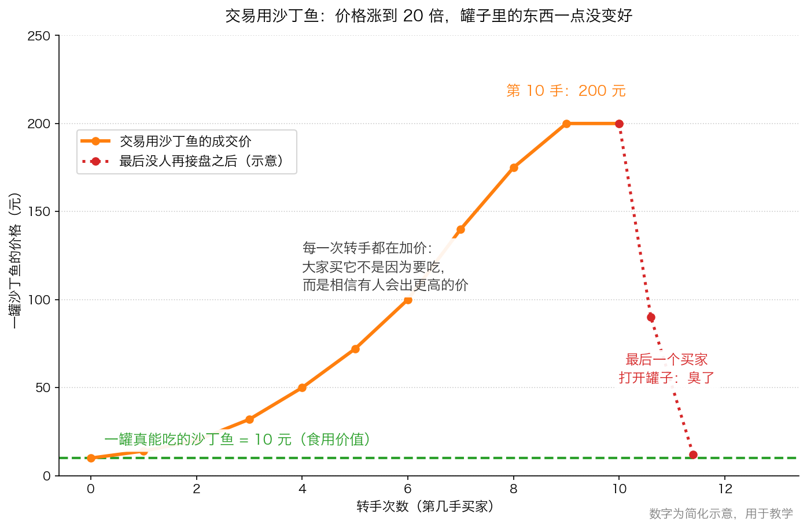
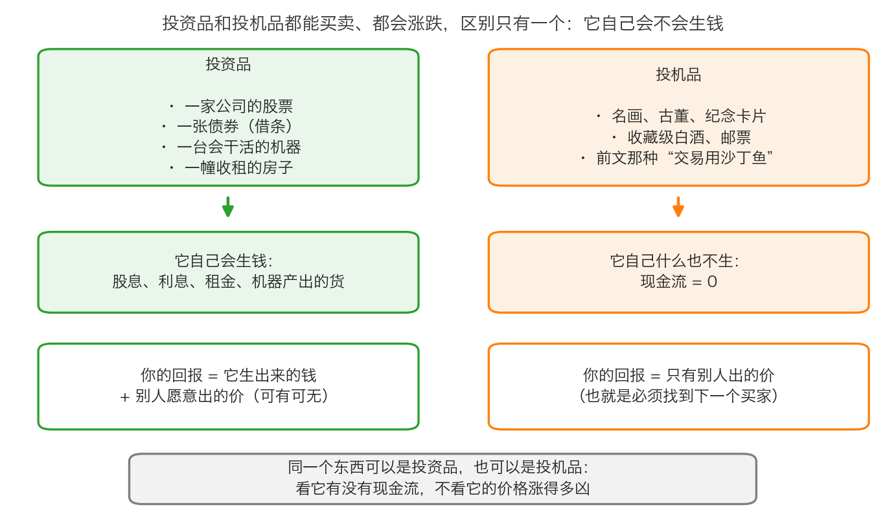

# 第 0 章：沙丁鱼罐头——投机的本质

> 本章你将：
> - 听懂一个关于沙丁鱼罐头的故事，并明白它为什么是整本书的起点
> - 得到一个能随身携带的判断标准：这个东西**自己会不会生钱**
> - 分清"投资品"和"投机品"，并知道收藏品为什么不算投资品
> - 看懂原书里三个真实的投机案例，认出它们的共同结构
> - 回答"这对我的钱包意味着什么"：在按下买入键之前，先问自己"我打算赚谁的钱"

Week 2 结束时，你手上已经有了一把尺子：**安全边际 = 你保守估算的价值 - 你实际付出的价格**。这把尺子很好用，但它有一个前提——你真的在乎那家公司值多少钱。如果你根本不在乎，你只在乎明天有没有人愿意出更高的价，那么"安全边际"这四个字对你毫无意义。原书第一章要做的第一件事，就是把这两种人分开。

---

## 0.1 故事：一罐没人打算吃的沙丁鱼

先交代背景。这个故事发生在美国加利福尼亚沿海。那里曾经有非常丰富的沙丁鱼资源，罐头厂把沙丁鱼装进罐头卖到全美国，是一桩正经生意。

后来，沙丁鱼从它们习惯出没的海域消失了，捕上来的鱼越来越少。**东西变少了，价格自然就往上走**——这是第一步，很正常。不正常的是接下来发生的事：一批商品交易商发现，只要不停地转手，价格就能一直涨，于是他们开始互相买卖这些罐头，把价格一路哄抬上去。

一罐沙丁鱼的价格越涨越高。有一天，一个买家觉得自己赚了不少钱，决定开一罐犒劳自己。他打开罐头，吃了一口，立刻觉得不舒服——**罐头里的沙丁鱼早就变质了**。他很生气，去找卖给他的人抱怨。

卖主回答说：

> "你不了解，这些沙丁鱼不是用来食用的，它们是用来做交易的。"（p15）

这句话是整个故事的钥匙。**同样是这罐沙丁鱼，它的"用途"在两个人眼里完全不同**：一个人以为买的是食物，另一个人只把它当成一个可以转手的筹码。只要所有人都只想着转手，罐头里装的是什么、新不新鲜，就没人关心了。

> 💡 **换个说法：** 这就像抢椅子游戏。音乐响着的时候，每个人手里都有一把椅子（一罐沙丁鱼），游戏看起来还能继续；大家心里都清楚音乐一定会停，但每个人都相信自己能在停下来的前一秒把椅子卖给别人。

> 📌 **划重点：** 沙丁鱼的**食用价值**从头到尾没变过（一罐能吃的沙丁鱼值多少钱，不取决于昨天有多少人转手过它）。变的只是**成交价**。价格和价值，从这一刻起就是两回事——这是 Week 2 已经讲过的事，现在你看到了它在真实世界里的样子。

---

## 0.2 这罐罐头到底值多少钱

我们把故事里的数字画出来看。下面这张图用的是**简化示意数字**，方便你跟着理解，不是真实的历史价格。

图里有两条线，你要分清它们：

- **绿色的虚线（10 元）**：一罐真能吃的沙丁鱼值多少钱。这是它的**食用价值**，也可以理解成它的"内在价值"——由"它到底能给你带来什么"决定。
- **橙色的折线**：交易市场上的成交价。第 1 手 10 元，第 2 手 14 元，一路抬到第 10 手的 200 元。

第 10 手的买家花 200 元买下一罐**内在价值 10 元**的罐头。他为什么愿意？因为前面 9 个人都是这么赚到钱的，他相信还有第 11 个人。直到他打开罐头为止。

> ⚠️ **易踩坑：** 很多人以为"价格涨了，说明它更值钱了"。图里说得很清楚：**价格涨到 20 倍（10 元变 200 元），罐头的新鲜程度一点没变**。涨的只是别人愿意出的价。Week 1 我们讲过"价格是谁定的——每天跳动的报价"，这里就是那个道理最极端的版本。

---

## 0.3 投机的本质：买它，不是因为要用它

现在可以给"投机"下一个准确的定义了。先说生活里的感觉：**投机的本质，是你买一样东西，不是因为它对你有用，而是因为你相信有人会用更高的价从你手里买走。**

书本上的定义：**投机，是靠预测价格下一步涨跌来买卖，赌的是别人会出更高的价。**

两个定义说的是同一件事。注意里面的关键词——"别人"。投机者的收入不来自那样东西本身，而来自**下一个接手的人**。所以投机者必须一直做两件事：猜价格会怎么走；猜别人会怎么想。

这就引出原书里那个著名的说法（p15）：

> "他们可能还没有意识到自己正在参与一个'博傻'的游戏，他们买进估值过高的证券，盼望有一个更傻的傻瓜以更高的价格从他们手上买下这些证券。"

**"博傻"**（也叫"更大傻瓜理论"）是投资圈的行话，意思很直白：我不傻，我知道这个价格已经很高了，但我相信**还有比我更傻的人**愿意接盘。只要他能接走，我就赚了。

> 💡 **换个说法：** 博傻游戏里，你的利润不来自你买的那家公司，而来自排在你后面的那个人。所以这个游戏真正的风险是：**你可能是队伍里的最后一个**。

原书把结局写得很冷（p15）：

> "也许你可以找到一个买家，一个更傻的傻瓜，愿意出更高的价钱，也许你找不到，这样你就成了那个最后的傻瓜。"

那为什么还有那么多人玩？原书给了一个非常人性的答案（p15）：

> "投机是追随大流，而不是逆流。多数人认可的东西总是让人感到放心，他们从多数中获取信心。"

这句话你要反复读。**人越多，你越觉得安全**——这是人类在草原上躲避猛兽时留下的本能，但在市场里，它恰好是反的：人越多，价格里被提前透支的乐观就越多，你接下来能赚的钱就越少，能亏的钱就越多。

> 🇨🇳 **落到 A 股/港股：** 打开任何一只被爆炒的股票，你都可能看到这套结构：某只股票连续涨停（A 股大部分股票每天最多只能比前一天涨 10%，涨到这个上限就叫"涨停"，第 2 章会详细讲），公司的业绩公告却什么都没变；股吧里全是"还能有几个板""满仓了"的帖子；成交量放到平时的好几倍。这时候买进去的人，赚的不是这家公司经营的钱，而是排在后面的那个人的钱——那就是在玩博傻游戏。

---

## 0.4 投资品和投机品：会不会自己生钱

金融市场里的人可以分为投资者和投机者。**东西**也可以分成两类：**投资品**和**投机品**。原书给的分界线只有一条（p17）：

> "投资品会为持有人带来现金流，投机品则不会。"

**现金流**这个词 Week 2 讲过，这里快速回顾一遍：就是**实实在在进到你口袋里的钱**。一家公司卖货收到的钱，扣掉成本和必须的开销，剩下能自由支配的部分，就是它的现金流；分到你手上就叫**股息**（分红）。一套出租的房子，每个月的租金就是现金流。

原书举了很硬的例子（p18）：**收藏品不是投资品**——艺术品、古董、稀有的硬币、棒球卡片。它们不会自己生出一分钱，唯一能拿到现金的办法就是**把它卖掉**，而下一个买家也只能指望再找一个下家。

要交代两个背景：莫奈是 19 世纪法国印象派画家，他的油画在拍卖会上能卖到天价；米奇·曼托（Mickey Mantle）是美国纽约洋基队的棒球巨星，他成名前印的球星卡是收藏界最贵的东西之一。原书的意思是：**油画和球星卡的价格涨得再凶，也不改变"它们不生钱"这个事实**。

原书还讲了一件更值得警惕的事（p18）：华尔街的所罗门兄弟公司发布"各种资产类别的投资回报率"，把美国国债、股票、印象派绘画、古典大师绘画、中国瓷器放在同一张排行榜上。1989 年 6 月那一期里，后几类（绘画、瓷器）排在最前面，远远领先于真正的投资品。同一时期，大通银行为客户成立了一个投资艺术品的基金；一家储蓄贷款协会的主席花了协会 1300 万美元，只买了一幅画。

这些数字你可能觉得离自己很远，但它的结构离你很近：**当排行榜把"会生钱的资产"和"不会生钱的收藏品"混在一起比收益率时，它其实是在告诉你——涨得快的就是好资产。** 这是 Week 2 讲过的陷阱的高级版本。

> 📌 **划重点：** 判断一样东西是投资品还是投机品，只问一句：**如果我永远卖不掉它，它还能不能给我带来钱？** 股票能（公司分红、回购），债券能（利息），出租的房子能（租金）；名画、古董、球星卡、纪念币、盲盒手办——不能。

---

## 0.5 原书里的三个真实案例

原书紧接着举了三个真实发生的例子（p16–p17）。它们发生在 1980 年代的美国，今天读起来仍然眼熟。

**第一个：温彻斯特磁盘驱动器（p16）。** 1983 年，资本市场给 12 家公开交易的硬盘驱动器制造商的总市值（股价乘以总股数）超过 50 亿美元。而在 1977 到 1984 年间，一共有 43 家不同的硬盘驱动器制造商拿到了**风险投资**（专门投资早期公司、用承担高风险来换高回报的钱）。哈佛商学院一份题为"资本市场的近视症"的研究指出，当时的产业基本面不可能支持这么高的总价值：少数几家公司也许能成功，多数将挣扎或失败，**赢家身上赚到的钱还不够赔输家的损失**。泡沫很快破了，这批公司的总市值从 1983 年年中的 54 亿美元，掉到 1984 年年底的 15 亿美元。

**第二个：西班牙基金（p16–p17）。** 1989 年 9 月，一只投资西班牙股票的**封闭式基金**价格被抬到了它净值（NAV）的 2 倍多，买家很多来自日本，他们"显然更关心其他因素，而不是价值"。这里要解释两个词：

- **净值（NAV）**：一只基金手上的所有资产按市价算值多少钱，除以基金份额，就是每一份基金值多少钱。对基金来说，净值就是它最接近"内在价值"的东西。
- **封闭式基金**：份额数量固定的基金。你不能随时找基金公司按净值赎回，只能像股票一样在市场上卖给别的投资者。所以它的**交易价格可以高于、也可以低于净值**。

这个案例的荒谬之处在于：**你完全可以在西班牙股市里，用一半的价格自己买一个一模一样的投资组合**。买这只基金唯一的理由，就是相信它的价格还能涨到更高——典型的交易用沙丁鱼。几个月后泡沫破了，基金价格跳水回到接近净值的水平，而净值本身从来没有大幅波动过。

**第三个：30 年期美国国债（p17）。** 美国政府发行的、30 年后才还本的债券。按理说它是"长期投资"的代表，但书中引用艾伯特·吴泽鲁尔的说法：10 年或 10 年以上到期的美国国债，**平均持有时间只有 20 天**。职业交易商买它，不是因为打算收 30 年利息，而是因为它流动性好（想买想卖都容易成交）、方便赌短期利率的涨跌。原书说得很到位：**买入长期证券意欲迅速卖出而不是持有的人，是投机者，所以 30 年国债实际上也成了交易用沙丁鱼。**

> 💡 **换个说法：** 这三个案例的共同结构是——**一个本来有正经用途的东西，被当成筹码反复倒手，价格脱离了它自己生钱的能力**。硬盘公司、西班牙股票、美国国债本身都不是坏东西，坏的是"买它只为卖给别人"这个动作。

---

## 0.6 落到 A 股：今天的"交易用沙丁鱼"长什么样

不用去 1980 年代的美国找。今天你在 A 股、港股能见到同一批结构，只是换了名字：

| 现象 | 看起来像 | 实质是 |
|---|---|---|
| 炒概念、炒题材（人工智能、低空经济、某某新区） | "这个行业要爆发了" | 大部分买入者说不出这家公司靠什么赚钱，只知道别人在买 |
| 炒"名字"（公司改名、蹭热点、生肖概念、谐音梗） | "它有想象空间" | 连基本面故事都不需要了，纯粹猜下一个人的想法 |
| 看 K 线、数浪、找"支撑位压力位" | "技术分析很科学" | 用过去的价格预测未来的价格，与公司价值无关 |
| 听消息、进荐股群 | "我有内幕" | 你的收益来自下一个接盘的人，而消息的提供者可能正在卖给你 |
| 炒新（新股上市头几天）、炒退市整理股 | "波动大机会多" | 高换手率（一天里有多大比例的股票换了主人）的另一种说法是"大家都在找下一个人" |
| 收藏品（纪念币、纪念钞、老酒、球鞋、盲盒） | "稀缺，能保值" | 不产生现金流，唯一的出路是转手 |

> ⚠️ **易踩坑：** 说这些现象是投机，**不等于说它们一定亏钱**。原书也没有说投机者必亏——它说的是，投机者要把钱赚到手，必须连续做对两件事：猜对价格方向，并且**在音乐停下之前离场**。这是一件很难长期重复的事。真正的问题不是"投机违法吗"，而是"**你知道自己在干什么吗**"。

---

## ✍️ 想一想

1. **一罐变质沙丁鱼，为什么会有人花 200 元买？** 请你不用"他们很傻"这个答案，而是说出这个游戏能持续下去所必须满足的条件。如果其中一个条件消失了，会发生什么？
2. 有人说："纪念币、老酒、球星卡也是投资，因为它们长期看都在涨价。"请你用本章的标准（会不会自己生钱）来判断这句话哪里对、哪里不对。
3. 你身边一定有人（也许是家人）买过某样东西，理由是"以后能升值"。请你把那样东西找出来，问自己三个问题：它自己会生钱吗？我的收益要靠谁？如果一直卖不掉，我还愿意留着它吗？

> 💡 **参考思路：**
> 1. 这个游戏要持续，至少要满足三条：① 有人愿意出更高的价（不断有新人进场）；② 大家**不打开罐头**（没人去认真核对它到底值多少）；③ 转手的成本很低、气氛很热（消息面持续配合）。任何一条断掉，价格就失去了支撑——比如有人开始认真检查罐头（做空报告、审计出问题），或者新买家不够了（资金面收紧），价格就会向食用价值掉回去。
> 2. 对了一半。这些收藏品**确实可能涨价**，但它们**不是投资品**——因为它们不生现金流，唯一的出路是转手。它们的价格完全由供求和"品位"决定：今天流行老酒，明天可能流行别的。所以它们更像是"寄希望于别人的喜好"的一种持有方式，跟股票、债券这种"自己会生钱"的东西不是一类。
> 3. 参考答案的框架：如果它不生钱，那么它的全部收益只能来自下一个买家，你就必须承认自己在玩博傻游戏；这时唯一能保护你的，是**买入价足够低**（低到即使没人接盘，你也不亏）。如果做不到这一点，"以后能升值"就只是一句愿望，不是一笔投资。

---

## 🧮 算一算

**情境（简化示意数字，用于教学）。** 你在沙丁鱼最热的时候，花 **200 元**买了第 10 手的一罐沙丁鱼。为了简单，假设买卖来回的手续费合计 **0.2%**。这里说的手续费包括三样：**佣金**（券商收的服务费）、**印花税**（卖出时按成交金额向国家交的税）、**过户费**（登记结算机构收的工本费）——A 股这三样加在一起大致是千分之几的量级，这里取一个整数方便你算。请算下面三笔账。

**问题 1：** 第 11 个人愿意出 220 元，你卖掉。你的收益率是多少（扣掉手续费之后）？

**问题 2：** 没人接盘了，你只能按"食用价值"10 元卖掉。你亏了多少？要赚回本金，需要上涨多少？

**问题 3：** 你在 200 元买入，而它真正值 10 元。从 200 元跌到 10 元，是跌了百分之多少？跌完之后，要涨百分之多少才回到 200 元？

### 分步解答

**问题 1：**

第一步，算你实际掏了多少钱（加上买入手续费）：

$$200 \times (1 + 0.2\%) = 200 + 200 \times 0.002 = 200 + 0.4 = 200.4 元$$

第二步，算你实际拿回多少钱（扣掉卖出手续费）：

$$220 \times (1 - 0.2\%) = 220 - 220 \times 0.002 = 220 - 0.44 = 219.56 元$$

第三步，算赚了多少：

$$219.56 - 200.4 = 19.16 元$$

第四步，算收益率（赚的钱除以你掏的钱）：

$$19.16 \div 200.4 = 0.0956 = 9.56\%$$

**结论：价格涨了 10%（200 到 220），你到手只有 9.56%——手续费一口吃掉了 0.44 个百分点。** 交易越频繁，这口越狠（第 3 章我们还会算这笔账）。

**问题 2：**

第一步，卖出后实际拿回：

$$10 \times (1 - 0.2\%) = 10 - 0.02 = 9.98 元$$

第二步，亏损金额：

$$200.4 - 9.98 = 190.42 元$$

第三步，亏损比例（用亏损除以投入）：

$$190.42 \div 200.4 = 0.95 = 95\%$$

第四步，回本需要上涨多少。回本的算法是：用剩下的钱乘以"1 加涨幅"，等于原来投入的钱。

$$9.98 \times (1 + 涨幅) = 200.4$$

两边同时除以 9.98：

$$1 + 涨幅 = 200.4 \div 9.98 = 20.08$$

$$涨幅 = 19.08 = 1908\%$$

**结论：亏掉 95% 之后，要涨将近 19 倍才回本。** 这就是"亏钱是复利的反面"最极端的版本——第 3 章会专门算这一族数字。

**问题 3：**

第一步，跌幅：

$$(200 - 10) \div 200 = 190 \div 200 = 0.95 = 95\%$$

第二步，回本涨幅（不考虑手续费）：

$$(200 - 10) \div 10 = 19 = 1900\%$$

**结论：跌 95%，要靠涨 1900% 才能回来。** 请注意这两个数字**不是对称的**：算跌幅时用大数做分母，算回本涨幅时用小做分母。**这就是为什么"不要亏钱"是投资的第一条原则，而不是"多赚钱"。**

---

## ✅ 小测验

**1. 沙丁鱼故事里，卖主说"这些沙丁鱼不是用来食用的，它们是用来做交易的"。这句话最准确地说明了下面哪一件事？**
A. 沙丁鱼罐头的质量普遍不好
B. 当一样东西的价格只由"下一个买家愿意出多少"决定时，它本身的价值就没人关心了
C. 做商品交易比做实业赚钱
D. 罐头食品不宜久放

**2. 下面哪一样最接近"投资品"的定义？**
A. 一套每个月能收到 3000 元租金的小房子
B. 一幅正在快速升值、但既不能出租也不能产生收入的名画
C. 一枚发行量很少、价格连年上涨的纪念币
D. 一张绝版球星卡

**3. 关于"博傻游戏"，下面说法正确的是？**
A. 只要参与得早，博傻游戏就没有风险
B. 博傻游戏的风险来自"我可能是最后一个接手的傻瓜"
C. 博傻游戏只在 1980 年代的美国出现过
D. 只要有内幕消息，博傻游戏就变成投资了

> **答案与解析**
>
> **1. B。** 故事的关键不是鱼的质量，而是**价格的形成机制变了**：大家买它只为了转手，所以罐头里的东西是死是活已经不影响出价。A、D 只盯着鱼，没看到机制；C 是书里没有的结论，故事里的交易商赚的是转手的钱，不是做实业的钱。
> **2. A。** 判断标准只有一条：**它自己会不会生钱**。租金是现金流，所以 A 是投资品。B、C、D 都可能涨价，但它们的现金流是 0，唯一拿到钱的方式是转手卖给下一个人，所以属于投机品（收藏品）。
> **3. B。** 博傻游戏的收益来自下一个人，所以它最大的风险就是你成为最后一个。A 错在"早"不等于"安全"——音乐什么时候停你并不知道；C 错在这是人性的结构，不是某个年代的特产；D 错在消息本身不产生现金流，靠消息赚差价仍然是猜下一个人的出价，而且原书 p24 还提醒过：要想想一个真有价值的内幕消息，别人为什么要分享给你。

---

## 📖 回到原书

- 对应原书 **第一章 投机者和失败的投资者**，`raw/安全边际-中文版/page_013.md` ~ `page_029.md`（原书 p13–p29）。
- 建议精读：**p14–p15**（交易用沙丁鱼的故事，全书最好的一个比喻）、**p17–p19**（投资品和投机品的分界线）。
- 可以略读：**p16–p17**（三个投机案例的细节数字，如硬盘驱动器公司的市值、西班牙基金的规模）。这些是美国 1980 年代的事，**记住结构就够了，不必记住数字**。顺带说一句：原书 p14 写沙丁鱼"从位于加利福尼亚蒙特利尔的习惯水域消失了"，从上下文看应该是指加州沿海的**蒙特雷湾**，这是翻译上的小疏漏，不影响理解。
- 原书金句（逐字引用）：
  > "你不了解，这些沙丁鱼不是用来食用的，它们是用来做交易的。"（p15）
  >
  > "也许你可以找到一个买家，一个更傻的傻瓜，愿意出更高的价钱，也许你找不到，这样你就成了那个最后的傻瓜。"（p15）
  >
  > "投资品会为持有人带来现金流，投机品则不会。投机品持有人的回报完全取决于扑溯迷离的买卖市场。"（p17）
  >
  > "成功投资要求我们有适当的心智。投资是一种严肃的工作，不是娱乐。"（p19）

下一章，我们把尺子做出来：投资者和投机者到底怎么区分，以及为什么**同一只股票既可以被人投资，也可以被人投机**。
