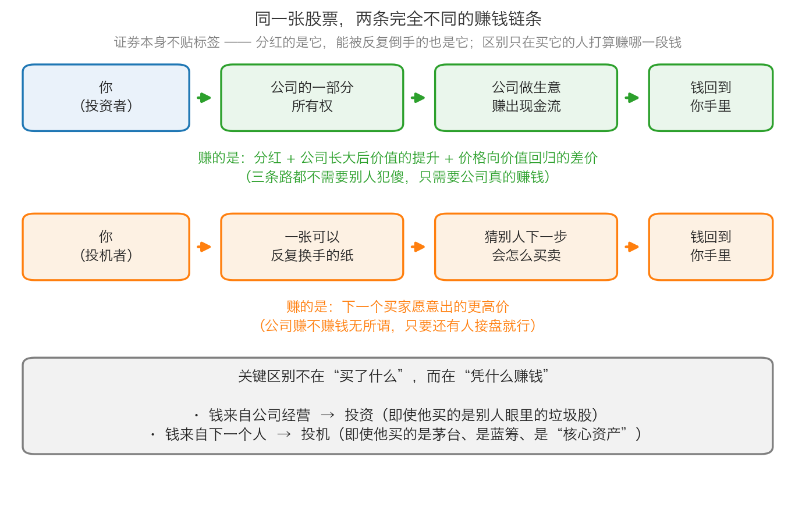

# 第 1 章：投资者与投机者——同一张纸，两种玩法

> 本章你将：
> - 拿到"投资者"和"投机者"的正式定义，并知道分界线画在哪里
> - 看懂原书说的投资者获利的**三条路**，以及它们为什么都不需要别人犯傻
> - 明白为什么**同一只证券，既可以被人投资，也可以被人投机**
> - 学会识别"专业投资者"队伍里的大量投机行为
> - 回答"这对我的钱包意味着什么"：给你每一次买入冲动做一次分类体检

第 0 章我们用一个罐头看清了投机的样子。这一章要把尺子做出来：投资者和投机者到底怎么区分。原书把这件事放在全书第一章的第一节，理由写在开头（p13）：

> "正是由于如此，理解投资和投机之间的区别是取得投资成功的第一步。"

---

## 1.1 投资者的世界：买的是一门生意的一部分

先讲感觉，再给定义。

想象你和两个朋友凑钱盘下一家小饭馆的三成股份。你掏了 15 万，从此你关心的东西会是什么？不会是"下个月有没有人愿意出 18 万买我这份股份"，而是：这家店一天卖多少碗面、房租多少、食材成本涨没涨、一年下来能分给我多少钱。**你买的是生意的一部分，你赚的是生意赚出来的钱。** 这就是投资者的心理位置。

换成股票，原书给的定义是（p13）：

> "对投资者来说，股票代表的是相应企业的部分所有权，而债券则是给这些企业的贷款。投资者在比较证券的价格与他们被估测的价值之后做出买卖的决定。"

两个词要顺手确认一下（Week 1、Week 2 都讲过，这里是它们的"正式口径"）：

- **股票**：公司所有权的一小片。
- **债券**：借条。你把钱借给公司或政府，对方按约定付利息、到期还本。

原书接着说，投资者什么时候会买（p13）："当他们认为自己知道一些其他人不知道、不关心或者宁愿忽略的事情时，他们就会买进交易。"他们会买进那些**回报与风险相比看起来有吸引力**的证券，卖出那些回报不再能抵御风险的证券。

请注意这句话的落点：**投资者比较的是价格和价值，而不是价格和昨天。**

### 投资者赚钱的三条路

原书把投资者的获利方式拆成了三条（p13）。我把它做成一张表，因为这张表是本章最重要的东西之一：

| 赚钱的路子 | 钱从哪里来 | 需不需要别人接手 |
|---|---|---|
| ① 企业运营产生的自由现金流 | 公司真的赚到了钱，反映在更高的股价或者分给你的股息上 | 不需要。公司赚钱本身就让你变富 |
| ② 市场愿意给更高的估值倍数（市盈率、市净率变高） | 别人的口味变了，愿意为同样的盈利付更高的价 | **需要**。这条最不可靠 |
| ③ 股价与企业价值之间的差距缩小 | 价格向价值回归 | 需要有人愿意按价值买，但不需要他"犯傻" |

第一条最好理解：你盘下的饭馆今年赚了 30 万，你的三成就是 9 万——这笔钱跟有没有人接手你的股份毫无关系。

第二条要解释一下。**市盈率**（Week 2 讲过：股价除以每股每年赚的钱）代表"市场愿意为 1 元盈利付多少钱"。用铺子打比方：小区门口一家铺子，十年前大家愿意出 10 倍年租金买它，现在愿意出 20 倍。铺子还是那个铺子，租金一分没多，**变的只是大家的口味**。所以这条路上赚到的钱，是别人给的，随时可能被要回去。

第三条是价值投资者最常走的路：你算出这家公司值 40 元，市场只卖 24 元，你买下来，等价格慢慢靠向价值。

> 📌 **划重点：** 三条路里，只有第一条是**不依赖别人**的。这就是为什么价值投资者总在强调"我买的是生意"——因为生意会自己赚钱，而市场的口味不会一直站在你这边。

> ⚠️ **易踩坑：** 分红不是凭空掉下来的钱。公司从账上拿出 1 元分给你，它的资产就少了 1 元，所以**分红当天股价会相应除权下调**（"除权"是指公司把一部分资产分出去之后，股价按比例下调；这不是下跌，只是把分掉的那部分从价格里扣掉），你的总资产在那一刻并没有变多（Week 2 讲价值时提到过这个机制）。分红真正的好处是：公司把真金白银交到了你手上，而不是留在账上；而且长期看，能持续分红的公司通常是真的赚到了钱。

---

## 1.2 投机者的世界：买的是"下一步"

原书对投机者的描述非常具体（p13–p14），我把它拆成三个特征：

**特征一：他买卖的依据是"价格下一步会涨还是会跌"。** 原书写道："投机者则根据证券价格下一步会上涨还是下跌的预测来买卖证券。他们对价格走向的预测不是基于基本面，而是基于对其他人买卖行为的揣摩。"

**特征二：他把证券看成一张可以被反复换手的纸。** 原书原话是"他们将证券看成是可以被反复换手的纸张，通常对投资的基本理念一无所知或者漠不关心。他们买入证券是因为这些证券的市场表现好，反之则卖出。"

**特征三：他永远在预测。** 原书 p14 列了一串：每天早晨的有线电视、每个下午的股市报告、每个周末的《巴伦周刊》、每周无数的市场通讯、每次商人的聚会——人们总是在对市场走向狂乱推测。（顺便交代：《巴伦周刊》是美国一份历史很长的财经周报，可以理解成"每周一期的股市预测大合集"。）

这段话是 1991 年写的，但你可以直接把今天的东西代进去：**财经短视频、开盘直播间、股吧热帖、荐股群、私域"老师"。** 形式换了，做的事情一模一样：猜下一步。

### 什么叫"技术分析"

原书在这里提到了一个词（p14）：**技术分析**，就是"以往股票价格的波动曲线，而不是相应企业的价值决定了股票未来的价格"。

用生活类比讲：这就像你只看一个人过去三个月的体重曲线，来预测他下个月会得什么病。体重曲线当然有信息，但它和病因之间没有稳定的因果链。原书对它的判断非常干脆（p14）：

> "实际上，没有人知道市场下一步将如何走：设法预测只是浪费时间，而根据这样的预测来进行投资则是投机性的操作。"

> 💡 **换个说法：** 投资者问的是"这东西值多少钱，我现在付的价划不划算"；投机者问的是"下一个小时、下一天，别人愿意出多少"。**一个问价值，一个问人心。** 人心不是不能猜，而是猜错的代价通常很大。

---

## 1.3 一张表看清两边的区别

下面这张表把前面两节的内容收拢起来。建议你把它抄在笔记本第一页。

| 对比项 | 投资者 | 投机者 |
|---|---|---|
| 他眼中的股票 | 企业所有权的一小片 | 一张可以反复换手的纸 |
| 他做决定的依据 | 价格与估测价值的比较 | 价格下一步的涨跌预测 |
| 他的收益来自 | 企业现金流、估值差、价值回归 | 下一个买家出的更高价 |
| 他的时间尺度 | 以年计（只要价值没被实现，可以一直等） | 以天、周、月计 |
| 他每天关心什么 | 生意有没有变好、价值有没有变 | 别人怎么看、量能怎么样 |
| 他最大的敌人 | 自己估错（所以要留安全边际） | 自己成为最后一个接棒的人 |
| 市场下跌对他意味着 | 可能的机会（东西打折了） | 灾难（东西砸手里了） |
| 他的钱靠谁 | 靠公司 | 靠别人 |

图里上下两条链条，请你多看几眼：**起点都是"你"，终点都是"钱回到你手里"，中间经过的环节完全不同。** 上面那条经过"公司做生意赚出现金流"，下面那条经过"猜别人下一步怎么买卖"。

---

## 1.4 关键：证券本身不贴标签

这是本章最容易被人误解、也最重要的一点。原书写道（p14）：

> "市场参与者并不会佩戴徽章来标示他们是投资者还是投机者。如果没有详细地研究他们的行为，要区分投资者和投机者是很困难的。单单看他们持有的证券并不说明什么，因为任何一个证券都可以被投资者或投机者，或两者所持有。"

**没有任何一只股票天生是"投资品"或"投机品"。** 同一天、同一个价格买入同一只股票的两个账户，可能一个在做投资，一个在做投机。

举两个例子（数字是简化示意，只为了说明结构）：

- **例子一（同一只好公司）。** 甲算了很久，认为一家公司每股大约值 40 元，于是在 24 元买入，理由是安全边际够大；乙在同一分钟、同一价格买入，理由是"它上周涨了 12%，趋势很好，还会涨"。——甲在做投资，乙在做投机，尽管**他们买的是同一只股票、同一个价格**。
- **例子二（同一只"差"公司）。** 一家公司连续亏损、股价跌到很低，但它账上有一块不错的资产，仔细算完清算价值（公司今天就关门、把资产一件件卖掉还完债还能剩多少）之后，发现股价不但低于清算价值，而且打了六折——丙买它，是在做投资。丁在同一只股票上做波段，反弹 5% 就卖——丁在做投机。

所以判断的标准不是"你买了什么"，而是**两句话**：

1. **你的钱准备从哪里来？** 来自公司，还是来自下一个人？
2. **你做决定的依据是什么？** 是价值与价格的对比，还是价格自身的走势？

> 📌 **划重点：** 同样是买"龙头股"，可以是投资也可以是投机；同样是买"垃圾股"，也可以是投资也可以是投机。**行为决定性质，标的决定不了性质。**

---

## 1.5 "专业投资者"其实多数时间在投机

原书在这里插了一句非常不客气的话（p14）：

> "许多'专业投资者'在多数时间里执行的是投机操作，这从他们设定目标的方式上可见一斑，他们通过预测市场走向来追求短期交易利润，而不是通过研究企业基本面来获得长期投资回报。"

为什么"专业"的人反而在投机？原书这一章没有展开，只留了线索。Week 4、Week 5 会用整整两周讲清楚背后的原因：他们的收入来自管理费和交易佣金、他们的业绩每季度被排名、他们不敢在别人都赚钱的时候空仓。（这里先记住结论：**这不是因为他们蠢，而是因为他们的处境逼着他们这么做。**）

对你来说，这一段的用处是：**不要用头衔来判断一个人在做投资还是投机。** 有牌照、上电视、管理几十亿，这些都不能证明他在做投资。看他怎么设定目标——是"这笔生意值不值这个价"，还是"下个季度跑赢指数"。

---

## 1.6 落到 A 股：四个常见动作，各是哪一类

现在做一次实战练习，把 A 股里最常见的四个动作分类。

| 你听到的说法 | 他的依据是什么 | 属于哪一类 | 什么情况下会变成投资 |
|---|---|---|---|
| "这个概念是今年的主线，赶紧上车" | 别人的想象和资金的流向 | 投机 | 你真的研究了这个行业，算出了公司能赚多少钱，并且买入价明显低于这个价值 |
| "这家公司要重组了，想象空间巨大" | 一个尚未发生的猜测 | 投机 | 你算过最坏情况（重组失败、公司继续亏），并且这个价格连最坏情况都不怕 |
| "它站上 60 日均线了，MACD 金叉" | 过去的价格曲线 | 投机 | 几乎不会——技术指标衡量的是价格自身的历史，和公司值多少钱无关 |
| "我有朋友在里面，消息绝对可靠" | 别人的一句话 | 投机 | 原书 p24 的提醒：如果这个消息真的有价值，他为什么要分享给你？ |

（上表第三行里那两个词解释一下：**60 日均线**指过去 60 个交易日收盘价的平均值；**MACD** 是一种常见的技术指标。它们的共同点是——只用价格和成交量自己的历史数据算出来，完全不涉及公司赚了多少钱。）

> 🇨🇳 **落到 A 股/港股：** 港股里"老千股"（长期通过各种手段掏空小股东的公司）的暴涨暴跌、A 股里"改名蹭热点"的涨停潮，都是这套结构的当代表达。反过来说，一只被所有人嫌弃的破净股（股价低于每股净资产），如果你算清楚了它的资产是真的、负债没有黑洞，买入价又有足够的折扣，那就是投资，哪怕它连续三年没人提起。

> ⚠️ **易踩坑：** 不要因为一个动作"听起来像投机"，就断定做它的人一定亏钱；也不要因为一个动作"听起来像投资"，就断定它安全。**名字不定性，依据才定性。** 原书也没有说投机者必亏，它说的是（p14）："投资者极有可能获得长期投资成功，相反，投机者则有可能随着时间的推移而赔本。"

为什么投资者"极有可能"成功，而投机者是"有可能"赔本？因为投资者的第一条收益路（企业现金流）是**可以重复的**：公司每年都在赚钱，你的胜率就每年都站在你这边。而投机者的收益只能靠**一连串正确的猜测**——猜错一次，前面赢的都可能还回去。

---

## ✍️ 想一想

1. 请你把下面这句话补完，并说出理由："买一只股票，如果我的收益来自＿＿＿＿，那我就是在投资；如果我的收益来自＿＿＿＿，那我就是在投机。"
2. 原书说投资者赚钱的三条路里，有一条"最不可靠"。你觉得是哪一条？为什么它最不可靠？请用"小饭馆"或者"小区铺子"打比方说清楚。
3. 假设你的一位亲戚告诉你："我买的这只股票已经涨了 50%，你快跟上。"请你不用"他说得不对"这个答案，而是设计**两个问题**来问他，用这两个问题的答案判断他到底是在投资还是在投机。

> 💡 **参考思路：**
> 1. 参考答案：填"这家公司未来赚到的钱"和"下一个买家愿意出的更高价"。理由：第一种收益由企业创造，即使全世界都不知道你买了它，它照样会把钱送到你手上；第二种收益必须由另一个人掏钱，只要那个人不出现，收益就等于零。
> 2. 是第二条——"市场愿意给更高的估值倍数"。因为它跟公司经营**没有关系**，只跟别人的口味和情绪有关。用铺子打比方：铺子还是那个铺子、租金一分没涨，只是大家从愿意出 10 倍年租金，变成愿意出 20 倍。这多出来的 10 倍租金是别人给的，别人也可以明天就收回去。第三条（价值回归）虽然也要有人买，但那个人不需要"犯傻"，他只需要按价值出价。
> 3. 参考问法：问题一——"你算过这家公司值多少钱吗？大约多少？"（如果答案是"没算过"，那他的依据只能是价格。）问题二——"如果它明天开始停牌（暂停交易）三年，你还愿意拿着吗？你打算靠什么赚钱？"（如果他答"靠它涨到某某价卖掉"，那就是靠下一个买家。）两个问题的核心都是同一件事：**他的依据是价值还是价格。**

---

## 🧮 算一算

**情境（简化示意数字，用于教学）。** 一家公司每股每年赚 **2 元**（这叫**每股盈利**）。你花时间估完，认为它大约值 **40 元**（相当于市场给它 20 倍市盈率）。现在股价是 **24 元**。

另外设定：公司盈利每年增长 **10%**；每年每股分红 **1 元**（为了让你好算，这里假设分红直接拿到手，不处理除权对股价的影响）。

有两个人都在 24 元买入：

- **甲（投资者）**：打算持有三年，理由是"24 元比 40 元便宜了 16 元，有安全边际"。
- **乙（投机者）**：打算涨到 30 元就卖给下一个人。

请回答下面五个问题。

**问题 1：** 甲的"安全边际"是多少元？相当于他估的价值的百分之多少？

**问题 2：** 三年里甲一共拿到多少分红？

**问题 3：** 三年后，公司每股盈利是多少？（每年增长 10%）

**问题 4：** 如果三年后市场仍然愿意给 20 倍市盈率，股价会是多少？甲的总收益率是多少？

**问题 5：** 乙顺利卖掉股票赚多少？如果行情不好，没人愿意出 30 元，他只能在 20 元卖出，亏多少？从 20 元回到本金 24 元需要涨多少？

### 分步解答

**问题 1：**

第一步，安全边际 = 你估的价值 - 你付的价格：

$$40 - 24 = 16 元$$

第二步，它占估算价值的比例：

$$16 \div 40 = 0.40 = 40\%$$

**结论：甲用 24 元买了大约值 40 元的东西，安全边际 16 元，相当于打了六折。** 这 16 元就是留给"我可能估错了"的空间。

**问题 2：**

每年每股 1 元，持有三年：

$$1 \times 3 = 3 元$$

**结论：三年分红合计 3 元**（相对于 24 元的买入价，是 12.5%）。

**问题 3：**

一年一年往后乘，每年乘以 1.1：

- 第 1 年：$2 \times 1.1 = 2.2 元$
- 第 2 年：$2.2 \times 1.1 = 2.42 元$
- 第 3 年：$2.42 \times 1.1 = 2.662 元$，约 **2.66 元**

**问题 4：**

第一步，股价 = 每股盈利 乘以 市盈率：

$$2.66 \times 20 = 53.2 元$$

第二步，价差：

$$53.2 - 24 = 29.2 元$$

第三步，总收益 = 价差 + 分红：

$$29.2 + 3 = 32.2 元$$

第四步，收益率 = 总收益 除以 投入：

$$32.2 \div 24 = 1.342 = 134.2\%$$

**结论：三年赚了 134.2%**。请注意甲赚到的钱里，**只有 3 元来自分红；股价上涨的 29.2 元里，13.2 元是公司盈利增长（2 元涨到 2.66 元）推着走的，另外 16 元来自"用 24 元买入价值 40 元的东西"这个折扣被抹平**。这就是"第一条路"的威力：公司多赚了钱，股价自然跟上，这部分收益不靠别人出更高的价；而那 16 元折扣的抹平，也只需要有人愿意按价值买，不需要他犯傻。

**问题 5：**

第一步，乙顺利卖出：

$$30 - 24 = 6 元$$

$$6 \div 24 = 0.25 = 25\%$$

第二步，行情不好时卖出：

$$24 - 20 = 4 元$$

$$4 \div 24 = 0.167 = 16.7\%$$

第三步，从 20 元回到 24 元需要涨多少：

$$(24 - 20) \div 20 = 4 \div 20 = 0.20 = 20\%$$

**结论对比：** 甲赚的 134.2% 里，大约一半来自公司自己变得更值钱（盈利增长 13.2 元加分红 3 元），另一半来自买入时的折扣向价值回归（16 元）；乙赚的 25% 必须由另一个人掏出来。**如果那个人不出现，乙亏 16.7%，而且只要涨 20% 才能回本——而他的回本，同样要指望别人。** 同一只股票，同一个买入价，两个人走上了完全不同的两条路。

---

## ✅ 小测验

**1. 下面哪一种说法，最符合原书对"投资者"的定义？**
A. 长期持有股票的人就是投资者
B. 买大盘蓝筹股的人是投资者，买小盘股的人是投机者
C. 比较证券价格与自己估测的价值之后做买卖决定的人
D. 每年都能赚到钱的人

**2. 原书说投资者获利有三条路，下面哪一条不需要别人接手？**
A. 市场愿意给更高的市盈率
B. 企业运营产生的自由现金流
C. 股价与企业价值之间的差距缩小
D. 以上都需要别人接手

**3. 原书说"许多'专业投资者'在多数时间里执行的是投机操作"，它给出的判断线索是什么？**
A. 他们管理的资金规模太大
B. 他们设定目标的方式：靠预测市场走向追求短期交易利润
C. 他们不懂财务报表
D. 他们持有的是垃圾股

> **答案与解析**
>
> **1. C。** 原书的定义落在"比较价格与被估测的价值"这个动作上。A 错在"长期持有"只是结果，一个人可以长期持有纯粹因为不肯认赔；B 错在标的不能定性——蓝筹股可以被投机，小盘股也可以被投资；D 错在赚钱不等于在投资，投机也可能赚钱，原书说的是"有可能随着时间的推移而赔本"。
> **2. B。** 企业自由现金流是公司自己赚出来的钱，反映在更高的股价或分配的股息上，不需要任何人接手。A 和 C 都要有人愿意出价：A 要有人愿意给更高的倍数，C 要有人愿意按价值买。这也是为什么价值投资者最看重第一条路。
> **3. B。** 原书明确指出"这从他们设定目标的方式上可见一斑，他们通过预测市场走向来追求短期交易利润"。A、C 都不是原书的理由——大资金、专业训练并不能决定行为性质；D 同样错在"用标的定性"：持有垃圾股也可能是投资，持有好公司也可能是投机。

---

## 📖 回到原书

- 对应原书 **第一章** 的"投资与投机的对比"一节，`raw/安全边际-中文版/page_013.md` ~ `page_017.md`（原书 p13–p17）。
- 建议精读：**p13–p14**（投资者的定义与三条获利路、投机者的三个特征、"专业投资者"那段）。这一页半是全书的地基。
- 可以略读：**p16–p17**（三个投机案例的细节，第 0 章已经讲过结构）。
- 原书金句（逐字引用）：
  > "对投资者来说，股票代表的是相应企业的部分所有权，而债券则是给这些企业的贷款。"（p13）
  >
  > "投机者则根据证券价格下一步会上涨还是下跌的预测来买卖证券。他们对价格走向的预测不是基于基本面，而是基于对其他人买卖行为的揣摩。"（p13）
  >
  > "单单看他们持有的证券并不说明什么，因为任何一个证券都可以被投资者或投机者，或两者所持有。"（p14）
  >
  > "投资者极有可能获得长期投资成功，相反，投机者则有可能随着时间的推移而赔本。"（p14）

下一章讲一个更实际的问题：既然价格每天都在跳，**你该怎么看待那些报价？** 格雷厄姆给了一个流传了七十多年的比喻——市场先生。
