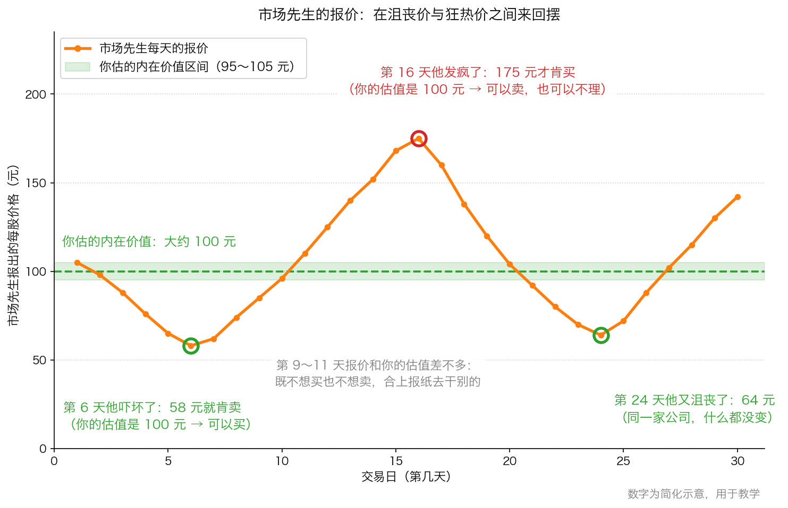
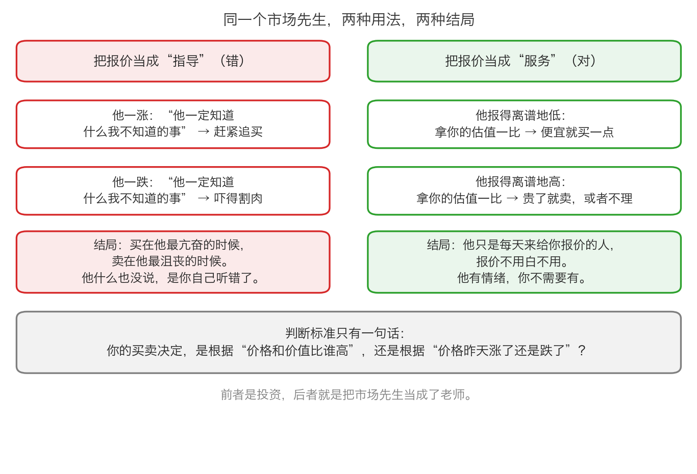

# 第 2 章：市场先生——你那位情绪化的合伙人

> 本章你将：
> - 认识格雷厄姆笔下那位"情绪极不稳定的合伙人"——市场先生
> - 明白市场是**来服务你的，不是来指导你的**，以及把两者搞反会发生什么
> - 知道证券价格波动的两个基本原因，并学会区分它们
> - 看懂 A 股涨停板、跌停板、股吧情绪和放量报价，分别在向你传递什么
> - 回答"这对我的钱包意味着什么"：给每天的报价安排一个正确的用途

第 1 章我们把尺子做出来了：投资看价值，投机猜价格。可是价格每天都在跳，跳得人心神不宁。这一章要解决的就是这个问题——**一个价值投资者，到底该怎么看待这些报价。**

---

## 2.1 先交代背景：两派人吵了五十年

原书在这里摆出了两种对立的观点（p19–p20）。

**第一种观点：市场是有效的。** 意思是：所有公开的信息都已经反映在价格里了，所以你想靠研究找到"被低估的股票"是白费力气，能拿到市场的平均回报就算最好结果；而那些试图战胜市场的人，会因为付出高额交易费用和税赋，反而输给市场。

用生活类比讲：这就像说**菜市场里的每一棵白菜，价格永远是对的**——因为所有买菜卖菜的人都知道今天的收成、天气和库存，谁也别想捡到便宜。

**第二种观点：有些证券的定价是无效率的，这给投资者创造了低风险盈利的机会。** 提出这个说法的人，你已经在前面几周见过：**本杰明·格雷厄姆**（1894–1976），美国投资家，两本经典著作《证券分析》和《聪明的投资者》的作者，也是沃伦·巴菲特的老师。"市场先生"这个比喻就出自他。

原书对这场争论的取舍很明确：它站在第二种观点这一边，并且用"市场先生"这个形象，把"市场有时会错"这件事讲得比任何公式都清楚。

> 💡 **换个说法：** 你不必现在就判定"市场到底是有效还是无效"。你只需要记住一件事：**当价格明显偏离你算出来的价值时，那个偏离就是你的机会。** 至于它为什么会偏离——因为报价的人不是电脑，是千万个有情绪的人。

---

## 2.2 市场先生是谁

原书这样描述他（p20）：他"在每个交易日都时刻准备着以自己所定的价格买进或者卖出无限量的各种证券"，而且**免费提供这项服务**；有时他定的价格，你既不想买也不想卖；但他"常常失去理性，有时会变得乐观，以高出证券价值的价格买入；有时又变得悲观，以远低于证券内在价值的价格卖出证券"。

用生活类比：**想象你有一位合伙人，他每天上午十点准时敲你家门，报一个价，问你要不要按这个价买他那份，或者把你那份卖给他。** 他情绪很不稳定：今天觉得生意要完蛋了，愿意低价甩卖；明天又觉得要发大财了，出价高得离谱。你有权接受、有权拒绝，也有权关上门不理他——他不会生气，明天还会来。

**"市场先生"（Mr. Market）** 这个词现在已经是投资圈的通用说法：**市场像一个情绪极不稳定的合伙人，每天给你报一个价，你可以接受也可以无视。**

这张图（简化示意数字）里有三样东西，请分清：

- **橙色折线**：市场先生每天报的价。它上蹿下跳，从 58 元到 175 元。
- **绿色虚线（100 元）**：你估算的内在价值——由公司的资产、盈利、现金流决定，跟报价没关系。
- **绿色窄带（95～105 元）**：Week 2 讲过，价值是一个范围，不是一个精确的数，所以你给它留了一点宽度。

图里发生的事很简单：**公司的价值在 30 天里几乎没动，报价却在两个方向上各跑出去 42% 到 75%。**

> 📌 **划重点：** 原书说得很直白（p20）："现实状况是那个'市场先生'什么也不知道，他只是市场里千万个并不总是被投资基本面所推动的买卖者的集体行动的产物。" **他不是专家，他只是个报价员。** 他有情绪，你不需要有。

---

## 2.3 服务，还是指导？这是全章的关口

这一节的道理只有一句话：**市场先生是用来服务你的，不是用来指导你的。** 但把它做反的人非常多，原书举了两种典型（p20–p21）：

**做法一：他降价，你就慌。** "当他们看到'市场先生'降低某一证券的价格时，往往忽略了他的非理性，也不顾自己对其内在价值的评估而仓促卖出所持有的证券。"

**做法二：他涨价，你就追。** "他们看到'市场先生'提高价格，于是便信任他的线索，在更高的价格追进，好像他比自己知道得更多。"

原书接着讲了一个很微妙的现象（p20–p21）：**每天的报价会给你的判断提供"反馈"，而这个反馈会悄悄改变你的想法。**

- 你买入之后价格涨了 → 你觉得自己对了 → 开始相信这只股票比你原先以为的更值钱 → 甚至**在基本面变坏的时候也舍不得卖**。
- 你买入之后价格跌了 → 你开始焦虑 → 怀疑"市场先生是不是知道什么我不知道的事" → 恐慌卖出。

这里要交代一个词：**内在价值**（Week 2 讲过，这里是统一口径）——一家公司**真正**值多少钱，由它的资产、盈利、现金流决定，而不是由股价决定。

原书引用路易斯·鲁文斯坦的警告（p21）：路易斯·鲁文斯坦是一位美国投资经理和作家，长期研究华尔街的疯狂与人性。他提醒说："一只股票的价格上涨并不代表其企业运作良好，也不代表价格的上涨有相应的内在价值提升为理由。"

原书的总结只有两句话，值得你抄下来（p21）：

> "你不能忽略市场，忽略一个投资机会的来源显然是错误的，但是你必须自己独立思考，不能被市场左右。你的投资决定必须取决于价值与价格的对比，而不仅仅是价格。"

> ⚠️ **易踩坑：** 把市场先生当指导，最典型的症状是**你开始为价格找理由**。股票涨了，你会说"市场总是对的，肯定有利好我没看到"；股票跌了，你会说"市场总是对的，肯定有雷"。而正确的动作是：**回到你算过的价值上，问一句"这个价格相对于价值，是更划算了还是更贵了"**——如果更划算了，跌下来反而是机会，原书原话是"如果当初买入这只股票确实是廉价物，理性的行为应该是利用这个更廉价的机会买入更多的股票"（p21）。

---

## 2.4 价格为什么会动

要正确使用市场先生，你得知道他的报价为什么会变。原书给了一个很清楚的分类（p22–p23）：**证券价格因为两个基本原因而上下波动——反映企业实体状况（或投资者对它的感觉），或者反映供求关系的短期变化。**

**原因一：企业实体状况真的变了。** 原书举了几个例子（p22）：

- 可口可乐的业务拓展了、前景改善了，股价相应上涨——这种上涨**有企业价值提升作为理由**。
- 飓风造成数以亿计美元的灾难性损失，保险公司（原书举的是美国保险公司 Aetna）的股价下挫——这个下跌是合理的，因为它的钱真的赔出去了。
- 一家公司意外宣布以很高的价格卖掉它旗下的主要子公司，股价飙升——它的内在价值被突然兑现了一部分。

宏观经济层面的变化也会推高或压低一大批证券：利率普遍下降、企业税率降低、经济增长预期上升，等等。

**原因二：投资者感觉的变化，与基本面无关。** 原书举的例子是（p22）：1991 年头几个月，许多生物技术公司的股价涨了 1 倍到 2 倍，而当时**没有任何企业或行业基本面的变化**能解释这种暴涨。原书给的唯一解释是："投资者突然间愿意以比之前更高的价格购买同样的资产。"

原书接着点出了最容易被忽略的事实（p22–p23）：

> "短期内，供求关系独自决定了市场价格。"
>
> "大多数市场价格的日常波动是由于供求关系的变化，而不是由于基本面的发展。"

**供求关系**这个词 Week 1 讲过，这里再确认一次：想买的人（需求）和想卖的人（供给）谁更急，价格就往谁那边走。年底交税要卖股票、某个机构在业绩公告后决定清仓、一条让人不安的谣言——这些都能让价格动，而它们跟公司值多少钱毫无关系。

> 📌 **划重点：** 原书 p23 的结论是：**投资者常常不知道证券价格为什么会波动。** 价格的波动可能来自价值的变化，也可能跟价值毫无关系。既然分不清，你就必须"在证券价格之外看到相应企业的价值"，并且**永远把两者的比较作为投资过程的一部分**。

---

## 2.5 落到 A 股：涨停板、跌停板、股吧与放量

现在把这一章的道理装进 A 股的场景里。先解释三个基础概念（没买过股票的人也一定能看懂）：

**涨停板 / 跌停板。** A 股大部分股票**每天允许的涨跌幅有上限**：主板股票最多比前一天的收盘价涨 10%，也最多跌 10%（创业板、科创板的股票是 20%，主板里名字前面带 ST 的风险警示股是 5%，北交所是 30%）。涨到上限叫**涨停**，跌到下限叫**跌停**。港股**没有**涨跌停限制。

用生活类比：菜市场规定，今天白菜最多只能比昨天贵 10%，也最多只能比昨天便宜 10%。那么当所有人都想买、没人想卖的时候，价格会顶在 +10% 那一格，**想买的人排起长队也买不到**；反过来，所有人都想跑的时候，价格砸在 -10% 那一格，**想卖的人排着队也卖不掉**。

**股吧情绪。** 股吧、论坛、评论区是散户情绪的集散地。它的用处不是告诉你真相，而是让你**观察到市场先生的情绪温度**——满屏"还能有几个板"和满屏"完了，割了吧"，是两种完全不同的温度。

**成交量放大。** 成交量就是当天买卖成交的股数。放量意味着**分歧突然变大**：有人拼命买，同时有人拼命卖，两边都觉得对方是傻子。Week 1 讲过报价是怎么形成的——放量时的报价，是情绪最激烈的报价。

| A 股现象 | 市场先生在做什么 | 你该想什么 |
|---|---|---|
| 涨停，买盘排长队 | 他兴奋到极点，愿意出高价买 | 我卖给他是不是更划算？至少我不会去排队追 |
| 跌停，卖盘排长队 | 他恐慌到极点，抢着低价卖 | 我的估值变了吗？没变的话，这是打折还是陷阱？ |
| 股吧一边倒看多/看空 | 他在给你"指导" | 这是情绪，不是信息；不要拿它当买卖依据 |
| 突然放巨量 | 他和别人吵起来了，报价剧烈摆动 | 波动不等于信息，先回去看公司有没有真变化 |

这里有一个特别值得记住的细节。原书说市场先生"在每个交易日都时刻准备着以自己所定的价格买进或者卖出无限量的各种证券"（p20）——**这是理论上的理想状态。在 A 股，他不总这么做**：跌停的时候，他可以关上门不买；涨停的时候，他可以不卖给你。

> 🇨🇳 **落到 A 股/港股：** 这条差别很实际。它的意思是：**"我随时能卖掉"这个假设，在极端行情里会失效。** 很多人在牛市里觉得股票跟现金差不多（想要钱就卖一点），但到了连续跌停的时候才发现，根本卖不出去。所以"流动性"（能不能在想卖的时候卖掉）这件事，比收益率更值得你先考虑——Week 12 会专门讲它。

---

## ✍️ 想一想

1. 原书说市场先生"什么也不知道"。可市场里明明有那么多专业机构、研究员、基金经理，为什么说他什么也不知道？
2. 假设你算出某公司每股大约值 100 元，市场先生今天报 58 元。请你分别写出"把他当指导"和"把他当服务"两种反应下，你会做的动作和你会有的心情。
3. 有人说："跌了这么多，肯定是出了什么我不知道的大事。"请用本章"价格波动的两个原因"来分析这句话哪里可能对、哪里可能错。

> 💡 **参考思路：**
> 1. 因为他报出的价格不是某个人深思熟虑的结论，而是**千万个买卖者集体行动的结果**：有人因为年底要用钱而卖，有人因为听说了一条消息而买，有人因为排名压力而调仓。这些人的动机五花八门，跟"这家公司值多少钱"关系不大。所以价格里有信息，但它是**被噪音淹没的信息**——你不能把它当成一个权威判断。
> 2. 当指导：58 元会让你怀疑自己的估值（"是不是有雷"），很多人的实际动作是割肉，心情是恐慌、后悔、急着找人问。当服务：你会先回去检查自己的估值有没有算错；如果没算错，58 元相对于 100 元等于打了不到六折，你的动作是买入或者继续拿着，心情平静——因为你知道自己**不是靠市场先生的情绪赚钱，而是靠价值回归赚钱**。
> 3. 对的部分：价格下跌**有时**确实反映了企业实体状况的恶化，比如订单丢了、被罚了、行业政策变了——这种情况下你的估值本身要下调。错的部分：原书说得很清楚，"大多数市场价格的日常波动是由于供求关系的变化，而不是由于基本面的发展"（p23）。年底要用钱的机构、被动赎回的基金、一条谣言，都能把价格打下来。**正确的动作不是猜是哪种，而是回去看事实。**

---

## 🧮 算一算

**情境（简化示意数字，用于教学）。** 你花时间研究了一家公司，保守估算它每股大约值 **100 元**（乐观情形 110 元，悲观情形 90 元，取中间 100 元）。市场先生在 30 天里报过两个极端价：**58 元** 和 **175 元**。

**问题 1：** 58 元相对于你的估值，折价多少？

**问题 2：** 如果你在 58 元买入，后来价格回到 100 元，你的收益率是多少？此时你的安全边际是多少？

**问题 3：** 175 元相对于你的估值，溢价多少？

**问题 4：** 如果你在 175 元买入，后来价格跌回 100 元，你亏多少？亏损之后要涨多少才回本？

**问题 5：** 把问题 2 和问题 4 的结果放在一起看，你能得出什么结论？

### 分步解答

**问题 1：**

第一步，折价的金额：

$$100 - 58 = 42 元$$

第二步，折价占估值的比例：

$$42 \div 100 = 0.42 = 42\%$$

**结论：58 元相当于在你估的价值上打了 5.8 折**（100 元的东西只卖 58 元）。

**问题 2：**

第一步，收益率 = 赚到的价差 除以 你付出的钱：

$$(100 - 58) \div 58 = 42 \div 58 = 0.724 = 72.4\%$$

第二步，安全边际就是你买入时价格与价值之间的差距：

$$100 - 58 = 42 元$$

**结论：在 58 元买入，价值回归到 100 元时赚 72.4%，买入那一刻手里的安全边际是 42 元。** 请注意第一问和第二问的分母不同：42 除以 100 是"折价率"，42 除以 58 才是"你的收益率"。**同一笔便宜，对你的意义比它看起来更大。**

**问题 3：**

$$175 - 100 = 75 元$$

$$75 \div 100 = 0.75 = 75\%$$

**结论：175 元比你的估值贵了 75%。** 这时候市场先生不是在服务你，是在引诱你。

**问题 4：**

第一步，亏损比例（注意分母是你付出的 175 元）：

$$(175 - 100) \div 175 = 75 \div 175 = 0.4286 = 42.9\%$$

第二步，回本需要的涨幅（注意分母变成了剩下的 100 元）：

$$(175 - 100) \div 100 = 0.75 = 75\%$$

**结论：在 175 元买入，跌回价值时亏 42.9%，而且要从 100 元涨回 175 元，需要 75% 的涨幅。** 亏 42.9% 要涨 75% 才回来——这就是第 3 章要专门讲的那件事。

**问题 5：**

把两次放在一起看：

| | 在 58 元买入 | 在 175 元买入 |
|---|---|---|
| 价格回到 100 元时 | 赚 72.4% | 亏 42.9% |
| 之后要回本需要 | 不需要回本，已经在赚 | 还要涨 75% |

**结论：同一家公司、同一个"价格向价值回归"的事件，只因为买入价不同，一个是大赚，一个是大亏。** 这就是 Week 2 讲的安全边际为什么是全书的落点：**你无法控制公司会怎么样，也无法控制市场先生的情绪，你唯一能控制的是自己付出的价格。**

---

## ✅ 小测验

**1. 关于"市场先生"，下面哪一种理解最符合原书的意思？**
A. 他是一位很懂估值的老专家，报价通常是对的
B. 他是个情绪极不稳定的报价员，你可以接受他的报价，也可以完全不理
C. 他每天只报价一次，你必须接受
D. 他的报价等于公司的内在价值

**2. 你买入一只股票之后它跌了 20%，而你重新检查后确认估值没有算错。按原书的逻辑，理性的反应是？**
A. 立刻卖出，因为市场先生知道得更多
B. 不再看它，装死等回本
C. 把这个更便宜的价格当成机会，考虑买入更多
D. 把估值下调到当前价格，这样就不算亏了

**3. 下面哪一种情况属于"企业实体状况真的发生了变化"？**
A. 年底机构为了交税而卖出股票，导致股价下跌
B. 一条没被证实的谣言让股价大跌
C. 公司的主要工厂被台风损毁，股价下跌
D. 某只股票被纳入指数，被动资金买入推高股价

> **答案与解析**
>
> **1. B。** 原书说市场先生"常常失去理性"，而且"什么也不知道，他只是市场里千万个并不总是被投资基本面所推动的买卖者的集体行动的产物"。A 错在他不是专家；C 错在原书强调他**免费提供服务**、你可以选择不接受（A 股跌停时甚至是他不接受你）；D 错在报价和内在价值是两件事。
> **2. C。** 原书原话是"如果当初买入这只股票确实是廉价物，理性的行为应该是利用这个更廉价的机会买入更多的股票"。A 是典型的"把市场先生当指导"；B 是放弃思考，不等于做对；D 是自欺欺人——把估值改成价格，等于承认价格就是价值，那 Week 2 的整套功夫都白做了。
> **3. C。** 工厂被毁是真实的资产损失，公司的价值确实下降了。A、B、D 都属于"供求关系的短期变化"：交税卖出、谣言、指数纳入，都会让价格动，但公司的赚钱能力一分没变。

---

## 📖 回到原书

- 对应原书 **第一章** 的"利用'市场先生'"与"价格波动的两个原因"两节，`raw/安全边际-中文版/page_019.md` ~ `page_023.md`（原书 p19–p23）。
- 建议精读：**p20–p21**（市场先生的完整描述，以及"服务还是指导"这个关口）。这两页值得读三遍。
- 可以略读：**p19**（关于有效市场的那段学术争论，知道有两种观点即可）、**p22**（可口可乐、Aetna 等美国公司的例子，看结构就行）。
- 原书金句（逐字引用）：
  > "'市场先生'常常失去理性，有时会变得乐观，以高出证券价值的价格买入；有时又变得悲观，以远低于证券内在价值的价格卖出证券。"（p20）
  >
  > "现实状况是那个'市场先生'什么也不知道，他只是市场里千万个并不总是被投资基本面所推动的买卖者的集体行动的产物。"（p20）
  >
  > "你的投资决定必须取决于价值与价格的对比，而不仅仅是价格。"（p21）
  >
  > "大多数市场价格的日常波动是由于供求关系的变化，而不是由于基本面的发展。"（p22–p23）

下一章换一个方向：如果市场先生是外部的干扰，那么**你内部**最大的敌人是谁？原书给了他一个很贵的名字——昂贵的情绪。
