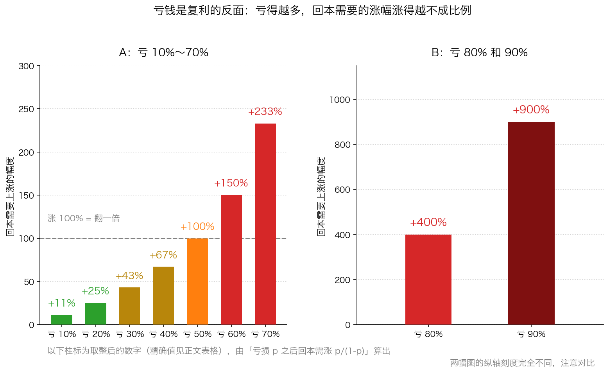
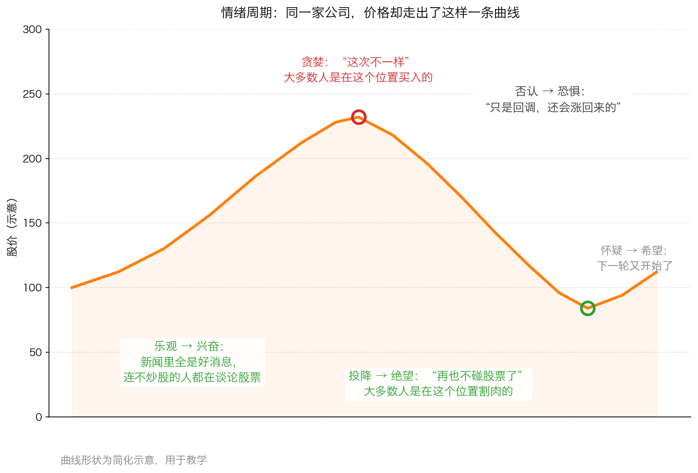

# 第 3 章：失败投资者昂贵的情绪

> 本章你将：
> - 知道为什么平时很聪明、很负责的人，在市场里会做出蠢决定
> - 认识六种最贵的情绪：贪婪、恐惧、嫉妒、从众、过度自信、把近期趋势当长期趋势
> - 学会算那笔最不对称的账：亏 50% 为什么必须赚 100% 才回本
> - 看清频繁交易的真实成本，知道它是怎么悄悄吃掉你的复利的
> - 回答"这对我的钱包意味着什么"：给自己定下三条能执行的纪律

第 2 章讲的是**外部**的干扰——市场先生每天的报价。这一章讲**内部**的敌人。原书把这一节命名为"失败的投资者和他们昂贵的情绪"，"昂贵"这两个字不是修辞，它是可以算出来的。

---

## 3.1 聪明人为什么会在市场里做蠢事

原书开头描述了一类你一定认识的人（p23）：

> "我们都认识这样的人，他们平时做事很负责任、很深思熟虑，但在投资时却变得疯狂。他们也许会在仅仅几分钟内便将很多个月，甚至很多年辛勤劳动和自制节俭积累的金钱投资出去。"

原书接着做了一个非常扎心的对比：这些人在买一台立体声音响或一架相机之前，会读几份消费者杂志、跑几家商店比较；可当他们买入一只"刚刚从朋友那儿听说的股票"时，反而不会花时间做研究。原书的结论是："那种在购买电子产品或照相器材时所展示的理性在投资活动中荡然无存。"（p23）

**为什么？** 这里有两个机制，你要看清：

**机制一：股票没有"试穿"。** 买相机你可以先摸一摸、试一试，好不好用当场就知道。买股票没有这种即时检验——一家公司的好坏，通常要几年后才见分晓。

**机制二（更危险）：市场先生每天给你一个假反馈。** 第 2 章讲过，价格每天都在跳。买入之后价格涨了，你会觉得"我做对了"；跌了，你会觉得"我做错了"。可是**价格的变化本身并不说明你的判断对不对**——它只说明今天别人怎么想。人是一种靠反馈学习的动物：**当反馈又快又频繁时，你会不知不觉地把"价格涨了"当成"我是对的"。** 这就是原书说的，把股市"当做是可以不劳而获的挣钱机器，而不是投资本金以获得合理的回报"（p23）。

> 📌 **划重点：** 投资里最贵的一句话是"**我看见它涨了**"。它把一个关于企业的判断，悄悄换成了一个关于价格的判断。

---

## 3.2 六种最贵的情绪

原书在这一节里点出了好几种情绪。我们一种一种看：先给生活里的样子，再给它在市场里的样子，最后落到 A 股。

### ① 贪婪：想抄近路

原书说（p23–p24）："不劳而获的期望煽动了投资者贪婪的欲望，贪婪使得很多投资者通过寻找捷径来取得投资成功。他们不是让时间去发挥复利的作用，而是试图通过热门的内幕消息来获得快捷的赢利。"

原书还补了一句特别值得记住的追问（p24）：**他们不去想想，那个提供内幕消息的人，怎么可能拥有那些不是合法获得的有价值信息；也不去想想，如果这个消息真的有价值，又怎么可能让他们来分享。**

贪婪还有两种更隐蔽的形态（p24）：**盲目乐观**，以及**面对坏消息时满不在乎**。

> 🇨🇳 **落到 A 股/港股：** 各种"内部群""老师带单""涨停敢死队"。判断标准不是他讲得好不好听，而是那个原书式的问题：**他为什么要告诉你？** 如果这条消息真的能赚钱，最理性的做法是自己闷声买，而不是拉一个群。

### ② 恐惧：在最坏的时刻卖出

原书描述的情绪反转是（p24）："贪婪让路于恐惧，投资者可能损失惨重。"第 2 章已经讲过，恐惧最典型的动作是：看到市场先生降价，就忘记自己算过的价值，仓促卖出。

### ③ 嫉妒：不是自己亏钱难受，是别人赚钱难受

这是最容易被低估的一种情绪。**原书没有专门展开"嫉妒"，这一段是我们顺着它的思路做的一点引申，没有对应的原文依据。**

生活里的样子：你手里的股票一年赚了 8%，本来挺满意；结果同事的股票翻了一倍，你立刻觉得自己的 8% 像个笑话——**尽管你的实际处境一点没变差。** 嫉妒会让人放弃原本正确的做法，去追那个让你难受的东西。

### ④ 从众：人多的地方感觉安全

原书的原话是"从多数中获取信心"（p15）。从众在生活里是生存优势（跟着人群跑，通常能躲开危险），在市场里却恰好相反：**人越多，价格里透支的乐观越多。** 第 0 章讲的"博傻"，本质上就是从众的产物。

### ⑤ 过度自信："这次不一样"

原书写道（p24）："极度的贪婪有时会导致市场参与者提出新时代思维来证明买入或持有估值过高的证券是合理的，人们给出理由来说明为什么这次与以往任何时候都不同。"

这句话里最贵的五个字是"**这次不一样**"。它每次出现，背后都有一整套听起来很有道理的新理论：新经济、新模式、新周期。原书紧接着描述了它的结局（p24）："在短期内，抵抗市场疯狂不仅在心理上而且在财务上都是困难的，因为参与者能挣很多钱，至少账面上是如此。然后，可以预见疯狂会达到顶峰，人们最终认识到这种疯狂，于是情势逆转，演变成恐慌性抛售。"

### ⑥ 把近期趋势当成长期趋势：巴甫洛夫的狗

这一条原书放在"寻找投资公式"那一节里（p28），但它的本质是情绪，所以放在这里讲。

先交代两件事。**第一件**：巴甫洛夫是一位俄国心理学家，他做过一个著名实验——每次给狗喂食之前先摇铃，重复多次之后，狗只要听到铃声就会流口水。原书用这个比喻那些被市场"训练"出条件反射的投资者。

**第二件**：1987 年 10 月 19 日，美国股市在这一天暴跌，单日跌幅约 22%，历史上称为"黑色星期一"，是美股有史以来最惨的单日下跌。当时很多人的预期是：经济要完了。但市场在随后的时间里恢复了，1989 年 10 月又出现剧烈震荡、1990 年垃圾债券市场崩溃，而市场又一次快速恢复。

原书对这段经历的评价是（p28）：这些快速恢复"更加固了这种目光短浅的经验"，于是"许多投资者像巴普洛夫的狗……愚蠢地指望下一个市场震荡作为另一个买入的'时机'，而不管发生震荡的根本原因"。

> 💡 **换个说法：** 被市场训练出来的条件反射是：**大跌 = 买点**。在过去几次里这招确实灵，于是它变成了很多人脑子里的"规律"。但原书点出了要害：**他们不管发生震荡的根本原因。** 同样是跌 30%，一次是因为恐慌情绪的传染（可以买），另一次是因为整个行业的赚钱能力永久性地坏了（不能买）。把这两者混为一谈，就是把运气当成了规律。

---

## 3.3 情绪的成本，是复利的反面

现在算钱。Week 2 讲过复利：100 元每年涨 10%，三年后是 100 变 110、变 121、变 133.1。**复利是慢慢往上堆的。**

而亏损是反过来的：它不是"减掉一点"，它是**把基数打小**，而回本要从一个更小的基数往上爬。

看出来了吗？这张图的形状不是一条直线，而是**越往右翘得越陡**。

| 亏损 | 剩下的钱（以 10 万计） | 回本需要上涨 |
|---|---|---|
| 10% | 9 万 | 11.1% |
| 20% | 8 万 | 25% |
| 30% | 7 万 | 42.9% |
| 40% | 6 万 | 66.7% |
| 50% | 5 万 | 100% |
| 60% | 4 万 | 150% |
| 70% | 3 万 | 233.3% |
| 80% | 2 万 | 400% |
| 90% | 1 万 | 900% |

**为什么亏 50% 要赚 100%？** 因为分母变了。你亏掉一半之后，剩下 5 万；要从 5 万回到 10 万，需要多出 5 万，而 5 万正好是 5 万的一倍，也就是 100%。亏损用**大数**做分母，回本用**小数**做分母——这就是不对称的来源，跟运气、技巧都没关系，它是算术。

原书把"不要亏钱"当作全书的最高原则，理由就在这里：**一个 50% 的亏损，会吃掉你好几年的复利。**

> ⚠️ **易踩坑：** "反正还会涨回来"这句话里藏着一个错误——**它默认了涨回来的幅度和跌下去的幅度一样。** 但算术不允许：跌 50% 要涨 100%，跌 70% 要涨 233%，跌 90% 要涨 900%。而且别忘了：公司可能真的变坏了，那就永远涨不回来。

---

## 3.4 情绪周期：大多数人买在最高处、卖在最低处

把前面六种情绪按时间排一排，你会发现它们有固定的出场顺序。

图里的曲线是**简化示意**，但它描述的过程你以后一定会亲眼见到（也可能亲身经历）：

| 阶段 | 情绪 | 周围在发生什么 | 常见的动作 |
|---|---|---|---|
| 上涨初期 | 乐观 | 新闻里开始出现好消息，少数人赚钱 | 观望，或者小仓位试一下 |
| 上涨中期 | 兴奋 | 身边人开始谈论股票，赚钱效应扩散 | 加仓，开始推荐给别人 |
| 顶部 | 贪婪 | 到处都是"这次不一样"，新手大量入市 | **大量买入**，甚至借钱买 |
| 下跌初期 | 否认 | "只是回调，还会涨回来的" | 补仓摊低成本 |
| 下跌中期 | 恐惧 | 群里开始骂人，大 V 消失 | 开始失眠，反复看盘 |
| 底部 | 绝望 | "再也不碰股票了"，成交量极度萎缩 | **割肉离场** |
| 回升 | 怀疑到希望 | 没人相信这是真的 | 空仓看着它涨 |

> 🇨🇳 **落到 A 股/港股：** 这张表有三个特别典型的镜头。**镜头一：牛市末期入场。** 新增开户数暴增、基金一日售罄、平时不聊股票的人开始问你买什么——第 0 章讲过的"人多的地方"，往往就是图里那个红圈的位置。**镜头二：熊市底部割肉。** 跌了很久之后，最坚定的持有者也受不了了，在绿圈的位置卖出，恰好把最便宜的价格让给了别人。**镜头三：忍不住频繁交易。** 手里不买卖就难受，一周不动就觉得错过了什么——这笔账我们下面马上算。

---

## 3.5 给自己三条纪律

情绪靠意志力对抗，通常失败。更可靠的做法是**用规则绕开情绪**：

1. **买之前写下来。** 一张纸，写三行：我买的是什么生意、我为什么认为它便宜（我估的价值是多少、我付的价格是多少）、什么情况下我会承认自己错了并卖出。写不出来的，就不要买。
2. **只做一种比较：价值与价格。** 每天问自己"它今天比昨天贵还是便宜"是没有意义的；要问"它现在比我算的价值贵还是便宜"。
3. **减少反馈频率。** 情绪是靠频繁的反馈喂养的。把看盘的频率从每天一次降到每周一次，你对市场先生情绪的免疫力会明显上升。

> 📌 **划重点：** 还有一条我们给你的补充提醒：**尽量不要借钱买股票。** 理由不是道德，而是算术——借来的钱有**利息**和**期限**，这两个东西会在市场最坏的时候逼你卖出（Week 12 会讲"被迫卖出"为什么是投资者最大的风险之一）。用自己的闲钱投资，你才有资格跟市场先生耗时间。

---

## ✍️ 想一想

1. 原书说那些买音响会跑几家店比较的人，买股票却只花几分钟。请你为这个反差找出**至少两个**原因，并针对每个原因想一个应对办法。
2. "这次不一样"这句话，为什么在事后看总是错的，在当时看却总是很有道理？请你举一个你听说过的例子（不必是股票），说明它的结构。
3. 假设你的股票一年涨了 8%，而你同事的股票涨了 90%。请你分别描述：① 你实际的经济状况有没有变差？② 你的心情会发生什么变化？③ 这两种答案不一致，说明情绪在影响什么？

> 💡 **参考思路：**
> 1. 原因一：**没有即时检验**——相机可以试，股票的好坏要几年才揭晓。应对：把"检验"提前，买之前就把研究做足（读财报、看行业、算价值）。原因二：**反馈太快而且假**——每天的价格跳动会伪装成对你判断的评价。应对：降低看盘频率，把评价标准换成"公司经营有没有变差"，而不是"价格有没有涨"。原因三（也可以答这个）：**金额大、动作快、门槛低**——点几下手机就能完成一笔几十万的交易，比买相机还方便。应对：把下单流程变长，比如强制自己隔一天再买。
> 2. 因为"这次不一样"的说法总是能从**已经发生的价格上涨**里找到证据（"你看，它一直在涨，说明新模式是对的"），而它的反证要等到泡沫破掉才出现。它的结构是：**用结果证明原因**。比如某个商品/资产被炒到天价时，人们会说"它的价值逻辑变了"；等价格掉回去，那些理由就没人再提了。你听说的例子可以是球鞋、盲盒、某种虚拟资产、某年特别火的某个行业，结构都是一样的。
> 3. ① 没有变差——8% 是实实在在赚到的，你的购买力真的增加了。② 很难受，甚至会怀疑自己是不是选错了、是不是很笨。③ 说明情绪在影响**你的比较对象**：从"我的目标达成了没有"（绝对表现），滑到"我比别人强不强"（相对表现）。原书在后面会专门讲，投资者应该用**绝对表现**衡量自己——这一点 Week 8 会展开。

---

## 🧮 算一算

这是本课程里最该亲手算一遍的一组数字。请拿出纸笔。

### 第一题：亏损与回本

**情境。** 你有 10 万元本金。请填完下面这张表的最后一列，并写出计算过程。

| 亏损幅度 | 剩下的钱 | 回本需要上涨 |
|---|---|---|
| 30% | ？ | ？ |
| 50% | ？ | ？ |
| 70% | ？ | ？ |
| 90% | ？ | ？ |

**分步解答（以亏 50% 为例，其余用同样方法）：**

第一步，算剩下多少钱：

$$10 万 \times (1 - 50\%) = 10 万 \times 0.5 = 5 万$$

第二步，算还差多少才回到本金：

$$10 万 - 5 万 = 5 万$$

第三步，算这 5 万相对于**剩下的 5 万**是多少：

$$5 万 \div 5 万 = 1 = 100\%$$

**四行答案：**

- 亏 30%：剩 $10 \times 0.7 = 7 万$；需要涨 $3 \div 7 = 42.9\%$
- 亏 50%：剩 $10 \times 0.5 = 5 万$；需要涨 $5 \div 5 = 100\%$
- 亏 70%：剩 $10 \times 0.3 = 3 万$；需要涨 $7 \div 3 = 233.3\%$
- 亏 90%：剩 $10 \times 0.1 = 1 万$；需要涨 $9 \div 1 = 900\%$

**注意分母的变化：算亏损的时候分母是 10 万（大数），算回本的时候分母变成了剩下的钱（小数）。这就是全部的秘密。**

### 第二题：两个投资者的三年

**情境（简化示意数字，用于教学）。** 甲和乙各有 10 万元。

- 甲：每年稳定赚 10%。
- 乙：第一年赚 50%，第二年亏 50%，第三年赚 50%。

**问题：** 三年后谁的钱多？各是多少？

**分步解答：**

甲（一年一年往后乘，每年乘以 1.1）：

$$10 \times 1.1 = 11 万$$

$$11 \times 1.1 = 12.1 万$$

$$12.1 \times 1.1 = 13.31 万$$

乙：

$$10 \times 1.5 = 15 万（第一年）$$

$$15 \times 0.5 = 7.5 万（第二年）$$

$$7.5 \times 1.5 = 11.25 万（第三年）$$

**结论：甲 13.31 万，乙 11.25 万。乙在好的年份里比甲赚得多得多（+50% 对 +10%），最后却少了 2.06 万。** 原因只有一个：那个 -50% 的年份把基数打下来了，而基数决定了后面所有年份的起点。

**追问：如果乙的坏年份只亏 20% 呢？**

$$10 \times 1.5 = 15 万$$

$$15 \times 0.8 = 12 万$$

$$12 \times 1.5 = 18 万$$

**这一次乙赢了。** 所以准确的说法不是"波动大就一定输"，而是——**大亏特别贵**。一个 -50% 的年份，能吃掉你好几年的努力。

### 第三题：频繁交易的成本

**情境（简化示意数字，用于教学）。** 你有 10 万元，忍不住每周都买卖一次（一年按 50 周算）。为了好算，假设每次买卖来回的成本是 **0.2%**（A 股实际包括券商佣金、卖出时的印花税、过户费，加起来大致是千分之几的量级，这里取一个整数）。

**问题 1：** 一年的交易成本是多少？占本金的百分之多少？

**问题 2：** 如果这一年股票本身涨了 8%，你最后是赚还是亏？

**分步解答：**

问题 1，第一步，一次来回的成本：

$$10 万 \times 0.2\% = 100000 \times 0.002 = 200 元$$

第二步，一年 50 次：

$$200 \times 50 = 10000 元$$

第三步，占本金的比例：

$$10000 \div 100000 = 10\%$$

问题 2，第一步，股票本身带来的收益：

$$100000 \times 8\% = 8000 元$$

第二步，扣掉交易成本：

$$8000 - 10000 = -2000 元$$

$$-2000 \div 100000 = -2\%$$

**结论：你选对了股票（它涨了 8%），结果一年下来亏了 2%。**

> 📌 **划重点：** 把这道题和第二题连起来看：甲辛辛苦苦追求的年化收益就是 10%，而你一周一次的交易成本**正好是 10%**。**频繁交易的成本，等于一整年的投资收益目标。** 这就是原书说"投资者如果将花在寻求规则上的时间和精力转移到某一特定投资机会的基本面分析上，结果将会更好"（p28）的另一层含义——你的精力花在哪里，回报就从哪里来。

---

## ✅ 小测验

**1. 你的股票从 100 元跌到 40 元，请问回本需要上涨多少？**
A. 60%
B. 100%
C. 150%
D. 250%

**2. 原书说投资者会"像巴普洛夫的狗"，这个比喻批评的是什么？**
A. 投资者不应该养宠物
B. 投资者被过去几次"大跌后快速反弹"的经历训练出条件反射，不再追问下跌的根本原因
C. 投资者听不懂市场信号
D. 投资者情绪波动太大，需要心理治疗

**3. 关于"情绪的成本"，下面哪种说法最准确？**
A. 情绪只影响心情，不影响收益
B. 情绪的成本主要来自它让你做出追涨杀跌和频繁交易的动作，而这些动作可以被算成具体的钱
C. 只要意志足够坚强，情绪就完全不会造成损失
D. 情绪只对新手有影响，老手不会受情绪影响

> **答案与解析**
>
> **1. C。** 跌到 40 元意味着剩下 40 元，要回到 100 元需要多出 60 元；$60 \div 40 = 150\%$。A 用的是"跌幅"（60 除以 100），那是**跌了多少**，不是**要涨多少**——这正是本章反复强调的分母陷阱。B、D 都把分母搞错了。
> **2. B。** 原书的原文是"愚蠢地指望下一个市场震荡作为另一个买入的'时机'，而不管发生震荡的根本原因"。它批评的是被历史经验训练出来的机械反应，不是宠物、听力或心理健康。
> **3. B。** 本章的整个思路就是把情绪翻译成钱：追涨杀跌带来大亏（亏 50% 要赚 100%），频繁交易带来确定的成本（一周一次约有 10% 一年）。A 错在情绪确实能被算成钱；C 错在"完全不会"太绝对——纪律能减少损失，但不能让情绪消失，所以更可靠的办法是用规则绕开它；D 错在专业投资者同样有情绪，只是表现形式不同（比如怕排名落后）。

---

## 📖 回到原书

- 对应原书 **第一章** 的"失败的投资者和他们昂贵的情绪"一节，`raw/安全边际-中文版/page_023.md` ~ `page_025.md`（原书 p23–p25）；"巴甫洛夫的狗"那一段在 `page_028.md`（原书 p28）。
- 建议精读：**p23–p24**（买音响跑几家店、买股票只用几分钟的对比，以及"这次与以往任何时候都不同"那段）。
- 可以略读：**p24–p25** 关于垃圾债券市场规模的数字（那是美国 1980 年代的事，Week 6 会专门讲），**记住"贪婪如何让整代人偏离估值标准"这个结构就够了**。
- 原书金句（逐字引用）：
  > "失败的投资者被情绪所控制，他们对市场波动的反应不是冷静和理智，而是贪婪和恐惧。"（p23）
  >
  > "那种在购买电子产品或照相器材时所展示的理性在投资活动中荡然无存。"（p23）
  >
  > "人们给出理由来说明为什么这次与以往任何时候都不同。"（p24）
  >
  > "贪婪让路于恐惧，投资者可能损失惨重。"（p24）
  >
  > "许多投资者像巴普洛夫的狗……愚蠢地指望下一个市场震荡作为另一个买入的'时机'，而不管发生震荡的根本原因。"（p28）

下一章是本周的最后一章。前四章讲的都是个人的选择和情绪，那么——**一整个时代都贪婪起来，会是什么样子？** 原书给的答案是 1980 年代，以及一种被华尔街起了绰号的投资者。
