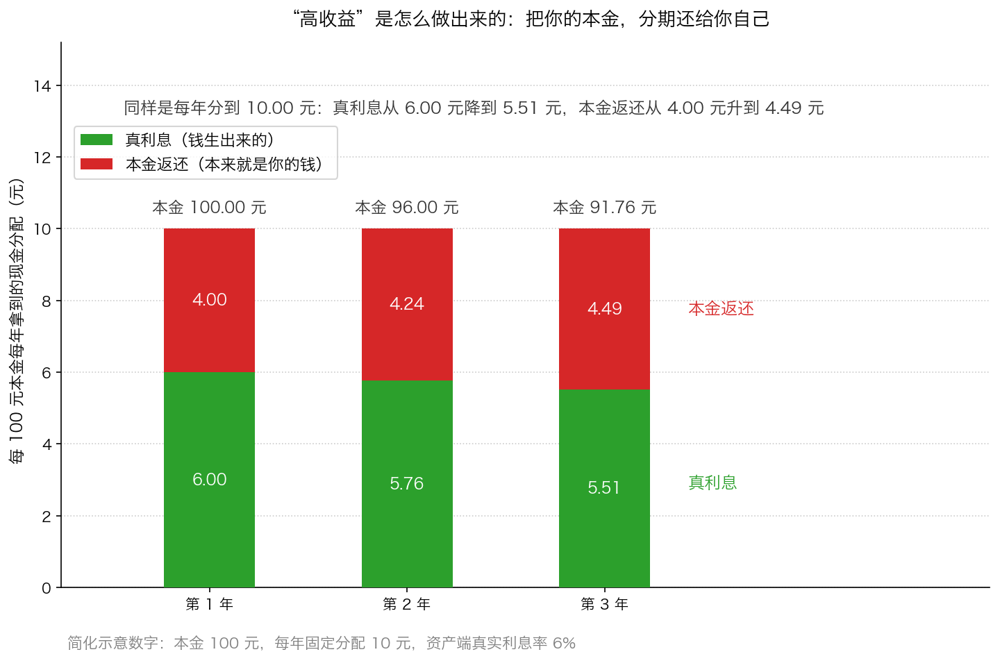
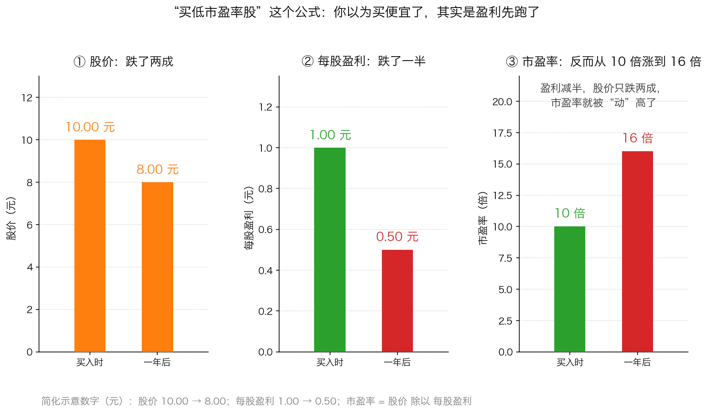

# 第 4 章：收益猪与投资公式——1980 年代的教训

> 本章你将：
> - 知道 1980 年代的美国发生了什么，以及"收益猪"这个绰号是怎么来的
> - 看懂"高收益"的三种做法，尤其是最隐蔽的一种：把你的本金分期还给你
> - 明白为什么"买低市盈率股""按某个指标排序买入"这类机械公式会失败
> - 看清 A 股的高股息、破净、小市值策略为什么有时好用、有时反噬
> - 回答"这对我的钱包意味着什么"：把"找一个公式"换成"做一次检查"

第 3 章讲的是一个人的情绪。这一章要放大看：**当一整个时代都贪婪起来，会是什么样子？** 原书的答案是美国 1980 年代。这段历史离我们很远，但那套结构离今天很近。

---

## 4.1 先交代背景：1980 年代的美国发生了什么

你完全不知道 1980 年代发生了什么，所以先用几句话把舞台搭起来。

**第一幕：高利率。** 1970 年代末到 1980 年代初，美国经历了很高的通货膨胀。**通货膨胀**（简称通胀）指的是物价普遍上涨、钱变毛了——今天 100 元能买的东西，明年可能要 110 元才买得到。为了压住通胀，美国的利率被抬得很高，政府债券的利率一度达到两位数。**利率**你可以理解成"借钱的价格"：政府发债借钱，要付给买债的人百分之几的利息。

**第二幕：胃口被养大了。** 原书写道（p25）："80 年代早期，双位数利率的政府债券挑起了投资者获得高名义回报（nominal returns，指未经复利计算或扣除通胀因素）的胃口。"这里要解释**名义回报**：账面上看到的那个百分比，不扣除通胀。比如你拿到 12% 的利息，而当年物价涨了 9%，你的**名义回报**是 12%，**实际购买力的增加**只有大约 3%。

**第三幕：利率掉下来了，胃口却没掉。** 后来通胀被压住，利率降到个位数——但投资者已经习惯了两位数的收益。原书写道（p25）："当利率下降到个位数时，许多投资者仍然被高收益所迷惑，在债券市场或股票市场里以牺牲资金安全为代价获得高收益。"

**第四幕：华尔街把这门生意做成了产业。** 同一时期，美国流行起**杠杆收购**（英文缩写 LBO）。先解释这个词：**杠杆收购，就是借钱把一家上市公司整个买下来，用公司自己的现金流还债。** 用生活类比：你手上只有 300 万，但你看中一套 1000 万的房子，于是首付 300 万、贷款 700 万，然后把房子租出去，用租金还月供——房子涨价了，赚的全是你的。杠杆收购就是这套玩法用在整个公司上。

借钱收购需要大量资金，于是**垃圾债券**登场了。**垃圾债券**指的是信用评级很低、违约风险比较高的公司发行的债券。这里两个词要说清楚：**信用评级**是专业机构给借款人打的"还钱能力分"，分数低的叫低信用级别；**违约**就是借了钱到期还不上。因为风险高，垃圾债券必须付更高的利息才能卖出去。原书给了一个数量对比（p24）：在 1980 年代之前，整个垃圾债券市场只是由几十亿美元的"堕落的天使"（原本信用不错、后来变差的公司债）组成；而 1980 年代新发行的垃圾债券总规模超过 2000 亿美元，购买者"贪婪地偏离了企业估值和信誉的历史标准"。

**第五幕：激励结构。** 华尔街靠**手续费和佣金**赚钱，卖出的产品越多、交易越频繁，赚得越多。原书一句话点破（p25）："华尔街则很乐意地作出了反应，创造了多种许诺高回报的投资工具，就如华尔街为了获取酬金而一贯所作的那样。"（这一整套机制，Week 4 会用一整周讲。）

当"投资者想要高收益"遇上"中间商想卖产品"，就出现了一个被起了绰号的群体。

---

## 4.2 "收益猪"：只看收益，不看本金

**"收益猪"（yield pigs）** 是华尔街给一类投资者起的绰号——带着嘲讽，甚至原书说他们还被起了"许多更加嘲笑的名字"。指的是**只看收益率高低、不在乎本金安全、容易被任何许诺高回报的产品吸引的投资者**。

原书把这里的机制讲得非常清楚（p25）：

> "美国政府债券通常被当做'无风险'投资，至少就信用质量而言是如此。为了获得比政府债券高一些的当前现金回报，投资者必须或冒着损失本金的风险，或蒙受本金的必然损耗。"

这句话是本节的核心，值得拆开：**想要比"无风险"更高的收益，只有两条路——要么冒本金可能亏损的风险，要么承受本金必然减少的损耗。没有第三条路。**

原书用了三个真实的例子。它们都发生在 1980 年代的美国，我们一个一个看，**重点看结构，不用记数字**。

### 例子一：垃圾债券基金——风险被藏起来了

原书写道（p25）："垃圾债券共同基金在 20 世纪 80 年代被销售给了投资者，这主要是通过高收益的承诺来完成的。就如同看魔术师表演戏法一样，投资者的眼睛几乎完全集中在有吸引力的收益上，而损失本金的高风险则隐藏在视线之外。"

结构：**用一个亮眼的收益率数字，盖住背后的违约风险。**

### 例子二：Ginnie Mae——把你的本金分期还给你

先解释名词。**Ginnie Mae** 指的是美国政府全国按揭抵押协会（GNMA）发行的证券。**按揭抵押证券**是把许多房主的房贷打包在一起、卖给投资者的凭证：房主每个月还的月供（包括利息和本金），转手分配给买这个证券的人。因为它有美国政府机构提供保险，信用质量很高。

问题出在"每个月分到的钱"里（p26）：它包括**利息**和**一小部分偿还的本金**（房主按月还本，有的人还会提前还清贷款）。很多持有人把每月收到的**总金额**当成了自己的"收益"。原书点破了这件事：

> "真正的经济收益率实际上只是收到的利息除以未偿还的本金结余。每月所分配到的本金部分不是本金的收益，而是本金的偿还。因此，那些已经花费了所有现金流的投资者正在吃掉他们的种子玉米。"（p26）

"**吃掉种子玉米**"这个说法很形象：农民把留着明年播种的玉米吃掉了，今年吃饱了，明年没得种。

### 例子三：期权收益基金——把上涨卖掉，把下跌留下

先解释**买入期权**（也叫看涨期权）：它是"在某个规定的期限内、以指定的价格买入某个证券的权利"。原书举的基金做法是（p26）：买入一篮子美国政府债券，同时**卖出**（行话叫"承保"）这些债券的买入期权，收一笔期权费。

这笔期权费被当成"当期收益"发给投资者，看起来很香。但代价是：

- 如果债券价格**涨了**，期权买方会行权（"行权"就是按当初约定的价格真的把债券买走），基金必须按约定的低价把债券让出去——**上涨的好处被卖掉了**。
- 如果债券价格**跌了**，期权费已经收过了，损失全部由基金承担——**下跌的风险一点没少**。

原书的比喻是（p26）：这"将投资者置于一个未买保险的房主的位置上，眼前他们可以省去付给保险公司的一点保险费，但却冒着很大的未来损失的风险"。它的结局是（p27）：

> "只要证券价格继续上下波动，期权的承保人随着时间的推移注定要面临本金的损失，没有可能的本金收益来弥补损失。实际上，这些基金一边在蚕食着本金，一边又误导性地将本金的侵蚀报告成收益。"

### 例子四：为了高收益冲进股市

原书还讲了一种更"朴素"的做法（p27）：有些投资者嫌债券收益率低得无法接受，于是把目光投向普通股，"在能想象的最坏的时机将钱砸进股市"。为什么是最坏的时机？因为**债券收益率低的时候，股票价格往往已经被推得很高**——原书说得很清楚："这些投资者未能明白债券收益率是公开的信息，股市投资者已经将当前的利率水平考虑进了股票的价格中。"

换句话说：**"因为存款利率太低所以去买股票"这个理由本身，就是一个错误的时间信号。**

这张图（简化示意数字）把最隐蔽的那种做法画了出来：本金 100 元，每年固定分给你 10 元，看起来是"年化 10%"。但资产端真实的利息率只有 6%，所以第 1 年分给你的 10 元里，只有 6.00 元是钱生出来的，另外 4.00 元其实是你自己的本金被还给了你。到了第 3 年，真利息降到 5.51 元，本金返还升到 4.49 元——**你以为的"收益"里，属于你自己的钱越来越多。**

> 📌 **划重点：** 分辨"真收益"和"本金返还"，只需要问一句：**这笔钱分给我之后，我那笔本金还能生出同样多的钱吗？** 如果分完之后本金变小了，那你收到的就有一部分是自己的钱——它不叫收益，叫找零。

---

## 4.3 落到今天：A 股/港股 的"高收益"长什么样

把 1980 年代的三个结构翻译到今天：

| 当年的做法 | 今天的对应 | 关键问题 |
|---|---|---|
| 垃圾债券基金藏起风险 | 高收益债基金、某些高息理财产品、"年化 8% 以上"的固收类产品 | 收益率背后的违约风险有多大？谁在兜底？ |
| Ginnie Mae 把本金当收益分配 | 月度/季度分红的基金与理财、某些"月月分红"的保险产品 | 分给我的钱里，多少是利息，多少是我的本金？ |
| 期权收益基金用期权费当收益 | 各种"增强收益""期权策略"产品 | 上涨的空间是不是被卖掉了？下跌的风险是不是还在我身上？ |
| 因为债券收益低而冲进股市 | "存款利率太低，只能买股票/买基金" | 我现在买的价格，是我算过价值的，还是被低利率推高的？ |

还有一类要特别提：**基金分红本身不是收益。** 一只基金从净值里拿出钱分给你，分红之后它的净值会**等额下降**（这叫除息）。所以"这只基金每年分红 8%"这句话，**只说明它把 8% 的资产还给了你，不说明它赚了 8%**。真正要看的是净值的长期变化。

> ⚠️ **易踩坑：** 高收益产品最迷惑人的地方，是它在**头几年真的按时给你打钱**。钱是真的到账了，账户数字也没骗你，所以你会觉得"这东西靠谱"。可如果那笔钱来自你的本金，那么产品的寿命是有限的——就像图里那三根柱子，本金一年比一年薄。**判断办法不是看它有没有按时付款，而是看它的本金（净值）有没有在变少。**

---

## 4.4 寻找投资公式：为什么圣杯不存在

原书接下来这一节，是给所有想"找到一个万能规则"的人泼的冷水（p27–p28）。

原书写道："许多投资者贪婪地坚持寻找投资领域版本的圣杯：企图发现一个成功的投资规则。人们的本性总是想寻找解决问题的简单方法，而不论这个问题有多复杂。"它把市面上的规则分成两类：

- **技术类**：用过去的价格走势预测未来的价格（就是第 1 章讲的技术分析）。
- **基本面类**：市盈率、市净率、销售或盈利的增长率、股息率、当前利率水平。

原书的判决只有一句话（p27–p28）：

> "尽管投入了很多精力在制定这些规则上，可是还没有一个规则被证明是有效的。"

为什么？原书给了三个理由。

**理由一：大多数规则是把最近发生的事投射到未来。** 原书说："正如很多将军坚持发起一场战争一样，多数投资规则将最近发生的事情投射到未来。"（p27）某类股票最近涨得好，规则就把它挑出来——这不叫预测，这叫**追认**。

**理由二：看起来最朴素的规则，恰恰最容易骗你。** 原书专门分析了"买入低市盈率的股票"这个规则（p28）："低市盈率的股票被压低股价，通常是因为市场价格已经反映了盈利急剧下跌的前景。买入这种股票的投资者也许很快会发现市盈率上升了，因为盈利下降了。"

这句话要配图看：

图中的数字是简化示意：你买入时股价 10 元、每股盈利 1 元，市盈率 10 倍，看起来便宜。一年后盈利跌了一半（0.50 元），股价只跌了两成（8 元）——**市盈率反而变成 16 倍，从"便宜"变成了"更贵"**。原书给这个动作起了个名字（p28）：

> "在现实中，跟随这种规则的投资者其实是只看后视镜来驾车。"

**理由三：就算真有人找到了有效的规则，它也会自己失效。** 原书写道（p28）："如果任何成功的投资规则可能被人想出来，拥有它的那些人将利用它直到竞争消除了超额利润，寻求有效的规则的努力又将重新开始。"

用生活类比讲这条：如果有一条路能绕开收费站，一开始走的人少，省时省钱；等所有人都知道了，这条路就堵上了，优势消失。**一个策略的收益，会被使用它的资金量本身消灭。**

### 落到 A 股：三个"好用过的策略"

A 股历史上确实流行过几个机械策略。它们都**在某些年份非常有效**，也都**在另外一些年份反过来咬人**：

| 策略 | 它背后的道理 | 它为什么会反噬 |
|---|---|---|
| 高股息策略（买股息率最高的那一批） | 能持续高分红，说明公司真的在赚现金 | 周期性行业在景气顶点时股息率最高（利润好、分红多、股价还没涨），等周期下行，利润和分红一起缩水，"高股息"变成了"高陷阱" |
| 破净策略（买市净率小于 1 的） | 股价低于账面净资产，看起来有安全垫 | 账面净资产的"账面"两个字是关键：资产可能减值、可能是收不回来的应收账款（货已经发出去了、钱还没收回来）、可能是卖不掉的存货。**账面价值不等于清算价值** |
| 小市值策略（买市值最小的一批） | 小公司成长空间大，而且过去长期跑赢 | 它的历史收益里有很大一部分来自"壳价值"（被借壳重组的预期）。借壳是指一家没上市的公司把自己的资产装进一家已经上市的空壳公司，从而绕开正常的上市流程。当退市规则变严（退市＝股票被摘牌、不再在交易所交易）、壳不再值钱时，这个逻辑就断了 |

> 🇨🇳 **落到 A 股/港股：** 这张表最想告诉你的不是"这三个策略不好"，而是**它们都是"在某一段时间里好用"的东西**——而"某一段时间"恰恰是它们被写成文章、编成产品、卖给你的时候。原书那句话用在这里最合适：**规则流行的时刻，往往就是它开始失效的时刻。**

### 那该怎么办？

原书给了唯一的答案（p28）：

> "金融市场太复杂了，不能简单地被归纳成一个投资规则。……投资者如果将花在寻求规则上的时间和精力转移到某一特定投资机会的基本面分析上，结果将会更好。"

具体到动作上，就是把"找一个公式"换成"做一次检查"。比如下面这四问（本周所有内容的浓缩）：

1. **它在生钱吗？** 这家公司靠什么赚钱，赚到的是不是真现金？（第 0 章）
2. **我的钱从哪来？** 是公司经营给我的，还是下一个买家给我的？（第 1 章）
3. **这个价格是谁报的？** 是市场先生今天的情绪，还是我算过的价值？（第 2 章）
4. **我是在什么情绪下做这个决定的？** 是算完之后平静地买，还是看到它涨了怕错过？（第 3 章）

---

## 4.5 本周收束：这条线还没有画完

这一周，我们搭好了全书最重要的一把尺子：

- **第 0 章**：投机的本质是"相信有人会出更高的价"，投资品和投机品的分界是"会不会自己生钱"。
- **第 1 章**：投资者比较价格和价值，投机者预测价格；**证券本身不贴标签，行为才决定性质**。
- **第 2 章**：市场先生是来服务你的，不是来指导你的；他有情绪，你不需要有。
- **第 3 章**：情绪是有价格的，亏损是复利的反面；亏 50% 要赚 100% 才回本。
- **第 4 章**：一整个时代的贪婪会造出"收益猪"，而没有任何公式能代替判断。

可是讲到这里，还有一个问题没有回答：**这些错误是谁在制造？** 是谁不断把"交易用沙丁鱼"端到你面前？是谁把"高收益"包装成产品卖给你？是谁在鼓励你频繁交易？——**不是市场先生，市场先生只是报价的人。** 真正有动机、有能力、有渠道的那些人，原书放在第二章里讲，标题就是"与投资者对立的华尔街本质"。

**这就是 Week 4。** 我们下周见。

---

## ✍️ 想一想

1. 原书说：想要比政府债券更高的收益，你必须"或冒着损失本金的风险，或蒙受本金的必然损耗"。请你再想出第三种可能吗？如果想不出来，说明这句话在告诉你什么？
2. 一只产品每个月都按时给你打钱，打了两年，一次没落下。为什么"按时付款"**不能**证明它是好产品？你需要再查什么数字才能判断？
3. 有人告诉你一个"简单有效"的选股公式：每年年初买入股息率最高的 10 只股票，年底换成新的 10 只。请你用本节的三个理由，分别指出这个公式可能在哪里出问题。

> 💡 **参考思路：**
> 1. 严格来说没有第三种。收益的来源只有三种：① 真实的利息/现金流；② 别人（或市场）给的钱；③ 你自己的本金。第 ② 种就是"冒本金损失的风险"（别人不给，你的本金就少了），第 ③ 种就是"本金的必然损耗"（把钱还给你自己）。如果能想到"内幕消息""杠杆放大"这类答案，请注意它们并没有创造新的收益来源，只是把风险或收益的波动放大了。
> 2. 因为它打给你的钱完全可能来自你自己的本金。你还要查的是：**产品的净值（本金余额）在这两年里是涨、是平、还是跌。** 如果净值在跌，而分配照发，那它就是在把本金分期还给你，只是在拖延暴露的时间（图 4 那三根柱子就是这个过程）。另外可以查：它的收益是靠什么生出来的（利息？租金？还是卖掉资产？）。
> 3. ① **把最近发生的事投射到未来**——"高股息过去有效"这句话本身就是后视镜，历史上让股息率变高的公司，往往正处在景气顶部；② **数字会骗人**——股息率是"去年的分红除以今天的股价"，分红可能来自一次性卖资产，也可能是借债分红，盈利下滑时明年的分红会缩水，而公式只看得见去年的数字；③ **策略会被资金消灭**——如果很多钱都按这个公式买，这批股票的价格会被推高，股息率随之下降，优势消失（而"年底换仓"又增加了一笔交易成本）。

---

## 🧮 算一算

### 第一题：收益猪的账（简化示意数字，用于教学）

**情境。** 你用 **10 万元**买了一个宣传为"**年化 10%、每月分配**"的产品。它确实守信用，每个月按时给你打钱：

$$100000 \times 10\% \div 12 = 10000 \div 12 = 833.33 元，约 833 元$$

一年下来，你一共收到 $833 \times 12 = 9996 元$，约 **1 万元**。

但一年后你去查产品的净值，发现你的本金只剩 **9.2 万元**了。

**问题 1：** 你这一年的真实收益是多少钱？真实的收益率是多少？

**问题 2：** "名义上的 10%"和"真实的收益率"差在哪里？

**问题 3：** 如果这个产品继续这样运作（每年本金减少 8000 元），大约多少年之后，你的本金会被吃光？

**分步解答：**

**问题 1：**

第一步，算你年末手里一共有多少钱（剩下的本金加上已经收到的现金）：

$$92000 + 10000 = 102000 元$$

第二步，减去你年初投入的钱：

$$102000 - 100000 = 2000 元$$

第三步，算收益率：

$$2000 \div 100000 = 0.02 = 2\%$$

**结论：真实收益是 2000 元，也就是 2%，不是 10%。**

**问题 2：**

第一步，看清那 1 万元现金的构成。本金减少了：

$$100000 - 92000 = 8000 元$$

第二步，用收到的现金减去本金的减少：

$$10000 - 8000 = 2000 元$$

**结论：1 万元"分配"里，只有 2000 元是钱生出来的，8000 元是你自己的本金被还给了你。** 名义 10% 和真实 2% 之间的 8 个百分点，就是这个差别。

**问题 3：**

$$92000 \div 8000 = 11.5 年$$

**结论：大约 11 年半之后，本金归零。**

⚠️ 这个 11.5 年还是**乐观估计**：真实情况下，本金越少，能生出来的利息越少（图里第 3 年的真利息已经从 6.00 元降到 5.51 元），为了维持每个月 833 元的分配，就必须返还更多的本金——**这是加速的**，实际撑不到 11 年半。

### 第二题：高股息陷阱的账（简化示意数字，用于教学）

**情境。** 你以 **10 元**买入一只股票，它上一年每股分红 **0.8 元**。

一年后，这家公司盈利下滑，分红降到 **0.3 元**，股价跌到 **6 元**。

**问题 1：** 你买入时的股息率是多少？（**股息率 = 一年分红除以股价**）

**问题 2：** 假设你拿到了第一年的 0.8 元分红，现在按 6 元卖出。你的总回报是多少？

**问题 3：** 如果你不卖，继续拿着。按新的分红算，此刻的股息率是多少？这个数字说明了什么？

**问题 4：** 要回到本金（10 元），股价需要从 6 元涨到多少？需要涨百分之多少？

**分步解答：**

**问题 1：**

$$0.8 \div 10 = 0.08 = 8\%$$

**问题 2：**

第一步，算你现在的全部身家（股票市值加上已收到的分红）：

$$6 + 0.8 = 6.8 元$$

第二步，减去投入：

$$6.8 - 10 = -3.2 元$$

第三步，算回报率：

$$-3.2 \div 10 = -0.32 = -32\%$$

**结论：为了 8% 的股息，亏了 32% 的本金。**

**问题 3：**

$$0.3 \div 6 = 0.05 = 5\%$$

**结论：新的股息率是 5%。** 请注意这个数字的欺骗性：**它看起来"还不错"（比银行存款高），可它是用你已经亏掉 32% 的股价算出来的。** 股息率的分母是股价——股价跌了，股息率自然显得高。这就是"高股息陷阱"最常见的伪装。

**问题 4：**

第一步，要回到 10 元的总身家，股票市值需要达到：

$$10 - 0.8 = 9.2 元$$

第二步，从 6 元涨到 9.2 元，需要涨：

$$(9.2 - 6) \div 6 = 3.2 \div 6 = 0.533 = 53.3\%$$

**结论：还需要 53.3% 的涨幅才能回本。** 而如果当初买入的理由只是"股息率超过 7% 就买"这个公式，那么现在公式会告诉你：股息率只有 5%，不达标了，该卖了——**于是你在亏损 32% 的位置被公式请出了场。** 公式不负责你的盈亏，它只负责把你归类。

---

## ✅ 小测验

**1. 原书说，为了获得比政府债券更高的现金回报，投资者必须？**
A. 更努力地研究公司
B. 或冒着损失本金的风险，或蒙受本金的必然损耗
C. 找到最好的基金经理
D. 持有足够长的时间

**2. 一个产品每月按时给你打钱，最需要警惕的情况是？**
A. 打钱的时间不固定
B. 打钱的金额有时多有时少
C. 你的本金（净值）在持续减少，而分配照发
D. 产品的收益率低于银行存款

**3. 关于"买入低市盈率股票"这个规则，原书的批评是？**
A. 低市盈率的股票永远不能买
B. 低市盈率往往反映了盈利即将大幅下跌，市盈率可能因为盈利下降反而升高
C. 市盈率这个指标本身没有意义
D. 只有专业投资者才能算市盈率

> **答案与解析**
>
> **1. B。** 这是原书 p25 的原话。收益的来源只有三种：真实利息、别人给的钱、你自己的本金。后两种对应的就是"冒本金风险"和"本金必然损耗"。A、C、D 都没有创造新的收益来源——研究得再努力、经理再厉害、拿得再久，也不能让一个 8% 的收益凭空变成 12% 而不承担额外的风险。
> **2. C。** 按时打钱这件事本身，完全可能是把本金分期还给你（本章第一题算过：名义 10%，真实 2%）。A、B 反而可能是正常的（分红本来就会波动）；D 是收益低，不是陷阱。
> **3. B。** 原书的原话是"低市盈率的股票被压低股价，通常是因为市场价格已经反映了盈利急剧下跌的前景。买入这种股票的投资者也许很快会发现市盈率上升了，因为盈利下降了。"A 太绝对——原书批评的是"把它当成机械规则"，不是说这类股票不能碰；C 错在市盈率是有用的工具，Week 2 专门讲过；D 错在算市盈率只需要除法。

---

## 📖 回到原书

- 对应原书 **第一章** 的最后两节，`raw/安全边际-中文版/page_025.md` ~ `page_029.md`（原书 p25–p29）。
- 建议精读：**p27–p28**（"寻找投资公式"这一节，今天读依然完全不过时）。
- 可以略读：**p26**（Ginnie Mae 和期权收益基金的运作细节，机制看懂即可，不必记住这些美国产品的名字）、**p25** 关于垃圾债券基金销售方式的描述（Week 6 会专门用一整周讲垃圾债）。
- 原书金句（逐字引用）：
  > "为了获得比政府债券高一些的当前现金回报，投资者必须或冒着损失本金的风险，或蒙受本金的必然损耗。"（p25）
  >
  > "投资者的眼睛几乎完全集中在有吸引力的收益上，而损失本金的高风险则隐藏在视线之外。"（p25）
  >
  > "那些已经花费了所有现金流的投资者正在吃掉他们的种子玉米。"（p26）
  >
  > "这些基金一边在蚕食着本金，一边又误导性地将本金的侵蚀报告成收益。"（p27）
  >
  > "尽管投入了很多精力在制定这些规则上，可是还没有一个规则被证明是有效的。"（p27–p28）
  >
  > "在现实中，跟随这种规则的投资者其实是只看后视镜来驾车。"（p28）
  >
  > "金融市场太复杂了，不能简单地被归纳成一个投资规则。"（p28）
  >
  > "对投资者来说，至关重要的是理解投机和投资之间的区别，并且学会利用'市场先生'提供的机会。"（p29）

Week 3 到此结束。你手上现在有了一把尺子：**投资还是投机，看的是行为，不是标的。** Week 4 我们去看这把尺子要对付的第一个对手——华尔街，以及它为什么天生站在投资者的对面。
