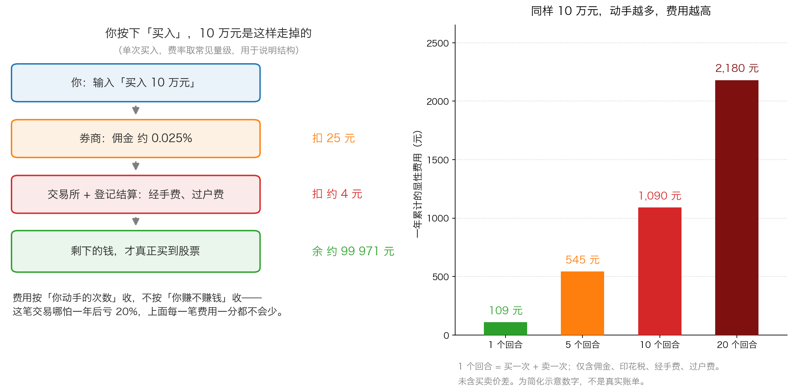
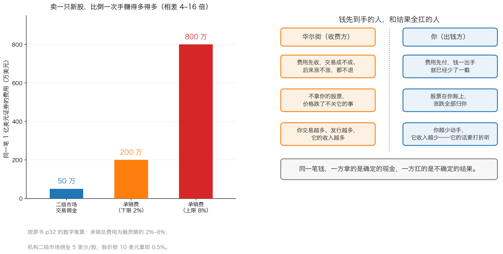

# 第 0 章：华尔街靠什么赚钱

> 本章你将：
> - 用三分钟搞清楚"华尔街"在 1980 年代到底指什么，以及它对应到今天中国的哪些机构
> - 说出华尔街的三块主要业务：交易业务（赚佣金）、投资银行业务（赚承销费）、商业银行业务（拿自己的钱下注），并知道每块大概从谁身上收
> - 看懂"预付费用"这四个字为什么是所有利益冲突的总开关
> - 亲手算出你自己一年在费用上花掉多少钱，以及它相当于你本金的百分之几
> - 知道医生、律师也先收钱，为什么券商跟他们不是一回事
> - **这对我的钱包意味着什么：** 费用是唯一一笔"不管涨跌都一定发生"的支出，所以你必须在按下买入键之前就把它算进去，而不是等年底看账单

---

上一周我们认识了市场先生——那位每天给你报价、情绪大起大落的合伙人。
我们学到的最重要的一件事是：**价格是情绪报出来的，价值是生意做出来的。**

但还有一个角色，我们一直没有正面看它：**那个站在你和市场之间、每天对你说话的人。**

你想买股票，得通过券商下单；你想买基金，得通过某个 App 或银行；你想了解一家公司，
会看到券商研究所发的报告；你想打新股，得听承销商的定价故事。这些人统称为"中介"。
他们不是市场先生，他们不会今天狂喜明天绝望。他们的情绪非常稳定，
因为他们的收入跟你赚不赚钱**基本无关**。

这一章，我们就把他们的收入结构摊开。看清楚了，你以后听他们说话时，
自然就知道该在哪个字上打个问号。

---

## 0.1 先花三分钟，把 1980 年代的华尔街搞清楚

原书是 1991 年写的，书里说的"华尔街"是**美国纽约曼哈顿岛南端那条街**，
那里聚集了全美国最大的证券公司。你可以把它理解成"美国的金融业中心"，
就像我们说"中关村"的时候指的不只是一条街，而是整个科技产业。

书里反复提到的那个年代——**1980 年代的美国**——有三件事你必须先知道：

**第一，那是一次大牛市。** 从 1982 年到 1987 年，美国股市几乎一路向上，
人人都在谈股票。1987 年 10 月 19 日，道琼斯指数一天跌掉 22.6%，
史称"黑色星期一"。这一天之后，市场规则被改了一轮，书里 p38 讲的"熔断机制"就是那时候开始讨论的。

**第二，那是一次"借钱买公司"的狂潮。** 有一批人发现，
可以**借钱把一家上市公司整个买下来，再用公司自己的现金流去还债**——
这个动作叫**杠杆收购**。借钱要发债券，发债券要付高额费用给华尔街。
这是华尔街那几年最赚钱的业务之一。

**第三，也是最重要的：那几年华尔街的钱多到离谱。** 原书 p36 说得很直白：

> "华尔街给出的报酬太丰厚了，一个人甚至只要在华尔街干上几年就可以确保自己的一生衣食无忧。"（p36）

在这样一个人人都能发财的环境里，一个人很难把眼光放在长期。这就是第二章整章要讲的事。

> 🇨🇳 **落到 A 股/港股：** 今天的对应物很清楚。
> "华尔街"对应的是**券商（证券公司）、公募基金公司、银行和第三方销售平台、私募、投顾机构**。
> 1980 年代美国的那波狂潮，对应的是 A 股 2007 年、2015 年、2020 年那几轮"人人谈股票"的时期。
> 名字换了，地点换了，激励结构一模一样——这才是本章真正要讲的东西。

---

## 0.2 华尔街的三块生意

原书 p30 一上来就把华尔街的生意分成三块。我们一块一块看，每块都先打个比方。

**第一块：交易业务（当"中间人"）。**

你想买 100 股某公司的股票，可你并不认识想卖这 100 股的人。
于是券商站出来说："我帮你找。"它把买家和卖家凑到一起，成交了，收你一笔钱。
这笔钱叫**佣金**。

> 💡 **换个说法：** 佣金就像**房产中介费**。你不认识卖家，中介帮你撮合，
> 房子成交了，中介按成交价抽一笔。你房子买贵了还是买便宜了，中介费一分不少。

**第二块：投资银行业务（当"婚庆公司"）。**

一家公司想上市融资，或者想收购另一家公司，这些事普通公司自己不会做。
券商的**投资银行部门**（业内简称"投行"）会帮它设计方案、找买家、把新股票卖出去。
公司要发行新股票，券商帮它卖——这个动作叫**承销**，券商收的钱叫**承销费**。

> 💡 **换个说法：** 承销就像**出版社帮你出书**。书是你的，卖书收的钱归你，
> 但出版社要从书款里抽成。至于这本书后来读者满不满意，出版社的抽成不会退。

> ⚠️ **易踩坑：** "投资银行"这四个字里虽然有"银行"，但它**不办存贷款**，
> 跟你在街边看到的"中国工商银行"完全不是一回事。
> 中国的券商（比如中信证券、华泰证券）里都有投行部门，做的是同样的事。

**第三块：商业银行业务（用自己的钱下注）。**

书里说的"商业银行业务"这个名字容易误导人。它指的是：
**证券公司不再只当中间人，而是拿自己的钱，直接买入整家公司或者公司的子公司。**
业内今天的叫法是**自营**或**本金交易**。

> 💡 **换个说法：** 前两块生意里，券商是"开赌场抽水的"；
> 这一块生意里，券商直接**坐上牌桌当你的对手**。
> 原书 p31 描述得很到位："如今，当电话铃响起，听筒中传来你的经纪人的声音时，
> 你甚至不知道他能做什么，或者代表了谁的立场。"

三块生意合起来看，你会发现一件事：**这三块收入的共同点是"按动作收费"，而不是"按结果收费"。**
你成交一笔，它收一笔佣金；公司发行一次，它收一次承销费；你做一次交易，它赚一次差价。
**你动不动手，决定它赚不赚钱；你赚不赚钱，基本不影响它赚不赚钱。**

这就是下一节要讲的那个总开关。

---

## 0.3 预付费用：所有利益冲突的总开关

原书 p30 的小标题叫"**预付费用和佣金：华尔街的主要利益冲突**"。这句话是整章的钥匙。

什么是**预付费用**？就是**在结果出来之前就付掉的钱**。

你买一只基金，申购费在你买入的那一刻就扣掉了。
基金后来涨还是跌，这笔钱不会退。
你通过经纪人做一笔交易，佣金在成交那一刻就结算了。
这笔股票后来涨十倍还是跌九成，佣金一分不退。
一家公司发行股票，承销费在发行完成时就付给券商了。
这家公司的股票三年后跌到零，承销费也不会吐出来。

> 📌 **划重点：** 医生、律师、理发师也都是先收钱、不管结果。
> 但**预付费用 + 按动作计价**这两个特点叠加在一起，就会产生一个非常具体的后果：
> **收钱的人会系统性地偏好"你多动手"，而不是"你多赚钱"。**

这不是一句道德指控，而是一个算术结论。我们把它拆开看。

假设有一家券商，它有两个客户。

- **客户甲**：一年交易 1 次，每次 10 万元，全年佣金约 109 元（含卖出时的印花税）。
- **客户乙**：一年交易 20 次，每次 10 万元，全年费用约 2180 元。

对券商来说，客户乙的贡献是客户甲的 20 倍。**可客户乙赚钱的概率更低，不是更高。**
因为频繁交易的人要不断做对两次判断（什么时候卖、什么时候再买回来），
还要每次都被费用咬掉一口。

> 💡 **换个说法：** 这就像健身房卖年卡。健身房最赚钱的客户，
> 不是天天去练出好身材的人，而是**办了卡、来两次、就再也不来但一直续费**的人。
> 健身房不恨你练得好，但它的商业模式不靠这个。

原书 p31 还提到一个更尖锐的词：**挤油交易**。
指的是经纪人为了多赚佣金，替客户账户做**过度频繁的买卖**——
不是为了客户好，而是为了多刷几笔手续费。
今天 A 股把这个词叫"**诱导交易**"或"**过度交易**"，监管对它有明确的限制。

---

## 0.4 为什么"卖新股"比"倒一次手"赚钱得多

这是原书 p32 里最值钱的一段数字。我们照着算一遍。

**同一笔金额的证券，如果不是在二级市场倒手，而是作为新股票卖出去，费用差别有多大？**

原书 p32 给了两个数字：

- 承销一只股票，华尔街从整个承销中拿到的总费用是**融资总额的 2% 到 8%**（p32）；
- 而在**二级市场**（投资者之间互相买卖已经发行的股票）上，
  大型机构付的佣金常常只有**每股 5 美分**，最低甚至只付**每股 2 美分**（p32）。

我们统一按"1 亿美元的证券、股价 10 美元"来算：

- 二级市场：每股佣金 5 美分（0.05 美元），即 0.05 美元 ÷ 10 美元 = **0.5%**，1 亿美元的 0.5% 就是 **50 万美元**。
- 承销下限：1 亿美元乘以 2% = **200 万美元**。
- 承销上限：1 亿美元乘以 8% = **800 万美元**。

**同样的证券、同样的金额，承销费是交易佣金的 4 倍到 16 倍。**

还有一笔账更值得注意。原书 p32 说，在承销一只 10 美元的股票时，
**经纪人自己可以拿到总佣金的 15% 到 30%**。
换句话说，经纪人推销一只新股票，赚的钱是他在二级市场促成同样规模交易的好几倍。

> ⚠️ **易踩坑：** 这里的关键推论不是"经纪人很贪"，而是：
> **当一个人向你推荐一只新股票时，他赚的钱比他帮你买卖老股票要多好几倍。**
> 这个动机差异是结构性的，跟这个人人品好坏无关。
> 你能做的不是要求他变好人，而是知道**"新"这个字本身要打折**。

原书 p33 举了一个特别直白的例子：**封闭式基金**。

先解释这两个词，这是本节最重要的术语。

- **开放式基金**：你随时可以按**净值**向基金公司买或卖。净值就是"这只基金的全部资产减掉负债，再除以总份额"，也就是每一份值多少钱。
- **封闭式基金**：发行的时候收一笔钱、份额就固定了；之后你只能在交易所里跟别的投资者买卖，**不能**按净值卖回给基金公司。

原书 p33 说，封闭式基金通常按每份 10 美元发行，**承销商拿走 8% 的佣金，
只剩下 9.2 美元可以拿去投资**。

我们把这个数字算到底——这是本章 🧮 算一算的内容，先在这里给结论：
**你付出的 10 美元，从第一天起就只有 9.2 美元在为你工作。**
那 0.8 美元，在你还没开始亏、也没开始赚的时候，就已经变成了别人的收入。

原书 p35 把这个机制总结得非常冷：

> "他们只是准备着提供实际上不受约束的供应量，因为唯一真正的约束就是买家的易骗性。"（p35）

（这句话里的"他们"指华尔街公司，"供应量"指新基金的数量。）

---

## 0.5 医生也先收钱，为什么券商跟他们不是一回事

读到这里你可能会想：医生不也是先挂号交钱，看不看得好不管吗？为什么没人说医生有利益冲突？

这个疑问非常值得认真回答，因为答案就在"**利益的指向**"上。

| | 医生 | 理发师 | 券商 / 基金公司 |
|---|---|---|---|
| **谁付钱** | 病人 | 顾客 | 投资者 |
| **钱什么时候付** | 看病前 | 理发前 | 交易/申购那一刻 |
| **想让你多做什么** | 希望你健康（但不影响他这次收入） | 希望你常来 | **希望你多交易、多申购、多持有他的产品** |
| **他的收入和你的利益是否同向** | 基本无关 | 基本无关 | **在"多动手"这件事上，方向相反** |

关键差别在**第三行**。医生让你多来，你会生病，他自己也不想要这个结果；
但券商让你多交易，它**只赚不赔**——你多交易一次，它多收一笔佣金，
多出来的这笔钱不会因为你亏了而变少。

> 📌 **划重点：** 评价一个中介，不要问"他人好不好"，要问三个问题：
> **① 他的钱是谁付的？② 他什么时候拿到钱？③ 他希望你多做什么动作？**
> 这三个问题问完，绝大多数"推荐"的含金量你就心里有数了。

还有一个更微妙的点，原书 p36 讲得很刻薄：

> "许多华尔街的从业人员，尤其是股票经纪人已经开始相信客户很自然地会在几年之后离开自己，
> 实际上他们是在通过指责客户来为自己注重短期利益的定位找借口。"（p36）

这句话的意思是：当一个经纪人心里想"客户反正过几年就走了"，
他就会倾向于在这几年里把佣金赚到最满——**而这个想法本身，会让客户真的走掉。**
原书把这叫"**让客户流动成为自证预言**"。

我们本周第 2 章还会再见到"自证预言"这个词。它的意思是：
**因为大家都相信某件事会发生，他们的行为反而让这件事真的发生了。**

---

## 0.6 落到 A 股/港股：今天谁在收你的钱

现在把上面所有机制翻译成今天的中文语境。你在 A 股或港股买一次股票，钱大概会流向这几个地方：

| 收费方 | 收什么 | 什么时候收 | 常见量级（约数，会变） |
|---|---|---|---|
| **券商** | 佣金 | 买入和卖出各收一次 | 成交金额的万分之二到万分之三；很多券商有"单笔最低 5 元" |
| **国家** | 印花税 | **只在卖出时**收一次 | 成交金额的 0.05% |
| **交易所** | 经手费 | 买卖各收一次 | 成交金额的万分之零点几 |
| **中国结算** | 过户费 | 买卖各收一次 | 成交金额的十万分之一 |
| **证监会** | 证管费 | 买卖各收一次 | 成交金额的十万分之二 |

港股的结构类似，但项目更多一些：印花税、交易征费、交易费、结算费、券商的佣金，
还有一项和 A 股不同的"**每手**"规则——港股买卖也按"手"为单位，
但每只股票一手多少股由上市公司自己定，从 100 股到 2000 股都有（A 股主板则统一是 100 股一手）。

> ⚠️ **易踩坑：** 上表里的费率是**会变的**，国家调过好几次。
> 请把这张表理解成"结构图"，具体数字以你在券商 App 里看到的费率表和官方公告为准。
> 本书刻意不给你精确到小数点的"最新数字"，因为那种数字三个月就可能过期，
> 而你真正需要记住的是**结构**：谁在收、按什么收、什么时候收。

再看基金这一侧。你买一只基金，钱会流向：

| 收费方 | 收什么 | 什么时候收 |
|---|---|---|
| **销售渠道**（App、银行、券商） | 申购费；还有从基金公司管理费里分成的"客户维护费" | 买入时收申购费；客户维护费按年从管理费里划 |
| **基金公司** | 管理费 | **每年**按你持有的金额收，赚了收，亏了也收 |
| **托管银行** | 托管费 | 每年收 |
| **销售渠道** | 赎回费 | 卖出时收，持有时间越短通常收得越多 |

看到区别了吗？**股票的费用主要在"动作"上，基金的费用主要在"时间"上。**
你什么都不做、只是持有一只基金，管理费和托管费也每天在扣，
只是它不显示在你的账单上，而是直接从基金净值里减掉——所以你**看不见**。

> 💡 **换个说法：** 股票的费用像打车，你不动它就不跳表。
> 基金的费用像手机套餐月租，你一天不打电话也照样扣。

---

## 0.7 那怎么办：三条能立刻执行的纪律

看清了结构，剩下的就是给自己定规矩。这一章给三条，都很具体。

**第一条：把"费用"当成一笔确定的亏损来记账。**

绝大多数人算收益的时候用的是"毛收益"——股票涨了 6%，就以为自己赚了 6%。
但真实到手的钱要先扣掉费用。第 4 章我们会算，同样 8% 的毛收益，
每年 0.2% 和 1.4% 的费用，30 年后的差距能到二十几万元。

**第二条：把"动手次数"当成一个需要控制的指标，而不是能力的证明。**

原书 p31 说得很清楚：经纪人从承销一只新证券中赚的钱，
是二级市场中规模相当的交易中所获佣金的好几倍。
这意味着**每一次"你该动一动"的建议，背后都站着一个收钱的人**。
这不代表建议一定是错的，只代表你需要一个独立的理由才动手。

**第三条：永远分清"谁在说话"。**

拿到任何一条信息，先在心里做个标记：

- 这话是**卖东西的人**说的（券商研报、渠道推荐、财经主播的"金股"）？
- 还是**买东西的人**说的（基金经理的季报、你自己的研究笔记）？
- 还是**公司自己**说的（公告、投资者关系活动记录表）？

三类人的可信度不一样，**但都不是零、也都不是 100%**。
第 1 章我们就专门讲第一类：为什么他们几乎永远在说"涨"。

---

## ✍️ 想一想

1. **医生、律师和理发师也都是"先收钱、不管结果"，为什么我们不太担心他们？券商跟他们最关键的区别到底在哪一条上？**
2. **假设你是一家券商的老板，你给经纪人发工资。你会怎么设计提成制度？如果你真心希望客户长期赚钱，这个制度该怎么改？改了之后，你的公司还能活得下去吗？**
3. **有人说："券商研报是免费的，不看白不看。"请用本章的框架反驳这句话——如果研报真的免费，那它靠什么活下来？**

> 💡 **参考思路：**
>
> **1.** 区别不在"先收钱"，而在**"希望你多做什么动作"**。医生的收入和你的就诊次数有关，
> 但一个负责任的医生不会希望你多生病；而且医术好坏会通过口碑长期影响他的收入。
> 券商的核心收入直接绑定"你的交易次数"和"你买的产品的规模"，
> 而这两件事**增加了，你赚钱的概率反而下降**——这就是方向相反的地方。
> 更准确地说：医生和患者的利益在"你健康"这件事上是同向的；
> 而券商和客户在"你少动手"这件事上才是同向的，可它的收入恰恰来自你多动手。
>
> **2.** 如果按"客户资产增值"提成，短期收入会变得很不稳定，
> 而且客户赚钱的年份可能连一笔交易都没做，公司收不到钱，养不起人。
> 现实中的解法通常是**把两块收入分开**：交易和承销按动作收费（这块无法避免），
> 但把研究和建议这块与交易脱钩，比如让买方（基金）自己出钱买研究，
> 也就是所谓"研究付费"。这不是本章要解决的问题，但你要知道：
> **这个矛盾是结构性的，不可能靠"要求从业者更有良心"来解决。**
>
> **3.** 研报不是免费的，只是**付钱的人不是你**。券商研究所的开支，
> 最终来自经纪业务佣金和投行业务收入。而这两块收入的高低，
> 取决于市场活跃度和你交易的频率。所以研报的真实客户，
> 是**需要经纪服务和投行服务的机构客户**，散户只是顺带被服务的对象。
> "免费"意味着**你不是客户，你是产品的一部分**——这句话听起来刺耳，
> 但它能让你在读研报时保持一个恰当的距离感。

---

## 🧮 算一算

> **情境：** 小王有 10 万元，打算在未来一年里自己买卖 A 股。
> 他有两种做法：
>
> - **做法 A（少动手）**：年初买入，全年不动，年底卖掉落袋。也就是 1 个回合。
> - **做法 B（常动手）**：同样的 10 万元，全年买卖了 12 个回合。
>
> 为了便于计算，我们用一组**简化示意数字**（不是真实账单）：
> 每次买卖 10 万元，一个完整回合（一买一卖）的显性费用约 **109 元**。
> 一年后小王的股票**涨了 6%**。

**第 1 问：做法 A 全年花掉多少费用？**

- 第 1 步：做法 A 只有 1 个回合。
- 第 2 步：1 个回合的费用就是 **109 元**。
- 第 3 步：这就是全年的全部显性费用，因为中间一次都没动。

**第 2 问：做法 B 全年花掉多少费用？**

- 第 1 步：做法 B 有 12 个回合，每个回合约 109 元。
- 第 2 步：109 元 乘 12 = **1308 元**。
- 第 3 步：注意，这里只算了显性费用，没有算每次买卖之间的价格差（买卖价差）。

**第 3 问：两种做法的费用差是多少？相当于本金的百分之几？**

- 第 1 步：费用差 = 1308 元 - 109 元 = **1199 元**。
- 第 2 步：占本金的比例 = 1199 元 ÷ 100000 元 = **1.199%**，约等于 1.2%。
- 第 3 步：这个 1.2% 是**纯粹的损耗**，跟股票涨跌无关。

**第 4 问：小王这一年毛赚了多少钱？做法 B 的费用吃掉了其中多少？**

- 第 1 步：10 万元涨 6% = 100000 元 乘 6% = **6000 元**。
- 第 2 步：做法 A 到手 = 6000 元 - 109 元 = **5891 元**，实际收益率 5.89%。
- 第 3 步：做法 B 到手 = 6000 元 - 1308 元 = **4692 元**，实际收益率 4.69%。
- 第 4 步：做法 B 的费用（1308 元）占毛收益（6000 元）的比例 =
  1308 ÷ 6000 = **21.8%**。
- 第 5 步：也就是说，**股票涨了 6%，但频繁交易的人只拿到 4.69%，
  有超过五分之一的收益被费用吃掉了。**

**第 5 问（重点）：如果这一年股票不是涨 6%，而是跌了 6% 呢？**

- 第 1 步：跌 6% 意味着亏 100000 元 乘 6% = **6000 元**。
- 第 2 步：做法 A 总损失 = 6000 元 + 109 元 = **6109 元**，亏损率 6.11%。
- 第 3 步：做法 B 总损失 = 6000 元 + 1308 元 = **7308 元**，亏损率 7.31%。
- 第 4 步：**关键结论**——涨的时候，费用是从收益里"分走"一块；
  跌的时候，费用是**在亏损之外额外加上的**。费用不会因为你亏钱而减免。

**第 6 问：这笔费用能不能靠"多赚一点"补回来？**

- 第 1 步：做法 B 比做法 A 多付了 1199 元。
- 第 2 步：要让这 1199 元回本，10 万元需要多涨 1199 ÷ 100000 = **1.2%**。
- 第 3 步：听起来不多，但请注意：**这 1.2% 是每年都要重新赚一次的。**
  一个人如果能稳定地每年多赚 1.2%，他已经是相当不错的投资者了。
  换句话说，**你是在用一个很难的能力，去弥补一个完全不必发生的成本。**

> 📌 **划重点：** 这道题最该记住的不是具体数字，而是第 5 问的结论：
> **费用是唯一一笔"不管涨跌都一定发生"的支出。** 你控制不了股价，但你完全控制得了自己动手几次。

---

## ✅ 小测验

**1. 原书说华尔街的三块主要业务是交易业务、投资银行业务和商业银行业务。这里的"商业银行业务"指的是什么？**
A. 吸收居民存款、发放贷款
B. 拿公司自己的钱直接买入整家公司或企业的子公司，也就是"自营"
C. 帮客户保管股票和资金
D. 帮公司办理员工工资代发

**2. 原书 p32 给出的数字是：承销一只股票的总费用为融资额的 2%~8%，而机构在二级市场的佣金约每股 5 美分。用"1 亿美元、股价 10 美元"来算，承销费最高是二级市场交易佣金的多少倍？**
A. 约 1.6 倍
B. 约 4 倍
C. 约 16 倍
D. 约 80 倍

**3. 原书 p33 说，封闭式基金按每份 10 美元发行，承销商拿走 8% 的佣金，只剩 9.2 美元可以投资。这意味着什么？**
A. 你买的基金净值会在几个月内自动涨回 10 美元
B. 你付出的 10 美元从第一天起就只有 9.2 美元在为你工作，那 0.8 美元已经变成了别人的收入
C. 这 8% 的佣金会在你卖出时退还给你
D. 封闭式基金比开放式基金更安全，因为它不能赎回

> **答案与解析**
>
> **1. B。** 原书 p30 说得很清楚：作为商业银行，"它们对自己的资金负责，同时在进行投资银行业务的交易时将这些资金作为本金"——也就是拿自己的钱去投资。
> A 是中国的"商业银行"（工商银行、建设银行那种），跟书里这个词完全不是一回事，这是最容易混的一处。
> C 是托管业务，由托管银行做，不是华尔街这三块之一。
> D 是普通的对公业务，跟本章讲的利益冲突无关。
>
> **2. C。** 二级市场：每股 5 美分，10 美元的股票就是 0.5%，1 亿美元乘 0.5% 等于 50 万美元。
> 承销上限：1 亿美元乘 8% 等于 800 万美元。800 万除以 50 万等于 16 倍。
> A 是把 8% 和 5% 直接比了，忘了 5 美分要除以 10 美元的股价。
> B 算的是承销下限（2% 对应 4 倍），不是题目问的"最高"。
> D 是把 8% 除以 0.1%（把 5 美分误当成 1 美分）算出来的，单位弄错了。
>
> **3. B。** 原书 p33 的算法是 10 美元减掉 8% 的佣金，剩下 9.2 美元去投资。
> A 错在：净值不会"自动"涨回来，它要靠投资的资产真的涨上去。
> C 错在：预付费用的定义就是"不管结果都不退"，这一点原书 p31 反复强调。
> D 错在：不能赎回恰恰是封闭式基金的**缺点**——买贵了也没法按净值卖回给基金公司，
> 只能到交易所里找下一个买家，而那时候的价格可能远低于净值（原书 p34–p35 讲的国家基金就是这个故事）。

---

## 📖 回到原书

- 对应原书 **第二章**，`raw/安全边际-中文版/page_030.md` ~ `page_036.md`（原书 p30–p36）。
- **建议精读：**
  - p30–p31（第二章开头 + "预付费用和佣金"）：三块业务的定义和利益冲突的总纲，本书后面所有讨论都从这里长出来。
  - p32（"华尔街对承销业务的喜欢甚于二级市场交易业务"）：2%~8%、每股 5 美分、经纪人拿 15%~30% 这三个数字，是理解"新股为什么总有人拼命推销"的关键。
- **可以略读：**
  - p34–p35（1989–1990 年的封闭式国家基金热潮）：这是美国当时的时代背景，故事本身（西班牙基金从净值的 92% 涨到 260% 再跌回来）很有画面感，但机制你在第 2 章还会再遇到一次，第一遍读不懂细节不影响。
  - p35–p36（华尔街的眼前利益）：知道"从业人员自己也没有安全感，所以更看重短期收入"这一点就够了。
- **原书金句（逐字引用）：**
  > "华尔街上的从业人员主要根据他们做什么事情而获得报酬，而不是根据他们做事的效率。"（p30）
  >
  > "投资者应当警惕那些正与自己打交道的人的动机；预付费用产生了偏好频繁交易的倾向，而不是倾向于进行能够获利的交易。"（p32）
  >
  > "他们只是准备着提供实际上不受约束的供应量，因为唯一真正的约束就是买家的易骗性。"（p35）

下一章，我们专门看华尔街那种"永远看涨"的倾向：
为什么券商研报里几乎只有"买入"？为什么连监管规则都被设计成"拦跌不拦涨"？
以及，作为一个普通人，你该怎么给自己听到的每一句话标上折扣。
