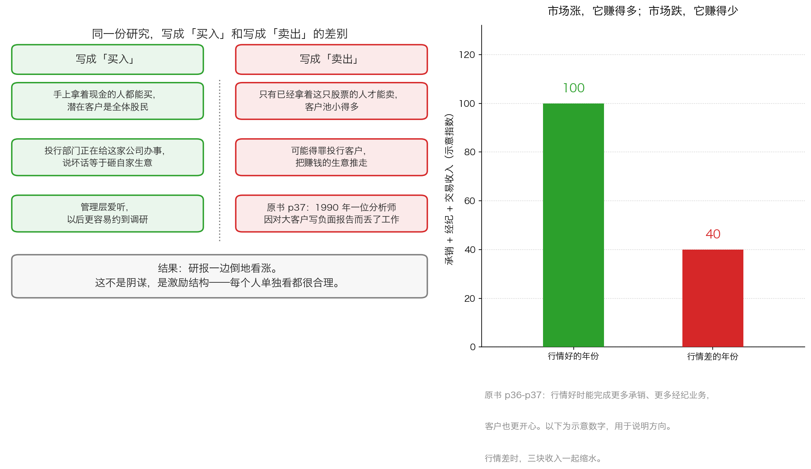

# 第 1 章：永远看涨的机器

> 本章你将：
> - 知道为什么券商研报里几乎只有"买入"和"增持"，"卖出"少到几乎可以忽略
> - 看懂"永远看涨"不是某个人心术不正，而是三股各自合理的力量叠在一起的结果
> - 认识做空和熔断这两个机制，并知道原书说"规则本身也偏向看涨"是什么意思
> - 明白为什么"价格被高估"能维持很久，而"被低估"却容易被修正
> - 学会给自己每天看的信息源列一张"打折表"，把每一句话折算成它真实的分量
> - **这对我的钱包意味着什么：** 你收到的大部分"买入"建议，说的不是"这家公司好"，而是"说这话的人希望你买"。听懂这个区别，你就不会因为一条消息而动手

---

上一章我们看清了收费结构：**华尔街赚的是"你动手"的钱，不是你赚钱的钱。**
那接下来自然会有第二个问题：既然它希望你动手，它会怎么做？

答案很朴素：**它会一直告诉你"现在正是好时候"。**

这一章，我们把这种"永远看涨"的倾向拆成零件，一个零件一个零件地看。
看完你会发现，它根本不需要谁去策划，因为每一个环节单看都是合理的。

---

## 1.1 先给结论：这不是阴谋，是一个算术题

原书 p36 有一句非常直接的话：

> "投资者永远不要忘记，华尔街有着强烈的看涨倾向。而这种倾向与其自身利益相一致。"（p36）

请注意后半句：**"与其自身利益相一致"**。
卡拉曼没有说华尔街在骗人，他说的是**结构**。

这种倾向最明显的表现，就是**卖方研报**。

先把这个词解释清楚。

- **卖方（sell-side）**：指卖研究报告和交易服务的机构，也就是券商的**研究所**。它们不拿自己的钱投资，只提供服务。
- **买方（buy-side）**：指拿着钱真正去投资的机构——公募基金、保险资金、私募，也包括你自己。

> 💡 **换个说法：** 卖方研报像**免费的营养讲座**。
> 讲座确实免费，但讲师所在的机构卖的是保健品。
> 讲座内容未必是假的，但你得知道**谁在买单**。

一份卖方研报通常会给一只股票一个**评级**——也就是"我建议你买还是卖"的档位。
A 股和港股常见的档位从高到低大致是：**买入、增持、中性、减持、卖出**。
港股市场上常用英文：Buy、Accumulate、Hold、Reduce、Sell。

如果你去翻一翻，会发现一个非常稳定的现象：
**"买入"和"增持"占了绝大多数，"卖出"少到几乎可以忽略。**
有些年份，整个市场里你都找不出几份明确写着"卖出"的报告。

> 📌 **划重点：** 这不是某一家券商的问题，而是**全行业一致的现象**。
> 当一个现象在整个行业里同时出现，它就不可能是"人品问题"，
> 只能是**激励结构问题**。这一章就是要找出这个结构。

---

## 1.2 一句话的收益差：为什么"买入"的生意大得多

原书 p37 给了一个特别漂亮的推理，我们把它拆成三步。

**第一步：谁能买？谁只能卖？**

> "任何持有现金的人都可能买入一只股票或者一种债券，而只有那些已经拥有了股票或者债券的人才有可能选择卖出。"（p37）

这句话的意思是：**潜在买家是"所有手上拿着钱的人"，潜在卖家只是"已经持有这只股票的人"。**
前者的数量远远大于后者。

**第二步：研报的作用是促成交易。**

一份研报写得再好，它的商业价值也要靠**它能让多少人去交易**来实现。
写"买入"，能撬动的是那一大群拿现金的人；
写"卖出"，能撬动的只有已经持仓的那一小群人，而且这群人卖掉之后，这只股票的生意就做完了。

**第三步：所以写"买入"能带来更多的经纪业务。**

原书 p37 的结论：

> "换句话说，一份乐观的研究报告较之一份悲观的报告能带来更多的经纪业务。"（p37）

**这不是一个道德判断，是一道算术题。** 我们现在把这道题写成三个具体的收益项：

| | 写"买入" | 写"卖出" |
|---|---|---|
| **能撬动的客户** | 所有手持现金的人 | 只限已经持有这只股票的人 |
| **能促成的生意** | 买入交易 + 后续的持有服务 | 一次卖出交易，之后这只股票跟你无关了 |
| **对投行部门的影响** | 与正在服务的客户关系更顺 | 可能得罪正在服务的客户 |
| **对个人的影响** | 管理层爱听，以后更容易约到调研 | 可能影响职业生涯（见下一节） |

四个格子全是"买入"占优。**四比零，结果自然是一边倒。**

---

## 1.3 三条让分析师闭嘴的力量

原书 p37 举了一个真实发生过的例子，这是全章最刺眼的一段：

> "1990 年 Janney Montgomery 公司一位名为马文·洛夫曼的分析师，因对公司大客户唐纳德·特朗普所拥有的亚特兰大城市酒店&赌场写了一篇负面的研究而丢掉了自己的工作。"（p37）

一位分析师，因为**写了一份说真话的报告**，失去了工作。
我们把这背后的力量拆成三条：

**第一条：投行关系。**

券商有两个部门：研究所（写报告）和投行部（帮公司融资、并购）。
如果投行部正在给 A 公司做一笔大生意，研究所这时候发一份"A 公司有问题"的报告，
这笔生意的中介费可能就飞了。**同一个公司内部，两个部门的利益是直接冲突的。**

**第二条：管理层关系。**

写报告需要信息。信息从哪来？很大一部分来自跟公司管理层的交流、实地调研、电话会议。
如果你刚写了一份负面报告，下一次你想约管理层的调研，对方很可能"时间不方便"。
**你的信息源会被切断。**

**第三条：个人的职业风险。**

这一点最容易被忽略。分析师也是打工人。
原书 p36 说，华尔街上的很多人"对自己最终能否取得成功感到怀疑"，
"不愿因那些可能永远也不会实现的长期收入而放弃短期内的报酬"（p36）。
在这样的环境里，写一份得罪人的报告，风险由**个人**承担，收益由**公司**获得。
理性的人自然选择不写。

> ⚠️ **易踩坑：** 很多人以为"研报不写卖出，是因为分析师看不出问题"。
> 这个理解是错的。真正的机制是**看出来了也不写**。
> 所以"没有负面报告"这件事，**不能**当成"这家公司没问题"的证据。
> 它是一个信息**缺失**，不是信息**确认**。

原书 p37 还补了一句更本质的话：

> "华尔街上的从业人员很容易就能乐观起来。一些乐观的假设几乎会让任何一种股票或者债券成为一项合理的投资。
> 问题是因太过关注于上涨，人们很容易忽视了风险。"（p37）

**注意最后半句**：乐观假设的危害不在于它一定错，而在于它让人**忘了看风险**。

---

## 1.4 不止华尔街：投资者、企业、监管者也都喜欢涨

这一节的标题就是原书 p37 小标题的延伸："其他人同华尔街有着一样的看涨倾向"。

原书列了四类人，我们一个一个看。

**第一类：投资者自己。**

> "投资者更喜欢上涨的证券价格而不是下跌的价格，喜欢获利而非亏损，这是人之常情。
> 思考上升潜力较之思考下跌风险更让人感到快乐。"（p37）

这句话说的是**你自己**。你不需要任何人来教你热爱上涨——
涨停板带来的快乐是生理性的。**所以"看涨"这件事，你本身就是共谋。**

**第二类：企业（上市公司）。**

原书 p37–p38 说，股价上涨被看作是对管理层投了信任票，
也是管理层个人持有的股票和期权价值上涨的源泉，
还是公司融资能力（发行新股圈钱）的源泉。**公司当然是希望股价涨的。**

**第三类：政府监管人员。**

> "即使是监管证券市场的政府监管人员也对市场持有看涨的倾向。上涨的市场会伴随着投资者信心的增加，
> 这也是监管人员希望维持的。根据监管层的观点，市场的下跌应当有序，且不能引发恐慌。
> （市场的无序上涨显然不会引起关注）"（p38）

括号里的那半句是整章最锋利的一句：
**下跌要"有序"，上涨却不需要"有序"。**

**第四类：规则本身。**

原书 p38–p39 说，监管制定的具体规则也加剧了看涨倾向。这一条我们单独用两节讲。

---

## 1.5 做空：唯一能唱反调的人，被绑住了手脚

先解释**做空**这个词。

> 💡 **换个说法：** 做空就像你**先向邻居借了一箱苹果**，立刻以每斤 5 元卖掉，
> 拿到 500 元。过一阵苹果跌到每斤 3 元，你花 300 元买回同样一箱还给他，
> 中间 200 元就是你赚的。如果苹果涨到每斤 8 元，你就得花 800 元买回来还，
> 亏 300 元——**而且理论上苹果可以涨到无限高，你的亏损没有上限。**

做空是市场上唯一能"靠说跌赚钱"的动作。**它是对高估价格的天然矫正力量。**

原书 p38 说，规则给做空加了两个限制：

> "首先，禁止包括所有共同基金在内的许多机构做空股票或者债券。……
> 第二，尽管对购买股票没有限制，但要求做空上市交易的股票时需要借入所希望的股票，
> 然后以高于上一交易价格的价格执行一份卖出订单。"（p38）

翻成大白话：

1. **很多大机构被明令禁止做空。**全美国所有的共同基金（也就是公募基金）都不能做空。
2. **做空要有股票可借，而且卖出价必须高于上一笔成交价。**第二条规则是防止"一路往下砸"。

原书 p38 的结论是：

> "做空的投资者数量不多，且受到很多限制，他们介入可能会修正过高的股价。"（p38）

**换句话说：市场上"喊涨"的力量是自由的、有组织的、被鼓励的；
"喊跌"的力量是被绑住手脚的、人数稀少的。价格当然更容易偏高。**

> 🇨🇳 **落到 A 股/港股：** 中国市场也给了做空几条很窄的路。
> A 股有**融资融券**里的"融券"（借股票卖出），以及配套的券源机制（如转融通，这类规则近年来反复调整，以最新规则为准），
> 但能借到的券源有限、成本不低；**股指期货**能做空指数，但有门槛和保证金要求。
> 港股相对宽松一些，可以做空指定名单上的股票，也有做空机构专门发"唱空报告"。
>
> ⚠️ 但这里有一个关键的对称提醒：**做空机构自己也是靠股价下跌赚钱的。**
> 它发的报告同样不是中立的。原书批评"卖方的看涨倾向"，
> 你也要用同一把尺子去量"空方的看跌倾向"。
> **判断一份报告，永远先看作者靠什么吃饭——不管是涨还是跌。**

---

## 1.6 熔断：只拦跌，不拦涨

先说概念。**熔断**是指市场跌得太快时，交易所强制暂停交易一段时间。
这个名字来自电路里的保险丝：电流过大，保险丝烧断，把电路切断，防止起火。

原书 p38–p39 引用了纽约证券交易所当时的规则：

> "如果道琼斯工业平均指数较前一交易日下跌250 点，交易将暂停1 小时。
> 如果继续交易之后再下跌150 点，将暂停交易2 小时。"（p38–p39）

然后接下来这一句是全章的爆点：

> "值得注意的是，对于股价的上涨则没有制定类似的熔断机制，不管涨幅有多大。"（p39）

**跌 250 点要停一小时；涨 2500 点，没人管。**
原书 p39 把这个叫"**熔断机制的不对称应用**"，
并且认为它"展示了市场监管者的看涨倾向，它本身可能鼓励了投资者购买并持有价格高估的证券"。

> 🇨🇳 **落到 A 股/港股：** 这里有一个非常重要的区别，你必须弄清楚，
> 否则你会把原书的结论直接套错。
>
> **A 股的日常涨跌幅限制是双向对称的。**
> 主板股票每天最多涨 10%、最多跌 10%；创业板和科创板是 20%；
> 被实施风险警示的股票（就是我们常说的"ST 股"）里，主板的那些是 5%（科创板和创业板的 ST 股仍是 20%）。
> **涨停和跌停同时存在，没有"只管跌不管涨"这回事。**
>
> 所以原书那句"规则偏向看涨"，**不能原样搬到 A 股**。
> A 股表现"看涨倾向"的地方不在涨跌停上，而在别处——
> 比如新股上市初期的热度、媒体对行情的叙事方式、卖方研报的评级分布，
> 以及下面这段历史。
>
> **一段值得记住的历史：** 2016 年 1 月，A 股曾经短暂引入过指数熔断机制：
> 沪深 300 指数跌到 5% 就暂停交易 15 分钟，跌到 7% 就提前收市。
> 结果它从 1 月 1 日开始实施，1 月 4 日和 1 月 7 日两次被触发，
> 1 月 7 日晚间就被宣布暂停实施。**从上线到暂停，只用了 4 个交易日。**
>
> 这个故事教给我们的不是"熔断不好"，而是：
> **一个规则听起来再有道理，也要看它在真实市场里会不会制造出新的恐慌。**
> 磁吸效应——大家知道快要熔断了，就抢着先卖——就是设计者没算到的东西。

---

## 1.7 为什么"高估"能维持很久，"低估"却容易被修正

这是本章最后一节，也是最实用的一节。

原书 p39 说：

> "修正高估的市场较修复低估的市场难度更大。"（p39）

为什么？因为两种情况下，**你能做的事情完全不对称**。

**情况一：你发现一只股票被低估了。**

你可以**一直买、越跌越买**。原书 p39 说得很清楚：

> "当遇到一只被低估的股票时，一名价值投资者可以购买越来越多的这只股票，
> 直至获得控股权，或者更好，直至以打折价格拥有整个企业。
> 如果对价值的评估是正确的，这名投资者将获得诱人的回报。"（p39）

**低估有一个自动修复的机制：买的人越多，价格就越往上涨，直到回到价值。**

**情况二：你发现一只股票被高估了。**

你只能做空。但做空（前面讲过）受限、有成本、亏损无上限。
而且——**你可能是对的，但你是早的。** 原书 p39 说：

> "此外，投资者、分析师或者管理层并不总能明确地认识到价格已经被高估。
> 因为证券价格反映了投资者对现实的认知，而并不一定反映现实本身，高估可能会维持很长一段时间。"（p39）

**"价格反映的是认知，不是现实"**——这句话请记住，它是整本书的底色。
一个价格可以因为"大家都觉得会涨"而一直涨，涨到所有人都不敢做空它。

> 📌 **划重点：** 便宜的东西，你可以一直买，买到它涨回来；
> 贵的东西，你只能等着它跌，而且你不知道要等多久。
> **这就是为什么"便宜"是投资者的机会，"贵"只是投机者的机会。**

---

## 1.8 落到 A 股/港股：今天谁在说"涨"

把上面所有机制翻译成今天的日常场景：

| 说话的人 | 靠什么吃饭 | 系统性的倾向 |
|---|---|---|
| **券商研究所** | 交易佣金分仓、投行关系、机构客户服务 | 偏"买入"和"增持"；"卖出"极少 |
| **券商经纪人 / 客户经理** | 你的交易佣金、代销产品的销售奖励 | 希望你多交易、多买新产品 |
| **基金公司** | 管理费（按规模收） | 希望规模越大越好；倾向持续营销、很少劝你赎回 |
| **销售平台 / 银行渠道** | 申购费、客户维护费（从管理费里分成） | 推荐分给它更多的产品 |
| **财经主播 / 大 V** | 流量、广告、卖课、可能还有私下荐股 | 越刺激的标题越好；"永远有机会"才有人看 |
| **上市公司** | 股价影响融资能力和管理层期权 | 希望你相信它的故事 |
| **做空机构** | 股价下跌 | 偏"唱空"，有时会夸大 |

**最后一行非常重要。** 你会发现这张表里**没有一行写着"靠你赚钱"**。
这不是因为世界很坏，而是因为"你赚钱"这件事太难收费了——
**它不能按动作计价，只能用结果计价，而按结果收费的生意很难做。**

> 💡 **换个说法：** 如果一个医生跟你说"治好了再付钱"，
> 你会觉得他很自信；但如果他每次都跟你说"这个疗程再加两万"，
> 你就该想想他的收入结构了。**金融业绝大多数收入，都是第二种模式。**

---

## 1.9 给自己列一张"打折表"

看完这一章，最实用的动作是：**给你每天看的信息源列一张打折表。**

做法很简单，拿一张纸，左边写"信息来源"，右边写"打几折"，理由只写一句。

一个可以参考的示范（这不是标准答案，你可以自己调）：

| 信息来源 | 我给它打的折扣 | 理由 |
|---|---|---|
| 券商研报的"买入"评级 | 打 5 折看结论，打 0 折看情绪 | 评级分布本身严重偏向买入 |
| 券商研报里的事实数据（营收、产能、订单） | 打 8 折 | 数据本身通常可信，但要自己核对原始公告 |
| 公司公告（年报、重大事项） | 看原文，不打折；但要看"没说"的部分 | 造假有法律后果，可信度最高 |
| 公司投资者关系活动记录 | 打 6 折 | 来问问题的多是潜在买家，问不出坏问题 |
| 财经主播的"机会提示" | 打 2 折 | 靠流量吃饭，"没机会"没人看 |
| 群里转发的"内部消息" | 打 0 折 | 无法追溯来源，且常常是给别人抬轿子 |
| 你自己写的买入理由 | 打 7 折 | 你也有情绪，而且你比谁都容易骗自己 |

**最后一行是关键。** 本章讲的所有机制，作用对象不是"别人"，是**你**。
你看多了"买入"，你会真的觉得现在是好时候——不管数据怎么说。

> 📌 **划重点：** 这一章真正要你带走的一句话是：
> **当你听到"买"的时候，先别急着判断对错，先问一句"说这话的人靠什么吃饭"。**
> 这个动作只花三秒钟，但它能过滤掉你遇到的绝大部分噪音。

---

## ✍️ 想一想

1. **原书说"任何持有现金的人都可能买入，而只有已经拥有股票的人才可能卖出"。请用这句推理，解释一下为什么"卖出"评级的报告在商业上不划算。**
2. **如果有一天监管规定："券商研究所不能从经纪业务和投行业务拿钱，只能由买方机构直接付费订阅研究。"你觉得研报里"卖出"评级的比例会上升还是下降？为什么？这个改革会有什么副作用？（这项制度仍在调整中，以最新监管规则为准）**
3. **香港的做空机构靠"股价下跌"吃饭，券商研究所靠"交易活跃"吃饭。这两种报告你都读。请分别说出：读前者时要防什么，读后者时要防什么？**

> 💡 **参考思路：**
>
> **1.** 一份研报要产生商业价值，得让足够多的人**去交易**。
> "买入"能撬动的是全体持币者，哪怕只有 1% 的人响应，人数也很可观；
> "卖出"只能撬动已经持仓的人，而这些人卖出之后，这只股票在券商这边的生意基本就结束了——
> 而且下一个人接手后，卖出需求要等很久才会再出现。
> 更麻烦的是，"卖出"报告还可能得罪投行客户和管理层。
> 一边是"客户多、生意长、关系顺"，一边是"客户少、生意短、关系僵"——
> 商业上根本不用比。**这就是为什么"卖出"评级的稀少不是道德问题，而是商业必然。**
>
> **2.** 会上升。因为付费方从"希望你多交易的人"变成了"需要准确判断的人"。
> 买方出钱订阅研究，买的是**判断的质量**，一份说"这家公司要出事"的报告对它是有价值的，
> 因为它能帮它避开亏损或者反手做空。
> 副作用至少有两个：一是研究变成"只服务大机构"，
> 小机构和个人投资者更难看到；二是买方也可能有自己的持仓偏向，
> 如果一家基金重仓某股票，它未必愿意看到一份唱空它的报告。
> **结论：没有任何一种付费方式能消灭倾向，只能改变倾向的方向。**
> 你要做的永远是问"谁付钱"。
>
> **3.** 读做空机构的报告，重点要防**夸大和利益驱动**：
> 它在发布报告之前可能已经建立了空头仓位，报告发布后股价下跌，它直接获利；
> 而且它不需要为报告的长期准确性负责。
> 所以读的时候要专门去找"它说得最狠的那几条，有没有原始证据"。
> 读券商研报，重点要防**系统性的乐观偏差**：
> 它的"买入"评级不代表它真的认为现在是最佳买点，
> 也不代表它会把所有风险讲透。你要专门去找"风险提示那一节写了什么"——
> 那一节往往是整份报告里信息量最大的部分。
> **两种报告都要读，但都不能只读一种。最好的做法是：找到原始公告，
> 自己把两边的说法对一遍。**
>
> **补充一句：** 如果一本书、一个主播、一个群里的人**只**给你看涨的信息，
> 那不是他在保护你，是他在保护自己的生意。

---

## 🧮 算一算

> **情境：** 小李看到一份券商研报给了某只股票"买入"评级，当天就用 5 万元买入。
> 买入价是 **10 元/股**，他买了 **5000 股**。
> 买完之后股价一路下跌，跌到 **8 元/股** 时小李慌了，全部卖出。
> 结果卖出之后，股价又慢慢涨回了 **10 元/股**。
>
> 我们用一组**简化示意数字**：佣金 0.025%，印花税 0.05%（卖出单向），
> 经手费 0.00341%，过户费 0.001%。

**第 1 问：小李买入时花了多少费用？**

- 第 1 步：佣金 = 50000 元 乘 0.025% = **12.5 元**。
- 第 2 步：经手费 = 50000 元 乘 0.00341% = **1.7 元**。
- 第 3 步：过户费 = 50000 元 乘 0.001% = **0.5 元**。
- 第 4 步：买入费用合计 = 12.5 + 1.7 + 0.5 = **14.7 元**，约 **15 元**。
- 第 5 步：注意，买入时不收印花税。

**第 2 问：跌到 8 元时卖出，费用是多少？**

- 第 1 步：此时市值 = 5000 股 乘 8 元 = **40000 元**。
- 第 2 步：佣金 = 40000 元 乘 0.025% = **10 元**。
- 第 3 步：印花税 = 40000 元 乘 0.05% = **20 元**（只在卖出时收）。
- 第 4 步：经手费 = 40000 元 乘 0.00341% = **1.4 元**；过户费 = 40000 元 乘 0.001% = **0.4 元**。
- 第 5 步：卖出费用合计 = 10 + 20 + 1.4 + 0.4 = **31.8 元**，约 **32 元**。
- 第 6 步：卖完之后小李账上有 40000 元 - 32 元 = **39968 元**。

**第 3 问：小李这一次的总损失是多少？**

- 第 1 步：付出的本金是 50000 元，另外还付了约 15 元买入费，实际投入 = **50015 元**；最后拿回 39968 元。
- 第 2 步：总损失 = 50015 - 39968 = **10047 元**。
- 第 3 步：亏损率 = 10047 ÷ 50015 = **20.09%**。

**第 4 问：如果小李当时没卖，一直拿到股价涨回 10 元呢？**

- 第 1 步：股价涨回 10 元，5000 股又值 **50000 元**。
- 第 2 步：这时候卖出的费用 = 佣金 12.5 元 + 印花税 25 元 + 经手费 1.7 元 + 过户费 0.5 元
  = **39.7 元**，约 **40 元**。
- 第 3 步：到手 50000 - 40 = **49960 元**；再把买入时的 15 元算进来，这一轮实际只亏 **55 元**（15 + 40），亏损率 = 55 ÷ 50015 = **0.11%**。
- 第 4 步：**也就是说，股价从 10 元跌到 8 元再涨回 10 元，
  一直拿着的人几乎没损失，中途被震出去的人亏了 20%。**

**第 5 问：这 10047 元的损失里，真正被费用吃掉的是多少？**

- 第 1 步：小李实际付出的费用 = 买入 15 元 + 卖出 32 元 = **47 元**。
- 第 2 步：47 元占总损失 10047 元的比例 = 47 ÷ 10047 = **0.47%**。
- 第 3 步：**剩下 99.5% 的损失，全部来自"在 8 元的时候卖出"这个决定本身。**

**第 6 问（重点）：如果小李想用这 39968 元在 10 元重新买回 5000 股，够吗？**

- 第 1 步：买回 5000 股需要 5000 乘 10 = **50000 元**，再加买入费用约 15 元 = **50015 元**。
- 第 2 步：他手上只有 39968 元。
- 第 3 步：差额 = 50015 - 39968 = **10047 元**。
- 第 4 步：这 10047 元就是他"被震出去"的真实代价——
  **同样的股票、同样的价格，他手里的股数变少了。**

> 📌 **划重点：** 这道题有两个结论，第二个比第一个重要得多。
>
> **第一，费用其实很小。** 47 元占总损失不到 0.5%。所以本章要防的**不是**那几十块手续费。
>
> **第二，真正吃掉你钱的，是被"永远看涨"的信息环境推着做出的多余动作。**
> 股价什么都没变（10 元进、10 元出），小李却亏了 20%。
> 券商在这个过程中只赚了 47 元——**它赚得不多，但你亏得很多。**
> 这就是"永远看涨的机器"真正的杀伤力：它不需要骗你很多钱，它只需要让你多动一次手。

---

## ✅ 小测验

**1. 原书 p37 用"谁可能买入、谁只能卖出"来解释研报的看涨倾向。这个推理的核心是什么？**
A. 分析师的专业水平不够，看不出公司的问题
B. 持有现金的人远多于已持有某只股票的人，所以一份乐观报告能带来更多经纪业务
C. 监管规定研报不得给出"卖出"评级
D. 上市公司的财务数据都是假的，所以分析师只能写正面内容

**2. 原书 p39 说"熔断机制的不对称应用展示了市场监管者的看涨倾向"。关于 A 股的实际情况，下面哪一种说法是对的？**
A. A 股也只有下跌方向的熔断，没有上涨方向的熔断
B. A 股主板的涨跌幅限制是双向对称的，每天最多涨 10% 也最多跌 10%，所以不能把原书这句话原样搬到 A 股
C. A 股没有涨跌幅限制，完全自由
D. A 股只在牛市中设涨跌幅限制

**3. 原书 p39 说"因为证券价格反映了投资者对现实的认知，而并不一定反映现实本身，高估可能会维持很长一段时间"。下面哪个说法最符合这句话的意思？**
A. 价格永远是对的，所以高估其实不存在
B. 价格反映的是大家的看法，看法可以长期偏离事实，所以"贵"可以一直贵下去
C. 只要公司业绩好，股价就一定会涨
D. 高估很快就会自动修正，所以不用担心

> **答案与解析**
>
> **1. B。** 原书 p37 的原话是："任何持有现金的人都可能买入一只股票或者一种债券，
> 而只有那些已经拥有了股票或者债券的人才有可能选择卖出。换句话说，
> 一份乐观的研究报告较之一份悲观的报告能带来更多的经纪业务。"
> A 错在：本章第 3 节已经说明，问题不是"看不出"，而是"看出来也不写"，
> 原书 p37 举的马文·洛夫曼的例子恰恰证明分析师能看出来。
> C 错在：没有任何监管规定禁止"卖出"评级，这是商业选择，不是法律限制。
> D 错在：这个说法太绝对，而且不是原书的推理路径。
>
> **2. B。** A 股主板的日常涨跌幅限制是上下各 10%，创业板和科创板是 20%，
> 主板里那些风险警示股票是 5%，涨和跌是对称的。
> A 错在：这是把美国的熔断规则直接套到中国。
> C 错在：A 股有明确的涨跌幅限制。
> D 错在：涨跌幅限制是常态规则，与牛市熊市无关。
>
> **3. B。** 原书这句话的关键词是"认知"和"现实"不是一回事。
> 价格是所有人看法的加权结果，看法可以长期偏离事实，所以高估能维持很久。
> A 错在：原书整本书都在反对"价格永远正确"这个想法。
> C 错在：业绩好和股价涨之间没有必然的时间对应关系，本书后面会反复讲这一点。
> D 错在：与原文完全相反，原书明确说"修正高估的市场较修复低估的市场难度更大"。

---

## 📖 回到原书

- 对应原书 **第二章**，`raw/安全边际-中文版/page_036.md` ~ `page_039.md`（原书 p36–p39）。
- **建议精读：**
  - p36–p37（"华尔街的看涨倾向"整节）：这是全章的核心。
    "任何持有现金的人都可能买入……"这句推理，值得你抄在笔记本上。
  - p39（熔断机制的不对称 + "修正高估比修复低估更难"）：这一页把"为什么贵的东西能一直贵"讲透了。
- **可以略读：**
  - p38（做空规则的技术细节）：知道"很多机构被禁止做空、做空还要借券"这两点就够了，
    具体的报单规则是 1990 年代美国市场的产物，不必记。
  - p38（熔断的具体点位：250 点、150 点）：这是当时道琼斯指数的点位规则，早就改了，
    读的时候把注意力放在"只拦跌不拦涨"这个**不对称**上。
- **原书金句（逐字引用）：**
  > "投资者永远不要忘记，华尔街有着强烈的看涨倾向。而这种倾向与其自身利益相一致。"（p36）
  >
  > "换句话说，一份乐观的研究报告较之一份悲观的报告能带来更多的经纪业务。"（p37）
  >
  > "值得注意的是，对于股价的上涨则没有制定类似的熔断机制，不管涨幅有多大。"（p39）
  >
  > "因为证券价格反映了投资者对现实的认知，而并不一定反映现实本身，高估可能会维持很长一段时间。"（p39）

下一章我们换一个角度：如果说"看涨"是它的态度，那么"创新"就是它的产品。
华尔街不停地发明新东西卖给你——这些新东西到底解决了谁的问题？
我们从一个最简单的三段式讲起：萌芽、狂热、出清。
