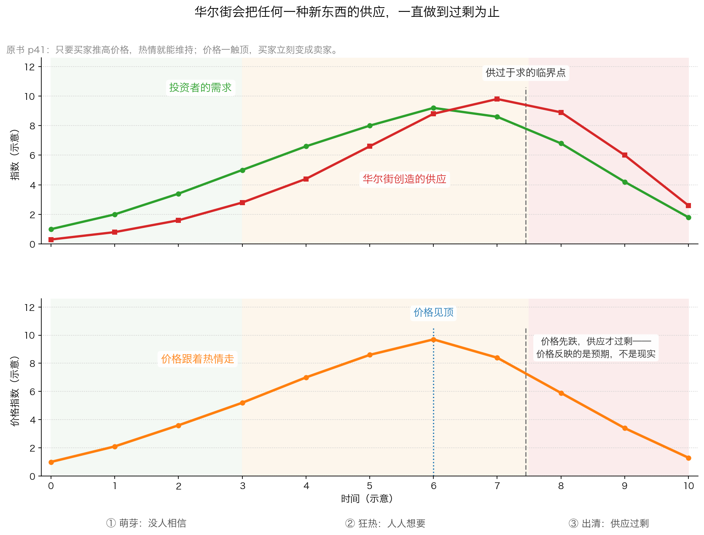

# 第 2 章：金融创新——为谁而创新

> 本章你将：
> - 知道"金融创新"这个词背后，钱是从谁的口袋出来、进了谁的口袋
> - 看懂任何一个新产品的三段式命运：萌芽（没人要）→ 狂热（人人要）→ 出清（过剩崩塌）
> - 理解"自证预言"：为什么价格上涨本身就能招来更多买家，为什么下跌会自己加速
> - 认识 1980 年代那张"产品菜单"上最典型的几个品种，以及它们在今天叫什么
> - 拿到一套"新产品体检三问"，以后不用懂全部细节也能筛掉大部分坑
> - **这对我的钱包意味着什么：** 任何被包装成"创新、升级、更先进"的产品，你都要先问一句"它多出来的这部分，是从哪里变出来的"——如果答案是"从费用里"，那它不是给你的创新

---

上一章我们看清了华尔街的**态度**：它永远看涨。
这一章我们看它的**产品**：它不停地发明新东西卖给你。

先给结论，再讲证据：

> "华尔街公司中的投资银行家一直都在创造新的证券品种提供给客户。
> 有时这种新证券不仅能解决发行人的财务问题，也能满足投资者的需求。然而，
> 多数情况下，这些新的证券品种仅仅能满足华尔街的需要，即满足对费用和佣金的追求。"（p39–p40）

**"多数情况下"这四个字很重要。** 卡拉曼没有说所有创新都是骗局，
他说的是：**创新有它自己的动力来源，而这个来源未必跟你有关。**

---

## 2.1 先交代：1980 年代的"金融创新"是什么场面

我们先把背景补齐。

在美国，**1960 年代到 1970 年代**，市场利率被管制得很死，
银行能给存款人的利息有上限。到了 **1970 年代末**，通货膨胀很高，
市场利率涨上去了，可银行还在按老规矩付低利息，存钱的人当然不干。
于是发生了两件事：一是大量资金从银行搬走，二是**金融机构开始想办法"绕开"管制**——
设计出各种以前没有的证券。

到了 **1980 年代**，这个"绕开"的过程变成了一场竞赛。
计算机和通信技术进步，让复杂的证券设计变得可行；
同时前面说过的杠杆收购狂潮又需要大量稀奇古怪的融资工具。
**结果就是原书 p40 那张清单。**

> 💡 **换个说法：** 你可以把这个过程理解成**手机市场的爆发**。
> 一开始只有一种手机，后来厂商发现"换个壳、加个功能"就能卖更高的价钱，
> 于是市面上一夜之间出现了折叠的、防水的、游戏专供的、老人专用的、美颜专供的……
> 其中确实有些解决了真问题，但**大部分只是为了多一个卖点**。

---

## 2.2 创新的钱从哪来：买卖双方都拿了好处，只有"长期结果"没人负责

原书 p40 有一段话，把金融创新的利益结构讲得极其清楚。我们逐句拆开。

> "金融媒介——华尔街的投资银行家和机构投资者——准备从金融市场创新中获取最大的利益，
> 华尔街赚取无风险的费用和佣金。"（p40）

**"无风险"三个字是关键。** 华尔街设计出一个新产品，卖给客户，
它收的是设计费、承销费、佣金——**这些钱在产品涨跌之前就已经落袋了**。
产品后来崩了，跟它的收入无关。

> "通过创造出新的投资工具对创新证券进行投资，机构投资者也许能吸引更多的资金加入。"（p40）

这句话说的是**买方的动机**。一家基金公司如果买了一个别人没有的新品种，
它就有了一个"卖点"，可以拿去做营销，吸引更多人来买它的基金。
**买方不只是被动的受害者，它也有自己的算盘。**

> "如果第一批投资者在金融市场创新中取得不错的成绩，就可以筹集到更多的资金，
> 发行更多的证券，产生更多的管理费用、承销费用和佣金。"（p40）

**第一批人赚了钱，就会有第二批人进来，然后是第三批。** 这是一个正反馈。

> "实际上买方和卖方变成了同谋，任何一方都可以从创新的持续成功中拥有既得权利。
> 对发行人或者新证券的实际持有人而言的长期利益则相当不确定。"（p40）

**"买方和卖方变成了同谋"**——这句话很容易被误读成道德指责。
它其实是在描述一个结构：**链条上的每一个中间环节都从"这个东西继续火下去"里获益，
只有最终掏钱的那个人，承担的是"它三年后还值不值钱"这个后果。**

> 📌 **划重点：** 判断任何一款金融产品，不要只看它的说明书，
> 要沿着链条数一遍：**设计的人拿多少、发行的人拿多少、卖给你的人拿多少、
> 最后剩下多少真正进入投资。** 这笔账算完，很多产品你就不想买了。

---

## 2.3 一份真实的"产品菜单"

原书 p40 列了一长串 1980 年代的新品种。我们挑几个最有代表性的，
用生活语言解释一遍，并且对照今天 A 股/港股 里长得像它的东西。

| 原书里的品种 | 用大白话解释 | 今天的对应物 |
|---|---|---|
| **固定利率债券 / 浮动利率债券** | 利息固定的借条 / 利息跟着市场利率浮动的借条 | 普通债券 / 浮息债、挂钩 LPR 的贷款类产品 |
| **零息债券** | 不付利息，但发行时打折卖，到期按面值还。你的收益全在"差价"里 | 贴现债；A 股里一些"到期一次还本付息"的债券 |
| **以实物或者股票进行支付的债券** | 到期不给你现金，给你东西或者股票 | "以股抵债"的重整方案；PIK 类的境外债（PIK 指利息也先不付现金，而是再记一笔债，Week 6 会细讲） |
| **荷兰式拍卖发行的债券** | 用一个统一竞价的方式决定利率，看着很公平 | 国债的拍卖发行；一些结构化的报价机制 |
| **可转换成股票的债券** | 一张借条，但你可以选择把它换成股票 | **可转债**，A 股散户最常见的一种"混合品种" |
| **可卖出债券 / 可赎回债券** | 持有人有权提前要回钱 / 发行公司有权提前还钱 | 含回售条款、含赎回条款的债券 |
| **可重新调整的债券 / 到期日期可以延长的债券** | 条款中途可以改，到期日能往后拖 | 展期债券——近年一些地产债的展期方案 |
| **以一篮子外币定价的债券** | 收益跟好几种汇率挂钩 | 双币理财、结构性存款里的汇率挂钩部分 |

原书 p40 在列完这张清单之后补了一句意味深长的话：

> "这些证券中有些已经名誉扫地，如拍卖利率优先债券或零息垃圾债券。
> 其他许多的证券可能已经像科学展览上的展品一样实现了各自最初的目标，但几乎没有人真正关心这一点。"（p40）

**"像科学展览上的展品"**——这个比喻很刻薄，也很准确：
设计得很精巧，拿过奖，然后被放进柜子里落灰。
**精巧不等于有用，更不等于对你有利。**

> 🇨🇳 **落到 A 股/港股：** 今天你在 App 上能看到的结构化产品，
> 大致就是这张菜单的当代版本。举三个最常见的：
>
> **① 可转债。** 一张借条加一份"可以换成股票"的权利。
> 股价涨了你可以换成股票赚差价，股价跌了你就当它是一张利息很低的借条。
> 它听起来"下有保底、上不封顶"，但**保底的那个债底，是靠很低的利息换来的**。
>
> **② 分级基金（已经退出历史舞台）。** 把一只基金的收益切成两半：
> A 类拿固定收益，B 类拿扣掉 A 类之后的全部盈亏（也就是带杠杆）。
> 这个设计和本周第 3 章要讲的 IOs/POs 是同一个思路——**把现金流切成不同风险的两块**。
> 它在 2015 年前后被大量散户当成"稳赚"的工具，最终因为风险太大，
> 在 2020 年底前被全部整改退出。
>
> **③ 雪球结构（自动赎回型产品）。** 看着像"高息理财"：
> 指数在一个区间里波动，你就拿很高的利息；涨到某个线以上，产品提前结束；
> 一旦跌破某个线，你的本金就要跟着指数一起跌。
> **它真正的结构是：你收的那笔"高息"，是你替别人承担下跌风险换来的报酬。**
> 它不是理财，是一份关于"我觉得不会大跌"的对赌。

---

## 2.4 三段式：萌芽、狂热、出清

现在讲本章最重要的一张图。原书 p41 有一段话，几乎就是这张图的文字版：

> "华尔街从不满足于所取得的成绩。如果一项交易成功结束，华尔街就会认为下一个交易肯定会成功。
> 实际上在所有的金融创新和投资狂潮中，华尔街都创造出了更多的供应，直至市场达到供需平衡，
> 然后供应超过需求。华尔街公司的盈利动机和这些公司之间的激烈竞争意味着只能出现这样的结果。"（p41）

这段话里有三个必须看懂的点：

1. **供应是被"创造"出来的**，不是被"需求"拉出来的。是卖方先做出产品，再找人来买。
2. **供应会一直增加到超过需求为止。** 因为每个参与者都怕落后，谁停手谁吃亏。
3. **这不是因为从业者特别贪，而是"盈利动机 + 激烈竞争"的必然结果。**

看懂这张图，你就能看懂几乎所有的"风口"：

| 阶段 | 表面上看起来 | 实际在发生什么 | 你该做什么 |
|---|---|---|---|
| **① 萌芽** | 没人关心，媒体不提，你听都没听过 | 少数人在研究，供应量极小 | 可以研究，多半买不到 |
| **② 狂热** | 人人都在谈，产品抢着买，价格天天涨 | 供应量急速增加，价格已经跑在价值前面 | **这是最危险的阶段**，也是最像机会的阶段 |
| **③ 出清** | 价格跌，没人提，产品清盘 | 供应过剩，买家变成卖家 | 这里才可能出现真正的便宜货 |

> ⚠️ **易踩坑：** 第 ③ 阶段看着最吓人，其实最可能有便宜货；
> 第 ② 阶段看着最舒服，其实最危险。
> **人的直觉和这件事的真相是反的。** 这就是为什么这一行需要纪律，而不是感觉。

注意图里有一个细节：**价格（下图）在"供应还没超过需求"的时候就已经见顶了。**
为什么？因为价格反映的是**预期**，不是**现实**。
大家不是因为"已经过剩了"才卖的，是因为"觉得快过剩了"才卖的。
等过剩真的出现在数据上，价格早就跌完了。

---

## 2.5 自证预言：涨本身能招来买家

原书 p41 这一段是全章的机制核心：

> "当一个特定的行业开始流行时，成功就成了一种自证预言（Self—fulfilling Prophecy）。
> 只要买家推高价格，就能维持自己的热情。然后，当价格触顶，然后开始下跌时，
> 价格的下跌也能成为一种自证预言。买家不仅停止购买，同时一转身变成卖家，
> 从而恶化了每个风潮打上峰顶烙印的供应过剩问题。"（p41）

**"自证预言"的意思**：因为大家都相信某件事会发生，他们的行为反而让这件事真的发生了。

我们用一周之内就能观察到的例子说明：

- **上涨版**：大家觉得房价会涨 → 抢着买 → 房价真的涨了 → 更多人相信会涨 → 继续抢。
  **注意：这里没有任何"房子变好了"的因素，全靠参与者自己的行为。**
- **下跌版**：大家觉得房价会跌 → 抢着卖 → 房价真的跌了 → 更多人相信会跌 → 继续卖。

> 💡 **换个说法：** 自证预言就像**银行挤兑**。
> 一家银行本来资产是够的，但只要所有人都相信"它要倒了"，同时跑去取钱，
> 它就真的倒了。**倒的原因不是它本来有问题，而是所有人相信它有问题。**

在投资里，自证预言有一个特别恶毒的地方：**它是双向加速的。**
涨的时候，买入的人越多、涨得越快、吸引的人越多；
一旦掉头，卖出的人越多、跌得越快、吓跑的人越多。

**所以"过去三年涨得很好"这件事，本身不构成任何买入理由。**
它可能只是自证预言走到了第 800 天。

---

## 2.6 不止是证券：整个行业也能被"创新"

原书 p44–p45 讲了一个更宏观的版本：**不只是单个新产品会经历三段式，整个"行业"也会。**

原书 p44 列举了 1980 年代轮流成为焦点的行业：
能源、科技、生物技术、博彩、仓储商店购物，甚至国防。
每一次的模式都一样：**某个领域早期出现成功案例 → 成群投资者涌入 →
IPO 陆续发行 → 封闭式基金相继成立 → 华尔街赚饱 → 热情消退。**

原书 p44–p45 还讲了"**商业特权**"这个概念（大意是"这家公司有别人抢不走的东西"），
它有多容易被滥用：

> "投资者很快找到了将几乎任何东西都看成是特权的理由。"（p44）

然后是最有代表性的例子——**家庭购物网络公司**（通过电视在家里购物）：

> "到1987 年年初，尽管蒙受了巨大的营业亏损，这家公司的总市值达到了42 亿美元，
> 这较多数经营着数百家店铺的有口皆碑的百货连锁店的市值还要高出许多。"（p45）

**一家还在大额亏损的公司，市值超过了经营几百家实体店的百货连锁。**
原书 p45 的点评一针见血：

> "因此，股市经常把对可口可乐的估值标准用在了一种时尚概念上。"（p45）

> ⚠️ **易踩坑：这里有一个值得单独拿出来讲的读数字的习惯。**
> 原书 p45 紧接着说，这家公司的股价"在仅仅一年之后，公司股价已经较其最高点下跌了超过900%"。
> **请你停一下，自己算一算：一只股票最多能跌多少？**
> 10 元的股票跌到 1 元，是跌 90%；跌到 0.1 元，是跌 99%。
> **不管怎么跌，最多只能跌 100%——因为价格不可能变成负数。**
>
> 所以"下跌超过 900%"这句话在数学上是不可能的，这里应该是原书或译文的表述失误
> （很可能想表达的是"跌掉了九成以上"或者某种倍数关系的口误）。
>
> **为什么要专门说这个？** 因为这就是本书要训练你的东西：
> **读任何材料，包括这本书本身，都要自己动笔验算一遍。**
> 一份材料里出现一个不可能的数字，不代表整份材料没用，
> 但它提醒你：**作者也是人，也会写错。所以任何数字，你都要用自己的算术过一遍。**

---

## 2.7 给任何新产品做体检：三个问题

好，机制讲完了。现在给你一套可以随身带走的工具。
面对任何"新产品、新概念、新机会"，问三个问题：

**问题一：它收多少钱？这些钱是谁拿走的？**

不要只看"管理费"，要把**所有**费用加起来：申购费、管理费、托管费、
销售服务费、赎回费、业绩报酬、还有藏在交易里的价差。
然后沿着链条数：设计的人、发行的人、卖给你的人，各拿多少。

> 📌 **如果一款产品的说明书里，你花二十分钟都算不出"总共收我多少钱"，
> 这本身就是最强的信号——它不想让你算清楚。**

**问题二：它把风险从谁身上转移到了谁身上？**

**风险不会消失，只会转移。** 这是全部金融工程的第一原理。

- 银行把房贷打包成证券卖给投资者 → 房贷违约的风险从银行转到了你身上。
- 一份"高息"的结构化产品 → 下跌的风险从发行方转到了你身上。
- 一份"保本"的理财 → 保本的成本早就算进了给你的低收益里。

**问"风险去哪了"，比问"收益有多高"重要一百倍。**

**问题三：如果它三年不涨，我还愿意拿着吗？我靠什么拿？**

这个问题能把投资和投机分得很清楚（这是 Week 3 学过的区分）。

- 如果你能说出"我每年能收到多少现金、这家公司在赚什么钱"——那它有投资属性。
- 如果你唯一的理由是"以后会有别人出更高的价买走"——那你赌的是别人，不是生意。

---

## 2.8 落到 A 股/港股：今天的新产品长什么样

把上面的框架用一遍。以下是今天最常见的几类"创新"，逐一过三道体检：

| 产品 | 谁在收钱 | 风险转移到哪 | 三年不涨你靠什么 |
|---|---|---|---|
| **可转债** | 承销费、交易佣金 | 转股失败的风险由你承担 | 靠它极低的利息（通常远低于同期限普通债券） |
| **公募 REITs** | 管理费、托管费、交易佣金 | 底层资产（高速公路、产业园）的经营风险归你 | 靠每年的分红，但分多少取决于底层资产真实收益 |
| **结构化理财 / 雪球** | 产品设计费、销售费，往往还有隐含的价差 | 标的下跌的风险从发行方转移到你 | 只能靠"提前触发"或者到期不亏，没有现金流给你 |
| **科创板未盈利企业** | 承销费、交易佣金 | 公司能否盈利的风险完全归你 | 靠未来的成长故事，现阶段多半没有分红 |
| **更名重组的公司** | 交易佣金、可能的定增承销费 | 转型失败的风险归你 | 靠新故事，注意看新业务有没有真实收入 |

> ⚠️ **易踩坑：** 上表不是说这些产品都不能买，
> 而是说**它们都有明确的风险归属，你必须知道自己接手的是什么。**
> 一张体检表填不出答案的产品，先放一放，等你能填出来再说。

---

## 2.9 那怎么办

这一章的三条纪律：

**第一条：把"新"当成一个减分项，而不是加分项。**

原书 p41 说：

> "今天看起来更新和更先进的东西可能在明天就被证实是有缺陷，甚至是错误的东西。"（p41）

一件产品之所以新，通常是因为**以前没人需要它**。
它当然可能是好东西，但举证责任在卖方，不在你。

**第二条：区分"真实的商业趋势"和"投资狂潮"。**

原书 p46 说得非常克制，这句话你一定要读完整：

> "应该注意到，区分投资狂潮与真正的商业趋势并不容易。事实上，许多投资狂潮源于真实的商业趋势，
> 而股价应当反映的是这些真实的商业趋势。然而，当股价上升至无法得到对潜在价值保守评估的支持时，
> 这种热潮就变得危险起来。"（p46）

**注意"保守评估"这四个字。** 热潮变危险，不是因为它假，而是因为
**价格已经超出了"用最保守的假设去算"所能支撑的范围。**
互联网是真的，电动汽车是真的，人工智能也是真的——
**但这些"真"不能自动证明"今天的价格合理"。**

**第三条：在狂热阶段，最好的动作往往是"什么都不做"。**

Week 3 我们讲过市场先生：他每天给你报价，你可以接受，也可以**完全无视**。
在②号阶段，无视他的报价是最难、也最值钱的动作。
因为你什么都不做，你就什么都不亏。

---

## ✍️ 想一想

1. **原书说"买方和卖方变成了同谋"。买方（基金公司、机构投资者）为什么也算同谋？它图什么？**
2. **请用"风险不会消失，只会转移"这句话，解释一下"保本理财"是怎么回事。既然保本，那本金的风险去哪了？**
3. **原书说"区分投资狂潮与真正的商业趋势并不容易"。假设有一个技术趋势百分之百是真的，而且会改变世界。这是不是就意味着相关的股票值得买？为什么？**

> 💡 **参考思路：**
>
> **1.** 买方图的不是"骗人"，它图的是**营销上的差异化**。
> 一家基金如果买的是大家都有的东西，它就没法跟别人区分开，很难卖出去。
> 如果它能说"我们配置了别人没有的新品种"，就有了募资的由头。
> 而且第一批买新品种的机构如果赚了钱，业绩排名会很好看，能吸引更多资金进来，
> 管理费收入也跟着涨。**所以买方从"创新继续火下去"里也是有既得利益的。**
> 这不代表它坏，代表它的利益和你（最终持有人）不完全重合。
> 你该做的，是在买一只基金时，去看它的持仓是不是**为了营销而复杂**。
>
> **2.** "保本"不是"没有风险"，而是**把风险换了一个地方放**。
> 通常有三种处理方式：
> ① **把风险卖掉**：发行方自己去买保险或者做对冲，但保险是有成本的，
> 这笔成本从你的收益里扣——所以你拿到的是很低的利息。
> ② **把风险留给自己**：发行方承诺兜底，那么风险就变成"发行方会不会违约"的信用风险。
> 你以为没有风险，其实是把"市场风险"换成了"对手方风险"。
> ③ **把风险往后推**：用复杂的结构把亏损推迟到未来某个时点才暴露。
> 所以看到"保本"两个字，你该问的不是"真的保吗"，
> 而是"**这份保险的保费，是从我的哪一部分收益里扣的**"。
>
> **3.** 不等于。因为"技术会改变世界"和"这家公司会赚到钱"和"今天这个价格值得买"
> 是三件不同的事，中间隔了两道关：
> 第一，**这项技术带来的利润会被谁拿走？** 技术本身不赚钱，
> 赚钱的是能把它变成生意、并且挡住竞争者的公司。
> 很多改变世界的技术，最后是用户受益、早期投资者亏钱（比如航空业、光伏、面板）。
> 第二，**就算这家公司真的赚到了大钱，你付的价格里已经包含了多少这种预期？**
> 原书 p46 说得清楚：热潮变危险，是"当股价上升至无法得到对潜在价值**保守评估**的支持时"。
> 换句话说，你要算的不是"它会不会成功"，而是"如果它成功了，按今天这个价格我能赚多少；
> 如果它只成功了七成，我会亏多少"。**第二问才算得下去，第一问算不下去。**

---

## 🧮 算一算

> **情境：** 某只**封闭式基金**按每份 **10 元**发行，
> 承销商拿走 **8%** 的佣金（这是原书 p33 给出的数字）。
> 你投入 **10 万元**。
>
> 我们用一组**简化示意数字**，忽略管理费等其它费用，只看这 8% 的承销费。

**第 1 问：你买到了多少份？**

- 第 1 步：每份 10 元，你投了 100000 元。
- 第 2 步：份额 = 100000 ÷ 10 = **10000 份**。

**第 2 问：这只基金实际拿多少钱去投资？每份对应多少资产？**

- 第 1 步：承销商拿走 8% = 100000 元 乘 8% = **8000 元**。
- 第 2 步：基金实际拿到 100000 - 8000 = **92000 元**。
- 第 3 步：每份对应的资产 = 92000 ÷ 10000 = **9.2 元**。
- 第 4 步：**这就是原书 p33 那句"只留下 9.2 美元可进行投资"的算法。**

**第 3 问：假如一年后，基金投资的资产一分钱也没涨、也没跌，你的 10 万剩下多少？**

- 第 1 步：资产没变，每份还是 9.2 元。
- 第 2 步：你的 10000 份 = 10000 乘 9.2 = **92000 元**。
- 第 3 步：亏损 = 100000 - 92000 = **8000 元**，亏损率 **8%**。
- 第 4 步：**注意：股票一分没跌，你已经亏了 8%。**

**第 4 问：如果同期你买的是一个"按净值买卖、不收承销费"的开放式基金，投的是同样的资产呢？**

- 第 1 步：你的 10 万元全部变成资产，每份起点净值 10 元。
- 第 2 步：一年后资产没变，净值还是 10 元。
- 第 3 步：你的钱还是 **10 万元**，不亏不赚。
- 第 4 步：**两者的差额 = 100000 - 92000 = 8000 元。**
  这 8000 元在基金成立的那一天，就已经不在你的账户里了。

**第 5 问：要让封闭式基金帮你把这 8000 元赚回来，它手里的资产要涨多少？**

- 第 1 步：它的资产是 92000 元，需要赚回 8000 元。
- 第 2 步：所需涨幅 = 8000 ÷ 92000 = **8.696%**，约等于 **8.7%**。
- 第 3 步：**这就是"先亏 8% 的人"和"不亏的人"之间的差距：
  前者必须先涨 8.7% 才能追平后者。**

**第 6 问：再叠加原书 p34 说的情况——几个月后价格跌破净值。假设这几个月里基金持有的资产跌了 6.5%，结果如何？**

- 第 1 步（封闭式）：净值 = 9.2 元 乘（1 - 6.5%）= 9.2 乘 0.935 = **8.602 元**。
- 第 2 步：你的 10000 份 = 10000 乘 8.602 = **86020 元**，亏 **13980 元**，亏损率 **13.98%**。
- 第 3 步：**这个数字正好落在原书 p34 说的"10%-15% 的损失"区间里。**
- 第 4 步（开放式）：净值 = 10 元 乘 0.935 = **9.35 元**，你的钱 = **93500 元**，亏 **6500 元**，亏损率 **6.5%**。
- 第 5 步：差额 = 93500 - 86020 = **7480 元**。
  这 7480 元，就是那 8000 元承销费在"资产缩水 6.5%"之后剩下的影子。
- 第 6 步：**结论——同一批资产、同样的跌幅，一个亏 6.5%，一个亏 14%。**
  差别不在投资能力，只在**你走的是哪条通道**。

> 📌 **划重点：** 这道题里最该记住的不是 8%，而是**第 3 问的那句"股票一分没跌，你已经亏了 8%"**。
> 这就是"预付费用"的杀伤力：它在你的投资还没开始的时候就已经收走了。
> 下一次有人向你推荐"新发行的"什么东西，请先问一句：**它从第一天起就扣掉了多少？**

---

## ✅ 小测验

**1. 原书 p40 说"买方和卖方变成了同谋"。这里的"买方"指的是谁？它为什么也算同谋？**
A. 买股票的个人投资者，因为他们贪心
B. 机构投资者，因为投资新品种能帮它们吸引更多资金、拿到更多管理费
C. 交易所，因为它收交易费
D. 监管部门，因为它批准了新产品

**2. 原书 p41 说"成功就成了一种自证预言"。下面哪个现象最符合"自证预言"的意思？**
A. 一家公司利润增长，所以股价上涨
B. 大家觉得房价会涨，于是抢着买，房价真的涨了，于是更多人相信会涨
C. 分析师用模型算出某股票的目标价是 50 元
D. 公司回购股票，减少了流通股数量

**3. 原书 p46 说"区分投资狂潮与真正的商业趋势并不容易。事实上，许多投资狂潮源于真实的商业趋势"。这句话最关键的提醒是什么？**
A. 只要趋势是真的，买入就一定赚钱
B. 趋势是真的，但价格可能已经超出了"保守评估"能支撑的范围，这时候热潮就变危险了
C. 所有的商业趋势最终都是假的
D. 只要不追热点，就不会亏钱

> **答案与解析**
>
> **1. B。** 原书 p40 明确说："通过创造出新的投资工具对创新证券进行投资，
> 机构投资者也许能吸引更多的资金加入。如果第一批投资者在金融市场创新中取得不错的成绩，
> 就可以筹集到更多的资金，发行更多的证券，产生更多的管理费用、承销费用和佣金。"
> 所以买方（机构）也有"创新继续火下去"的既得利益。
> A 错在：个人投资者是这个链条的末端，也是承担长期结果的人，不是同谋。
> C 错在：交易所不是原书这里说的"买方"。
> D 错在：监管不是原书讨论的对象。
>
> **2. B。** 自证预言的核心是"**相信本身改变了结果**"：
> 价格上涨不是因为有新的价值产生，而是因为参与者的行为互相强化。
> A 是基本面驱动，不是自证预言。
> C 是分析师的估值行为，不构成"因为相信所以成真"的循环。
> D 是公司行为影响供给，虽然也会推高股价，但机制不同，属于真实的资本运作。
>
> **3. B。** 原书原话是"当股价上升至无法得到对潜在价值保守评估的支持时，这种热潮就变得危险起来"。
> 重点是**"保守评估"**：不是趋势假，而是价格超出了保守假设能撑住的范围。
> A 错在：把"趋势真"直接等同于"买入赚钱"，忽略了价格。
> C 错在：与原文相反，原文承认许多狂潮源于真实趋势。
> D 错在：太绝对，而且"追不追热点"不是判断标准，**价格相对于价值的位置**才是。

---

## 📖 回到原书

- 对应原书 **第二章**，`raw/安全边际-中文版/page_039.md` ~ `page_046.md`（原书 p39–p46）。
- **建议精读：**
  - p39–p40（"金融市场创新有利于华尔街但不利于客户"开头）："买方和卖方变成了同谋"这一段是全章的骨架。
  - p41（自证预言 + 供应过剩）：把"华尔街创造更多供应，直至超过需求"这句话读三遍，它是所有风口的通用剧本。
  - p46（投资狂潮与真实趋势的区分）：全书最重要的一段"平衡话"，避免你读完这章之后变成"凡热点必反"。
- **可以略读：**
  - p40（那张一长串的债券品种清单）：扫一眼就行，知道"原来能变出这么多花样"即可，不必逐个记名字。
  - p44–p45（1980 年代的"商业特权"和各类行业风潮）：时代背景，重点看"家庭购物网络公司"那个例子。
- **原书金句（逐字引用）：**
  > "然而，多数情况下，这些新的证券品种仅仅能满足华尔街的需要，即满足对费用和佣金的追求。"（p39–p40）
  >
  > "实际上买方和卖方变成了同谋，任何一方都可以从创新的持续成功中拥有既得权利。"（p40）
  >
  > "实际上在所有的金融创新和投资狂潮中，华尔街都创造出了更多的供应，直至市场达到供需平衡，然后供应超过需求。"（p41）
  >
  > "当股价上升至无法得到对潜在价值保守评估的支持时，这种热潮就变得危险起来。"（p46）

下一章，我们不讲抽象机制了，我们看一个**具体的、真实发生过的**创新案例：
华尔街把一笔房贷的还款剪成了两半，一半卖给你，一半卖给别人。
它精巧到什么程度？精巧到连卖它的人都没想清楚后果。
