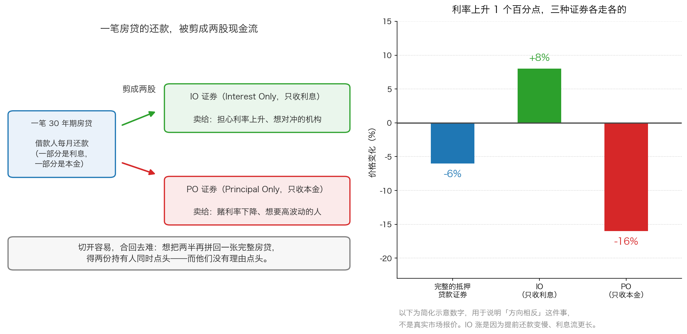

# 第 3 章：IOs 与 POs——一场创新如何伤到客户

> 本章你将：
> - 用生活语言搞懂三件事：房贷、房贷打包成证券、以及"提前还款"为什么会让人紧张
> - 知道 IOs 和 POs 到底是什么——把一笔房贷的还款剪成"利息流"和"本金流"
> - 明白为什么利率一动，三样东西会朝两个方向走（IO 涨，完整证券和 PO 都跌）
> - 看懂原书 p43 那四个"如果……会怎样"，以及"切开容易、合回去难"这个结构性缺陷
> - 学会在 A 股/港股 里认出那些"把现金流切开分层卖"的产品
> - **这对我的钱包意味着什么：** 任何一份说明书，如果你花二十分钟还说不清"我这块到底拿到什么现金流"，就不该买——因为你不懂的定价，只能由卖方替你定

---

前两章我们讲了华尔街的**态度**（永远看涨）和它的**产品逻辑**（创造供应直到过剩）。
这一章我们讲一个**具体案例**。它很技术，但非常值得花时间，
因为它是"金融创新如何伤到客户"这件事最干净的一个标本。

**先交代背景，五句话说完：**

1990 年前后的美国，买房的人向银行借房贷，银行不想把这笔钱压三十年，
于是把一大堆房贷打包起来，以这些房贷的还款为担保，发行一种证券卖给投资者。
这种证券叫**抵押贷款支持证券**。
买房人每个月还的钱，转手就成了证券持有人的收入。
华尔街觉得这样还不够"精细"，于是在 1980 年代中期又发明了一招：
**把同一笔房贷的还款剪成两半，一半只给利息，一半只给本金，分开卖。**
只收利息的那一半叫 **IOs**（Interest Only），只收本金的那一半叫 **POs**（Principal Only）。

这一章就讲这一剪刀下去之后发生了什么。

---

## 3.1 先把三个基础概念说清楚

在读原书之前，我们得先把三个词弄明白。它们都不难，只是没人在乎你不知道。

**第一个：房贷是怎么还的。**

你向银行借 100 万元买房，约定 30 年还清。这 30 年里，
你每个月还的钱可以分成两部分：

- **利息**：按你还没还的那部分本金，乘以利率算出来的钱。
- **本金**：真正用来还掉欠款的那一部分。

> 💡 **换个说法：** 房贷像**租一个会慢慢变成你的东西**。
> 你每月交的钱里，一部分是"租金"（利息，交出去就没了），
> 一部分是"分期付款"（本金，让你的欠款变少）。

**第二个：把一大堆房贷"打包"成一张证券。**

银行手里有一万笔房贷，每笔都有人按月还钱。
银行把这堆房贷放进一个"池子"，然后说：
"谁把钱借给这个池子，谁就能按月分到池子里收回来的还款。"
于是它发行一种证券，卖给保险公司、养老基金、储蓄银行。

这个过程叫**资产证券化**。
你手上的这张证券，背后不是某一家公司的经营利润，
而是**成千上万个普通买房人的月供**。

**第三个：为什么要把它"切开"。**

这是本章的关键动作。一笔房贷的还款里，**利息**和**本金**的性质完全不同：

- **利息**是一串"水流"：每个月都有一点，持续很多年。
- **本金**是最后那一大笔：中途基本不动，到期一次性回来。

这两个东西的风险完全不同，所以**喜欢它们的人也不同**。
华尔街的想法很简单：**如果能分开卖，就能卖给两拨人，赚两份费用。**

这就是 IOs 和 POs 诞生的原因。用原书 p42 的话说：

> "IOs 和POs 就是将抵押贷款中的两项资金进行了分拆：分成利息支付和本金支付。"（p42）

---

## 3.2 一个让债券持有人睡不着觉的词：提前还款

在讲 IO 和 PO 之前，你必须先理解**提前还款**这件事，否则你会看不懂后面的全部逻辑。

**提前还款**就是：买房的人不等 30 年，提前把剩下的本金一次性还清。

这在生活里是好事——少付利息，早点了结。
**但对抵押贷款证券的持有人来说，这是一件要命的事。**

想明白这一点，你需要知道一个债券的基本规律（Week 2 我们讲过）：

**未来的钱，换成今天的钱要打个折。** 而且，**利率越高，折得越狠。**

所以我们用大白话把链条捋一遍：

**如果市场利率下降：**

- 买房的人发现新贷款的利息比自己手上这笔低，于是**纷纷提前还旧贷、借新贷**。
- 结果：证券持有人本来能收 30 年利息，现在可能只收 8 年就被还清本金了。
- **他原本预期的那一串高利息，突然没有了。**

**如果市场利率上升：**

- 没人愿意提前还款了（新贷款更贵）。大家都放慢还款速度，能拖就拖。
- 结果：证券持有人会**收更久的利息**——但市场上的新债券利息更高，
  他手上的这些现金流反而"不值钱"了。

> 📌 **划重点：** 提前还款的速度，**完全由借钱的人自己决定**，
> 而且他们的决定恰好跟你的利益相反：
> **利率降的时候他们抢着还（你损失高息），利率涨的时候他们拖着不还（你被套在低息上）。**
> 这种"对方随时可以反悔"的特性，是所有房贷类证券麻烦的根源。

原书 p42 讲传统抵押贷款证券价格与利率反向波动时，给了两个原因，正是上面这两条：
一是利率上升时，现金流要用更高的利率折现，价值就下降；
二是利率上升时，抵押贷款的预期寿命会变长。

---

## 3.3 IOs 和 POs：剪刀下去之后

现在我们可以看清楚这一剪刀的效果了。

| | IO（只收利息） | PO（只收本金） |
|---|---|---|
| **拿到什么** | 每个月还款里的**利息**部分 | 每个月还款里的**本金**部分 |
| **拿到什么时候** | 只要贷款没还完，就一直拿 | 本金逐步回来，提前还款时一次性大量回来 |
| **最怕什么** | **提前还款**——贷款没了，利息就没了 | **不提前还款**——本金回来得太慢 |
| **最喜欢什么** | 大家慢慢还，还满 30 年 | 大家快点还，早点把钱拿回来 |

看最后两行：**IO 和 PO 的利益是直接对立的。**
一方希望借款人慢点还，另一方希望借款人快点还。
而决定快慢的，是利率。

> 💡 **换个说法：** 这就像把一套房子的**租金权**和**产权**分别卖给两个人。
> 房价涨了，产权持有人高兴；租金涨价了，租金权持有人高兴。
> 两件东西看着都跟这套房子有关，但它们的价格可以朝相反方向走。

原书 p42–p43 描述了这种"方向不同"：

> "相反，POs 的价格会对利率的变化作出与传统的抵押贷款一样的反应，但波动性更大，
> 因此，对任何希望就利率进行投机的人而言，它们可能是一种潜在的有用工具。"（p42–p43）

**注意"波动性更大"和"希望对利率进行投机"这两个表述。**
原书在描述 PO 的时候用的不是"投资"，是"**投机**"——
这是 Week 3 我们讲过的区分：靠预测价格涨跌赚钱，而不是靠生意本身赚钱。

---

## 3.4 利率一动，三样东西朝两个方向走（IO 涨，完整证券和 PO 都跌）

现在讲本章最容易搞混的一段。原书 p42 的表述有点绕，我们把它捋直。

**先记住一个基础事实：利率上升，普通债券价格下跌。**
（因为新发行的债券利息更高，你手上那张低息债券就没那么值钱了。
Week 2 讲贴现的时候我们算过这件事。）

**现在看三种证券在"利率上升 1 个百分点"时会怎样：**

**① 完整的抵押贷款证券：跌。**

为什么？两个原因叠加：
一是折现率变高了（前面说的规律）；
二是提前还款变慢了，你被锁在这笔相对低息的现金流里的时间更长。
两件事都往坏的方向推，所以价格跌。

**② IO（只收利息）：涨。**

这个最反直觉，但逻辑非常干净：

- 利率上升 → 没人愿意提前还款了 → 贷款会拖得更久
- 贷款拖得更久 → **IO 能收到的利息串变长了**
- 虽然每一笔利息要用更高的折现率折回今天
- **但"利息笔数变多"这一项的威力，超过了"每笔折得更狠"**

原书 p42 就是这么解释的：

> "原因是，如果利率上升，一项IOs 贷款中的利息支付将需要更长的时间。
> 经验表明，大量利息支付的现值高于少量利息支付的价值，即使是使用更高的贴现率。"（p42）

> ⚠️ **易踩坑：** 原书在这里说 IO"会随着利率的变动而呈反向波动"，
> 这句话单独看容易晕。**它说的"反向"，是指 IO 与完整的抵押贷款证券反向**——
> 完整的证券跌，IO 涨。这正是原书紧接着说
> "像储蓄银行或者保险公司这样的抵押贷款投资者会更喜欢IOs，
> 可以将此作为对利率变化进行的潜在对冲"（p42）的原因：
> **能对冲，就意味着它跟你的其他资产反着走。**
> 如果你把这个"反向"理解成"IO 跟利率反向"，就会得出结论说"利率涨 IO 跌"，
> 那跟原书自己的解释正好矛盾。**读书时遇到这种地方，一定要用机制去校验表述。**

**③ PO（只收本金）：跌得比完整的证券还狠。**

- 利率上升 → 没人提前还款 → **本金要等更久才能回来**
- 而且回来得越晚，折现折得越狠
- 双重打击，所以它的波动比完整的证券更大

我们把三个结果画在一张图上，你就会看到"同一笔房贷"被剪开之后，
两块东西的性格差得多远：一块成了对冲工具，一块成了投机工具。

> 📌 **划重点：** 这不是"哪个更好"的问题，而是**它们根本不是同一种东西**。
> 把一笔现金流剪开，你得到的不是"两个小号的完整证券"，
> 而是**两个行为完全不同的新东西**。这是本章最重要的认知。

---

## 3.5 原书的四个"如果……会怎样？"

讲完了机制，现在讲**它为什么把客户坑了**。
原书 p43 用了一连串反问，我们一条一条看。

**第一个如果：如果 IOs 和 POs 无法在一个流动性好、买卖价差小的市场里交易，会怎样？**

**流动性**的意思是：你想卖的时候，能不能很快按接近报价的价格卖掉。
IO 和 PO 是全新品种，买的人少、卖的人少。
想卖的时候，可能找不到买家，或者买家只肯出一个很低的价格。

**第二个如果：如果没法持续、准确、及时地拿到这些证券的信息，会怎样？**

一个证券值多少钱，取决于它背后的现金流。
IO 和 PO 的现金流取决于**提前还款速度**——而这个速度每个月都在变，
还要靠模型去估。信息不透明，你就只能听卖方的报价。

**第三个如果：如果利率波动造成这些证券的波动远超预期，会怎样？**

这就是我们上一节讲的事。买 IO 的人以为自己买的是"稳健的利息收入"，
结果发现它像一张对赌利率的合约。

**第四个如果（原书最狠的一句）：如果想把两半再合回去呢？**

> "那时这些证券的持有人就会陷入麻烦，因为将一项抵押贷款分拆成两个部分
> 较之将两个部分重新合并在一起要容易的多。不能保证拥有其中一部分的持有人
> 会对另一部分的持有人所提出的将两部分重新合并的提议感兴趣，
> 甚至没有理由认为存在这种可能性。"（p43）

**翻成大白话：剪开只要一分钟，想粘回去得两个陌生人同时点头，
而他们根本没有理由点头。**

为什么没有理由？因为 IO 持有人和 PO 持有人的利益是**对立**的
（一个希望慢慢还，一个希望快点还）。让他们达成一致，
等于让两个正在打牌的人同时认输。

原书 p43 给出了结论：

> "换句话说，有可能这两部分的价值将低于整个抵押贷款的价值，
> 至少一个或者两个部分都会以低于理论上的潜在价值的打折价进行交易。"（p43）

**"1 加 1 小于 2"**——这是本章最实用的一句话。
华尔街把东西切开是为了多卖两份费用，
但对持有人来说，切开之后的总价值**反而可能比切开之前更低**。

---

## 3.6 谁买了这些东西？为什么他们会上当

原书 p43 点名了买家：

> "买家下的赌注就是自己有能力理解一种崭新的证券，这些买家常常是那些储蓄银行和保险公司。
> 为避免遭剥削，它们需要较其他市场参与者更了解这些新证券，至少应同华尔街一样了解这种证券。"（p43）

**注意这句话的分量。** 买家不是普通散户，是**专业机构**——
储蓄银行和保险公司，有全职的分析团队。
原书说，它们要避免被剥削，必须"**至少应同华尔街一样了解这种证券**"。

原书还指出它们心里那个没说出口的假设：

> "它们含蓄地假设，分拆出来的两种证券至少会与一个完成的抵押贷款证券拥有同样的价值，
> 也许更高——这明显是一种乐观的假设。"（p43）

**这个假设就是全部的破绽。** 它们默认"切开的两块加起来等于整体，甚至更多"，
而上一节告诉我们，完全可能更少。

> ⚠️ **易踩坑：** 这一节最该被你记住的不是"机构也会犯错"，
> 而是**它们犯错的方式**：
> 它们不是因为笨，而是因为**买入的理由来自"别人的假设"而不是自己的计算**。
> 它们假设"会有流动性"、"会有信息"、"两块加起来等于整体"——
> 这三条全是**关于别人行为的假设**，不是关于现金流的计算。
>
> **你以后判断任何产品，都要分清：我这一条理由，是关于现金流的，还是关于别人的？**

---

## 3.7 同一个机制的放大版：2008 年

原书 1991 年出版时，IOs 和 POs 还没有引发系统性危机。
但**同一套技术**在二十年后的美国被放大了很多倍，然后爆了——
这就是 2008 年的次贷危机。

我们只用三句话交代它跟本章的关系：

1. **技术没变**：还是把房贷打包成证券。只是规模更大、贷款质量更差（"次贷"就是发给还款能力很弱的人的房贷）。
2. **切得更细**：不只是切利息和本金，还按"谁先承担损失"切成一层一层（业内叫**分层**），
   优先级高的先拿钱、优先级低的后拿钱但利息高。**这跟 IOs/POs 是同一个思路的更复杂版本。**
3. **评级机构给了高评级**，买家（全球的银行、保险、基金）又一次相信了"切开的东西加起来等于整体"。

结果是 2008 年全球金融危机，雷曼兄弟破产，无数机构巨亏。

> 📌 **划重点：** 这一节不是要你去研究 2008 年。
> 它只是要你知道：**IOs 和 POs 不是一段古老的轶事，而是一个反复出现的模式的早期版本。**
> 这个模式是：**把一个复杂的现金流结构，卖给一批"相信自己能看懂"的人，
> 而他们真正的依据是"别人也会买"。**

---

## 3.8 落到 A 股/港股：把现金流切开的当代产品

下面这些产品，你今天在 A 股或港股 里都能碰到。它们的共同点是：
**把一份现金流的某些权利切出来，单独定价，单独卖。**

| 产品 | 切的是什么 | 你要特别小心的一点 |
|---|---|---|
| **可转债** | 一张债券 + 一份"换成股票"的权利 | 转股不成功时，你拿的是很低的利息。**"下有保底"的底，是用低利息换来的** |
| **公募 REITs** | 底层资产（高速公路、产业园、仓储物流）的租金或收费收入 | 分红取决于底层资产的真实经营，**不是保证收益** |
| **资产证券化产品（ABS）** | 应收账款、消费贷、租赁租金、物业费…… | 你拿的是"别人还钱"的现金流。**要看是谁在还、还不上时谁兜底** |
| **优先股** | 分红权排在普通股前面，但没有投票权 | "优先"只体现在分配顺序上，**不等于安全** |
| **结构性理财 / 雪球** | 标的资产的涨跌 + 一堆触发条件 | 条款越复杂，你越算不出它值多少钱——**算不出，就只能接受卖方的报价** |
| **分级基金**（已退出） | 一只基金的收益切成"固定收益"和"带杠杆的剩余收益" | 和 IOs/POs 思路一致，最终因风险过大在 2020 年底前全部整改退出 |

> 🇨🇳 **落到 A 股/港股：** 有一个特别值得注意的现象。
> A 股的可转债在很长时间里被散户当成"稳赚不赔"的东西，
> 因为它历史上极少违约、还有"回售条款"保护（股价长期低迷时，你可以按约定的价格把债券卖回给公司）。但你必须知道：
> **可转债的"保底"，是发行人用很低的票面利息跟你换来的。**
> 你放弃的那部分利息，就是这份保护的价钱。
> 换句话说，**保护不是免费的，它早就从你的收益里扣掉了。**
> 这跟本章 3.3 节讲 IO/PO 时说的是一回事：
> **风险不会消失，只会转移；保护不会凭空出现，只会从收益里扣。**

---

## 3.9 那怎么办

这一章给三条纪律，都很具体。

**第一条：凡是"把现金流切开分层"的产品，先问"切开之后，谁跟谁利益相反"。**

在 IOs/POs 里，IO 希望慢点还、PO 希望快点还。
在可转债里，发行人希望你别转股（这样它不用还钱），你希望股价涨上去能转股。
在 REITs 里，原始权益人（把资产装进来的人）和管理人、和你的利益，也不完全一致。

**找到那个"跟你相反的人"，你就知道风险在哪。**

**第二条：算不出它值多少钱的东西，不要买。**

这听起来很粗暴，但它是对自己最有效的保护。
一笔普通债券，你能算：每年利息多少、几年后还本、值多少钱。
一份结构复杂的产品，如果你算了二十分钟还说不清"我在什么情况下拿多少"，
那么**你对它的定价能力就是零**——而卖方不是零。
**在定价能力不对等的交易里，你唯一确定的优势就是"可以不参加"。**

**第三条：记住"1 加 1 可能小于 2"。**

原书 p43 那句"两部分的价值将低于整个抵押贷款的价值"，
是所有"拆分为卖"产品的通用风险。
下次有人跟你说"这个东西被拆成了两块，你可以只买你喜欢的风险"，
你要反问一句：**"那两块合起来的那部分价值，去哪了？"**

---

## ✍️ 想一想

1. **原书说买 IOs 和 POs 的买家是储蓄银行和保险公司，它们有全职的分析团队。为什么它们还是会上当？**
2. **如果利率上升，IO 的价格会上涨。这看起来是好事。那为什么原书说买 PO 的人是"希望就利率进行投机"，而不是说买 IO 的人？这两种人面对的风险性质有什么不同？**
3. **假设有一款产品，把一只股票的"分红权"和"股价涨跌"切开来卖。分红权卖给 A，涨跌卖给 B。请说出：A 和 B 各自最怕什么？他们的利益在哪里冲突？**

> 💡 **参考思路：**
>
> **1.** 因为它们买入的依据不是"现金流算出来的结果"，而是**一组关于别人行为的假设**：
> 假设会有流动性好的市场、假设能持续拿到信息、假设两块加起来等于整体。
> 这三条没有一条是关于"买房人到底会不会按时还钱"的计算。
> 而且机构还有额外的压力：它们的考核是相对的，如果同行都买了、赚了，
> 自己不买就会排名落后。**在一个所有人都在买的品种上选择不买，需要极强的独立判断，
> 而机构恰恰最缺这种自由。** 这就是原书 p40 说的"买方和卖方变成了同谋"的具体样貌。
>
> **2.** 两者的风险性质完全不同。
> **买 IO 的人，本质上是在跟"提前还款速度"对赌**：他赌的是"大家会慢慢还"，
> 所以他最怕的是一件**可能随时改变的事**——借款人某天突然集体提前还款。
> 这是一种**基于行为的不确定性**，很难估。
> **买 PO 的人，是在跟"利率方向"对赌**：他赌利率会跌（跌了大家就抢着还本金，
> 他可以提前拿到钱）。这是一种**方向性的赌注**，赌对了赚很多，赌错了亏很多。
> 所以原书说 PO 是"希望对利率进行投机的人"的工具——
> 它的盈亏直接来自利率方向的判断，这是**投机**的典型形态（Week 3 学过的区分）。
> 而 IO 被保险公司拿去当"对冲工具"，是因为它跟它们已有的资产反着走，
> **买它的目的不是赚钱，是降低整体波动。**
> **同一笔房贷剪出来的两块东西，一块是投机工具，一块是对冲工具——这就是"切开"的威力。**
>
> **3.** **A（分红权）最怕的是公司减少分红或者不分红。**
> 公司的分红政策由董事会决定，可以因为"要投资新项目""要保留现金过冬"而随时下调，
> 甚至一分不发。A 手上有权利拿分红，但**没有权力强迫公司分红**。
> 而且分红权没有到期日，理论上可以永远不分。
> **B（股价涨跌）最怕的是公司把利润都分掉、不留在公司里发展**，股价就不涨。
> 两人利益冲突的地方非常清楚：**公司每赚到 1 元，是分掉还是留存在公司里？**
> A 希望分掉，B 希望留住（留存能推动股价上涨）。
> 而且他们还能互相拆台：A 可以通过某种方式施压要求高分红，B 则希望公司少分红。
> **这就是"把现金流切开"的通病：它凭空制造了一对利益相反的人，
> 让他们在同一家公司的同一笔利润上拔河。拔河的裁判，往往是管理层——
> 而管理层的利益，跟 A 和 B 又都不一样。**
>
> 补充一句：这类产品在现实中的确存在过（比如一些"收益权转让"的安排）。
> 它们通常不会摆在普通投资者面前，但你要能识别出它的结构：
> **权利被切开了，责任却没人切——这就是它的脆弱之处。**

---

## 🧮 算一算

> **情境：** 一笔 **100 万元**的房贷，年利率 **6%**，期限 **30 年**。
> 为了便于计算，我们假设采用"**只还利息、到期一次性还本金**"的方式
> （现实中这种叫"先息后本"，一些经营贷就是这种结构）。
>
> 华尔街把它的还款剪成两半：
> **IO 持有人**拿走全部的利息，**PO 持有人**拿走全部的本金。
> 以下是**简化示意数字**。

**第 1 问：这笔房贷 30 年会还出多少钱？**

- 第 1 步：每年的利息 = 100 万元 乘 6% = **6 万元**。
- 第 2 步：30 年的利息总额 = 6 万元 乘 30 = **180 万元**。
- 第 3 步：本金 = **100 万元**。
- 第 4 步：总还款 = 180 万元 + 100 万元 = **280 万元**。
- 第 5 步：两边各分到多少？**IO 拿 180 万元（分 30 年拿），PO 拿 100 万元（第 30 年一次拿）。**

**第 2 问：如果第 10 年年末，借款人突然把剩下的 100 万元本金一次性还清了呢？IO 持有人收到多少？**

- 第 1 步：贷款在第 10 年末就结束了，利息只产生到第 10 年。
- 第 2 步：IO 实际收到 = 6 万元 乘 10 = **60 万元**。
- 第 3 步：他原本预期收到 **180 万元**。
- 第 4 步：少收 = 180 - 60 = **120 万元**。
- 第 5 步：少了多少比例？120 ÷ 180 = **66.7%**。
- 第 6 步：**也就是说，借款人只是提前还了一笔钱，IO 持有人的收入就少了三分之二。**

**第 3 问：那 PO 持有人呢？他赚了吗？**

- 第 1 步：他原本要等到第 30 年才拿回 100 万元，现在第 10 年就拿到了。
- 第 2 步：表面上看，早拿到钱是好事。
- 第 3 步：**但请注意他为什么会提前拿到**——因为利率下降了，
  借款人才能借到更便宜的钱来还旧贷。
- 第 4 步：也就是说，他被迫在一个**利率更低的环境**里，重新给这 100 万元找去处。
  他原本锁定的是 6% 的环境，现在可能只能找到 3% 的机会。
- 第 5 步：所以 PO 的"提前拿到"不是白拿的，
  **它换来的是一份"再投资风险"——钱回来了，但没有好地方放。**

**第 4 问（核心）：把 IO 和 PO 两个人加起来，总共收到多少？比原本预期的 280 万元少了多少？**

- 第 1 步：IO 收到 60 万元，PO 收到 100 万元。
- 第 2 步：合计 = 60 + 100 = **160 万元**。
- 第 3 步：比预期少 = 280 - 160 = **120 万元**。
- 第 4 步：这 120 万元去哪了？**它根本没有产生过。**
  因为利息是"时间"换来的，贷款提前结束，后面 20 年的利息就不会存在。
- 第 5 步：**注意：这 120 万元不是被谁赚走了，是凭空消失了。**
  这是一个非常重要的区别——它不是零和博弈里你输我赢，
  而是**整个蛋糕变小了**。

**第 5 问：反过来，如果利率从 6% 涨到 9%，会发生什么？**

- 第 1 步：借款人会**尽量不提前还款**——因为新借钱的成本变高了，
  手上这笔 6% 的老贷款反而划算。
- 第 2 步：于是贷款会拖满 30 年，IO 持有人收满 **180 万元**利息。
- 第 3 步：**这就是为什么利率上升时 IO 的价格会涨。**
- 第 4 步：而 PO 持有人就惨了：本金要等到第 30 年，中间还要被更高的折现率折一遍。
- 第 5 步：**同一件"利率涨了"的事，一个人受益，一个人受损。**

**第 6 问：如果华尔街当初不切这一刀，把整笔房贷直接卖给一个人，会怎样？**

- 第 1 步：这个人 30 年一共收到 280 万元，提前还款时他就少收后面的利息，
  但**只有他一个人承担这个结果**，不需要跟别人协商。
- 第 2 步：切开之后，同一笔现金流被分给了两个利益相反的人。
- 第 3 步：**如果有一天他们想把两半合回去、恢复成一张完整的证券，
  需要两个人都同意——而他们的利益是对立的，所以谁都不会同意。**
- 第 4 步：这正是原书 p43 说的"把两个部分重新合并在一起"比"分拆"难得多。

> 📌 **划重点：** 这道题里最该记住的是第 4 问的那个结果：
> **两个人加起来，少了 120 万元，而这 120 万元谁都没赚到。**
>
> 这就是"金融创新"最容易被忽略的一种代价：它不一定是把钱从你口袋转到他口袋，
> 它可能是**把一整块价值敲碎，碎片加起来比原来小**。
> 而在这个过程里，唯一确定赚到钱的，是收手续费的那一方。

---

## ✅ 小测验

**1. IO 和 PO 分别拿到房贷还款的哪一部分？**
A. IO 拿本金，PO 拿利息
B. IO 拿利息，PO 拿本金
C. 两者各拿一半，不分利息本金
D. IO 拿前 15 年，PO 拿后 15 年

**2. 市场利率上升时，下面哪一种说法是对的？**
A. 完整的抵押贷款证券涨，IO 涨，PO 跌
B. 完整的抵押贷款证券跌，IO 涨，PO 跌得更多
C. 三种证券都跌，只是幅度不同
D. 三种证券都涨，因为利率上升对债券是好事

**3. 原书 p43 说"将一项抵押贷款分拆成两个部分较之将两个部分重新合并在一起要容易的多"。这句话最核心的含义是什么？**
A. 分拆的手续费比合并的手续费低
B. IO 和 PO 的持有人利益相反，几乎不可能达成合并的一致意见，所以两块加起来的总价值可能低于整体
C. 合并需要政府批准
D. 只有华尔街才有资格做合并的业务

> **答案与解析**
>
> **1. B。** 原书 p42 原话："IOs 和POs 就是将抵押贷款中的两项资金进行了分拆：
> 分成利息支付和本金支付。"IO 是 Interest Only（仅付利息），
> PO 是 Principal Only（仅付本金）。
> A 把两者弄反了，这是最常见的错误。
> C 错在：分拆不是按比例平分，而是按"利息"和"本金"这两类性质不同的现金流分开。
> D 错在：分拆不是按时间切，是按现金流类型切，这是本章的关键。
>
> **2. B。** 两个方向的推理：
> 完整的证券——折现率上升 + 提前还款变慢，两个因素都利空，所以跌。
> IO——利率上升使贷款拖得更久，IO 收到的利息串变长，"笔数变多"的威力超过了"每笔折得更狠"，所以涨。
> PO——本金回来得更晚，还要被更高的折现率折，双重打击，所以跌得比完整证券更狠。
> A 错在把完整证券的方向弄反了。C 错在忽略了 IO 的负相关特性。
> D 错在：利率上升对已有的固定利率债券是坏事，不是好事。
>
> **3. B。** 原书紧接着解释："不能保证拥有其中一部分的持有人会对另一部分的持有人
> 所提出的将两部分重新合并的提议感兴趣，甚至没有理由认为存在这种可能性。"
> 原因是 IO 希望借款人慢慢还（多收利息），PO 希望借款人快点还（早拿本金），
> 两者的利益是直接对立的，没有理由同意合并。
> 结果就是原书那句"有可能这两部分的价值将低于整个抵押贷款的价值"。
> A 讲的是成本，不是这句话的重点。C 和 D 在原书里都没有提到。

---

## 📖 回到原书

- 对应原书 **第二章**，`raw/安全边际-中文版/page_042.md` ~ `page_046.md`（原书 p42–p46）。
- **建议精读：**
  - p42（IOs 和 POs 的定义 + 利率变动对三种证券的影响）：这一页是全章的技术核心，
    建议对照本章 3.4 节的两个方向反复读两遍。
  - p43（四个"如果……会怎样" + "分拆容易、合并难"）：这是全章的思想核心，
    也是"1 加 1 小于 2"这个结论的来源。
- **可以略读：**
  - p42 里关于"抵押贷款预期寿命"的技术表述：知道"利率上升会让贷款拖得更久"这个结论就够了，
    不必去研究提前还款模型。
  - p44–p45（投资狂潮 + 家庭购物网络公司）：这是上一章的内容，本周已讲过，这里可以快速扫过。
- **原书金句（逐字引用）：**
  > "IOs 和POs 就是将抵押贷款中的两项资金进行了分拆：分成利息支付和本金支付。"（p42）
  >
  > "经验表明，大量利息支付的现值高于少量利息支付的价值，即使是使用更高的贴现率。"（p42）
  >
  > "那时这些证券的持有人就会陷入麻烦，因为将一项抵押贷款分拆成两个部分
  > 较之将两个部分重新合并在一起要容易的多。"（p43）
  >
  > "换句话说，有可能这两部分的价值将低于整个抵押贷款的价值，
  > 至少一个或者两个部分都会以低于理论上的潜在价值的打折价进行交易。"（p43）

到这里，原书第二章就讲完了。我们看清了三件事：
**华尔街靠什么赚钱**（第 0 章）、**它为什么永远看涨**（第 1 章）、
**它发明的新东西对谁有利**（第 2、3 章）。
下一章我们把镜头拉回今天——**在 A 股和港股里，具体是哪几只手在掏你的钱包，
以及你该给自己定哪几条规矩。**
