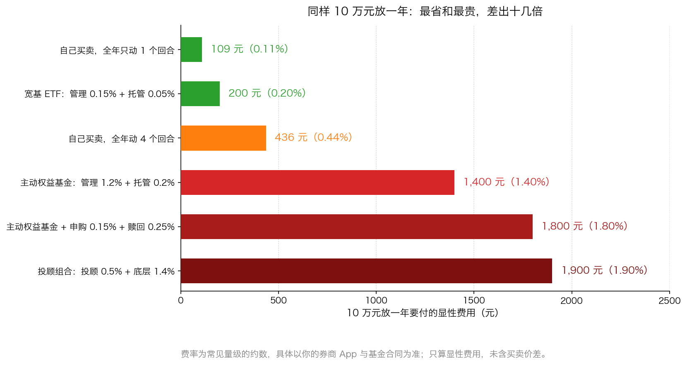
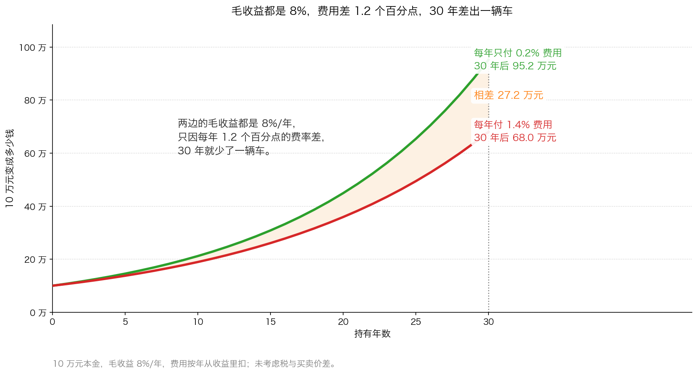

# 第 4 章：今天的对应——A 股、港股里谁在赚你的钱

> 本章你将：
> - 拿到一张完整的"收费方名单"：买一次股票、买一只基金，钱分别流进了哪几个口袋
> - 亲手算清费率对 30 年收益的侵蚀，并知道为什么"费率按你越来越大的本金收"
> - 看懂卖方研报、代销渠道、投顾、打新这四件事各自的利益站位
> - 学会区分"显性费用"和"看不见的成本"，知道后者往往更大
> - 带走一份可以打印的自保清单，贴在你的电脑旁边
> - **这对我的钱包意味着什么：** 你控制不了股价，但你完全可以控制自己付多少费用、听谁的话、一年动几次手——这三件事加起来，长期看比选对一只股票更决定结果

---

原书第二章的最后一页（p46）是这样收尾的：

> "对投资者而言，华尔街可能是个危险的地方。除了在华尔街中进行交易外你别无选择，
> 但你必须时刻保持警惕。华尔街从业人员的标准行为就是追求自身利益的最大化，
> 并且只注重短期利益。投资者必须认识、接受并应对这种行为。"（p46）

**注意这三个动词的顺序：认识、接受、应对。**
不是"愤怒、谴责、抵制"。

这一章，我们把前面三章讲的机制，全部翻译成今天 A 股和港股里的具体人名和具体数字。
读完你会有一张可以贴墙上的表。

---

## 4.1 先说一个反直觉的事实

在列名单之前，先给你一个可能让你意外的结论：

**你在二级市场买卖股票，付给"整个体系"的费用其实非常便宜。**

A 股一次完整的买卖（一买一卖），显性费用大致是你成交金额的 **0.11%** 左右——
也就是说，10 万元买卖一个来回，大约是 **110 元**。

**这个数字低得惊人。** 对比一下：美国 1980 年代机构付的佣金是每股 5 美分（原书 p32），
按 10 美元的股价算是 0.5%。**中国今天的散户，付的费率比当年美国的机构还低。**

**那为什么我们还要花一整章讲费用？** 因为三件事：

1. **它便宜，但它确定。** 涨跌不确定，费用 100% 确定。
2. **真正贵的不是股票，是基金和"服务"。** 基金的年度费率是股票单次费用的十几倍，
   而且**每年都收**。
3. **最贵的从来不是显性费用，是你被推动着做出的动作**（第 1 章那道算一算已经证明了这一点）。

所以这一章的名单，我们按"从便宜到贵"的顺序排。

---

## 4.2 名单一：券商

**它赚你什么：**

| 收入项 | 怎么收 | 你的感觉 |
|---|---|---|
| **交易佣金** | 买卖各收一次，常见万分之二到万分之三；很多券商有"单笔最低 5 元" | 每次都觉得"没多少钱" |
| **融资融券利息** | 你借钱买股票（融资）或借股票卖出（融券），按天收利息 | 行情好的时候最容易用上 |
| **代销金融产品** | 帮基金公司、保险公司卖产品，收销售费用或分成 | 客户经理会主动推荐 |
| **投行与承销** | 帮公司上市、增发、发债，收承销费（这是原书 p32 讲的那块） | 你通常看不到 |
| **自营投资** | 拿自己的钱直接买卖，赚了归自己 | 这时候它是你的对手盘 |

**它希望你做什么：多交易、多用杠杆、多买它代销的产品。**

> 🇨🇳 **落到 A 股/港股：** 有一个数字你必须自己动手查（README 的动手作业任务 A 就是这件事）：
> **你的券商有没有"单笔最低 5 元"？**
> 如果有，你每次只买 2000 元的话，5 元就是 0.25%——**是万分之二点五的十倍**。
> 这条规则的存在，让"小额定投、频繁买入"这个看起来很稳健的做法，成本高得离谱。
>
> 港股这边，券商佣金之外还有印花税、交易征费、交易费、结算费，
> 而且很多港股券商还收"存仓费""代收股息费"这类 A 股没有的项目。
> **港股整体的摩擦成本比 A 股高，这一点你在做 A/H 对比时必须算进去。**

---

## 4.3 名单二：基金公司

**它赚你什么：管理费。**

先把这个词说清楚。

> 💡 **换个说法：** 管理费就像**物业费**。
> 你交了物业费，物业帮你打扫、维修、看门。
> 房子涨价了，物业费不会多收；房子跌价了，物业费也不会少收。
> **它按你的房子面积收，不按你房子的涨跌收。**

而基金公司是按你的**持有金额**收管理费的。
这意味着一个非常重要的推论：

**基金公司最关心的不是"净值涨多少"，而是"规模有多大"。**

举个算术例子（简化示意）：
- 一只基金规模 10 亿元，管理费 1.2%，一年收 1200 万元。
- 净值涨 20%，规模变成 12 亿元，一年收 1440 万元。
- 但如果净值不涨、只是靠营销把规模做到 20 亿元，一年就收 2400 万元。

**"把规模做大"比"把业绩做好"更能增加收入，而且难度低得多。**
这就是为什么你看到的基金宣传，绝大多数在讲"过去一年涨了多少""明星基金经理""限时发行"，
而不是"我们费率低""我们劝你少交易"。

| 收入项 | 怎么收 |
|---|---|
| **管理费** | 每年按你持有的金额收，常见：主动权益类约 1.2%，宽基指数类约 0.15% 到 0.5% |
| **业绩报酬** | 部分产品（尤其私募）在赚钱时额外提取一定比例 |
| **托管费**（给托管银行） | 每年收，常见 0.05% 到 0.2% |

> 📌 **划重点：** 管理费是**从基金净值里直接扣掉**的，你不会收到任何账单。
> 也就是说，一只基金说"今年涨了 10%"，那 10% **已经是扣完管理费之后的数字**。
> 你看到的是净额，所以**感觉不到自己在付钱**——这是它最厉害的地方。

---

## 4.4 名单三：销售渠道

**它赚你什么：申购费、赎回费，以及从管理费里分成的"客户维护费"。**

先把三个词讲清楚。

- **申购费**：你买基金时付的钱。常见标价 1.5%，但大多数第三方平台会打到 1 折左右。
- **赎回费**：你卖基金时付的钱。**持有时间越短，收得越多**——这是为了惩罚短线申赎。
- **客户维护费**（业内也叫"尾随佣金"）：基金公司从自己的管理费里，**分给销售渠道**的一部分。

**第三条是这一节的重点，也是最少人知道的一条。**

> 💡 **换个说法：** 假设管理费是 1.2%，其中 0.4% 分给渠道。
> 那么渠道每帮你持有 10 万元这只基金一年，就能拿 400 元。
> 而如果你赎回，这 400 元就没了。
> **所以渠道有动机让你一直持有——但同时也意味着，
> 它推荐哪只基金，可能取决于哪只基金分给它的更多。**

> ⚠️ **易踩坑：** 这不是说渠道推荐的一定是烂基金。
> 它说的是：**当两只基金对你来说差不多的时候，渠道有它自己的偏好。**
> 你要做的动作很简单：**拿到推荐之后，自己去巨潮资讯网查这只基金的《产品资料概要》，
> 看管理费、托管费、客户维护费各是多少。** 花五分钟，你就从"被推荐的人"变成了"在挑选的人"。

---

## 4.5 名单四：交易所和国家（其实最便宜）

这一块必须单独讲，因为它规模小、公开透明，却最容易被阴谋论化。

| 收费方 | 项目 | 什么时候收 |
|---|---|---|
| **国家** | 印花税 | **只在卖出时**收，单边 |
| **交易所** | 经手费 | 买卖各收一次，费率极低 |
| **证监会** | 证管费 | 买卖各收一次，费率极低 |
| **中国结算** | 过户费 | 买卖各收一次，费率极低 |

**这一块加起来，通常只占成交金额的万分之几。**
它便宜、公开、明码标价、还经常下调。

> 📌 **划重点：** 为什么要专门说这个？
> 因为很多"炒股亏钱是因为国家收税"的说法是错的。
> **印花税确实是成本，但它小到不足以解释你的亏损。**
> 把注意力放错地方，是投资者最常犯的错误之一。
> **真正吃掉你钱的是"动作"和"费率"，不是税。**

---

## 4.6 名单五：看不见的钱

前三节的费用都在明面上。这一节的费用**不在任何账单上**，但往往更贵。

**第一笔：买卖价差。**

你想买一只股票，盘面上写着"卖一 10.02 元，买一 10.00 元"。
你按 10.02 元买入，立刻就想卖的话只能卖 10.00 元。
**你还没动，就已经亏了 0.2%。**

小盘股、冷门股的价差可能是 1% 甚至更多。
**这就是为什么"流动性差的股票"不适合频繁交易**——每一次进出都要被咬一口。

**第二笔：冲击成本。**

你买 1 万元，市场毫无感觉。
你买 1000 万元，你的买单本身就会把价格推上去，你只能越买越贵。
这笔"因为你自己买而多付的钱"，叫冲击成本。
**个人投资者在这一点上其实有优势**——你的钱少，市场不在乎你。

**第三笔：机会成本。**

你花在盯盘、刷消息、看直播上的时间，本来可以用来做别的事。
这笔成本没法记账，但它是真的。

**第四笔：情绪的代价。**

第 1 章的小李，股价从 10 元跌到 8 元再涨回 10 元，他一分钱的"费用"只付了 47 元，
但总损失是 10047 元。**多出来的那一万，就是被情绪推动的动作的代价。**

---

## 4.7 把账摊开：一年到底要付多少

现在我们把前面所有条目放在一起，算一笔总账。

> ⚠️ **请注意：** 这张图上的费率是**常见量级的约数**，
> 具体数字以你的券商 App 和基金合同为准——费率是会变的。
> 这张图要你看的是**数量级的差距**，不是某一个小数点。

看完这张图，你应该记住三件事：

1. **自己买卖股票的显性费用是最低的**，低到几乎可以忽略。
2. **基金的年度费率是单次股票交易的十几倍**，而且**每年都收**。
3. **渠道越多、包装越复杂，费率越高。** 投顾组合最高，因为它叠加了投顾费和底层基金的管理费。

> 💡 **换个说法：** 这就像买水果。
> 自己买（自己下单）最便宜；超市剥好切好装盒（指数基金）贵一点但省事；
> 榨成果汁加冰加杯（主动基金）贵不少；
> **再请一个人帮你挑水果、送到家（投顾）——那就在果汁的价格上再加一笔服务费。**
> 每一层都有它存在的理由，但**每一层都要有人付钱，而付钱的人是你。**

---

## 4.8 把时间拉长：费率对 30 年的侵蚀

单看一年，1.2 个百分点的差距好像没什么。**但它每年都会重新发生一次。**

这就是复利的两面性：
**它让赚钱的人越来越快，也让付费用的人越付越多。**
因为费用是**按你越来越大的本金**收的——
你的钱涨到 90 万的时候，1.4% 就是一年 12600 元。

下一节的算一算，我们把这张图上的每一个数字用手算推一遍。

---

## 4.9 利益站位表：谁在卖什么，他靠什么吃饭

把这一周讲的所有角色放进一张表。**这张表建议你抄下来。**

| 角色 | 他的收入来自 | 他的系统性倾向 | 你该怎么用他 |
|---|---|---|---|
| **券商经纪人 / 客户经理** | 你的交易佣金、代销分成 | 希望你多交易、多买产品 | 只把他当通道，不把他当顾问 |
| **券商研究所（卖方）** | 经纪佣金分仓、投行关系 | 偏"买入""增持"，"卖出"极少 | 读事实，不信情绪；专门看风险提示那一节 |
| **基金公司** | 管理费（按规模） | 希望规模大，倾向持续营销 | 看费率，看它有没有劝你少动 |
| **销售平台 / 银行** | 申购费、客户维护费 | 推荐分给它更多的产品 | 拿到推荐后自己去查文件 |
| **投顾** | 投顾费（按资产规模） | 希望你的资产规模大、留存久 | 问清楚它怎么收费、有没有利益冲突 |
| **财经主播 / 大 V** | 流量、广告、卖课 | 越刺激越有人看，永远"有机会" | 当娱乐，不当依据 |
| **上市公司** | 股价影响融资与期权价值 | 希望你相信它的故事 | 只信公告原文，不信口头描述 |
| **做空机构** | 股价下跌 | 偏"唱空"，可能夸大 | 看它有没有原始证据 |
| **你自己** | —— | **也有情绪，也会骗自己** | 提前写好买入理由，事后对照 |

**最后一行再强调一次。** 这一章讲的所有机制，最终作用的对象是**你**。
你听多了"买入"，你会真的觉得现在是好时候；你听多了"错过就没了"，你会真的怕。
**这不是你的缺点，这是人的默认设置。**

---

## 4.10 自保清单：给自己定的十条规矩

这一节是本周的落点。**建议你把这一份抄在纸上，贴在你下单的地方。**

**关于费用：**

1. **下单前先看一眼费率。** 券商的佣金和最低收费、基金的管理费和托管费，各是多少？
2. **永远把"最低 5 元"算进去。** 如果单笔买入金额太小，费率会被放大十倍。
3. **把年度费率换算成钱。** 1.4% 乘你的本金，就是每年确定要付的金额。写下来。

**关于动作：**

4. **一年动几次手，提前定好，写下来。** 不设上限的人，一定会超。
5. **任何"买入"建议，先放 24 小时。** 真正的机会不会只存在一天；
   只存在一天的东西，通常需要你来不及思考。
6. **不因为一条消息下单。** 下单的理由必须是你自己能写出来的，
   而且写完能对着数据解释。

**关于信息：**

7. **分清"谁在说话"。** 卖方、买方、公司自己——三类人的话可信度不同，但都不是零。
8. **只看原始文件。** 年报、公告、基金合同、产品资料概要，都在巨潮资讯网和港交所披露易上，
   免费、不用经过任何中介。
9. **给每个信息源标一个折扣。** 第 1 章那张"打折表"，现在就去填一遍。

**关于心态：**

10. **接受"华尔街永远不会站在你这边"这个事实，然后照常跟它打交道。**
    原书 p46 说："如果你寄希望于华尔街来提供帮助，那么投资可能永远也无法获得成功。"（p46）
    **你需要的不是它的帮助，是它的通道——而通道是可以明码标价买到的。**

---

## 4.11 一个重要的平衡：这不是"好人坏人"的故事

写完这么长一份名单，我必须停下来提醒你一件事，否则这一章可能把你带偏。

**这一章没有说任何人是坏人。**

- 券商的客户经理要完成考核，他推荐产品是他的工作。
- 分析师不写"卖出"，是因为写了会影响自己和同事的收入，这是理性选择。
- 基金公司追求规模，是因为它的成本结构就要求它追求规模。
- 渠道推荐分给它更多的产品，是因为它也要活下去。

**这不是道德问题，是结构问题。** 结构不会因为换了一批好人就改变。
而且，**同一个结构也在为你提供服务**：
没有券商，你根本下不了单；没有基金公司，你很难用几百块买到一篮子股票；
没有交易所和结算系统，你的股票没有地方登记。

> 📌 **划重点：** 这一周真正的收获，是让你从"**被服务的客户**"
> 变成"**知道自己在买什么的客户**"。
> 这两者的区别不在于谁更聪明，而在于**后者会问问题**。
>
> 医生、律师、理发师也都是先收钱、不管结果。我们从不因此不看医生，
> 我们只是**在听建议的时候，记得自己才是那个承担后果的人。**

---

## 4.12 收束：这一周到底讲了什么

我们把四章串成一条线：

| 章 | 讲了什么 | 一句话结论 |
|---|---|---|
| **第 0 章** | 华尔街的收入结构 | 它赚的是"你动手"的钱，不是你赚钱的钱 |
| **第 1 章** | 它为什么永远看涨 | 因为看涨能带来更多生意，而且规则也帮它 |
| **第 2 章** | 它发明的新产品 | 供应会被创造到过剩为止；热潮结束的方式都一样 |
| **第 3 章** | IOs 和 POs 这个标本 | 把现金流切开，碎片加起来可能比整体更小 |
| **第 4 章** | 今天的对应 | 名单在这里，规矩要你自己定 |

原书 p46 那句结论我们再读一遍，这次你应该能读懂每一个字了：

> "如果你同华尔街打交道的时候能时刻牢记这些警训，那么你就能获得成功。
> 如果你寄希望于华尔街来提供帮助，那么投资可能永远也无法获得成功。"（p46）

**"牢记这些警训"——这就是这一周全部的要求。没有人要求你对抗它，
只要求你在跟它打交道的时候，知道自己在跟谁打交道。**

> 🇨🇳 **落到 A 股/港股：** 下一周（Week 5）我们会看到一个更有意思的现象：
> **不只是散户在被结构推着走，连最专业的机构投资者也一样。**
> 它们被季度排名、被申赎压力、被满仓要求捆住手脚，
> 很多时候比你还被动。
> **而这，恰恰是个人投资者唯一的结构性优势所在。**
> 我们下周见。

---

## ✍️ 想一想

1. **本章说"基金公司最关心的不是净值涨多少，而是规模有多大"。请你自己举一个反例：有没有哪一类基金公司，它的利益和持有人的利益更一致？为什么？**
2. **"看不见的钱"里有一项叫"冲击成本"。为什么说个人投资者在这一点上反而比大机构有优势？这个优势能用来做什么？**
3. **假设你有一个朋友在券商做客户经理，业绩压力很大，他向你推荐了一款产品。你应该怎么做，既不伤感情，又不被他的利益站位影响？**

> 💡 **参考思路：**
>
> **1.** 典型的反例是**指数基金公司**和**低费率的被动产品**。
> 原因在于：指数基金的业绩目标不是"打败别人"，而是"跟踪住指数"，
> 这件事是**可以被验证、也可以被复制**的。
> 所以它没法靠"明星基金经理"的故事来收高费率，
> 只能靠**把费率压到最低**来竞争——而低费率恰好对持有人有利。
> 另一个方向是**持有人结构稳定的产品**（比如一些长期封闭或持有期产品），
> 因为它的规模不随申赎大幅波动，基金公司不用天天担心"客户跑掉"，
> 就更有条件做长期的事。
> **判断标准很简单：看这家公司的收入是不是"只要你一直持有低费率产品，它也能活得不错"。**
>
> **2.** 冲击成本 = 你的买单本身把价格推上去、让你多付的那部分钱。
> 它的多少取决于**你的钱相对于这只股票每天成交量的大小**。
> 一个管理 500 亿元的基金想买一只每天只成交 2 亿元的小盘股，
> 光是建仓就要买好几天的量，价格会被它自己推高一大截，
> 所以它根本不能碰这类股票。
> 而你用 5 万元买同一只股票，市场毫无感觉——
> **你可以买到机构买不到的东西，也可以卖掉机构卖不掉的东西。**
> 这个优势能用来做两件事：
> ① **去研究大机构因为规模而被迫放弃的小公司**（这是"结构性机会"的一种）；
> ② **在流动性差的时候还能行动**——当别人被迫抛售时，你有机会接。
> **这是你唯一一个天然赢过机构的地方，它来自"你小"，而不是来自"你聪明"。**
>
> **3.** 步骤可以很具体：
> ① **先谢谢他，然后把"人"和"产品"分开**——你可以继续跟他做朋友，
> 但产品要单独判断。
> ② **照常收下材料，但自己去查原始文件**（《产品资料概要》《基金合同》），
> 看管理费、托管费、客户维护费分别多少。这一步不用告诉他，也不用觉得不好意思。
> ③ **问一个只有你自己知道答案的问题**："如果这只产品三年不涨，我还愿意拿着吗？"
> 如果答案是"不愿意"，那说明你买它的理由是"它可能涨"，
> 而不是"它值得"——那就先不买。
> ④ 如果产品确实合适，**通过你自己选的渠道买**，而不是为了照顾他。
> 因为客户维护费的分成关系会跟着渠道走，这跟你和他的交情无关。
> **最后一条心法：他推荐产品是他的工作，你不买是你的权利。
> 两件事都不需要道歉。**

---

## 🧮 算一算

> **情境：** 你有 **10 万元**，打算长期持有 30 年。
> 你面前有两个选择：
>
> - **方案 A（低费率）**：宽基 ETF，每年费用 **0.2%**。
> - **方案 B（高费率）**：主动管理的权益基金，每年费用 **1.4%**。
>
> 两个方案的**毛收益都是每年 8%**（也就是说，选股能力一模一样，
> 唯一的区别就是费用）。
>
> 计算方法：**每年先按 8% 增值，再扣掉当年的费用。**
> 所以方案 A 每年乘以 1.078，方案 B 每年乘以 1.066。
> （这是**简化示意算法**，真实产品按日计提，结果会有微小差别。）

**第 1 问：第 1 年，两个方案各付了多少费用？**

- 第 1 步：方案 A 的费用 = 100000 元 乘 0.2% = **200 元**。
- 第 2 步：方案 B 的费用 = 100000 元 乘 1.4% = **1400 元**。
- 第 3 步：差 **1200 元**。听起来不多——请继续往下看。

**第 2 问：第 1 年末，两个账户各有多少钱？差多少？**

- 第 1 步：方案 A = 100000 乘 1.078 = **107800 元**。
- 第 2 步：方案 B = 100000 乘 1.066 = **106600 元**。
- 第 3 步：差额 = 107800 - 106600 = **1200 元**。
- 第 4 步：**第一年的差距就是那 1200 元费用，一分不多。**

**第 3 问：一年一年往后乘，前 5 年是什么样？**

- 第 1 步（第 2 年）：
  A：107800 乘 1.078 = **116208 元**；B：106600 乘 1.066 = **113636 元**。差 **2572 元**。
- 第 2 步（第 3 年）：
  A：116208 乘 1.078 = **125272 元**；B：113636 乘 1.066 = **121136 元**。差 **4136 元**。
- 第 3 步（第 4 年）：
  A：125272 乘 1.078 = **135044 元**；B：121136 乘 1.066 = **129131 元**。差 **5913 元**。
- 第 4 步（第 5 年）：
  A：135044 乘 1.078 = **145577 元**；B：129131 乘 1.066 = **137653 元**。差 **7924 元**。
- 第 5 步：**注意这个差额的走势：1200 → 2572 → 4136 → 5913 → 7924。**
  它不是在增长，它是在**加速**。

**第 4 问：把时间拉长，用同样的方法算下去，第 10 年、第 20 年、第 30 年分别是多少？**

| 年数 | 方案 A（0.2%） | 方案 B（1.4%） | 差额 |
|---|---|---|---|
| 1 | 107800 | 106600 | 1200 |
| 5 | 145577 | 137653 | 7924 |
| 10 | 211928 | 189484 | 22444 |
| 20 | 449133 | 359041 | 90092 |
| 30 | **951838** | **680325** | **271513** |

- 第 1 步：第 30 年，方案 A 是 **95.18 万元**，方案 B 是 **68.03 万元**。
- 第 2 步：差额 = 951838 - 680325 = **271513 元**，约 **27.2 万元**。
- 第 3 步：**同样的本金、同样的 8% 毛收益、同样的人做投资决策，
  只因为每年差 1.2 个百分点的费率，30 年差了 27 万元。**

**第 5 问：这 27 万元，相当于方案 A 最终资产的百分之几？**

- 第 1 步：271513 ÷ 951838 = **0.2852**。
- 第 2 步：也就是 **28.5%**。
- 第 3 步：换句话说，**高费率方案的人，最终拿到手的钱比低费率方案少了将近三成。**

**第 6 问：第 30 年这一年，两个方案各付了多少费用？**

- 第 1 步：方案 A 第 30 年初的资产 = 951838 ÷ 1.078 = **882966 元**。
  当年费用 = 882966 乘 0.2% = **1766 元**。
- 第 2 步：方案 B 第 30 年初的资产 = 680325 ÷ 1.066 = **638199 元**。
  当年费用 = 638199 乘 1.4% = **8935 元**。
- 第 3 步：**同一年，一个付 1766 元，一个付 8935 元，差 7169 元。**
- 第 4 步：**这就是本节最重要的一句话：
  费用是按你越来越大的本金收的，所以它也会跟着复利一起长大。**

**第 7 问（最关键的一问）：方案 B 的人要追平方案 A，需要额外赚多少？**

- 第 1 步：他要从 680325 元追到 951838 元，还差 271513 元。
- 第 2 步：所需收益率 = 271513 ÷ 680325 = **0.3991**，也就是 **39.9%**。
- 第 3 步：也就是说，**他需要在最后一年一次性赚到将近 40% 才能追平。**
- 第 4 步：一个人如果每年只能多赚 1.2 个百分点，攒 30 年，
  最后需要一次性赚 40% 才追得回来——**这在现实里几乎不可能。**
- 第 5 步：**所以结论是：费率这件事，只能一开始就选对，事后弥补的代价极大。**

> 📌 **划重点：** 这道题的核心不是"1.4% 是坏东西"。
> 主动基金可能真的能通过选股多赚回那几个百分点——**这是它存在的理由**。
> 这道题真正要你记住的是：
> **① 费用是确定的，超额收益是不确定的。你是在拿确定的东西，去赌不确定的东西。**
> **② 你必须在买入之前就把这笔账算清楚，因为事后无法弥补。**
> **③ 如果一只主动基金收 1.4%，那它的"起跑线"就已经比指数基金落后了 1.2 个百分点。
> 它必须先赢回这 1.2%，才谈得上"帮你多赚"。**

---

## ✅ 小测验

**1. 本章说基金公司的管理费是"从基金净值里直接扣掉"的。这句话最重要的含义是什么？**
A. 管理费是违法的
B. 你看到的基金涨跌幅已经是扣完管理费之后的数字，所以你感觉不到自己在付钱
C. 基金公司只有在赚钱的时候才收管理费
D. 管理费会在你赎回时一次性退还

**2. 本章的算一算里，同样 10 万元、同样 8% 的毛收益，年费 0.2% 和 1.4% 在 30 年后的差额约是多少？**
A. 约 1.2 万元
B. 约 3.6 万元
C. 约 9 万元
D. 约 27 万元

**3. 原书 p46 的结论是"投资者必须认识、接受并应对这种行为"。下面哪种做法最符合这个态度？**
A. 因为华尔街有利益冲突，所以完全不碰股票和基金
B. 知道收费方各有立场，仍然使用它们的通道，但自己查原始文件、自己定动手次数
C. 找一个"没有利益冲突"的顾问，把钱完全交给他
D. 只在行情好的时候参与，行情不好就退出

> **答案与解析**
>
> **1. B。** 管理费每天从基金资产里计提，你看到的净值已经是扣完费的数字。
> 所以你从来不会收到一张"管理费账单"，也就**感觉不到自己在付钱**——
> 这正是它值得单独拿出来讲的原因。
> A 错在：管理费是合法收入，是基金公司的主要商业模式。
> C 错在：管理费按规模收，赚了收，亏了也收，这正是本章强调的。
> D 错在：管理费不会退还，它是"预付费用"的一种（第 0 章讲过）。
>
> **2. D。** 按每年复利计算：方案 A 是 100000 乘 1.078 的 30 次方，约 951838 元；
> 方案 B 是 100000 乘 1.066 的 30 次方，约 680325 元。
> 差额 271513 元，约 27 万元。
> A 是把第一年的 1200 元误当成全程差额。
> B 和 C 都是低估——**这正是复利最反直觉的地方：
> 差距不是线性增长的，是加速增长的**（从第 1 年的 1200 元到第 30 年的 27 万元）。
>
> **3. B。** 原书说的是"认识、接受并应对"——**不是逃避，也不是依赖**。
> B 完整地体现了这三步：认识（知道各有立场）、接受（仍然使用它们的通道）、
> 应对（自己查文件、自己定纪律）。
> A 错在：这是"抵制"，不是"应对"，而且原书明确说
> "除了在华尔街中进行交易外你别无选择"。
> C 错在：不存在"没有利益冲突"的顾问。任何按资产规模收费的顾问，
> 都希望你资产多、留存久——冲突只是换了一个形式。
> D 错在：这属于择时，而且真正的问题（费用、动作、信息源）一条都没解决。

---

## 📖 回到原书

- 对应原书 **第二章**，`raw/安全边际-中文版/page_046.md`（原书 p46，"结论"一节）。
  这一章是全书第二章的落地章，其余内容综合了 `page_030.md` ~ `page_045.md`。
- **建议精读：**
  - p46 全页（第二章的"结论"）：**只有九行字，但它是一整章的收束**，
    值得你逐句读三遍。
- **可以略读：**
  - 本章没有需要略读的部分。前面三章的原书内容，如果你已经读完，这一章可以直接快读。
- **原书金句（逐字引用）：**
  > "对投资者而言，华尔街可能是个危险的地方。除了在华尔街中进行交易外你别无选择，
  > 但你必须时刻保持警惕。"（p46）
  >
  > "华尔街从业人员的标准行为就是追求自身利益的最大化，并且只注重短期利益。
  > 投资者必须认识、接受并应对这种行为。"（p46）
  >
  > "如果你同华尔街打交道的时候能时刻牢记这些警训，那么你就能获得成功。
  > 如果你寄希望于华尔街来提供帮助，那么投资可能永远也无法获得成功。"（p46）

---

**本周结束。你现在手里应该有五样东西：**

1. 一张"收费方名单"（第 4 章 4.9 节那张表）；
2. 一套"新产品体检三问"（第 2 章 2.7 节）；
3. 一份"信息源打折表"（第 1 章 1.9 节）；
4. 一份"自保清单十条"（第 4 章 4.10 节）；
5. 一笔自己算出来的账：**27 万元，只是每年 1.2 个百分点。**

下一周，我们把镜头从"卖东西的人"转向"买东西的人"——
那些管理着几百亿资金的机构，它们自己又被什么捆住了手脚，
以及为什么这件事对你来说是一个**机会**。
