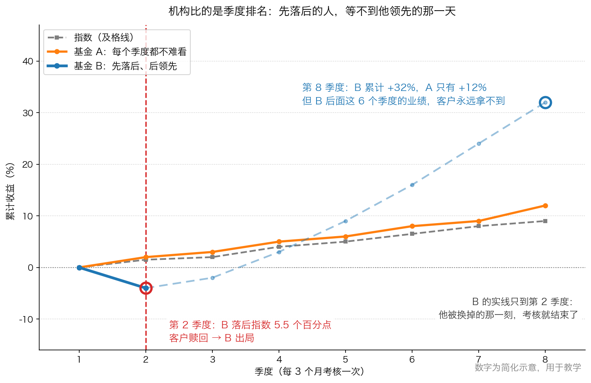

# 第 0 章：短期相对表现竞赛

> 本章你将：
> - 知道今天市场上"出钱的人"和"做决定的人"为什么不是同一个，以及这件事从什么时候开始
> - 用一个考试的类比，一次分清"绝对表现"和"相对表现"
> - 明白基金经理最怕的往往不是亏钱，而是排名靠后——以及这会让你的钱遭遇什么
> - 亲手算出"规模"是怎么变成收益的敌人：管 20 亿元和管 100 亿元，能买的公司差多少
> - 看懂机构被迫放弃的那一片市场，为什么可能正是你的猎场
> - 回答"这对我的钱包意味着什么"：以后有人给你推荐基金，你先问一句"它被什么绑着"

Week 4 我们站在华尔街的大门口，看清了它靠什么吃饭：佣金、承销费、管理费——**它赚的是"你动手"的钱，不是你赚钱的钱**。这一周我们把镜头往里面推一层：真正替你把钱投出去的那个人，到底在什么样的处境里做决定。你会看到一个有点荒诞的场面：一群聪明人，被一堆自己定下的规矩绑住手脚，然后被迫在你的钱上做动作。这一章先讲清楚这场"表演竞赛"的规则。

---

## 0.1 出钱的人和做决定的人，第一次分开了

先讲一个生活场景。

假设你不会做饭，也懒得学。你有两个选择：一是自己下班去菜市场，挑菜、砍价、拎回家；二是请一个"代买菜的人"，他同时替一千户人家买菜，买什么、什么时候买、买多少，全由他定。

第二个选择听起来很省事。但你马上会想到一个问题：**他一次要照顾一千户人家的口味，那他到底按谁的口味买？**

这就是过去七十年里，投资世界发生的那件最大的事：**出钱的人和做决定的人分开了。**

- **出钱的人**是你：把工资、年终奖、养老储备投进去的人。
- **做决定的人**是**机构投资者**——拿别人的钱、替别人做投资决定的专业组织。他们的钱不是自己的，是客户的。

> 💡 **换个说法：** 机构投资者就是"职业代买菜的人"。他们拿着几千户人家的钱，每天必须买点什么。

这件事不是一直如此。原书给了几个时间点，我们按顺序看（都在 p47–p48）：

- **二战之后**，企业的养老金、退休储蓄越来越多。职业资金管理人管理的钱，从 **1950 年的 1070 亿美元**，涨到了 **1968 年的超过 5000 亿美元**（p47）。算一下：18 年涨了不到 5 倍。
- **持股比例**：机构投资者在所有美国公开交易股票中的持有比例，从 **8% 上升到 45%**（p47）。也就是说，市场上将近一半的股票，背后站的是"替别人管钱的人"。
- **交易量**：机构占据了证券交易市场**近 3/4 的交易量**（p48）。每天成交的单子里，四单有三单是机构下的。

然后是两条改变游戏规则的规矩：

1. **1974 年**，美国通过了一部关于雇员退休收入保障的法律，要求机构投资者成为未来退休雇员的**信托人**——"信托人"这个词听着专业，意思很朴素：**你替别人看管东西，就必须像看管自己的东西一样小心。** 配套的"谨慎投资者标准"要求养老基金只能做"谨慎的投资者"会做的投资（p47）。
   > 💡 **换个说法：** 就像你把孩子托给邻居照看，你有权要求他"像对自己孩子一样上心"。这就是信托责任。
2. **1979 年**，美国劳工部裁定：这条"谨慎"标准适用于**整个投资组合**，而不是组合里的**单只证券**（p48）。这句话的威力你得细品：以前是"你买的每一样东西都得是安全的"；裁定之后变成"只要这一篮子整体看起来还算稳，里面某一样东西有多危险，可以不管"。

卡拉曼对这条变化的评价很直接：这为"忽略每项投资风险、以投资组合为中心的投资策略"敞开了大门（p48）。他还说了一句很刻薄的话：

> "实际上，许多资金管理人所持有的短期相对回报定位已经让“机构投资者”成为了一个自相矛盾的术语。"（p48）

"自相矛盾"在哪？我们下一节讲。

> 🇨🇳 **落到 A 股/港股：** 你身边的"机构"长得是这样——**公募基金**（你在手机银行、券商 App 里申购的那些）、**社保基金和养老金**、**保险资金**（你交的保费的一部分）、**券商资管**、**私募基金**。港股那边还有强积金（香港的强制性退休储蓄）。它们和原书讲的美国养老金本质是同一类东西：拿别人的钱、按规矩办事、定期要向人交代。

---

## 0.2 什么叫"比排名，不比赚钱"

现在讲本周第一个必须彻底搞懂的概念。它的重要性远超它看起来的样子。

先看一个考试的场景。

一个班考完试，有两个孩子：

- 小明考了 **85 分**。这次题目特别简单，全班平均 **92 分**。小明是班里倒数第五。
- 小红考了 **52 分**。这次题目特别难，全班平均 **40 分**。小红是班里正数第三。

请问：谁的成绩更好？谁更该被表扬？

- 如果你关心的是**分数本身**（85 比 52 高），小明更好。这叫**绝对表现**。
- 如果你关心的是**名次**（倒数第五 vs 正数第三），小红更好。这叫**相对表现**。

**绝对表现**：只看自己的钱是变多了还是变少了。年初 10 万元，年末 11 万元，你的绝对表现就是赚了 10%。

**相对表现**：拿自己的成绩去跟一个标尺比。这个标尺通常是一个**指数**（比如沪深 300 指数），或者是同行的平均成绩（原书 p50）。

原书给的定义是：

> "相对表现是指不是以一种绝对值标准来评估投资业绩，而是根据与股市指数，如道琼斯工业平均指数或标准普尔 500 指数，或者其他投资人的业绩的比较来衡量业绩。"（p50）

现在看关键的一步。当你改用"名次"来考核一个人时，**你实际上换掉了他每天问自己的那个问题**：

- 用绝对表现考核时，他每天问的是："我买的这个东西，值这个价吗？"
- 用相对表现考核时，他每天问的是："别人下一步会买什么？我能不能抢先一步？"

第二个问题听起来也没错，但它是**投机**，不是投资——这是 Week 3 讲过的分界线。原书把这一点讲得非常透：

> "追求相对表现的投资者制定决策时的依据并不是独立和有目的的分析，他们的行为实际上就像是在投机。他们试图猜测其他人下一步打算做什么，然后抢先一步先做，而不是理性判断哪些股票和债券具有吸引力。"（p50）

而且这个游戏还有一个死循环：

> "问题是，当一名经理人正试图猜测别人下一步将怎么做的时候，其他人也在做着同样的事情。这让这项任务变得越来越复杂：猜测别人不能猜测些什么。依此类推。"（p50）

> 💡 **换个说法：** 这就像在一个没有主持人的晚宴上，所有人都在猜"别人什么时候起身离席"。你猜别人，别人猜你猜别人——没有人真的在吃饭。

原书对这一整件事下的判断只有一句，但分量很重：

> "没有人在短期相对回报竞赛中获胜。"（p51）

为什么？因为短期价格波动本身是随机的；而为这件事花掉的体力和脑力，本来可以用来找真正的长期机会。结果是客户只拿到普普通通的回报，只有经纪人从活跃的交易里赚到了好处（p51）——这句话又和 Week 4 讲过的"华尔街赚你动手的钱"扣上了。

> 📌 **划重点：** 相对表现不是"错的"，它是一种**错位的考核**。它把"我有没有赚到钱"悄悄换成了"我有没有比别人难看"。考核什么，人就会变成什么。

> ⚠️ **易踩坑：** "跑赢指数"不等于"赚到钱"。假设某年指数跌了 30%，你的基金跌了 25%，销售会告诉你"我们大幅跑赢基准 5 个百分点"。你的钱包呢？少了 25%。**评估任何一笔投资，第一步永远是看绝对数字。**

> 🇨🇳 **落到 A 股/港股：** 打开任意一份公募基金季报，你会看到"报告期内基金份额净值增长率及其与同期业绩比较基准收益率的比较"这张表。左边是你的实际收益，右边是"及格线"。**先看左边的绝对数字，再看两边的差距。** 很多宣传材料只把右边的差距放大给你看。

---

## 0.3 为什么"排名靠后"比"亏钱"更可怕

现在你知道了考核标准是"名次"。接下来要看清的是：这套标准怎么一步步改变一个人的行为，最后改变你的钱。

**第一步：他收的钱，是按规模算的，不是按业绩算的。**

原书讲得很直白：多数资金管理人的报酬，是根据**所管理资金的规模的一定比率**来支付的，而不是根据业绩（p49）。这里的"比率"就是**管理费**——你投进去的钱，每年被抽走一个固定百分比。它是一种"按你投入的本金收费"的收费方式，A 股公募基金的管理费就写在基金合同里，每天从基金资产里计提，你甚至感觉不到它被扣了。

于是产生了一个动机上的错位：**管理人最想要的是"规模变大"，而规模变大不等于"回报变好"。** 原书的原话是：

> "尽管一项资金管理业务往往会随着所管理资产规模的增加而赚更多的钱，然而获得出色投资表现却越来越难。资金管理人最大的利益与客户最大利益之间的冲突往往以有利于管理人的方式收场。"（p49）

**第二步：客户会换掉表现最差的经理人。**

这一步才是真正的紧箍咒。原书说，因为客户经常会换掉表现最差的经理人（也因为经理人生活在这样的恐惧中），多数经理人试图避免脱离大众：**拿到平均回报的经理人，失去客户的可能性，大幅低于表现最差的经理人。** 于是"普普通通"变成了一种可以接受的结果（p49）。

**第三步：于是"出错"成了比"亏钱"更严重的事。**

请看这句原书里最扎心的判断：

> "出错的成本远高于金钱上的损失，包括可能会造成不利的销售暗示，以及自己的职业生涯受到影响。"（p53）

翻译一下：如果你跟着大家一起买错了，那是"市场不好"，大家都错，没人怪你；如果你一个人逆着大家买，错了就是你一个人的锅，可能影响的不只是业绩，还有你的工作。所以——很少有人做非常规的投资，也很少有人敢在大家还看好时给出卖出建议。

**第四步：为了不落后，他必须待在最热闹的地方。**

把所有线索连起来：考核看排名 → 落后会被换掉 → 出错代价极高 → 于是最安全的姿势是"和多数人保持一致"。原书用了一个画面来形容这种竞赛：

> "就像狗会追自己的尾巴一样，多数机构投资者已经就短期相对回报展开了竞赛。"（p49）

图里画的是两个基金经理的八个季度（两年；数字为简化示意）：**基金 A** 每个季度都不算难看，八个季度下来累计 +12%；**基金 B** 前两个季度落后（第 2 季度落后指数 5.5 个百分点，排名倒数），从第 3 季度开始发力，八个季度累计 +32%。结局是：B 在第 2 季度就被客户赎回了——**他后面那 6 个季度的业绩，客户永远拿不到。**

> 📌 **划重点：** 这张图是本课程里最重要的一类图。它说明的不是"运气不好"，而是**考核周期决定了谁能活到收获的那一天**。你要找的基金（或者你自己），必须是**不需要在三个月内证明自己**的那种。

还有一个角色要认识：**养老金顾问**。原书提到，这类顾问会对大量资金管理人评估业绩、概括投资风格，再给客户建议；因为他们的建议能极大影响一家基金公司的生意，所以基金经理面临的压力会更大（p50）。

> 💡 **换个说法：** 这就像公司里请了一位外部评委，每季度给所有部门打分，而你的年终奖和饭碗都取决于他的打分表。你会怎么做？多数人会做那个"不会被打低分"的选择，而不是"对公司最好"的选择。

原书还讲了一个很妙的古罗马故事（p51–p52）：古罗马修拱门时，脚手架一拆，工程师就站到拱门下面去——**如果拱门塌了，他是第一个知道的。** 所以他对拱门质量的关心，其实是出于对自己的关心。

> "如果拱门倒塌，他就是第一个知道的。"（p51）

卡拉曼用这个故事说明一件事：**如果资金管理人把自己的钱和客户的钱放在一起，他的关注点会立刻从"猜别人怎么想"转向"怎么在控制风险的前提下把回报做到最大"**（p52）。这句话请你记住，第 4 章我们会把它翻过来用在你身上。

> 🇨🇳 **落到 A 股/港股：** 每年年末，市场上都会讨论"基金排名战"；每到季末，都会有人分析"基金重仓股调仓"。这些讨论不是八卦，它们背后是真实的压力：**排名影响明年的销售，销售影响管理规模，规模影响管理费收入。** 你以后看到"冠军基金"三个字时，先想一件事：它是靠什么拿到冠军的，以及**为了拿这个冠军，它承担了什么风险。**

---

## 0.4 规模：管得越多，能买的东西越少

很多人有一个直觉：钱多好办事。在投资里，这条直觉是**反的**。

原书给了一个非常具体的例子（p54），我们完整走一遍。

假设一家很大的机构里，有一位经理人管着 **10 亿美元**的组合。他给自己定了三条规矩：

1. 为了"合理有度地多样化投资"，他最多买 **20 只股票**；
2. 平均下来，每只股票最多投 **5000 万美元**（10 亿美元除以 20）；
3. 为了避免持有卖不掉的股票，对任何一家公司的持股，不能超过这家公司**流通股的 5%**。

现在算一道简单的账：如果我最多只能买一家公司流通股的 5%，而我想买 5000 万美元，那么这家公司的流通市值**至少**得是多少？

用除法：5000 万美元除以 5%，等于 **10 亿美元**。

结论：**这个经理人只能买市值 10 亿美元以上的公司。** 而 1991 年年初，全市场只有 **559 只股票**满足这个条件（p54）。

原书对这一段的评价是：

> "这并不是一个所有经理人都必须遵守的专制规定，是投资组合的规模制定了这样的限制规定。然而，大型投资组合经理人们的客户是不幸的，就像这个例子中的客户一样，成千上万的企业自动被排除在投资考虑范围以外，这样做完全没有考虑到客户的利益。"（p54–p55）

把这条规则放大到不同规模的基金，效果是这样的（以下为**简化示意数字**，用于教学，算法照抄原书 p54 的思路）：

| 基金规模 | 分给 20 只股票，每只平均买多少 | 被买的公司流通市值至少要多少（不超过 5%） |
|---|---|---|
| 20 亿元 | 1 亿元 | 20 亿元 |
| 50 亿元 | 2.5 亿元 | 50 亿元 |
| 100 亿元 | 5 亿元 | 100 亿元 |
| 500 亿元 | 25 亿元 | 500 亿元 |

看最后一行：**一只 500 亿元的基金，想买满 20 只股票，就只能在那几百家最大的公司里挑。** 而 A 股加上港股，公司总数是几千家。

> 💡 **换个说法：** 一个 100 人的旅行团要找餐厅吃饭，能一次坐下 100 人的餐厅就那么几家，所以他们的行程永远是那几家连锁店；而三个人的小团，可以钻进巷子里吃那家只有六张桌子的小店。**规模小，是一种被低估的优势。**

> 📌 **划重点：** 机构的收益不是被"水平不够"拖累的，很大一部分是被**规模**拖累的。规模越大，可选的东西越少，动作越重，退出越难。原书把这类限制称为"机构投资者自愿接受的约束"（p55）——下一章我们专门讲它。

> 🇨🇳 **落到 A 股/港股：** 这只基金想买一家市值 40 亿元的小公司，按 5% 算最多能买 2 亿元——对它 500 亿元的规模来说，这 2 亿元只占 0.4%，就算翻倍也改变不了整体业绩。所以它**根本不会去看**。这就解释了两件事：为什么机构重仓股高度集中在少数大公司里；为什么那些没人看的小公司、冷门股、被指数踢出去的股票，价格常常错得离谱。**机构进不去的地方，才轮得到你。**

---

## 0.5 这一切跟你有什么关系

你可能会想：我又不是基金经理，我操心他们干嘛？

原书给了两个理由，一个防御，一个进攻：

> "投资者必须试图了解机构投资者的心理，理由有二：第一，机构主导了金融市场中的交易，那些忽视机构行为的投资者会周期性地受到伤害；第二，在被多数机构投资者排除在外的证券中可能存在充足的投资机会。"（p66）

**第一个理由是防守。** 机构占了近 3/4 的交易量（p48），它们的钱能直接影响价格。你不懂它们在干什么，就会周期性被打到。举几个你在 A 股/港股里会碰到的场景：

- 一只股票因为被调出某个重要指数，在生效日被"被动卖盘"砸下来——这不是公司变差了，是有人必须卖（第 3 章会详细讲这件事）。
- 一只小盘股业绩不错，但股价常年不动——因为机构进不来，没有买盘。这不代表它没价值。
- 一只大公司股票被所有基金抱着，贵得离谱——因为谁都不敢先卖。这不代表它值那个价。

**第二个理由是进攻。** 机构不能去的地方，就是你的猎场。那些"被多数机构投资者排除在外的证券"，可能因为**没有人研究、没有人买**而长期打折。原书用了下面这个说法：

> "从投资大象们所丢弃的碎屑中挑选股票能够带来回报。"（p66）

> 📌 **划重点：** 你不需要打败机构，也不需要比他们聪明。你只需要知道**他们不能做什么**。他们不能空仓、不能买小公司、不能三年不涨、不能第一个季度就落后、不能在公司没人看得上时买入。这些"不能"，就是留给你的位置——第 4 章我们会把这句话变成一套完整的优势清单。

> ⚠️ **易踩坑：** 不要把"机构不买"直接等同于"值得买"。机构不买的理由有时候是"太小了买不进"，有时候是"这家公司真的有问题"——这两种情况长得一模一样，必须靠你自己去看公司（Week 2 学的三个数字就是干这个用的）。

---

## ✍️ 想一想

1. **你的年终奖如果按"部门内排名"来发，而不是按"你实际做出了多少成果"来发，你的行为会怎么变？** 请具体写出三条你会改变的做法。
2. 假设你买的一只基金，某年赚了 8%，而它跟踪的指数那一年涨了 20%。销售说"我们在震荡市里守住了正收益"。你觉得这只基金今年算成功还是失败？要回答这个问题，你还需要知道什么？
3. 一家 800 亿元规模的基金，和一家 8 亿元规模的基金，同时看上了一家市值 30 亿元的小公司。它们各自会怎么做？谁更可能在这笔投资上赚到钱？为什么？

> 💡 **参考思路：**
>
> 1. 如果按排名发钱，你会自然地做三件事：① 尽量和部门里多数人保持一致，不做别人没做的事（因为与众不同一旦错了就是你一个人的责任）；② 把精力花在"让领导看见"上，而不是花在真正难的那部分工作上；③ 拒绝那些"短期看不出成绩、三年后才见效"的项目。**这就是基金经理的处境**——他不是一个道德有问题的人，他是一个在特定考核表下做理性选择的人。
> 2. 单看绝对数字，赚了 8% 是赚钱的，但要看两件事：①**这一年市场整体涨了多少**（如果人人都在赚钱，8% 说明它错过了行情）；②**它承诺的是什么**。如果它的业绩比较基准是那个涨了 20% 的指数，那它今年是明显失败的。反过来，如果那一年指数跌了 30% 而它赚了 8%，那才是真的了不起。**关键不在于"赚没赚"，而在于"该拿到的有没有拿到"。**
> 3. 800 亿元的基金：按"不超过流通股 5%"算，它最多能买 1.5 亿元，占自己规模不到 0.2%，就算这家公司翻倍，对基金整体几乎没影响；而且它一买就会把股价推高，一卖就会把股价砸下去。所以它大概率**直接不看**。8 亿元的基金：1.5 亿元占它规模将近 19%，是一笔能改变业绩的重仓；而且它进出对市场冲击小。**所以小基金在小公司上更有优势。** 但要注意：优势只是"有机会"，能不能赚到钱还要看这家公司到底值不值这个价。

---

## 🧮 算一算

**情境（以下公司为简化示意数字，用于教学）：**

某基金规模 **20 亿元**，它的规矩是：① 大致持有 **20 只股票**；② 对任何一家公司的持股，不超过该公司**流通股的 5%**。

现在市场上有 5 家候选公司：

| 公司 | 流通市值 |
|---|---|
| 甲公司 | 15 亿元 |
| 乙公司 | 45 亿元 |
| 丙公司 | 80 亿元 |
| 丁公司 | 260 亿元 |
| 戊公司 | 600 亿元 |

请一步步算：

**第 1 步：这只基金平均每只股票能投多少钱？**

20 亿元分成 20 份：20 除以 20，等于 **1 亿元**。

**第 2 步：想投满 1 亿元，被买的公司流通市值至少要多少？**

因为最多只能买流通股的 5%，所以"1 亿元"必须是"流通市值"的 5%。反过来求流通市值，就是 1 亿元除以 5%：1 除以 0.05，等于 **20 亿元**。

**第 3 步：上面 5 家公司里，有几家进得了这只基金？**

标准是流通市值不低于 20 亿元：

- 甲公司 15 亿元 → 不够，**买不了**；
- 乙公司 45 亿元 → 够；
- 丙公司 80 亿元 → 够；
- 丁公司 260 亿元 → 够；
- 戊公司 600 亿元 → 够。

所以 **5 家里有 4 家能买**。

**第 4 步：如果这只基金规模涨到 100 亿元，同样的规矩，还剩几家能买？**

先算每只股票平均能投多少：100 亿元除以 20，等于 **5 亿元**。
再算公司流通市值的门槛：5 亿元除以 5%，等于 **100 亿元**。
按"不低于 100 亿元"重新筛：甲公司、乙公司、丙公司都不够，只剩丁公司（260 亿元）和戊公司（600 亿元）。

**5 家里只剩 2 家能买。**

**第 5 步：甲公司这种"买不了"的公司，如果这只基金非要买，最多能买多少？**

规矩是硬上限，所以按 5% 算：甲公司流通市值 15 亿元，乘以 5%，等于 **7500 万元**——连 1 亿元的"平均仓位"都填不满，更不用说 100 亿元规模时的 5 亿元了。

**结论：** 基金规模扩大 **5 倍**（20 亿元变成 100 亿元），可选的公司从 **4 家**掉到 **2 家**。原书说的一点都没夸张：**投资组合的规模，自己就制定了这些限制规定**（p55）。

---

## ✅ 小测验

**1. 关于"相对表现"和"绝对表现"，下面哪个说法是对的？**

A. 相对表现就是"赚了多少钱"，绝对表现就是"排第几名"
B. 相对表现是把成绩跟指数或同行比较；它会把"我有没有赚钱"悄悄换成"我有没有比别人难看"
C. 只要跑赢了指数，就说明这一年投资是成功的
D. 相对表现只对个人投资者有意义，机构不看排名

**2. 原书说，基金经理最害怕的往往不是"亏钱"，而是下面哪一件事？**

A. 客户发现他买的公司基本面变差
B. 他的组合里持有太多现金
C. 在同类排名里落到最后，导致客户流失、职业生涯受影响
D. 他买的股票涨得太快，来不及加仓

**3. 一只 100 亿元的基金，规矩是"持有 20 只股票、每只不超过目标公司流通股的 5%"。它想买满仓位，被投资公司的流通市值至少要多少？**

A. 20 亿元
B. 100 亿元
C. 500 亿元
D. 没有限制，只要公司好就行

> **答案与解析**
>
> **1. B。** 相对表现的定义就是拿成绩去跟一个标尺（指数、同行）比（p50）。A 把两个词说反了。C 错在"跑赢"不等于"赚到"——指数跌 30%、你跌 25%，你确实跑赢了，但你的钱包少了 25%。D 错得正相反：**最爱看排名的恰恰是机构**，因为它们的考核周期是季度。
>
> **2. C。** 原书说得很清楚：客户经常会换掉表现最差的经理人，而拿到平均回报的经理人失去客户的可能性大幅低于表现最差的（p49）；"出错的成本远高于金钱上的损失"，其中就包括职业生涯受影响（p53）。A 不准确——机构对基本面的关注本来就被各种约束削弱了（第 1 章会讲）。B 在某种意义上说反了：现金少是**约束**（很多机构不允许持有太多现金），不是他最怕的事。D 与事实相反，涨得快对排名是好事。
>
> **3. B。** 100 亿元分给 20 只股票，每只 5 亿元；5 亿元除以 5% 等于 100 亿元。A 是 20 亿元规模时的答案（每只 1 亿元，门槛 20 亿元）。C 是 500 亿元规模时的门槛。D 错在忽略了原书 p54 的那条硬约束：**不是有没有好公司的问题，而是"买得进买不进"的问题。**

---

## 📖 回到原书

- 对应原书 **第三章**，`raw/安全边际-中文版/page_047.md` ~ `page_054.md`（原书 p47–p54）。
- **建议精读**：
  - p49–p51（"资金管理业务"到"短期相对表现竞赛"）——这一节是本章的心脏，把"管理费按规模收""客户换掉最差经理人""猜别人的死循环"三件事讲透了；
  - p54（"投资组合规模的暗示"）——那个 10 亿美元、20 只股票、559 只股票的例子，值得你拿纸笔跟着算一遍。
- **可以略读**：p47–p48（美国养老金规模增长、1974 年法律、1979 年裁定）。这些是美国的具体历史，你只需要记住三件事：机构变成了市场主力、机构的钱是别人的、考核标准从"单只证券安不安全"变成了"整个组合看起来稳不稳"。
- **原书金句（逐字引用）**：
  > "就像狗会追自己的尾巴一样，多数机构投资者已经就短期相对回报展开了竞赛。"（p49）
  >
  > "没有人在短期相对回报竞赛中获胜。"（p51）
  >
  > "投资只有在出现了诱人的机会才会进行，而不会仅仅是为了随波逐流。"（p52）
  >
  > "资金管理人最大的利益与客户最大利益之间的冲突往往以有利于管理人的方式收场。"（p49）
