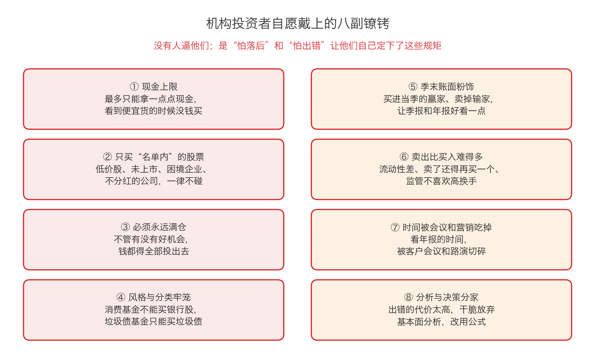

# 第 1 章：机构的八副镣铐

> 本章你将：
> - 搞懂"自愿接受的约束"这个说法：没有人逼他们，是他们自己给自己定的规矩
> - 逐条认清机构的八副镣铐：现金上限、名单限制、必须满仓、风格牢笼、季末粉饰、卖出太难、时间被吃掉、分析决策分家
> - 知道每一副镣铐在 A 股/港股 里长什么样，以及它会在什么时刻伤到你
> - 亲手算一道题：一只被六条规矩绑住的基金，它的"可选股票池"被砍掉了多少
> - 学会把这份清单当工具用：以后看任何一只基金，先翻它的"投资范围"
> - 回答"这对我的钱包意味着什么"：你买的不只是基金经理的水平，你还买了他身上的所有规矩

上一章我们说清了考核标准：**机构比的是季度排名，不是长期赚钱。** 但光有考核标准还不够，还得有配套的"行为规范"——排名压力会逼着人做什么、不做什么。这一章就把这些规矩一条条摊开。

原书里有一个很关键的说法：这些限制**不是别人强加的**，多数是机构**自愿接受**的（p55）。这一点非常重要，因为它意味着：**这些镣铐是可以不戴的——只是他们不敢摘。**

---

## 1.1 什么叫"自愿接受的约束"

先看原书那句话的上下文：

> "这并不是一个所有经理人都必须遵守的专制规定，是投资组合的规模制定了这样的限制规定。"（p55）

再往后一点，卡拉曼给出了这个说法的名字：

> "我将这种类型的限制看成是机构投资者自愿接受的约束。"（p54）

> 💡 **换个说法：** 想象一位健身教练给自己定规矩："我只接早上七点的课""我不收体重超过 100 公斤的学员""我不用任何需要器械的动作"。没有人逼他，这些规矩甚至让他的工作变简单了。但规矩一旦定下，一大批客户他就接不了，一大批有效的训练方法他也用不了。**他的"简单"，是用"效果"换来的。**

机构为什么要自找麻烦？大致三个原因：

1. **为了合规**：法律要求养老金当"信托人"（Week 5 第 0 章讲过），要证明自己"谨慎"，最省事的办法就是把规矩写死；
2. **为了好解释**：出了问题，一句"我们按合同规定操作的"就能交代过去；
3. **为了省事**：规矩让决策变简单。当你有几千只股票要选的时候，"先把不符合条件的删掉"确实能省下大量时间。

代价是什么？原书给了两句总结：

> "将资金配置在严格定义的类别中能够简化投资决策，但只会让你付出回报下降的代价。"（p57）

> "在任何时候都保持满仓投资肯定简化了投资任务。投资者只要选择能找到的最好的投资就可以了。"（p55）

**简化，是这些约束的共同点；回报下降，是这些约束的共同代价。**

---

## 1.2 八副镣铐：先看全图

这张图是本章的提纲。接下来的三节，我们一条条拆开讲：它是什么、机构为什么要它、代价是什么、在 A 股/港股 里怎么认出来。

---

## 1.3 第 1 到第 3 副：钱、名单、仓位

### ① 现金上限：手里几乎不能留钱

**是什么**：一些机构给投资组合中持有的**现金**设置了限制（p55）。所谓现金，就是还没买成股票的钱。

**为什么**：因为客户是"满仓付钱"的。客户把钱交给你，是让你去买股票的；如果你拿着 30% 的现金不动，客户会问："我为什么不自己去存银行？"

**代价**：看到便宜货的时候没钱买。这是最要命的一条——**下跌对价值投资者来说本来是好消息，可前提是你手里有钱。**

> 🇨🇳 **落到 A 股/港股：** 打开一只股票型基金的合同，你常会看到"股票资产占基金资产的比例为 80%–95%"这样的字句。这句话的意思是：**它最多只能拿 20% 的现金。** 所以当市场大跌、遍地便宜货的时候，这只基金最多只能动用那 20%。而你可以动用 100%。

### ② 只买"名单内"的股票

**是什么**：原书列举了一串机构**不会考虑**的东西（p55）：

- 价格低于 **5 美元**的股票；
- **没有上市**的证券；
- 遇到财政困境或者**陷入破产**的企业的股票和债券；
- 目前**没有支付股息**的股票。

**为什么**：这些标签都很容易被拿来说事。"我们买了低价股"——客户会觉得你不专业；"我们买了快破产的公司"——客户会打电话来问；"我们买了不分红的公司"——客户会说你不重视股东回报。

**代价**：这四条几乎把"便宜货的传统产区"整个划走了。原书后面讲到"烟蒂式股票"——**低价、使用高杠杆的股票**——说它们可能非常像**认股权证**（p57）：回报潜力巨大，风险也巨大。

> 💡 **什么是认股权证？** 你可以把它理解成一张"以后按约定价格买股票的权利凭证"。就像你看房时交的认购意向书：先锁一个价格，将来想买就按这个价买，不想买就作废。它本身不是股票，但它的价格会跟着股票剧烈波动。
>
> 🇨🇳 **落到 A 股/港股：** A 股现在基本没有权证了（历史上短暂出现过），但港股有大量"**窝轮**"（英文 warrant 的音译），是散户非常活跃的一个市场。

> 🇨🇳 **落到 A 股/港股：** 四条限制的本地版本是这样的——**低价股**（两三块钱的股票，港股叫"仙股"）、**非上市股权**、**ST 股和破产重整公司的股票债券**、**多年不分红的公司**。这四类东西，机构几乎一律不碰。请你记住这句话：**它们不碰，不代表它们没价值；它们不碰，有时恰恰是因为"制度不允许"。**

### ③ 必须永远满仓

**是什么**：很多机构把自己的任务定义为"选股票"，而不是"选择市场时机"（p55）。他们相信客户已经自己决定了什么时候入市，付钱只是让自己把钱**满仓投出去**。

**为什么**：这和上一章的排名压力完全一致。原书说得很直接：

> "如果一个人的目标是在没有落后太多的情况下打败市场（尤其是在短期内），那么保持满仓投资就是有道理的。为了不让自己输给市场，必须将那些闲置下来的资金再次投入市场进行投资。"（p56）

**代价**：原书列了两条（p55–p56）：一是"投资价值的重要标准变得模糊不清，或者不复存在"——因为"相对诱人"成了唯一的准绳，"绝对便宜"反而没人问了；二是"**高昂的机会成本**——指错过了下一个出色的投资机会——并承受了出现巨大损失的风险"。

> 💡 **什么是机会成本？** 你只有一笔钱，做了 A 就不能做 B。因为选了 A 而错过的、B 本来能给你的收益，就是机会成本。比如你满仓买了一只涨了 3% 的股票，而同一时间另一只股票跌了一半——你错过的不是 3%，是那个"跌一半"的机会。

这一条太重要了，**下一章整章都在讲它**。这里先记住一句原书的判断：

> "在投资时，许多时候最应该做的事情就是什么都不做。"（p56）

---

## 1.4 第 4 到第 6 副：分类、报表、卖出

### ④ 风格与分类牢笼：只能待在自己的格子里

**是什么**：原书说，机构经常犯的一个错误是把资产分配在**过于细分的类别**上（p56）：

- 一只以股票投资为主的投资组合，不能明显持有**破产企业的债券**；
- 一只**垃圾债**（高收益债，指信用等级低、利息高的债券）基金只能买垃圾债，哪怕当下没有诱人的机会；
- 一只**市政公债**（美国地方政府发的债）组合，通常不能持有需要缴税的债务工具。

**为什么**：因为基金的"合同"就是这么写的。基金经理是拿了牌照去做某一件具体事的，越界就是违规。

**代价**：卡拉曼的反驳很精彩（p56–p57）——**只要价格合适，一家破产企业的债券，完全可能具备和股票一样的风险和回报特征；一只公用事业类股票，可能像高等级债券一样产生稳定现金流；而"烟蒂式"股票可能非常像认股权证。** 把资产硬塞进标签里，等于人为地把这些可能性全部砍掉。

原书还举了一个特别有说服力的例子：当**杠杆收购**（LBO，指借钱把一家上市公司整个买下来，用公司自己的现金流还债）成为机构里非常流行的一个类别时，**最初那几次交易里丰厚的回报已经拿不到了**（p57）。

> 💡 **换个说法：** 一个类别被历史高回报吸引来太多钱之后，回报就没了。这就像一条街上第一家奶茶店很赚钱，半年后开了十家，谁都赚不到钱。**"这个类别过去很赚"从来不是"这个类别现在值得买"的理由。**

> 🇨🇳 **落到 A 股/港股：** 这个牢笼在 A 股里非常显眼。你随便打开一只基金的合同，都能看到"投资范围"：
>
> - "本基金投资于**消费行业**股票的比例不低于非现金基金资产的 80%"——这句话意味着：**哪怕银行股再便宜，这只基金也不能买；哪怕某只消费股已经贵得离谱，它也必须在消费股里选。**
> - "本基金投资于**债券**的比例不低于基金资产的 80%"——**固收+** 类产品的股票仓位被死死框住。
> - 各种主题基金、行业 ETF、指数增强基金，都有自己的格子。
>
> **读者动作：** 以后买任何一只基金之前，翻到"基金的投资范围"那一节，读一遍。**你不是在看它打算买什么，你是在看它被禁止买什么。**

### ⑤ 季末账面粉饰：让报表好看一点

**是什么**：原书给了定义：

> "账面粉饰是指为了让投资组合在季报中看起来表现出色而采取的操作。"（p57）

具体怎么做？为了让投资组合在发给客户的季报里表现不错，一些经理人会**刻意买入当季市场表现最好的股票**，同时**卖出表现大幅落后的股票**。他们还会卖出那些"有着大量**未实现亏损**的头寸"，这样客户就不会在几个月后想起这些严重的错误（p57）。

> 💡 **什么是未实现亏损？** 你 10 元买的股票跌到 6 元，只要还没卖，账面上那 4 元就是"浮亏"（未实现亏损）。一旦卖掉，它就变成"实亏"，写在报表上谁也抹不掉。所以有人宁愿不卖——**不卖，就还能说"它只是暂时跌"。**

**代价**：原书评价得非常不客气——这种行为**明显不合算，也是对客户智商的侮辱，同时也加剧了价格的波动**（p57）。

但请注意原书紧接着的那句话，它和我们的关系最大：

> "尽管如此，因承压的证券的价格会进一步下跌，这种行为可能会为价值投资者创造出诱人的机会。"（p57）

> 💡 **换个说法：** 别人为了把报表做漂亮而被迫卖出的时候，卖出的理由和"这家公司值多少钱"没有半点关系。这种"不是因为基本面、而是因为报表"的卖出，会把价格砸到不合理的位置——**那正是安全边际出现的地方。**

> 🇨🇳 **落到 A 股/港股：** 每到季末、年末，市场上都会出现"基金调仓""抱团股松动""风格漂移"这类讨论；也常有股票在没有任何消息的情况下突然放量大跌。这些动作里，有一部分不是基本面变了，而是**报表要交了**。**读者动作：** 看到某只股票毫无理由地大跌时，第一件事不是恐慌，而是去看有没有它的基本面新闻。如果找不到，再想一想："是不是有人必须要卖？"

### ⑥ 卖出比买入难得多

**是什么**：原书专门用一段讲"为何资金管理人会在卖出时遇到麻烦"，给了三个理由（p53）：

1. **多数投资的流动性不足**——"**流动性**"这个词你以后会经常见到，它的意思很朴素：**能不能在不把价格砸下去的前提下，把手里的东西卖掉。** 一间好卖的铺面叫流动性好，一间只能等特定买家来接的厂房叫流动性差。机构持有的往往是大笔头寸，一卖就把价格砸下去；
2. **卖出会带来额外的工作**——卖完还得再买一个，不然钱就闲置了；而"持有当前的头寸则要容易得多"。又因为时间有限，经理人**没有动机给自己找更多事情做**；
3. **监管不希望组合有太高的调仓率**——原书提到美国证券交易委员会（SEC，相当于美国的证监会；在中国对应中国证监会，在香港对应香港证监会）不希望投资组合有太高的调仓率，所以共同基金的经理人"又多了一条避免卖出的理由"。

原书还给出了一个非常耐人寻味的判断：

> "过久持有所遇到的诸多风险往往低于过早卖出所遇到的风险。"（p53）

> 💡 **换个说法：** 一个基金经理如果"买错了还拿着"，他可以解释"我看的是长期"；如果他"卖早了然后股票涨了三倍"，那他会被客户骂很久。**两边的惩罚不一样，所以人会偏向不动。** 这不是智商问题，是激励问题。

---

## 1.5 第 7 到第 8 副：时间和大脑

### ⑦ 时间被会议和营销吃掉

**是什么**：原书说，机构投资者取得出色表现的一个主要障碍就是**时间有限**（p52）。光是把堆积如山的年报、华尔街研究报告和金融刊物看一遍，就能用掉一整天，而"思考并吸收所有这些资料将需要更长的时间"。与此同时，因为多数资金管理人**总是在寻找更多的资产来管理**，他们除了管理现有客户，还要花大量时间会见潜在客户（p52）。

原书甚至开了一句很辛辣的玩笑：

> "讽刺的是，如果所有的客户，不管是现在的客户还是潜在的客户，都不占用资金管理人的时间，他们也能变得更加富裕，然而要求每隔一段时间召开会议会让每个客户感到安心。"（p52）

**代价**：研究一家公司的生意，本来就是一件慢活儿。当"路演、答谢会、季度沟通"把一天切碎之后，剩下给研究的只有碎片时间。**而投资偏偏是那种"你没有完整地想过一遍，就一定会想漏"的事情。**

> 🇨🇳 **落到 A 股/港股：** 基金经理要管的还不只是客户：渠道（银行、券商、三方平台）要维护、直播要上、季报要写、公司要调研。你能做的事情很简单：**如果一个产品的卖点主要在"人很热情、沟通很及时"，你要多问一句它的研究是怎么做的。**

### ⑧ 分析与决策分家：于是干脆放弃基本面

**是什么**：原书讲了两层（p53–p54）：

**第一层是分工问题。** 许多大型机构把"分析"和"投资组合管理"分成两拨人，**投资组合经理人的地位高于分析师**。组合经理常用"从上往下法"——先看宏观经济、市场风格，再把分析师的建议拼起来做决定。卡拉曼说这种方法**容易出错**，因为做决定的人**没有对自己买入和卖出的证券亲自进行分析**；而那些真正了解企业的分析师，给出建议时反而会被组合经理的"自上而下"偏见带跑。

**第二层是结果。** 出错的成本太高（要写检讨、要被赎回、要影响职业生涯），于是很多专业投资者干脆**完全放弃了基本面分析**（p57）。他们不是克服了困难，而是绕开了困难——用一套公式代替思考。

原书列举了这些"公式派"的工具（p58）：**有效市场假设**（一种认为所有信息都已反映在价格里、因此研究没有用的理论）、**资本资产定价模型**（原书说，这类理论最坚决的三位支持者获得了 1990 年的诺贝尔经济学奖）、**指数化投资**、**战术性资产配置**、**投资组合保险**、**程序交易**。

> "过去几年来，由故意忽略所投资标的基本面的人所管理的资金大幅增加。"（p58）

> 💡 **换个说法：** 一位厨师因为怕被投诉，干脆不看食材了，改看墙上的排行榜点菜；再后来，他连排行榜都不看了，直接按"每桌都上同样的套餐"来做。**这套流程不会出错，但也永远不会好吃。**

第 2 章讲**投资组合保险**和**战术性资产配置**这两种"公式"，第 3 章讲**指数化投资**。它们的共同点是：**都不需要知道自己在买什么。**

---

## 1.6 把八副镣铐连起来看

现在把八条串成一条因果链，你会发现它们不是八个独立的毛病，而是一件事的八个侧面：

**考核看季度排名**（第 0 章）→ **为了不落后，必须满仓、必须和多数人在一起**（③）→ **满仓就得在"允许买的东西"里选**（①②④）→ **允许买的范围很小、时间又被切碎**（⑦）→ **卖出很难、出错很贵**（⑥）→ **于是干脆不看基本面，改用公式**（⑧）→ **大家的公式又都差不多，于是一起买、一起卖**（⑤加剧波动）。

> 📌 **划重点：** 这不是"机构很蠢"，恰恰相反——**这是每一个聪明人在那套考核表下做出的理性选择叠加在一起的结果。** 原书说得很公道：机构投资组合经理人也是人，除了机构包袱，他们还要面对所有普通人都有的东西——对又快又轻松获利的贪婪、对基本一致意见的满足、对股价下跌的害怕（p54）。

而你要做的，不是同情他们，也不是嘲笑他们。**你要做的是收好这份清单**，因为它有三种用法：

1. **看基金**：这只基金被哪几条绑着？它能不能空仓（①③）？能不能买小公司（②）？敢不敢买没人要的东西（④）？它为什么会卖（⑤⑥）？
2. **看股价异动**：一只股票突然大跌，先分清是"公司变了"还是"有人必须卖"（⑤⑥）。这两种下跌的处理方式完全相反。
3. **看自己**：翻回上面八条，**你有哪几条？** 你有没有给自己设"现金上限"（从不留现金）？有没有"名单限制"（只买听说过的大公司）？有没有被迫满仓？有没有在年底为了"今年的成绩单好看"而卖点什么？——**你的镣铐，是你自己亲手戴的，也只能你自己摘。**

第 4 章我们会把这份清单**整体翻过来**，变成你的优势清单。

---

## ✍️ 想一想

1. 一位基金经理说："我不能买那只股票，虽然我也觉得它很便宜，但它不在我的投资范围里。"这句话是借口，还是事实？请分别说出两种情况下你会怎么判断。
2. "卖出比买入难"这一条，如果换到你自己的生活里，会是什么样子？请举一个你自己经历过的、明明该结束却一直拖着没结束的事情，并分析当时的"惩罚结构"。
3. 如果你给自己定一条规矩："我永远不买分红的公司，因为分红要交税"——这条规矩会给你带来什么好处，又会让你错过什么？

> 💡 **参考思路：**
>
> 1. **大部分情况下是事实，但这不重要。** 因为公募基金的"投资范围"写在合同里，越界就是违规，基金经理确实买不了（这是 ④ 分类牢笼）。但**对你来说，理由是什么并不重要，结果才重要**：你付钱请了一个"手脚被绑住的人"来管你的钱。判断方法很简单：去翻这只基金的合同，"投资范围"那一节写得清清楚楚。如果它的范围跟你想让它做的事根本不匹配（比如你想要一个能空仓、能捡便宜的帮手，却买了一只股票仓位不低于 80% 的主题基金），那就是**你选错了工具**，不是他失职。
> 2. 常见的有：一段早该结束的关系、一份早该辞的工作、一门早该放弃的生意。你会发现它们的结构惊人地相似：**继续拖着的代价是"慢慢消耗"，立刻结束的代价是"一次性承认我错了"，而后者在心理上贵得多。** 基金经理也一样——不卖，还能说"我看的是长期"；卖了，就等于在报表上签了字认错。看清这个"惩罚结构"，你才有可能做出对自己真正有利的决定。
> 3. 好处是：省下分红的税，也省去处理零钱的麻烦；账面上你持有的是"全部留存收益再投入"的公司。代价是：① 你放弃了**现金回报**这条最实在的线索——一家能长期派息的公司，往往说明它赚的是**真钱**而不是账面利润（Week 2 讲过现金流和利润的区别）；② 你会错过一大批"成熟、稳定、把利润分给股东"的公司，而这类公司常常是低价区里的常客；③ 你会被吸引到那些"从不分红但故事讲得很好"的公司上——这恰恰是 Week 6 要讲的陷阱。**结论：一条规矩单独看总有道理，但它一旦变成"绝对不看"，就成了一副镣铐。**

---

## 🧮 算一算

**情境（以下公司为简化示意数字，用于教学）：**

某主动股票型基金，规模 **30 亿元**。它的基金合同里有六条规矩：

1. 股票资产占基金资产的比例**不低于 80%**（也就是说，现金最多 20%）；
2. **不买**股价低于 **5 元**的股票；
3. **不买**最近一年**没有分红**的公司；
4. 单只股票不超过**基金资产的 10%**；
5. 单只股票不超过该公司**流通股的 5%**；
6. 至少持有 **20 只**股票。

候选股票池里有 6 家公司：

| 公司 | 股价 | 流通市值 | 最近一年分红 |
|---|---|---|---|
| A | 12 元 | 200 亿元 | 有 |
| B | 4.5 元 | 90 亿元 | 有 |
| C | 18 元 | 40 亿元 | 有 |
| D | 25 元 | 150 亿元 | 无 |
| E | 8 元 | 12 亿元 | 有 |
| F | 30 元 | 350 亿元 | 有 |

**第 1 步：这只基金至少要买多少股票？最多能留多少现金？**

按规矩 1：股票不低于 80%，现金最多 20%。

- 至少要买的股票：30 亿元乘以 80%，等于 **24 亿元**；
- 最多能留的现金：30 亿元乘以 20%，等于 **6 亿元**。

**第 2 步：先按规矩 2 和规矩 3 筛一遍，哪几家被直接排除？**

- B 公司股价 4.5 元，低于 5 元 → **排除**（规矩 2）；
- D 公司最近一年没有分红 → **排除**（规矩 3）。

剩下 A、C、E、F 四家。

**第 3 步：对剩下的四家，每家的"买入上限"是多少？**

上限要同时满足规矩 4（基金资产的 10% = 3 亿元）和规矩 5（流通股的 5%），取**更小的那个**：

- A 公司：3 亿元 与 200 亿元乘以 5% 等于 10 亿元 → 取 **3 亿元**；
- C 公司：3 亿元 与 40 亿元乘以 5% 等于 2 亿元 → 取 **2 亿元**；
- E 公司：3 亿元 与 12 亿元乘以 5% 等于 0.6 亿元（6000 万元）→ 取 **6000 万元**；
- F 公司：3 亿元 与 350 亿元乘以 5% 等于 17.5 亿元 → 取 **3 亿元**。

**第 4 步：把这四家全部买满，能买多少？够不够 24 亿元？**

3 亿元 + 2 亿元 + 0.6 亿元 + 3 亿元 = **8.6 亿元**。

而规矩 1 要求至少买 24 亿元。**8.6 亿元 远远不够，还差 15.4 亿元。**

那这 15.4 亿元怎么办？**只能再去市场上找更多"合格"的公司**——也就是说，这只基金被逼着去买那些**大市值、有分红、股价不低**的公司。它越是被规矩绑住，它的持股名单就越会跟同行重合。

**第 5 步：如果 B 公司的股价从 4.5 元涨到 5.2 元，会发生什么？**

它突然"合格"了（股价不低于 5 元）。反过来——**如果一家原本 5.2 元的公司跌到 4.8 元，它就从"可买"变成"不可买"。**

这就是最荒诞的地方：**公司股价跌了不到 8%（5.2 元到 4.8 元），基本面什么都没变，但因为触发了这条规矩，基金可能不得不把它卖掉。** 这不是判断，这是规则。而市场上每一次这样的"被迫卖出"，都在给别人创造机会。

**结论：** 六条规矩加起来，把 6 家候选公司砍到 4 家可买、再砍到只能买 8.6 亿元。**规矩越多，可选池越窄，持股越集中，行为和同行越像。** 这就是"抱团"背后最朴素的一层机制。

---

## ✅ 小测验

**1. 原书说的"自愿接受的约束"，最准确的意思是？**

A. 客户强迫机构接受的限制
B. 法律强制规定机构必须遵守的规则
C. 不是别人强加的、由机构自己（或由投资组合规模）定下的限制，它们让决策变简单，但代价是回报下降
D. 机构为了客户利益主动放弃的一些高收益机会

**2. 关于"账面粉饰"，下面哪个说法是对的？**

A. 它能让基金的实际收益变高
B. 它是指季末买进当季表现最好的股票、卖出表现落后的股票，好让报表好看；它会加剧价格波动，但可能给价值投资者创造机会
C. 它是法律允许且鼓励的做法
D. 它只影响基金的报表，对股价没有任何影响

**3. 为什么很多机构"放弃基本面分析"、改用公式化的策略？**

A. 因为基本面分析被证明完全无效
B. 因为用公式更赚钱
C. 因为出错的代价太高（排名、客户流失、职业生涯），而公式看起来"不会出错"，还能省下研究和决策的时间
D. 因为监管要求它们必须使用指数化投资

> **答案与解析**
>
> **1. C。** 原书明确说"这并不是一个所有经理人都必须遵守的专制规定，是投资组合的规模制定了这样的限制规定"（p55），并把这类限制称为"机构投资者自愿接受的约束"（p54）。A、B 都错了：这些限制不是外部强加的。D 说反了——它们**损害**客户利益，原书说"成千上万的企业自动被排除在投资考虑范围以外，这样做完全没有考虑到客户的利益"（p55）。
>
> **2. B。** 定义见 p57。A 错：粉饰只改报表的观感，不改真实收益，原书说它"明显不合算"。C 错：原书说它"是对客户智商的侮辱"。D 错：它"加剧了价格的波动"，正因为如此才可能创造机会。
>
> **3. C。** 原书把因果讲得很清楚：出错的成本远高于金钱上的损失（p53），加上时间被会议和营销切碎（p52–p53）、分析与决策分家（p53–p54），于是"许多专业投资者已经完全放弃了基本面分析"（p57–p58）。A 错：那只是"有效市场假设"的主张，而价值投资的基础正是"市场并不是有效的"（p63）。B 错：原书说这些策略"让客户成为试验品并付出昂贵的代价"（p58）。D 错：没有任何监管**要求**必须指数化。

---

## 📖 回到原书

- 对应原书 **第三章**，`raw/安全边际-中文版/page_055.md` ~ `page_058.md`（原书 p55–p58），另需回看 p52–p54（时间、卖出、分析与管理分家）。
- **建议精读**：
  - p55「机构投资者自愿接受的约束」和「任何时候都保持满仓投资」——八副镣铐里最硬的三条都在这里；
  - p56–p57「过于细化的分类」——卡拉曼对"标签"的反驳（破产企业债券、公用事业股、烟蒂股像认股权证）值得逐字读；
  - p57「账面粉饰」——短短一段，把机构的报表动机讲透了；
  - p58「机构投资者放弃基本面投资分析」——这是后面两章的引子。
- **可以略读**：p53–p54（卖出困难的三条理由、分析与决策分家、经理人也是人）。这几段是"解释"，读一遍知道大意即可，不必背。
- **原书金句（逐字引用）**：
  > "将资金配置在严格定义的类别中能够简化投资决策，但只会让你付出回报下降的代价。"（p57）
  >
  > "账面粉饰是指为了让投资组合在季报中看起来表现出色而采取的操作。"（p57）
  >
  > "过去几年来，由故意忽略所投资标的基本面的人所管理的资金大幅增加。"（p58）
  >
  > "尽管如此，因承压的证券的价格会进一步下跌，这种行为可能会为价值投资者创造出诱人的机会。"（p57）
