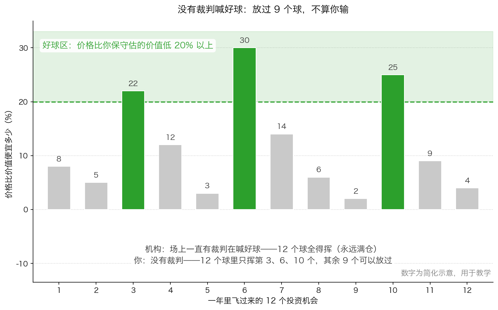
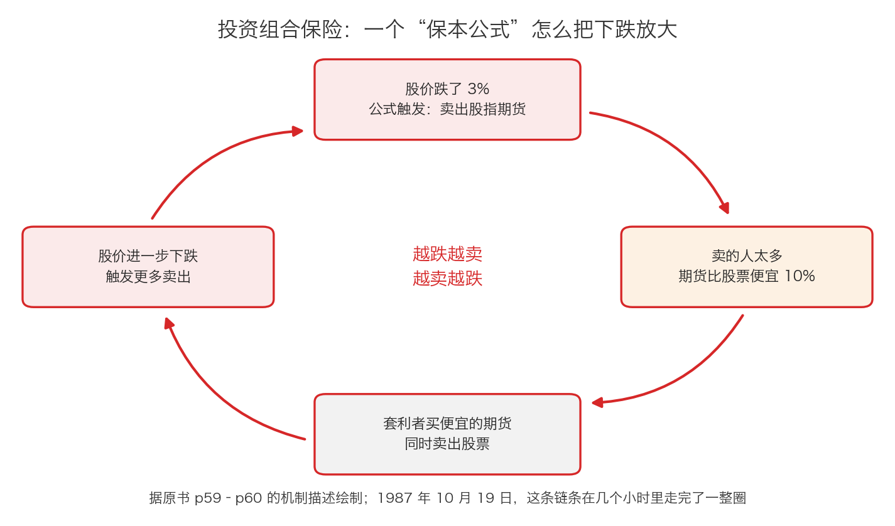

# 第 2 章：永远满仓——被迫挥棒每一次

> 本章你将：
> - 分清楚仓位、满仓、空仓、择时、选股这几个词，知道机构为什么必须满仓
> - 拿到一个能用一辈子的比喻：投资像击球，但没有裁判喊好球
> - 看懂"投资组合保险"这个 1987 年的保本公式，怎么变成了崩盘的加速器
> - 知道"战术性资产配置"为什么在纸上很聪明、在市场上做不到
> - 亲手算出"跌 3% 就卖"这套规则的代价：一次错误就能让你永久少 3%
> - 回答"这对我的钱包意味着什么"：满仓不是纪律，是约束；而"什么都不做"是一种真本事

上一章我们把八副镣铐一条条摊开，其中第 3 副——**必须永远满仓**——值得单独用一整章来讲。原因有两个：第一，它是所有镣铐里对你伤害最大的一条；第二，由它衍生出来的两种"聪明策略"（投资组合保险、战术性资产配置），恰恰是"公式代替思考"最典型的两个样本。

---

## 2.1 先把词说清楚：仓位、满仓、空仓

这一节讲的词，你以后每天都会用到，所以一次讲透。

**仓位**：你的钱里，有多大比例变成了股票（或股票型基金）。

> 💡 **换个说法：** 想象你去吃自助餐。你手里有个盘子（你的全部资金），盘子里装的就是"仓位"。**装满 = 满仓**；**一口没装、全是空盘子 = 空仓**；装了一半，就叫"半仓"。

- **满仓**：钱几乎全部买成了股票。
- **空仓**：钱几乎全是现金（或者存在货币基金里），一点股票都没有。
- **仓位八成**：八成买了股票，两成留现金。

再区分一组容易混的词：

- **选股**：在"要买的东西"里挑最好的。
- **择时**：判断"现在该多买还是该少买"。择时管的是**时机和比例**，不是挑哪一只。

现在看机构为什么必须满仓。原书是这么说的：

> "许多机构将自己的任务看成是选择股票，而不是选择市场时机。他们相信，客户已经根据市场时机作出了判断，并付钱让自己对处在管理下的资金进行满仓投资。"（p55）

这句话要拆开看，它的逻辑是这样的：**"时机是你自己决定的，我只负责选股。"** 基金合同里常常写着"股票资产不低于 80%"，就是这个意思——它替你把"什么时候买"这个问题解决掉了：**永远都在买。**

原书接着说了一句很关键的话：

> "在任何时候都保持满仓投资肯定简化了投资任务。投资者只要选择能找到的最好的投资就可以了。相对诱人成了惟一的投资准绳，无需满足绝对的标准。"（p55）

注意最后半句：**"相对诱人成了惟一的准绳"**。这句话的分量极重。翻译成大白话：

- 如果你可以留现金，你问的问题是："这个东西**绝对**够便宜吗？不够便宜我就不买。"
- 如果你必须满仓，你问的问题就变成了："在这些东西里，**哪一个相对不那么贵**？"——哪怕它其实一点都不便宜。

**标准，就是这样被悄悄换掉的。**

---

## 2.2 满仓的代价：昂贵的"机会成本"

满仓的代价，原书列了两条（p56）：

1. 顶多只会带来普通的回报；
2. 最糟糕的情况是**高昂的机会成本**——"指错过了下一个出色的投资机会——并承受了出现巨大损失的风险"。

第二条我们上一章解释过"机会成本"这个词。这里再补一层：**市场下跌的时候，便宜货是成批出现的。而满仓的人在那个时刻能做的事情只有一件——看着。**

那价值投资者怎么做？原书给了明确的标准：

> "追求长期回报的投资者则不同，只有当投资符合价值的绝对标准时，他们才会进行投资。只有当获得的机会不仅数量充足，而且非常有吸引力时，他们才会选择满仓投资，而在没有满足这两个条件的时候，他们不愿满仓投资。"（p56）

然后就是那句被引用最多的话：

> "在投资时，许多时候最应该做的事情就是什么都不做。"（p56）

问题来了：机构做不到。原书紧接着补了一句：

> "然而，机构中的资金管理人不会采用这种替代方法，除非多数的竞争对手也倾向于什么都不做。"（p56）

### 没有裁判喊好球

有一个非常好用的比喻，可以让你一辈子记住满仓的荒谬（这个比喻在书里更靠后的地方还有完整的一版，Week 7 我们会正式遇到它，这里先用它来讲满仓）：

**投资很像棒球里的击球，但有一处关键不同：这场比赛里没有裁判喊好球或坏球。**

在真实的棒球比赛里，投手投出三个好球，你就出局了。所以你**必须**挥棒——哪怕你知道这个球很难打。

而在投资这场比赛里，**球飞过来，你可以不挥。** 没有人会因为你放过了 100 个球而判你出局。你可以站在那里，一直等到那个又慢又高、正好落在你最喜欢的位置的球，然后再挥棒。

> 📌 **划重点：** 投资是这世界上极少数的、**"不行动"不会受到惩罚**的活动。而机构的问题恰恰是：他们的比赛里有裁判，而且裁判一直在喊"好球"，所以**他们被迫挥棒每一次**。

图里每个柱子代表一年里飞过来的一个投资机会，柱子的高度是"价格比你保守估算的价值低多少"（数字为简化示意）。绿色区域是你的**好球区**：便宜 20% 以上。12 个球里只有第 3、6、10 个落在里面。

- **机构**：必须满仓，所以 12 个球全挥——包括那些只便宜 2%、3%、4% 的（那根本不叫便宜）；
- **你**：可以只挥那 3 个。剩下 9 个，你可以站在那儿不动。

> ⚠️ **易踩坑：** "不挥棒"不等于"什么都不懂"。**放过的球也要看**：真正的击球手会从每一个投过来的球里学习——包括他挥棒打出去的那些，也包括他放过的那些。（这个比喻在书里更靠后的地方还有一个完整的版本，Week 7 我们会正式遇到它。）不挥棒是**决策**，不是**放弃思考**。

> 🇨🇳 **落到 A 股/港股：** 一个最日常的例子：很多人一年 12 个月都在买入（发工资就买），从来没想过"现在贵不贵"。这就是个人版的"永远满仓"。**你不必每次都买。** 把钱放在货币基金里等一两个月，不是"踏空"，是"留着球棒"。

**你可能会问：那我一直等，等到什么时候？** 这就是下一章和原书后面要回答的问题（Week 7 会专门讲"等待合适的投球"）。这里先给你一个朴素的答案：**如果等不到便宜的东西，那你就不该买——这不是失败，这是纪律。**

---

## 2.3 投资组合保险：一个"消灭下跌"的公式

现在讲第一个"公式代替思考"的案例，它是全书里最惊心动魄的一段故事之一。

### 先用五句话交代背景

1. 1980 年代的美国股市走了很长一段牛市，到 1987 年秋天，**估值已经不低**（p58）。
2. 华尔街流行起一种技术，号称能"消除股票投资组合下跌风险"，而它的成本"只不过是略微降低了潜在的回报"（p58）。
3. 它的名字叫**投资组合保险**，从业人员把它看成一种能降低风险的工具，它还**鼓励机构投资者买入股票并保持满仓投资**（p58）。
4. **1987 年 10 月 19 日**（星期一），美国股市在一天之内崩了——道琼斯指数当天的跌幅超过 20%，是它历史上最惨的一天（这是公开的市场史常识，原书没有给具体数字）。
5. 原书对那一天的判断是：

> "在近代金融史上这次最严重的市场崩溃中，这种原本被设计成用来防止亏损的保守策略扮演了重要的角色。"（p60）

### 这个公式长什么样

原书说得很客气："事实上投资组合保险策略只是一个用数学和计算机术语伪装起来的简单概念。"（p58–p59）它简单到什么程度呢？一句话：

**当股市下跌 3% 时，投资者就卖出股指期货，把未来的市场风险消掉；当价格开始复苏时，再买回来。**

> 💡 **什么是股指期货？** 你可以把它理解成一张"约定未来按某个价格买卖一篮子股票指数"的合约。就像你和果农约定："三个月后，我按每斤 5 元买你 100 斤苹果。"到那天不管市场价是 3 元还是 8 元，都按 5 元成交。**期货的作用是"提前锁定价格"。** 在 A 股，中国金融期货交易所就有这类合约；一般人不需要碰它，你只要知道它是什么。

按这套公式，理论上"投资者最大的损失就是最初 3% 的下跌，不管市场跌幅多大"（p59）。听起来很美：**下跌被你提前买了个保险。**

### 它为什么必然失效：三个缺陷

原书给了三条，一条比一条致命。

**缺陷一：它用过去的波动去预测未来。**

> "这种方法有一个明显的缺陷，那就是股市过去的波动无法对未来走势提供有用的指引。下跌 3% 并不一定意味着市场将进一步下跌。"（p59）

后果是什么？如果市场跌了 3% 之后立刻反弹，你被迫**在更高的价格把期货买回来**，"锁定亏损"（p59）。

**缺陷二：市场会"跳空"，公式执行不了。**

原书说："此外，市场涨跌无序。有时开盘时许多股票的价格会较前一交易日的收盘价高或者低几个点。"（p59）当出现这种"缺口"时，用投资组合保险的投资者**根本没法按公式的价格卖出或买回**。

> 💡 **什么是跳空？** 就像你想在超市买一瓶标价 10 元的酱油，结果走到货架前发现它开盘就标成了 8 元——中间那个"10 元"的价格你根本没机会成交。价格不是连续的，它常常是"跳"过去的。

**缺陷三：用的人太多，它就从"保险"变成"放大器"。**

这一条是原书讲得最精彩的部分（p59–p60）。链条是这样的：

- 当太多人同时使用这套公式时，他们的**卖盘会把股指期货的价格砸到低于对应的股价**（原书写的是低了 10%）；
- 这个价差带来了盈利空间，于是**套利交易者**出场：买入便宜的期货，同时**卖出股票**；
- 这些卖盘**让股价进一步下跌**；
- 股价下跌，又**触发更多使用投资组合保险的人卖出期货**……

1987 年 10 月 19 日这一天真的就这么走了：在前一周股市大跌之后，采用投资组合保险策略的投资者在这一天疯狂卖出了**数十亿美元**的股指期货，导致期货比对应的股价低了 10%，引起了套利兴趣；套利者买期货、卖股票，股价进一步下跌，又促使这些人卖出更多期货。原书用一句很重的话做了总结：

> "通过卖出股指期货能够逃脱下跌风险的想法在那一天短短的几个小时之内信誉尽失。"（p60）

> 📌 **划重点：** 一个策略"对单个投资者没有实际操作意义"，但"当有太多的人使用了这种方法的时候，情况就变得相当危险"（p59）。**危险的从来不是这个策略本身，而是所有人同时使用它。** 这句话请一定记住——第 3 章的指数基金，讲的是同一个机制的另一个版本。

> 🇨🇳 **落到 A 股/港股：** "跌了就自动卖"的机制，在今天的市场里到处都是：
>
> - **融资融券（两融）**：你借钱买股票，亏到一定比例会被**强制平仓**（券商替你卖掉）；
> - **场外配资**：借来的钱更多、平仓线更高，跌一点就被强平；
> - **结构化产品和一些挂钩产品**：跌破某个价位会触发条款，导致管理人被动卖出；
> - **各种"止损纪律"**：包括量化策略的止损线、基金公司内部的风控线；
> - **雪球类产品的敲入**：价格跌破某个水平后，挂钩方的对冲动作会从"买"变成"卖"。
>
> 这些机制平时都没事，甚至让人感觉"风险被控制住了"。但它们有一个共同的脾气：**一旦大家一起触发，就会变成"跌了还要卖"。** 2015 年夏天 A 股那轮快速下跌里，被反复提到的"平仓线"就是这个机制。**你要记住的不是某一次行情，而是这个结构。**

---

## 2.4 战术性资产配置：电脑叫你换仓，你换不动

投资组合保险在 1987 年信誉尽失之后，机构并没有回头去研究公司，而是**重新用电脑去找新的公式**（p60）。这一次的目标是：找到一种能明确显示"现在是股票更值得买，还是债券更值得买"的信号。这个策略叫**战术性资产配置**。

**它的前提是合理的。** 原书也承认：

> "战术性资产配置策略开始时有一个合理的前提：有时债券较股票更值得买入，其他时候股票较债券更值得买入，优秀的投资者应该关注其中的机会以在两者之间进行切换。"（p60）

**但它有两个做不到的地方。**

**问题一：这个判断写不进程序。** 原书说，债券收益率与股价之间的合理关系**无法体现在电脑程序中**——投资者需要对今天的许多变量作出判定，才能确定两者之间"在未来各种情况下都能适用的关系"（p60–p61）。翻成大白话：**变量太多、情况太多，你没法把"贵和便宜"压缩成一条电脑能执行的规则。**

**问题二：就算信号对了，你也换不动仓。** 这一条原书讲得极好：

> "不管是股市还是债市，它们的市场规模都不是无穷大的。无法将大量资金即刻从一个市场转移到另外一个市场。同时又不引发市场波动和发生巨额的交易成本。"（p61）

**原书的案例（p61）：** 1989 年 10 月 24 日，文艺复兴投资管理公司的电脑发出指令，要把大约 **10 亿美元**的资金从美国短期国库券转入股市。电脑的交易程序显然不够好——它指示经纪人**以低于当日收盘价的平均价格买入**每一只指定的股票。不难想象，接到这种指示的经纪人只能在**当天临近交易结束时冲进市场**，于是把收盘价推高了。结果：《巴伦周刊》报道，当天纽约证券交易所**涨幅前 20 名中有 11 只股票**是这家公司的购买目标。这些股票上涨**不是因为公司的基本面，而是因为电脑给出了坚定的信号：在下午 4 点之前买入 10 亿美元**（p61）。

> 💡 **换个说法：** 这就好比你决定"今天必须买下菜市场里 500 斤白菜"，还不能让价格涨。**你一出价，价格就不是原来的价格了。** 大资金的买入行为本身，会把它想买的"便宜"消灭掉。

> 📌 **划重点：** 上一章我们讲了"规模是收益的敌人"的第一个版本——**能买的公司变少了**（第 0 章的算术）。这里是第二个版本——**你能买的量，本身会把价格推上去。** 两个版本合起来就是一句话：**钱越多，越难买到便宜。**

> 🇨🇳 **落到 A 股/港股：** 你可能见过这些现象：
>
> - 某只股票被纳入重要指数，**生效日尾盘成交暴增**、价格异动（第 3 章会专门讲）；
> - 一只基金遭大额赎回，被迫卖出持仓，把重仓股砸下去——**亏的不是赎回的人，是留下来的人**；
> - 某只小盘股突然涨停，事后发现只是"有一笔稍大的买单"。
>
> **读者动作：** 你不需要去做资产轮动。但你要看清一件事：**市场上很多价格的跳动，和公司值多少钱无关，只和"谁必须买/必须卖"有关。**

> ⚠️ **易踩坑：** 有些个人投资者会模仿"股债轮动"：这个月买股票基金，下个月换成债券基金。你没有机构的规模问题，但你会遇到机构同样头痛的另一半——**频繁交易的费用，和"两头挨打"（卖出的涨了、买入的跌了）**。这件事的代价有多大，下面的"算一算"会给你算出来。

---

## 2.5 小结：满仓不是纪律，是约束

把这一章的两件事并排放在一起，你会看得更清楚：

| | 机构 | 你 |
|---|---|---|
| 能不能留现金 | 通常不能，合同写着最低仓位 | 可以，想留多少留多少 |
| 谁规定必须买 | 排名压力和合同 | 没有人；只有你自己的手 |
| 错过一个机会的后果 | 排名下滑、被赎回 | 没有后果，只是少赚 |
| 能不能不挥棒 | 不能，裁判一直在喊好球 | 能，可以一直等 |
| 下跌时手里有钱吗 | 通常没有 | 只要你提前留了 |

> 📌 **划重点：** 满仓不是一种"纪律"或"信念"，它是一种**约束**。真正属于你的纪律，是**在没有好机会的时候不买**——而这件事对机构来说，几乎等于辞职。

---

## ✍️ 想一想

1. 假设你手里有 10 万元，一年只看两次行情。如果有人告诉你"必须一直满仓，否则就是踏空"，你会怎么回答他？请用这一章学到的词（好球区、机会成本、绝对标准）组织你的回答。
2. "投资组合保险"的每一条规则单独看都很合理（跌了就跑、涨了再回来）。为什么三条合理的规则合在一起就变成灾难？你自己生活里有没有类似的"三条都对的规矩，合起来把自己害了"的例子？
3. 战术性资产配置的电脑信号就算 100% 正确，为什么还是没用？请用你自己的话解释"你的买入行为会改变价格"这句话。

> 💡 **参考思路：**
>
> 1. 你可以说：① 我只在价格明显低于价值时才买（**绝对标准**）；② 我等的那些机会，一年可能只有两三次，其余时间的钱放在货币基金里等（**好球区**）；③ 我承认我可能错过一些上涨，但那不是我该赚的钱——真正让我亏钱的是在贵的时候满仓买（**机会成本是双向的**：为了不错过一点上涨而满仓，代价是失去所有下跌时买入的机会）。**关键论证是：不买，你没有任何损失；买贵了，你才有损失。**
> 2. 三条规则分别是"跌 3% 就卖""涨回来就买""所有人都在用同一套规则"。前两条单独看是对的（它们是止损纪律），第三条是命门：**一条规则如果所有人都用，它的结果就不再由规则本身决定，而由"大家什么时候同时行动"决定。** 生活里的例子：所有人都觉得"房价跌了就该赶紧卖"，于是大家一起挂牌，价格立刻崩；所有人都觉得"孩子必须上某个补习班"，于是名额永远抢不到。**规矩的合理性，会被使用人数改写。**
> 3. 因为价格是**成交**出来的，不是"标定"出来的。你要买入 10 亿美元，市场上必须有人卖给你 10 亿美元；而愿意卖的人会不断抬高要价。更麻烦的是，你的买入信号本身会被别人看见（成交量、涨幅榜），别人会抢在你前面买。**所以"我想买便宜的东西"和"我必须买很多"，天生是矛盾的。** 这就是为什么规模小的人反而有优势。

---

## 🧮 算一算

**情境（数字为简化示意，用于教学）：**

你有 **100 万元**，决定采用一套"保本公式"：**指数跌 3% 就全部卖出，等涨回来再买回。** 假设你买的是一只指数基金，现在净值正好 **1.00 元**，交易费用先不计。

**第 1 步：期初你买到多少份？跌 3% 之后，你的钱还剩多少？**

期初：100 万元除以 1.00 元，等于 **100 万份**。

净值跌 3%：1.00 元乘以（1 减 3%），等于 **0.97 元**。

你的市值：100 万份乘以 0.97 元，等于 **97 万元**。

公式触发，你卖出 → 手里是 **97 万元现金**。

**第 2 步：如果市场马上反弹回 1.00 元，你被迫买回，会怎样？**

从 0.97 元涨回 1.00 元，涨幅是 3 除以 97，约等于 **3.1%**。

你在 1.00 元买回：97 万元除以 1.00 元，等于 **97 万份**。

**而一直不动的人是 100 万份。你比他少了 3 万份。**

再往后算：如果净值涨到 **1.10 元**——

- 你：97 万份乘以 1.10 元，等于 **106.7 万元**；
- 一直不动的人：100 万份乘以 1.10 元，等于 **110 万元**。

**你少了 3.3 万元。** 注意：这 3.3 万元不是"看错方向"的结果——你卖出之后市场确实是涨的，但**"卖出"这个动作本身就让你永久少了 3% 的份额。**

**第 3 步：反过来，如果市场从 0.97 元继续跌到 0.80 元呢？**

- 一直不动的人：100 万份乘以 0.80 元，等于 **80 万元**；
- 你：**97 万元现金**。

**这套公式帮你少亏了 17 万元。** 这时候它是真英雄。

**第 4 步：这套公式一年要花掉你多少钱？**

假设一年里它触发了 6 次（3 次卖出、3 次买回），每次买卖合计的成本按 **0.1%** 计算（佣金、税费和买卖价差加起来，这是简化假设）。

- 每次的成本：100 万元乘以 0.1%，等于 **1000 元**；
- 一年 6 次：1000 元乘以 6，等于 **6000 元**；
- 折算成比例：6000 元除以 100 万元，等于 **0.6%**。

也就是说，**这套公式每年至少先扣掉你 0.6%**，还没算它对不对。而第 3 章我们会算到：一只指数基金一年的管理费加托管费，可能只有 0.2% 到 0.6%。**你这套"保险"，光手续费就吃掉了相当于一整年的基金管理费。**

**结论：** 这套公式在"单边大跌"里能救命（第 3 步），在"跌一下又涨回来"里会让你永久损失 3%（第 2 步），而真正的灾难发生在第 4 步之外——**当所有人同时使用它时，它会把下跌变成崩塌**（1987 年 10 月 19 日）。**它不是保险，它是一张只在别人不用的时候才有效的保单。**

---

## ✅ 小测验

**1. 机构坚持"任何时候都保持满仓"，最根本的原因是？**

A. 满仓的长期收益一定比留现金高
B. 它与"不跑输市场"的相对表现定位相一致；而且满仓让投资任务变简单——只要选"相对最好"的，不必回答"绝对够不够便宜"
C. 监管规定基金必须满仓
D. 因为基金经理判断市场会一直上涨

**2. 投资组合保险策略在 1987 年 10 月失效，最核心的原因是？**

A. 它的计算机程序出了故障
B. 它买的股指期货品种选错了
C. 它用过去的波动去预测未来（下跌 3% 不代表会继续跌），更致命的是当太多人同时使用它时，卖出本身把价格砸下去，触发更多卖出，形成恶性循环
D. 它的费用太高，投资者付不起

**3. "在投资时，许多时候最应该做的事情就是什么都不做。"这句话对个人投资者意味着什么？**

A. 应该把钱全部存银行，永远不要投资
B. 应该长期持有，永远不要卖出
C. 在等不到符合绝对价值标准的机会时，不买是完全正当的选择——你没有裁判在喊好球，不挥棒不会出局
D. 这句话只适用于机构，个人投资者必须持续买入

> **答案与解析**
>
> **1. B。** 原书说满仓"与追求相对表现的定位相一致"，而且"肯定简化了投资任务"，代价是"投资价值的重要标准变得模糊不清，或者不复存在"（p55–p56）。A 错：原书说这种做法"顶多只会带来普通的回报"，最糟的是高昂的机会成本（p56）。C 错：满仓是**自愿接受的约束**，不是监管强制。D 错：原书说的恰恰相反——投资组合保险"鼓励机构投资者买入股票并保持满仓投资。尽管 1987 年秋季之前市场估值很高"（p58），他们并不是判断会涨，而是**不得不买**。
>
> **2. C。** 原书给了两个层次：先是指出"股市过去的波动无法对未来走势提供有用的指引"（p59），再是那个恶性循环——太多人同时卖出会让期货低于股价、引来套利者卖股票、股价再跌、触发更多卖出（p59–p60）。A、B 都不是原书提到的原因；D 也错，原书说它的成本不过是"略微降低了潜在的回报"（p58），真正的代价是崩盘本身。
>
> **3. C。** 原书说，只有在机会"数量充足而且非常有吸引力"时，价值投资者才会满仓；没有满足这两个条件时，他们不愿满仓（p56）。而机构不敢这么做，是因为"除非多数的竞争对手也倾向于什么都不做"（p56）。A 错：什么都不做是**等待**，不是永远不投资。B 错：长期持有是结果，不是目的；公司变坏了就该走。D 错：这句话恰恰是写给个人投资者的——**你没有裁判，这是你的特权。**

---

## 📖 回到原书

- 对应原书 **第三章**，`raw/安全边际-中文版/page_055.md`（"任何时候都保持满仓投资"一节）与 `page_058.md` ~ `page_061.md`（投资组合保险、战术性资产配置）。
- **建议精读**：
  - p55–p56「任何时候都保持满仓投资」——这一节不到一页，却把"满仓 = 相对表现"的逻辑讲完了，值得抄下来；
  - p58–p60「投资组合保险策略」——**本章最值得读的一段**。注意卡拉曼的写法：他先承认这方法"据称可以消除下跌风险"，再一层层拆到那场崩盘；
  - p61 那个 10 亿美元的案例——读的时候想一想"涨幅前 20 名中有 11 只"这句话意味着什么。
- **可以略读**：p60–p61 关于战术性资产配置"电脑程序写不出来"的技术性讨论（涉及债券收益率与股价的关系），知道结论即可：**变量太多，无法编程。**
- **原书金句（逐字引用）**：
  > "在任何时候都保持满仓投资肯定简化了投资任务。投资者只要选择能找到的最好的投资就可以了。"（p55）
  >
  > "在投资时，许多时候最应该做的事情就是什么都不做。"（p56）
  >
  > "这种方法有一个明显的缺陷，那就是股市过去的波动无法对未来走势提供有用的指引。"（p59）
  >
  > "在近代金融史上这次最严重的市场崩溃中，这种原本被设计成用来防止亏损的保守策略扮演了重要的角色。"（p60）
