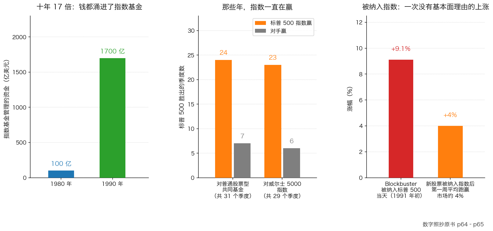

# 第 3 章：指数基金——不用脑子投资

> 本章你将：
> - 从零搞懂什么是指数、什么是指数基金、什么是 ETF 和跟踪误差
> - 知道指数基金为什么会流行（四条很实在的理由，其中三条对你也是好消息）
> - 看懂"有效市场假设"这个理论的来历，以及它和"研究有没有用"的关系
> - 掌握卡拉曼对指数化的五条批评，尤其是"被纳入指数就大涨"这件事
> - 亲手算出费率在 20 年里会吃掉你多少钱——同样 8% 的收益，差 1% 的费率差出一辆车的钱
> - 回答"这对我的钱包意味着什么"：指数基金不是坏东西，但它把"价格发现"外包出去了，而外包出去的那部分，正是留给你的机会

上一章的结尾，我们说到机构被"公式"吸引：投资组合保险、战术性资产配置……这一章讲第三个、也是今天最大的一股潮流：**指数化投资**。

它对你有非常直接的关系——因为**你大概率会买它**。所以这一章要写得公道：先把它的好处讲足，再讲卡拉曼的批评，最后告诉你该怎么用它、以及它的存在为什么反而给了你机会。

---

## 3.1 什么是指数，什么是指数基金

先从零讲。

### 指数：一篮子股票的平均分

**指数**就是一篮子股票按某种规则算出来的"平均分"，用来看这一类股票整体是涨了还是跌了。

> 💡 **换个说法：** 一个班有 50 个学生，你想知道这个班"整体考得好不好"，你不会去背 50 个人的分数，你会看**平均分**。指数就是股市的平均分。
>
> 但平均分有两种算法：一种是"每个人一样重"（算术平均），一种是"人多的班影响更大"（加权平均）。股票指数用的是**加权**——**市值越大的公司，对指数的影响越大。**
>
> 💡 **再换个说法：** 一锅汤里放盐。谁放的盐多，谁就决定了汤的咸淡。指数里的"大公司"就是放盐多的人。

你身边常见的指数：

- **A 股**：上证综合指数（常说的"上证指数"）、**沪深 300**（沪深两市规模大、流动性好的 300 家公司）、**中证 500**（中型公司）、**中证 1000 / 中证 2000**（更小的公司）、科创 50、创业板指；
- **港股**：**恒生指数**、恒生科技指数、恒生中国企业指数（常说的"国企指数"）；
- **美国**：标普 500、道琼斯工业平均指数（原书里反复出现的就是这两个）。

### 指数基金：照着名单买的基金

原书给的定义非常朴素：

> "指数化投资就是买入一个指数中的所有股票，并且投资组合中各个股票的权重与这些股票在指数中的权重一致，然后积极持有。"（p62）

翻译成大白话：**指数里有什么，我就买什么；指数里谁占多少，我就买多少。我的目标不是跑赢指数，而是和指数一模一样。**

原书还补了一句让人印象深刻的描述：

> "一只指数基金的经理人甚至不用关心以诱人的价格买入或者卖出股票。更与众不同的是，指数基金的经理人可能永远也不会阅读自己所投资公司的财务报告，甚至可能不知道这些企业从事什么业务。"（p62）

> 💡 **换个说法：** 这就像一个团购套餐——餐厅配好什么菜你就吃什么，不挑、不换、不问厨师是谁。**好处是省事又便宜；代价是你放弃了点菜的权利。**

**ETF** 是指数基金的一种：它像股票一样可以在交易所里买卖（A 股里名字后面带"ETF"的、港股里带"基金"字样的，很多都是）。香港市场最有名的一只 ETF 叫**盈富基金**（代码 2800.HK），跟踪的就是恒生指数。

**跟踪误差**：指数基金的实际表现和它跟踪的指数之间差了多少。差得越小，说明"跟得越准"。

> 🇨🇳 **落到 A 股/港股：** 你在手机银行或券商 App 里能买到的"沪深 300 指数基金""中证 500 ETF""恒生指数 ETF"，就是这一类。它们通常有两个版本：**场内**（用股票账户像买股票一样买）和**场外**（用基金账户按净值申购赎回）。后面"算一算"里我们会算它们的费率。

---

## 3.2 它为什么会流行：四条很实在的理由

原书对这件事问得很直接：为什么指数基金在养老基金、捐赠基金这些**注重长期表现**的资金里越来越流行？他给了四条理由（p62）：

1. **它确保能取得同指数中证券一致的表现**（尽管投资表现不会超过这一指数）；
2. **因为普通的机构投资者在过去 10 年来都跑输市场**。而且"因为投资者全体拥有了整个市场，取得与市场一致的表现看起来很诱人"；
3. **交易成本非常低**（因为几乎没有交易）；
4. **管理费用很低**（因为这种投资实际上并不需要思考或者行动）。

第 3 条和第 4 条是**实打实的好处**，请你务必记住：**便宜，是硬道理。** 原书后面那场关于费率的账，我们用"算一算"复现给你看。

第 2 条则是现实压力：如果一个行业里绝大多数人都跑不赢平均分，那么"买下平均分"就是最理性的选择。

图里三组数字全部照抄原书 p64–p65：1980 到 1990 年，指数基金管理的资金从 **100 亿美元**涨到约 **1700 亿美元**，其中 90% 跟踪标普 500；在这段时间里，标普 500 在 **31 个季度中的 24 个季度**击败了普通的股票型共同基金；1983 年下半年以来，它在 **29 个季度中的 23 个季度**领先于覆盖范围更广的威尔士 5000 指数（那段时期标普的复合年增长率为 **12.7%**，威尔士 5000 为 **10.7%**）。

### 还有一条理由：有效市场假设

原书说，形成指数投资倾向的另一个原因是，许多机构相信**有效市场假设**（p62）。

**有效市场假设**：所有与证券有关的信息都已经公布，并且**立刻充分体现在价格之中**；所以试图跑赢市场的努力是徒劳的，增加投资研究毫无价值。

> 💡 **换个说法：** 这个理论相当于说："菜市场里每一颗白菜的价格，都已经完美地反映了它所有的优点和缺点，所以你不可能用 2 元买到值 3 元的白菜。"
>
> 如果这是真的，那**研究就是浪费生命**——你研究三个月，价格早就把一切都算进去了。

这个理论的地位很高：原书提到，支撑这类理论（有效市场假设和资本资产定价模型）的三位代表人物都获得了 1990 年的诺贝尔经济学奖（p58）。原书还引用了一个很妙的批评，说它"是一个过于简化的假设，就像是每个股票都很优秀，因此，一个人买入成千上万只股票与买入其中的一只股票其实是一样的"（p62–p63）。

那价值投资怎么看它？原书的回答斩钉截铁：

> "然而，价值投资的基础就是认为市场并不是有效的。价值投资者相信，股价会脱离潜在价值，通过买入低估的证券，投资者可以实现高于市场的回报。"（p63）

原书还引用了巴菲特的一句话来回应"研究无用论"：

> "在任何一种类型的竞赛中——金融、智力还是体能方面——那些认为尝试一下都没有价值的反对者的存在就是一种巨大的优势。"（p63）

> 💡 **换个说法：** 这句话的意思是：**如果所有人都相信"研究了也没用"，那么还在研究的人就赢了。** 对手放弃得越多，你的优势越大。

而卡拉曼自己的结论是：

> "我相信随着时间的推移，价值投资者将跑赢市场，选择取得同市场一样的表现是一种懒惰和短视的行为。"（p63）

---

## 3.3 卡拉曼的五条批评

请注意这一节的读法：**这五条批评不是"劝你别买指数基金"**，而是"告诉你指数化这件事在市场上会造成什么后果"。其中好几条，恰恰是你的机会。

### 批评一：用的人越多，市场就越无效

> "首先，当越来越多的投资者采用这一策略时，这种策略就会弄巧成拙。尽管指数投资的基础是基于有效市场的假设，指数化投资者占所有投资者的比例越高，市场就会变得越无效，因为越来越少的投资者会进行研究和基本面分析。"（p63）

原书还推到了极端情况：**如果每个投资者都做指数投资，股价将永远不会出现波动，因为没有人会推动股价波动**（p63）。

> 📌 **划重点：** 这是全书里最漂亮的一个悖论——**一个建立在"市场永远正确"之上的策略，用的人越多，市场就越不正确。** 它自己的成功，在毁掉它自己的前提。

### 批评二：换成分股的时候，会出现"被迫买盘"

指数不是一成不变的。当指数里的一家公司破产了或者被收购了，指数就要**换股**。而因为所有指数投资者都要"在任何时候都全部投资于组成指数的所有证券"，于是——成百上千，也许是成千上万个投资组合经理人会**在同一时间**买入那只新进来的股票（p63）。

后果是什么？原书写得很清楚：

> "这家公司的基本面没有出现变化，没有任何理由让这家公司今天的股票较昨天更加值钱。事实上，人们之所以愿意以更高的价格买入这只股票仅仅是因为它成为了一个指数的一部分。"（p64）

原书的例子：1991 年年初，Blockbuster 娱乐公司的股票进入标普 500 指数，这家公司的市值**在一天之内增加了超过 1.55 亿美元，涨幅高达 9.1%**，因为许多基金经理人"被迫"购买这只股票。而根据《巴伦周刊》的统计，进入标普 500 指数的股票，在进入指数的**第一周内会跑赢市场近 4%**（p64）。

### 批评三：小盘股指数基金会自己伤害自己

原书接着讲了一个更细的机制：当大量资金流入或者流出那些**专注小盘股**的指数基金时，会出现同样的问题（p64）。因为小盘股流动性有限，**即使是小规模的买盘或者卖盘都能给价格产生巨大的影响**：

- 资金流入时，买盘把股价推高——**你买贵了**；
- 遇到赎回时，卖盘迫使价格下跌——**你卖便宜了**。

所以原书的结论是：**"因无法避免追涨杀跌，小盘股指数投资者几乎一定会跑输自己所投资的指数。"**（p64）

> ⚠️ **易踩坑：** 这一段对 A 股/港股 的读者特别有用。你如果买的是小盘股指数基金（中证 1000、中证 2000 这类），请记住：**你买的那个指数的表现，是在假设你买卖不影响价格的前提下算出来的。** 而现实里，你（和所有和你做同样事情的人）的买卖本身就在影响价格。

### 批评四：投票权被浪费了

这一条最容易被忽略，但原书花了整整两页（p64–p65）。逻辑是这样的：当购买股票**仅仅是因为它是指数中的一部分**，而购买者的唯一目标就是取得同指数一样的表现时，管理这些证券的投资组合"经理人"实际上**对影响指数的波动毫无兴趣**——他对指数的价值是涨是跌毫不关心，只关心以怎样的比例根据所管理资产的市场价值来收费。

这意味着在**委托书竞争**中，是反对者还是管理层赢了，对一只指数基金的经理人而言**没有实质区别**。

> 💡 **什么是委托书竞争？** 简单说就是股东之间争夺投票权，想换掉管理层、或者推翻董事会的某个决定。它的生活类比是**业主大会投票换物业公司**：谁拿到足够多的票，谁说了算。
>
> 而买股票就是买公司所有权的一小片（Week 1 讲过），所以股东本来是有投票权的。指数基金手里握着大量股票，也就握着大量投票权。

原书的讽刺非常锋利：**即使指数化投资者希望能以利益最大化的方式进行投票，也完全不知道该如何投票，因为指数基金的经理人通常不了解自己所拥有的股票的基本面**（p65）。

> 📌 **划重点：** 你买指数基金的时候，**你不仅放弃了"选哪家公司"，你还放弃了"对公司的发言权"**，并且把它交给了一个明说了"我不关心"的人。这不违法，但你要知道自己放弃了什么。

### 批评五：它是牛市的产物，趋势反转时会自我伤害

最后一条是关于周期的。原书注意到一个时间上的巧合：**指数投资的盛行是在牛市中**（p65）。他引用《巴伦周刊》的观察：

> "一种自我强化的反馈环已经形成，指数化投资的成功已经支持了指数自身的表现，而指数的表现又推动了更多的指数化投资"（p65）

也就是说：指数涨 → 大家觉得指数好 → 更多钱买指数 → 指数涨得更好。这是一个**正反馈循环**。而循环的另一面是：

> "当市场趋势逆转，取得同市场一致的表现不再具有吸引力的时候，卖盘会给指数投资者的表现带来负面影响，并进一步使更多的人撤出指数化投资。"（p66）

原书的预言很直白：

> "我相信指数投资最终只会成为另一股华尔街上的投资热潮。当这股风潮吹过之后，流行指数中的指标股的价格几乎肯定会像那些被剔除出指数的股票那样出现下跌。"（p65）

> 💡 **换个说法：** 一座只能靠不断来人往上走的自动扶梯，一旦有人开始往下走，它就会变成往下走的扶梯。**"因为大家都在买所以它涨"这件事，在大家不买的那一天会反过来。** 这和我们第 2 章讲的投资组合保险是同一个结构：**一个策略的收益，有一部分来自"后来者"。**

---

## 3.4 那今天到底该怎么看待指数基金

读完上面五条，你可能会觉得"指数基金是个骗局"。**完全不是。** 这一节我们把话说公道，并且给出可用的结论。

**第一，把"工具"和"潮流"分开看。**

作为一种**工具**，指数基金有三个你无法否认的好处：**便宜**（费率低）、**透明**（买的是什么一清二楚）、**不需要挑公司**。对"不想研究公司、也不想被人忽悠"的人来说，它是一个**合理的默认选项**。卡拉曼批评的是"**全体投资者都去做这件事**"这个现象，以及它带来的市场后果——他不是说"你买指数基金就是错的"。

**第二，它把"价格发现"这件事外包出去了。**

什么叫**价格发现**？就是"到底值多少钱，靠买卖双方的研究和争论来确定"这个过程。

> 💡 **换个说法：** 一个村里只有一个人会看牲口，每次买卖牛都由他定价——这叫价格发现有人在做。如果全村人都不看牛了，改成"照着上次的成交价买"，那么牛的价格就再也没有人真正关心了。**便宜的好牛和生病的牛，会卖一样的价。**

指数化投资让越来越多的人**不再判断贵贱**。结果是：

- 指数里的大公司，会因为"必须被买"而容易偏贵；
- 指数外的小公司、冷门公司，会因为"没人必须买"而容易被忽略。

**而这正好是上一章讲的那句话的另一个版本：机构进不去、看不见的地方，才轮得到你。**

**第三，请把"纳入指数"和"剔除指数"当信号来读。**

这是本章最实用的部分。记住两条：

- 一只股票**被纳入**重要指数时，生效日前后会有**被动买盘**，价格常被推高——**这时候追进去，你买的是"必须买"，不是"值得买"**；
- 一只股票**被剔除出**重要指数时，会被**被动卖盘**砸下来——**如果你研究过它、确认它的生意没变，那么这种下跌可能是礼物。**

> 📌 **划重点：** 对个人投资者来说，指数化最大的意义不是"我也可以买指数"，而是**"我因此知道了一大群人在什么时候必须买、什么时候必须卖"**。价格被机械力量推动的地方，就是错误定价出现的地方。

> 🇨🇳 **落到 A 股/港股：** 这些年 A 股的指数基金和 ETF 规模增长很快，沪深 300、中证 500、中证 1000、中证 2000、科创 50、恒生科技这些指数背后都站着大量被动资金。每到**指数调仓生效日**（很多指数每半年调整一次成分股），你都能在盘面上看到成交异常放大的股票。**读者动作：** 看到"某股票被纳入某指数"的新闻，不要当成买入理由；看到"某股票被调出某指数"，也不要当成卖出理由。**先去问：这家公司本身变了吗？**

**读者动作清单（买指数基金之前问自己三个问题）：**

1. 它跟踪的是哪个指数？这个指数里装的是什么公司（大盘？小盘？某个行业？）？
2. 它的费率是多少？（第 3 章的"算一算"会告诉你，这 1% 的差别在 20 年后有多大。）
3. 我是因为"它便宜、省事"买它，还是因为"它最近涨得好"买它？——**如果答案是后者，你已经在做上一章说的那种事了。**

---

## ✍️ 想一想

1. 如果全市场 90% 的钱都去做指数投资了，会发生什么？请具体说出三件事：股价会怎样？公司管理层会怎样？还有谁在做研究？
2. 一只股票被宣布纳入沪深 300 指数，消息公布的当天涨了 6%。这个 6% 代表了什么？它是"这家公司更值钱了"，还是别的东西？
3. 指数基金替你"投票"，但它明说了不关心投票结果。作为买了指数基金的股东，你怎么看这件事？如果你在意，你有什么办法？

> 💡 **参考思路：**
>
> 1. ① **股价会越来越不反映公司的好坏**：因为几乎没有人在判断贵贱，价格主要由"谁必须买、谁必须卖"决定（原书甚至说极端情况下股价将永远不波动，因为没有人推动，见 p63）。② **公司管理层会失去约束**：没人关心经营好坏，只要还待在指数里，就永远有人买你的股票（批评四讲的就是这个）。③ **做研究的人会变少，但每一个还在研究的人优势会变大**——因为对手都走了。这也是为什么卡拉曼说"那些认为尝试一下都没有价值的反对者的存在就是一种巨大的优势"（p63）。
> 2. 这个 6% 代表的是**"必须买"的力量**，不是"更值钱"。原书说得很清楚："这家公司的基本面没有出现变化，没有任何理由让这家公司今天的股票较昨天更加值钱"（p64）。所以正确的问题不是"我要不要跟着买"，而是：**"如果没有指数这回事，这家公司值多少钱？"** 如果它本来就值 10 元、现在被买到 10.6 元，那你什么都不用做。
> 3. ① 客观上，你的钱让一个"不关心公司"的人替你行使股东权利，这确实是治理上的损失。② 你可以有几种选择：**自己去投票**（个人股东也能参加股东大会、也能投票，很多公司支持网络投票）；**买主动管理、且明确表示会行使股东权利的基金**；或者**在你自己直接持有的那部分股票上，认真对待投票**。③ 最重要的是"知道自己放弃了什么"——**不知道自己在放弃什么的人，才是真的被剥夺了。**

---

## 🧮 算一算

**情境（简化示意数字，用于教学）：**

你有 **10 万元**，打算投资 20 年。假设两只基金的**"毛收益"完全一样，都是每年 8%**——也就是说，基金经理的水平一模一样。区别只在费率：

- **指数基金**：每年合计费率 **0.5%**，所以你拿到的是 8% 减 0.5%，等于 **7.5%**；
- **主动管理基金**：每年合计费率 **1.5%**，所以你拿到的是 8% 减 1.5%，等于 **6.5%**。

（费率为什么是这么扣的，你可以这样理解：基金每天从你的资产里扣走一点点，剩下的部分才是你的收益。）

**第 1 步：第 1 年，两只基金分别变成多少？**

- 指数基金：10 万元乘以 1.075，等于 **10.75 万元**；
- 主动基金：10 万元乘以 1.065，等于 **10.65 万元**。

**差 1000 元。** 看起来不多——这就是为什么很多人不在意费率。

**第 2 步：第 2 年呢？**

"一年一年往后乘"，注意要用**上一年的结果**去乘：

- 指数基金：10.75 万元乘以 1.075，等于 **11.56 万元**（精确一点是 11.556 万元）；
- 主动基金：10.65 万元乘以 1.065，等于 **11.34 万元**（精确一点是 11.342 万元）。

**差约 2140 元。**

**第 3 步：一直乘到第 5 年。**

| 年数 | 指数基金（净 7.5%） | 主动基金（净 6.5%） | 差额 |
|---|---|---|---|
| 1 | 10.75 万元 | 10.65 万元 | 0.10 万元 |
| 2 | 11.56 万元 | 11.34 万元 | 0.21 万元 |
| 3 | 12.42 万元 | 12.08 万元 | 0.34 万元 |
| 4 | 13.35 万元 | 12.86 万元 | 0.49 万元 |
| 5 | 14.36 万元 | 13.70 万元 | 0.66 万元 |

第 5 年差了 **6600 元**。差距每年都在变大——因为**你省下来的那 1%，本身也在继续赚钱**。

**第 4 步：用同样的算法乘到第 20 年。**

继续一年一年往后乘（每一步都是"上一年的数字乘以当年的增长率"）：

- 指数基金：约 **42.48 万元**；
- 主动基金：约 **35.24 万元**；

**差约 7.24 万元。** 也就是说：**同样 8% 的水平，仅仅因为每年多收 1% 的费，20 年后你少了 7 万多块**——相当于一辆家用车。

**第 5 步：反过来问，主动基金要"多赚"多少才能追平？**

因为它每年比你多收 1% 的费，所以它必须**每年在费前多赚 1 个百分点**（也就是毛收益要做到 9% 而不是 8%），才能跟你打平。请注意：**这 1% 不是一次性做到，而是"每年"都要做到，连续 20 年。** 这是一件非常难的事——尤其考虑到第 0 章讲的：多数机构连市场平均都跑不赢。

**第 6 步：如果费率再低一点呢？**

假设你买到的是费率 **0.2%** 的宽基 ETF，净收益就是 **7.8%**：

- 第 1 年：10 万元乘以 1.078，等于 **10.78 万元**；
- 和 1.5% 费率的主动基金（10.65 万元）相比，**第 1 年就差了 1300 元**。

**结论：** 费率不是"小钱"，它是**每年都在复利的一笔确定支出**。你无法控制基金经理明年赚不赚钱，但**费率是你下单之前就能确定的唯一一件事**。

---

## ✅ 小测验

**1. 关于指数基金为什么会流行，下面哪一条不是原书给出的理由？**

A. 它确保取得与指数一致的表现，虽然不会超过指数
B. 过去 10 年普通机构跑输市场，而"买下整个市场"看起来很诱人
C. 它交易成本低、管理费低，因为几乎不需要思考和行动
D. 它的经理人比主动基金经理更了解企业基本面

**2. 一只股票被宣布纳入标普 500 指数后当天大涨 9.1%（原书 p64 的例子）。最合理的解释是？**

A. 市场提前知道了这家公司的业绩会大幅改善
B. 大量指数基金"被迫"在同一时间买入，与公司基本面无关
C. 这家公司被收购了
D. 指数委员会在推荐这只股票

**3. 卡拉曼对指数化最根本的批评是什么？**

A. 指数基金的费率太高
B. 指数基金不能在交易所买卖
C. 它建立在"市场有效"的假设之上，但用的人越多市场就越无效；它把研究和价格发现外包出去，最终会弄巧成拙
D. 指数基金只能买大盘股，不能买小盘股

> **答案与解析**
>
> **1. D。** 原书说的恰恰相反："指数基金的经理人可能永远也不会阅读自己所投资公司的财务报告，甚至可能不知道这些企业从事什么业务"（p62）。A、B、C 都是原书 p62 列出的流行理由。注意 C 里"不需要思考或者行动"是原书自己的措辞——它既是好处，也是批评的伏笔。
>
> **2. B。** 原书说："这家公司的基本面没有出现变化，没有任何理由让这家公司今天的股票较昨天更加值钱。事实上，人们之所以愿意以更高的价格买入这只股票仅仅是因为它成为了一个指数的一部分"（p64）。A、C、D 都与原书记载不符——它既不是业绩消息，也不是被收购（被收购会导致指数**换股**，那是另一回事），指数委员会也不推荐个股。
>
> **3. C。** 原书的第一条批评就是"当越来越多的投资者采用这一策略时，这种策略就会弄巧成拙"，因为"指数化投资者占所有投资者的比例越高，市场就会变得越无效，因为越来越少的投资者会进行研究和基本面分析"（p63）。A 错：费率低恰恰是它**流行**的理由（p62）。B 错：ETF 正是可以在交易所买卖的指数基金。D 错：小盘股指数基金是存在的，原书批评的是**它们会跑输自己跟踪的指数**（p64），而不是"不能买"。

---

## 📖 回到原书

- 对应原书 **第三章**，`raw/安全边际-中文版/page_061.md` ~ `page_066.md`（原书 p61–p66）。
- **建议精读**：
  - p62–p63（指数化投资的定义、四条流行理由、有效市场假设与鲁文斯坦的评论）——这一段是理解"为什么大家都去买指数"的钥匙；
  - p63–p64（**被纳入指数的价格效应**）——Blockbuster 那个例子，以及"进入指数第一周跑赢市场近 4%"的统计，值得反复读；
  - p65–p66（反馈环与逆转）——**"一种自我强化的反馈环已经形成"**这句话，请你抄在本子上。
- **可以略读**：p61 开头关于文艺复兴投资管理公司电脑下单的段落（那是上一章"战术性资产配置"的案例，你已经读过了）。
- **原书金句（逐字引用）**：
  > "指数化投资是一种既危险又有缺陷的策略，理由有以下几点。"（p63）
  >
  > "这家公司的基本面没有出现变化，没有任何理由让这家公司今天的股票较昨天更加值钱。"（p64）
  >
  > "因无法避免追涨杀跌，小盘股指数投资者几乎一定会跑输自己所投资的指数。"（p64）
  >
  > "一种自我强化的反馈环已经形成，指数化投资的成功已经支持了指数自身的表现，而指数的表现又推动了更多的指数化投资"（p65）
