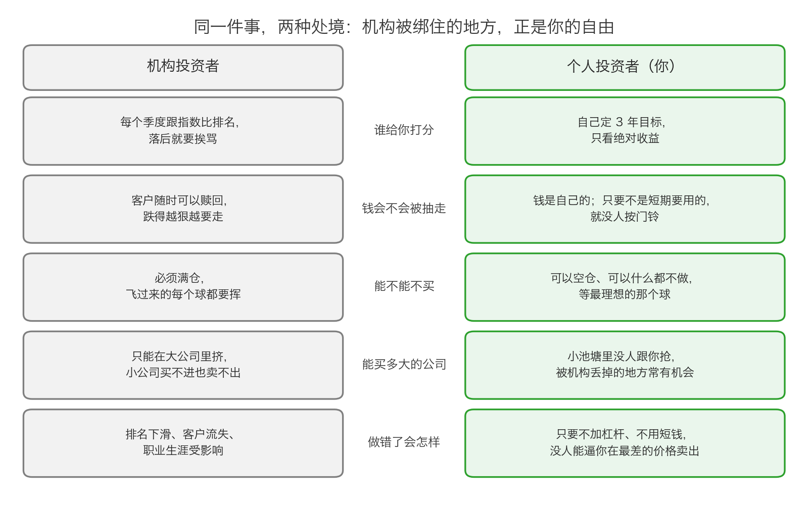
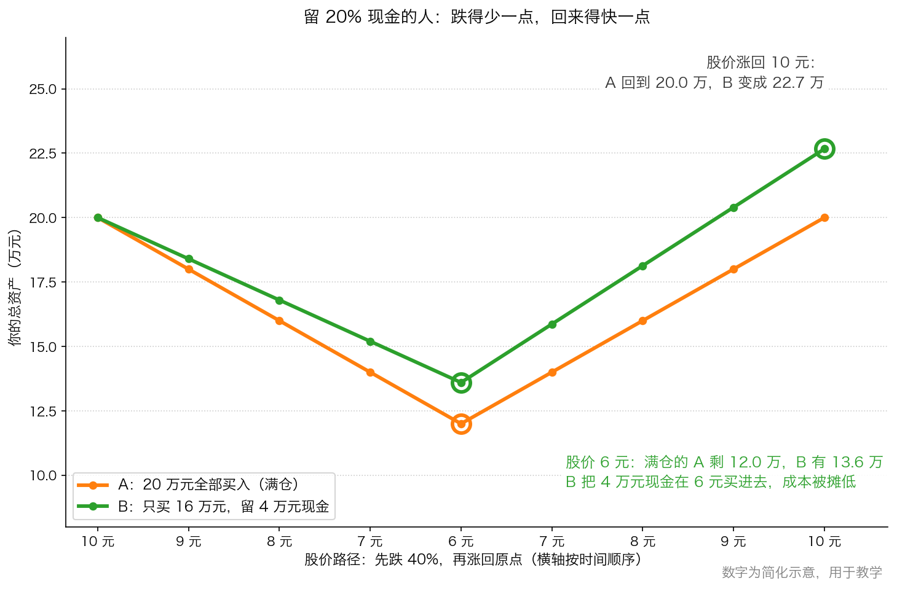

# 第 4 章：个人投资者唯一的优势

> 本章你将：
> - 说清楚你和机构最根本的区别：不是钱多钱少，而是"你有没有委托人"
> - 拿到属于你的五条结构性优势，并且知道每一条对应机构身上的哪一副镣铐
> - 学会把"自由"变成"纪律"：一份可以抄下来的四行投资守则
> - 掌握下跌和被套时的"四步急救法"，从今天起不再被情绪牵着走
> - 知道哪三件事会亲手把你的优势毁掉：杠杆、短钱、天天看盘
> - 回答"这对我的钱包意味着什么"：你有机构永远拿不到的东西——**可以等，可以空仓，可以在最难受的时候什么都不做**

前面四章，我们一直在看别人的毛病：机构比季度排名、身上戴着八副镣铐、被迫挥棒每一次、用公式代替思考。读到这里你可能会有点丧：**市场这么脏，我一个小散户能怎么办？**

这一章要把它整个翻过来。

**你身上没有那些镣铐。不是因为你更聪明，而是因为你没有"委托人"。** 这四个字，是你这一整周真正要拿走的东西。

---

## 4.1 你不是"缩小版的机构"

先把关系理清楚。

**机构投资者的处境是这样的**：钱是客户的，决定是他们的。他们必须向客户交代，按季度交代，用客户看得懂的语言交代——而客户看得懂的语言就是"你排第几"。

**你的处境是这样的**：钱是你的，决定是你的，交代也是向你自己交代。

> 💡 **换个说法：** 想象两位厨师。
>
> **职业厨师**要照顾 200 桌客人的口味，必须按菜单出菜，必须在 20 分钟内上齐，不能今天说"我不想做饭"。他做的每一道菜都要被点评、被打分、被发到网上。
>
> **给自己做饭的人**可以只做一道菜，可以为一锅汤等三个小时，可以今天不做饭、明天再做。他做得好不好，只有他自己知道。
>
> **"可以今天不做饭"，是职业厨师永远没有的自由。** 而投资这件事，恰恰是"什么时候做饭"比"做得多好"更重要的少数活动之一。

我们在第 0 章引过原书的一句话：机构的短期相对回报定位，已经让"机构投资者"成了一个**自相矛盾的术语**（p48）。为什么矛盾？因为"投资"的本义是"基于对企业价值的分析，以低于价值的价格买入"（Week 3 讲过这个定义）。而一个必须每季度跟别人比名次的人，**没有条件去做这件事**。

所以这一章的第一个结论是：

> 📌 **划重点：** 你不需要变成一个小号的机构。你需要做的是**成为机构做不到的那种投资者**。你的优势不在"水平"，在"结构"。

---

## 4.2 你的五条结构性优势

下面五条，每一条都是前面某副镣铐的**反面**。

### 优势一：没有排名压力 → 你可以用"绝对标准"考核自己

机构必须每季度跟指数比名次（第 0 章）。而你可以只问一个问题：**"我的钱，比三年前多了吗？"**

这不是自我安慰。这是两种完全不同的游戏：比名次的人必须在每个季度都"不难看"；只问绝对结果的人**可以丑三个季度，只要最后是对的**。

> 🇨🇳 **落到 A 股/港股：** 你可以给自己定这样的规矩：**三年看一次成绩单**。三年之内不看排名、不看别人赚了多少、不看"今年跑赢没有"。你唯一要检查的是：我当初买它的理由还成立吗？

### 优势二：没有申赎压力 → 没人能在你最难受的时候逼你卖出

这一条是五条里最值钱的。

机构的客户会在下跌时赎回。赎回意味着基金必须卖股票——**而且是在最坏的价格上卖**。本周第 0 章讲的基金 B，就是在第 2 季度被赎回，从此和后面 6 个季度的收益无关（p49–p50、p53）。

> 💡 **换个说法：** 机构像一个"每天都可能被抽走本金的生意"。你今天进的货再好，只要明天有人来退钱，你就得贱卖。
>
> **你最大的优势是：你的本金不会被抽走。** 只要——这是一个非常重要的"只要"——**你用的是自己长期不用的钱。**

> ⚠️ **易踩坑：** 这条优势有一个前提。如果你把明年买房的首付投进股票，那么你自己就成了自己的"赎回客户"：市场下跌时你**必须**卖。**你给自己装上了机构的镣铐。**

### 优势三：可以空仓、可以什么都不做 → 没有裁判喊好球

第 2 章讲过那个比喻：投资像击球，但没有裁判喊好球，你可以一直不挥棒。**机构做不到，因为他们那边一直有裁判。你可以。**

原书说，只有在机会"数量充足而且非常有吸引力"时，价值投资者才会满仓；没有满足这两个条件时，他们不愿满仓（p56）。而机构不敢这么做，除非"多数的竞争对手也倾向于什么都不做"（p56）。

**你可以是那个什么都不做的人。** 这不是懒，这是别人拿不到的选择权。

### 优势四：可以进小池塘 → 规模小是优势

第 0 章我们算过：一只 100 亿元的基金，按"不超过流通股 5%"的规矩，只能去买流通市值 100 亿元以上的公司。而一只 8 亿元的基金，可以买那些没人看得上的小公司，并且一笔投资就能明显影响自己的业绩。

原书在第 3 章的结论里把这件事说得很美：

> "在被多数机构投资者排除在外的证券中可能存在充足的投资机会。从投资大象们所丢弃的碎屑中挑选股票能够带来回报。"（p66）

> 💡 **换个说法：** 大象走过一片草地，会踩倒很多它根本不屑于吃的草叶。**你弯下腰，把它们捡起来就行。** 你不需要打得过大象，你只需要去它去不了的地方。

> 🇨🇳 **落到 A 股/港股：** 小市值公司、冷门行业、被调出指数的股票、港股里成交清淡的股票、破产重整中的公司——这些地方机构要么进不去，要么不敢去。**第 3 章讲的"被剔出指数"的被动卖盘，就是最典型的一个例子。**

### 优势五：不需要向任何人解释 → 你能承受"先错后对"

机构的处境是：错了要写检讨、要被赎回、要影响职业生涯（原书 p53："出错的成本远高于金钱上的损失"）。所以他们会不由自主地选择"和多数人站在一起"。

**你不需要向任何人解释。** 这意味着你可以做一件机构做不到的事：**在一开始就是错的，然后一直等到自己对。**

> 📌 **划重点：** 便宜的东西之所以便宜，往往是因为**当下看起来不对**。你买入的时候，市场会告诉你"你错了"；而且这个"你错了"，可能要持续一两年。**能扛住这段不被认可的时期，是你的第五个优势。**（这件事背后的完整逻辑，Week 10 会专门讲。）

把这张图存下来。**这五条不是"安慰奖"，它们是结构性事实。** 机构花钱也买不到它们——因为限制它们的不是能力，是它们和客户之间的那层关系。

---

## 4.3 你的优势"使用说明书"

自由是优势，也是陷阱。**没有人管你，也就没有人拦着你乱来。**

这一节把上面五条优势翻译成**可以做的事**。

### 纪律一：自己写一张"考核表"

机构被人考核，你要自己考核自己。请在你的投资笔记第一页写下三行：

1. **我的考核标准是绝对的**：我只比较"今天的总资产"和"我的目标"，不跟任何指数、任何人比；
2. **我的考核周期是三年**：三年之内的任何波动都不构成"成绩"；
3. **我一年只看一两次成绩单**（什么时候看，现在就写下来，比如每年 1 月和 7 月）。

### 纪律二：只用"长期不用的钱"

请给每一笔投资写一个日期：**"这笔钱最早什么时候要用？"** 如果答案是"两年内"，那它就不该进股市。

为什么这一条是地基？因为**"下跌时不被情绪带走"这件事，光靠意志力是做不到的。** 一个明年要交首付的人，看到账户跌了 30%，他的焦虑是**合理的**——因为那笔钱真的可能要用了。**你没法用心理技巧去解决一个真实存在的约束，你只能提前避免它。**

### 纪律三：留一手现金，并且写清楚"什么时候才用"

第 2 章说过，机构几乎不能持有现金。**你可以，而且你应该。**

但请注意：**"留现金"如果没有规则，它会在牛市里被你自己花掉**（因为看着别人赚钱太难受了）。所以要事先写死：

> **我的现金使用规则（示例）：**
> ① 我至少保留总资产的 20% 作为现金；
> ② 只有当目标股票跌到"我估算价值的 7 折以下"，并且公司基本面没有变坏时，我才会动用现金；
> ③ 每次最多动用现金的三分之一；
> ④ 如果一年都没有触发，那这笔现金就继续待着——**它没有被浪费，它是我的球棒。**

### 纪律四：不去看那些"让你想做动作"的东西

机构被迫每天看业绩（原书 p49–p50：基金经理"因分心计算每小时的表现而深受困扰"）。**你不必。** 请主动关掉这些东西：

- 手机里的行情推送、"今日大盘为什么跌"的解读；
- 别人晒收益的帖子；
- 每天刷账户余额的习惯。

> 💡 **换个说法：** 天天看盘，等于**自己给自己设了一个季度排名**。你本来没有裁判，何必自己请一个？

---

## 4.4 下跌和被套的时候，你到底该怎么办

这一节直接回答你的学习目标：**下跌、被套时不被情绪带走。**

先给你一个最重要的分辨。**同样是账户变绿，"下跌"其实有三种，处理方式完全相反。**

**第一种：你估错了——公司的生意真的变坏了。**

比如订单没了、核心产品被替代、大客户跑了、账目有问题。这时候跌得再狠，也**不该补仓**，该做的是认错离场。这不叫"被套"，这叫**改错**。

**第二种：价值没变，价格跌了。**

公司照常赚钱、照常分红，只是大盘跌了、行业被嫌弃了、或者有人被迫卖出（第 1 章的账面粉饰、第 3 章的指数调仓）。这时候的下跌，对**手里还有钱的人**来说是好消息。Week 7 会专门讲这件事：下跌的市场里，价值投资闪闪发光。

**第三种：你根本分不清是前两种里的哪一种。**

**那么问题不在下跌，在买入——你当初买的时候研究得不够深，安全边际留得不够厚。** 这正是"安全边际"存在的理由（Week 2 讲过定义，Week 7 会深入）。你留出折扣，不是为了多赚，而是为了**在自己看错的时候还活着**。

分清这三种之后，用下面这四步处理情绪。

### 下跌时的"四步急救法"

**第 1 步：停——不在开盘时间做任何决定。**

情绪最汹涌的时刻，通常就是价格跳动最厉害的时刻。请给自己立一条硬规矩：**不在交易时间做买卖决定。** 想卖？把理由写在纸上，晚上再看。这一条能救你 90% 的冲动操作。

**第 2 步：查——拿出你买入时写的那张纸。**

如果你当初写过买入理由（如果没写，现在补一张），逐条对照：

- 我当时看好的三个理由，现在有几个还成立？
- 最新一份财报里的收入、利润、现金，是变好了还是变坏了？
- 公司有没有做伤害股东的事（乱花钱、乱并购、大股东占款）？

**结论只有两种：理由还在，或者理由没了。** 中间状态说明你研究得不够——那就先别动，去补研究。

**第 3 步：算——把最坏的情况算成一个具体的数字。**

人的恐惧在模糊的时候最大。请把它变成算术：

- 如果它再跌 50%，我的总资产会变成多少？
- 这笔钱是我三年内要用的吗？（如果答案是"是"，问题不在股票，在资金安排。）
- 如果它跌到"我估算价值的 5 折"，我会想买还是想卖？——**这个问题会告诉你，你当初的估值是不是真的。**

**第 4 步：写——把决定和理由写下来，签上名和日期。**

写下："我决定继续持有 / 我决定卖出，理由是……，日期……"。**下次情绪上来的时候，先读这一张。** 你会惊讶地发现：写下自己想法的那只手，比在盘面上点鼠标的那只手冷静得多。

> ⚠️ **易踩坑：** 不要把"长期投资"当成"被套了就不动"。"长期"指的是**你愿意等**，不是**你不看公司**。一家生意持续变坏的公司，你等十年它也不会自己好起来。

这张图是上面这些话的算术版本（数字为简化示意，下面"算一算"会一步步带你算）：同样的 20 万元、同样一段"先跌 40%、再涨回原点"的行情——**满仓的人跌到 12 万，回到原点还是 20 万；留了 20% 现金并且在 6 元加仓的人，最差时还有 13.6 万，回到原点变成 22.7 万。**

差别不在预测能力，在**结构**：一个人被迫全程承受，另一个人手里有牌。

---

## 4.5 这三件事，会亲手把你的优势毁掉

你的五条优势都建立在同一个前提上：**没有人能逼你做任何事。** 而下面三件事，会让你**自己**变成那个"逼你的人"。

### 陷阱一：借钱买股票（杠杆）

借钱买股票，等于你给自己装了一条**平仓线**：亏到一定比例，会被强制卖出。

> 💡 **换个说法：** 借钱开饭店，房东月月来要账。生意好的时候没关系；生意差一点点，你就得把设备打折卖掉还钱。**你借的不是钱，你借的是"在最坏时刻必须卖出的义务"。**

你一上杠杆，就**主动放弃了优势二**（没人能逼你卖出）——因为你已经把"逼你卖出"的权利交给了别人。本周第 2 章讲的投资组合保险、我们讲的两融和配资平仓线，本质上都是同一个机制：**下跌时被迫卖出。**

### 陷阱二：用短期要用的钱

明年要交首付、后年要交学费、随时可能要用来看病的钱——**这些钱不该进股市。**

理由和上一条完全一样：你会变成自己的赎回客户。**你本来没有申赎压力，是你自己给自己加的。**

### 陷阱三：天天看盘、天天跟人比

**这是最隐蔽的一个。** 它不会让你被迫卖出，但它会让你**自愿**卖出。

每天看价格，你就在给自己制造"季度排名"；每次听别人赚钱，你就在给自己找了一个"指数"。你会不由自主地想：**我是不是该做点什么？**

而这一整周我们学到的答案恰恰是：**在没有好机会的时候，什么都不做，才是对的。**

> 📌 **划重点：** 机构是被别人绑住的；你必须小心，**别自己把自己绑回去。** 杠杆、短钱、天天看盘——这三件事就是你给自己戴上的镣铐。

---

## 4.6 结论：地图已经在你手里了

原书第 3 章的最后一段，是这么收尾的：

> "投资者必须试图了解机构投资者的心理，理由有二：第一，机构主导了金融市场中的交易，那些忽视机构行为的投资者会周期性地受到伤害；第二，在被多数机构投资者排除在外的证券中可能存在充足的投资机会。从投资大象们所丢弃的碎屑中挑选股票能够带来回报。"（p66）

然后他给了一个比喻：

> "在不了解机构投资者行为的情况下进行投资，就像在没有地图的情况下在国外开车一样。你可能最终会达到目的地，但你可能开了更多的冤枉路，并冒着迷路的风险。"（p66）

**这一周，你已经把那张地图拿到手了。**

现在，请你把这一章最想让你记住的那段话读一遍——它值得你抄在本子上，贴在书桌前：

> **市场下跌的时候，整个市场里只有一类人还能主动出手：手里有现金、没有委托人、不急着交成绩单的人。**
>
> 机构在下跌里是被迫卖出的：客户要赎回、排名要好看、止损线要执行、考核期在逼近。他们不是在判断，他们是在履约。
>
> 而你，可以在所有人都在卖的时候，慢慢看完一份年报，然后决定买，或者决定不买。
>
> 这就是你唯一的、也是足够的结构性优势。

这个优势不会替你选股。选股这件事要慢慢学（Week 9 会专门讲怎么评估一家企业值多少钱），而且它很难。但请记住顺序：**如果没有这个优势，你学再多选股技巧都没有用**——因为你会在最该买的时候被迫卖出，在最该拿住的时候被人赎回。

**你有的是一个位置。站在这个位置上，你才有资格谈方法。**

---

## ✍️ 想一想

1. 请把你自己现在能支配的钱分成三堆：①三年内一定要用的；②三年到十年之间可能用的；③十年内肯定不用的。哪一堆才适合买股票？为什么？
2. 机构的镣铐（第 1 章把它们归成了八副，这里挑最要命的几条：排名、赎回、不能空仓、规模、必须解释），你自己身上有没有对应的"自愿镣铐"？请至少找出两条，并写出它们是怎么形成的。
3. "你可以在所有人都在卖的时候，慢慢看完一份年报。"这句话里，最难做到的是哪一部分？是"有钱买"、是"敢买"、还是"愿意慢慢看年报"？

> 💡 **参考思路：**
>
> 1. 只有第 ③ 堆（十年内肯定不用的钱）适合买股票。理由不是"十年一定能涨"，而是**只有这笔钱能保证你在最坏的时候不必卖**。第 ① 堆应该放在随时能取、几乎不会亏的地方；第 ② 堆要谨慎，因为"三年到十年之间可能用"意味着你可能正好在熊市里需要用钱——如果要用，宁可少赚，也不要被迫卖出。**注意：这个划分是关于"钱的期限"，不是关于"你的胆量"。**
> 2. 常见的"自我镣铐"有：① **"我不能留现金"**——看到账户里有钱就难受，觉得是浪费，这对应机构的现金上限；② **"我只买我听说过的公司"**——这对应机构的"名单限制"，代价是你永远只在最热闹的地方买；③ **"我不能承认自己看错了"**——这对应"卖出比买入难"，代价是小错拖成大错；④ **"我要天天看盘"**——这对应机构的季度排名，是你自己给自己设的考核。它们的形成原因几乎都是同一件事：**怕落后、怕丢脸。**
> 3. **最难的是"敢买"。** "有钱买"是纪律问题（留现金、用长钱，靠规则就能解决）；"愿意慢慢看年报"是习惯问题（靠安排时间就能解决）；只有"敢买"是心理问题——因为在那个时刻，**你周围所有的声音都在说"这次不一样，还会继续跌"。** 而且你买入之后，价格很可能还会继续跌，你会立刻被证明"错了"。**这一条没有捷径，只能靠两样东西：一是你对这家公司真的研究透了（知道自己买的是什么）；二是你有安全边际（买得足够便宜，跌一段也不慌）。**
>
> 这也是为什么整门课的顺序是：先学"别亏钱"（Week 1–6）→ 再学"价值是什么"（Week 7–9）→ 最后学"怎么找机会"（Week 10–12）。**勇气不是天生的，勇气来自算得清楚。**

---

## 🧮 算一算

**情境（数字为简化示意，用于教学）：**

你有 **20 万元**，给自己定了一条规矩：**最多 80% 买股票，至少 20% 留现金。** 你选中了一只股票，现在股价 **10 元**。

**第 1 步：现在你买多少股？留多少现金？**

- 买股票的钱：20 万元乘以 80%，等于 **16 万元**；
- 留现金：20 万元减 16 万元，等于 **4 万元**；
- 买入份数：16 万元除以 10 元，等于 **1.6 万股**（也就是 16000 股）。

**第 2 步：股价跌 40%，跌到 6 元。你的总资产还剩多少？**

- 股票市值：16000 股乘以 6 元，等于 **9.6 万元**；
- 现金：**4 万元**；
- 总资产：9.6 万元加 4 万元，等于 **13.6 万元**。

对比一下满仓的人（2 万股）：他的总资产是 2 万股乘以 6 元，等于 **12 万元**。**你比他多 1.6 万元。**

**第 3 步：你把 4 万元现金在 6 元全部买进去。现在你一共持有多少股？平均成本是多少？**

- 用现金买到的股数：4 万元除以 6 元，等于 **6666.67 股**（约 6666 股）；
- 总股数：16000 股加 6666.67 股，等于 **22666.67 股**；
- 平均成本：总投入 20 万元除以 22666.67 股，等于 **8.82 元**。

**注意这个数字：你的平均成本从 10 元降到了 8.82 元。** 而满仓的人，成本还是 10 元。

**第 4 步：股价涨回 10 元（回到原点）。你和满仓的人各有多少钱？**

- 你：22666.67 股乘以 10 元，等于 **22.67 万元**；
- 满仓的人：2 万股乘以 10 元，等于 **20 万元**。

**你赚了 2.67 万元（约 13.3%），而他刚刚回本。** 而这一切发生在**同一只股票、同一段行情**里——你没有预测对任何东西，你只是留了现金。

**第 5 步：反过来，如果股价直接涨到 13 元（涨 30%）呢？**

- 你：16000 股乘以 13 元，等于 20.8 万元；再加 4 万元现金，等于 **24.8 万元**（收益率 24%）；
- 满仓的人：2 万股乘以 13 元，等于 **26 万元**（收益率 30%）。

**你少赚了 1.2 万元**，也就是少赚了 6 个百分点。

**第 6 步：那 4 万元现金本身有没有收益？**

有，但很少。假设现金部分放在货币基金里，一年收益 **1.5%**（简化示意数字），那么 4 万元一年带来 **600 元**。这远远比不上股票上涨带来的差距——**所以留现金的收益，不是来自那点利息，而是来自"你还能在下跌时买入"。**

**结论：** 留现金的代价是**牛市里少赚**（第 5 步：少 1.2 万元），回报是**熊市里能加仓 + 心里不慌**（第 2 到 4 步：多赚 2.67 万元，而且最差的时候手里还有牌）。

**这就是"优势"的价格。** 它不便宜，但它值得——因为第 5 步的代价你只是"少赚"，第 2 步的回报却能让你**不必在最低点卖出**。而机构，恰恰两样都做不到。

---

## ✅ 小测验

**1. 本章说，个人投资者最根本的优势是什么？**

A. 资金量小，进出灵活
B. 没有委托人——没有排名压力、没有申赎压力，没有人能在最坏的时刻逼你卖出
C. 信息比机构灵通
D. 不需要交任何费用

**2. 关于"留一部分现金"，下面哪种说法是对的？**

A. 留现金唯一的作用是拿一点利息
B. 留现金没有代价，只有好处
C. 留现金的代价是牛市里少赚，回报是下跌时还有钱买、并且不必被迫卖出；关键是要事先写清楚"什么情况下才动用它"
D. 只要留现金，就一定能跑赢满仓的人

**3. 账户跌了 30%，下面哪一种做法最符合本章的"四步急救法"？**

A. 立刻卖出止损，先躲开再说
B. 立刻加仓摊低成本，跌了就是机会
C. 先分清是"公司变坏了"还是"价格跌了"；不在盘中做决定，拿出买入时写下的理由逐条对照，把最坏情况算成具体数字，再把决定写下来
D. 关掉账户，五年后再看

> **答案与解析**
>
> **1. B。** 这一章的核心就是"委托人"三个字：机构被排名和赎回绑住（p49–p53），而你只有自己。A 是优势的一部分（第 4 章"优势四：可以进小池塘"），但它不是"最根本"的那一条——规模小只是让优势更好用，而没有委托人**才是优势本身**。C 错：你的信息几乎肯定不如机构。D 错：你也要付佣金等费用，只是通常比基金的综合费率低。
>
> **2. C。** 第 2 章算过：满仓的人在下跌里只能看着，而手里有现金的人能在便宜时出手；反过来，"算一算"第 5 步告诉你，牛市里留现金会让你少赚。所以它是一笔**有代价的选择**，不是万能药——D 错在"一定"。A 错：利息只是附带（第 6 步算过，一年 600 元），真正的价值是选择权。B 错：没有代价的东西不存在。
>
> **3. C。** 这正是四步急救法的完整顺序：停（不在盘中决定）、查（对照买入理由）、算（把最坏情况变成数字）、写（把决定记下来）。A 和 B 都是**在情绪最汹涌的时候做动作**——A 可能卖在最低点，B 可能越补越亏（如果你连"公司变坏了没有"都没确认）。D 错在"不看公司"：长期投资指的是愿意等，不是闭上眼睛；一家生意持续变坏的公司，等五年也不会自己好起来。

---

## 📖 回到原书

- 对应原书 **第三章的结论**，`raw/安全边际-中文版/page_066.md`（原书 p66，只有大半页），并**回看** `page_047.md` 的前两段（机构投资者的支配地位）。
- **建议精读**：p66 全页。这是全章最短、也最重要的一页：卡拉曼在这里把"为什么要了解机构"讲成了两条清清楚楚的理由（防守 + 进攻），并用"没有地图在国外开车"收尾。**建议你把这一页抄一遍。**
- **可以略读**：`page_047` 前两段（机构持股比例、交易量占比），你在第 0 章已经读过并算过了。
- **原书金句（逐字引用）**：
  > "投资者必须试图了解机构投资者的心理，理由有二：第一，机构主导了金融市场中的交易，那些忽视机构行为的投资者会周期性地受到伤害；第二，在被多数机构投资者排除在外的证券中可能存在充足的投资机会。"（p66）
  >
  > "从投资大象们所丢弃的碎屑中挑选股票能够带来回报。"（p66）
  >
  > "在不了解机构投资者行为的情况下进行投资，就像在没有地图的情况下在国外开车一样。你可能最终会达到目的地，但你可能开了更多的冤枉路，并冒着迷路的风险。"（p66）

---

## 本周之后，你应该带走的三句话

1. **机构的毛病不是智商问题，是结构问题**——考核、规模、合同、时间，把它们绑成了一定会做出某些动作的样子。看懂这一点，你就能看懂很多价格现象。
2. **你的优势不是"更聪明"，而是"没有委托人"**——可以等、可以空仓、可以什么都不做、可以在没人看好的地方买入。这五条花钱买不到。
3. **优势会被自己毁掉**——杠杆、短钱、天天看盘。守住这三条底线，你的结构性优势就一直在。

**下跌的时候，你不需要比市场聪明。你只需要比市场自由。**
