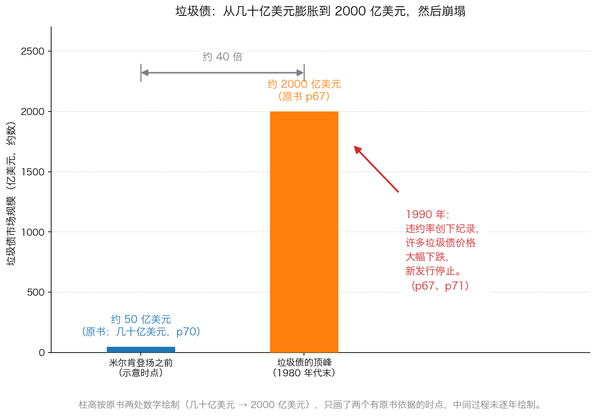
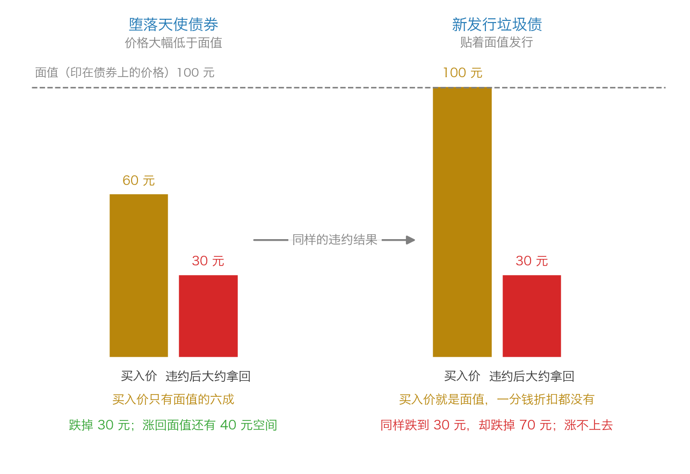

# 第 0 章：垃圾债是什么——从兴起到崩塌

> **本章你将：**
> - 一句话说清"债券"和"股票"的差别，以及债券的利息为什么有高有低
> - 知道"垃圾债"这个名字的来历，以及它的另一个名字"高收益债"是谁起的
> - 用五个问题复述 20 世纪 80 年代美国垃圾债的兴衰：谁、什么时候、做了什么
> - 掌握"堕落天使债券"和"新发行垃圾债"的区别——**这是本周最重要的一个区别**
> - 看懂为什么早期的成功，反而制造出了脱离现实的预期
> - 明白**这对我的钱包意味着什么**：你不买垃圾债，也可能被它伤到

Week 5 我们看完了机构的八副镣铐：季度排名、满仓要求、风格分类、年末粉饰。这一周我们要看镣铐戴上之后会发生什么——**当一大群被绑住手脚的人，同时听到一个"高收益、低风险"的故事时，市场会变成什么样子。**

原书的第四章讲的就是这个故事。它发生在美国的 20 世纪 80 年代，主角是一种叫"垃圾债"的东西。这一章先把它讲清楚：它是什么、怎么起来的、为什么那么多人信、最后怎么塌的。

---

## 0.1 先用一句话分清：股票是"所有权的一小片"，债券是"一张借条"

你在 Week 1 已经见过这两个词，这里再钉一遍，因为本周全篇都建立在它上面。

- **股票**：公司**所有权**的一小片。你买了股票，就是股东，公司赚了钱理论上有一部分归你——但公司**没有义务**分给你，赚少了也没有义务补你。
- **债券**：一张**借条**。你把钱借给公司或政府，对方按约定付利息、到期还本。**这是义务，不是心情好才做的事。**

> 💡 **换个说法：** 股票像"入股朋友的奶茶店"，店赚钱你分红，店亏钱你认栽，没人欠你；债券像"借钱给朋友开奶茶店"，不管他生意好不好，到期都得还你钱——**还不上的时候才叫违约。**

因为债券是"义务"，所以借钱之前必须先回答一个问题：**这个人还得起吗？** 靠什么判断？看两样东西：

1. **他有多少稳定的收入**（对应公司的利润和现金流）；
2. **他愿意为这笔钱付多少利息**（对应债券的票息）。

一个收入稳定、资产厚实的人，借钱的利息可以很低，比如一年 3%。一个收入忽高忽低、还欠着别人一屁股债的人，想借到钱就得付高得多的利息，比如一年 12%。**高利息不是天上掉的馅饼，它是"我可能还不上"这件事的价格。**

---

## 0.2 "垃圾债"这个名字是怎么来的

专业机构（评级机构）会给每一个借钱的人打一个"信用分"，也就是**信用评级**。评级分成两大档：

- **投资级**：看起来还得起。名字很好听，比如"AAA""AA"。
- **投机级**：能不能还上要看运气。名字就难听了，比如"BB""B""CCC"。

> 📌 **划重点：** 凡是评级掉到投资级以下的债券，市场就给它们起了个绰号——**垃圾债**。而卖这些东西的人不喜欢这个名字，他们管它叫**高收益债**。两个名字说的是同一样东西：**信用不太好、所以要付更高利息的借条。**

这里有个细节值得琢磨：**同一件东西，"垃圾"是从买家角度起的名字，"高收益"是从卖家角度起的名字。** 你在市场上听到的每一个好听的词，都值得先问一句：这是谁在给谁起名字？

还有一种特殊的情况，原书专门讲了：有些债券**刚发行的时候是投资级，后来公司经营变差，评级被降到了投机级**。这种"从良变差"的债券有个形象的名字，叫**堕落天使**。

> "在迈克尔•米尔肯出现之前，市场上仅仅存在着面值总额为几十亿美元的垃圾债。"（p70）

（引文里的迈克尔•米尔肯，英文名是 Michael Milken。本章后面还会反复提到他。）

注意这句话里的"面值总额"——**面值**就是印在债券上的那个数，也就是到期对方应该还你的本金。原书说，在米尔肯之前，这个市场只有**几十亿美元**那么大，而且里面绝大多数是"堕落天使"：**原本是好学生，后来掉了成绩。**

---

## 0.3 五个问题，看懂 1980 年代发生了什么

你完全不了解这段历史，所以先用五个问题把它讲完。**这一节只是背景，读完就够，不用背。**

**问题一：主角是谁？**
迈克尔·米尔肯。原书说他是"这个市场的总指挥"（p68）。他在 20 世纪 70 年代初进入费城的沃顿商学院，读到一位叫布雷多克·希克曼的学者 20 年前的研究结论：**一个充分多样化的低等级债券组合，赚到的钱比高等级债券组合还多**——因为低评级债券付的利息更高，高到足以补偿违约造成的损失，还剩一部分盈余（p68）。

**问题二：他在哪家公司做事？**
德崇证券（Drexel Burnham Lambert）。米尔肯毕业后先做"堕落天使"的交易：那些被降级公司的债券因为没人要，价格被压得很低，他就在里面挑（p68–p69）。原书里有个广为流传的细节：他每天坐公共汽车往返，在昏暗的灯光下读几个小时的企业财务报告，很快成了华尔街高收益市场上知识最渊博的投资者（p69）。

**问题三：他做了一件什么"跳跃"？**
他把一个**历史上的关系**，推导到了一个**崭新类型的证券**上。这是全章最关键的一步：

- 老东西是"堕落天使"：**二手**债券，价格已经被市场打到很低；
- 新东西是"新发行垃圾债"：**一手**债券，按面值卖出来，价格一点都不便宜。

米尔肯把前者的低违约率成绩，说成是后者也会有的特性（p70）。原书说得很直接：**这要求信心能出现跳跃，米尔肯做到了这一点，并能说服其他人的信心也出现跳跃。**

**问题四：规模涨到多大？**
从"几十亿美元"膨胀到一个**2000 亿美元**的市场（p67）。垃圾债还被用来做**杠杆收购（LBO）**——借钱把一家上市公司整个买下来，用公司自己的现金流还债。原书形容，拿到几十亿美元现金之后，"那些从事垃圾债融资收购的艺术家和金融行家突然之间可以购买这个国家内几乎任何一家公司"（p74）。

**问题五：结局是什么？**
1990 年，新发行垃圾债暴露了严重缺陷：**违约率创下记录，许多垃圾债的价格大幅下跌**（p67）。到 1990 年，"垃圾债就成了金融市场中的'昆虫捕捉器'，投资者可以进入这个市场，但却无法离开这个市场"（p91）。但故事没有在这里结束——**1991 年年初，垃圾债市场意外出现了复苏，"造成数百亿美元损失的许多缺陷再次被人们所忽视"（p67）。**

上图只画了两个有原书依据的时点：米尔肯登场之前的"几十亿美元"（p70）和顶峰时期的"2000 亿美元"（p67）。中间不是慢慢涨的，是**加速膨胀**；右边那段红字才是结局。

---

## 0.4 堕落天使 vs 新发行垃圾债：这是本周最重要的一个区别

现在到了本章最值钱的地方。原书 p70 用一整段讲这件事，请慢慢读：

> "新发行垃圾债没有给投资者提供安全边际。当交易价格处在账面价值附近时，这类债券的上涨潜力非常有限，但不同于以接近于账面价格交易的高等级债券，它们有着巨大的下跌风险。相反，一种'堕落天使'债券的交易价格大幅低于账面价格，因此其下跌风险低于相同等级的新发行垃圾债。"（p70）

这段话里的"账面价格"，就是印在债券上的那个数（面值 100 元），也就是到期对方**应该**还给你的金额。我们来把它翻译成一句人话：

> 📌 **划重点：** 同样一只烂债券，**你花多少钱买它，决定了你亏多少。** 花 60 元买一张面值 100 元的债券，就算对方违约、你只拿回 30 元，你也只亏一半；花 100 元买一张面值 100 元的债券，同样只拿回 30 元，你亏掉七成。

左边是"堕落天使"：价格已经被市场打到 60 元，**离面值有 40 元的距离**，所以下跌空间小、上涨空间大；右边是"新发行垃圾债"：按 100 元面值卖给你，**一分钱折扣都没有**，只能靠对方按时还本付息，一旦出事就从 100 元往下跌。

> 💡 **换个说法：** 这两个东西表面上都是"垃圾债"，其实是两种完全不同的生意。左边像在二手市场淘一件别人不要的旧家具，你出的价已经很低了，再亏也亏不到哪去；右边像用原价买一件质量本来就有疑问的新家具，商家赚的是你的全额付款。

那米尔肯是怎么把这两件事说成一件事的？原书给了答案：**他没有提到这个区别，"至少没有公开提到"（p70）。**

---

## 0.5 为什么坏主意看起来那么美：早期的成功

如果垃圾债从一开始就亏钱，它不可能长到 2000 亿美元。它之所以能长大，是因为**早期真的有人赚到了钱**。原书把这段机制讲得很清楚（p75–p76），可以拆成一条链子：

1. **用别人的钱买东西的人，对价格不敏感。** 拿自有资金去收购的人，亏了是自己的钱；用借来的钱去收购的人，对风险和回报的感知是歪的，于是愿意出更高的价（p75）。
2. **价格越出越高，企业的估值就整体往上走。** 原书举了几个当年被反复买卖、价格持续上涨的公司：Dr Pepper、Jack-In-The-Box、Colt Industries（p75）。
3. **恰好赶上好时候。** 1982 年经济从衰退中复苏，利率从 20 世纪 80 年代初的高点往下跌。经济增长让发行人的生意变好，利率下跌让他们能用更好的条件再融资（p75）。
4. **于是连糟糕的交易也被救活了**，这反过来"强化了低违约率的观点"（p75）。
5. **早期投资者赚到钱，后面的人就有了勇气。** 新一轮交易用上更高的价格与盈利之比、更高的价格与现金流之比（p75）。

这条链子最危险的地方在最后：**投资者开始假设"经济会一直好、垃圾债市场会一直健康"。** 原书说，许多发行人只有极小甚至根本不存在的**利息覆盖率**（税前利润与利息支出的比率），也没有足够的现金来支付即将到期的债券本金，大家都假设"现金流会一直增加、到期的债可以再融资"（p75–p76）。

然后原书说了这样一句话，值得你抄在本子上：

> "垃圾债持有人不会认为经济会下跌或者会出现信贷紧缩，这一点不让人感到意外。如果他们真的这么做了，就不会购买垃圾债了。"（p76）

数据也印证了这一点。原书引用高盛公司巴里·威格莫的研究：新发行垃圾债的**利息覆盖率在 1980–1988 年间大幅下降至 1.0 的水平**——意思是，平均而言，发行垃圾债的企业**赚到的税前利润还不够付利息**；同期债务与净有形资产（净有形资产 = 总资产减去无形资产和全部负债，可以粗略理解成"真正能拿来抵债的家底"）的比率上升了 3 倍（p76）。原书下的结论毫不客气：**不管早期发行的垃圾债是否具有价值，20 世纪 80 年代末发行的垃圾债注定会失败，理由很简单，因为发行人一再对企业资产支付过高的价格。**

> ⚠️ **易踩坑：** "这个东西前几年一直没出事"和"这个东西安全"是两句话。前者说的是**过去**，后者说的是**未来**。当所有人都用"过去没出事"来论证"未来也不会出事"时，风险正在悄悄积累——原书说，这一过程"非常隐蔽，许多垃圾债买家可能甚至没有意识到投资标准有所松动"（p80）。

---

## 0.6 崩塌之后：为什么这个故事值得你今天读

原书在结论里回答了这个问题，而且答案出乎意料：**即使你自己根本没买垃圾债，你也躲不掉。** 它列出了几条传染路径（p91–p92）：

- 过高的垃圾债价格让许多人以**虚高的价格**去收购公司；
- 被收购企业的股东拿到的超额利润，**实际上低于**买了这些垃圾债的买家蒙受的损失；
- 股票投资者把从垃圾债融资收购中获得的现金**再投回股市**，推高了那些还没被收购的公司的股价；
- 债券市场造成的高估值，会进一步影响**套利交易、证券交换、企业重组**相关证券的价格。

原书最后给了一句预言，是本章留给你最实用的一句话：

> "我们可能会信心满怀地认为，未来必将会出现新的投资狂潮。这种狂潮会超过一种创新所允许的合理范围。就像这种狂潮一定会发生一样，届时肯定不会对市场的过激行为敲响警钟。"（p92）

**狂潮一定会再来，而且不会有人敲钟。** 这就是你要学会自己看数字的原因。

---

## 0.7 落到 A 股/港股：你在哪里会碰到"借条"

你可能会想：美国的事跟我有什么关系？我又不买垃圾债。先看看**你今天能碰到的"借条"都有哪些**：

| 你听到的名字 | 它其实是 | 信用风险 |
|---|---|---|
| 国债、地方政府债 | 国家或地方政府开的借条 | 极低 |
| 金融债、高等级信用债 | 大银行、大型央企开的借条 | 较低 |
| 低等级信用债、高收益债 | 经营不稳的公司开的借条 | 高，可能违约 |
| 可转债 | 一张"可以换成股票"的借条 | 看公司，但多了"转股"这条退路 |

> 🇨🇳 **落到 A 股/港股：** 个人投资者直接买债券并不方便——银行间债券市场个人不能直接参与，交易所债券市场也需要单独开通权限、还有门槛。**你接触债券，绝大多数时候是通过"二手渠道"**：债券基金、银行理财、"固收+"产品、保险的理财型产品。也就是说：**你没有亲手买垃圾债，但你的钱可能通过一只基金买到了它。** 这就是为什么第 4 章要专门讲"怎么识别"。

还有两个 A 股特色，这里先埋个伏笔，第 3 章会展开：

- **可转债**：本质是借条，但送你一个"按约定价格换成股票"的权利。公司股价涨，它能跟着涨；股价不涨，它至少还是一张要还本付息的借条。**它是普通投资者能接触到的、结构最友好的一类"债"。**
- **永续债、明股实债**：名字里带"股"，实质是债；或者名字里带"债"，却可以一直不还本。这类"名字和实质不一致"的东西，是本周最需要警惕的一类。

> 📌 **划重点：** 债券这门生意里，**"利息有多高"从来不是好消息，它是风险的价格。** 当你看到一个产品的收益率明显高于同期国债，你要做的第一件事不是算自己能多赚多少，而是问：**它为什么必须付这么高的利息才借得到钱？**

---

## ✍️ 想一想

1. **股票和债券，哪一种对你更"友好"？** 想想看：如果你借钱给朋友的店，和入股朋友的店，这两种身份在"店生意不好的时候"，谁更早拿到钱、谁的损失更大？
2. **"堕落天使"和"新发行垃圾债"都是垃圾债，为什么原书说它们的风险完全不一样？** 试着不用"评级"这个词，只用"买入价"和"它值多少钱"来解释。
3. **原书说"狂潮一定会再来，而且不会有人敲响警钟"。** 如果没有人敲钟，你打算靠什么提醒自己？（提示：回想一下你在 Week 5 学到的——个人投资者最大的优势是什么。）

> 💡 **参考思路：**
> 1. 债券对你更友好。因为债券是**义务**：不管朋友店里生意好不好，他都得按约定付息还本，还不上才叫违约；而股票是**所有权**，店亏钱的时候，股东是最后才轮到分钱的人，甚至一分钱都轮不到。所以同一个借款人，**债券的风险天然低于股票**——但前提是价格合理，这一点第 0.4 节刚讲过。
> 2. 关键在**买入价离"应该还你的钱"有多远**。堕落天使的买入价已经被市场打到很低（比如 60 元买面值 100 元的债），你付出的钱少，最坏情况下亏得也少，而且万一公司好转，价格还能往面值回升。新发行垃圾债是按面值 100 元卖给你的，你没有拿到任何折扣，只能指望对方守约；一旦出事，你从 100 元开始往下亏。**同样是垃圾，一个打了六折，一个是原价。**
> 3. 靠两件事：一是**价格**——你买入的价格离保守估算的价值有多远；二是**你自己的约束**——你没有排名压力、没有申赎压力、可以空仓等待（这就是 Week 5 讲过的个人投资者唯一的优势）。没有人敲钟的时候，你只能自己看数字。

---

## 🧮 算一算

老王开了一家做汽车零件的小厂，想借 100 万元周转。他跑了两个地方：

- **方案 A（银行）**：银行看过他的流水，同意借，年息 6%。
- **方案 B（民间借贷）**：银行不借给他，另一个人愿意借，但要求年息 15%。

老王的小厂，预计每年能赚到**税前利润 20 万元**（还没扣利息、还没交税）。

**请算：**

1. 方案 A 和方案 B，每年各要付多少利息？
2. 用"税前利润 ÷ 年利息"算一下，两个方案的**利息覆盖率**各是多少倍？
3. 如果明年生意不好，税前利润掉到 14 万元，方案 B 还付得起利息吗？
4. 现在换个身份：**你是出借方。** 你花 100 万元买了方案 B 的借条（面值 100 万元）。如果老王还不上钱，公司清算后只够还 40 万元，你亏了多少？亏损比例是多少？
5. 如果同样的情况发生在方案 A（你花 100 万元买了一张年息 6% 的借条），你会不会觉得"年息 6% 太低了"？

**分步解答：**

**第 1 步：算每年的利息。**
利息等于本金乘年利率。
- 方案 A：100 万元乘 6% = **6 万元**。
- 方案 B：100 万元乘 15% = **15 万元**。

**第 2 步：算利息覆盖率。**
利息覆盖率等于税前利润除以年利息，意思就是"赚的钱是利息的几倍"。
- 方案 A：20 除以 6，大约是 **3.3 倍**。赚的钱是利息的三倍多，很从容。
- 方案 B：20 除以 15，大约是 **1.3 倍**。也就是说，赚的钱刚刚够付利息，剩下的只够勉强活着。

**第 3 步：利润掉到 14 万元会怎样？**
- 方案 A：14 除以 6，约 **2.3 倍**。还是有富余。
- 方案 B：14 万元 **小于** 15 万元。赚的钱**不够付利息**，缺口 1 万元。这时候老王只能：动用存款、卖资产、或者再借一笔新钱来付旧利息——**这正是第 3 章要讲的"零息债和 PIK"的温床。**
- 顺便记住这个数：**方案 B 的利息覆盖率是 1.3 倍，只比 1 多一点。** 原书说 20 世纪 80 年代末新发行垃圾债的平均利息覆盖率降到了 **1.0**（p76），意思就是**平均而言连利息都赚不回来**。

**第 4 步：算出借方的亏损。**
你付出 100 万元，只拿回 40 万元：亏了 100 减 40，等于 **60 万元**。
亏损比例：60 除以 100，等于 **60%**。
——注意这个数字：**为了每年多赚 9 万元利息（15 万减 6 万），你承担了可能亏掉 60 万元本金的风险。** 9 万元的额外收益，换来 60 万元的风险敞口，这笔账划不划算，你自己判断。

**第 5 步：回到第 5 问。**
不应该觉得 6% 低。**因为 6% 对应的那个借款人，还钱的把握大得多。** 高利息不是白送给你的礼物，它是风险的价格：**你多拿的那 9 万元利息，本质上是你替"可能亏掉 60 万元"这件事收的费。** 如果这个费用收得不够，你就是亏的——这正是整章要说的事。

---

## ✅ 小测验

**1. 关于"债券"和"股票"，下面哪个说法是对的？**
A. 买了债券就是公司的股东，公司赚钱有义务分红给你
B. 债券是借条，付息还本是义务；股票是所有权，分红不是义务
C. 债券的风险一定比股票高，因为债券的收益是固定的
D. 股票和债券的区别只在于名字，实际的收益来源完全一样

**2. "堕落天使债券"和"新发行垃圾债"的主要区别是什么？**
A. 堕落天使的信用评级一定比新发行垃圾债更低
B. 堕落天使已经从投资级掉下来，所以没有违约风险
C. 堕落天使在市场上通常以大幅低于面值的价格交易，买了以后下跌空间更小
D. 新发行垃圾债有面值保护，所以下跌空间比堕落天使更小

**3. 原书说垃圾债早期的成功"引发脱离现实的预期"，主要原因是：**
A. 早期投资者赚到钱，加上经济增长和利率下跌，让连糟糕的交易也被救活了
B. 垃圾债的发行人都很诚实，从不隐瞒风险
C. 监管机构当时禁止投资者买高等级债券
D. 评级机构把所有的垃圾债都评成了投资级

> **答案与解析**
>
> **1. B。** 这是全章的地基。债券是借条，付息还本是**义务**，还不上才叫违约；股票是公司所有权的一小片，分红是公司**有利润且愿意分**的时候才发生的事，不是义务。A 错在把债券说成股票；C 错在方向反了，同一家公司的债券风险通常低于股票；D 错在把两种完全不同的权利混为一谈。
>
> **2. C。** 原书 p70 讲得很清楚：堕落天使的交易价格"大幅低于账面价格"，所以"其下跌风险低于相同等级的新发行垃圾债"，上涨潜力反而更大。A 错在评级上不一定更低（两者可能同一等级）；B 错在"堕落天使"照样会违约，只是**你买得便宜**；D 错在面值不是保护——你按面值买入，价格就只能往下走。
>
> **3. A。** 原书 p75–p76 给的正是这条链子：无追索权的钱涌入、买家用别人的钱导致对价格不敏感、估值上升、1982 年后经济复苏、利率从高点下跌——"即使糟糕的交易也能因经济增长和企业评估上升而得到保障，从而强化了低违约率的观点"。B 与事实相反；C、D 都是编造的，原书没有这么说，评级机构并没有把垃圾债都评成投资级（这正是它叫"垃圾债"的原因）。

---

## 📖 回到原书

- 对应原书 **第四章** 的开头部分，`raw/安全边际-中文版/page_067.md` ~ `page_076.md`（原书 p67–p76）。
- **建议精读**：
  - p70——"堕落天使"和"新发行垃圾债"的区别，全章最重要的两段就在这里；
  - p73——"垃圾债改革运动"：华尔街怎么创造出需求，以及"金融炼金术"这个说法；
  - p75–p76——早期的成功如何制造出脱离现实的预期，以及利息覆盖率降到 1.0 的数据。
- **可以略读**：p68–p69（米尔肯的个人经历、他读财报的细节）、p74（华尔街各大行如何跟进）。这些是时代背景，知道个大概就够。
- **原书金句（逐字引用）：**
  > "在迈克尔•米尔肯出现之前，市场上仅仅存在着面值总额为几十亿美元的垃圾债。"（p70）
  > "当交易价格处在账面价值附近时，这类债券的上涨潜力非常有限，但不同于以接近于账面价格交易的高等级债券，它们有着巨大的下跌风险。"（p70）
  > "垃圾债持有人不会认为经济会下跌或者会出现信贷紧缩，这一点不让人感到意外。如果他们真的这么做了，就不会购买垃圾债了。"（p76）
  > "我们可能会信心满怀地认为，未来必将会出现新的投资狂潮。这种狂潮会超过一种创新所允许的合理范围。就像这种狂潮一定会发生一样，届时肯定不会对市场的过激行为敲响警钟。"（p92）
