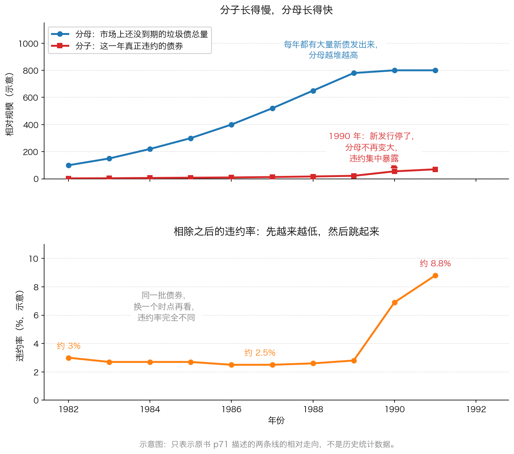

# 第 1 章：违约率是怎么被算小的

> **本章你将：**
> - 用一个"班级借钱"的类比，彻底搞懂违约率是怎么算出来的
> - 看懂这个比率里最要命的两个部分——**分子**和**分母**，以及它们为什么会让数字自己变小
> - 知道推迟"财富结算日"的三种手法，其中一种你以后会经常遇到
> - 明白为什么"违约率低"和"投资者亏得少"是两回事
> - 认识三类当年最大的买家，看清他们为什么心甘情愿放松标准
> - 学会**这对我的钱包意味着什么**：以后看到任何"历史违约率很低"的说法，先问三个问题

上一章我们讲清了垃圾债是什么，以及"堕落天使"和"新发行垃圾债"的区别。但有一个问题还没回答：**既然新发行垃圾债的风险那么大，为什么还有那么多人抢着买？**

答案是：他们相信了一个数字。这个数字叫**违约率**。整座 2000 亿美元的大厦，就架在这个数字上。

---

## 1.1 违约率是什么：一个班 50 个人的借钱实验

先讲清楚这个词。

假设你所在的班有 50 个同学，每个人都找别人借了 1000 元，说好一年后还。一年过去了，有 2 个人没还上。那么：

**违约率 = 没还钱的人数 ÷ 借钱的总人数 = 2 ÷ 50 = 4%**

这里的 2 是**分子**，50 是**分母**。违约率的定义就是：**在一段时间里，没能按约定还钱的债券，占全部债券的比例。**

> 💡 **换个说法：** 违约率就像体检报告上的"异常比例"。它听起来很客观，但你得先问清楚：**是给哪些人体检？异常的标准是什么？谁做的统计？** 换一批人体检、换一个标准，同一个数字能差出好几倍。

现在，把这个概念搬到债券市场上，它长这样：

- **分子**：这一年里真正出现违约的债券金额（或者只数）；
- **分母**：这一年里市场上**还没到期**的债券总量。

> 🇨🇳 **落到 A 股/港股：** 你在新闻里看到的"某某年信用债违约率不到 1%"，用的就是这个算法。这个数字本身没错，错的是**把它当成"安全"的证据**。因为能违约的债券，前提是它还没还完钱；而那些已经还完、已经退市的债券，就不再出现在分母里了。

---

## 1.2 分子和分母：为什么这个比率会自己变小

现在来看原书里最精彩的一段论证。原文是这样的：

> "在 20 世纪80 年代的多数时期内，违约率的分子（在某一年内出现违约的垃圾债的数量）的上升速度低于快速增大的分母（同一年内尚未到期的垃圾债总量）。只有在垃圾债于 1990 年停止发行时，信用质量的恶化才反映在了违约率统计中。"（p71）

把这段话翻译成一句人话：

> 📌 **划重点：** 那个年代每年都有大量**新发行**的垃圾债涌进来，分母越堆越大；而新债刚发出来的时候是不会立刻违约的——**它需要几年时间才能烂掉**。于是分子涨得慢、分母涨得快，**相除之后，违约率自动变小**。这不是债券变安全了，是**分母在帮忙掩盖问题**。

一个更日常的类比：一家医院每年新收 100 个病人，第一年有 3 个人去世，死亡率 3%；第二年又新收 200 个病人，其中 5 个去世，死亡率变成 5 除以 300，只有 1.7%。数字好看了，但**病人的病情并没有变轻**，只是分母变大了。等哪一天不再收新病人了，死亡率立刻就会回到真实水平。

上图就是原书描述的两条线：蓝色是分母，红色是分子。下图的橙线是两者相除得到的违约率——**它先一路走低，然后在 1990 年（新发行停止、分母不再变大）一下子跳起来。** 注意：这两张图是**示意图**，画的是原书描述的变化方向和节奏，不是历史统计数据。

原书 p71 还留了一句很有画面感的话：**"即使杠杆使用情况最严重的垃圾债发行人也不会马上出现违约，资金的消耗需要一定的时间。"** 换句话说，**违约不是不发生，只是还没到时候。**

---

## 1.3 推迟"财富结算日"的三种手法

原书用了一个很妙的说法：**"为了推迟财富结算日的到来"**（p71）。也就是说，所有参与者的共同目标不是解决问题，而是**把问题往后推**。他们用了这样几种办法：

**第一种：多借钱。** 原书说，一种诡计就是"筹集较发行人眼前所需资金多 25%-50% 的资金，以应对未来将出现的现金流短缺"（p71）。听起来很稳健，其实效果是：**账上现金多了，短期就不会违约，违约率统计也就继续好看。** 这就像一个人靠不断办新信用卡来还旧卡的账单——只要还能办下来新卡，他的"逾期记录"就是干净的。

**第二种：把已经出问题的事往后记账。** 原书提到，银行会延迟统计那些欠发达国家（LDC）借款人的违约（p71）。这件事的意义不在于某个具体案例，而在于它揭示了一种普遍做法：**统计口径是可以拖的，只要没人较真。**

**第三种：让债券"暂时不需要付现金"。** 这就是**零息债和 PIK 债**。原书说得很直白："没有现金支付（零息证券或者实物付息债券——即 PIK 债券）证券的大量发行也暂时降低了报告中的垃圾债违约率统计数据。"（p71）道理很简单：**不用付利息，当然就不容易违约。** 但原书紧接着补了一刀：

> "然而，尽管此类证券降低了一些发行人的违约概率，并没有永远降低违约概率。实际上这类债券最终出现违约的可能性大于那些支付利息的证券，因为那些没有从流动现金流中予以支付（经常是没有支付能力）的债务负担会不断累积。在一段时期内不会出现违约，但这仅仅是推迟了违约的发生。"（p71–p72）

这段话我们会在第 3 章用一整章来讲。这里只要记住一句：**没有违约不等于没有问题，可能只是账单还没到期。**

**还有一件事值得单独说：这个违约率数据是谁提供的？** 原书 p72 的回答是：**由承销商提供、学者认同、并被投资者所接受。** 而"这些乐观的分析没有考虑到违约率统计中存在的严重缺陷，而且有时这些研究得到了一些主要的高收益债券承销商的赞助"（p72）。

> ⚠️ **易踩坑：** 当你看到一个"行业违约率极低"的研究时，先看最后一页的脚注：**这个研究是谁出钱做的？** 卖东西的人提供的数据，可以是真的，但**选择哪个口径、截取哪段时间、算不算某些情况**，都是可以做手脚的地方。这不一定是撒谎，但足以让结论完全反过来。

---

## 1.4 违约率低，不等于你亏得少

这是本章第二个关键点，也是很多人一辈子没想明白的地方。

原书 p72 说得很清楚：**"对违约率的计算不仅像虚构的故事，也忽视了违约率与客户损失其实并不是一回事这一事实。"** 为什么不是一回事？原书给了三个理由：

**理由一：同样是违约，买入价不同，你的亏损完全不同。**
这一点你在第 0 章已经算过了：花 60 元买的债券违约后拿回 30 元，亏一半；花 100 元买的债券违约后同样拿回 30 元，亏七成。原书说："一只出现违约的'堕落天使'债券的下跌空间小于一只以账面价格交易的垃圾债。"（p72）**违约率统计只告诉你"有多少只违约了"，完全不告诉你"买它的人亏了多少"。**

**理由二：有些"没违约"的背后，是债权人被迫让了步。**
原书说：违约率"也没有体现出主动性证券交换和重组给财政带来的影响，在这些情况下，债券持有人将接受自己的权利受到损失的事实，而实际上债券并未发生违约"（p72）。

这句话需要解释一下。所谓**主动性证券交换**，通俗说就是：**发行人跟你说"我还不上原来的条件了，我们换个条件吧"**——比如把到期的本金往后推三年、把利息降下来、或者用一堆别的东西来抵。你**被迫同意**，因为不同意就可能一分钱拿不到。从统计上看，这笔债**没有违约**；从你的钱包看，你**实实在在亏了**。

**理由三：违约后的回收比例差别很大。**
有些债券违约后还能拿回六成，有些只能拿回一成。违约率把它们算成同一件事，但你的损失差了六倍。

> 📌 **划重点：** 违约率回答的问题是"**有多少个借款人出事了**"；你真正关心的问题是"**我的钱会怎么样**"。这是两个问题。**永远不要用一个回答 A 问题的数字，去证明 B 问题的答案。**

---

## 1.5 谁在买？他们为什么放松了标准

到这里你可能会问：这么明显的漏洞，专业人士看不出来吗？原书的答案是：**看得出，但他们的处境不允许他们说。** 原书花了很大篇幅介绍三类主要买家（p76–p80），它们的共同点是——**用别人的钱、看短期的成绩单、出事的代价不由自己承担。**

### 第一类：高收益率债券型共同基金

> 💡 **先解释什么是共同基金：** 很多人把钱交给一家专业机构，由它统一去买股票或债券，赚了大家按份额分，亏了也按份额担，机构按规模收管理费。它在我们这里对应的名字就是**公募基金**。

原书讲了两件要命的事：

1. **钱会流向公布回报率最高的基金。** 所以"追求相对表现的基金经理人有强烈的动机购买更多的低等级垃圾债，以强化报告中的回报率"（p77）。原书还给这个现象起了个名字叫"**格雷森垃圾债法则**"——"越来越多的垃圾债正在驱逐高等级债券"。
2. **满仓的约束。** 原书说："共同基金经理人通常会受到满仓投资的制约。他们的思维逻辑就是客户已经作出了资产配置决定，基金经理人的工作就是让这些钱运作起来。"（p77）于是"共同基金有时会购买并持有容易出问题的垃圾债，**尽管投资组合的经理人能够作出更好的判断**"。

请注意最后半句：**经理人自己知道这东西不好，但他还是要买。** 这就是 Week 5 讲过的"被迫挥棒每一次"的具体版本。

### 第二类：储蓄银行

> 💡 **先解释什么是储蓄银行：** 这里指的是美国的储贷机构，主要生意是"吸收老百姓存款、发放住房贷款"，赚的是存款利率和贷款利率之间的差价。1980 年代初管制放松，它们被允许进入一些风险更高的新领域，于是有几十家成了垃圾债市场的大买家（p77）。储蓄银行在别的国家也有对应物，你可以理解成"靠利差吃饭的小银行"。

原书把它们买垃圾债的原因剖析得非常锋利（p77–p79）：

- **存款有保险，所以存款人不在乎银行的风险。** 原书说，因为这些银行得到了联邦储蓄和贷款保险公司每个账户最高 10 万美元的保险，"多数存款人无需留意这些机构及其资产的潜在信誉，只需要关心存款利率"。
- **赚了归自己，亏了有人兜。** 原书说得毫不客气：只要垃圾债没有大面积违约，投资垃圾债的储蓄银行就能公布"属于所有者和经理人的高回报"；**如果投资的债券出现了违约，联邦储蓄和贷款保险公司会承担损失。**
- **报表可以先好看。** 原书指出，直到 1989 年年末，储蓄银行才被要求在财务统计时以市场价格评估投资组合。在此之前，"它们可以在不考虑垃圾债投资组合中不断增加的巨额未实现亏损的情况下，继续公布高额的净收入数据"。而好看的短期盈利，直接对应"提高管理层的薪资，并给所有者提供更高的红利"。

结局呢？原书列了一串名字：哥伦比亚储蓄和贷款协会、辛托拉斯、帝国、林肯储蓄和贷款协会、远西金融公司——**"到了 1990 年，持有垃圾债最多的那些储蓄银行要么已经破产，要么正处在破产边缘"（p78–p79）。**

### 第三类：保险公司

> 💡 **先解释什么是投资保证合约（GIC）：** 你可以把它理解成保险公司卖的一种"保本保息"的理财产品——你把钱放进来，合同上写好一个利率，到期按这个利率给你。它最吸引人的地方是"**根据合同上规定的利率进行再投资，从而有效消除了再投资风险**"（p79）。

问题出在利率下行的时候：政府债券收益率原来是两位数，保险公司能轻松给 GIC 一个诱人的利率；**利率一跌，为了不让资金流走，保险公司只能继续提供高收益率的 GIC**（p79）。可它自己拿不到那么高的收益，怎么办？原书说："为了维持正收益率差，保险公司被迫需求高收益"，于是被诱惑着投向了垃圾债市场（p79）。结局同样惨烈：到 1990 年，许多大型保险公司不得不对垃圾债投资减记数百万美元，第一执行公司和第一资本控股公司处在破产边缘；**1991 年 4 月，政府监管者接管了第一执行公司已经破产的加州和纽约地区的保险子公司（p79–p80）。**

> 🇨🇳 **落到 A 股/港股：** 这三类买家的处境，今天一点都不过时。**当一家机构的钱是"借来的"（客户的钱、保费、存款），而它的成绩单是"季度公布"的，它的行为就会向"短期不违约、报表好看"倾斜，而不是向你（最终出资人）的长期收益倾斜。** 这不是道德问题，是**激励结构**问题——这也是 Week 4、Week 5 反复讲的那件事。

---

## 1.6 标准是怎么悄悄松掉的

原书有一节叫"放松投资标准"（p80），篇幅不长，但值得你一读再读：

> "垃圾债的发行人、承销商和投资者都放弃了现有的价值标准，转而采用了刚刚出现的宽松标准。……新的创新，如非现金支付债券和可以调整利息率的债券等，对标准的放宽提供了掩护。**将对现金流的分析替换成对企业其他指标的分析也造成了投资标准的放宽。**重要的是投资者不知道标准放宽是如何发生的，因为这一过程非常隐蔽，许多垃圾债买家可能甚至没有意识到投资标准有所松动。"（p80）

这段话点出了整章最深的一层：**标准不是被推翻的，是被悄悄换掉的。**

过去大家看的是"这家公司每年能挣到多少真金白银"；后来换成了"这家公司的 EBITDA 是多少"（下一章的主角）；再后来换成了"这只债券的收益率多高""评级是多少""别人都在买"。**每一步替换，都会让某些原本不合格的借款人突然变得合格。** 而可怕的是，身在其中的人**感觉不到**——没有人宣布"从今天起我们降低标准了"，只是大家慢慢不再问那个最难回答的问题。

---

## 1.7 落到 A 股/港股：以后看到"违约率很低"该问什么

把这一章变成一个可以随身携带的习惯。以后再看到任何"历史违约率很低""很安全""从没出过事"的说法，问三个问题：

**问题一：口径是什么？** 他说的是"银行贷款的违约率"还是"债券的违约率"？算不算展期、算不算债务重组、算不算"技术性违约"？有没有把已经违约但还没到期的算进去？

**问题二：样本有多长？** 三年没出事，和一个完整的经济周期没出事，是完全不同的两件事。原书本章的第一句话就是："尽管尚未得到一个完整经济周期的测试，但新发行垃圾债受到了人们的热情欢迎"（p67）。**没有经过一轮经济下行检验的"低违约率"，只是"还没轮到它"。**

**问题三：谁提供的数字？** 卖方（承销商、销售机构）提供的统计数据，不一定假，但**它选的口径通常对它自己最有利**。找一份第三方、或者立场相反的来源对照着看。

> 🇨🇳 **落到 A 股/港股：** 三个具体的动作。
> ① **别把评级当保险。** 评级是"专业机构打的信用分"，它会调整、会滞后，也会出错。**AAA 不是"一定还"，只是"目前看起来还行"。**
> ② **看基金和理财时，别只看收益率和"历史最大回撤"。** 问一句：**它靠什么赚到这些收益？** 是买了利率 2% 的国债，还是买了利率 9% 的债？如果是后者，那 9% 里有一部分是"风险的价格"，不是"管理能力的证明"。
> ③ **把"期限"当成风险的一部分。** 一只三年期的产品，如果它的收益要靠发行人在第三年"能顺利借到新钱"来实现，那么**你实际上是在赌三年后的融资环境**。这正是原书 p76 说的："发行人和投资者都假设，现金流将一直增加，即将到期的债券可以通过再融资来进行支付。"

> 📌 **划重点：** 本章最有用的一句话是——**"过去没违约"是历史，"未来不会违约"是预测。** 这两件事之间隔着一整个经济周期。不要把前者的统计数据，当成后者的保证书。

---

## ✍️ 想一想

1. **如果一家医院每年新收的病人越来越多，它的"死亡率"会怎么变化？** 这个类比里，"病人"对应债券市场里的什么？"停止收新病人"又对应现实中的什么事？
2. **共同基金的经理人明知道某只债券不好，为什么还买？** 试着用"他的考核标准是什么"来回答，而不是用"他水平不行"来回答。
3. **储蓄银行的故事里，谁赚了、谁亏了？** 列出三方的得失：银行的所有者和经理人、存款人、承担保险的机构。想清楚这个结构之后，你觉得今天还有没有类似的结构？

> 💡 **参考思路：**
> 1. 死亡率会**先下降**，因为分母（病人总数）变大了，而新病人短期内还不会去世。类比里，"病人"对应市场上还没到期的债券（分母），"新收病人"对应新发行的债券，"停止收新病人"对应 **1990 年垃圾债停止发行**——分母不再增长，之前积累的问题一下子全部反映到分子上，违约率就跳起来了。**这个类比的重点是：数字变好，不等于事情变好。**
> 2. 因为他的考核标准**不是"你十年后赚不赚钱"，而是"你今年公布的回报率排第几"**。原书 p77 说得很清楚：资金会流向公布最高回报率的基金，所以他有强烈的动机去买收益率更高的低等级债来"强化报告中的回报率"。再加上满仓约束——客户的钱已经进来了，他必须把钱投出去。**当考核标准是短期的、相对的，理性选择就是做短期、相对有利的事。**
> 3. 银行的所有者和经理人**赚了**：短期报表好看，薪资和红利上去了；如果赌赢了，收益归自己。存款人**基本没亏**：因为每个账户有最高 10 万美元的保险，他们只关心存款利率，不看银行的风险。亏的是**承担保险的机构和最终的纳税人**——原书说"如果投资的债券出现了违约，联邦储蓄和贷款保险公司会承担损失"（p78）。这种"赚了归自己、亏了别人兜"的结构，在金融史上反复出现，**每一次的形式不同，激励的方向是一样的。** 你要做的不是记住名字，而是学会在看到"高收益 + 有兜底"时，立刻去找那个**真正承担损失的人是谁**。

---

## 🧮 算一算

下面是一组**简化示意数字**，用来让你亲手体会"分母帮忙掩盖问题"的过程。

一个小债券市场，年初有 **20** 只老债券还在存续。接下来三年：

- **第 1 年**：新发行 **60** 只；这一年有 **2** 只违约。
- **第 2 年**：新发行 **80** 只；这一年有 **3** 只违约。
- **第 3 年**：**一只新债都没发出去**；这一年有 **12** 只违约。

（假设违约的债券从下一年起不再出现在市场上。）

**请算：**

1. 每一年的"年末存续债券只数"（也就是分母）分别是多少？
2. 每一年的违约率各是多少（保留一位小数）？
3. 只看每年公布的违约率，这三年给人的感觉是变好还是变坏？
4. 如果把三年合起来看——三年一共发行了多少只债券、一共违约了多少只，累计违约率是多少？
5. 为什么第 3 年的违约率会突然跳起来？

**分步解答：**

**第 1 步：算出每年的分母。**

- **第 1 年**：年初已有 20 只，这一年又发了 60 只。
  分母 = 20 + 60 = **80 只**。
- **第 2 年**：去年年末的 80 只里，有 2 只违约了、不再存续，剩 78 只；这一年又发了 80 只。
  分母 = 78 + 80 = **158 只**。
- **第 3 年**：去年年末的 158 只里，有 3 只违约，剩 155 只；这一年一只都没新发。
  分母 = 155 + 0 = **155 只**。

**第 2 步：算出每一年的违约率。**

违约率等于当年违约的只数除以当年的分母。

- **第 1 年**：2 除以 80 = 0.025，也就是 **2.5%**。
- **第 2 年**：3 除以 158，大约是 0.019，也就是 **1.9%**。
- **第 3 年**：12 除以 155，大约是 0.077，也就是 **7.7%**。

**第 3 步：回答"感觉变好还是变坏"。**

前两年公布的违约率是 **2.5% → 1.9%**，一路走低。**如果你是在第 2 年年底看到这个数据的人，你得到的印象是："这个市场越来越安全了。"** 这正是原书 p71 描述的情形：分子的上升速度低于快速增大的分母。

**第 4 步：算累计口径。**

- 三年一共发行：20（年初就有）+ 60 + 80 = **160 只**。
- 三年一共违约：2 + 3 + 12 = **17 只**。
- 累计违约率：17 除以 160，大约是 0.106，也就是 **10.6%**。

**对比一下：** 逐年看的违约率最低只有 1.9%，而**累计口径是 10.6%，差了五倍多**。同一批债券、同样的事实，换个算法就是两个世界。

**第 5 步：为什么第 3 年会跳起来？**

因为第 3 年**没有新债发出来**，分母停止增长（155 只，比上一年的 158 只还少了一点）；而前两年发出去的那 140 只债券，经过两三年，问题开始集中暴露——**分子补涨，分母不动，比率自然跳升。**

**最后记住一句话：** 第 1 年发出去的 60 只债券，在第 1 年基本都还活着；它们的违约风险并没有消失，只是**排在未来的某一年**。原书说"即使杠杆使用情况最严重的垃圾债发行人也不会马上出现违约，资金的消耗需要一定的时间"（p71）——**时间一到，账总是要结的。**

---

## ✅ 小测验

**1. 20 世纪 80 年代垃圾债的违约率被算小，最主要的技术原因是：**
A. 违约的债券都被承销商偷偷买回去了
B. 新发行的债券让分母迅速变大，而新债短期不会违约，分子涨得慢
C. 当时的债券都不需要付利息，所以永远不会违约
D. 评级机构把违约的债券从数据库里删掉了

**2. 关于"违约率低"和"投资者亏得少"，下面哪个说法符合原书的意思？**
A. 两者是一回事，违约率低就意味着投资者亏得少
B. 违约率低就一定说明发行人的信用质量在改善
C. 两者不是一回事：买入价不同亏损不同，债务重组不算违约，违约后的回收比例也差别很大
D. 只要违约率低于 1%，投资者就不会有任何本金损失

**3. 储蓄银行大量买入垃圾债，最根本的原因是：**
A. 储蓄银行的经理人都是垃圾债方面的专家
B. 监管要求储蓄银行必须配置一定比例的垃圾债
C. 存款有保险、存款人只看利率不看风险，赚了归股东和经理人，亏了由保险机构承担
D. 垃圾债的流动性比存款好，方便随时取用

> **答案与解析**
>
> **1. B。** 原书 p71 的原文："违约率的分子……的上升速度低于快速增大的分母……只有在垃圾债于 1990 年停止发行时，信用质量的恶化才反映在了违约率统计中。" A、D 都是编造的，原书没有这样的说法；C 恰好说反了——正是因为很多债券**不需要付现金利息**（零息债、PIK 债），违约才被暂时推迟，而不是"永远不会违约"。
>
> **2. C。** 原书 p72 明确说"违约率与客户损失其实并不是一回事"，并给出三个理由：堕落天使违约的下跌空间更小、主动性证券交换和重组会让债权人权利受损但不算违约、回收情况各异。A、B 把两件事混为一谈；D 是典型的"用一个数字当保证书"，即使违约率很低，**只要有一只债券让你亏掉一半本金，你的账户就是亏的**。
>
> **3. C。** 原书 p78 的原文几乎就是 C 的展开："只要垃圾债没有出现大面积的违约，投资垃圾债的储蓄银行就能公布属于所有者和经理人的高回报。如果投资的债券出现了违约，联邦储蓄和贷款保险公司会承担损失。"而且原书指出，因为存款有保险，"市场不会也没有对储蓄银行机构的投资行为作出约束"。A、B、D 都与原书不符——不是专业性、不是监管要求、更不是流动性。

---

## 📖 回到原书

- 对应原书 **第四章** 的中段，`raw/安全边际-中文版/page_071.md` ~ `page_073.md` 以及 `page_076.md` ~ `page_080.md`（原书 p71–p73、p76–p80）。
- **建议精读**：
  - p71——"违约率计算中的缺陷"，分子与分母那一段，本章的核心；
  - p72——"违约率与客户损失不是一回事"的完整论证；
  - p76–p78——巴里·威格莫关于利息覆盖率的研究，以及高收益率共同基金、储蓄银行两节；
  - p80——"放松投资标准"，看标准是怎么被悄悄换掉的。
- **可以略读**：p79–p80 关于投资保证合约（GIC）和保险公司的那一段。它是很好的历史案例，但结构上与储蓄银行一节重复，知道"保险公司也因为在低利率下追逐高收益而被拖下水"就够了。
- **原书金句（逐字引用）：**
  > "在 20 世纪80 年代的多数时期内，违约率的分子（在某一年内出现违约的垃圾债的数量）的上升速度低于快速增大的分母（同一年内尚未到期的垃圾债总量）。只有在垃圾债于 1990 年停止发行时，信用质量的恶化才反映在了违约率统计中。"（p71）
  > "对违约率的计算不仅像虚构的故事，也忽视了违约率与客户损失其实并不是一回事这一事实。"（p72）
  > "违约率由承销商所提供、学者认同、并被投资者所接受，正是违约率数据让投资者因那些信用质量恶化的垃圾债而蒙受了亏损。"（p72）
  > "重要的是投资者不知道标准放宽是如何发生的，因为这一过程非常隐蔽，许多垃圾债买家可能甚至没有意识到投资标准有所松动。"（p80）
