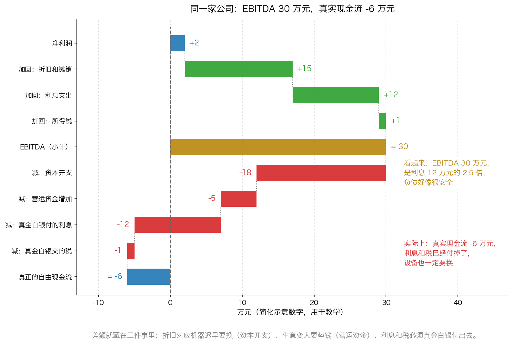
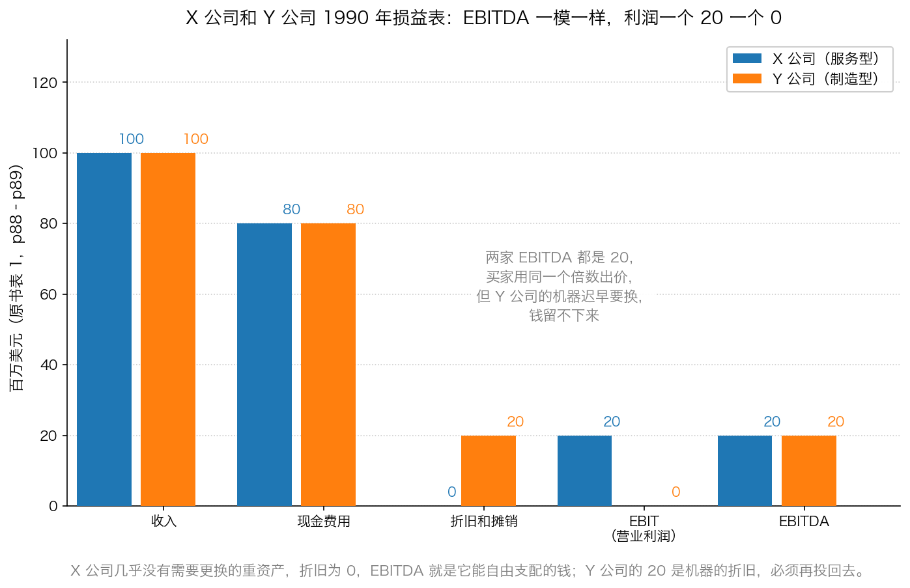

# 第 2 章：EBITDA 与现金流的花招

> **本章你将：**
> - 用一家奶茶店的例子，一次分清"利润""折旧""资本开支"这三件容易混的事
> - 学会一张能拿纸笔自己算的**桥接表**：从净利润一路算到真正的自由现金流
> - 说清楚 EBITDA 到底是什么，以及它为什么**不是**现金流
> - 看懂原书那张经典对照表：EBITDA 完全一样的两家公司，价值为什么天差地别
> - 拆穿"我在资本结构里排在别人前面，所以我安全"这句话为什么是假的保护
> - 明白**这对我的钱包意味着什么**：以后谁给你一个"EBITDA 倍数"，你都能自己验算一遍

上一章讲的是**数字口径**的花招：违约率怎么被算小。这一章讲**分析工具**的花招：大家不再看公司真正赚到多少现金，改看一个叫 EBITDA 的东西。这是本周技术含量最高的一章，也是最值得你反复读的一章——**因为这套花招今天还在用，而且用得更熟练。**

---

## 2.1 先分清三件事：利润、折旧、资本开支

在讲 EBITDA 之前，得先把三个词分清楚。用一家奶茶店来举例。

**第一件事：利润。**
你的奶茶店这一年卖了 40 万元的奶茶，原料、房租、两个店员工资一共花掉 30 万元。那么账面上的利润就是 40 万减 30 万，等于 **10 万元**。这件事很好理解。

**第二件事：折旧。**
开店的时候，你花 **3 万元**买了一台封口机，能用 **5 年**。问题来了：这 3 万元，应该算在**哪一年**的成本里？

会计的选择是：**不算在买的那一年，而是分 5 年、每年扣 6000 元**。这每年扣掉的 6000 元，就叫**折旧**。

> 💡 **换个说法：** 折旧就是"把一笔大额支出，摊到它真正被用掉的这些年里"。你买机器那一年，钱是一次性花出去的；但机器是分五年慢慢用掉的，所以会计上说，成本也分五年慢慢算。

**第三件事：资本开支。**
你**真的掏出 3 万元买机器那一刻**的现金流出，叫**资本开支**（英文缩写常写作 capex）。厂房、设备、车辆、服务器、修路修桥，都算这一类。

现在把折旧和资本开支放在一起看，这是全章的钥匙：

| | 折旧 | 资本开支 |
|---|---|---|
| 记在哪里 | 利润表里，作为一项成本被扣掉 | 现金流量表里，作为一笔现金流出 |
| 影响利润吗 | 影响，会减少账面利润 | 不影响当期利润 |
| 掏现金吗 | **不掏**。钱早就花掉了 | **掏**。真金白银出去 |
| 什么时候发生 | 每年都记一笔，很平滑 | 需要的时候才发生，可能忽大忽小 |

> 📌 **划重点：** 折旧**不产生**现金流出，但它对应的那笔支出**迟早会再发生一次**。机器会旧、会坏、会被淘汰，到时候你必须再掏一笔钱。**折旧是"未来的资本开支"提前写在你账上的提醒。**

这三件事分清楚了，下面的内容就都好懂了。

---

## 2.2 从净利润到真正的自由现金流：一张能自己算的桥接表

现在来做一件最有价值的事：**把一家公司从"账面上赚了多少"一路算到"真正能自由支配多少现金"。**

下面全部是**简化示意数字**（单位：万元），用于教学，不是任何一家真实公司的财报。假设这是一家制造业公司：

| 项目 | 金额 | 说明 |
|---|---|---|
| 营业收入 | 100 | 卖出去的东西 |
| 减：现金成本费用 | 70 | 原料、人工、水电，都是真掏了钱的 |
| 减：折旧和摊销 | 15 | 会计上摊到今年的，不是今年掏的钱 |
| **= EBIT（息税前利润）** | **15** | 100 减 70 减 15 |
| 减：利息支出 | 12 | 借钱的成本 |
| 减：所得税 | 1 | 剩下的 3 万元里交掉 1 万元税 |
| **= 净利润** | **2** | 会计上的最终利润 |

先记住一个数：**EBITDA 等于 15 加 15，等于 30 万元。**

现在开始搭桥。**这座桥的任务是：从净利润 2 出发，走到真正的自由现金流。**

**第一步：加回折旧和摊销（加 15）。**
因为折旧已经在上面的利润里被扣掉了，但它**并没有让今年的现金流出**。所以算现金的时候要加回来。

2 加 15 = **17**。

**第二步：加回利息支出（加 12）。**
利息在算净利润时被扣掉了，但它是给银行和债权人的钱，不是经营的现金成本。这里先加回来（后面还要减掉真正付出去的部分，别急，往下看）。

17 加 12 = **29**。

**第三步：加回所得税（加 1）。**
同上，税也不是经营的现金成本。

29 加 1 = **30**。这就是 **EBITDA**。

到这里先停一下。**EBITDA 的完整名字是"息税折旧摊销前利润"，它的算法就是：把利息、税、折旧、摊销这四样，统统加回到利润上去。** 很多材料把它说成"公司产生现金的能力"，听起来很美。

**但是——这 30 万元里，混着三笔必须真金白银付出去的钱。** 所以桥还没走完，接下来要往下减。

**第四步：减资本开支（减 18）。**
机器旧了要换、厂房要修，这一年真花了 18 万元。

30 减 18 = **12**。

**第五步：减营运资金增加（减 5）。**
生意做大了，存货要多备一点、客户赊账要多一点，这些钱是先垫出去的。这一年垫了 5 万元。

12 减 5 = **7**。

**第六步：减掉真正付出去的利息（减 12）。**
刚才加回来的 12 万元利息，现在要真的减掉——因为它确实是要付给别人的现金。

7 减 12 = **-5**。

**第七步：减掉真正交出去的所得税（减 1）。**

-5 减 1 = **-6**。

**桥的另一头写着一个负数：真正的自由现金流是 -6 万元。**

> 📌 **划重点：** 同一家公司、同一年，**EBITDA 是 30 万元，真正的自由现金流是 -6 万元。** 差的 36 万元不是会计差错，是**三件被 EBITDA 藏起来的事**：机器要换（资本开支 18）、生意变大要垫钱（营运资金 5）、利息和税必须付（12 加 1 等于 13）。18 加 5 加 13，正好等于 36。

**验算一遍（这条更简单，建议你直接记这一条）：**

**真正的自由现金流 = 净利润 + 折旧摊销 - 资本开支 - 营运资金增加**

2 加 15 减 18 减 5 = **-6**。和上面走七步的结果一样。

两条路都能算，说明这套逻辑是自洽的。**你只需要记住：折旧加回来，是为了减掉资本开支；两个一起看，才知道这家公司到底有没有留下钱。**

---

## 2.3 EBITDA 是怎么流行起来的

搞懂了算法，我们再看它是怎么变成"标准答案"的。

原书说得很清楚（p85）：在垃圾债时代到来之前，投资者关心的是两个数据——**税后利润，加上折旧和摊销，减去资本支出**。这正是你刚才算的那条路。转折发生在 20 世纪 80 年代后半期：

> "为了快速分析自由现金流，20 世纪80 年代的投资者找到了一种简单的计算方法，用一个数字来量化一家企业的现金产生能力。绝大多数的投资者都是根据EBITDA（扣除利息、税收、折旧和摊销之前的利润）来计算现金流。事实上，对高杠杆公司进行的所有分析都依赖于EBITDA，并将其看作是企业价值主要的决定性因素，有时是唯一的决定性因素。"（p85）

为什么偏偏是那个年代？因为**杠杆收购（LBO）**。借钱买公司的人最关心一件事："这家公司每年能拿出多少现金还我的债？"而 EBITDA 算出来的数字**总是比真实现金大**，正好符合他们的需要。原书还专门解释了其中一层技术原因：**利息支出是免税的**——企业用税前利润去付利息，本来应该交税的那部分利润流向债权人了，所以高杠杆企业能比低杠杆的同类企业留下更多的现金流（p85）。

> 💡 **换个说法：** EBITDA 就像一个人跟人吹嘘自己的收入："我月薪三万！"——没扣房租、没扣税、没扣车贷、没扣房贷。只要你不追问，这个数字听起来确实很漂亮。**而 EBITDA 的四个"加回项"，恰好就是企业和个人的四笔固定支出：利息（房贷）、税、折旧（车和设备的损耗）、摊销。**

原书还点了一句最扎心的话：**EBITDA 之所以被采用，"因为没有其他工具能够支持当时普遍非常高的收购价格"（p88）。** 也就是说，不是因为它更准确，而是因为**别的算法算不出那么高的价**。原书接着说："这显然是一种循环论证。没有高价的收购案，就不会产生高昂的预付投资银行业务费……"（p88）。**先有结论（高价），再去找能支持结论的算法。**

---

## 2.4 EBITDA 为什么不是现金流：四笔被藏起来的钱

现在逐条清算。EBITDA 把四样东西加回去了，我们看看这四样各自意味着什么。

**第一，利息要真金白银付出去。** 借了钱就要付利息，这是现金流出，而且**在还完本金之前每一年都跑不掉**。EBITDA 把利息加回来，等于假设"这笔钱不用还"。

**第二，税要真金白银交出去。** 原书有一段话专门讲这件事，很精彩：

> "尽管如此，EBIT（息税前利润）并不一定都是可以自由获得的现金。如果利息支出用掉了所有的EBIT，那么公司就不用支付任何的所得税。然而，如果利息支出较少，税收将消耗掉很大比例的EBIT。……因此，EBIT 并不是这些企业合理的现金流近似值。税后利润加上EBIT 中用于支付利息支出的那部分利润就是一家企业真正来自于收益流的现金流。"（p86）

翻译一下：**只有当利息高到把利润全部吃光，税才是零；利息一旦没那么高，税就会吃掉一大块。** 而在垃圾债的鼎盛时期，企业借了那么多债，以至于"所有的EBIT（或者超过所有的EBIT）都被用于支付利息"（p86）——所以那个年代的 EBITDA 看起来特别接近现金。**这不是因为它算得对，而是因为当时的利息实在太高了。**

**第三，折旧对应的设备，迟早要花钱换。** 这是最容易被忽略、也最致命的一条。原书说：

> "折旧提成能够产生现金，但最终必须将这些现金用于资本支出，对破旧厂房和设备进行必要的替换。因此，资本支出直接抵消了折旧提成，前者使用现金，后者则提供现金。"（p86）

然后是那句应该刻在脑子里的话：**"如果资本支出在很长时间内低于折旧，那么这家公司就在逐步进行清算。"（p86）** 意思是：它今天的现金好看，是因为**它在吃自己**——不修厂房、不换设备、不做维护，把本该花掉的钱省下来当利润。这种"好日子"总有到头的一天。

原书还预判了一种辩护，并且当场反驳了（p87–p88）：有人说"资本支出可以全部靠外部融资解决（租赁融资、设备信托、无追索权债券），所以不用从 EBITDA 里减"。原书的回应是：**"任何一家企业都不能对租赁资产的改良和一台机器的零件进行融资"**，而且"陷入财务困境的企业获得外部融资的空间会受到限制，不管他们的目的是什么"。结论是：**"在将折旧提成用于支付债务之后，一家使用了过高杠杆的企业可能无法替换破旧的厂房和设备，最终被迫宣布破产或者进行清算。"（p88）**

**第四，生意变大要垫钱（营运资金）。** 收入涨了，存货要备更多、客户赊账要更多，这些钱要先垫出去。EBITDA 完全不看这一项。

> ⚠️ **易踩坑：** 你在 A 股/港股 里最常听到的 EBITDA 用法是"**EBITDA 利息保障倍数**"：拿 EBITDA 除以一年的利息，说"能覆盖 X 倍，所以安全"。**这个倍数天然偏高，因为它把资本开支和营运资金都排除在外了。** 一家重资产公司可能 EBITDA 利息保障倍数有 3 倍，但真实现金流是负的——**它付得起利息，只因为它不换设备。**

---

## 2.5 "折旧是虚的"这句话错在哪：A 股 里的两种生意

"折旧只是账面数字，不用管它"——这句话在某些公司是对的，在另一些公司会要命。区别在于：**这家公司的折旧，未来是不是真的要花出去。**

看两个极端（都在我们课程的固定案例池里）：

**长江电力（600900.SH）——重资产、折旧大。**
水电站是典型的"前期砸大钱、后面慢慢收"的生意：大坝、机组、输变电设备都记在资产里，每年要提一大笔折旧。如果按 EBITDA 看，它非常漂亮。但你要多问一句：**大坝和机组真的会老化，真的需要维护和更新，这些钱是不是迟早要花？** 答案是会。所以对这类公司，**"经营现金流减资本开支"才是更诚实的口径**，EBITDA 只能当作一个辅助。

**贵州茅台（600519.SH）——轻资产、折旧小。**
它的核心资产是品牌和窖池，不需要每年投巨资更新生产线。折旧相对收入很小，资本开支也不大，所以**它的净利润和自由现金流离得很近**。对这类公司，看利润和现金流都行，EBITDA 和自由现金流之间的差距不会太离谱。

> 🇨🇳 **落到 A 股/港股：** 用一句话分类——**凡是"不用持续投钱就能维持生意"的公司，EBITDA 的参考价值高一些；凡是"停下来不投钱就会垮"的公司，EBITDA 的参考价值很低，甚至有害。** 高速公路、电力、机场、航运、钢铁、化工、面板、通信运营，这些行业都属于后者。**注意：这不是说这些行业不能投，而是说对它们，你必须自己搭一遍桥接表。**

---

## 2.6 原书那张经典对照表：X 公司和 Y 公司

现在来看原书最有名的一个例子（p88–p89 的表 1）。**下面的数字全部照抄原书，单位是百万美元：**

| 项目 | X 公司（服务型） | Y 公司（制造型） |
|---|---|---|
| 收入 | 100 | 100 |
| 现金费用 | 80 | 80 |
| 折旧和摊销 | 0 | 20 |
| **EBIT（营业利润）** | **20** | **0** |
| **EBITDA** | **20** | **20** |

**两家公司的 EBITDA 一模一样，都是 20。** 原书说：**"将EBITDA 看成是唯一的分析工具的投资者会认为这两家企业的价值是相等的。"（p89）**

但原书紧接着给出了判断：**"在价格相等的时候，多数投资者更喜欢持有利润为2000 万美元的X 公司，而不是利润为零的Y 公司。"（p89）**

为什么？原书解释得很清楚：

- **X 公司**是一家**并不拥有贬值资产**的服务型公司。它没有折旧，也就意味着**它赚到的 20 就是它能自由支配的钱**，随着时间的推移，"公司将累积大量的自由现金流"（p89）。
- **Y 公司**是"某一充满竞争的行业中的一家制造公司"。它的 20 是**机器的折旧**，它"必须准备好对折旧提成进行再投资，以替换破旧的机器（或者可能会需要更多的现金，关键看通胀）"，所以"这家公司在一段时间内将没有自由现金流"（p89）。

原书还给了结局："任何使用杠杆收购 Y 公司的人都会陷入麻烦。公司 2000 万美元的 EBITDA 都将被用于支付利息费用，这意味着当需要替换厂房和设备时，公司将缺乏现金。**Y 公司最终将破产，既没有能力偿还债务，也无法维持经营。**"（p89）

> 📌 **划重点：** 这个例子教你一件事——**EBITDA 会把好生意和坏生意算成同一个数字。** 原书说得很重："投资关注焦点从税后利润到EBIT，再到EBITDA 的转变**掩盖了企业之间的重要区别**，导致许多投资者蒙受了损失。"（p89）

---

## 2.7 "我排在资本结构里更靠前，所以我安全"——这句为什么是假的

这是本章的第二个重点，也是原书里最锋利的一段批评。

先解释**资本结构**是什么。

> 💡 **先解释什么是资本结构：** 一家公司所有的钱是从哪来的，以及**如果公司出事，谁先拿钱、谁后拿钱**。这个排队顺序大致是：先还银行和供应商 → 再还债券持有人 → 再还优先股股东 → 最后才轮到普通股股东。这个"排队顺序"就叫资本结构。

听起来很有道理对吧？"我排在别人前面，所以公司出事的时候我先拿钱，我安全。" 原书说，20 世纪 80 年代的垃圾债投资者就是这么想的，而且这个想法是**危险的错误**：

> "在垃圾债投资者放宽标准的同时出现了一个危险的错误想法，即在一家企业的资本结构中，债券和股票较一个人在这家公司中的投资的级别低多少，那么他就能对自己的投资提供多少保护。**这就像是一家企业的价值因资产负债表中的负债而存在，而不因表中的资产。**如果知道一家企业中的一些投资者的权利低于你的权利，虽然这从表面上看起来很可靠，然而，这一信息在评估你的投资价值的时候并没有多大的价值，如果这一信息确实有价值的话。"（p84）

用一句人话概括原书的意思：

> 📌 **划重点：** **公司的价值来自它拥有的资产和它能赚到的现金，不来自它欠了多少钱、谁排在谁后面。** 排队顺序只有在"有东西可以分"的时候才有意义。如果一块蛋糕只够一个人吃，你排在第二名，你拿到的还是零。

原书用雷诺兹-纳贝斯克（RJR Nabisco）的收购案做了演示（p84）。那是当时规模最大的一笔杠杆收购，动用了 **250 亿美元**的资金。华尔街的分析师当时说："填塞"债券和优先股的发行**提高了**RJR 公司高等级债券的信誉。原书用一个假设把它拆穿了：

> "为了支持这一荒谬观点，假设KKR 公司收购时支付了129 美元/股，而不是109 美元/股外加40 亿美元的优先股。高等级债券的债权人不会因这些等级低于他们所持债券的优先股而获得更多的回报。属于公司的有形资产不会较之前有所增加，**只有被称之为商誉的无形资产的价值才会通过记账方法而增加**。另外，负债与股本之间比率的改善将与高等级债券人的安全性无关。"（p84）

这段话需要慢慢读，我们拆成三步：

**第一步：多付出的钱去哪了？** 收购方多付了 20 美元/股，这些钱**付给了原来的股东**，不是留在公司里。公司的资产一件都没多。

**第二步：账上多了什么？** 多出来的只有一样东西：**商誉**。所谓商誉，就是"买这家公司花的钱，超过它账面净资产的那一部分"。它是一笔记账数字，**不是可以拿来还债的现金，也不是可以卖掉的机器**。原书在讲摊销时说得更直白：商誉摊销"更像是会计上的伪造"（p86）。

**第三步：那"我排在优先股前面"有什么用？** 没用。因为**能分给债权人的东西一点没变**。你排在一个"本来就什么都拿不到的人"前面，你的处境没有任何改善。

原书最后那句话，是整段的点睛之笔：

> "对低等级权利的强调是一种更加愚蠢的观点，那时一个人的满足感来自于**别人可能采取的愚蠢行动**，而不是自己的聪明才智。"（p84）

> ⚠️ **易踩坑：** 这句话今天在 A 股/港股 里有大量"替身"，认出来它们比记住名字重要：
> - **"有担保的债比没担保的安全"**——先看抵押物值多少钱、够不够分，再谈顺序；
> - **"可转债有债底，跌不到哪去"**——债底的前提是**这家公司还得起债**，还不起的时候"债底"就是股价；
> - **"我是优先股/优先级，排在普通股前面"**——公司没钱的时候，前面和后面一起归零；
> - **"母公司的债，有子公司资产做支撑"**——要看法律上到底有没有担保，以及子公司的资产是不是已经抵押给别人了。
>
> 这四句话的共同套路是：**用"我的位置"来回答"我的价值"。** 位置不等于价值。

---

## 2.8 本章的三句话

读到这里，把这一章压成三句话带走：

1. **折旧加回来，是为了减掉资本开支。** 两个必须一起看，只看一个就是自欺欺人。
2. **EBITDA 不是现金流，它是"没扣房租、没扣税、没扣车贷的收入"。** 它可以用来做粗略的比较，但**永远不能替代真实现金流**。
3. **公司值多少钱，由它的资产和现金流决定，不由它的负债结构决定。** 别人排在你后面，不会让你的那份变多。

---

## ✍️ 想一想

1. **一家公司连续五年"资本开支都小于折旧"，你觉得这五年里它的利润是偏乐观还是偏保守？** 五年之后，它大概会遇到什么问题？
2. **如果有人告诉你"这家公司 EBITDA 有 30 亿，是利息的 3 倍，非常安全"，你要问他哪三个问题？** （提示：想想刚才那座桥上有哪几步。）
3. **"我买的是优先股，排在普通股前面"——为什么这句话不能让你安心？** 试着用"一块蛋糕"的比喻回答。

> 💡 **参考思路：**
> 1. **偏乐观。** 因为折旧对应的那些设备在慢慢变旧，而公司没有把钱花回去更新它们。原书 p86 的原话是："如果资本支出在很长时间内低于折旧，那么这家公司就在逐步进行清算。"五年之后它会遇到的问题是：设备老化、效率下降、维修费用上升，**要么被迫一次性补上几年欠下的投入（利润大幅下滑），要么生意被竞争对手甩开。** 那些年"多出来"的利润，本质上是**把家底当利润吃了**。
> 2. 三个问题：**① 资本开支是多少？够不够替换折旧？② 营运资金这一年占用了多少钱？③ 利息和税真的付出去多少？** 把这三个数从 EBITDA 里减掉，才是真实现金流。如果对方答不上来，或者只说"这些不用管"，那你要警惕的不是数字，而是**他为什么不愿意让你看完整的那张表**。
> 3. 因为优先股、普通股、债券的"排队顺序"只在**有东西可以分**的时候才有意义。假设一块蛋糕只够一个人吃，你排在第二个，你拿到的还是零。原书 p84 说得更狠：那种满足感来自"别人可能采取的愚蠢行动"，而不是自己的聪明才智。**真正决定你安不安全的，是蛋糕有多大（公司的资产和现金流），而不是你排在第几位。**

---

## 🧮 算一算

下面是一家高杠杆制造公司的数据。**全部是简化示意数字**（单位：万元），用来让你练习搭桥。

| 项目 | 金额 |
|---|---|
| 营业收入 | 1000 |
| 现金成本费用（原料、人工、水电） | 760 |
| 折旧和摊销 | 120 |
| 利息支出 | 100 |
| 所得税 | 5 |
| 资本开支 | 150 |
| 营运资金增加 | 40 |

**请一步一步算：**

1. EBIT（息税前利润）是多少？
2. 净利润是多少？
3. EBITDA 是多少？
4. 真正的自由现金流是多少？（请用**两条不同的路**各算一遍，互相验算）
5. "EBITDA 除以利息"是多少倍？
6. 如果这家公司把资本开支压到 100 万元，自由现金流变成多少？这样做有什么代价？
7. 用一句人话判断：这家公司安全吗？

**分步解答：**

**第 1 步：EBIT。**
EBIT 等于收入减现金成本，再减折旧摊销。
1000 减 760 等于 240；240 减 120 等于 **120 万元**。

**第 2 步：净利润。**
从 EBIT 出发，减去利息，再减去所得税。
120 减 100 等于 20；20 减 5 等于 **15 万元**。
（顺便验算一下税率是否合理：税前利润 20 万元，交了 5 万元税，税率 25%，正常。）

**第 3 步：EBITDA。**
EBITDA 等于 EBIT 加折旧摊销。
120 加 120 等于 **240 万元**。
（也可以这样看：净利润 15 加利息 100 加税 5 加折旧摊销 120，等于 240。两条路一致。）

**第 4 步：真正的自由现金流——第一条路（走桥）。**

| 步骤 | 计算 | 结果 |
|---|---|---|
| 起点：净利润 | 15 | 15 |
| 加回：折旧和摊销 | 15 加 120 | 135 |
| 加回：利息支出 | 135 加 100 | 235 |
| 加回：所得税 | 235 加 5 | 240（这就是 EBITDA） |
| 减：资本开支 | 240 减 150 | 90 |
| 减：营运资金增加 | 90 减 40 | 50 |
| 减：真金白银付的利息 | 50 减 100 | -50 |
| 减：真金白银交的税 | -50 减 5 | **-55** |

**第一条路的结果：-55 万元。**

**第 4 步（续）：第二条路（用简化的公式）。**

**自由现金流 = 净利润 + 折旧摊销 - 资本开支 - 营运资金增加**

15 加 120 等于 135；135 减 150 等于 -15；-15 减 40 等于 **-55 万元**。

两条路都是 **-55 万元**，互相印证。

**这个结果的意思是：** 这家公司账面上还赚了 15 万元净利润，EBITDA 更是高达 240 万元，但**它这一年真正的现金是净流出的，流出了 55 万元。** 少的钱去哪了？主要两处：资本开支 150 万元（比折旧 120 万元还多 30 万元，说明它在扩张或者在补投入），以及利息 100 万元。

**第 5 步：EBITDA 除以利息。**
240 除以 100，等于 **2.4 倍**。
按这个指标看，公司"赚的钱是利息的 2.4 倍"，很多研报到这里就会写"偿债能力良好"。

**但请注意对比：** EBITDA 除以利息是 **2.4 倍**（正的、很好看的），而真实现金流除以利息是 **-0.55 倍**（负的、难看的）。**同一个东西，两个指标给出完全相反的结论。**

**第 6 步：把资本开支压到 100 万元。**
自由现金流 = 15 加 120 减 100 减 40 = **-5 万元**。
还是负的，只是缺口小了 50 万元。

**代价是什么？** 折旧是 120 万元，你只投 100 万元——**比折旧还少 20 万元。** 这意味着设备在净损耗：今年的产能还能撑，明年、后年就要出问题。原书 p86 那句话在这里正合适：**"如果资本支出在很长时间内低于折旧，那么这家公司就在逐步进行清算。"** 省下来的钱不是赚到的钱，是**从家底里掏出来的钱**。

**第 7 步：一句人话判断。**
**不安全。** 它的 EBITDA 看起来能覆盖利息 2.4 倍，但真实现金流是 **-55 万元**——**它连自己承诺的利息都赚不回来，必须靠账上的现金或者再借新钱来补。** 一旦借不到新钱、或者生意再差一点，就会立刻陷入困境。

**最后记住这道题的三个数：240、2.4、-55。** 240 是卖方告诉你的数字，2.4 是卖方给你的结论，-55 是你自己算出来的真相。**这就是"自己搭一遍桥"的全部意义。**

---

## ✅ 小测验

**1. 关于 EBITDA，下面哪个说法是对的？**
A. EBITDA 就是公司真正能自由支配的现金
B. EBITDA 把利息、税、折旧、摊销都加回去了，所以它天然大于真实现金流，不能替代现金流
C. 只要资本开支靠外部融资解决，EBITDA 就等于自由现金流
D. EBITDA 越高，说明公司的资产质量越好

**2. 原书的 X 公司和 Y 公司，EBITDA 都是 20，为什么多数投资者更喜欢 X 公司？**
A. X 公司的收入更高
B. X 公司的现金费用更低
C. X 公司几乎没有需要更新的贬值资产，利润更接近可以自由支配的现金；Y 公司的 20 是机器折旧，必须再投回去
D. Y 公司的税更高

**3. "我在资本结构里排在其他投资者前面，所以我的投资更安全"——这个说法错在哪里？**
A. 错在排在前面的投资者其实没有优先权
B. 错在公司价值来自它的资产和现金流，位置靠前只在"有东西可分"时才有意义，新增的低等级证券并不会让公司的有形资产变多
C. 错在只有普通股股东才有优先权
D. 这个说法是对的，只是偶尔会失效

> **答案与解析**
>
> **1. B。** 原书 p85–p88 整节都在论证这一点：EBITDA 把利息、税、折旧、摊销四样都加回去了，而其中利息和税必须真金白银付出去，折旧对应的设备迟早要用资本开支替换。A 是最常见的误解；C 正是原书点名反驳的辩护——"任何一家企业都不能对租赁资产的改良和一台机器的零件进行融资"（p88）；D 无关，EBITDA 是利润口径的指标，说明不了资产质量。
>
> **2. C。** 原书 p89："在价格相等的时候，多数投资者更喜欢持有利润为2000 万美元的X 公司，而不是利润为零的Y 公司。"理由是 X 公司没有贬值资产、会累积自由现金流，而 Y 公司"在一段时间内将没有自由现金流"。A、B 都错——两家公司的收入和现金费用完全一样（都是 100 和 80）；D 无关，原书没有提税。
>
> **3. B。** 原书 p84："这就像是一家企业的价值因资产负债表中的负债而存在，而不因表中的资产。"并用 RJR 纳贝斯克的例子说明：多付的收购款变成了**商誉**这个记账数字，公司的有形资产一点没多，"负债与股本之间比率的改善将与高等级债券人的安全性无关"。A 错在优先权本身是存在的；C 错在普通股股东排在最后而不是最前；D 错在它不是"偶尔失效"，而是**逻辑上就不成立**。

---

## 📖 回到原书

- 对应原书 **第四章** 的后半段，`raw/安全边际-中文版/page_084.md` ~ `page_090.md`（原书 p84–p90）。其中 p86–p87 关于商誉摊销的段落也建议一并读。
- **建议精读**：
  - p84——"垃圾债投资者的一个分析错误"，也就是"排在别人前面就安全"那段，本章第 7 节的出处；
  - p85–p87——EBITDA 的来龙去脉、为什么 EBIT 不等于现金、折旧与资本开支的关系，**这是全章技术含量最高的三页**；
  - p88–p89——表 1 的 X 公司和 Y 公司，"EBITDA 分析模糊了好企业与坏企业之间的区别"；
  - p87 末到 p88——原书对"资本开支可以靠外部融资"这一辩护的反驳。
- **可以略读**：p86 开头关于"利息免税让高杠杆企业现金更多"那几句的技术讨论。知道"高杠杆本身会制造出现金流好看的假象"就够了。
- **原书金句（逐字引用）：**
  > "这就像是一家企业的价值因资产负债表中的负债而存在，而不因表中的资产。"（p84）
  > "对低等级权利的强调是一种更加愚蠢的观点，那时一个人的满足感来自于别人可能采取的愚蠢行动，而不是自己的聪明才智。"（p84）
  > "如果资本支出在很长时间内低于折旧，那么这家公司就在逐步进行清算。"（p86）
  > "EBITDA 不仅是一个有缺陷的现金流衡量指标，也掩盖了企业现金流中几项内容的相对重要性。"（p88）
  > "投资关注焦点从税后利润到EBIT，再到EBITDA 的转变掩盖了企业之间的重要区别，导致许多投资者蒙受了损失。"（p89）
