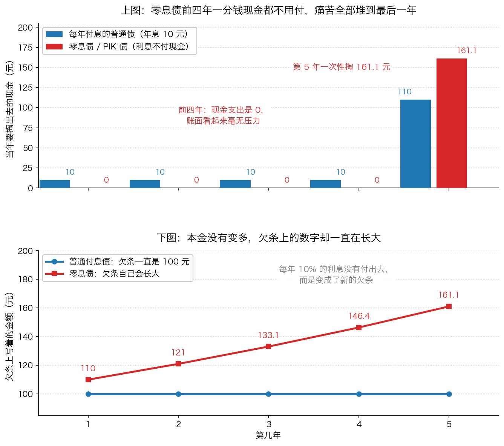

# 第 3 章：零息债与 PIK——把痛苦推到未来

> **本章你将：**
> - 看懂一张借条可以有三种写法，以及第三种写法为什么最危险
> - 自己动手把 100 元按每年 10% 滚 5 年，算到 161.1 元
> - 搞清楚 PIK 债（实物付息）是怎么把利息变成"新欠条"的
> - 明白"利率重设条款"为什么是一帖**金融安慰剂**——看起来是保险，其实一文不值
> - 看懂"用垃圾债做抵押再发债"（CBO）为什么改变不了任何东西
> - 知道**这对我的钱包意味着什么**：A 股/港股 里三种"把痛苦推到未来"的品种，怎么认出来

上一章我们拆穿了 EBITDA：它把该减的东西加回去，让一家公司看起来比实际更有钱。这一章讲的是同一件事的**升级版**——不是把成本加回去，而是**干脆把付钱这件事往后推**。推得越远，今天的报表就越漂亮。

---

## 3.1 一张借条可以有三种写法

你在第 0 章已经知道，债券就是一张借条。但借条怎么写，差别很大。假设你借出去 **100 元**，说好年息 **10%**，期限 **5 年**。对方可以给你三种写法：

**写法一：每年付利息，到期还本金（最普通）。**
对方每年给你 10 元现金，第 5 年年底再还你 100 元本金。
你每年都能收到钱，看得见、摸得着。

**写法二：中间一分钱不给，到期一次还清（零息债）。**
前 4 年你什么都收不到；第 5 年年底，对方一次性还你本金加利息。
**"零息"不是"没有利息"，而是"利息不发现金、滚进本金里，最后一起给"。**

**写法三：利息不用现金付，而是"再给你打一张欠条"（PIK 债）。**
这就像你借给朋友 100 元，年底他跟你说："今年的 10 元利息我付不出，这样吧，我再给你写一张 10 元的欠条。"
于是你手里现在是**两张欠条**：一张 100 元，一张 10 元。

> 💡 **换个说法：** 这三种写法的差别，相当于一个朋友还钱的方式：
> - 写法一是**每月按时转账**；
> - 写法二是**到期一次性还，之前一声不响**；
> - 写法三是**到期还不上，说"要不这笔利息也算我欠你的，下次一起还"**。
>
> 三种写法在合同上都是"借了 100 元、年息 10%"，但**你承担的风险完全不同**。

---

## 3.2 零息债的算术：一年一年往后乘

现在把写法二算清楚。这一步一定要自己动手，因为它是理解后面所有内容的基础。

规则很简单：**每一年的年末，把当时的欠款乘以 1.1（本金 1 加上 10% 的利息），变成下一年的欠款。**

| 时间 | 怎么算 | 年末欠款 |
|---|---|---|
| 借出的那一刻 | — | 100 元 |
| 第 1 年年末 | 100 乘 1.1 | **110 元** |
| 第 2 年年末 | 110 乘 1.1 | **121 元** |
| 第 3 年年末 | 121 乘 1.1 | **133.1 元** |
| 第 4 年年末 | 133.1 乘 1.1 | **146.41 元** |
| 第 5 年年末 | 146.41 乘 1.1 | **161.051 元**，约 **161.1 元** |

（表格里每一步都算到分位，所以最后一步得到的是 161.051 元；后面为了方便，统一按 **161.1 元** 来说，配图上的标注也是四舍五入之后的读数。）

**五年下来，100 元变成了约 161.1 元。多出来的约 61.1 元，就是这五年滚出来的利息。**

注意这里发生的事：**本金一分钱都没有增加，欠条上的数字却自己在长大。**

对比一下就更清楚了：

- **写法一（每年付息）**：五年掏出去的现金是 10 乘 5 加 100，等于 **150 元**（其中利息 50 元、本金 100 元）；
- **写法二（零息）**：五年掏出去的现金是 **161.1 元**，全部集中在最后一年。

> 📌 **划重点：** 零息债让借款人**多付了 11.1 元**，但同时给了他一样非常宝贵的东西——**前四年一分钱现金都不用掏。** 对一家现金流紧张的公司来说，这四年的"轻松"太有诱惑力了。**而代价被完整地推到了第 5 年。**

---

## 3.3 PIK：利息也用欠条来付

**PIK** 是英文 payment in kind 的缩写，中文一般译作"**实物付息**"。它的意思是：**该付的利息，不用现金付，而是用"再发行一笔等额的债券"来代替。**

原书对这一段的描述是：这一类证券"只是将利息累积了起来，而不是现在就用现金予以支付"（p80）。

零息债和 PIK 债的关系，你可以这样理解：

- **零息债**：从一开始就规定"全程不付现金"，是**规矩**；
- **PIK 债**：合同里给发行人一个**选项**——"利息我可以付现金，也可以再打一张欠条"，具体用哪个，到时候看情况。

而"看情况"这三个字就是隐患所在：**公司日子好过的时候它当然会付现金，日子不好过的时候它就会选择 PIK。** 所以你在 PIK 债上收到的那个"高利息"，很可能收到的不是钱，而是**更多的欠条**。

> ⚠️ **易踩坑：** 一张写着"年息 12%"的 PIK 债，看起来比一张"年息 10%"的普通债更有吸引力。但前者你拿到的是**欠条**，后者你拿到的是**现金**。**同样是 12%，一个是纸，一个是钱。** 你在比较收益率之前，先要问清楚：**它用什么付给我？**

---

## 3.4 为什么它"允许金融上的鲁莽行为"

原书这一节的标题就叫"零息债券和PIK 债券允许金融上的鲁莽行为"（p80）。我们把里面的机制一层层剥出来。

**第一层：它让买家"不受当前财政状况的约束"。**

原书说：如果收购一家高杠杆企业的买家，预计到收购完成后的第一天就要支付一大笔债券利息，"那么他的收购价格就可能已经根据时间日期对未来债券现金支付做好了调整"。而零息债券和 PIK 债券"只是将利息累积了起来，而不是现在就用现金予以支付，**能够将支付日期推迟到未来的买家不会受到当前财政状况的约束**"（p80–p81）。

翻译成一句人话：

> 📌 **划重点：** 一笔**今天就要掏钱**的支出，和一笔**五年后才掏钱**的支出，在"今天能不能做成这笔买卖"这件事上，效果完全不同。零息债和 PIK 债的真正作用，不是让企业变得更有钱，而是**让一笔它其实付不起的交易，在今天看起来付得起。**

原书接着说，正因如此，"在 20 世纪80 年代中后期允许使用从未有过的高估值标准来购买企业中，无追索权的零息债券以及PIK 垃圾债融资起到了重要的作用"（p81）。**先让付款日跑到未来，价格就敢往上报。**

**第二层：它成了"生命支持系统"。**

这是原书里最有画面感的一段：

> "零息债券和PIK 债券融资能够成为企业的生命支持系统，维持已经病入膏肓的病人的生命。此类发行人的负债可能超过了自己的资产，且没有能力履行用企业中的现金进行偿债的义务，但**表面上看起来这些企业的财务状况都是健康的**。"（p81）

请注意最后半句：**"表面上看起来健康"。** 这正是它最危险的地方——它不只是让公司多活几天，它还**让所有看报表的人以为这家公司没事**。

原书还引用了巴菲特的一句玩笑，堪称一针见血：

> "就像巴菲特说的，'如果欠发达国家的政府在20 世纪70 年代只发行长期零息债券，它们可能现在就成了没有污点记录的债务国了'。"（p81）

**一个永远不用付利息的借款人，当然永远不会有"付不出利息"的记录。** 这不是它守信，是账单还没到期。

**第三层：它把"违约"这件事往后挪，于是违约率就变好看了。**
这一点你在第 1 章已经学过：零息债和 PIK 债"暂时降低了报告中的垃圾债违约率统计数据"，但"这类债券最终出现违约的可能性大于那些支付利息的证券，因为那些没有从流动现金流中予以支付（经常是没有支付能力）的债务负担会不断累积"（p71–p72）。

**第四层，也是最值得记住的一句话：**

> "称这些零息证券和PIK 证券为债券并不代表它们与其他债券有着相同的风险和回报特征，**但这样确实能够更容易地将这些证券卖给投资者**。"（p81）

原书还说，多数零息和 PIK 工具"更像是一种与企业未来业绩有关的**期权**，而不是一种与企业当前价值有关的固定收益且安全的权利主张"（p81）。

> 💡 **换个说法：** 一个正常的债券，像是"你把钱借给一家饭馆，它每月给你利息"。一张零息垃圾债，更像是"你和这家饭馆打了个赌：如果五年后它还活着，你赢一大笔；如果它倒了，你血本无归"。**后者不是不能做，但它是一种赌，不应该被叫做"固定收益"。名字叫债券，不代表它真是债券。**

---

## 3.5 利率重设条款：一帖"金融安慰剂"

20 世纪 80 年代末，新发行垃圾债上出现了一个很受欢迎的新花样：**利率重设**。

它的玩法是这样的：发行人**承诺在未来某个约定的时间点重新设定这张债券的利息率**，把利率调高到足以让它以面值（比如 100 元）交易为止（p82）。

听起来非常贴心对吧？**"如果我的债跌了，我就给你加利息，保证你的债回到面值。"** 这简直就是一份保险。

原书把它称为"一帖**金融安慰剂**"，并说："看起来这种特征为保值提供了意义深远的保证，但实际上这种保证毫无价值。"（p82）为什么毫无价值？原书给了三条理由，一条比一条锋利：

**理由一：有能力守约的人，根本不需要这个条款。**
原书说："为了能让利息率重设顺利运作，对应的发行人必须要有信誉。然而与此相矛盾的是，**如果发行人有信誉，那么就不需要重设利率**。"（p82）

**理由二：一个已经陷入困境的发行人，把利率提到天上去也没用。**
原书说："任何一种利息率都不会使困境窘迫的发行人所发行的债券以账面价格进行交易，**无论债券利息率上调多大，因为那些认为存在下跌风险的买家会持续压低这只债券的市场价格**。"（p82）

**理由三：利率设得越高，发行人死得越快。**
原书说："在重新设定息票时将利息率设得越高，就会对发行人越不利，因为增加的债务支付负担将恶化发行人的财务困境。"（p82）

**所以这个条款的真实逻辑是：它只在"根本不需要它"的情况下才有效，而在"真的需要它"的情况下，它反而会加速公司的死亡。**

原书还给了几个真实的例子（p82–p83），都很短，但很有说服力：

- **Maxxam 公司**：为了让债券回到面值，公司重设了利息率，"但这些债券的交易价格没能超过 95 美元，尽管当时公司的业绩表现强劲"（p82）；
- **西联公司**：在"一只脚已经踏入坟墓的时候"，把债券 **16% 的利息率重设为 19.25%**，"但债券的价格并未对此作出反应，从 80 美元上方跌至近 40 美元，并继续下跌"（p82–p83）；
- **吉姆沃尔特公司**：1989 年，德崇证券无法重新设定它的债券利息率，"之后这家公司被迫申请破产"（p83）；
- **雷诺兹-纳贝斯克（RJR）**：收购方 KKR 发行了 50 亿美元面值的利率重设 PIK 债券。原书说，很多人关心的不是传统的当期收益率或到期收益率，而是一个"刚刚出现的'重设收益率'"——"大量资金因这一未经证实的概念而被投了出去"。结果呢？**"即使在将15 亿美元的新股本注入雷诺兹-纳贝斯克公司之后，在重设收益率那天，债券的交易价格也未能超过账面价格的93%。只有在公司大幅削减债务之后，债券的市场价格才达到了账面价格。"（p83）**

> ⚠️ **易踩坑：** "承诺"这种东西在金融里是有价的，价格取决于**谁在承诺**。一个已经快还不上钱的借款人向你承诺"放心，我会加利息补偿你"，这个承诺值多少？原书的答案是：**"这种承诺只不过同作出这一承诺的实体一样糟糕。"（p82）** 以后你看到任何"保障条款""兜底承诺""差额补足"，先别急着安心，先问一句：**承诺的人是那个还得起钱的人吗？**

---

## 3.6 用垃圾债做抵押再发债（CBO）：换个包装，本质不变

垃圾债市场的最后一个"创新"，叫**垃圾债券抵押债券**（原书缩写 CBO）。它的做法是：**拿一篮子垃圾债当抵押物，然后以它们为基础发行几种不同风险等级的证券**（p90）。

原书说，让承销商和投资者感兴趣的是评级机构的"非常随意的决定"：**它们给那些高级别的 CBO 给出了投资级的评级，通常这类债券占到总 CBO 数量的 75% 左右**（p90）。于是发行人做了一件看起来像魔术的事："组成一只回报率为14% 的垃圾债组合，然后假定以10% 的收益率将由这些债券支持的高等级CBO 卖给投资者，**所得收入可能相当于这一组合成本的750%**"（p90）——然后剩下的、风险更大的部分，再用高得多的收益率卖出去。

听起来是金融工程，其实逻辑很简单：**把同一堆东西切成几块，贴上不同的标签，卖出不同的价格。** 但原书一句话就把这个把戏说穿了：

> **"换句话说，组合在一起的垃圾债依然是垃圾债，不管你用何种方式进行组合。"（p90）**

> 🇨🇳 **落到 A 股/港股：** 这背后是一条通用的识别方法——**当你看到一个产品结构复杂到看不懂时，不要试图去理解它的结构，直接回到最底下问一句：它最终投的是什么东西？** 如果最底层的资产是一堆"必须一切顺利才能还上钱"的借条，那么无论它在上面切几层、贴什么标签、评级是多少，**你的风险都来自最底层，不是来自包装。**

---

## 3.7 落到 A 股/港股：三种"把痛苦推到未来"的品种

把这一章变成能用的东西。以下三种，是你在 A 股/港股 里最容易碰到的"把痛苦推到未来"的结构：

**第一种：可转债——它是中性的，但要看清条款。**
可转债就是"一张可以按约定价格换成股票的借条"。它的利息通常很低（因为公司送了你一个"转股"的权利作为补偿）。

- 如果公司股价涨上去，你可以转成股票卖掉，赚股价的钱；
- 如果股价一直不涨，你至少还拿着一张某年某月要还本付息的借条。

**它本身不是骗局，甚至对普通投资者比较友好**，因为"债底"给了你一定的保护。**但"债底"的前提是公司还得起债**——这一点和第 2 章讲的"位置不等于价值"是同一件事。你要看的两个关键条款是：**转股价**（多少钱能换成股票）和**回售条款**（什么情况下你可以要求公司把本金还给你）。

**第二种：永续债、明股实债——名字和实质不一致。**
有一种债券叫**永续债**：名义上是债，但合同里可以约定"一直不还本金、只付利息"，甚至可以递延利息。还有一种叫**明股实债**：名义上是股权投资，实际上约定了固定的回报和回购义务。

它们共同的特点是：**叫法听上去很安全（"永续"意味着长久，"股"意味着自己是股东），但实质是"这笔钱什么时候还、能不能还，都有一堆前置条件"。** 认出它们的方法很简单：**别管它叫什么，看合同里"什么时候必须付钱给我"这一条写的是什么。**

**第三种：靠"再融资"来付钱的品种。**
这是最隐蔽、也最危险的一种。它不需要任何特殊条款，只需要一个假设：**"到时候我一定能借到新钱。"**

回想原书 p76 那句话："发行人和投资者都假设，现金流将一直增加，即将到期的债券可以通过再融资来进行支付。"**只要这个假设成立，一切看起来都很好；一旦借不到新钱，问题立刻全部暴露。**

你在 A 股/港股 里能看到它的几个变体：靠不断发新债还旧债的公司、靠"借新还旧"滚动的地产美元债、把短期资金投到长期资产上的理财产品、以及大股东**把股票质押出去借钱**再投回自己公司的做法。它们的共同点是：**只要融资的闸门不关，风险就不显现；闸门一关，就是连锁反应。**

> 📌 **划重点：** 判断一个产品是不是"把痛苦推到未来"，你只需要问一个问题：**它说好付给我的钱，从哪来？** 如果答案是"它自己经营赚来的"，那是好生意；如果答案是"它再借一笔新的"、"它把利息也写成欠条"、"它把股价涨上去就能解决"，那你就要知道：**你赚的不是利息，是时间的钱；而时间，是有尽头的。**

---

## ✍️ 想一想

1. **同样借 100 元、年息 10%、5 年期，"每年付息"和"零息"这两种写法，谁付的总钱更多？** 那为什么还有公司愿意用零息的方式借钱？
2. **利率重设条款为什么被叫做"金融安慰剂"？** 试着用"一个还不上钱的朋友向你保证下次一定还"来解释。
3. **为什么"把一堆垃圾债打包、切成几块、再贴上投资级标签"这件事，改变不了投资者的风险？** 想一想：如果底层那些公司还不上钱，上面贴什么标签有用吗？

> 💡 **参考思路：**
> 1. **零息的方式付的总钱更多**（161.1 元，比每年付息的 150 元多 11.1 元）。公司仍然愿意用，是因为它换来的东西很值钱：**前四年不用掏一分钱现金。** 对一家现在现金流紧张、但预期未来会好转的公司来说，这段"喘息期"可能决定它生死。但反过来说，**一家今天连利息都付不出的公司，凭什么指望它五年后能一次性拿出 161.1 元？** 所以当你看一家公司发行零息债或者 PIK 债时，你看到的不是"它很聪明"，而是"**它现在的现金流不够用**"。
> 2. 因为它的有效性完全取决于**作出承诺的那个人**。原书 p82 说：有信誉的发行人根本不需要重设利率；而陷入困境的发行人"无论债券利息率上调多大"，价格也回不到面值——因为买家持续在压价。至于一个还不上钱的朋友跟你说"下次一定还"，你之所以不信，是因为**你还不上钱这件事本身，就是他未来还不上钱的原因。** 承诺不改变还款能力。
> 3. 因为**风险和收益来自最底层的资产，不来自包装方式**。原书 p90 一句话总结："组合在一起的垃圾债依然是垃圾债，不管你用何种方式进行组合。"底层那些公司如果真的还不上钱，那么不管你切几层、给哪一层贴上"投资级"的标签，**总的可分配现金就是不够的**——就像一块蛋糕不够分，怎么切都还是不够。

---

## 🧮 算一算

下面两组都是**简化示意数字**，用来练习计算。

**情境：** A、B 两家公司各需要借 **100 万元**，年息都是 **10%**，期限都是 **5 年**。

- **A 公司**：每年年末付一次利息（10 万元），第 5 年年末再还本金 100 万元。
- **B 公司**：一张零息债，中途一分钱不付，第 5 年年末一次性还本付息。

**请算：**

1. B 公司在第 1、2、3、4、5 年年末分别欠多少钱？
2. B 公司第 5 年年末一次要还多少钱？
3. A 公司这 5 年一共掏出去多少现金？B 公司一共掏出去多少？差多少？
4. B 公司如果这五年每年只能攒下 20 万元现金，到期够不够还？差多少？
5. 只看前四年，哪家公司的报表更好看？为什么？

**分步解答：**

**第 1 步：B 公司的欠款一年一年往后滚。**

每年年末，把当时的欠款乘以 1.1（1 是本金，0.1 是利息）。

| 时间 | 计算 | 年末欠款 |
|---|---|---|
| 第 1 年年末 | 100 乘 1.1 | **110 万元** |
| 第 2 年年末 | 110 乘 1.1 | **121 万元** |
| 第 3 年年末 | 121 乘 1.1 | **133.1 万元** |
| 第 4 年年末 | 133.1 乘 1.1 | **146.41 万元** |
| 第 5 年年末 | 146.41 乘 1.1 | **161.051 万元** |

（按题目要求保留一位小数，就是 **161.1 万元**。想更精确可以写成 161.05 万元。）

**第 2 步：到期一次还的钱。**
就是第 1 步算出来的最后一个数：**161.1 万元**（其中本金 100 万元、滚出来的利息 61.1 万元）。

**第 3 步：两家的现金支出对比。**

- **A 公司**：每年利息 10 万元，5 年共 10 乘 5 等于 50 万元；第 5 年再加本金 100 万元。
  合计 = 50 加 100 = **150 万元**。
- **B 公司**：前四年 0 元，第 5 年 161.1 万元。
  合计 = **161.1 万元**。
- 差额：161.1 减 150 = **11.1 万元**。

**结论：B 公司总共多付了 11.1 万元，换来了前四年"不用掏钱"的喘息期。**

**第 4 步：每年攒 20 万元，够不够还？**
五年一共能攒：20 乘 5 = **100 万元**。
到期需要还：**161.1 万元**。
缺口：161.1 减 100 = **61.1 万元。不够，还差 61.1 万元。**

**这就是零息债最危险的地方：** 前四年你看到的是"公司每年攒下 20 万元，一切正常"；到了第 5 年你才发现，**攒下来的钱连本带息的一半多一点都还不上。** 它必须靠三件事之一来解决：再借一笔新钱、卖掉资产、或者违约。原书说得很直白：这类债券"最终出现违约的可能性大于那些支付利息的证券，因为那些没有从流动现金流中予以支付（经常是没有支付能力）的债务负担会不断累积"（p72）。

**第 5 步：前四年谁的报表好看？**

**B 公司更好看。** 因为：

- A 公司每年要掏 10 万元现金付利息，这会减少它的现金余额，也会在利润表上体现为一笔费用；
- B 公司前四年**没有任何利息支出现金流出**，现金一直留在账上，利润表上也没有这笔费用。

**所以在外人看来，B 公司"没有任何利息负担"，财务状况"健康"。** 这正是原书说的那句："此类发行人的负债可能超过了自己的资产，且没有能力履行用企业中的现金进行偿债的义务，**但表面上看起来这些企业的财务状况都是健康的**。"（p81）

**最后记住这三个数：110、161.1、61.1。** 110 是它第一年就欠下的钱，161.1 是它最终要还的钱，61.1 是它朴素的经营根本填不上的那个洞。

---

## ✅ 小测验

**1. 关于零息债，下面哪个说法是对的？**
A. 零息债就是不用付利息的债券，所以对发行人最有利
B. 零息债不是不付利息，而是利息不发现金、滚进本金，到期一起还，所以总支出通常比每年付息更高
C. 零息债的利息比普通债券低，因为不用每年付现金
D. 零息债和普通债券的风险回报特征完全相同，只是付款时间不同

**2. "利率重设条款"为什么被原书称为金融安慰剂？**
A. 因为它是违法的
B. 因为评级机构不承认这个条款
C. 因为有信誉的发行人不需要它，而没有信誉的发行人无论把利率提到多高，债券价格也回不到面值，提高利率反而加重它的负担
D. 因为它只在利率上升时有效，在利率下降时失效

**3. "把一堆垃圾债打包、分层，给其中高级别的部分评上投资级"这种做法，为什么没有降低投资者的风险？**
A. 因为评级机构收费太高，成本转嫁给了投资者
B. 因为打包后的证券不能在市场上交易
C. 因为风险和收益最终来自底层那些借条，底层还不上钱时，任何包装和标签都不能变出钱来
D. 因为这种做法只在美国允许，在其他市场不成立

> **答案与解析**
>
> **1. B。** 原书 p80–p81 讲得很清楚：零息债"只是将利息累积了起来，而不是现在就用现金予以支付"。它的总支出通常更高（本课算例中是 161.1 元对 150 元），换来的是前几年的现金喘息。A 错在"不用付利息"——利息一分没少，只是晚付；C 错在方向，它的**总成本更高**而不是更低；D 错在原书明确说"称这些零息证券和PIK 证券为债券并不代表它们与其他债券有着相同的风险和回报特征"（p81）。
>
> **2. C。** 原书 p82 的三条理由分别是："如果发行人有信誉，那么就不需要重设利率"；"任何一种利息率都不会使困境窘迫的发行人所发行的债券以账面价格进行交易"；"在重新设定息票时将利息率设得越高，就会对发行人越不利"。A、B、D 都是编造的，原书没有这些说法——顺带说，D 还搞反了：重设条款在利率怎么变的时候都救不了一个还不上钱的发行人。
>
> **3. C。** 原书 p90 的原话是："组合在一起的垃圾债依然是垃圾债，不管你用何种方式进行组合。"评级机构给高级别部分投资级评级，靠的是"以往的违约率分析"，而没有考虑"经济放缓期延长或者信贷紧缩可能最终削减再融资空间"（p90）。A、B、D 都不是原书的论点；**关键永远在最底层的资产，而不在包装层数。**

---

## 📖 回到原书

- 对应原书 **第四章**，`raw/安全边际-中文版/page_080.md` ~ `page_084.md`（原书 p80–p84，零息债、PIK、利率重设）以及 `page_090.md` ~ `page_091.md`（原书 p90–p91，垃圾债券抵押债券）。另可回看 `page_071.md` ~ `page_072.md`（p71–p72，零息债如何暂时压低违约率）。
- **建议精读**：
  - p80–p81——"零息债券和PIK 债券允许金融上的鲁莽行为"，本章的核心，包括那句"称这些证券为债券……能够更容易地将这些证券卖给投资者"；
  - p82——"利息率重设只会朝一个方向运行"，三条理由，逻辑非常干净；
  - p83——西联公司和雷诺兹-纳贝斯克两个案例，看"重设收益率"这个概念怎么把钱骗进去；
  - p90——垃圾债券抵押债券，最后那句结论值得抄下来。
- **可以略读**：p83 关于 Maxxam 和吉姆沃尔特公司的细节。知道"重设失败的案例不止一个"就够了。
- **原书金句（逐字引用）：**
  > "零息债券和PIK 债券融资能够成为企业的生命支持系统，维持已经病入膏肓的病人的生命。"（p81）
  > "称这些零息证券和PIK 证券为债券并不代表它们与其他债券有着相同的风险和回报特征，但这样确实能够更容易地将这些证券卖给投资者。"（p81）
  > "利息率重设特征暗示这种承诺只不过同作出这一承诺的实体一样糟糕。"（p82）
  > "任何一种利息率都不会使困境窘迫的发行人所发行的债券以账面价格进行交易，无论债券利息率上调多大，因为那些认为存在下跌风险的买家会持续压低这只债券的市场价格。"（p82）
  > "换句话说，组合在一起的垃圾债依然是垃圾债，不管你用何种方式进行组合。"（p90）
