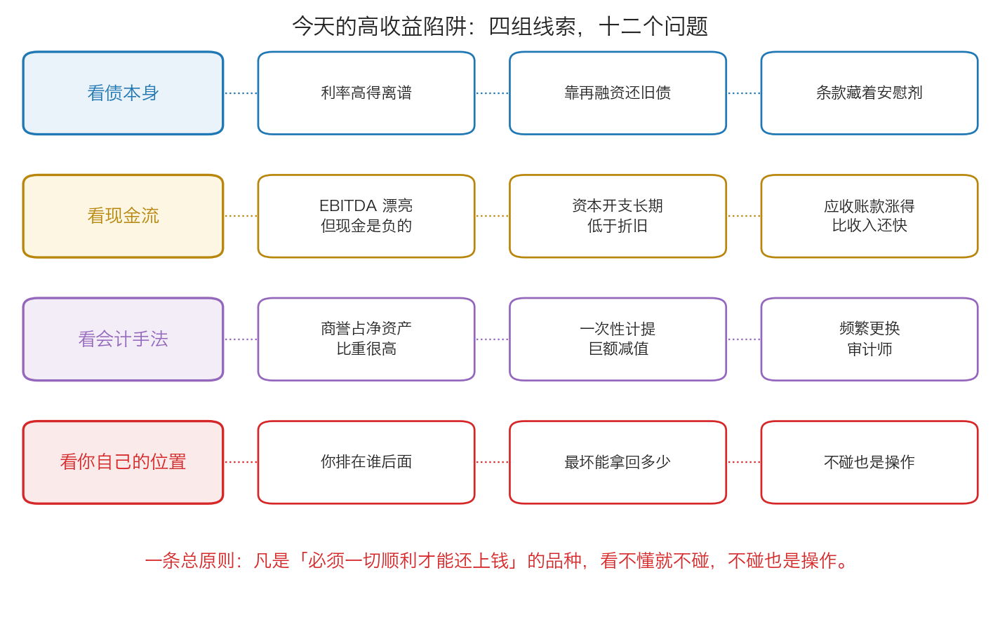

# 第 4 章：今天的高收益陷阱怎么识别

> **本章你将：**
> - 明白为什么"别人买垃圾债亏钱"最终也会绕到你身上
> - 记住原书那句预言：新的狂潮一定会来，而且**不会有人敲钟**
> - 认出今天 A 股/港股 里的三类"垃圾债替身"，以及它们各自的识别特征
> - 学会读"商誉"这个科目，知道它暴雷之前有哪些征兆
> - 拿到一份**十二个问题的识别清单**，十分钟内判断一个"高收益"品种是不是陷阱
> - 明白**这对我的钱包意味着什么**：不碰，也是一种操作

前三章我们讲完了垃圾债的故事：它怎么起来的（第 0 章）、违约率怎么被算小的（第 1 章）、EBITDA 和零息债怎么把真相藏起来（第 2、3 章）。现在到了本周最关键的一步——**把这些 1980 年代美国的东西，翻译成你今天能用的判断方法。**

这一章背景最少、方法最多。如果这一周你只读一章，读这一章。

---

## 4.1 为什么"别人亏钱"和你有关

你可能会想：我又不买垃圾债，美国人 30 多年前亏的钱，跟我有什么关系？

原书专门回答了这个问题，而且回答得很认真（p91–p92）。它列出的传染路径有四条：

**第一条：过高的垃圾债价格，推高了并购的价格。**
原书说："过高的垃圾债价格让许多人以虚高的价格采取了收购行动。"（p91）因为买家的钱是借来的，对价格不敏感，出价就敢往上加。**一旦这种"敢出价"成为常态，整个市场的并购价格都会被抬高。**

**第二条：被收购公司的股东拿到的钱，其实少于债券买家亏掉的钱。**
原书的原话是："被收购企业的股东所获得的超额利润实际上低于购买了这些垃圾债的买家所蒙受的损失。"（p91）也就是说：**这场游戏里，卖方小赚，买方大亏。**

**第三条：这些钱会回流到股市，把没被收购的公司的股价也推高。**
原书说："股票投资者把从垃圾债融资收购中获得的现金再次投入股市，推高了那些依然没有被收购的企业的股票。"（p91）**你没参与任何一笔交易，但你持有的股票价格已经被这场游戏改变了。**

**第四条：高估值会扩散到其他类型的证券。**
原书说："由债券市场所造成的高估值会给涉及到套利交易、证券交换或者企业重组的证券的市场价格带来巨大影响。"（p91–p92）

所以原书给出的结论是：**"结果导致那些即使没有购买垃圾债的人也很难完全逃脱垃圾债所带来的影响。"（p92）**

> 📌 **划重点：** 金融市场的风险是**连着的**。你不买某个东西，不代表你不会被它的价格影响——因为**价格是所有人一起定的**。这就是为什么你需要看懂陷阱的**结构**，而不只是记住"别买垃圾债"这句话。

---

## 4.2 原书的预言：狂潮一定会再来，而且不会有人敲钟

原书在结论里下了一个非常确定的判断（p92）：

> "我们可能会信心满怀地认为，未来必将会出现新的投资狂潮。这种狂潮会超过一种创新所允许的合理范围。就像这种狂潮一定会发生一样，届时肯定不会对市场的过激行为敲响警钟。"

这句话值得拆开看。它说了两件事：

1. **狂潮一定会再来。** 因为人性不变：贪婪、从众、对短期业绩的追求，这些不会因为一次崩盘就消失。
2. **不会有人敲钟。** 因为在这场狂潮里赚钱的人（承销商、销售机构、早期进入的投资者）**没有动机敲钟**；而想敲钟的人（提醒风险的人）会被当成"不懂新事物""跟不上时代"。

原书还说了一句很实在的话："研究垃圾债崩溃的投资者也许能够分辨出这些新的狂潮，并予以规避。"（p92）**研究历史的价值，不是让你变聪明，而是让你在下一轮狂潮里认得出它的脸。**

那么，怎么认出"狂潮的脸"？把这一周学的东西合起来，狂潮通常同时具备三个特征：

**特征一：一个动听的故事，核心台词是"这次不一样"。**
垃圾债的故事是"它能拯救美国经济、给中小企业融资"（p73–p74）。**每一个狂潮都会给自己配一个崇高的理由。** 理由不一定假，但它**不能替代现金流**。

**特征二：分析标准被悄悄放松。**
原书说得很清楚："重要的是投资者不知道标准放宽是如何发生的，因为这一过程非常隐蔽。"（p80）具体表现是：**大家不再问那个最难回答的问题。** 从看现金流，改成看 EBITDA；从看 EBITDA，改成看"用户数""GMV""赛道空间"。

**特征三：整个模型建立在"必须一切顺利"的假设上。**
原书 p76："发行人和投资者都假设，现金流将一直增加，即将到期的债券可以通过再融资来进行支付。"

> 💡 **换个说法：** 一个健康的生意，是"就算有一两件事不顺，也还能撑住"；一个陷阱，是"只要有一件事不顺，就全盘崩掉"。**你判断风险，不是去预测哪件事会不顺，而是去看：它经得起几件不顺的事？**

---

## 4.3 今天的三类"替身"

垃圾债这个名字今天很少听到了，但它换了很多件衣服。下面三类，是你在 A 股/港股 里最可能遇到的。

### 第一类：名字里带"高收益"的钱

**它长什么样：** 高收益债基金、名字里带"固收+"的理财、各种"非标"（非标准化债权资产：不在银行间和交易所市场公开交易的债权类融资，比如信托贷款、委托贷款）产品、结构化的资管产品。

**它的机制：** 这一类产品的共同点是——**它的收益率明显高于同期限的国债**。而按照第 0 章讲的道理，**高出来的那部分收益率，是风险的价格**。它必须去投那些"愿意付高利息"的借款人，才能给出这个收益率。

**怎么识别：**

1. **看底层。** 产品说明书里会写"投资范围"。如果里面有"信用债""资产支持证券""非标准化债权资产"这类字眼，说明它可能持有低等级借条。**看不懂的名词越多，越要警惕。**
2. **看期限和收益的搭配。** 一只期限一年、收益 6% 的产品，和一只期限三年、收益 6% 的产品，风险完全不同。**如果它的收益要靠"三年后能顺利借到新钱"来实现，那你就是在赌三年后的融资环境。**
3. **看它怎么说自己。** 如果宣传里反复出现"稳健""历史回撤小""从未违约"，请回到第 1 章：**历史是历史，未来是预测。** 没有经过一轮完整经济周期检验的"从未违约"，只是"还没轮到它"。

> 🇨🇳 **落到 A 股/港股：** 一个很实用的动作是——**把"收益率"翻译成"借款人是谁"。** 3% 的收益对应的是"信用很好的人"，8% 对应的可能是"银行不太愿意借钱给它的人"。你不需要判断它会不会违约，你只需要知道：**你为了让钱多赚 5%，承担了一份什么样的风险。** 如果这份风险是你承受不起的（比如这笔钱明年要用来交学费），那么无论它多安全，都不该由你来承担。

### 第二类：商誉与并购——把乐观记到今天的账上

**先解释什么是商誉。**

> 💡 **商誉的生活类比：** 你想盘下一家生意很好的奶茶店。店里的设备、装修、存货加起来，账面上值 20 万元。但老板说："我这店位置好、口碑好，少于 100 万我不卖。"你付了 100 万。那么在会计上，那多出来的 **80 万**记成什么？不能记成设备（设备只值 20 万），于是记成一项叫**商誉**的东西——它的意思是"**我为了买这家公司，多付出去的钱**"。

商誉的关键特征是：**它是一项"记账数字"，不是可以拿来还债的现金，也不是可以卖掉的机器。** 原书在讲 RJR 纳贝斯克那个案例时说得很精确：多付的收购款之后，"属于公司的有形资产不会较之前有所增加，**只有被称之为商誉的无形资产的价值才会通过记账方法而增加**"（p84）。

**商誉为什么会"暴雷"？**

商誉躺在资产负债表上，平时不影响利润。但每年公司要做一次测试："我当年花大价钱买的那个东西，现在还值那么多钱吗？"如果答案是不值了，就要**计提减值**——也就是在利润表上一次性认一笔巨额损失。

原书对"摊销"（把商誉分年扣掉）的评价很刻薄，说它"更像是会计上的伪造，而不是一项真实的商业支出"（p86）。但请注意：**商誉减值恰恰相反，它往往是在承认一个早该承认的事实。**

**怎么识别商誉风险：**

1. **看商誉占净资产的比重。** 如果一家公司的商誉占净资产的比例很高（比如超过三成），说明它的账面净资产里有一大块是"当年多付出去的钱"。**这部分钱一旦被认定收不回来，净资产就会大幅缩水。**
2. **看它历年做过多少高溢价并购。** 商誉是并购攒出来的。**一个连续多年高溢价收购的公司，它的商誉就是一堆待检验的乐观。**
3. **看被收购标的有没有完成业绩承诺。** 收购时通常会约定"未来三年要赚到多少钱"。如果到期没做到，商誉减值的可能性就很大。
4. **看利润的来源。** 如果一家公司的利润增长主要靠"不断买新公司"而不是原有业务，那就值得多问几句——**原书讲的"用别人的钱出更高的价"，在今天的并购市场上一点没变。**

> ⚠️ **易踩坑：** 商誉减值有一个很讨厌的特点：**它往往是"一次性、巨额、突然"的。** 公司可能连续几年报表都不错，然后某一年突然宣布"计提商誉减值 XX 亿"，股价一天跌掉一大截。**你没法预测具体哪一天，但你可以提前看到"这栋楼盖在沙子上"——那就是商誉占净资产的比例。**

### 第三类：更名重组、跨界并购、蹭热点

**它长什么样：** 一家原本做传统生意的公司，突然改了名字、宣布进入一个热门行业（前些年是互联网金融、后来是芯片、新能源、人工智能），股价随之大涨。

**它的机制：** 这类操作的本质是**把估值的故事从"经营"换成"想象"**。原来的生意增长慢、利润薄，估值上不去；换个名字、发个公告，市场就愿意用完全不同的标准来看它。

**怎么识别：**

1. **主营业务的收入占比。** 新故事讲了两年，新业务的收入占公司总收入多少？如果只有个位数百分比，那它现在还是原来那家公司。**故事在收入里的占比，才是唯一算数的占比。**
2. **钱从哪来。** 转型是要花钱的：买技术、买团队、建产线。这些钱是自有现金，还是借来的、还是增发股票融来的？**如果靠借，那就回到了本周的主题——又是一笔"必须一切顺利"的债。**
3. **谁在买。** 如果一家公司的股价在短期内大涨，而与此同时大股东在减持、或者把股票质押出去借钱，那就要非常小心。**最了解公司的人，正在把风险转移出去。**

---

## 4.4 财务造假的常见信号

原书 p72 讲了一句本质的话：**违约率数据"由承销商所提供、学者认同、并被投资者所接受"。** 数字是被"提供"出来的——这个视角，今天完全适用。

下面这些信号，**单独一条都不构成"造假"的证据**，但**同时出现三条以上，你就不该再看下去了**。它们不是用来抓骗子的，**它们是你保护自己的第一道筛子。**

| 信号 | 它意味着什么 |
|---|---|
| 净利润年年增长，但经营现金流长期低于净利润 | 赚的是"账面利润"，不是真钱（第 2 章那座桥没走通） |
| 应收账款、存货的增长速度明显快于收入 | 卖出去的东西收不回钱，或者货压在仓库里卖不动 |
| 毛利率显著高于同行，且说得出理由却经不起追问 | 要么有别人没有的本事，要么数字有问题；前者罕见 |
| 关联交易占收入的比重很高 | 交易对手可能是"自己人"，价格不由市场定 |
| 审计意见不是"标准无保留"，或频繁更换审计师、财务总监 | 专业把关的人不愿意签字，或者被换掉了 |
| 大股东把持有的股票高比例质押出去借钱 | 最了解公司的人，正在给自己留退路 |
| 一边大额分红，一边大额借钱 | 分红给了谁？借的钱又要谁来还？ |
| 报表很漂亮，但公司一直在融资、一直在借钱 | 真的赚钱的生意，通常不需要一直找别人要钱 |

> 📌 **划重点：** 这张表里最有用、也最容易掌握的是第一条：**比较"净利润"和"经营活动产生的现金流量净额"这两个数。** 一个健康的生意，这两个数长期看应该差不多，甚至现金流更大。如果一家公司连续三五年"利润很好看、现金流很难看"，那么不管它的故事多动听，**它赚的钱都还在别人的账上。**

---

## 4.5 一张可以对照使用的识别清单

把前面所有内容压成十二个问题，分成四组。**任何一个"高收益"的品种，你先花十分钟把这十二个问题过一遍。**

**第一组：看债本身。**

1. **利率高得离谱吗？** 明显高于同期国债的收益率，先假设它是"风险的价格"，而不是"难得的机会"。
2. **它靠再融资还旧债吗？** 如果它的还款计划依赖"到时候再借一笔新钱"，那你赌的是未来的融资环境（原书 p76）。
3. **条款里有没有"安慰剂"？** 承诺加利息、承诺回购、承诺差额补足——回到第 3 章：**承诺只和作出承诺的人一样可靠**（p82）。

**第二组：看现金流。**

4. **EBITDA 漂亮，但真实现金流是负的吗？** 自己去搭第 2 章那座桥：净利润加折旧摊销，减资本开支，减营运资金。
5. **资本开支长期低于折旧吗？** 如果是，原书 p86 的判决是："这家公司就在逐步进行清算。"
6. **应收账款涨得比收入还快吗？** 这是"利润是真的还是账面的"最直接的一条线索。

**第三组：看会计手法。**

7. **商誉占净资产的比重高吗？** 高，意味着账面净资产里有一大块只是当年收购时多付出去的钱，不是能卖掉、能还债的资产（原书讲商誉时说的就是这个意思，p84）。
8. **有没有一次性计提巨额减值？** 一次性"洗大澡"常常是把前几年的问题集中认账。
9. **有没有频繁更换审计师或者财务负责人？** 把关的人为什么走，值得问一句。

**第四组：看你自己的位置。**

10. **你排在谁后面？** 有担保、有抵押、优先级——先问抵押物值多少钱、够不够分（p84）。
11. **最坏情况下你能拿回多少？** 不是"会不会出事"，而是"出事了还剩多少"。**如果算不出这个数，说明你根本没看懂这笔投资。**
12. **不碰会怎么样？** 这是最容易被忽略的一问。**不碰的代价是"少赚"，碰错的代价是"亏本"。这两件事不对称。**

> 🇨🇳 **落到 A 股/港股：** 这份清单最大的用处，是**帮你把注意力从"能赚多少"转到"会亏多少"**。你不用把它当成考试，只需要养成一个习惯：**在看到任何"稳健高收益"的东西时，先翻到最后一组问题——你排在谁后面、最坏能拿回多少、不碰会怎样。** 三个问题都答不上来，就放下它。

---

## 4.6 回到你自己：不碰也是一种操作

到这里，我们把这一周串起来：

- **第 0 章**告诉你：**价格离价值有多远，决定了你亏多少**（堕落天使 60 元 vs 新发行 100 元）；
- **第 1 章**告诉你：**统计数字可以被口径做小**（分子和分母）；
- **第 2 章**告诉你：**"看起来能赚钱"和"真的收到钱"是两件事**（EBITDA vs 自由现金流）；
- **第 3 章**告诉你：**把付钱推到最后，风险不会消失，只会一起爆发**（零息债与 PIK）；
- **第 4 章**告诉你：**这些东西今天都在，只是换了名字。**

现在回到 Week 5 的结论。我们在那里讲过：**个人投资者唯一的结构性优势，是没有排名压力、没有申赎压力、可以空仓等待。** 这一周讲的正是这个优势的用法：

- 机构必须把钱投出去（满仓约束，p77），**你可以不投**；
- 机构要跟同行比季度排名，**你可以不比**；
- 机构买了看不懂的东西也不能说，**你可以直接走开**。

原书 p92 说 "研究垃圾债崩溃的投资者也许能够分辨出这些新的狂潮，并予以规避"——**"规避"这个词很重要。你不需要做空它、不需要揭穿它、甚至不需要说服别人，你只需要不参加。**

> 📌 **划重点：** 本周最重要的一个结论：**在投资里，"不碰"是一个完整的、体面的、而且往往是最优的操作。** 它不需要理由，不需要向谁解释，也不会有任何损失——**你只是没有赚到那笔你本来也看不懂的钱。**

**最后，把这一周接上下一周。** 我们花了一整周时间看别人怎么亏钱：错误的违约率、错误的现金流、错误的保护幻觉。但"避开错误"只是故事的一半。**另一半是：一个正确的买入，应该长什么样？** 那个答案有一个名字，叫**安全边际**——**Week 7 会正式讲它。** 而你今天学的这套"先算最坏情况"的习惯，正是理解它的前提。

---

## ✍️ 想一想

1. **有一家公司连续五年"净利润增长、经营现金流为负"，同时商誉占净资产的比例很高。** 你觉得它最可能在未来哪一年出问题？出问题时会以什么形式暴露？
2. **"利率重设承诺"和"大股东承诺增持"，这两件事有什么共同点？** 想一想：承诺的价值取决于什么？
3. **如果有人对你说："这个产品历史上从没违约过，很安全。"** 参照第 1 章，你要问他哪三个问题？

> 💡 **参考思路：**
> 1. 它很可能在某一年**一次性计提巨额商誉减值**。原因是：净利润是账面的（现金流为负说明钱没收回来），商誉是当年高溢价收购多付出去的钱。当被收购的业务达不到预期时（而这几乎必然发生，因为当初的收购价就建立在乐观预期上），公司就必须承认"这些东西不值当初那个价了"，于是净资产大幅缩水、当年利润巨亏。**它在哪一年暴露，你猜不到；但它迟早会暴露，你可以提前看出来**——线索就是"现金流长期跟不上利润"加"商誉占比很高"这两条同时成立。
> 2. 共同点是：**它们都是"话"，不是"钱"。** 承诺的价值取决于作出承诺的人**有没有能力、以及有没有动机**去兑现。原书 p82 那句话可以直接套用：这种承诺"只不过同作出这一承诺的实体一样糟糕"。一个自身难保的公司承诺给你加利息，和一个手头紧张的大股东承诺增持，可信度都要打折。**看承诺，先看承诺人的资产负债表。**
> 3. 三个问题：**① 口径是什么**（算不算展期、重组、技术性违约）；**② 样本有多长**（经历过一轮经济下行吗，还是只是"还没轮到它"）；**③ 数字是谁提供的**（卖方提供的数据，往往选了对自己最有利的口径）。原书 p67 那句话可以直接背下来："尽管尚未得到一个完整经济周期的测试，但新发行垃圾债受到了人们的热情欢迎。"

---

## 🧮 算一算

一家公司的数据如下。**全部是简化示意数字**（单位：亿元），用于教学。

| 项目 | 金额 |
|---|---|
| 营业收入 | 200 |
| 现金成本费用 | 120 |
| 折旧和摊销 | 40 |
| 利息支出 | 30 |
| 所得税 | 2 |
| 资本开支 | 55 |
| 营运资金增加 | 15 |
| 账上的货币资金 | 8 |

某份卖方材料上写着：**"公司 EBITDA 达 80 亿元，是利息支出的 2.7 倍，偿债无虞。"**

**请算：**

1. 先验证一下：EBITDA 是不是 80 亿元？
2. 这家公司的净利润是多少？
3. 它真正的自由现金流是多少？
4. "EBITDA 除以利息"和"真实现金流除以利息"分别是多少？
5. 如果明年公司要偿还 20 亿元本金，加上 30 亿元利息，它自己经营赚的钱够吗？账上的 8 亿元够补吗？还差多少？
6. 你会怎么评价那份卖方材料？

**分步解答：**

**第 1 步：验证 EBITDA。**

先算 EBIT（息税前利润）：收入减现金成本，再减折旧摊销。
200 减 120 等于 80；80 减 40 等于 **40 亿元**。

再算 EBITDA：EBIT 加回折旧摊销。
40 加 40 等于 **80 亿元**。**卖方说的 80 没错，这个数字本身是准的。**

**第 2 步：净利润。**

从 EBIT 出发，减利息、减税。
40 减 30 等于 10；10 减 2 等于 **8 亿元**。

**第 3 步：真正的自由现金流。**

用简化公式：**自由现金流 = 净利润 + 折旧摊销 - 资本开支 - 营运资金增加**

8 加 40 等于 48；48 减 55 等于 -7；-7 减 15 等于 **-22 亿元**。

**验算一下（走完整的桥）：** 80（EBITDA）减 55（资本开支）等于 25；25 减 15（营运资金）等于 10；10 减 30（真金白银付的利息）等于 -20；-20 减 2（真金白银交的税）等于 **-22 亿元**。两条路一致。

**注意这意味着什么：** 这家公司账面上还赚了 8 亿元，但**真正的现金是净流出的，流出 22 亿元**。钱去哪了？资本开支 55 亿元（比折旧 40 亿元还多 15 亿元，说明它在扩张或者补投入）、营运资金 15 亿元、利息 30 亿元。

**第 4 步：两个倍数对比。**

- **EBITDA 除以利息**：80 除以 30，大约是 **2.7 倍**。看起来不错。
- **真实现金流除以利息**：-22 除以 30，大约是 **-0.73 倍**。**是负的。**

**同一个东西，两个指标给出完全相反的结论。** 卖方选的是前面那个。

**第 5 步：明年的还款压力。**

- 明年要掏出去的钱：本金 20 加利息 30，等于 **50 亿元**。
- 自己经营赚到的钱：**-22 亿元**（不但没赚，还净流出）。
- **缺口：50 减（-22），等于 72 亿元。**
- 账上只有 **8 亿元**货币资金。用掉之后，还差：72 减 8，等于 **64 亿元**。

**这 64 亿元只能靠再借新钱、增发股票、卖资产来解决。** 这就是原书 p76 说的那种处境："发行人和投资者都假设，现金流将一直增加，即将到期的债券可以通过再融资来进行支付。"**换句话说：这家公司明年的生死，取决于它能不能融到资——而这，不是它自己说了算的。**

**第 6 步：怎么评价那份卖方材料。**

**问题不在数字，在算法。** 那份材料说的 80 亿元 EBITDA 并没有算错，2.7 倍也没有算错。**错的是它把一个"没扣房租、没扣税、没扣车贷"的口径，当成了"偿债能力"的证据。**

把它翻译成人话，这份材料等于在说："这个人月薪三万，所以他还得起房贷。"——**但你不知道他每个月要还多少房贷、车贷，也不知道他是不是马上就要换一台必须换的机器。** 你自己动手搭一遍桥，才知道真相是 **-22 亿元**。

> 📌 **划重点：** 这道题复习了本周的第 2 章、第 4 章，也顺带复习了第 1 章：**同一个事实，换一个算法，就是两个结论。** 你能做的，是自己会算。

---

## ✅ 小测验

**1. 原书说"即使没有购买垃圾债的人也很难完全逃脱垃圾债所带来的影响"，原因不包括：**
A. 过高的垃圾债价格推高了并购价格
B. 被收购公司股东拿到的钱，低于债券买家亏掉的钱
C. 并购获得的现金回流股市，推高了未被收购公司的股价
D. 政府强制所有投资者按比例购买垃圾债

**2. 一家公司账上有很高的商誉，最应该担心什么？**
A. 商誉太高会导致它的利息支出增加
B. 商誉是一项记账数字，一旦被认定不值当初那个价，就要一次性计提减值，账面净资产和当年利润都会大幅缩水
C. 商誉太高说明它的现金一定不够用
D. 商誉会被强制要求每年用现金偿还

**3. 关于"不碰也是一种操作"，下面哪个理解是对的？**
A. 不碰是因为胆小，会错过很多机会，所以应该尽量少用
B. 不碰需要先证明这个品种一定会亏钱，否则就是偷懒
C. 不碰是一个完整的操作：它的代价是"少赚"，而碰错的代价是"亏本"，这两种代价并不对称
D. 只要分散买入，就不需要"不碰"这个选项

> **答案与解析**
>
> **1. D。** 原书 p91–p92 列出的是 A、B、C 三条传染路径（外加"高估值扩散到套利、证券交换与企业重组类证券的价格"），从头到尾没有"政府强制购买"这回事。这道题的重点是让你记住：**风险的传导是通过价格，不是通过强制。** 你不参与，价格也会变。
>
> **2. B。** 商誉是"收购时多付出去的钱"记成的无形资产（原书 p84："只有被称之为商誉的无形资产的价值才会通过记账方法而增加"）。它的风险不是利息、不是现金流出，而是**一旦被认定不值，就要一次性计提减值**——净资产缩水、当年利润巨亏。C 的说法把商誉和现金流混为一谈（商誉高不等于现金不够，但两者常常同时出现，因为高溢价并购往往靠借钱）；D 更是错的，商誉不会"用现金偿还"。
>
> **3. C。** 这是本周落点的核心。原书 p92 说，研究过垃圾债崩溃的投资者"也许能够分辨出这些新的狂潮，并予以规避"——**规避本身就是一种操作。** A 把它说成胆小，恰恰搞反了：不碰需要的不是勇气，而是纪律；B 要求"证明它一定亏钱"才允许不碰，等于把举证责任放到了错误的一边——**看不懂就是最好的不碰理由**；D 错在分散化只能降低单一品种的冲击，不能把陷阱变成不是陷阱。

---

## 📖 回到原书

- 对应原书 **第四章** 的结尾，`raw/安全边际-中文版/page_091.md` ~ `page_092.md`（原书 p91–p92，"结论"）。本章的第 2、3、4 节是原创落地，但都建立在这一周前面几章的原书内容上，可以对照回看 p67、p72、p76、p80、p84、p86–p87、p90。
- **建议精读**：
  - p91–p92——垃圾债的损失如何传染给不买它的人，以及"新的投资狂潮"那段预言。**这两页是本章的种子**；
  - p92 的最后一句——"避免损失是投资获得成功最重要的先决条件"，它把这一周和下一周接了起来。
- **可以略读**：本章不需要额外略读的部分，p91–p92 本身就很短。
- **原书金句（逐字引用）：**
  > "由债券市场所造成的高估值会给涉及到套利交易、证券交换或者企业重组的证券的市场价格带来巨大影响。结果导致那些即使没有购买垃圾债的人也很难完全逃脱垃圾债所带来的影响。"（p91–p92）
  > "我们可能会信心满怀地认为，未来必将会出现新的投资狂潮。这种狂潮会超过一种创新所允许的合理范围。就像这种狂潮一定会发生一样，届时肯定不会对市场的过激行为敲响警钟。"（p92）
  > "研究垃圾债崩溃的投资者也许能够分辨出这些新的狂潮，并予以规避。"（p92）
  > "我们将在下一章中看到，避免损失是投资获得成功最重要的先决条件。"（p92）

---

## 🔍 动手作业（本周总结版）

如果你还没有做本周导读里的动手作业，现在是最好的时机——你已经学完了全部工具。这里再给一个**把本周五章串起来**的版本：

- **去哪里查**：巨潮资讯网（cninfo.com.cn）或港交所披露易（hkexnews.hk）。
- **查什么**：任选一家你听说过的上市公司，下载它最近一份**年度报告**，用 PDF 搜索功能找到这几个词：**「商誉」「经营活动产生的现金流量净额」「资本开支」或「购建固定资产」「质押」**。
- **回答哪几个问题**：
  1. 它的商誉是多少？占净资产的比例大概是多少？（第 4 章第二组问题）
  2. 它的净利润和经营现金流，是哪一个更大？差多少？（第 2 章那座桥的第一步）
  3. 它的资本开支和折旧，哪一个更大？如果资本开支长期小于折旧，说明什么？（原书 p86）
  4. 它的大股东有没有把股票质押出去？（第 4 章的第六条信号）
  5. **综合起来，如果只能给它打一个标签——"钱是真的"还是"故事比较多"——你会打哪一个？为什么？**
- **参考答案与判断标准**：没有标准答案，**但你必须在纸上写出数字**。这一周的真正收获不是记住"垃圾债很危险"，而是养成一个动作：**看到一个说法，先去找它背后的两个数，自己算一遍。**
