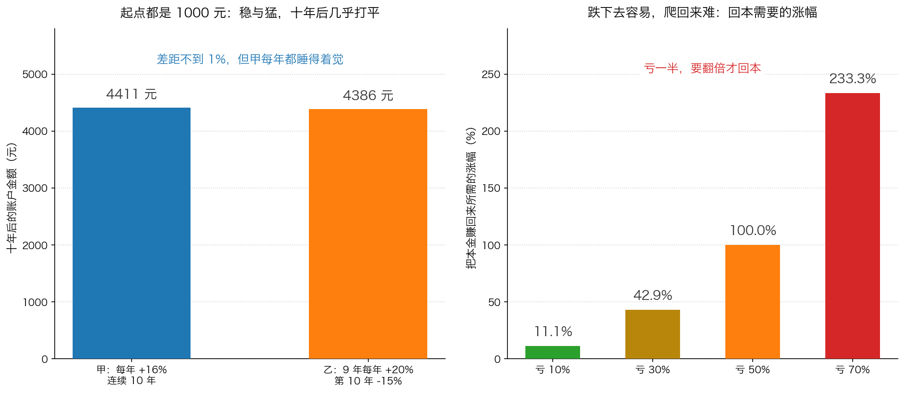

# 第 0 章：不要亏钱——第一条原则

> 本章你将：
> - 看懂巴菲特那两条听起来像玩笑的原则，为什么是整本书的地基
> - 用一张手算表算出：一次大亏要多少年才补得回来
> - 知道为什么"给回报设目标"是有害的，以及应该改成给什么设目标
> - 认识本周第一个新名词：**无风险利率**，以及它为什么是你所有投资的起跑线
> - 明白"为一场一个世纪只来一两次的灾难买保险"是什么意思
> - 最后回答：这条原则怎么变成你账户里的一个具体动作

Week 6 讲完垃圾债的崩溃之后，卡拉曼在那一章的结尾留下了一句话：

> "我们将在下一章中看到，避免损失是投资获得成功最重要的先决条件。"（p92）

从这一周开始，我们跟着他翻到书的第二部分。前六周我们看的都是"别人是怎么亏钱的"，
现在开始看"那到底该怎么办"。而所有办法的第一条，是一句听上去像废话的话。

---

## 0.1 两条听起来像玩笑的原则

卡拉曼在第五章开头引用了沃伦·巴菲特常说的两条投资原则：第一条是"不要亏钱"，
第二条是"永远也不要忘记第一条原则"。他说，自己也认为防止出现亏损应是每个投资者的主要目标：

> "我也认为防止出现亏损应是每个投资者的主要目标。这并不意味着投资者应永远也不要承担任何可能出现亏损的风险。"（p94）

他接着解释了那句话到底指什么：所谓"不要亏钱"，是说经过几年之后，
投资组合中的本金不应出现明显亏损（p94）。

很多人第一次听到"第一条原则是不要亏钱，第二条是不要忘记第一条"会觉得这是句俏皮话，
等于什么都没说。但把卡拉曼后面那句话读进去，你会发现这是一条**有具体内容的原则**。
它里面藏了三个限定词，每一个都在替你把话说清楚：

| 限定词 | 它排除了什么 | 它到底在说什么 |
|---|---|---|
| **几年之后** | 不是"每天不亏""每个月不亏" | 允许你短期浮亏，看的是几年的结果 |
| **本金** | 不是"少赚一点" | 亏掉的必须是你投进去的本钱，而不是没赚到的钱 |
| **明显亏损** | 不是"一点都不许亏" | 亏 5% 和亏 50% 是两件完全不同的事 |

> 💡 **换个说法：** 这条原则不是"不许出门"，而是"出门别出大事故"。
> 你开车不会因为怕撞车就永远不上路，但你会系安全带、不闯红灯、不酒后开车。
> 投资里的安全带，就是后面几章要讲的安全边际。

> ⚠️ **易踩坑：** "不要亏钱"**不等于**"只买不会跌的东西"。
> 卡拉曼说得很清楚：不意味着永远不承担任何可能亏损的风险。
> 一个什么都不做的人确实不会亏钱，但他也会被通货膨胀慢慢吃掉购买力——
> 那也是一种亏，只是亏得不那么明显。

> 🇨🇳 **落到 A 股/港股：** 你身边一定有这样的账户故事：三年赚得很热闹，
> 第四年一把亏回去，账户比三年前还少。这不是运气问题，是算术问题。
> 下一节我们把这道算术题算给你看。

---

## 0.2 复利：慢慢赚，才是真的快

先说一个词：**复利**（也叫复合回报）。

**生活里的例子：** 你把 1000 元存进一个每年给你 10% 利息的地方。
第一年结束你有 1100 元。第二年，那 10% 不是按最初的 1000 元算，而是按 1100 元算，
于是你有 1210 元。第三年按 1210 元算，得到 1331 元。第一年多出来的那 100 元，
从第二年起也开始替你赚钱了——这就是复利。

**准确定义：** 赚到的钱不取出来，留在里面继续一起赚，让"利滚利"。

**A 股里的表达：** 你在券商账户里看到一只基金或一只股票的"累计收益"，
如果它是把分红又投回去算出来的，那个数就体现了复利；很多行情的默认设置是"不复权"，
它不反映复利的效果，这一点以后看数据时要留意。

卡拉曼在书里放了一张表（原书表 2，p96），算的是 1000 美元在不同回报率、
不同年限下能变成原来的多少倍。表里的数字可以照抄，我们先感受一下它的力量：

| 复合回报率 | 5 年 | 10 年 | 20 年 | 30 年 |
|---|---|---|---|---|
| 6% | 1.338 倍 | 1.791 倍 | 3.207 倍 | 5.743 倍 |
| 8% | 1.469 倍 | 2.159 倍 | 4.661 倍 | 10.063 倍 |
| 10% | 1.611 倍 | 2.594 倍 | 6.727 倍 | 17.449 倍 |
| 12% | 1.762 倍 | 3.106 倍 | 9.646 倍 | 29.960 倍 |
| 16% | 2.100 倍 | 4.411 倍 | 19.461 倍 | 85.850 倍 |
| 20% | 2.488 倍 | 6.192 倍 | 38.338 倍 | 237.376 倍 |

（表中数字为原书表 2 的原始数值，单位是"变成原来的多少倍"，见 p96。）

请盯着 10% 那一行看：30 年 17.449 倍。也就是说，1000 元变成 17449 元，
中间**你什么都没做**，只是让钱留在里面继续赚。这就是卡拉曼那句话的意思：

> "坚持获得哪怕是相对一般的回报率是让你的资产实现复合增长的最重要因素。"（p96）

注意这句话里最扎人的四个字：**相对一般**。不是"惊人的回报"，是"一般但坚持得住"。

继续往下读，卡拉曼给了一个让人意外的对比：

> "例如，一名在10年内连续获得16%回报率的投资者最终的财富，居然比一个连续9年获得20%年回报率却在第十年损失15%的投资者的财富要多，这一结果可能会让人感到意外。"（p96）

我们来验证这件事（完整的手算过程在后面的"算一算"里）：

- 甲：10 万元，每年 +16%，10 年 → 10 万 乘以 4.411 = **44.11 万元**
- 乙：10 万元，前 9 年每年 +20%，第 10 年 -15% → 10 万 乘以 5.1598 乘以 0.85 = **约 43.86 万元**

甲赢了。而且甲赢得很"无聊"：他每一年的成绩单都不如乙，整整 9 年。
乙在第 9 年结束时账户里有 51.6 万元，比甲多出十几万；
但第 10 年那一下 -15%，把优势抹掉了。

**为什么这个故事值得记住？** 因为它说明：**决定长期结果的，主要不是某一年有多猛，
而是有没有哪一年被打残。** 而"被打残"这件事，是可以主动避免的。

---

## 0.3 为什么一次大亏这么难补回来

再往深处看一层。亏损和盈利之间，有一个不对称：

- 你亏掉 10%，要涨 11.1% 才回本；
- 亏掉 30%，要涨 42.9%；
- 亏掉 50%，要涨 100%；
- 亏掉 70%，要涨 233.3%。

道理很朴素：你的本金变小了，而涨幅是按变小的本金算的。
100 元亏到 50 元，从 50 元涨回 100 元，需要涨 50 元，
而 50 元相对 50 元本金，就是 100%。

卡拉曼由此推出一个必然的结论：

> "由复利的重要性可以推断出一个必然的结论，那就是即使只出现过一次巨额亏损，也很难让你恢复过来，因为这种亏损会让之前好几年所获得的投资成功的巨额回报毁于一旦。"（p96）

> 📌 **划重点：** 亏损不是"少赚"，它是**从账户里拿走了一部分未来的赚钱能力**。
> 亏 50% 意味着你未来所有的收益都要先用来填这个坑。所以"避免损失"不是保守，
> 它是**最稳妥的获利方式**——这正是卡拉曼在第五章要论证的核心。

---

## 0.4 为什么多数人做不到

既然道理这么清楚，为什么大多数人做不到？卡拉曼给了两个原因。

**第一，我们身体里都有一个投机者。**

> "尽管没人希望蒙受损失，但你却无法从多数投资者和投机者的行为中证实这一点。存在于我们多数人体内的投机欲望非常强烈，能够获得免费午餐的诱惑非常吸引人，尤其是当其他人似乎已经分享到了免费午餐的时候。"（p94）

**生活里的例子：** 小区微信群里有人说某个东西赚钱，一开始你不信；
后来发现楼上邻居真的赚了，你开始动摇；再后来大家都在赚，
你终于忍不住进去了——通常是在最贵的时候。这不是你笨，这是人的默认设置。

**第二，流行观念把"风险"讲反了。**

> "今天许多人相信风险不是来自于拥有股票，而是来自于没有购买股票。"（p94）

这句话讲的是那种"不买就踏空"的焦虑。它的逻辑是：
股票长期回报比债券和存款高，所以拿着现金才是风险。
卡拉曼承认这句话里有对的部分——股票长期确实比债券回报高——
但他马上补上了关键的半句：

> "风险得视支付的价格而定。"（p95）

**这一句是整章的枢纽。** 同一只股票，在 10 元时是一种风险，
在 60 元时是另一种完全不同的风险。当你用"股票长期会涨"这个正确的结论，
去论证"任何价格买入都对"时，你就把一件对的事推到了错的地方。

卡拉曼还举了一个更极端的例子来说明"风险"到底该怎么感受（p95）：
如果你有 1000 美元，你会在一次公平的掷硬币里把它押上，赢了翻倍、输了归零吗？
大概不会。那如果是你一生的财富呢？当然更不会。
再换一个：赢 30% 和亏 30% 的概率一样，你干不干？很多人也不干——
因为亏 30% 会让生活质量明显下降，而赚 30% 并不会让生活明显变好。

> 💡 **换个说法：** 风险和收益在你心里的分量**天生不对等**。
> 亏 1 万元的痛苦，大于赚 1 万元的快乐。这不是缺点，这是人性。
> 既然改不掉人性，那就顺着它设计策略：把"不亏大钱"放在第一位。

> 🇨🇳 **落到 A 股/港股：** "风险来自没有买股票"这句话，在 A 股最典型的表现就是
> **满仓**和**加杠杆**。满仓的人不是不知道风险，而是怕踏空。
> 而借钱买股票（融资）的人，相当于在掷硬币的游戏里又加了一层赌注：
> 一旦下跌，你会被迫在最坏的价位卖出。Week 5 我们讲过机构被迫满仓的镣铐，
> 个人投资者最大的优势本来是"可以空仓等待"，一旦满仓，这个优势就自己扔掉了。

---

## 0.5 别给回报设目标，给风险设目标

很多人做投资是从定目标开始的："我今年要做到 20%。"

卡拉曼对这种做法很不客气：

> "设定目标并不会对实现目标提供任何帮助。"（p98）

他的论证很直接：目标只是愿望，不是方法。声明"我希望每年赚 15%"，
既没有告诉你买什么，也没有告诉你什么时候买。

紧接着他给了一个很妙的对比：

> "投资回报与你工作时间多长、工作多么努力或者赚钱的愿望有多强烈无关。"（p98）

**生活里的例子：** 一个挖沟的工人，多干一小时就多拿一小时的钱；
一个计件工人，多做一件就多拿一件的钱。他们的收入和工作量直接挂钩。
但投资者不是这样。你在电脑前坐 10 个小时，研究到凌晨两点，
你的股票也不会因此多涨一分钱。市场根本不知道你有多努力。

更糟的是，设定回报目标会**改变你的注意力方向**：你会开始只盯上涨空间，
忽略下跌风险。因为只有上涨才能让你"完成目标"，下跌只会让你"没完成"。
于是你会不自觉地去找那些波动更大、故事更性感的东西——
因为它们看起来才有可能实现你写下的那个数字。

卡拉曼给出的替代方案是：

> "投资者应当对风险设定目标，而不是给回报设定一个目标，哪怕这个目标非常合理。"（p99）

**把这句话翻译成动作：**

| 错误的目标写法 | 正确的目标写法 |
|---|---|
| 我今年要赚 20% | 我这一笔最多能接受亏 20%，再多就说明我看错了 |
| 我要跑赢大盘 | 我要确保任何一笔投资都不至于让我的总资产出现明显亏损 |
| 我要买下一年涨最多的 | 我要买下"就算我判断错了，也不会伤筋动骨"的 |

> ⚠️ **易踩坑：** 很多人把"目标收益率"当成"应得收益率"，
> 然后拿这个数字去判断贵还是便宜——"它未来每年能涨 20%，所以现在这个价不贵"。
> 这是把自己写的愿望当成了估值依据。Week 9 讲贴现率的时候我们会再回到这个坑。

---

## 0.6 无风险利率：所有投资的起跑线

卡拉曼在 p99 提出了一个判断标准，我们先要解释里面的一个词。

**无风险利率**是什么？

**生活里的例子：** 你把钱存进一家大银行的定期，或者买一张国家发行的债券
（债券就是一张借条：国家向你借钱，约定到期还本、按年付息），
到期拿回本息这件事几乎不会出问题。这件事能给你的那个利息率，就是无风险利率。

**准确定义：** 最接近"无风险"的那种投资所能提供的回报率。
原书里用的是美国短期国库券的利率，因为在作者写作的年代，那是他认为最接近无风险的投资。

**A 股/港股里的表达：** 中国投资者常拿**国债收益率**、
大银行的**定期存款利率**，或者**货币基金**（比如很多人熟悉的"余额宝"类产品）的
七日年化收益率来当这个基准。它们不是严格意义上的"零风险"，
但作为"我这笔钱放着不动大概能拿到多少"的参照，够用了。

有了这条起跑线，卡拉曼的规则就变得非常清楚：

> "因投资者总是可以选择将自己所有的资金投到美国短期国库券上，只有在取得较那些无风险回报更高的回报的前景非常明确时，才可以进行有风险的投资。"（p99）

**手算示例（示意数字）：** 假设无风险利率是每年 3%。
你正在看的一只股票，你估算它未来能给你每年 8% 的回报。
那么这多出来的 5%，就是你承担风险所换来的**补偿**。
现在问自己一个问题：为了这 5%，我要接受"这家公司可能业绩腰斩、
股价可能跌 40%、而且我可能两年都等不到它涨回来"这些可能性——
这笔交易划算吗？

如果答案是"不划算"，那么正确动作不是"降低一点要求"，而是**不买**。
这就是"给风险设目标"的具体用法。

> 📌 **划重点：** 无风险利率不是让你去买国债，它是你的**门槛**。
> 任何有风险的投资，都必须先跨过这道门槛，再谈值不值得。

---

## 0.7 为"一个世纪一两次"的灾难买保险

看到这里，你可能会想：既然这么怕亏，那是不是干脆空仓最安全？

卡拉曼的回答分两半。第一半，他讲了一个我们都很熟悉的道理：

> "河水漫过堤岸的情况一个世纪内可能只出现一两次，但你依然每年会为自己的房屋购买防洪险。"（p97）

**生活里的例子：** 你家住在河边。历史上这条河一百年才漫过一次堤，
你完全可以说"我这一辈子大概率碰不上"。但你多半还是买了保险，
因为一旦碰上，损失是你承受不起的。保费很贵吗？不便宜。
但它买的是"碰上了也不会归零"。

投资里一模一样的逻辑：重大亏损不常发生，但一旦发生就会毁掉你多年的积累。
所以你需要提前为它付费——这笔"保费"的形式，就是**放弃一部分短期回报**：
在市场很热的时候留一部分现金，不去追那个看起来最诱人的机会。

> "那些试图避免损失的投资者必须让自己在各种情况下存活下来，甚至实现繁荣。"（p97）

注意这句话的结尾是"甚至实现繁荣"，不只是"活下来"。

第二半，也是很多人忽略的一半：**避免损失本身不是一个完整的投资策略。**
卡拉曼紧接着就提醒读者，规避亏损不意味着你该把全部资金拿去买国债或者黄金。
它回答的是"哪些事不能做"，还没有回答"该买什么"。后面几章才会补上答案。

> ⚠️ **易踩坑：** 把"不要亏钱"理解成"永远拿着现金"，是走到了另一个极端。
> 现金的作用是**保险和弹药**：让你在市场崩下来的时候还有钱可动，
> 让你在需要用钱的时候不必被迫卖出。它不是目的。

---

## 0.8 这条原则怎么落到你的账户上

把第五章的内容翻译成你能立刻执行的四个动作：

1. **先写风险，后写收益。** 每一笔买入之前，写下一句话：
   "如果我看错了，最坏情况下这笔钱会亏掉多少？我能不能承受？"
   写不出这句话，就别下单。
2. **不用借来的钱买股票。** 杠杆会把"暂时下跌"变成"永久损失"——
   因为你会被迫在最低点卖出。
3. **给自己留出"防洪险"仓位。** 具体留多少由你的情况决定，
   但只要这笔钱是你三五年内要用的（买房、结婚、看病），它就不该出现在股票账户里。
4. **把成绩单的时间单位改成"年"，不是"天"。** 卡拉曼的第一条原则里的
   "几年之后"不是修辞，它是这条原则能成立的前提。

> 🇨🇳 **落到 A 股/港股：** 上面这几个动作在中国的语境里对应三件事：
> 不融资、不满仓、不用短期要用的钱。做到这三条，
> 你已经避开了散户亏损原因里最常见的几个。

---

## ✍️ 想一想

1. 如果"不要亏钱"是第一条原则，那么"永远不买股票"是不是就永远不会亏钱？
   如果是，这样做你付出了什么代价？如果不是，那"不亏钱"到底在防什么？
2. 一个朋友跟你说："我今年的目标是赚 30%。" 你会问他哪三个问题，
   帮他把这句话改成一个更有用的目标？
3. 为什么"别人都在赚钱"的时候，坚持避免损失最难？
   这时候你最容易被什么样的理由说服？

> 💡 **参考思路：**
>
> 1. 从"账面上不亏"的角度看，永远不买股票确实不会亏本金。但你付出了两样东西：
>    一是**购买力**——物价在涨，现金放着不动，能买到的东西一年比一年少；
>    二是**机会**——企业赚钱的能力长期在增长，完全不参与就完全拿不到这部分。
>    所以"不亏钱"防的不是"价格的短期波动"，而是**本金的永久性损失**：
>    那种让你很多年都翻不过身来的亏。
> 2. 可以问他：① 这 30% 是**必须实现**还是**希望能实现**？如果是必须，那你打算承担多大风险？
>    ② 如果第一年就亏了 20%，你还会继续执行原计划吗，还是会改策略？
>    ③ 这 30% 具体从哪儿来——企业赚的钱、别人更高的出价，还是价格向价值回归？
>    三个问题的指向是同一件事：把"愿望"换成"风险"和"来源"。
> 3. 因为人是比较的动物。当身边有人赚了钱，"避免损失"看起来就像"眼睁睁看着机会溜走"。
>    这时候最有说服力的理由通常是"这次不一样"——行业变了、政策变了、时代变了。
>    卡拉曼的态度是：**未来不可预测**，所以你不能靠"这次不一样"来管理自己的钱，
>    你只能靠"各种情况下都活得下来"来管理。

---

## 🧮 算一算

**情境：** 甲和乙各有 10 万元，都做 10 年。简化起见，假设没有手续费、没有分红。

- 甲：每年 +16%；
- 乙：前 9 年每年 +20%，第 10 年 -15%。

**第 1 步：算甲 10 年后的钱。**

甲每年乘以 1.16，一年一年往后乘：

| 年 | 计算 | 金额 |
|---|---|---|
| 第 1 年 | 10万 乘以 1.16 | 11.60 万 |
| 第 2 年 | 11.60万 乘以 1.16 | 13.46 万 |
| 第 3 年 | 13.46万 乘以 1.16 | 15.61 万 |
| …… | …… | …… |
| 第 10 年 | 10万 乘以 4.411 | **44.11 万** |

（4.411 就是"1.16 连乘 10 次"，也就是原书表 2 里 16% 那一行、10 年那一格的数字，p96。）

**第 2 步：算乙 9 年后的钱。**

乙每年乘以 1.20：

| 年 | 计算 | 金额 |
|---|---|---|
| 第 1 年 | 10万 乘以 1.2 | 12.00 万 |
| 第 2 年 | 12.00万 乘以 1.2 | 14.40 万 |
| 第 3 年 | 14.40万 乘以 1.2 | 17.28 万 |
| …… | …… | …… |
| 第 9 年 | 10万 乘以 5.1598 | **51.60 万** |

**第 3 步：算乙第 10 年亏 15% 之后。**

`51.60 万 乘以 0.85 = 43.86 万`

**第 4 步：比较。**

- 甲：44.11 万
- 乙：43.86 万
- 差距：44.11 - 43.86 = **0.25 万元（约 2500 元）**

甲赢了。而乙在前 9 年里，每年的成绩单都比甲好看。

**第 5 步：把"亏 15%"换成"亏 50%"，再看一次。**

`51.60 万 乘以 0.50 = 25.80 万`

这下乙只剩下 25.80 万，不到甲（44.11 万）的六成。
注意：乙并不是"运气差一点点"，他是**在一次判断失误里被拿走了 25.8 万**。

**第 6 步：乙要多久才能追回来？**

从 25.80 万涨回 51.60 万，需要翻倍，也就是涨 **100%**。
如果乙之后每年能赚 16%，那要多久？

- 1 年：25.80 乘以 1.16 = 29.93 万
- 2 年：29.93 乘以 1.16 = 34.72 万
- 3 年：34.72 乘以 1.16 = 40.27 万
- 4 年：40.27 乘以 1.16 = 46.72 万
- 5 年：46.72 乘以 1.16 = 54.19 万

**大约 5 年**，才能回到他第 9 年结束时的水平。而在这 5 年里，甲又往前走了。

> 📌 **这一步算完，你就摸到"避免损失"的实质了：**
> 它不是在保护你的心情，它是在保护你的**时间**。

---

## ✅ 小测验

**1. 卡拉曼说"不要亏钱"，他的意思最接近下面哪一项？**
A. 永远不要买入任何可能下跌的股票
B. 经过几年之后，投资组合中的本金不应出现明显亏损
C. 每一笔投资都必须赚钱，否则就是失败
D. 只买国债和银行存款

**2. 关于复利和亏损，下面哪个说法符合原书的意思？**
A. 一年赚 20% 的人，最终一定比一年赚 16% 的人有钱
B. 连续 9 年每年 +20%、第 10 年 -15% 的人，最终财富超过连续 10 年每年 +16% 的人
C. 一次巨额亏损会把之前好几年积累的成果毁掉，所以稳定的回报比大起大落更重要
D. 亏 50% 之后，只要再涨 50% 就回本了

**3. 卡拉曼认为投资者应该给什么设目标？**
A. 每年的回报率，比如 15%
B. 风险——自己能承受多大的亏损
C. 持有多少只股票
D. 每年交易多少次

> **答案与解析**
>
> **1. B。** 卡拉曼在 p94 明确解释了这句话：不是永远不承担风险，
> 而是"经过几年之后，投资组合中的本金不应出现明显亏损"。
> A 错在把"不要亏钱"读成了"不许波动"——任何股票都会波动；
> C 错在它把投资变成了不许犯错的考试，而卡拉曼整本书都在教你怎么**为犯错留空间**；
> D 走向另一个极端，卡拉曼在 p97 专门提醒：规避亏损不等于把资金全放在国债或黄金上。
>
> **2. C。** 这正是 p96 那段话的结论：一次巨额亏损会让之前好几年的成果毁于一旦。
> A 错在我们刚刚算过——乙前 9 年每年都比甲猛，最后却输了；
> B 说反了，是甲超过乙；D 错在算术：亏 50% 后要涨 **100%** 才回本，
> 因为涨幅是按缩水后的本金算的。
>
> **3. B。** p99 的原话是"投资者应当对风险设定目标，而不是给回报设定一个目标"。
> A 是卡拉曼明确反对的做法——设定目标并不会对实现目标提供任何帮助（p98）；
> C、D 都是手段层面的细节，不是他讨论的目标本身。

---

## 📖 回到原书

- 对应原书 **第五章 明确你的投资目标**，`raw/安全边际-中文版/page_094.md` ~ `page_099.md`（原书 p94–p99）。
- **建议精读：**
  - p94–p95：两条原则的完整表述，以及"风险来自没有买股票"这种流行观念的错在哪；
  - p96：表 2 的复利表，以及 16% 对 20% 那个反直觉的对比；
  - p97–p99：防洪险的比喻、为什么不能给回报设目标、无风险利率作为门槛。
- **可以略读：** p95 里关于股票在企业资本结构中地位的那段（意思是公司清算时股东排在债权人后面），
  知道"股东排在最后、所以要求更高回报"即可，Week 11 讲困境证券时会更细。
- **原书金句（逐字引用）：**
  > "避免损失是确保能获利的最稳妥的方法。"（p94）
  > "风险得视支付的价格而定。"（p95）
  > "坚持获得哪怕是相对一般的回报率是让你的资产实现复合增长的最重要因素。"（p96）
  > "那些试图避免损失的投资者必须让自己在各种情况下存活下来，甚至实现繁荣。"（p97）
  > "投资者应当对风险设定目标，而不是给回报设定一个目标，哪怕这个目标非常合理。"（p99）

下一章我们接着回答一个更具体的问题：既然要避免损失，
那我买下一只股票之后，**钱到底从哪几个地方来**？来源不同，可靠度天差地别。
