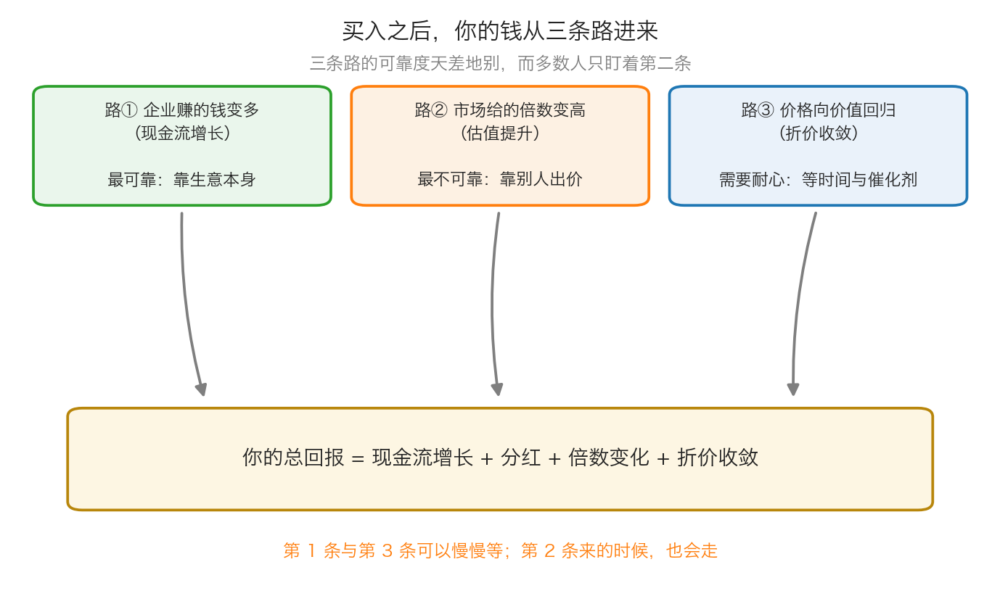
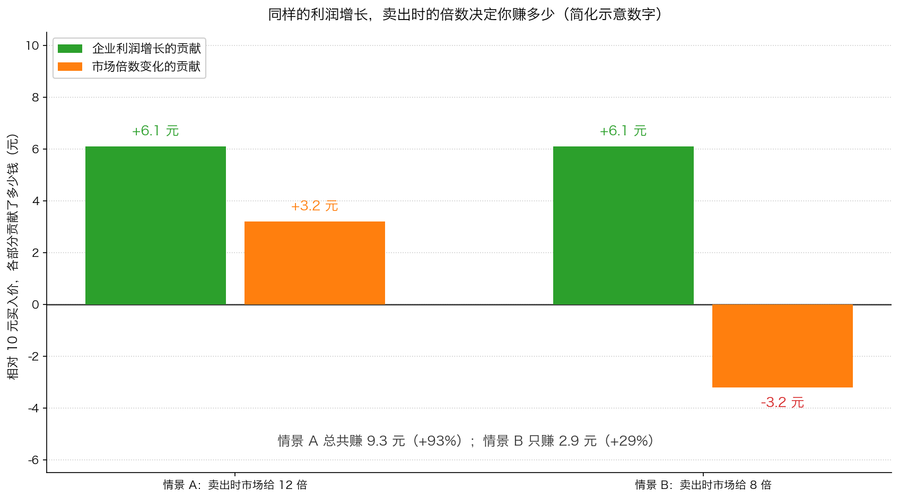

# 第 1 章：收益从哪里来——三种获利方式

> 本章你将：
> - 学会在买入前问出那个最关键的问题："这笔钱到底从哪儿来？"
> - 认清你的回报只有三个来源：企业赚的钱、市场给的倍数、价格向价值回归
> - 看清三个来源的可靠度差多少，以及为什么多数人只盯着最不可靠的那一个
> - 亲手把一笔投资的收益拆成三份，算出每一份贡献了多少钱
> - 知道分红属于哪个来源，以及为什么"高分红"不等于"稳赚"
> - 最后回答：看一只股票时，你会先看它的哪一部分收益

上一章我们说清楚了投资的第一条原则是不要亏钱。但只有"不要做什么"是不够的，
你还得知道"钱从哪儿来"。这一章就把这件事拆开：**买入一只股票之后，
到底有哪几股力量能把钱送进你的账户。**

---

## 1.1 先问一个问题：谁会付钱给你

**生活里的例子：** 假设你花 20 万元盘下一间小店。五年后你靠什么赚钱？

第一种可能：小店每年赚 5 万元，五年赚了 25 万元——这是**生意本身赚的钱**。
第二种可能：小店的生意没怎么变，但这条街突然火了，有人愿意出 40 万元接盘——
这是**别人愿意出的价变高了**。
第三种可能：你当初盘下来的时候，这店其实值 30 万元，只是上一个老板急着出手——
这是**你买得便宜，后来价格回到了它该有的位置**。

股票也是这三条路。理解这一点，你需要先记住股票和债券的一个根本区别。

**债券**你已经在前面见过：它是一张借条，公司按约定每年付你利息、到期还你本金。
**股票**不是借条，它是公司所有权的一小片。这一小片的持有者拿到钱的方式完全不同。
卡拉曼在 p98 是这么写的：

> "同以契约形式固定下来的支付现金的高等级债券不同，股票没有稳定、确定无疑的现金流。"（p98）

他接着说，股票没有到期日，也没有一个到期能拿回的价格。
你买了一张借条，到期那天有人必须还你钱；你买了一片公司，**没有任何人欠你钱**。
这就引出了本章的主线：既然没有人欠你钱，你的回报就必须从别的地方来。

---

## 1.2 第一条路：企业自己赚的钱变多

这是三个来源里最结实的一个。

**生活里的例子：** 你的小店第一年赚 5 万，第二年赚 5.5 万，第三年赚 6 万。
店还是那个店，招牌也没换，但每年装进你口袋的钱确实多了。
如果有一天你想把店转让，别人出价的时候也会参考"这店一年能赚多少"。

**准确定义：** 我们说"现金流增长"，指的是公司经营活动中赚到的现金，扣掉维持这门生意
必须花掉的钱之后，真正能留给股东的部分变多了。这部分钱，公司有两种处理办法：

1. **留在公司里**，拿去开新店、还债、买设备——将来赚更多的钱，股价迟早会反映出来；
2. **分一部分给股东**，这就是**分红**（A 股叫"现金分红"或"派息"）。

所以你可能会看到这样一个公式——"总回报 = 现金流增长 + 分红 + 倍数变化 + 折价收敛"。
它其实是四条，但**分红和现金流增长属于同一条路**：它们都来自企业自己赚的钱。
分红只是把这条路的一部分收益，提前用现金的方式交到你手上。

> 🇨🇳 **落到 A 股/港股：** 这一类公司的典型特征是"生意不性感但很稳"。
> 长江电力（600900.SH）靠水电站发电卖电，收入和成本都很可预测；
> 中国神华（601088.SH / 1088.HK）是煤电一体，长期高分红；
> 贵州茅台（600519.SH）的毛利率长期在 90% 以上，现金回收极好。
> 注意：**稳不等于任何价格都值得买**，那是后面第 3 章要算的事。

---

## 1.3 第二条路：市场愿意给的倍数变高

**生活里的例子：** 还是那间每年赚 5 万元的小店。前几年这条街冷清，别人只肯出
"五年利润"的价格——25 万元。今年街口通了地铁，同样一间店、同样每年赚 5 万元，
别人肯出"十年利润"——50 万元。

**生意一分钱没变，转让价翻了一倍。** 多出来的那 25 万元，不是你赚来的，是别人愿意给的。

**准确定义：** 这里的"倍数"就是**市盈率**（P/E）——股价除以每股每年赚的钱。
它是市场愿意为"一元利润"付多少钱。市盈率从 5 倍涨到 10 倍，
就叫**估值提升**；从 10 倍跌到 5 倍，就叫**估值收缩**。

这一条路为什么不可靠？因为它**完全取决于别人怎么想**。
公司的利润没变，只要愿意出价的人变少、变谨慎、或者干脆没钱了，
你的账面收益就会消失。更麻烦的是，它可以在很短时间内发生：
市场情绪的转向不需要任何新消息。

> ⚠️ **易踩坑：** 很多人算收益的时候，心里默认"我买的时候是 20 倍，
> 将来它还会是 20 倍，甚至 30 倍"。这等于把收益的一大块，建立在一个自己完全控制不了的
> 变量上。第 4 章我们会看到一个真实案例：一家公司的股价在一年多里涨了 30 多倍，
> 而其中**最主要的贡献来自投资者愿意给的估值变了**，不是公司生意变好了（p111）。

---

## 1.4 第三条路：价格向价值回归

**生活里的例子：** 你在旧货市场看到一把椅子，标价 200 元。你恰好懂行，
知道它是某个老师傅的作品，正常能卖 800 元。你买下来。
但你买完的那天，它不会自动变成 800 元——**你得等**：
等到有人认出它的价值，或者等到你把它的来历讲清楚，或者等到你把照片挂在网上。

**准确定义：** 当市场价格明显低于企业的内在价值时，那个差距就是**折价**。
折价收敛，指的是价格慢慢回到价值附近的过程。这个过程不是自动发生的，
它通常需要两个条件之一：

1. **时间**：市场慢慢发现真相；
2. **催化剂**：某个具体事件把价值"捅"出来，比如公司被收购、分拆子公司、
   大额回购、大比例分红、清算。这个词本周还会反复出现。

卡拉曼在 p115 把这件事说成价值投资的一条中心原则：

> "价值投资的一个中心原则就是随着时间的推移，潜在价值总是趋向于反映在证券价格之中，或者股东们最终认识到这一价值。"（p115）

注意这里的关键词是"随着时间的推移"。它意味着：**这条路能赚钱，
但它不承诺什么时候兑现。** 你可能要等一年，也可能要等三年。
如果你用的是明年要买房的钱，你根本等不起——这也是第 0 章那条原则的意义。

---

## 1.5 三个来源的可靠度，差得非常远

把三条路放在一张表里对比，差别一目了然：

| 来源 | 靠谁 | 你能否控制 | 需要多久 | 可靠度 |
|---|---|---|---|---|
| ① 企业赚的钱变多（含分红） | 公司的生意 | 影响很小，但**可以挑选** | 以年计 | **最可靠** |
| ② 市场给的倍数变高 | 别人的情绪和资金 | 完全不能控制 | 随时可能发生，也随时可能消失 | **最不可靠** |
| ③ 价格向价值回归 | 时间 + 催化剂 | 可以判断，不能催促 | 常常比你想的久 | **中等，需要耐心** |

有一句很实在的话可以概括这张表：**你赚企业赚的钱，是"挣"来的；
你赚别人出的价，是"等"来的；你赚折价收敛，是"熬"来的。**

那么问题来了：既然第一和第三条路更可靠，为什么我们还会被第二条路牵着走？
因为第二条路**来得最快、看起来最轻松**。一家公司利润每年增长 10%，
股价一年涨 40%，多出来的 30% 就是市场给的。周围人看到的是"这只股票一年涨了 40%"，
于是都去买，推动倍数进一步上升——直到某一天不再上升。

> 📌 **划重点：** 挑选投资机会时，先问："如果市场永远不给它更高的倍数，
> 我还能赚到钱吗？" 如果答案是"不能"，那你买的其实是第二条路，
> 也就是把命运交给了别人。

---

## 1.6 把一笔投资的收益拆开算

现在我们来做一个拆解。这是本章最重要的一次练习，**全部数字都是简化示意数字**，
你可以拿纸笔跟着算：

**设定：** 你以每股 10 元买入一家公司。此刻它每股每年赚 1 元，
所以市盈率是 10 倍（10 ÷ 1）。你打算持有 5 年。
为了讲清结构，先假设公司不分红、把赚来的钱都留在生意里。

**第一步：5 年后它每股能赚多少？**
假设利润每年增长 10%，一年一年往后乘：

| 年 | 计算 | 每股利润 |
|---|---|---|
| 今天 | — | 1.00 元 |
| 第 1 年 | 1.00 乘以 1.1 | 1.10 元 |
| 第 2 年 | 1.10 乘以 1.1 | 1.21 元 |
| 第 3 年 | 1.21 乘以 1.1 | 1.33 元 |
| 第 4 年 | 1.33 乘以 1.1 | 1.46 元 |
| 第 5 年 | 1.46 乘以 1.1 | **1.61 元** |

**第二步：如果 5 年后市场还是只肯给 10 倍呢？**
`1.61 乘以 10 = 16.10 元`。
你赚了 16.10 - 10 = **6.10 元**，收益率 61%，5 年，约合每年 10%。
注意：这个 10% 正好等于公司的利润增速。**估值没变，你赚的就是生意的钱。**

**第三步：如果 5 年后市场愿意给 12 倍呢？**
`1.61 乘以 12 = 19.32 元`。你赚了 **9.32 元**，收益率 93%。
多出来的 3.22 元，来自倍数的提升。

**第四步：如果 5 年后市场只肯给 8 倍呢？**
`1.61 乘以 8 = 12.88 元`。你只赚了 **2.88 元**，收益率 29%。
明明公司的利润增长了 61%，为什么你只赚 29%？
因为倍数从 10 掉到 8，吃掉了 3.22 元。

这张图想告诉你一件事：**企业利润增长是你能依靠的部分，
倍数变化是市场随手加上去或者拿走的部分。** 想要提高胜算，就要在买入时
尽量让第二部分的起点足够低——买得便宜，倍数已经很低，
它继续往下走的余地就小了。这个"买得便宜"，就是下一章和第 3 章的主题。

---

## 1.7 分红的正确看法

分红值得单独说几句，因为 A 股和港股有很多投资者是冲着分红买股票的。

**分红是什么：** 公司把赚到的钱拿出一部分，按持股比例分给股东。
比如每股分红 0.5 元，你持有 1000 股，就收到 500 元（税前）。

**股息率**是衡量它高不高的常用指标：一年分红除以股价。
股价 20 元、每股分红 1 元，股息率就是 5%。

分红的好处很直白：它是**现金**，不需要你卖掉股票，也不需要市场配合，
更不依赖别人给出更高的倍数。这就是为什么"高分红"在弱市里特别受欢迎。

> ⚠️ **易踩坑：** 股息率 8% 不等于"每年稳赚 8%"。三种情况会让它落空：
> ① 公司明年利润下滑，分红跟着减少；② 分完红股价会除权（股价相应下调），
> 你拿到的是现金、但持仓市值同步减少，短期总资产没变；
> ③ 更糟的情况是公司借债分红、把家底分光。
> 判断高分红是真便宜还是陷阱，要回到同一个动作：**算一算这个分红靠什么支撑、
> 能持续多久**——这正是第 3 章安全边际要做的事。

> 🇨🇳 **落到 A 股/港股：** 中国神华、长江电力这类公司常年有较稳定的分红记录，
> 常被当作"类债券"持有；而一些周期顶部的行业在利润最高那年给出很高的股息率，
> 第二年就大幅缩水。**看分红，要看它来自哪一年的利润。**

---

## 1.8 三种股票，三种来源

最后，把三条路落到你会在 A 股/港股见到的三类机会上：

| 类型 | 主要靠哪条路 | 你要盯什么 | 例子（案例池） |
|---|---|---|---|
| 稳定现金流型 | ① 企业赚钱 + 分红 | 利润和分红能不能持续 | 长江电力、中国神华 |
| 折价回归型 | ③ 价格向价值回归 | 折价的幅度、有没有催化剂 | 长期破净的中国石油、破净的招商银行 |
| 热门成长型 | ② 倍数提升（常常是主要来源） | 你买入的倍数是否已经很贵 | 那些"故事很好但说不清怎么赚钱"的公司 |

注意这张表里没有"稳赚"的类型。**任何一条路都可能看错**——
所以第 3 章要讲的，才是整套方法的核心：在你判断错的时候，靠什么保护你。

---

## ✍️ 想一想

1. 有人说："这家公司业绩每年都在增长，所以买它肯定不会亏。"
   用本章的三个来源，指出他这句话漏掉了什么。
2. 为什么"估值提升"这一条路，在牛市里最容易让人误以为自己很厉害？
3. 如果你买的一只股票，三年里利润涨了 50%，但股价一分没涨。
   这时候你该做哪些事？（提示：不是"割肉"或"加仓"，而是先做一件事。）

> 💡 **参考思路：**
>
> 1. 他漏掉的是：利润增长只保证第一条路，而你的实际收益 = ① + ② + ③。
>    如果他买入时的市盈率已经很高（比如 50 倍），那么将来即使利润涨了 50%，
>    只要倍数回到 15 倍，股价仍然会跌。公司好不好是一件事，**你付的价格是另一件事**。
> 2. 因为牛市里倍数普遍在上升，几乎所有股票都在涨，你很难分清自己赚的是
>    ①（生意）还是 ②（情绪）。赚了钱会强化"我有眼光"的错觉，
>    于是下一轮你会更敢用高价买入——而这时第二条路恰恰开始反向走。
> 3. 先把当初买入的理由拿出来对一遍：我当时估的价值是多少？靠的是什么？
>    现在这些事实变了没有？如果生意确实按你预期在变好，而价格没动，
>    那么折价变大了（第三条路的机会变厚了）。**先重算价值，再决定动作**——
>    不重算就操作，就是让价格替你做判断。

---

## 🧮 算一算

**情境（简化示意数字）：** 你以每股 20 元买入一家公司。它当前每股每年赚 2 元。
你打算持有 4 年。假设利润每年增长 15%，且公司不分红。

**第 1 步：现在的市盈率是多少？**

`20 ÷ 2 = 10 倍`

**第 2 步：4 年后每股利润是多少？**

一年一年往后乘：

| 年 | 计算 | 每股利润 |
|---|---|---|
| 今天 | — | 2.00 元 |
| 第 1 年 | 2.00 乘以 1.15 | 2.30 元 |
| 第 2 年 | 2.30 乘以 1.15 | 2.65 元 |
| 第 3 年 | 2.65 乘以 1.15 | 3.05 元 |
| 第 4 年 | 3.05 乘以 1.15 | **3.50 元** |

（每一步都四舍五入到分，所以最后一步是 3.05 乘以 1.15 = 3.5075，取 3.50。）

**第 3 步：如果 4 年后市场还是给 10 倍，你赚多少？**

`3.50 乘以 10 = 35.00 元`

收益 = 35.00 - 20 = **15.00 元**，收益率 = 15 ÷ 20 = **75%**。

**第 4 步：把 75% 拆成"企业的"和"市场的"。**

- 企业的贡献：利润从 2.00 涨到 3.50，多出 1.50 元；按买入时的 10 倍算，
  `1.50 乘以 10 = 15.00 元`。也就是说，**这 15 元全部来自企业赚钱**。
- 市场的贡献：倍数没变（10 倍还是 10 倍），所以是 **0 元**。

**第 5 步：如果 4 年后市场给 15 倍呢？**

`3.50 乘以 15 = 52.50 元`，收益 32.50 元，收益率 **162.5%**。

拆一下：

- 企业的贡献还是 15.00 元；
- 市场的贡献 = 32.50 - 15.00 = **17.50 元**。

**看清楚了吗？** 这一笔里，"别人愿意给的价"贡献了 17.50 元，
比企业自己赚的 15.00 元还多。这就是最危险的情形：**你的收益里，
超过一半来自你控制不了的东西。**

**第 6 步：反过来，如果 4 年后市场只给 7 倍呢？**

`3.50 乘以 7 = 24.50 元`，收益 4.50 元，收益率 **22.5%**。

企业的贡献仍是 15.00 元，市场的贡献 = 4.50 - 15.00 = **-10.50 元**。
公司利润涨了 75%，你只赚了 22.5%。

**第 7 步：结论怎么写？**

在纸上写一句话：

> "我买入的市盈率是 10 倍。只要利润按预期增长，
> 就算市场永远只给 10 倍，我也能赚到企业的钱（4 年约 75%）。
> 如果市场给得更多，那是额外的礼物；如果市场给得更少，我会赚得少一些，
> 但只要我不在亏损时被迫卖出，我就不至于亏掉本金。"

这句话的作用是：**把"我需要别人配合才能赚钱"变成"别人不配合我也能赚钱"。**
第 3 章我们会给这句话配上一个更精确的工具。

---

## ✅ 小测验

**1. 三个获利来源里，最不依赖别人情绪的是哪一个？**
A. 企业自己赚的钱变多
B. 市场愿意给的倍数变高
C. 价格向价值回归
D. 别人愿意出更高的价接盘

**2. 你以 10 倍市盈率买入，5 年后每股利润增长到 1.61 倍，但市场只肯给 8 倍市盈率。
你的总收益大约是多少？**
A. 约 61%
B. 约 29%
C. 约 -20%
D. 约 100%

**3. 关于"价格向价值回归"，下面哪个说法符合原书的意思？**
A. 它通常在几个星期内就会发生
B. 它需要时间，往往还需要催化剂
C. 只要足够便宜，就一定会涨
D. 它主要靠公司的利润增长推动

> **答案与解析**
>
> **1. A。** 企业赚的钱来自真实的生意：卖出商品、收到现金。
> B 和 D 其实是同一件事——都取决于别人愿意出什么价，是三个来源里最不可控的；
> C 虽然比 B 可靠，但它需要时间和催化剂配合，不是"自动到账"。
>
> **2. B。** 算一遍：`1.61 乘以 8 = 12.88`，相对 10 元的买入价，收益 2.88 元，
> 即约 29%。A 是把利润增长（61%）当成了你的收益——那是公司的成绩，不是你的；
> C 只有在市盈率跌得更狠时才会出现（比如跌到 5 倍：1.61 乘以 5 = 8.05 元）；
> D 需要市盈率大幅提升。
>
> **3. B。** 卡拉曼在 p115 说的是"随着时间的推移，潜在价值总是趋向于反映在证券价格之中"，
> 并且在 p107 提到要找"拥有能直接帮助实现潜在价值的催化剂"的投资。
> A 错在它给出一个原书没有承诺的时间表；C 把"便宜"当成了上涨的保证，
> 忽略了价值本身可能下跌（第 2 章会详细讲）；D 说的其实是第一个来源。

---

## 📖 回到原书

- 对应原书 **第五章（p94–p99）+ 第六章前半（p100–p103）**，
  `raw/安全边际-中文版/page_094.md` ~ `page_103.md`（原书 p94–p103）。
- **建议精读：**
  - p98–p99：股票为什么比债券更不确定；为什么不能给回报设目标；
  - p100：价值投资的定义，以及"便宜是指用 50 美分买下价值 1 美元"；
  - p103：企业价值为什么会变（信贷周期、通胀与通缩）——这是下一章的重点。
- **可以略读：** p96–p97 关于机构为什么更在意相对排名的讨论（Week 5 已经讲过一遍了）。
- **原书金句（逐字引用）：**
  > "同以契约形式固定下来的支付现金的高等级债券不同，股票没有稳定、确定无疑的现金流。"（p98）
  > "价值投资是一门关于以大幅低于当前潜在价值的价格买入证券，并持有至价格更多地反映这些价值时的学科。"（p100）
  > "价值投资的一个中心原则就是随着时间的推移，潜在价值总是趋向于反映在证券价格之中，或者股东们最终认识到这一价值。"（p115）

下一章我们讲"等待"：既然第三条路需要时间，那么**在等的时候，
你到底该出手多少次**？巴菲特有一个棒球比喻，专治手痒。
