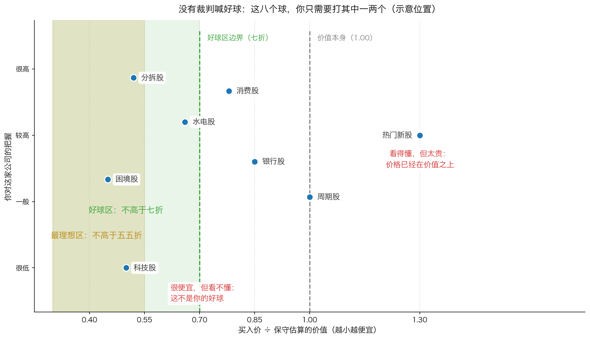
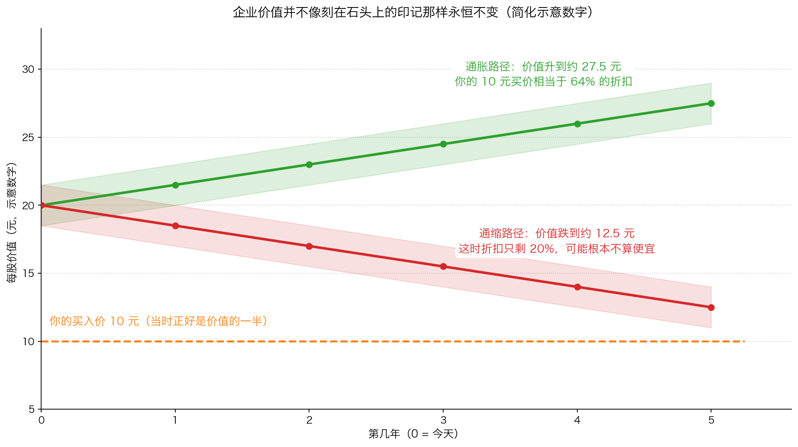

# 第 2 章：等待合适的投球

> 本章你将：
> - 看懂巴菲特的棒球比喻，以及投资和真实棒球最大的区别在哪里
> - 学会区分"好球"和"最理想的好球"，并知道为什么后者才值得你挥棒
> - 拿到一条可以立刻用的比较规则：两笔投资，怎么判断哪笔更值得出手
> - 明白"企业价值本身会动"，因而折扣必须留得更厚——这是第 3 章的最后一层铺垫
> - 知道在通缩担忧下，一个理性的投资者会要求什么样的额外保护
> - 最后回答：手痒的时候，你该拿什么标准来管住自己

上一章我们说了，收益的第三条路——价格向价值回归——需要时间。
既然要等，就会出现一个很实际的问题：**在等的时候，到底该出手多少次？**
这一章讲的，就是"等待"这件事的纪律。

---

## 2.1 没有裁判喊好球的比赛

卡拉曼在 p100 引出了巴菲特的棒球比喻。先说真实棒球里是什么规矩：
投手把球投过来，如果落在**好球区**里而你不挥棒，裁判会喊"好球"；
攒够三个好球，你就被三振出局——**不挥棒是要受罚的**。

投资不是这样。卡拉曼写道：

> "一名专注于长期投资的价值投资者就像是一名正在参加比赛的击球手，比赛中没有出现好球，也没有出现坏球，击球手对几十个，甚至几百个投球都能无动于衷，而其他的击球手会对其中许多的投球挥动球杆。"（p101）

**这句话里最重要的四个字是"没有裁判"。** 没有人会因为你三个月没买股票而判你出局，
没有排行榜因为你空仓而扣你的分，你的账户也不会因为你"错过"了某个机会而自动缩水
（你只是没赚到，而不是亏掉）。你可以站在击球区里，看着几百个球从身边飞过，
一个都不挥。

> 💡 **换个说法：** 在棒球场上，**不挥棒是一种失败**；
> 在投资里，**不挥棒是一种能力**。这是两个规则完全相反的游戏，
> 而很多人把棒球场的规矩带到了投资里——看到球过来就想挥。

看这张图，注意两件事。

**第一，便宜和看得懂是两个条件，缺一不可。** 图右下角那个"科技股"很便宜
（价格只有保守价值的五折），但你的把握很低——它**不是你的好球**。
反过来，"热门新股"你看得懂，但价格已经高过价值，它同样不是好球。
卡拉曼在 p101 说得更直接：

> "价值投资者不会对自己不了解，或者他们认为风险非常大的企业进行投资。"（p101）

**第二，你不需要打很多球。** 图里八个球，既在最理想区、你又看得懂的只有两个。
一年只出手一两次，甚至整整一年不出手，都是正常的。

---

## 2.2 好球区，和最理想的好球

接下来是最容易被忽略的一句：

> "对一名价值投资者而言，球不仅要在他的击球区内，而且必须是在他的'最理想'的击球区内。"（p101）

为什么还要分一层？卡拉曼给了一个非常具体的例子：

> "一只价格仅为潜在价值一半的股票可能很吸引人，但另外一只仅为潜在价值的1/4，因而更加便宜。"（p102）

**手算感受一下：** 假设两家公司的保守价值都是每股 20 元。

- A 公司股价 10 元 → 你付的是保守价值的 50%，便宜了 10 元；
- B 公司股价 5 元 → 你付的是保守价值的 25%，便宜了 15 元。

两家"都便宜"，但 B 给你的缓冲厚得多：**如果价值后来被证明只有 12 元**
（也就是你估高了 40%），A 的安全边际就只剩 2 元（几乎白干），而 B 仍然赚 7 元。
这就是"最理想击球区"的意义：**它不只是更赚钱，它是为你的判断失误留出更大的余地。**

类似地，卡拉曼还提出了一个比较两笔投资的规则：

> "在相等的安全条件下，如果你认为马上可以从另外一项投资中安全地获得15% 的回报，你就不会满足于一项能安全地提供10%回报率的投资了。"（p102）

注意这句话前面那五个字：**在相等的安全条件下**。不是"哪只涨得快买哪只"，
而是"在两笔同样安全的机会里，选回报更高的那个"。安全是前提，比较才有意义。

### 换股：没有一项投资神圣不可侵犯

顺着这个逻辑，卡拉曼要求投资者做一件很多人做不到的事——**不断拿新机会和手上持仓比**。
如果新机会明显更好，就该换过去，哪怕这意味着要卖出现在亏着的股票：

> "当新机会出现时，投资者永远也不应对重新审视当前持有的投资而感到害怕，即使这可能意味着对现在持有的投资进行止损。"（p102）

> ⚠️ **易踩坑：** "换股"不等于"频繁交易"。每换一次，你都要付出成本：
> A 股卖出要交印花税和佣金，港股也有印花税和交易费；更重要的是，
> 换错一次的代价可能远超省下的那点差价。卡拉曼说的换股，
> 前提是新旧两笔机会的**差距足够大**——比如一个便宜 20%、另一个便宜 50%，
> 而不是"这个看起来明天会涨"。

---

## 2.3 好球什么时候多，什么时候少

球不是均匀飞过来的。卡拉曼观察到一个很实用的规律：

> "在恐慌性的市场中，被低估的证券数量会增加，且低估程度也会上升。相反，在牛市中，低估证券的数量及其低估幅度都会下降。"（p102）

**生活里的例子：** 菜市场收摊前，甩卖的摊位会变多，折扣也更大；
而春节前那几天，什么都贵。市场也是一样：恐慌的时候，"打折的公司"扎堆出现；
人人都乐观的时候，你几乎找不到便宜货。

这就带来一个反直觉的结论：**你出手的次数，应该由市场决定，而不是由你的手痒程度决定。**
牛市里找不到好球，那是市场的常态，不是你研究得不够。
卡拉曼把这条纪律说得毫不含糊：

> "最重要的是，投资者必须一直避免回击那些坏球。"（p102）

> 🇨🇳 **落到 A 股/港股：** 为什么个人投资者在这里有优势？因为机构做不到"不出手"。
> 卡拉曼在 p101 点出了这个差别：
> "同价值投资者不同，多数机构投资者感到自己被迫在任何时候都进行满仓投资。"（p101）
> 一只公募基金如果长期空仓，会被渠道和持有人质问；而你的账户没有人管你。
> 这就是你在结构上唯一、但足够大的优势：**你可以等。**（Week 5 讲过这件事的另一半。）

---

## 2.4 企业价值本身会动——这是最要命的一层

前面我们一直默认"保守价值 20 元"是个稳定的数。现在要把这个假设拆掉。
卡拉曼在 p103 用一个很形象的句子开头：

> "企业价值并不像刻在石头上的印记那样永恒不变。"（p103）

他举了几个让价值上下移动的原因，我们挑三个最重要的讲。

**第一个：信贷周期。** 这个词听起来专业，其实很简单——就是"借钱容易还是难"。
借钱容易的时候（利息低、条件松），买公司的人能借到更多钱，愿意出的价自然更高；
借钱难的时候，同样的公司只能卖更低的价。**企业的资产没变，能借到钱的环境变了。**

**第二个：通胀和通缩。** 通胀（物价普遍上涨）时，你持有的自然资源、房地产这类
实物资产的名义价值会上升；通缩（物价普遍下跌）时，它们会下跌。
卡拉曼特别提醒：通胀时期人会变粗心，愿意用 70 美分甚至 1.1 美元去买价值 1 美元的东西（p103–p104）。
**通缩则相反，它会让"50 美分买 1 美元"都变得不再便宜**——因为那个"1 美元"本身在缩水。

**第三个：隐形资产可能变成隐形负债。** 所谓"隐形资产"，是指账面上没体现、
但其实很值钱的东西：比如一个资金充裕的养老金计划、一块记账价远低于市价的土地、
一个被市场忽视的赚钱子公司。危机里这些东西会反过来：股市一跌，养老金从"多出来"变成"不够"；
土地价格一跌，原来的低估消失。**昨天的珠宝，今天可能变成负担。**

卡拉曼把这件事的严重性说得很直白：

> "企业价值持续下降的可能性是插在价值投资心脏上的匕首（对其他投资方法而言，它也不是什么好笑的事情）。"（p104）

### 卡拉曼给出的三种对策

面对"价值会往下走"这件事，他并没有让你放弃，而是给了三条具体的做法（p104–p105）：

1. **永远用保守的假设去估。** 原话是："因为无法预测何时价值会上升或下降，
   投资者应总是给出保守的评估，并对最糟情况下的清算价值以及其他方法给予相当大的重视。"（p104）
   翻译成动作：估值时不要用最乐观的假设，多问一句"如果这门生意不再增长了，它还值多少"。
2. **担心通缩时，把折扣要求提高。** 原话是：
   "对通缩感到担忧的投资者可以在进行新投资或者保持当前头寸的时候，要求获得较正常情况下更多的价格与潜在价值之间的折扣。"（p105）
   正常要求便宜 30%，这种时候就要求便宜 50%。
3. **更重视时间和催化剂。** 因为价值可能在慢慢缩水，
   一个能**尽快**把价值实现出来的事件（分拆、回购、清算、被收购）就变得更重要了。

> 📌 **划重点：** 这三条合起来就是一句话——**你估的价值越不确定，你要的折扣就得越厚。**
> 这句话是第 3 章安全边际的直接入口。

---

## 2.5 手痒的时候，用这张清单管住自己

把本章内容变成一个可以贴在显示器上的清单。每次想下单之前，按顺序问四句：

1. **这个球在我的好球区里吗？**（价格明显低于我保守估算的价值吗？）
2. **它在我"最理想"的击球区里吗？**（有没有另一个机会更便宜、同样安全？）
3. **我真的看得懂这门生意吗？**（如果说不清它靠什么赚钱，这球再便宜也不打。）
4. **如果我不出手，会有什么后果？**（会亏钱吗？还是只是少赚？）
   ——如果答案是"只是少赚"，那你完全可以不挥棒。

---

## ✍️ 想一想

1. 有人说："等了半年都没买，我这不是在浪费时间吗？"
   用本章的棒球比喻回答他，并指出他这个想法里默认了什么。
2. 为什么"最理想击球区"这个概念，对刚学投资的人尤其重要？
   （提示：想一想新手最容易犯的错是什么。）
3. 假设你持有的一只股票已经涨到接近你估的价值，同时你发现另一个机会的
   折价是它的两倍。你该考虑换股吗？换股前必须想清楚哪两件事？

> 💡 **参考思路：**
>
> 1. 他这个想法默认了"不出手就是损失"，也就是把棒球场的规则搬到了投资里。
>    投资里没有裁判：空仓半年只是没赚到，不是亏掉；而如果在没有折扣的时候出手，
>    亏掉的是真金白银。等待不是浪费时间，等待本身就是在筛掉坏球。
> 2. 新手最容易犯的错是"一看到便宜就买"——也就是只看了价格，
>    没看自己懂不懂、也没看有没有更便宜的选择。最理想击球区逼他做两件事：
>    一是比较（有没有更好的），二是承认自己看不懂的东西不能碰。
>    这两个习惯，比抓住某一个机会值钱得多。
> 3. 可以考虑，但要先想清楚：① 新机会是不是**真的**更便宜、更安全，
>    还是只是"看起来会涨"？② 换股的成本（税费、手续费、以及卖出后如果判断错了
>    的代价）有多大？如果两个机会的差距只有一点点，那就不值得动。

---

## 🧮 算一算

**情境（简化示意数字）：** 你有 100 万元。这一年里，市场给你送来了很多"看起来可以买"的机会。
我们比较三种做法，都按一年计算，年末结算。

- **做法 A（忍不住，见球就挥）：** 年初把 100 万全部买进一个"故事很好"的机会
  （它其实是个坏球：价格已经高过价值）。一年后，这笔投资跌了 20%。
- **做法 B（等到好球才挥）：** 前面几个月按兵不动，把钱放在年化 2% 的现金管理工具里。
  到第 8 个月，出现了两个真正的好球，你用 60 万买入（各 30 万）。
  一年结束时，这两笔合计上涨了 45%。剩下的 40 万继续放在 2% 的现金里。
- **做法 C（一直等，结果踏空）：** 你一整年都没出手，钱一直放在 2% 的现金里；
  而这一年市场整体上涨了 15%。

**第 1 步：算做法 A 的结果。**

`100 万 乘以 (1 - 20%) = 100 万 乘以 0.8 = 80 万`

**亏了 20 万，年末 80 万。** 而且注意第 0 章算过的不对称：
从 80 万回到 100 万需要上涨 **25%**。

**第 2 步：算做法 B 的结果。**

先算买进去的 60 万：

`60 万 乘以 (1 + 45%) = 60 万 乘以 1.45 = 87 万`

再算留在现金里的 40 万。这 40 万全年都放在 2% 的现金里
（那 60 万在买入前 8 个月的利息，为简化起见不计）：

`40 万 乘以 1.02 = 40.8 万`

合计：`87 万 + 40.8 万 = 127.8 万`，收益 **27.8 万（+27.8%）**。

**第 3 步：算做法 C 的结果。**

`100 万 乘以 1.02 = 102 万`，收益 **2 万（+2%）**。

**第 4 步：把三个结果排一排，看清代价。**

| 做法 | 年末金额 | 相对 100 万 |
|---|---|---|
| A 见球就挥 | 80 万 | -20 万（-20%） |
| B 等到好球才挥 | 127.8 万 | +27.8 万（+27.8%） |
| C 一直等，踏空 | 102 万 | +2 万（+2%） |

**第 5 步：算"等待的代价"到底有多大。**

做法 C 与做法 B 的差距：`127.8 - 102 = 25.8 万`。
这 25.8 万，就是"该出手时没出手"的代价——也就是踏空的成本。

再看做法 A 与做法 B 的差距：`127.8 - 80 = 47.8 万`。
这是"不该出手时却出手了"的代价。

**第 6 步：结论。**

- 等待确实有代价（最多 25.8 万，在假设的这一组数字里）；
- 但**乱挥棒的代价更大**（47.8 万），而且它还附带了第 0 章讲过的那件事：
  从 80 万爬回 100 万，需要 25% 的涨幅，你还要额外花时间。
- 真正的分界线不是"出手还是不出手"，而是**出手的那个球，在不在你的好球区里**。
  如果一年只有一两个球在好球区，那就只挥一两次——这就够了。

> 📌 **把这道题反过来读一遍：** 如果做法 B 里那两个好球全年都没出现，
> 正确的做法就是做法 C（等），而不是做法 A（凑合买一个）。
> 这就是"没有裁判喊好球"的实际含义。

---

## ✅ 小测验

**1. 巴菲特的棒球比喻里，投资和真实棒球最大的区别是什么？**
A. 投资里的球飞得更快
B. 投资里没有裁判喊好球，你不挥棒不会被三振
C. 投资里必须每次都挥棒
D. 投资里没有好球区

**2. 卡拉曼说球不仅要落在击球区内，还要落在"最理想"的击球区内。他的意思是？**
A. 只买涨得最快的股票
B. 在所有便宜的机会里，还要挑折价最大、安全条件最好的那个
C. 一定要买行业第一名
D. 同一个机会要买两次

**3. 关于"企业价值会变动"，下面哪个说法符合原书？**
A. 企业价值一旦估出来就不会变
B. 企业价值会因信贷周期、通胀通缩、隐形资产的变化而上下移动，所以估值要保守、折扣要更厚
C. 通缩的时候应该要求更小的折扣，因为东西变便宜了
D. 只要公司不分红，价值就不会变

> **答案与解析**
>
> **1. B。** 卡拉曼在 p101 明确说这场比赛中"没有出现好球，也没有出现坏球"，
> 击球手可以对几十个甚至几百个投球无动于衷。A、C、D 都不符合原文；
> C 恰好说反了——投资里你可以一直不挥棒。
>
> **2. B。** p102 的原话是"一只价格仅为潜在价值一半的股票可能很吸引人，
> 但另外一只仅为潜在价值的 1/4，因而更加便宜"。A 错在把"最理想"理解成了"涨得最快"，
> 卡拉曼的比较前提是**相等的安全条件**；C、D 与原文无关。
>
> **3. B。** p103 说得很清楚："企业价值并不像刻在石头上的印记那样永恒不变"，
> p104 还提醒要用保守的评估、重视最糟情况下的清算价值。
> C 说反了：通缩时价值本身在缩水，所以要**更大**的折扣（p105）；
> D 与价值变动的原因无关。

---

## 📖 回到原书

- 对应原书 **第六章前半**，`raw/安全边际-中文版/page_100.md` ~ `page_105.md`（原书 p100–p105）。
- **建议精读：**
  - p100–p101：价值投资的定义与棒球比喻，"最理想击球区"的出处；
  - p102：15% 与 10% 的比较规则、1/2 与 1/4 的对比、换股与"没有一项投资神圣不可侵犯"；
  - p103–p105：企业价值为什么会动，以及三种对策。
- **可以略读：** p103 里"如果可以获得无追索权的低利率融资"那一小段（讲 1980 年代杠杆收购
  如何推高收购价），知道"借钱容易时买家出价更高"就够了，Week 11 会再遇到杠杆收购。
- **原书金句（逐字引用）：**
  > "同价值投资者不同，多数机构投资者感到自己被迫在任何时候都进行满仓投资。"（p101）
  > "一只价格仅为潜在价值一半的股票可能很吸引人，但另外一只仅为潜在价值的1/4，因而更加便宜。"（p102）
  > "最重要的是，投资者必须一直避免回击那些坏球。"（p102）
  > "企业价值并不像刻在石头上的印记那样永恒不变。"（p103）
  > "对通缩感到担忧的投资者可以在进行新投资或者保持当前头寸的时候，要求获得较正常情况下更多的价格与潜在价值之间的折扣。"（p105）

铺垫做完了：便宜、看得懂、折扣要厚、价值还会动。
下一章是这一周、也是整本书的落点——**安全边际**。
